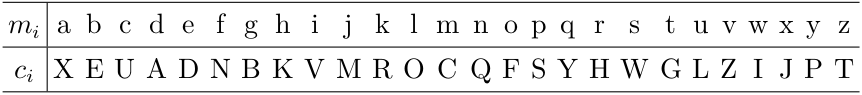
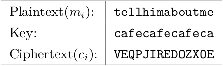
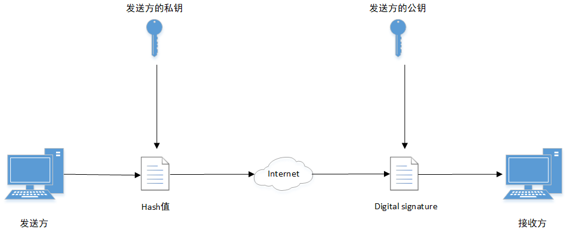

1.The shift cipher 
$Enc_k(m_1\cdots m_\ell)=c_1\cdots c_\ell, \ce{where}\ c_i=[(m_i+k) \mod 26]$ 
$k$ mean letter shift a number between 0 and 25 from alphabet
 
 

2.The mono-alphabetic substitution cipher 

图1 
 

$Enc_k(m_1\cdots m_\ell)=c_1\cdots c_\ell$ 
$m_i$到$c_i$的映射参考图1
 
 

3.The Vigenère (poly-alphabetic shift) cipher 

图2 
 

$Enc_k(m_1\cdots m_\ell)=c_1\cdots c_\ell, where\ c_i=[m_i+(k-a)-26]$ 
参考图2, 使用的Key为cafe(可根据需要加密内容的字符长度, Key可环绕铺设)
 
 

4.digital signature 

图3 
 
