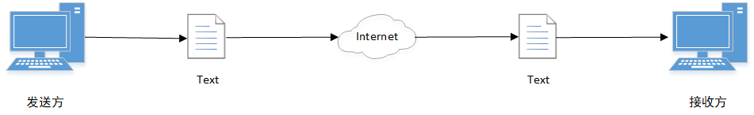
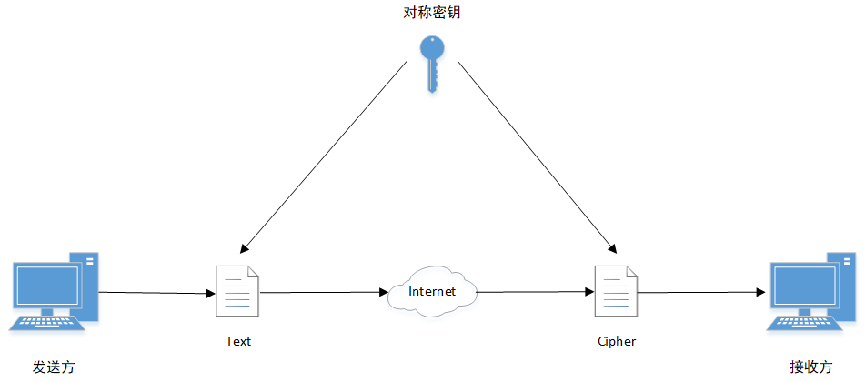
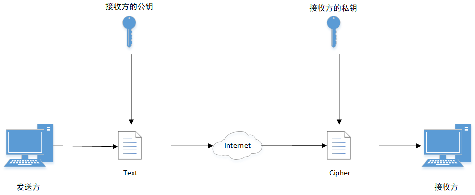
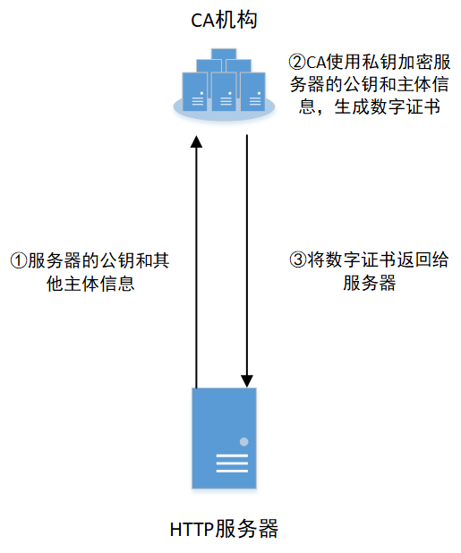
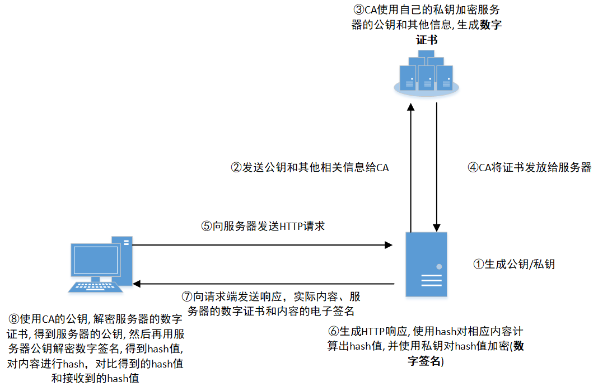

1.明文传输 
如图1 
 
 
 

2.对称加密 
发送方和接收方使用完全一样的秘钥，分别对数据进行加密/解密 
常用的对称加密: DES/3DES/AES 
如图2 

 
 

3.非对称加密 
发送方使用公钥加密，接收方使用私钥解密 
常用的非对称加密: DH/RSA/DSA 
如图3 

 
 

4.数字签名 
发送方使用私钥加密hash值 
如图4 

 
 

5.数字证书 
CA机构使用私钥，对服务器的公钥和主体信息进行签名 
如图5 

 
 

数字签名与数字证书的综合案例 
如图6 

 
 

最后编辑于: 2024-08-14
