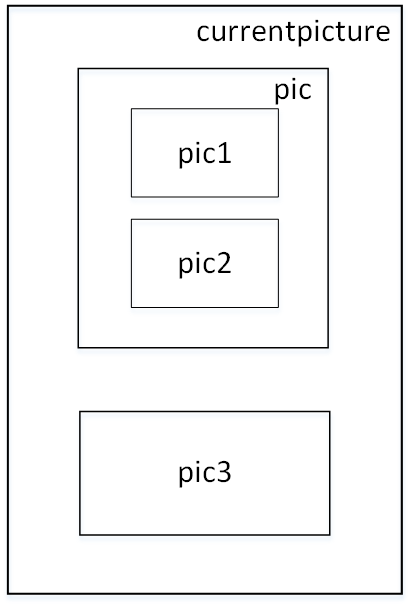

```
默认使用的picture为currentpicture


创建picture
picture pic;


frame pic.fit(real xsize=pic.xsize, real ysize=pic.ysize, bool keepAspect=pic.keepAspect)
    将picture pic内容适配到frame


void add(picture dest, picture src, bool group=true, filltype filltype=NoFill, bool above=true)
    将picture src添加到picture dest, 参数如下:
        group - 是否将picture src的所有元素视为一个整体
        filltype - 填充类型
        above - src图层是否处于dest图层的上方

void add(picture dest=currentpicture, frame src, pair position, pair align, bool group=true, filltype filltype=NoFill, bool above=true)
    将fram src添加到picture dest, 参数如下:
        position - 指定src在dest中的位置
        align - src相对于position的偏移
```
<br>

图1<br>
<br>
```
例1
import settings;
import graph;
outformat="pdf";
pdfviewer="evince";

picture pic1;
size(pic1, 1cm);
fill(pic1, unitcircle, red);

picture pic2;
size(pic2, 1cm);
fill(pic2, unitsquare, green);

picture pic3;
size(pic3, 1cm);
fill(pic3, unitcircle, blue);

picture pic;
add(pic, pic1.fit(), (0,0), N);
add(pic, pic2.fit(), (0,0), 10S);

add(pic.fit(), (0,0), N);
add(pic3.fit(), (0,0), 10S);

示例1结构图如图1
```
