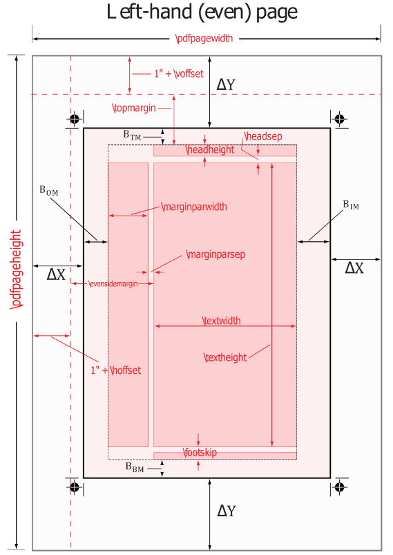

```
Demo_01 -- page struct
\documentclass[a4paper]{article}
\usepackage{calc}
\setlength{\parindent}{0mm}
\newlength{\mylefttext}
\settowidth{\mylefttext}{I love you, do you lo me. No}
\newlength{\myrighttext}
\settowidth{\myrighttext}{I hate you, do you h me. No}
\newlength{\mytop}
\setlength{\mytop}{1in+\topmargin+\headheight+\headsep}
\newlength{\mybottom}
\setlength{\mybottom}{\paperheight-1in-\topmargin-\headheight-\headsep-\textheight}
\newlength{\myleft}
\setlength{\myleft}{\evensidemargin+1in}
\newlength{\myright}
\setlength{\myright}{\paperwidth-\evensidemargin-1in-\textwidth}
\begin{document}
\textbf{paperheight}: \the\paperheight\\
\textbf{textheight}: \the\textheight\\
\textbf{voffset}: \the\voffset\\
\textbf{topmargin}: \the\topmargin\\
\textbf{headheight}: \the\headheight\\
\textbf{headsep}: \the\headsep\\
\textbf{content top margin}: \the\mytop\\
\textbf{content bottom margin}: \the\mybottom\\

\textbf{paperwidth}: \the\paperwidth\\
\textbf{textwidth}: \the\textwidth\\
\textbf{hoffset}: \the\hoffset\\
\textbf{evensidemargin}: \the\evensidemargin\\
\textbf{content left margin}: \the\myleft\\
\textbf{left str length}: \the\mylefttext\\
\makebox[0mm][r]{I love you, do you lo me. No}\\
\textbf{content right margin}: \the\myright\\
\textbf{right str length}: \the\myrighttext\\
\rule{\textwidth}{0mm}\makebox[0mm][l]{I hate you, do you h me. No}
\end{document}


内容讲解
1.如图所示, latex的页面结构. 相关含义如下:
    \hoffset - 垂直基准线偏移边界额外距离, 默认值为0. 总距离为: 1in + \hoffset
    \evensidemargin - twoside页面左侧(偶数)页中, 文本内容与垂直基准线的距离
    \marginparwidth - 边注的宽度
    \marginparsep - 文本内容与边注的距离
    \voffset - 水平基准线偏移边界额外距离, 默认值为0. 总距离为: 1in + \voffset
    \topmargin - 页眉顶部到水平基准线的距离
    \headheight - 页眉的高度
    \headsep - 文本内容与页眉的距离
    \footskip - 文本内容与页脚底部的距离
    \textwidth - 正文文本宽度
    \textheight - 正文文本高度

2.也可调用layout宏包, 当在正文内容处调用\layout命令时, 可显示页面结构布局和参数具体值

3.页眉/页脚/边注可参考footnote部分


Demo_02 -- LaTeX的源文档骨架
\documentclass[11pt]{article}
\begin{document}
    Hello \LaTeX
\end{document}

内容讲解
1.\documentclass[]{}为文档的第一个之类，指定文档类型。其中，参数可分为以下两种情况：
    (1)代表必要参数的{}，该类参数必须进行指定，当有多个必要参数时，必须按顺序进行指定，不能调换顺序
    (2)代表可选参数的[]，该类参数可以指定，也可以省略，当有多个可选参数时，必须按顺序进行指定(不能只省略序列靠前的可选参数，到导致乱序)；可选参数[]也可以由多个可选子参数构成[sub_arg1,sub_arg2...]，由半角逗号分隔，不能留空，顺序可以打乱

2.\documentclass[arg1,arg2,...]{doc_class}指定文档类。参数列表:
    arg<N> - 可选参数的子参。列表:
	10pt | 11pt | 12pt - 指定内容文字大。article/report/book/letter都默认为10p。不支持slides文档类型
	
	letterpaper | legalpaper | executivepaper | a4paper | a5paper | b5paper - 指定输出的页面大，默认为letterpaper(建议使用a4paper。宽x高参数列表如下:
	    letterpaper		8.5in x 11in，614pt x 795pt
	    legalpaper		8.5in x 14in，614pt x 1012pt
	    executivepaper	7.25in x 10.5in，524pt x 759pt
	    a4paper 		210mm x 297mm, 598pt x 845pt
	    a5paper 		148mm x 210mm, 421pt x 598pt
	    b5paper	    	176mm x 250mm, 501pt x 711pt

	landscape - 将页面的宽和高的尺寸交换

	final | draft - draft代表草稿模，在超过宽度内容的结尾右侧使用黑色小方块就行标记; final代表定稿模式，超过宽度内容不进行标。默认为final

	oneside | twoside - oneside代表所有页面统一对齐，article/report文档类型默认选项; twoside代表奇数页偏左对齐，偶数页偏右对齐(偏向书本中心，book文档类型默认选。不支持letter/slides文档类型

	openright | openany - openany代表新chapter可从奇/偶数开，report文档类默认选项; openright代表新chapter只从奇数页开，book文档类的默认选。只支持report/book文档类型(因为article/letter/slides不支持章节)

	onecolumn | twocolumn - 页面分为单栏或双栏排列，默认选项为onecolum。支持article/report/book文档类型. twocolumn相关命令:
        \columnsep - 双栏的距离. 默认为15pt
        \columnwidth - 每一栏的宽度. \columnwidth=(\textwidth-\columnsep)/2
        \columnseprule - 两栏之间的垂直分隔线. 默认为1pt

	titlepage | notitlepage - notitlepage代表标题页和摘要页不另成一，article文档类默认选项; titlepage代表标题生成一个单独，摘要生成单独，report/book/slides文档类默认选项。不支持letter文档类型

	openbib - 参考文献entry的author/title都各占一。不支持slides/letter文档类型

	leqno - equation和eqnarray公式环境的公式编号出现在左。默认为右侧

	fleqn - 行间公式左对，包含统一缩。默认为居中对齐
	    默认行间公式还额外存在缩，可在preamble区域使用\mathindent调整缩，如: \setlength{\mathindent}{2cm}

    doc_class - 文档类，文件名后缀.cl。类型列表: article/report/book/letter/slides或机构自己的cls模板


2.\usepackage[arg1,arg2,...]{pac_name1,pac_name2,...}指定包含额外指令的，包含相同可选参数(或不指定可选参数)的宏包可集中到一个\usepackage命，属于document preamble内容
    arg<N> - 可选参数列表
    pac_name<N> - 导入的包，文件后缀为.sty
    ** package冲突: 根据冲突package出现先后顺，后导入的包覆盖先导入的。当两个包都有同一个指令，出现command '<command>' already defined错误提，可在preamble区使用\let\<command>\undefined取消该指令的定义; 先导入包独有的指令不可用


3.\begin{document}之前的部分为导言(preamble。在该部分的命令，对正文的全文产生影响


4.begin{document} ... \end{document}指定正文内容部。正文的命令，只对命令之后的内容产生影响


5.\end{document}后的所有内容被忽略


6.%之后的当前行内容都是注释


Demo_03 -- 基础结构
\documentclass{article}
\title{simple demo}
\author{steven thompson \and lucy}
\date{\today}
\begin{document}
\maketitle
\tableofcontents
\begin{abstract}
this is abstract information
\end{abstract}
\section{Hello}
	Hello World!!
\section{Introduction}
	Welcome to latex introduction
\end{document}


结构讲解
标题 - \maketitle

目录 - \tableofcontents \listoffigures \listoftables

摘要 - \begin{abstract}...\end{abstract

内容结构
	article document class
	\part                         level0(in article)
    \section                      level1
	\subsection                   level2
	\subsubsection                level3

	report/book document class
	\part                         level-1(in report/book)
	\chapter(only report/book)    level0
    \section                      level1
	\subsection                   level2
	\subsubsection                level3

document类别对应的层级序列:
article - [part] -> section -> subsection...
report - [part] -> chapter -> section -> subsection...	


内容讲解
1.\title{}为标题内容, 必选项

2.\author{}为作者名字，多个名字使用\and表示并列作者, 必选项

3.\date{}为日期, 可选项. 包含以下格式:
    \date{\today} - 当前调用latex的日期, 不用\date命令也会默认显示该日期
    \date{<diy_date>} - 定制化日期以及格式
    \date{} - 不显示日期

4.\thanks{}可用于给title/author/date内容作脚注

5.\maketitle为生成标题的指令，位于正文部分

6.\tableofcontents生成目录索引，包含两个步骤:
	i. 生成.toc文件
	ii.生成目标文件

7.\listoffigures生成entry依据为\begin{figure}...\end{figure}中的\caption内容，\listoftables类似

8.\begin{abstract}...\end{abstract}为摘要信息环境

9.\section[toc_entry]{heading}用于设置节的目录名称(toc_entry)和节名称(heading)，section相关指令中不能包含脆弱(fragile)指令, 如果需要使用脆弱指令, 使用\cprotect指令(包含在cprotect宏包中)对\section(也适用于其他章节标题命令)命令进行保护, 如\cprotect\section{see\verb+\sos+}. \section的fragile指令列表:
    \(    \)    \begin    \end    \footnote    \verb
    ** \footnote不适用于该情况, 因为脚注会携带到页眉/页脚和目录中

10.\section或其他章节命令中携带footnote命令，可使用footmisc宏包, 具体参考04.footnote.txt的Demo_

11.\section*{heading}为section的当前位置不参与编号、不被目录toc收录、不显示到页眉/页脚版本


Demo_04 -- 页眉与页脚版式
\documentclass[twoside]{report}
\pagestyle{headings}
\begin{document}
\chapter{chapter one}
\section{section one}
First line\\
\newpage
Second line\\
\newpage
\section{section two}
Third line\\
\newpage
Fourth line\\
\chapter{chapter two}
\section{section one}
Fifth line\\
\newpage
Sixth line\\
\newpage
\section{section two}
Seventh line\\
\newpage
Eighth line\\
\end{document}

内容讲解
1.\pagestyle{<style>}使用指定版式，使页眉/页脚填充内容, 可用于导言和正文. 列表如下:
    empty - 页眉和页脚都空置
    plain - 页眉空置，页脚居中位置显示页码，无页脚线. article/report类型文档默认版式
    headings - 如果为单页排版，则所有页的页眉左侧放置章标题(如果有)和右侧放置页码; 如果为双页排版，则单数页页眉左侧放置节标题(如果有)和右侧放置页码，双数页页眉左侧放置页码和右侧放置章标题(如果有). 新章节另起一页，并且该页为plain. book类型文档默认版式
    myheadings - 类似于headings，但是headings放置章(节)标题的位置，必须手动内容，配置指令:
        \markright{<odd_page_left_content>}
	\markboth{<even_page_right_content>}{<odd_page_left_content>}

2.\thispagestyle{<style>}只作用于当前页，在正文配置

3.当文档为twoside和openright时，如果章节最后一页为奇数页，则会空出一页偶数页，次数该偶数页仍然携带pagestyle属性；可以在该章节使用如下命令，使其pagestyle为empty:
    \clearpage{\pagestyle{empty}\cleardoublepage}

4.修改页码的计数形式，并且将当前页设置为默认起始页:
    \pagenumbering{<type>}. type列表如下:
        alph - 小写英文字母
	Alph - 大写英文字母
	arabic - 阿拉伯数字
	roman - 小写罗马数字
	Romain - 大写罗马数字
    一般的, 摘要和目录采用大写罗马字母; 正文、参考文献和索引等统一使用阿拉伯数字

5.从当前页面重新开始计数(number指定重新计数的起始数字), 不修改计数形式:
    \setcounter{page}{<number>}

6.更强定制化页眉与页脚，可参考fancyhdr宏包


Demo_05 -- 文本模式
\documentclass{report}
\begin{document}
This is a paragraph mode text.\\
$this is a math mode text. balabalabalabalabalabalasjdksajdlsjdslajdlsjdjsljkdlk catch end morning afternoon number\\ alphnumber$
\mbox{This is a left-to right mode text. balabalabalahahahahahahahahahahahahahahahahahahahahahah\\ah end catch nice}\\
\end{document}

内容讲解
1.段落(paragraph)模式
该模式为常规模式，单词之间可保留最多一个空格，可换行

2.数学(math)模式
常用于数学公式环境，忽略所有空格，可换行

3.LF(left-to-right)模式
类似于段落模式，但不可换行


Demo_06 -- 源文件与子文件
\documentclass{article}
\begin{document}
this is first line
\include{aux.tex}
\end{document}

内容讲解
1.\include{file_name}用于源文件将子文件内容进行读取，特性:
	(1)子文件只能包含正文内容
	(2)子文件开启新page
	(3)不可在子文件中再使用\include导入其他文件，即不可嵌套


Demo_07 -- 正文的命令类型
\documentclass{article}
\setlength{\parindent}{0mm}
\begin{document}
This is {\bfseries line} one\\
This is \textbf{line} two\\
This is \begin{bfseries}line\end{bfseries} one\\
\end{document}

内容讲解
1.声明形式
作用于当前环境内，后续所有内容。格式：\bfseries

2.参数形式
作用于指定的参数内容。格式：\mathrm{}

3.环境形式
作用于限定的环境内。格式：\begin{bfseries} ... \end{bfseries}

4.环境形式和声明形式的命令的名称大致相同


Demo_08 -- 新定义命令
\documentclass{article}
\usepackage{pifont}
\usepackage{graphicx}
\setlength{\parindent}{0mm}
\newcommand{\wrap}[2][1.2]{\scalebox{#1}{\ding{#2}}}
\begin{document}
This is \wrap[1]{172}\\
This is \wrap[1.1]{173}
\end{document}

内容讲解
1.\newcommand{<new_cmd>}[<cmd_arg_number>][<option_arg_default_val>]{<cmd_action>}用于定义新命令。参数如下:
    new_cmd - 新命令的名称，不能以\end起始，不能与已有命令重名
    cmd_arg_number - 新命令的参数个数，可选范围[0，9]。默认为0
    option_arg_default_val - 新命令第一个参数的默认值。如果指定默认值，则第一个参数为可选参数，并且只能一个参数为可选参数
    cmd_action - 新命令的相关定义。可使用#n引用新命令的第n个参数值

2.\providecommand{<new_cmd>}[<cmd_arg_number>][<option_arg_default_val>]{<cmd_action>}作用与\newcommand类似，但是当新命令与已有命令重名时，不出现错误提示，并且新命令暂时被忽略，等待已有重名命令被移除时，新命令可使用

3.\xspace可自动生成空格，除非后续为标点符号。包含在xspace宏包中

4.\ensuremath{<content>}确保content处于math mode，如果命令已处于math mode，则使用纯文本; 如果命令处于paragraph/LR mode，则为$<content>$


Demo_09 -- 重新定义命令
\documentclass{article}
\usepackage{pifont}
\usepackage{graphicx}
\let\oldding\ding
\renewcommand{\ding}[2][1.1]{\scalebox{#1}{\oldding{#2}}}
\setlength{\parindent}{0mm}
\begin{document}
This is \ding[1]{172}\\
This is \ding{173}
\end{document}

内容讲解
1.\renewcommand{<new_cmd>}[<cmd_arg_number>][<option_arg_default_val>]{<cmd_action>}用于对已有命令重新定义。参数如下:
    new_cmd - 命令的新名称，不能以\end起始
    cmd_arg_number - 命令的参数个数，可选范围[0，9]。默认为0
    option_arg_default_val - 命令第一个参数的默认值。如果指定默认值，则第一个参数为可选参数，并且只能一个参数为可选参数
    cmd_action - 命令的相关定义。可使用#n引用命令的第n个参数值


Demo_10 -- 长度设置命令
\documentclass{article}
\usepackage{calc}
\newlength{\micro}
\setlength{\micro}{15pt}
\addtolength{\parindent}{\micro}
%\settowidth{\parindent}{I hate you}
\begin{document}
I love you\\
I hate youI love you
\end{document}

内容讲解
1.\newlength{<new_cmd>}配置一个新的长度命令, 并且长度为0

2.\setlength{<cmd>}{<length>}对长度命令赋予一个指定长度。对应的简化命令：
<cmd>=<length>
length必须为固定数组，不能为四则运算。如果length需要通过四则运算计算得到结果，需要调用calc宏包。简化命令不支持length使用四则运算

3.\addtolength{<cmd>}{<length>}在长度命令原有的长度基础上，增加一个指定长度

4.\settowidth{<cmd>}{<str>}将指定字符串的长度，赋予长度命令

5.长度length可以使用弹性长度。如：5pt plus 1pt minus 1pt代表弹性长度范围[4,6]

6.\the<cmd>可显示出当前长度命令的值。如：\the\parindent可指出当前\parindent的值
```
