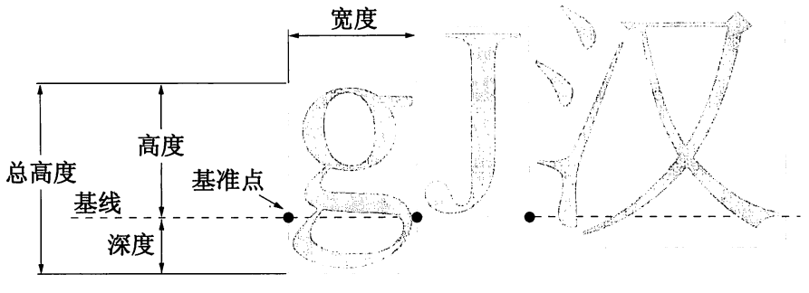

<br>
```
一、左右盒子
Demo_01 -- mbox
\documentclass{article}
\begin{document}
This is \mbox{\bfseries a long} line
\end{document}

内容讲解
1.盒子类型列表:
    1)左右盒子
        内容在盒子内不可以换行
    2)段落盒子
        内容可以在盒子内换行，形成段落
    3)线段盒子
        生成指定长和宽度的线条盒子

2.盒子中不能出现\verb或\begin{verbatim}...\end{verbatim}

3.由于盒子被视为一个整体，所以除非特别注明，常规下盒子不能跨页

4.\mbox{<content>}创建一个无边框左右盒子，内容不可换行，盒子的宽度、高度、深度取决于内容


Demo_02 -- fbox
\documentclass{article}
\setlength{\fboxrule}{3pt}
\setlength{\fboxsep}{1cm}
\begin{document}
This is \fbox{\bfseries a very long} line
\end{document}

内容讲解
1.\fbox{<content>}创建一个带边框的左右盒子，内容不可换行，内容与边框的距离默认为3pt，边框的宽度默认为0.4pt

2.相较于\mbox，\fbox比它高2*0.4+2*3=6.8pt，比他宽2*0.4+2*3=6.8pt

3.\fboxrule设置边框的线条宽度，默认为0.4pt。语法：
    \setlength{\fboxrule}{2pt}

4.\fboxsep设置边框与内容的距离，默认为3pt。语法：
    \setlength{\fboxsep}{5pt}


Demo_03 -- makebox
\documentclass{article}
\begin{document}
This is \makebox[5cm][l]{\bfseries a very long} line
\end{document}

内容讲解
1.\makebox[width][position]{content}
    创建一个无边框左右盒子，可指定盒子宽度/内容在盒子中的水平位置。参数如下：
    width - 指定盒子的宽度；可以引用盒子的自然尺寸。列表如下：
        \width - 盒子根据内容获得的自然宽度
        \height - 盒子根据内容获得的自然高度
        \depth - 盒子根据内容获得的自然深度
        \totalheight - 盒子根据内容获得的自然总高度
    position - 用于指定内容在盒子内的位置，可选如下:
	    l - 左对齐
	    c - 居中。默认值
	    r - 右对齐
	    s - 伸展平铺。此时英文字符之间必须有空格


Demo_04 -- framebox
\documentclass{article}
\setlength{\fboxrule}{3pt}
\setlength{\fboxsep}{1cm}
\begin{document}
This is \framebox[5cm]{\bfseries a very long} line
\end{document}

内容讲解
1.\framebox[width][position]{content}
    创建一个边框左右盒子，可指定盒子宽度/内容在盒子中的水平位置。参数如下：
    width - 指定盒子的宽度；可以引用盒子的自然尺寸。列表如下：
        \width - 盒子根据内容获得的自然宽度
        \height - 盒子根据内容获得的自然高度
        \depth - 盒子根据内容获得的自然深度
        \totalheight - 盒子根据内容获得的自然总高度
    position - 用于指定内容在盒子内的位置，可选如下:
	    l - 左对齐
	    c - 居中。默认值
	    r - 右对齐
	    s - 伸展平铺。此时英文字符之间必须有空格

2.\fboxrule设置边框的线条宽度，默认为0.4pt。语法：
    \setlength{\fboxrule}{2pt}

3.\fboxsep设置边框与内容的距离，默认为3pt。语法：
    \setlength{\fboxsep}{5pt}


Demo_05 -- raisebox
\documentclass{article}
\begin{document}
This is \raisebox{1cm}{\bfseries a very long} line
\end{document}

内容讲解
1.\raisebox{<offset>}[<height>][<depth>]{<content>}
    创建一个可上下偏移的无边框左右盒子。列表如下：
        offset - 在垂直方向上的偏移尺寸，正值为向上偏移
        height - 盒子的高度
        depth - 盒子的深度


Example_01 -- 位于页面左侧的盒子
\documentclass{article}
\begin{document}
\noindent\makebox[0mm][r]{\fbox{warning: offset}}\hspace*{\parindent}Alice was beginning to get very tired of sitting by her sister on the bank, and of having nothing to do: once or twice she had peeped into the book her sister was reading, but it had no pictures or conversations in it, `and what is the use of a book,' thought Alice `without pictures or conversation?'
So she was considering in her own mind (as well as she could, for the hot day made her feel very sleepy and stupid), whether the pleasure of making a daisy-chain would be worth the trouble of getting up and picking the daisies, when suddenly a White Rabbit with pink eyes ran close by her.
There was nothing so VERY remarkable1 in that; nor did Alice think it so VERY much out of the way to hear the Rabbit say to itself, `Oh dear! Oh dear! I shall be late!' (when she thought it over afterwards, it occurred to her that she ought to have wondered at this, but at the time it all seemed quite natural); but when the Rabbit actually TOOK A WATCH OUT OF ITS WAISTCOAT- POCKET, and looked at it, and then hurried on, Alice started to her feet, for it flashed across her mind that she had never before seen a rabbit with either a waistcoat-pocket, or a watch to take out of it, and burning with curiosity, she ran across the field after it, and fortunately was just in time to see it pop down a large rabbit-hole under the hedge.
In another moment down went Alice after it, never once considering how in the world she was to get out again.
The rabbit-hole went straight on like a tunnel for some way, and then dipped suddenly down, so suddenly that Alice had not a moment to think about stopping herself before she found herself falling down a very deep well.
\end{document}

内容讲解
1.\noindent\makebox[0mm][r]{}代表无边框盒子不占空间，则盒子左右侧边框都位于页面起始(无缩进，\noindent)，由于与外部内容右对齐，所以内容位于盒子右侧左边，即页面左侧

2.将\framebox{}作为\makebox的实质内容，边框使内容醒目


Example_02 -- 内容重叠
\documentclass{article}
\usepackage{ctex}
\begin{document}
\makebox[0mm][l]{I love you}我爱你
\end{document}

内容讲解
1.\makebox[0mm][l]{}代表无边框盒子不占空间，盒子左右侧位于段落，由于与外部内容左对齐，所以内容位于盒子左侧右边；而盒子不占空间，所以盒子外得内容也从段落起始开始，造成内容重叠
```
<br>
<br>
<br>

```
二、段落盒子
Demo_01 -- minipage
\documentclass{article}
\begin{document}
I see
\begin{minipage}[b][10cm][c]{10cm}
Alice was beginning to get very tired of sitting by her sister on the bank, and of having nothing to do: once or twice she had peeped into the book her sister was reading, but it had no pictures or conversations in it, `and what is the use of a book,' thought Alice `without pictures or conversation?'\\
So she was considering in her own mind (as well as she could, for the hot day made her feel very sleepy and stupid), whether the pleasure of making a daisy-chain would be worth the trouble of getting up and picking the daisies, when suddenly a White Rabbit with pink eyes ran close by her.
\end{minipage}
\end{document}

内容讲解
1.\begin{minipage}[<out_vertical_align>][<height>][<in_vertical_align>]{<width>}...\end{minipage}创建一个无边框段落盒子环境。选项列表如下：
    out_vertical_align - 盒子与外部文本在垂直方向的对齐方式。列表如下：
        c - 盒子的垂直中部与外部文本行对齐
        t - 盒子的头部与外部文本行对齐
        b - 盒子的底部最后一行与外部文本行对齐
    height - 盒子的高度
    in_vertical_align - 内部内容与盒子的垂直对齐方式。列表如下：
        c - 内容与盒子居中对齐
        t - 内容与盒子顶部对齐
        b - 内容与盒子底部对齐
        s - 内容从顶部到底部伸展平铺。行距必须为弹性长度。如：\baselineskip=12pt plus 2pt
    width - 设定盒子的宽度


Demo_02 -- parbox
\documentclass{article}
\begin{document}
I see
\parbox[b][10cm][c]{10cm}{
Alice was beginning to get very tired of sitting by her sister on the bank, and of having nothing to do: once or twice she had peeped into the book her sister was reading, but it had no pictures or conversations in it, `and what is the use of a book,' thought Alice `without pictures or conversation?'\\
So she was considering in her own mind (as well as she could, for the hot day made her feel very sleepy and stupid), whether the pleasure of making a daisy-chain would be worth the trouble of getting up and picking the daisies, when suddenly a White Rabbit with pink eyes ran close by her.}
\end{document}

内容讲解
1.\parbox[<out_vertical_align>][<height>][<in_vertical_align>]{<width>}{<content>}创建一个无边框段落盒子环境。选项列表如下：
    out_vertical_align - 盒子与外部文本在垂直方向的对齐方式。列表如下：
        c - 盒子的垂直中部与外部文本行对齐
        t - 盒子的头部与外部文本行对齐
        b - 盒子的底部最后一行与外部文本行对齐
    height - 盒子的高度
    in_vertical_align - 内部内容与盒子的垂直对齐方式。列表如下：
        c - 内容与盒子居中对齐
        t - 内容与盒子顶部对齐
        b - 内容与盒子底部对齐
        s - 内容从顶部到底部伸展平铺。行距必须为弹性长度。如：\baselineskip=12pt plus 2pt
    width - 设定盒子的宽度

2.不能在内部使用\verb或\begin{verbatim}...\end{verbatim}

3.不能在内部使用脚注相关命令


Example_01 -- 统一缩进
\documentclass{article}
\usepackage{ctex}
\begin{document}
\noindent 楞次定律：\parbox[t]{43mm}{\sl 磁通变化感生的电流的方向是在它能阻止磁通变化的方向上。}
\end{document}
```
<br>
<br>
<br>

```
三、线段盒子
Demo_01 -- rule
\documentclass{article}
\begin{document}
This is a \makebox[2mm][l]{\rule[-2pt]{1cm}{0.1mm}}dog.
\end{document}

内容讲解
1.\rule[<offset>]{<length>}{<width>}创建一个线段盒子。参数列表如下：
    offset - 在垂直方向上的偏移，正值为向上偏移
    length - 线段在水平方向上的长度
    width - 线段在垂直方向上的宽度


Example_01 --隐形线段
\documentclass{article}
\begin{document}
I can see \framebox{\rule{5cm}{0mm}\rule{0mm}{4cm}}  i can swim\\
I know that
\end{document}
```
<br>
<br>
<br>

```
四、跨页盒子
Demo_01 -- bframe
\documentclass{article}
\usepackage{lineno,ctex}
\begin{document}
\vspace*{18cm}
\begin{bframe}
根据开普勒定律：星星围绕太阳运动的轨道是以太阳为焦点的椭圆。后来牛顿在数学上严格
地证明了开普勒定律\\
\rule{0pt}{2pt}
\end{bframe}
\end{document}

1.\begin{bframe}...\end{bframe}为可跨页边框段落盒子，包含在lineno宏包中

2.bframe环境中可以包含行内公式，但不能包含行间公式(行间公式会导致边框显示错误)
```
