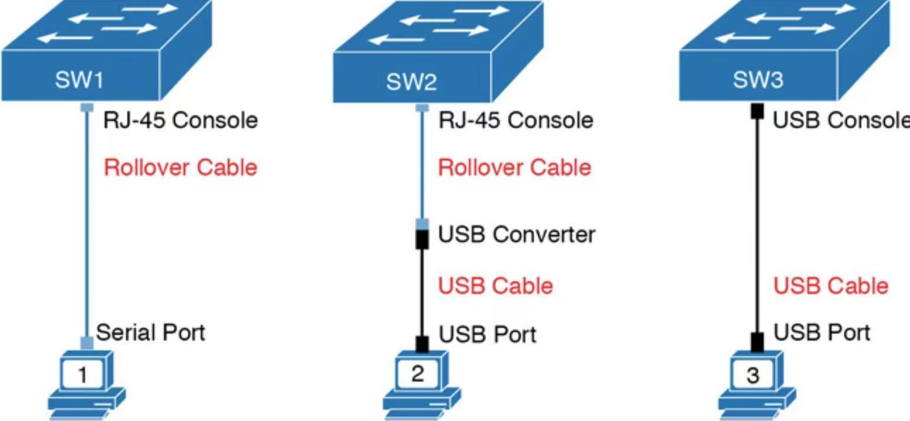

```
OSI(Open System Interconnection, 开放系统互联)参考模型
应用层
    提供用户界面
    
表示层
    提供数据, 进行数据加密/转化处理

会话层
    会话控制管理, 将不同应用程序的数据进行分离

传输层
    提供可靠或不可靠的传输

网络层
    提供逻辑地址

数据链路层
    提供MAC地址

物理层
    在设备之间传输比特值


DoD模型
进程/应用层

主机到主机层(传输层)

Internet层

数据链路层

物理层


数据封装格式
传输层(segment,数据段)

网络层(packet/datagram, 数据包)

数据链路层(frame, 数据帧)

物理层(bits, 位元)


名词解释:
冲突域(collision domain)
    某台设备发送分组时, 当前网段中的其他所有设备必须留意; 如果有两台设备试图同时传输数据, 将导致冲突. 存在于单双工设备中


载波侦听多路访问/冲突检测(Carrier Sense Multiple Access with Collision Detection, CSMA/CD)
    避免两台在冲突域内同时传输数据, 适用于单双工. 发生冲突后的步骤:
    (1)拥堵信号告诉所有设备发生了冲突
    (2)冲突激活随机后退算法
    (3)冲突域中的每台设备都暂停传输, 直到其后退定时器到期
    (4)定时器到期后, 所有主机的传输优先级都相同


广播域(broadcast domain)
    任意一个节点可以在数据链路层通过广播的方式到达任意一个节点


媒体存取控制地址(Media Access Control Address, MAC)
    用于确认网络设备位置的地址. 组成如下:
    1 bit - Individual/Group位, 当值为0时, 代表地址为单播地址; 值为1时, 地址为组播/广播地址
    1 bit - Global/Local位, 当值为0时, 代表地址为全局地址, 由IEEE分配; 值为1时, 地址为本地管理地址
    22 bit - IEEE分配给厂商的地址
    24 bit - 厂商自行分配给网卡的地址


有线以太网IEEE标准(802.3)
802.3
传输速率为10 Mbit/s, 介质为双绞线, 最大传输距离为100米

802.3u
    传输速率为100 Mbit/s, 介质为双绞线, 最大传输距离为100米

802.3z
    传输速率为1000 Mbit/s, 介质为光纤, 最大传输距离为5000米

802.3ab
    传输速率为1000 Mbit/s, 介质为双绞线, 最大传输距离为100米

802.3an
    传输速率为10 Gbit/s, 介质为双绞线, 最大传输距离为100米


以太网布线类型
1.直通电缆
1)快速以太网(10/100 Mbit/s)
    连接方式:
    1 - 1
    2 - 2
    3 - 3
    6 - 6

2)吉比特以太网(1000 Mbit/s)
    连接方式:
    1 - 1
    2 - 2
    3 - 3
    4 - 4
    5 - 5
    6 - 6
    7 - 7
    8 - 8

连接设备:
主机 - 交换机(集线器)
交换机(集线器) - 路由器


2.交叉电缆
1)快速以太网(10/100 Mbit/s)
    连接方式:
    1 - 3
    2 - 6
    3 - 1
    6 - 2

2)吉比特以太网(1000 Mbit/s)
    连接方式:
    1 - 3
    2 - 6
    3 - 1
    4 - 7
    5 - 8
    6 - 2
    7 - 4
    8 - 5

连接设备:
主机 - 主机
交换机(集线器) - 交换机(集线器)
路由器 - 路由器
主机 - 路由器


3.反转电缆
    连接方式:
    1 - 8
    2 - 7
    3 - 6
    4 - 5
    5 - 4
    6 - 3
    7 - 2
    8 - 1

连接设备:
主机的RS-232接口(9针) - 交换机/路由器的console(RJ-45接口)


10M/100M线序
568B排列顺序:
橙白 橙色 绿白 蓝色 蓝白 绿色 棕白 棕色

568A排列顺序:
绿白 绿色 橙白 蓝色 蓝白 橙色 棕白 棕色

1000M线序
568B排列顺序:
橙白 橙色 绿白 蓝色 蓝白 绿色 棕白 棕色

另一头线序:
绿白 绿色 橙白 棕白 棕色 橙色 蓝色 蓝白


10M/100M网速
使用1/2号线传输信号, 使用3/6号线接收信号的设备:
PC NIC/Router

使用3/6号线传输信号, 使用1/2号线接收信号的设备:
集线器(Hub)/交换机


交换机接口:
LAN接口: RJ45接口(UTP/STP双绞线); SFP(Small Form-factor Pluggable)接口(光纤), 支持1000M网络; SFP+接口(光纤), 支持10G或以上网络
console接口: 外接设备进行cmd配置(RJ-45或mini-B USB接口)

路由器接口:
WAN接口: V.35接口(serial line, 34孔)
LAN接口: RJ45接口(UTP/STP双绞线); SFP(Small Form-factor Pluggable)接口(光纤), 支持1000M网络; SFP+接口(光纤), 支持10G或以上网络
console接口: 外接设备进行cmd配置(RJ-45或mini-B USB接口)
AUX接口: 通过调制解调器远程连接路由器
```
<br>
<br>

console接口连接方式(硬件)<br>


```
** 如图, 主机与cisco设备的连接方式
1.cisco设备 ---- RJ-45接口 ---- RS-232接口 ---- PC

2.cisco设备 ---- RJ-45接口 ---- RS-232转接口 ---- 标准USB接口 ---- PC

3.cisco设备 ---- mini-B USB接口 ---- 标准USB接口 ---- PC


console接口连接(软件)
1.主机为Windows
1)终端选择: putty

2)查看端口
右键点击'此电脑' -- 管理 -- 设备管理器 -- 端口(COM和LPT)
USB-SERIAL CH340(COM4)

3)配置串口
putty -- Connection -- Serial
Serial line to connect to: COM4
Speed(baud): 9600/115200
Data bits: 8
Stop bits: 1
Parity: None
Flow contrl: None

4)连接串口
putty -- Session
选择Serial
Serial line: COM4
Speed: 9600/115200
点击'Open'


2.主机为Linux(Ubuntu)
1)安装minicom
sudo apt-get install minicom

2)检查serial端口
dmesg | grep tty
[    3.273942] usb 1-7: ch341-uart converter now attached to ttyUSB0

3)配置minicom
sudo minicom -s
选择'Serial port setup' -- 单击'A'
/dev/ttyUSB0
单击'Enter'

单击'E'
单击'C'(9600 bps)或单击'E'(115200 bps)
单击'Q'(8 data和1 stopbits)
单击'Enter'

单击'Enter'

选择'Save setup as dfl'

选择'Exit from Minicom'

4)启动minicom(默认打开dfl配置文件)
sudo minicom

5)退出minicom
Ctrl+A Q


问题修复:
1.单个字符重复出现, 并且删除键可回到行首
sudo minicom -s
选择'Screen and keyboard' -- local echo(Q)设置为No -- 单击'Enter' -- 保存
```
<br>
<br>

```
存储空间类型:
1.RAM, 也称为DRAM, 实时存储空间, running-configuration文件存储位置

2.Flash memory, 保存系统image文件(IOS)位置, 类似于PC的硬盘

3.ROM, 启动引导文件存放位置

4.NVRAM(Nonvolatile RAM), startup configuration文件存储位置
```
<br>
<br>

```
路由器开机过程
1.POST(power-on self-test), 发现硬件组件, 并验证组件是否正常工作

2.从ROM读取引导程序, 加载到RAM

3.引导程序选择IOS读取位置. 读取位置由寄存器16 bits的最后4 bits决定:
    1)0 - 停留在引导程序bootstrap位置(ROMMON OS)
    2)1 - 从flash文件列表查找; 找不到时, 加载ROMMON OS
    3)2~F - network, 从boot system列表读取; 找不到时, 从flash读取; 再找不到时, 加载ROMMON OS

4.读取IOS后, 选择startup-config文件读取位置. 读取位置:
    1)NVRAM
    2)network

** boot system用于从flash、服务器文件查找IOS
(config)# boot system flash
(config)# boot system flash <filename>
(config)# boot system tftp <filename> <server_addr>
```
<br>
<br>

寄存器相关bit的作用
|bit number       |hex            |作用描述           |
|-----------------|---------------|-------------------|
|0-3              |0x0000 - 0x000F|0x0000 - 停留在bootstrap位置<br> 0x0001 - 从flash读取IOS<br> 0x0002 ~ 0x000F - 从boot system指令列表读取|
|6                |0x0040         |忽略NVRAM内容      |
|5/11/12          |0x0020/0x0800/0x1000|指定波特率(具体参考下表) |

```
寄存器配置(默认0x2102):
(config)# config-register 0x2102
```
<br>

波特率参考表
|bit number       |hex            |波特率             |
|-----------------|---------------|-------------------|
|                 |0x0000         |9600               |
|5                |0x0020         |19200              |
|11               |0x0800         |4800               |
|12               |0x1000         |1200               |
|5 & 11           |0x0820         |38400              |
|5 & 12           |0x1020         |57600              |
|11 & 12          |0x1800         |2400               |
|5 & 11 & 12      |0x1820         |115200             |

```
直接配置寄存器不能修改波特率, 需要通过配置console配置. 如:
(config)# line console 0
(config-line)# speed 2400
```
<br>
<br>

```
文件系统概览:
# show file systems
File Systems:
       Size(b)       Free(b)      Type  Flags  Prefixes
             -             -    opaque     rw   system:
*     64016384       6197248      disk     rw   flash:#                         
        245752        239556     nvram     rw   nvram: 
             -             -   network     rw   tftp:
             -             -   network     rw   ftp: 

查看flash文件系统内容:
# dir flash:
Directory of flash:/

    1  -rw-       75529  Jan 17 2011 19:08:06 +00:00  crashinfo_20110117-110806
    2  -rw-        1823   Feb 1 2007 05:51:00 +00:00  sdmconfig-2811.cfg
    3  -rw-      833024   Feb 1 2007 05:51:56 +00:00  es.tar
    4  -rw-     1052160   Feb 1 2007 05:52:18 +00:00  common.tar
    5  -rw-        1038   Feb 1 2007 05:52:34 +00:00  home.shtml
    6  -rw-      102400   Feb 1 2007 05:52:50 +00:00  home.tar
    7  -rw-      491213   Feb 1 2007 05:53:08 +00:00  128MB.sdf
    8  -rw-     1684577   Feb 1 2007 05:53:38 +00:00  securedesktop-ios-3.1.1.27-k9.pkg
    9  -rw-      398305   Feb 1 2007 05:53:58 +00:00  sslclient-win-1.1.0.154.pkg
   11  -rw-    53158456   Jul 6 2011 20:37:36 +00:00  c2800nm-adventerprisek9-mz.124-15.T14.bin

查看nvram文件系统内容:
# dir nvram:
Directory of nvram:/

  238  -rw-           0                    <no date>  startup-config
  239  ----           0                    <no date>  private-config
  240  -rw-           0                    <no date>  underlying-config
    1  -rw-           0                    <no date>  ifIndex-table
    2  ----          73                    <no date>  persistent-data
    3  -rw-        2945                    <no date>  cwmp_inventory
    6  ----           4                    <no date>  rf_cold_starts

查看running-config文件内容:
# more system:running-config
等价于
# show running-config

查看startup-config文件内容:
# more nvram:startup-config
等价于
# show startup-config

MD5校验:
# verify /md5 flash:c2800nm-adventerprisek9-mz.124-15.T14.bin

显示系统版本信息(含寄存器值):
# show version
```
