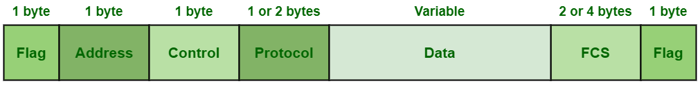
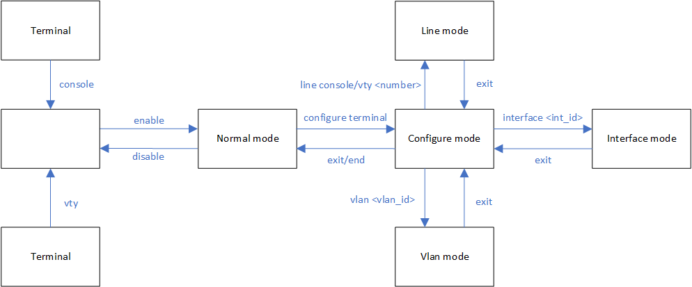
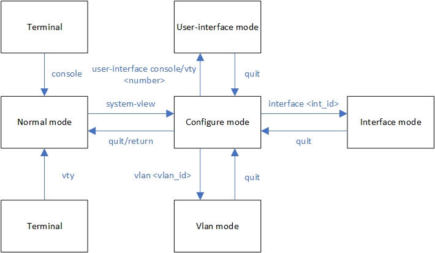

交换机<br>
通过接收和转发数据帧, 使其达到目标设备, 作用于数据链路层. 特性如下:<br>
&emsp;&emsp;1.通过frame的源mac地址进行学习<br>
&emsp;&emsp;2.通过frame的目标mac地址确定转发接口<br>
&emsp;&emsp;3.使用STP创建无循环的链路<br>
<br>
<br>
<br>

Ethernet帧:<br>
<br>
Field列表:<br>
&emsp;&emsp;Preamble: 7 bytes, 用于防止帧内容丢失. 内容: 10101010 ... 10101010

&emsp;&emsp;SFD: 1 byte, 代表Preamble结束, 并且标志后续内容为帧内容起始. 内容: 10101011

&emsp;&emsp;Target mac: 6 bytes, 帧接收设备的mac地址, 前3 bytes由IEEE赋予厂商, 后3 bytes由厂商进行编号<br>
&emsp;&emsp;** 第1 byte的第7 bit, 为U/L位, 0代表厂商分配; 1代表个人管理性分配<br>
&emsp;&emsp;** 第1 byte的第8 bit, 为I/G位, 0代表单播; 1代表组播或广播

&emsp;&emsp;Source mac: 6 bytes, 帧发送设备的mac地址

&emsp;&emsp;Type: 2 bytes, 数值=<1500时, IEEE802.3类型帧, 代表负载内容的长度; 数值>=1536时, Ethernet II类型帧, 用于标记data的协议的封装类型. 常见类型列表:<br>
&emsp;&emsp;&emsp;&emsp;0x0800    IPv4<br>
&emsp;&emsp;&emsp;&emsp;0x0806    ARP<br>
&emsp;&emsp;&emsp;&emsp;0x86DD    IPv6<br>

&emsp;&emsp;Data: 46~1500 bytes, 由TCP/IP协议栈上层传递下来的内容

&emsp;&emsp;FCS: 4 bytes, 全称为Frame Check Sequence, 使用CRC算法在发送端对目标mac/源mac/type/data进行校验
<br>
<br>

LAN帧类型列表<br>
1.Ethernet II(version 2)/DIX, 普遍使用的帧类型, type字段>=1536, 代表payload的协议类型. 常用如下:<br>
&emsp;&emsp;0x0800    IPv4<br>
&emsp;&emsp;0x0806    ARP<br>
&emsp;&emsp;0x86DD    IPv6<br>

2.Novell raw IEEE802.3, type字段<=1500, 代表payload长度, data起始两字节为0xFFFF
<br>
<br>
<br>

HDLC帧(ISO/IEC 13239:2002)<br>
<br>

Field列表:<br>
&emsp;&emsp;Flag: 8 bits, 代表帧的开始. 值为0x01111110

&emsp;&emsp;Address: 8 bits, 指定地址. 类型如下:<br>
&emsp;&emsp;&emsp;&emsp;11111111 - all station address<br>
&emsp;&emsp;&emsp;&emsp;00000000 - no station address<br>
&emsp;&emsp;&emsp;&emsp;\<others> - group address<br>

&emsp;&emsp;Control: 8 bits<br>

&emsp;&emsp;Protocol(ISO/IEC 13239:2002不包含该字段, Cisco特有): 16 bits, 上层协议类型. 常见类型列表:<br>
&emsp;&emsp;&emsp;&emsp;0x0800    IPv4<br>
&emsp;&emsp;&emsp;&emsp;0x8035    ARP<br>

&emsp;&emsp;Information Field: 8\*N bits, TCP/IP栈上层传下来的内容<br>

&emsp;&emsp;FCS: 16 bits, 使用CRC进行校验<br>

&emsp;&emsp;Flag: 8 bits, 代表帧的结束. 值为0x01111110
<br>
<br>

PPP帧(RFC 1662)<br>
<br>

Field列表:<br>
&emsp;&emsp;Flag: 1 byte, 代表帧的开始. 值为0x7E

&emsp;&emsp;Address: 1 byte, 值为0xFF

&emsp;&emsp;Control: 1 byte, 值为0x03

&emsp;&emsp;Protocol: 1 byte或2 bytes, 上层协议类型. 常见类型列表:<br>
&emsp;&emsp;&emsp;&emsp;0x0800    IPv4<br>
&emsp;&emsp;&emsp;&emsp;0x8035    ARP<br>

&emsp;&emsp;Information Field: N bytes, TCP/IP栈上层传下来的内容

&emsp;&emsp;FCS: 2 bytes/4 bytes, 使用CRC进行校验

&emsp;&emsp;Flag: 1 byte, 代表帧的结束. 值为0x7E
<br>
<br>
<br>

WAN(Wide Area Network)类型<br>
1.HDLC(Hight-level Data link Control)<br>
物理层<br>
&emsp;&emsp;leased line, 其他名称serial line/point-to-point line/private line

数据链路层<br>
&emsp;&emsp;HDLC
<br>
<br>

2.PPP(Point to Point)<br>
物理层<br>
&emsp;&emsp;leased line, 其他名称serial line/point-to-point line/private line

数据链路层<br>
&emsp;&emsp;PPP
<br>
<br>

3.EoMPLS(Ethernet over Multiprotocol Label Switching)<br>
物理层<br>
&emsp;&emsp;ethernet line

数据链路层<br>
&emsp;&emsp;EoMPLS
<br>
<br>
<br>

交换机转发行为
|地址类型|交换机行为|
|---|---|
|已知单播地址(mac-address-table中包含)|将帧向关联接口发送出去|
|未知单播地址(mac-address-table中未包含)|将帧向所有接口(除了接收该帧的接口)发送出去(泛洪)|
|广播|将帧向所有接口(除了接收该帧的接口)发送出去(泛洪)|
|组播|将帧向所有接口(除了接收该帧的接口)发送出去(泛洪), 除非配置组播优化策略|

<br>
<br>

模式切换<br>
<br>
一、从console/vty进入EXEC mode
<br>
<br>
<br>

二、从EXEC mode进入Privileged mode<br>
`> enable`
<br>
<br>

实例1 - 查看运行配置文件<br>
`# show running-config`
<br>
<br>

实例2 - 查看启动配置文件<br>
`# show startup-config`
<br>
<br>

实例3 - 将运行配置文件拷贝到启动配置文件<br>
`# copy running-config startup-config`
<br>
<br>

实例4 - 将启动配置文件拷贝到运行配置文件<br>
`# copy startup-config running-config`
<br>
<br>

实例5 - 删除启动配置文件<br>
`# erase startup-config`<br>
or<br>
`# erase nvram:`<br>
or<br>
`# write erase`
<br>
<br>

实例6 - 重启设备<br>
`# reload`
<br>
<br>
<br>

三、从Privileged mode进入global configure mode<br>
`# configure terminal`
<br>
<br>

实例1 - 主机名配置<br>
`(config)# hostname steven`
<br>
<br>

实例2 - banner配置<br>
1)exec banner<br>
`(config)# banner exec <beg_delimiter> <prompt_message> <end_delimiter>`
<br>

2)login banner<br>
`(config)# banner login <beg_delimiter> <prompt_message> <end_delimiter>`
<br>

3)motd(message of the day) banner<br>
`(config)# banner motd <beg_delimiter> <prompt_message> <end_delimiter>`<br>
** console/vty登录的banner顺序:<br>
MOTD banner--> login banner --> <console/vty log> --> exec banner<br>

** ssh登录的banner顺序:<br>
login banner --> <ssh log> --> MOTD banner-->  exec banner
<br>

实例3 - 启动/关闭console logging<br>
`(config)# [no] logging console`
<br>

实例4 - 是否使用domain-lookup特性(输入错误指令时, 将错误指令视为域名, 使用telnet连接)<br>
`(config)# [no] ip domain-lookup`
<br>

实例5 - enable密码配置(SHA-256优于MD5, MD5优于明文)<br>
```
plaintext
(config)# enable password <passwd>

MD5
(config)# enable secret <passwd>

SHA-256
(config)# enable algorithm-type sha256 secret <passwd>

scrypt(SHA-256)
(config)# enable algorithm-type scrypt secret <passwd>
```
<br>

实例6 - 本地用户配置<br>
```
plaintext
(config)# username <name> password <passwd>

MD5
(config)# username <name> secret <passwd>

SHA-256
(config)# username <name> algorithm-type sha256 secret <passwd>

scrypt(SHA-256)
(config)# username <name> algorithm-type scrypt secret <passwd>
```

** 补充: 在全局配置(接口配置等)模式下使用show指令<br>
`(config)# do show ...`
<br>
<br>
<br>

四、从global configure模式进入其他子配置模式<br>
** 备注: 使用end或ctrl+z可以从子配置模式直接退出到privileged模式<br>
1.进入line console配置模式<br>
`(config)# line console 0`
<br>

实例1 - 设置history大小<br>
```
(config)# line console 0
(config-line)# history size <num>
```
<br>

显示history列表<br>
`# show history`
<br>
<br>

实例2 - logging消息是否同步(同步不覆盖输入)<br>
`(config-line)# [no] logging synchronous`
<br>
<br>

实例3 - 设置console超时断连时间<br>
`(config-line)# exec-timeout <mins> <secs>`
<br>

关闭断连时间限制<br>
`(config-line)# exec-timeout 0`
<br>
<br>

2.进入line vty配置模式<br>
`(config)# line vty 0 15`
<br>

实例1 - 设置history大小<br>
`(config-line)# history size <num>`
<br>

显示history列表<br>
`# show history`
<br>
<br>

实例2 - 设置vty超时断连时间<br>
`(config-line)# exec-timeout <mins> <secs>`
<br>

关闭断连时间限制<br>
`(config-line)# exec-timeout 0`
<br>
<br>

3.进入interface配置模式<br>
```
(config)# interface f0/1
(config)# interface range f0/1 - 10
```
<br>

实例1 - description配置<br>
`(config-if)# description <description>`
<br>
<br>

实例2 - 启用/关闭接口<br>
`(config-if)# [no] shutdown`
<br>
<br>

实例3 - 网络速度<br>
`(config-if)# speed {auto | 10 | 100 | 1000}`
<br>
<br>

实例4 - 配置双工<br>
`(config-if)# duplex {auto | full | half}`
<br>
<br>

实例5 - 配置auto - mdix<br>
`(config-if)# [no] mdix auto`
<br>
<br>

自动协商机制(auto-negotiation)<br>
802.3u特性, 链路两端自动交换网络速度和双工信息<br>
特征描述:<br>
1)当接口的网络速度或双工任意一项开启时, 接口开启自动协商

2)链路两端的其中一端接口开启自动协商, 配置协商的一端即可完成协商

3)链路两端必须全部开启自动协商, 才能完成双工的协商


情景适配(自动协商 - 双工)<br>
当一端关闭自动协商, 另一端开启自动协商. 则开启协商的一端根据最低标准配置双工, 即10/100M配置half duplex, 1000M配置full duplex


介质相关接口自动转化(automatic medium-dependent interface crossover, auto-mdix)<br>
在链路两端的任意一端开启该特性, 会在直连/交叉自动转换, 从而确保连线正常. 开启该特性前, 必须开启自动协商
<br>
<br>

实例6 - 设置IP地址<br>
** 交换机使用SVI(switch virtual interface)接口进行IP流量管理<br>
```
(config)# interface vlan 1
(config-if)# ip address 192.168.2.2 255.255.255.0
```
<br>
<br>

实例7 - 显示接口状态<br>
```
# show interfaces status
Port      Name               Status       Vlan       Duplex  Speed Type
Fa0/1                        notconnect   1            auto   auto 10/100BaseTX
```
<br>
<br>

实例8 - 显示接口启动情况<br>
```
# show interfaces description
Interface                      Status         Protocol Description              
Vl1                            up             down                              
Fa0/1                          down           down
```
<br>
<br>

实例9 - 显示接口拥有特征及对应选项<br>
```
# show interfaces capabilities
FastEthernet0/1                                                                 
  Model:                 WS-C2960-24TT-L                                        
  Type:                  10/100BaseTX                                           
  Speed:                 10,100,auto                                            
  Duplex:                half,full,auto                                         
  Trunk encap. type:     802.1Q                                                 
  Trunk mode:            on,off,desirable,nonegotiate                           
  Channel:               yes                                                    
  Broadcast suppression: percentage(0-100)                                      
  Flowcontrol:           rx-(off,on,desired),tx-(none)                          
  Fast Start:            yes                                                    
  QoS scheduling:        rx-(not configurable on per port basis),               
                         tx-(4q3t) (3t: Two configurable values and one fixed.) 
  CoS rewrite:           yes                                                    
  ToS rewrite:           yes                                                    
  UDLD:                  yes                                                    
  Inline power:          no                                                     
  SPAN:                  source/destination                                     
  PortSecure:            yes                                                    
  Dot1x:                 yes    
```
<br>
<br>

实例10 - 显示接口流量汇总<br>
```
# show interfaces counters
Port            InOctets    InUcastPkts    InMcastPkts    InBcastPkts           
Fa0/1              54732             36            216             57 

Port           OutOctets   OutUcastPkts   OutMcastPkts   OutBcastPkts           
Fa0/1               8380             42             36              1  
```
<br>
<br>

实例11 - 显示接口各种的流量信息<br>
```
# show interfaces accounting
Vlan1                                                                           
                Protocol    Pkts In   Chars In   Pkts Out  Chars Out            
                      IP         85      52530          0          0            
                     ARP          0          0          5        300            
FastEthernet0/1                                                                 
                Protocol    Pkts In   Chars In   Pkts Out  Chars Out            
                   Other          0          0         88       5790            
           Spanning Tree        269      16140          1         60            
                     CDP         11       4070         11       4246            
                     DTP         17       1020          0          0 
```
<br>
<br>

实例12 - 显示接口详细统计信息<br>
```
# show interfaces f0/1
  Hardware is Fast Ethernet, address is a40c.c3f9.d881 (bia a40c.c3f9.d881)     
  MTU 1500 bytes, BW 100000 Kbit, DLY 100 usec,                                 
     reliability 255/255, txload 1/255, rxload 1/255                            
  Encapsulation ARPA, loopback not set                                          
  Keepalive set (10 sec)                                                        
  Full-duplex, 100Mb/s, media type is 10/100BaseTX                              
  input flow-control is off, output flow-control is unsupported                 
  ARP type: ARPA, ARP Timeout 04:00:00                                          
  Last input 00:00:00, output 00:00:04, output hang never                       
  Last clearing of "show interface" counters never                              
  Input queue: 0/75/0/0 (size/max/drops/flushes); Total output drops: 0         
  Queueing strategy: fifo                                                       
  Output queue: 0/40 (size/max)                                                 
  5 minute input rate 0 bits/sec, 0 packets/sec                                 
  5 minute output rate 0 bits/sec, 0 packets/sec                                
     3696 packets input, 667020 bytes, 0 no buffer                              
     Received 3261 broadcasts (2539 multicasts)                                 
     0 runts, 0 giants, 0 throttles                                             
     0 input errors, 0 CRC, 0 frame, 0 overrun, 0 ignored                       
     0 watchdog, 2539 multicast, 0 pause input                                  
     0 input packets with dribble condition detected                            
     806 packets output, 80396 bytes, 0 underruns 
     0 output errors, 0 collisions, 1 interface resets                          
     0 babbles, 0 late collision, 0 deferred                                    
     0 lost carrier, 0 no carrier, 0 PAUSE output                               
     0 output buffer failures, 0 output buffers swapped out
```
<br>
备注单元:<br>
runts<br>
&emsp;&emsp;小于64 bytes的帧

giants<br>
&emsp;&emsp;大于1518 bytes, 并且FCS校验无法通过的帧

throttles<br>
&emsp;&emsp;无法缓存的入口流量包

CRC<br>
&emsp;&emsp;FCS校验错误的帧

frame<br>
&emsp;&emsp;拥有CRC错误并且字节数为非整数的帧

overrun<br>
&emsp;&emsp;接收流量的速度超过接口能力

ignored<br>
&emsp;&emsp;忽略的入口流量帧

watchdog<br>
&emsp;&emsp;watchdog的接收定时器过期. 当帧的长度超过2048 bytes时出现

pause input<br>
&emsp;&emsp;停止帧接收, 用于告知远端设备停止传送帧, 直到做好准备

underruns<br>
&emsp;&emsp;发送包的速度超过接口能力

collisions<br>
&emsp;&emsp;冲突帧. 当full duplex出现冲突帧, 表明线路过长或中继器原因

babbles<br>
&emsp;&emsp;超过1518 bytes的帧

lost carrier<br>
&emsp;&emsp;传送过程中丢失帧
<br>
<br>

接口状态字段<br>
status<br>
&emsp;&emsp;代表连接状态. show interfaces status结果字段

line status<br>
&emsp;&emsp;TCP/IP协议第一层状态. show interfaces description与show interfaces结果字段

line protocol<br>
&emsp;&emsp;TCP/IP协议第二层状态. show interfaces description与show interfaces结果字段
<br>
<br>

|line status          |line protocol  |status     |reason          |
|---------------------|---------------|-----------|----------------|
|administratively down|down           |disabled   |shutdown指令关闭|
|down                 |down           |notconnect |<ol><li>没有网线连接</li><li>网线故障(被其他电子设备干扰/线路损坏/光纤过度弯曲)</li><li>错误的水晶头接序</li><li>两端网速不匹配</li><li>邻接设备关闭</li></ol>  |
|down                  |down(err-disabled)|err-disabled|使用port security关闭端口|
|up                    |up             |connected  |正常连接       |

<br>
<br>

实例13 - 显示L2层交换机信息
```
# show interfaces f2/0/1 switchport
Name: Fa2/0/1                                                                   
Switchport: Enabled       
! 是否设置为L2交换机端口
                                        
Administrative Mode: dynamic desirable
! 配置端口类型(access/trunk)的方式, 方式列表: static access/trunk/dynamic desirable/dynamic auto

Operational Mode: trunk
! 端口实际所处状态, 状态列表: down/static access/trunk 

Administrative Trunking Encapsulation: negotiate       
! 配置的trunk端口封装类型, 类型列表: dot1q/isl/negotiate

Operational Trunking Encapsulation: dot1q
! 端口实际的封装类型, 类型列表: dot1q/isl/native

Negotiation of Trunking: On
! 是否成为trunk接口, 设置为access端口时, 显示为off状态

Access Mode VLAN: 1 (default)
! access端口访问的vlan

Trunking Native Mode VLAN: 1 (default)
! trunk端口的native vlan

Administrative Native VLAN tagging: enabled

Voice VLAN: none
! voice vlan
! switchport voice vlan <num>

Administrative private-vlan host-association: none

Administrative private-vlan mapping: none

Administrative private-vlan trunk native VLAN: none

Administrative private-vlan trunk Native VLAN tagging: enabled

Administrative private-vlan trunk encapsulation: dot1q

Administrative private-vlan trunk normal VLANs: none

Administrative private-vlan trunk private VLANs: none

Operational private-vlan: none

Trunking VLANs Enabled: ALL

Pruning VLANs Enabled: 2-1001

Capture Mode Disabled

Capture VLANs Allowed: ALL

Protected: false

Unknown unicast blocked: disabled

Unknown multicast blocked: disabled

Appliance trust: none
```

4.进入vlan配置模式<br>
`(config)# vlan 1`
<br>
<br>
<br>

#### 配置console与telnet/SSH登录<br>
实例1 - console登录密码<br>
1)所有用户共享密码<br>
```
(config)# line console <num>
(config-line)# password <passwd>
(config-line)# login
```

2)本地用户名/密码登录<br>
```
(config)# username <user> secret <passwd>
(config)# line console 0
(config-line)# login local
```
<br>
<br>

实例2 - telnet登录密码<br>
1)所有用户共享密码<br>
```
(config)# line vty <num_1> <num_2>
(config-line)# password <passwd>
(config-line)# transport input telnet
(config-line)# login
```

2)本地用户名/密码登录<br>
```
(config)# username <user> secret <passwd>
(config)# line vty <num_1> <num_2>
(config-line)# transport input telnet
(config-line)# login local
```
<br>
<br>

实例3 - SSH登录密码<br>
```
(config)# hostname <host_name>
(config)# ip domain-name <domain_name>
(config)# crypto key generate rsa
(config)# username <user> secret <passwd>
(config)# ip ssh version 2
(config)# line vty <num_1> <num_2>
(config-line)# transport input ssh
(config-line)# login local
```

客户端ssh登录<br>
`# ssh -l <user> <server_add>`

查看当前ssh服务器端信息<br>
`# show ip ssh`

查看连接到当前服务器端的客户端的信息<br>
`# show ssh`
<br>
<br>
<br>

#### 加密明文密码<br>
```
(config)# username lily password h3c
(config)# username lucy secret h3c
(config)# username peter algorithm-type sha256 secret h3c
(config)# username david algorithm-type scrypt secret h3c

# show run | include username
username lily password 0 h3c
username lucy secret 5 $1$MAQh$iTmmhRVgoPeMrbHN5riXO1
username peter secret 8 $8$EcPcikKS5iwVGU$QuZcsgJXfpMoDJTscaJBsfoKzUS8u1et6r6/hW17rUY
username david secret 9 $9$0qOw6If0drqkdU$4BGvIEkZdEjhP4ktb6pY1e0AqTjUYIo9XdXslSGVgk2

(config)# service password-encryption

R1# show run | include username
username lily password 7 151A580F
username lucy secret 5 $1$MAQh$iTmmhRVgoPeMrbHN5riXO1
username peter secret 8 $8$EcPcikKS5iwVGU$QuZcsgJXfpMoDJTscaJBsfoKzUS8u1et6r6/hW17rUY
username david secret 9 $9$0qOw6If0drqkdU$4BGvIEkZdEjhP4ktb6pY1e0AqTjUYIo9XdXslSGVgk2


** 密码前的type字段列表:
0 - 明文`密码
4 - SHA256加密(被弃用)
5 - MD5+salt加密的密码
7 - 使用service password-encryption指令, 加密明文密码
8 - PBKDF2-SHA-256加密的密码
9 - scrypt加密的密码

安全性比较:
0 < 7 < 4 < 5 < 8 < 9
```
<br>
<br>
<br>

#### MAC表<br>
1.mac表完整内容(静态mac和动态mac)<br>
显示mac表完整内容<br>
`# show mac address-table`
<br>
<br>

2.动态mac表内容<br>
1)显示动态mac表内容<br>
`# show mac address-table dynamic [interface <interface>] [address <add>] [vlan <vlan>]`

2)删除动态mac表内容<br>
`# clear mac address-table dynamic [interface <interface>] [address <add>] [vlan <vlan>]`
<br>
<br>

3.mac表age时间<br>
1)显示mac表age时间<br>
`# show mac address-table aging-time`

2)设置mac表age时间<br>
`(config)# mac address-table aging-time <seconds> [vlan <vlan>]`
<br>
<br>

4.mac表内容汇总计数<br>
`# show mac address-table count`
<br>
<br>
<br>

#### show的pipe指令
###### 1.include
取匹配正则表达式的行<br>
`# show running-config | include <regular-expression>`
<br>

原始内容
```
#show ip int f0/0
FastEthernet0/0 is up, line protocol is up                                      
  Internet address is 172.16.1.4/24                                             
  Broadcast address is 255.255.255.255                                          
  Address determined by setup command                                           
  MTU is 1500 bytes                                                             
  Helper address is not set                                                     
  Directed broadcast forwarding is disabled                                     
  Multicast reserved groups joined: 224.0.0.5 224.0.0.6                         
  Outgoing access list is not set                                               
  Inbound  access list is not set                                               
  Proxy ARP is enabled                                                          
  Local Proxy ARP is disabled                                                   
  Security level is default                                                     
  Split horizon is enabled                                                      
  ICMP redirects are always sent                                                
  ICMP unreachables are always sent                                             
  ICMP mask replies are never sent                                              
  IP fast switching is enabled
  IP fast switching on the same interface is disabled                           
  IP Flow switching is disabled                                                 
  IP CEF switching is enabled                                                   
  IP CEF Fast switching turbo vector                                            
  IP multicast fast switching is enabled                                        
  IP multicast distributed fast switching is disabled                           
  IP route-cache flags are Fast, CEF                                            
  Router Discovery is disabled                                                  
  IP output packet accounting is disabled                                       
  IP access violation accounting is disabled                                    
  TCP/IP header compression is disabled                                         
  RTP/IP header compression is disabled                                         
  Policy routing is disabled                                                    
  Network address translation is disabled                                       
  BGP Policy Mapping is disabled                                                
  WCCP Redirect outbound is disabled                                            
  WCCP Redirect inbound is disabled                                             
  WCCP Redirect exclude is disabled
```
<br>

实例1 - 包含字符串ICMP的行
```
#show ip int f0/0 | include ICMP
  ICMP redirects are always sent                                                
  ICMP unreachables are always sent                                             
  ICMP mask replies are never sent
```
<br>

实例2 - 包含字符串ICMP或WCCP的行
```
# show ip int f0/0 | include ICMP|WCCP
  ICMP redirects are always sent                                                
  ICMP unreachables are always sent                                             
  ICMP mask replies are never sent                                              
  WCCP Redirect outbound is disabled                                            
  WCCP Redirect inbound is disabled                                             
  WCCP Redirect exclude is disabled 
```
<br>
<br>

###### 2.section
包含指定内容的行, 并且后续相对于开始行缩进的块<br>
`# show running-config | section <regular-expression>`
<br>

原始内容
```
FastEthernet0/0 is up, line protocol is up                                      
  Hardware is MV96340 Ethernet, address is 001b.0c5a.c100 (bia 001b.0c5a.c100)  
  Internet address is 172.16.1.4/24                                             
  MTU 1500 bytes, BW 100000 Kbit/sec, DLY 100 usec,                             
     reliability 255/255, txload 1/255, rxload 1/255                            
  Encapsulation ARPA, loopback not set                                          
  Keepalive set (10 sec)                                                        
  Full-duplex, 100Mb/s, 100BaseTX/FX                                            
  ARP type: ARPA, ARP Timeout 04:00:00                                          
  Last input 00:00:01, output 00:00:03, output hang never                       
  Last clearing of "show interface" counters never                              
  Input queue: 0/75/0/0 (size/max/drops/flushes); Total output drops: 0         
  Queueing strategy: fifo                                                       
  Output queue: 0/40 (size/max)                                                 
  5 minute input rate 0 bits/sec, 0 packets/sec                                 
  5 minute output rate 0 bits/sec, 0 packets/sec                                
     1683 packets input, 304071 bytes                                           
     Received 1660 broadcasts, 0 runts, 0 giants, 0 throttles                   
     0 input errors, 0 CRC, 0 frame, 0 overrun, 0 ignored                       
     0 watchdog                                                                 
     0 input packets with dribble condition detected                            
     748 packets output, 76262 bytes, 0 underruns                               
     0 output errors, 0 collisions, 1 interface resets
     104 unknown protocol drops                                                 
     0 babbles, 0 late collision, 0 deferred                                    
     0 lost carrier, 0 no carrier                                               
     0 output buffer failures, 0 output buffers swapped out
```
<br>

实例1 - 包含output rate的行, 并且后续缩进内容组成的块
```
#show int f0/0 | section output rate                                          
  5 minute output rate 0 bits/sec, 0 packets/sec                                
     1713 packets input, 309408 bytes                                           
     Received 1690 broadcasts, 0 runts, 0 giants, 0 throttles                   
     0 input errors, 0 CRC, 0 frame, 0 overrun, 0 ignored                       
     0 watchdog                                                                 
     0 input packets with dribble condition detected                            
     761 packets output, 77588 bytes, 0 underruns                               
     0 output errors, 0 collisions, 1 interface resets                          
     106 unknown protocol drops                                                 
     0 babbles, 0 late collision, 0 deferred                                    
     0 lost carrier, 0 no carrier                                               
     0 output buffer failures, 0 output buffers swapped out
```
<br>
<br>

###### 3.begin
包含指定内容的行, 以及后续行<br>
`# show running-config | begin <regular-expression>`
<br>

原始内容
```
# show running
Building configuration...
 
Current configuration : 1274 bytes                                              
!                                                                               
version 12.4                                                                    
service timestamps debug datetime msec                                          
service timestamps log datetime msec                                            
no service password-encryption                                                  
!                                                                               
hostname R4                                                                     
!                                                                               
boot-start-marker                                                               
boot-end-marker                                                                 
!
no aaa new-model                                                                
no network-clock-participate wic 0                                              
dot11 syslog                                                                    
!
ip cef     
!
multilink bundle-name authenticated                                             
!
voice-card 0                                                                    
 no dspfarm                                                                     
!
controller E1 0/0/0                                                             
!
interface FastEthernet0/0                                                       
 ip address 172.16.1.4 255.255.255.0                                            
 ip ospf 1 area 0                                                               
 duplex auto                                                                    
 speed auto                                                                     
!                                                                               
interface FastEthernet0/1                                                       
 no ip address                                                                  
 shutdown                                                                       
 duplex auto                                                                    
 speed auto                                                                     
!      
router ospf 1                                                                   
 router-id 4.4.4.4                                                              
 log-adjacency-changes                                                          
!                                                                               
ip forward-protocol nd                                                          
!                                                                               
no ip http server                                                               
no ip http secure-server                                                        
!                                                                               
ip access-list extended test                                                    
 permit tcp host 172.16.1.1 host 172.16.1.2 eq www                              
!        
access-list 1 permit 172.16.10.1                                                
access-list 2 permit 172.20.20.0 0.0.0.255                                      
!                                                                               
control-plane                                                                   
!  
line con 0                                                                      
 logging synchronous                                                            
line aux 0                                                                      
line vty 0 4                                                                    
 login                                                                          
!                                                                               
scheduler allocate 20000 1000                                                   
!                                                                               
end  
```
<br>

实例1 - 包含ip access-list或access-list起始的行, 以及后续行
```
# show running | begin ^(ip )?access-list
ip access-list extended test                                                    
 permit tcp host 172.16.1.1 host 172.16.1.2 eq www                              
!        
access-list 1 permit 172.16.10.1                                                
access-list 2 permit 172.20.20.0 0.0.0.255                                      
!                                                                               
control-plane                                                                   
!  
line con 0                                                                      
 logging synchronous                                                            
line aux 0                                                                      
line vty 0 4                                                                    
 login                                                                          
!                                                                               
scheduler allocate 20000 1000                                                   
!                                                                               
end  

```
** 在cmd上输入'?'的方式, 先输入组合键ctrl+v, 再输入?
<br>
<br>
<br>

模式切换<br>
<br>
一、从console/vty进入normal mode<br>

实例1 - 查看运行配置文件<br>
`<HW> display current-configuration`
<br>
<br>

实例2 - 查看启动配置文件<br>
`<HW> display saved-configuration`
<br>
<br>

实例3 - 将运行配置文件保存到启动配置文件<br>
`<HW> save [<zip_file>]`
<br>
<br>

实例4 - 删除启动配置文件<br>
`<HW> reset saved-configuration`
<br>
<br>

实例5 - 重新指定启动配置文件<br>
`<Hw> startup saved-configuration <file>`
<br>
<br>

实例6 - 配置时区<br>
`<HW> clock timezone <tz> {add | minus} <offset>`
<br>
<br>

实例7 - 重启设备<br>
`<HW> reboot`
<br>
<br>
<br>

二、从normal mode进入configure mode<br>
`<HW> system-view`
<br>
<br>

实例1 - 主机名配置<br>
`[HW] sysname <name>`
<br>
<br>

实例2 - 关闭logging
`[HW] undo info-center enable`
<br>
<br>

实例3 - 创建本地用户
```
[R1] aaa
[R1-aaa] local-user <user> password cipher <password>
```
<br>
<br>

三、从configure mode进入其他子配置模式<br>
1.进入user-interface console配置模式<br>
`[HW] user-interface console 0`
<br>
<br>

2.进入user-interface vty配置模式<br>
`[HW] user-interface vty 0 4`
<br>
<br>

3.进入interface配置模式<br>
```
[HW] interface g0/0/1
[HW] port-group <group_name>
[HW-port-group-portgroup] group-member <start_interface> to <end_interface>
```
<br>
<br>

示例1 - 接口描述<br>
`[R1-GigabitEthernet0/0/1] description <description>`
<br>
<br>

实例2 - 配置IP地址<br>
`[HW-g0/0/1] ip address <ip_addr> {<mask> | <mask_length>}`
<br>
<br>

4.进入vla配置模式<br>
`[HW] vlan <vlan_id>`
<br>
<br>
<br>

##### 取消配置值
`[HW] undo sysname`
<br>
<br>
<br>

##### 配置console与telnet登录
实例1 - console登录密码<br>
```
1)无认证
[R1] user-interface console 0
[R1-ui-console0] authentication-mode none

2)密码认证
[R1] user-interface console 0
[R1-ui-console0] authentication-mode password
[R1-ui-console0] set authentication password cipher <passwd>

3)本地用户认证
[R1] aaa
[R1-aaa] local-user <user> password cipher <passswd>
[R1-aaa] local-user <user> service-type terminal
[R1] user-interface console 0
[R1-ui-console0] authentication-mode aaa
```
<br>

实例2 - telnet登录<br>
```
1)无认证
[R1] telnet server enable
[R1] telnet server port <port_num>
[R1] user-interface vty 0 4
[R1-ui-vty0-4] protocol inbound {all | ssh | telnet}
[R1-ui-vty0-4] authentication-mode none

2)密码认证
[R1] telnet server enable
[R1] telnet server port <port_num>
[R1] user-interface vty 0 4
[R1-ui-vty0-4] protocol inbound {all | ssh | telnet}
[R1-ui-vty0-4] authentication-mode password
[R1-ui-vty0-4] set authentication password cipher <passwd>

3)本地用户认证
[R1] telnet server enable
[R1] telnet server port <port_num>
[R1] aaa
[R1-aaa] local-user <user> password cipher <passswd>
[R1-aaa] local-user <user> service-type telnet
[R1] user-interface vty 0 4
[R1-ui-vty0-4] authentication-mode aaa
[R1-ui-vty0-4] protocol inbound {all | ssh | telnet}
```
<br>
<br>

实例3 - ssh登录<br>
```
[R1] stelnet server enable
[R1] ssh user <user>
[R1] ssh user <user> authentication-type password
[R1] ssh user <user> service-type stelnet
[R1] undo ssh server compatible-ssh1x enable
[R1] aaa
[R1-aaa] local-user <user> password cipher <passswd>
[R1-aaa] local-user client privilege level 15
[R1-aaa] local-user <user> service-type ssh
[R1] user-interface vty 0 4
[R1-ui-vty0-4] authentication-mode aaa
[R1-ui-vty0-4] protocol inbound {all | ssh | telnet}


[R2] ssh client first-time enable
[R2] stelnet <server_ip>
```
<br>
<br>

#### MAC表
```
显示mac表
[R1] display mac-address

显示动态mac表
[R1] display mac-address dynamic [<interface>] [vlan <vlan>]
```
<br>
<br>

##### display的pipe指令
1.include/exclude<br>
取匹配正则表达式的行<br>
`<HW> display current-configuration | include <regular-expression>`
<br>
<br>

2.begin<br>
包含指定内容的行, 以及后续行<br>
`<HW> display current-configuration | begin <regular-expression>`
<br>
<br>
