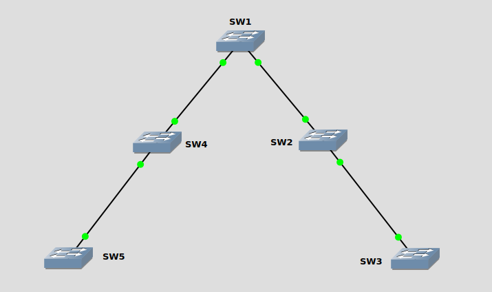

LAN(Local Area Network)<br>
单个广播域内所有的设备组成一个LAN
<br>
<br>
<br>

VLAN(Virtual LAN)<br>
在交换机中, 一个VLAN代表一个广播域, 而单个交换机可创建多个VLAN
<br>
<br>
<br>

交换机之间的多VLAN(VLAN内部)的信息传递<br>
1.每个VLAN使用一条线路传递帧. 如下图<br>


<br>
<br>

2.使用一条trunk线路传递所有VLAN的帧, 该头部需添加802.1Q字段, 标记帧的所属VLAN. 如下图<br>

<br>
各字段含义如下:<br>
TPID: 16 bits, 全称Tag Protocol Identifier, 用于标记802.1Q的帧. 值0x8100<br>

PCP: 3 bits, 全称Priority Code Point, 用于表示帧的优先等级<br>

DEI: 1 bit, 全称Drop Eligible Indicator, 用于表示是否因为阻塞而丢弃帧<br>

VID: 12 bits, 全称VLAN Identifier, 用于表示该帧所属的VLAN. Cisco将帧分为两种, 如下:<br>
&nbsp;&nbsp;&nbsp;&nbsp;&nbsp;&nbsp;&nbsp;&nbsp;normal VLAN: 1 ~ 1005, 所有的交换机都支持<br>
&nbsp;&nbsp;&nbsp;&nbsp;&nbsp;&nbsp;&nbsp;&nbsp;extend VLAN: 1006 ~ 4094, 部分交换机支持<br>

** VLAN 1通常为管理VLAN, 又称为Native VLAN, 传递该VLAN的帧时, 不携带802.1Q字段
<br>
<br>

多VLAN之间的信息传递<br>
使用路由器对信息进行路由转发. 如下图<br>

<br>
<br>

配置VLAN access接口<br>
1.进入VLAN模式(当VLAN不存在时创建该VLAN)<br>
`(config)# vlan 10`
<br>

2.VLAN命名与启动/关闭<br>
```
(config-vlan)# name <name>
(config-vlan)# [no] shutdown
```

3.交换机接口设置access模式<br>
`(config-if)# switchport mode access`
<br>

4.交换机接口设置所属VLAN<br>
`(config-if)# switchport access vlan 10`
<br>
<br>

配置VLAN trunk接口<br>
1.交换机配置使用的trunk协议<br>
`(config-if)# switchport trunk encapsulation {dot1q | isl}`
<br>

2.交换机接口配置为trunk模式<br>
`(config-if)# switchport mode trunk`
<br>

3.trunk接口允许的vlan<br>
`(config-if)# switchport trunk allowed vlan <vlan_list>`
<br>
<br>
<br>

##### VTP
VTP(VLAN Trunking Protocol)<br>
Cisco私有协议, 在拥有较多的交换机环境中, 在VTP域内, 从VTP server向VTP client扩散VLAN配置
<br>
<br>

VTP环境中的交换机角色:<br>
1.Server<br>
在VLAN数据库创建/修改/删除VLAN
<br>

2.Client<br>
接收并转发VTP通告, 并根据通告内容修改VLAN数据库<br>
不可直接在本地配置VLAN
<br>

3.Transparent<br>
接收并转发VTP通告, 不根据通告内容修改VLAN数据库<br>
需在本地配置VLAN
<br>

4.Off<br>
非VTP成员
<br>
<br>

VTP版本<br>
VTP version 1/2<br>
支持VLAN范围: 1 ~ 1005
<br>

VTP version 3<br>
支持VLAN范围: 1 ~ 4094
<br>
<br>

配置VTP<br>
1.配置VTP域<br>
`(config)# vtp domain <domain_name>`
<br>

2.配置VTP版本<br>
`(config)# vtp version {1 | 2 | 3}`
<br>

3.配置VTP角色<br>
`(config)# vtp mode { server | client | transparent | none}`
<br>

4.配置主server(version 3配置)<br>
`# vtp primary`
<br>

5.配置VTP密码(可选, 建议配置)<br>
`(config)# vtp password <passwd>`
<br>
<br>

查看VTP状态<br>
`# show vtp status`
<br>
<br>

<br>
配置实例
```
SW1(config)# vtp domain cisco
SW1(config)# vtp version 3
SW1(config)# vtp mode server
SW1# vtp primary

SW2(config)# vtp domain cisco
SW2(config)# vtp version 3
SW2(config)# vtp mode transparent

SW3(config)# vtp domain cisco
SW3(config)# vtp version 3
SW3(config)# vtp mode client

SW4(config)# vtp domain cisco
SW4(config)# vtp version 3
SW4(config)# vtp mode client

SW5(config)# vtp domain cisco
SW5(config)# vtp version 3
SW5(config)# vtp mode client
```
<br>
<br>

##### DTP
DTP(Dynamic Trunking Protocol)<br>
链路两端端口属于access类型, 并且协商是否可以成为trunk类型端口
<br>
<br>

DTP端口类型:<br>
1.Dynamic desirable<br>
端口原始属于access类型, 并且通告和接收DTP包, 以成为trunk类型接口
<br>

2.Dynamic auto
端口原始属于access类型, 并且接收DTP包, 以成为trunk类型接口
<br>
<br>

配置接口<br>
1.交换机配置使用的trunk协议<br>
`(config-if)# switchport trunk encapsulation {dot1q | isl | negotiate}`

2.交换机接口配置为动态协商<br>
`(config-if)# switchport mode dynamic {desirable | auto}`<br>

3.trunk接口允许的vlan<br>
`(config-if)# switchport trunk allowed vlan <vlan_list>`
<br>
<br>
<br>


链路两端的模式配置与结果对照表<br>
|Administrative mode  |access  |trunk     |dynamic desirable | dynamic auto |
|---------------------|--------|----------|------------------|--------------|
|__access__           |access  |no support|access            |access        |
|__trunk__            |not support|trunk  |trunk             |trunk         |
|__dynamic desirable__|access  |trunk     |trunk             |trunk         |
|__dynamic auto__     |access  |trunk     |trunk             |access        |

<br>
<br>

##### Etherchannel
将两台交换机之间的多条网络速度相同的链路, 聚合为一条链路, 流量在每条线路进行负载均衡
<br>

<br>
配置类型:<br>
1.手动配置etherchannel<br>
将接口手动加入channel group
<br>

实例<br>
** 链路两端的channel group可以不同, 但同一端的所有接口, channel group必须一致
```
SW1(config)# int range e0/0-2
SW1(config-if-range)# channel-group 1 mode on
SW1(config-if-range)# int port-channel1
SW1(config-if)# no shutdown

SW1# show etherchannel 1 summary

SW2(config)# int range e0/0-2
SW2(config-if-range)# channel-group 2 mode on
SW2(config-if-range)# int port-channel2
SW2(config-if)# no shutdown

SW2# show etherchannel 2 summary
SW2# show etherchannel 2 port-channel
```
<br>

2.自动配置etherchannel<br>
判断当前链路的两端配置, 以确定是否将该链路加入etherchannel
<br>

自动配置etherchannel协议:<br>
1)PAgP(Port Aggregation Protocol)<br>
Cisco专有协议, 最高支持8条链路加入
<br>

实例<br>
```
SW1(config)# int range e0/0-2
SW1(config-if-range)# channel-group 1 mode desirable
SW1(config-if-range)# int port-channel1
SW1(config-if)# no shutdown

SW1# show etherchannel 1 summary

SW2(config)# int range e0/0-2
SW2(config-if-range)# channel-group 2 mode auto
SW2(config-if-range)# int port-channel2
SW2(config-if)# no shutdown

SW2# show etherchannel 2 summary
```
<br>

2)LACP(Link Aggregation Control Protocol)<br>
IEEE 802.3ad, 最高支持16条链路加入, 其中8条active, 8条备用
<br>

实例<br>
```
SW1(config)# int range e0/0-2
SW1(config-if-range)# channel-group 1 mode active
SW1(config-if-range)# int port-channel1
SW1(config-if)# no shutdown

SW1# show etherchannel 1 summary

SW2(config)# int range e0/0-2
SW2(config-if-range)# channel-group 2 mode passive
SW2(config-if-range)# int port-channel2
SW2(config-if)# no shutdown

SW2# show etherchannel 2 summary
```
<br>

** 自动配置时, 链路两端必须至少有一端为主动协商, 即desirable/active<br>

** 使用自动配置时, 不能有手动配置选项on<br>

** etherchannel需要接口信息一致, 列表如下:
- speed
- duplex
- all in access/all in  trunk
- if access: access vlan
- if trunk: allowed vlan list
- if trunk: native vlan
- STP configure(path cost)
<br>

配置etherchannel的负载均衡类别<br>
`(config)# port-channel load-balance <type>`

etherchannel支持的负载均衡类别列表:
|keyword        |description              |layer       |
|---------------|-------------------------|------------|
|src-mac        |source mac address       |2           |
|dst-mac        |destination mac address  |2           |
|src-dst-mac    |source and destination mac address|2  |
|src-ip         |source ip address        |3           |
|dst-ip         |destination ip address   |3           |
|src-dst-ip     |source and destination ip address|3   |
|src-port       |source TCP/UDP port      |4           |
|dst-port       |destination TCP/UDP port |4           |
|src-dst-port   |source and destination TCP/UDP port|4 |

查看负载均衡信息<br>
`# show etherchannel load-balance`
<br>
<br>
<br>

查看VLAN信息
```
# show vlan brief
VLAN Name                             Status    Ports                           
---- -------------------------------- --------- ------------------------------- 
10   custom                           active    Fa0/3
```
<br>
<br>

查看指定VLAN的信息
```
# show vlan id 10
VLAN Name                             Status    Ports                           
---- -------------------------------- --------- ------------------------------- 
10   custom                           active    Fa0/3                           
                                                                                
VLAN Type  SAID       MTU   Parent RingNo BridgeNo Stp  BrdgMode Trans1 Trans2  
---- ----- ---------- ----- ------ ------ -------- ---- -------- ------ ------  
10   enet  100010     1500  -      -      -        -    -        0      0       
                                                                                
Remote SPAN VLAN                                                                
----------------                                                                
Disabled                                                                        
                                                                                
Primary Secondary Type              Ports                                       
------- --------- ----------------- ------------------------------------------ 
``` 
<br>
<br>

交换机的VLAN配置与应用模式
```
# show interface f0/4 switchport
Name: Fa0/4                                                                   
Switchport: Enabled                                                             
Administrative Mode: dynamic auto                                               
Operational Mode: trunk                                                         
Administrative Trunking Encapsulation: negotiate                                
Operational Trunking Encapsulation: dot1q                                       
Negotiation of Trunking: On                                                     
Access Mode VLAN: 1 (default)                                                   
Trunking Native Mode VLAN: 1 (default)                                          
Administrative Native VLAN tagging: enabled                                     
Voice VLAN: none                                                                
Administrative private-vlan host-association: none                              
Administrative private-vlan mapping: none                                       
Administrative private-vlan trunk native VLAN: none                             
Administrative private-vlan trunk Native VLAN tagging: enabled                  
Administrative private-vlan trunk encapsulation: dot1q                          
Administrative private-vlan trunk normal VLANs: none                            
Administrative private-vlan trunk private VLANs: none                           
Operational private-vlan: none                                                  
Trunking VLANs Enabled: ALL                                                     
Pruning VLANs Enabled: 2-1001                                                   
Capture Mode Disabled                                                           
Capture VLANs Allowed: ALL 
                                                                                
Protected: false                                                                
Unknown unicast blocked: disabled                                               
Unknown multicast blocked: disabled                                             
Appliance trust: none
```
<br>
<br>

查看trunk模式接口信息
```
# show interfaces trunk
Port        Mode         Encapsulation  Status        Native vlan               
Fa2/0/4     auto         n-802.1q       trunking      1                         
                                                                                
Port      Vlans allowed on trunk                                                
Fa2/0/4     1-4094                                                              
                                                                                
Port        Vlans allowed and active in management domain                       
Fa2/0/4     1,10,20,95,107,209,307                                              
                                                                                
Port        Vlans in spanning tree forwarding state and not pruned              
Fa2/0/4     1,10,20,95,107,209,307
```
<br>
<br>

trunk接口故障排查<br>
1.是否所有VLAN都存在, 并且为active状态<br>
`# show vlan brief`
<br>
<br>

2.链路两端是否都正确配置为trunk<br>
`# show interfaces f0/4 switchport`
<br>
<br>

3.trunk接口支持的vlan列表<br>
`# show int f0/4 trunk`
<br>

指定trunk接口支持的vlan列表<br>
`(config-if)# switchport trunk allowed vlan 1,10,20`
<br>
<br>

4.链路两端的native vlan是否匹配<br>
`# show int f0/4 trunk`
<br>

设置native vlan<br>
`(config-if)# switchport trunk native vlan 1`

