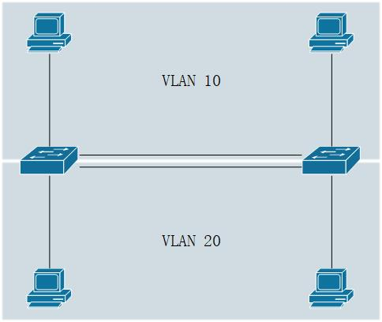
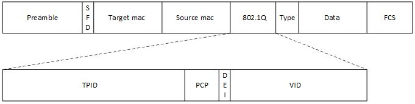
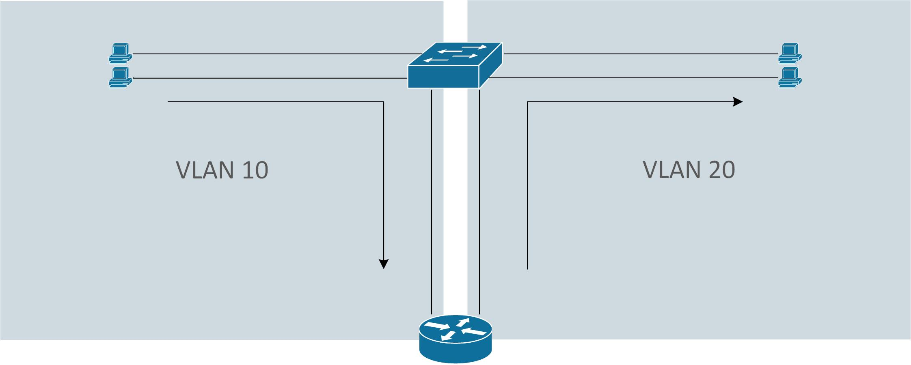

LAN(Local Area Network)<br>
单个广播域内所有的设备组成一个LAN
<br>
<br>
<br>

VLAN(Virtual LAN)<br>
在交换机中, 一个VLAN代表一个广播域, 而单个交换机可创建多个VLAN
<br>
<br>
<br>

交换机之间的多VLAN(VLAN内部)的信息传递<br>
1.每个VLAN使用一条线路传递帧. 如下图<br>


<br>
<br>

2.使用一条trunk线路传递所有VLAN的帧, 该头部需添加802.1Q字段, 标记帧的所属VLAN. 如下图<br>

<br>
各字段含义如下:<br>
TPID: 16 bits, 全称Tag Protocol Identifier, 用于标记802.1Q的帧. 值0x8100<br>

PCP: 3 bits, 全称Priority Code Point, 用于表示帧的优先等级<br>

DEI: 1 bit, 全称Drop Eligible Indicator, 用于表示是否因为阻塞而丢弃帧<br>

VID: 12 bits, 全称VLAN Identifier, 用于表示该帧所属的VLAN. Cisco将帧分为两种, 如下:<br>
&nbsp;&nbsp;&nbsp;&nbsp;&nbsp;&nbsp;&nbsp;&nbsp;normal VLAN: 1~1005, 所有的交换机都支持<br>
&nbsp;&nbsp;&nbsp;&nbsp;&nbsp;&nbsp;&nbsp;&nbsp;extend VLAN: 1006~4094, 部分交换机支持<br>

** VLAN 1通常为管理VLAN, 又称为Native VLAN, 传递该VLAN的帧时, 不携带802.1Q字段
<br>
<br>

多VLAN之间的信息传递<br>
使用路由器对信息进行路由转发. 如下图<br>

<br>
<br>

配置VLAN access接口<br>
1.进入VLAN模式(当VLAN不存在时创建该VLAN)<br>
`(config)# vlan 10`
<br>

2.VLAN命名与启动/关闭<br>
```
(config-vlan)# name <name>
(config-vlan)# [no] shutdown
```
<br>

3.交换机接口设置access模式<br>
`(config-if)# switchport mode access`
<br>

4.交换机接口设置所属VLAN<br>
`(config-if)# switchport access vlan 10`
<br>
<br>

配置VLAN trunk接口<br>
1.交换机接口配置为trunk模式<br>
`(config-if)# switchport mode trunk`
<br>

2.交换机配置使用的trunk协议<br>
`(config-if)# switchport trunk encapsulation {dot1q | isl}`
<br>
<br>

使用DTP(Dynamic Trunking Protocol)配置接口<br>
1.交换机接口配置为动态协商<br>
`(config-if)# switchport mode dynamic {desirable | auto}`<br>
** desirable初始化协商并主动发送消息, 确定是否使用trunk模式; auto为被动模式, 等待接收协商消息后, 再回馈协商是否使用trunk<br>
** 链路两端都为auto时, 为access模式接口<br>
** 若想设置达到预期(参考table 1), 需要对面不显式关闭DTP negotiate. 指令如下:<br>
** &nbsp;&nbsp;&nbsp;&nbsp;`(config-if)# switchport nonegotiate`<br>
** 为安全考虑, Cisco不建议使用DTP
<br>

2.交换机配置使用的trunk协议<br>
`(config-if)# switchport trunk encapsulation {dot1q | isl | negotiate}`
<br>
<br>


链路两端的模式配置与结果对照表(table 1)<br>
|Administrative mode  |access  |trunk     |dynamic desirable | dynamic auto |
|---------------------|--------|----------|------------------|--------------|
|__access__           |access  |no support|access            |access        |
|__trunk__            |not support|trunk  |trunk             |trunk         |
|__dynamic desirable__|access  |trunk     |trunk             |trunk         |
|__dynamic auto__     |access  |trunk     |trunk             |access        |

<br>
<br>


查看VLAN信息
```
# show vlan brief
VLAN Name                             Status    Ports                           
---- -------------------------------- --------- ------------------------------- 
10   custom                           active    Fa0/3
```
<br>
<br>

查看指定VLAN的信息
```
# show vlan id 10
VLAN Name                             Status    Ports                           
---- -------------------------------- --------- ------------------------------- 
10   custom                           active    Fa0/3                           
                                                                                
VLAN Type  SAID       MTU   Parent RingNo BridgeNo Stp  BrdgMode Trans1 Trans2  
---- ----- ---------- ----- ------ ------ -------- ---- -------- ------ ------  
10   enet  100010     1500  -      -      -        -    -        0      0       
                                                                                
Remote SPAN VLAN                                                                
----------------                                                                
Disabled                                                                        
                                                                                
Primary Secondary Type              Ports                                       
------- --------- ----------------- ------------------------------------------ 
``` 
<br>
<br>

交换机的VLAN配置与应用模式
```
# show interface f0/4 switchport
Name: Fa0/4                                                                   
Switchport: Enabled                                                             
Administrative Mode: dynamic auto                                               
Operational Mode: trunk                                                         
Administrative Trunking Encapsulation: negotiate                                
Operational Trunking Encapsulation: dot1q                                       
Negotiation of Trunking: On                                                     
Access Mode VLAN: 1 (default)                                                   
Trunking Native Mode VLAN: 1 (default)                                          
Administrative Native VLAN tagging: enabled                                     
Voice VLAN: none                                                                
Administrative private-vlan host-association: none                              
Administrative private-vlan mapping: none                                       
Administrative private-vlan trunk native VLAN: none                             
Administrative private-vlan trunk Native VLAN tagging: enabled                  
Administrative private-vlan trunk encapsulation: dot1q                          
Administrative private-vlan trunk normal VLANs: none                            
Administrative private-vlan trunk private VLANs: none                           
Operational private-vlan: none                                                  
Trunking VLANs Enabled: ALL                                                     
Pruning VLANs Enabled: 2-1001                                                   
Capture Mode Disabled                                                           
Capture VLANs Allowed: ALL 
                                                                                
Protected: false                                                                
Unknown unicast blocked: disabled                                               
Unknown multicast blocked: disabled                                             
Appliance trust: none
```
<br>
<br>

查看trunk模式接口信息
```
# show interfaces trunk
Port        Mode         Encapsulation  Status        Native vlan               
Fa2/0/4     auto         n-802.1q       trunking      1                         
                                                                                
Port      Vlans allowed on trunk                                                
Fa2/0/4     1-4094                                                              
                                                                                
Port        Vlans allowed and active in management domain                       
Fa2/0/4     1,10,20,95,107,209,307                                              
                                                                                
Port        Vlans in spanning tree forwarding state and not pruned              
Fa2/0/4     1,10,20,95,107,209,307
```
<br>
<br>

trunk接口故障排查<br>
1.是否所有VLAN都存在, 并且为active状态<br>
`# show vlan brief`
<br>
<br>

2.链路两端是否都正确配置为trunk<br>
`# show interfaces f0/4 switchport`
<br>
<br>

3.trunk接口支持的vlan列表<br>
`# show int f0/4 trunk`
<br>

指定trunk接口支持的vlan列表<br>
`(config-if)# switchport trunk allowed vlan 1,10,20`
<br>
<br>

4.链路两端的native vlan是否匹配<br>
`# show int f0/4 trunk`
<br>

设置native vlan<br>
`(config-if)# switchport trunk native vlan 1`

