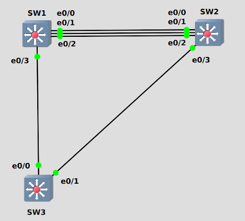

STP(Spanning Tree Protocol)<br>
通过阻塞接口, 阻止在物理冗余链路中形成环回链路
<br>
<br>
<br>

STP工作步骤<br>
1.从所有交换机中选择网桥ID最小的, 作为root switch, 该交换机所有接口为designated port, 处于转发状态<br>
** 网桥ID为8 bytes, 前2 bytes为优先级, 可手动设置为4096的倍数N, 结果为N+vlan_num, N默认设置为32768; 后6 bytes为mac地址
<br>
<br>

2.从每一个非root switch中, 选取该交换机与root switch含最少链路成本的路径, 其对应的接口为root port<br>

如果多条链路成本相同, 则比较当前交换机的邻接交换机网桥ID, 网桥ID小的, 其邻接接口成为root port<br>

如果多条链路成本和邻接网桥ID相同(两台交换机多条链路), 则比较当前交换机的邻接交换机port priority, port priority小的, 链路另一端成为root port<br>

如果上述都相同, 则比较当前交换机的邻接交换机port number, port number小的, 链路另一端成为root path<br>
** 链路成本由每紧邻交换机之间的链路带宽决定. 列表如下:<br>
|链路速度    |链路成本(1998 and before) |链路成本(2004)|
|-----------:|-------------------------:|-------------:|
|10  Mbit/s  |100                       |2,000,000     |
|100 Mbit/s  |19                        |200,000       |
|1   Gbit/s  |4                         |20,000        |
|10  Gbit/s  |2                         |2,000          |
|100 Gbit/s  |N/A                       |200           |
|1   Tbit/s  |N/A                       |20            |

<br>
<br>

3.其他接口, 如果与root port位于同一链路, 设置为designated port<br>

如果有一条链路两端都没有设置接口类型, 则比较两端, 到root switch的链路成本最少的设备, 该设备的端口设置为designated port; 如果链路成本相同, 网桥ID最小一端的接口设置为designated port<br>

最后, root port和designated port设置为转发状态, 其他接口设置为阻塞状态
<br>
<br>
<br>

STP由blocking state到forward state的转变过程
|当前状态       |停留时间      |状态特征             |
|---------------|--------------|---------------------|
|blocking state |20s(由max age指定)      |只接收BPDU           |
|listening state|15s(由forward delay指定)|只接收BPDU, 并清除mac address-table内容|
|learning state |15s(由forward delay指定)|接收BPDU, 并接收frame, 更新mac address-table|
|forward state  |stay          |接口启动             |

<br>

STP由forward state到blocking state的过程即刻完成
<br>
<br>
<br>

查看STP的汇总信息
```
# show spanning-tree summary
Switch is in pvst mode
Root bridge for: none
EtherChannel misconfig guard            is enabled
Extended system ID                      is enabled
Portfast Default                        is disabled
Portfast Edge BPDU Guard Default        is disabled
Portfast Edge BPDU Filter Default       is disabled
Loopguard Default                       is disabled
Platform PVST Simulation                is enabled
PVST Simulation Default                 is enabled but inactive in pvst mode
Bridge Assurance                        is enabled but inactive in pvst mode
Pathcost method used                    is short
UplinkFast                              is disabled
BackboneFast                            is disabled

Name                   Blocking Listening Learning Forwarding STP Active
---------------------- -------- --------- -------- ---------- ----------
VLAN0001                     0         0        0          4          4
---------------------- -------- --------- -------- ---------- ----------
1 vlan                       0         0        0          4          4
```
<br>
<br>

查看根网桥信息
```
# show spanning-tree root
Vlan                   Root ID          Cost  Time Age Dly  Root Port
---------------- -------------------- ------ ----- --- ---  ----------------
VLAN0001         32769 aabb.cc00.0100       100    2   20  15  Et0/0           
```
<br>
<br>

查看当前交换机的STP信息
```
# show spanning-tree bridge id
VLAN0001         8001.aabb.cc00.0200
```
<br>
<br>

查看STP信息
```
# show spanning-tree
VLAN0001
  Spanning tree enabled protocol ieee
  Root ID    Priority    32769
             Address     aabb.cc00.0100
             Cost        100
             Port        1 (Ethernet0/0)
             Hello Time   2 sec  Max Age 20 sec  Forward Delay 15 sec

  Bridge ID  Priority    32769  (priority 32768 sys-id-ext 1)
             Address     aabb.cc00.0200
             Hello Time   2 sec  Max Age 20 sec  Forward Delay 15 sec
             Aging Time 300

Interface           Role Sts Cost      Prio.Nbr Type
------------------- ---- --- --------- -------- --------------------------------
Et0/0               Root FWD 100       128.1    Shr 
Et0/1               Desg FWD 100       128.2    Shr 
Et0/2               Desg FWD 100       128.3    Shr 
Et0/3               Desg FWD 100       128.4    Shr 
```
<br>
<br>

配置指定vlan的优先级<br>
** 优先级必须配置为4096的倍数, 默认为32768<br>
`(config)# spanning-tree vlan <vlan> priority <priority>`
<br>
<br>

配置指定vlan的根网桥<br>
** 将网桥优先级设置为能成为根网桥的内容<br>
`(config)# spanning-tree vlan <vlan> root primary`
<br>
<br>

配置指定vlan的次级根网桥<br>
`(config)# spanning-tree vlan <vlan> root secondary`
<br>
<br>

配置指定vlan的路径cost<br>
`(config-if)# spanning-tree vlan 10 cost 2000`
<br>
<br>

配置指定vlan的接口优先级<br>
** 优先级必须为64的倍数, 默认为128<br>
`(config-if)# spanning-tree vlan <vlan> port-priority <priority>`
<br>
<br>

配置链路成本计算标准(1998/2004)
```
(config)# spanning-tree pathcost method short
(config)# spanning-tree pathcost method long
```
<br>
<br>

配置定时器(所有交换机需同步配置)
```
(config)# spanning-tree vlan 1 hello-time 2
(config)# spanning-tree vlan 1 forward-time 15
(config)# spanning-tree vlan 1 max-age 20
```
<br>
<br>

RSTP(Rapid STP)<br>
与STP最大的区别是blocking state到forward state的转变速度加快, 所以网络收敛速度大大加快
<br>

STP与RSTP之间的模式切换<br>
** pvst指代per vlan STP<br>
`(config)# spanning-tree mode {pvst | rapid-pvst}`
<br>
<br>
<br>

Etherchannel<br>
将两台交换机之间的多条网络速度相同的链路, 聚合为一条链路, 流量在每条线路进行负载均衡
<br>

<br>
配置类型:<br>
1.手动配置etherchannel<br>
将接口手动加入channel group
<br>

实例<br>
** 链路两端的channel group可以不同, 但同一端的所有接口, channel group必须一致
```
SW1(config)# int range e0/0-2
SW1(config-if-range)# channel-group 1 mode on
SW1(config-if-range)# int port-channel1
SW1(config-if)# no shutdown

SW1# show etherchannel 1 summary

SW2(config)# int range e0/0-2
SW2(config-if-range)# channel-group 2 mode on
SW2(config-if-range)# int port-channel2
SW2(config-if)# no shutdown

SW2# show etherchannel 2 summary
```
<br>

2.自动配置etherchannel<br>
判断当前链路的两端配置, 以确定是否将该链路加入etherchannel
<br>

自动配置etherchannel协议:<br>
1)PAgP(Port Aggregation Protocol)<br>
Cisco专有协议
<br>

实例<br>


2)LACP(Link Aggregation Control Protocol)<br>
IEEE 802.3ad, 最高支持16条链路加入, 其中8条active, 8条备用
<br>


** 自动配置时, 链路两端必须至少有一端为主动协商, 即desirable/active
<br>
<br>
<br>

portfast<br>
在连接终端设备的access接口上配置, 接口直接由blocking state转化为forward state, 不参与STP收敛
<br>

在接口启用portfast<br>
`(config-if)# spanning-tree portfast`
<br>

在所有access模式接口启用portfast<br>
`(config)# spanning-tree portfast default`
<br>
<br>
<br>

bpduguard<br>
在连接终端设备的access接口上配置, 在该接口收到BPDU时, 进行端口阻塞
<br>

在接口启用bpduguard<br>
`(config-if)# spanning-tree bpduguard enable`
<br>

在所有启动portfast的接口启用bpduguard<br>
`(config)# spanning-tree portfast bpduguard default`
