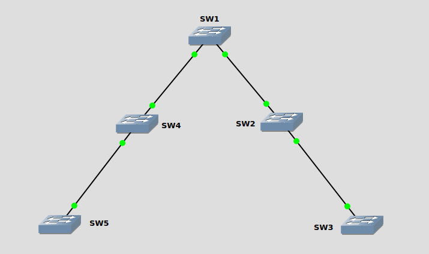

##### VTP
VTP(VLAN Trunking Protocol)<br>
Cisco私有协议, 在拥有较多的交换机环境中, 在VTP域内, 从VTP server向VTP client扩散VLAN配置
<br>
<br>

VTP模式:<br>
1.Server<br>
可以添加/删除/修改VLAN<br>
指定VTP版本<br>
加入指定domain<br>
在当前domain内进行信息通告, 同步vlan列表<br>

2.Client<br>
不可以添加/删除/修改VLAN<br>
不可以指定VTP版本<br>
加入指定domain<br>

3.Transparent<br>
可以添加/删除/修改VLAN<br>
不加入VTP domain<br>
但会转发收到的advertisement
<br>
<br>

VTP message types:<br>
1.Summary advertisements<br>
每隔五分钟发送summary advertisement<br>

2.Subset advertisement<br>
当VLAN进行添加/删除/修改时, 生成该advertisement, 并生成summary advertisement<br>

3.Advertisement requests<br>
以下情况会发送advertisement request:<br>
1)switch重置<br>
2)VTP domain改变<br>
3)收到summary advertisement, 并且revision number高于当前交换机<br>
当交换机收到advertisement request, 发送summary advertisement, 并发送完整subnet advertisement<br>

4.VTP join messages
<br>
<br>

配置VTP<br>
1.配置VTP版本<br>
`(config)# vtp version {1 | 2 | 3}`
<br>

2.配置VTP域<br>
`(config)# vtp domain <domain_name>`
<br>

3.配置VTP mode<br>
`(config)# vtp mode { server | client | transparent | none}`
<br>

*4.配置VTP密码(可选, 建议配置)<br>
`(config)# vtp password <passwd>`
<br>

*5.配置pruning<br>
`(config)# vtp pruning`<br>
** pruning特性: 当一个接口不属于一个特定VLAN时, 不向该接口泛洪该特定VLAN的帧
<br>
<br>

VTP v2相对于v1的改变<br>
添加Token Ring VLAN
<br>
<br>

VTP v3相对于v1/v2的改变(从Cisco IOS 12.2(33)SXI开始支持VTP v3)<br>
1.v1/v2支持VLAN范围[1,1000], v3支持VLAN范围[1,4094]<br>
2.如果存在多个server, v3配置一个作为primary server, 其他作为secondary server(secondary server不可以添加/删除/修改VLAN)<br>
** 手动配置primary server<br>
`# vtp primary`
<br>
<br>

查看VTP状态<br>
`# show vtp status`
<br>

流量统计<br>
`# show vtp counters`
<br>

流量监测<br>
`# debug sw-vlan vtp packets`
<br>
<br>

<br>
配置实例
```
SW1(config)# vtp domain cisco
SW1(config)# vtp version 3
SW1(config)# vtp mode server
SW1# vtp primary

SW2(config)# vtp domain cisco
SW2(config)# vtp version 3
SW2(config)# vtp mode transparent

SW3(config)# vtp domain cisco
SW3(config)# vtp version 3
SW3(config)# vtp mode client

SW4(config)# vtp domain cisco
SW4(config)# vtp version 3
SW4(config)# vtp mode client

SW5(config)# vtp domain cisco
SW5(config)# vtp version 3
SW5(config)# vtp mode client
```
<br>
<br>

引用:<br>
[1] Understand VLAN Trunk Protocol (VTP): https://www.cisco.com/c/en/us/support/docs/lan-switching/vtp/10558-21.html

[2] Configure VLAN Trunk Protocol (VTP): https://www.cisco.com/c/en/us/support/docs/lan-switching/vtp/98154-conf-vlan.html

[3] Catalyst 6500 Release 12.2SX Software Configuration Guide: https://www.cisco.com/c/en/us/td/docs/switches/lan/catalyst6500/ios/12-2SX/configuration/guide/book/vtp.html
