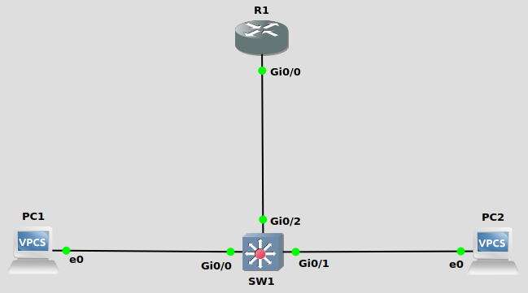
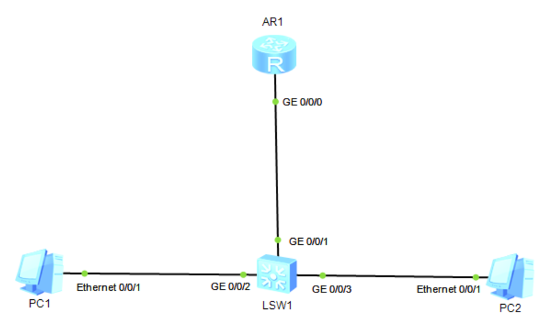
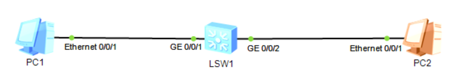

#### VLAN间路由(inter-VLAN)
##### Cisco配置vlan间路由的方式:
1.使用路由器的路由功能<br>
&emsp;&emsp;每个vlan使用一个路由器接口, 该方式使用过多路由器接口, 不推荐
<br>

2.使用路由器的路由功能<br>
&emsp;&emsp;所有vlan使用同一个路由器接口(Router On A Stick, ROAS), 引用路由器子接口概念, 用于vlan数量较少的情况
<br>

3.使用第三层交换机的路由功能<br>
&emsp;&emsp;使用交换机的SVI接口
<br>

4.使用第三层交换机的路由功能<br>
&emsp;&emsp;使用交换机的路由接口, 用于只有一个接口连接到指定VLAN的情况
<br>
<br>
<br>

在VLAN间配置路由(路由器的单个接口, ROAS - router on a stick )<br>
1.创建子接口<br>
`(config)# interface <interface>.<sub_interface>`
<br>

2.将子接口与vlan连接, 并指定封装模式<br>
`(config-subif)# encapsulation dot1q <vlan>`
<br>

3.配置子接口IP地址<br>
```
(config-subif)# ip address <ip_addr> <subnet_mask>
(config-subif)# no shutdown
```
<br>

4.配置native vlan<br>
1)在路由器物理接口上直接配置ip address<br>
`(config)# int f0/0`<br>
`(config-if)# ip address <ip_addr> <subnet_mask>`<br>

2)在路由器子接口上配置封装时, 指定native<br>
`(config)# int f0/0.10`<br>
`(config-if)# encapsulation dot1q <vlan_id> native`
<br>
<br>

图1<br>
<br>
Cisco实例(如图1)
```
SW1(config)# vlan 10
SW1(config-vlan)# vlan 20
SW1(config-vlan)# int g0/0
SW1(config-if)# switchport mode access
SW1(config-if)# switchport access vlan 10
SW1(config-if)# int g0/1
SW1(config-if)# switchport mode access
SW1(config-if)# switchport access vlan 20
SW1(config-if)# int g0/2
SW1(config-if)# switchport trunk encapsulation dot1q
SW1(config-if)# switchport mode trunk

R1(config)# interface g0/0
R1(config-if)# no shutdown
R1(config-if)# interface g0/0.10
R1(config-subif)# encapsulation dot1q 10
R1(config-subif)# ip address 192.168.10.1 255.255.255.0
R1(config-subif)# interface g0/0.20
R1(config-subif)# encapsulation dot1q 20
R1(config-subif)# ip address 192.168.20.1 255.255.255.0

PC1> ip 192.168.10.2 192.168.10.1

PC2> ip 192.168.20.2 192.168.20.1


PC1> ping 192.168.20.2

84 bytes from 192.168.20.2 icmp_seq=1 ttl=63 time=33.520 ms
84 bytes from 192.168.20.2 icmp_seq=2 ttl=63 time=14.658 ms
84 bytes from 192.168.20.2 icmp_seq=3 ttl=63 time=15.277 ms
84 bytes from 192.168.20.2 icmp_seq=4 ttl=63 time=22.420 ms
84 bytes from 192.168.20.2 icmp_seq=5 ttl=63 time=20.637 ms
```
<br>
<br>
<br>

在VLAN间配置路由(L3 switch的SVI接口)<br>
1.启动路由功能<br>
```
(config)# sdm prefer lanbase-routing
# reload
(config)# ip routing
```
<br>

2.给SVI接口赋予IP地址<br>
```
(config)# intface vlan <vlan>
(config-if)# ip address <ip_addr> <subnet_mask>
(config-if)# no shutdown
```
<br>
<br>

图2<br>
<br>

Cisco实例(如图2)<br>
```
SW1(config)# ip routing
SW1(config)# vlan 10
SW1(config-vlan)# vlan 20
SW1(config-vlan)# int g0/0
SW1(config-if)# switchport mode access 
SW1(config-if)# switchport access vlan 10
SW1(config-if)# int g0/1
SW1(config-if)# switchport mode access
SW1(config-if)# switchport access vlan 20
SW1(config-if)# int vlan 10
SW1(config-if)# ip add 192.168.10.1 255.255.255.0
SW1(config-if)# no shutdown
SW1(config-if)# int vlan 20
SW1(config-if)# ip add 192.168.20.1 255.255.255.0
SW1(config-if)# no shutdown

PC1> ip 192.168.10.2 255.255.255.0 192.168.10.1

PC2> ip 192.168.20.2 255.255.255.0 192.168.20.1


PC1> ping 192.168.20.2

84 bytes from 192.168.20.2 icmp_seq=1 ttl=63 time=3.404 ms
84 bytes from 192.168.20.2 icmp_seq=2 ttl=63 time=3.509 ms
84 bytes from 192.168.20.2 icmp_seq=3 ttl=63 time=3.966 ms
84 bytes from 192.168.20.2 icmp_seq=4 ttl=63 time=3.987 ms
84 bytes from 192.168.20.2 icmp_seq=5 ttl=63 time=4.563 ms
```
<br>
<br>
<br>

在VLAN间配置路由(L3 switch的routed接口)<br>
1.启动路由功能<br>
```
(config)# sdm prefer lanbase-routing
# reload
(config)# ip routing
```
<br>

2.给routed接口赋予IP地址<br>
```
(config)# intface g0/0
(config-if)# no switchport
(config-if)# ip address <ip_addr> <subnet_mask>
(config-if)# no shutdown
```
<br>
<br>

Cisco实例(如图2)<br>
```
SW1(config)# ip routing
SW1(config)# int g0/0
SW1(config-if)# no switchport   
SW1(config-if)# ip add 192.168.10.1 255.255.255.0
SW1(config-if)# no shutdown
SW1(config-if)# int g0/1
SW1(config-if)# no switchport                    
SW1(config-if)# ip add 192.168.20.1 255.255.255.0
SW1(config-if)# no shutdown

PC1> ip 192.168.10.2 255.255.255.0 192.168.10.1

PC2> ip 192.168.20.2 255.255.255.0 192.168.20.1


PC1> ping 192.168.20.2

84 bytes from 192.168.20.2 icmp_seq=1 ttl=63 time=5.080 ms
84 bytes from 192.168.20.2 icmp_seq=2 ttl=63 time=2.451 ms
84 bytes from 192.168.20.2 icmp_seq=3 ttl=63 time=2.977 ms
84 bytes from 192.168.20.2 icmp_seq=4 ttl=63 time=2.697 ms
84 bytes from 192.168.20.2 icmp_seq=5 ttl=63 time=1.995 ms
```
<br>
<br>

##### Huawei配置vlan间路由的方式:
1.使用路由器的路由功能<br>
&emsp;&emsp;每个vlan使用一个路由器接口, 该方式使用过多路由器接口, 不推荐
<br>

2.使用路由器的路由功能<br>
&emsp;&emsp;所有vlan使用同一个路由器接口(Router On A Stick, ROAS), 引用路由器子接口概念, 用于vlan数量较少的情况
<br>

3.使用第三层交换机的路由功能<br>
&emsp;&emsp;使用交换机的SVI接口
<br>
<br>
<br>

在VLAN间配置路由(路由器的单个接口, ROAS - router on a stick )<br>
1.创建子接口<br>
`[HW] interface <if>.<subif>`

2.指定封装<br>
`[HW-subif] dot1q termination vid <vlan>`

3.配置子接口IP地址<br>
```
[HW-subif] ip add <ip_add> {<mask> | <prefix>}
[HW-subif] arp broadcast enable
```
<br>
<br>

图3<br>
<br>

示例(如图3)
```
[LSW1] vlan batch 10 20
[LSW1] int g0/0/1
[LSW1-GigabitEthernet0/0/1] port link-type trunk
[LSW1-GigabitEthernet0/0/1] port trunk allow-pass vlan 10 20
[LSW1-GigabitEthernet0/0/1] int g0/0/2
[LSW1-GigabitEthernet0/0/2] port link-type access
[LSW1-GigabitEthernet0/0/2] port default vlan 10
[LSW1-GigabitEthernet0/0/2] int g0/0/3
[LSW1-GigabitEthernet0/0/3] port link-type access
[LSW1-GigabitEthernet0/0/3] port default vlan 20

[R1] int g0/0/0.10
[R1-GigabitEthernet0/0/0.10] dot1q termination vid 10
[R1-GigabitEthernet0/0/0.10] ip add 192.168.10.1 24
[R1-GigabitEthernet0/0/0.10] arp broadcast enable
[R1-GigabitEthernet0/0/0.10] int g0/0/0.20
[R1-GigabitEthernet0/0/0.20] dot1q termination vid 20
[R1-GigabitEthernet0/0/0.20] ip add 192.168.20.1 24
[R1-GigabitEthernet0/0/0.20] arp broadcast enable
```
<br>
<br>

在VLAN间配置路由(L3 switch的SVI接口)<br>
1.给vlanif接口赋予IP地址<br>
```
[HW] interface vlanif <vlan>
[HW-Vlanif10] ip add <ip_add> {<mask> | <prefix>}
```
<br>
<br>

图4<br>
<br>

示例(如图4)
```
[LSW1] vlan batch 10 20
[LSW1] int g0/0/1
[LSW1-GigabitEthernet0/0/1] port link-type access
[LSW1-GigabitEthernet0/0/1] port default vlan 10
[LSW1-GigabitEthernet0/0/1] int g0/0/2
[LSW1-GigabitEthernet0/0/2] port link-type access
[LSW1-GigabitEthernet0/0/2] port default vlan 20
[LSW1-GigabitEthernet0/0/2] int vlanif 10
[LSW1-Vlanif10] ip add 192.168.10.1 24
[LSW1-Vlanif10] int vlanif 20
[LSW1-Vlanif20] ip add 192.168.20.1 24
```
<br>
<br>
