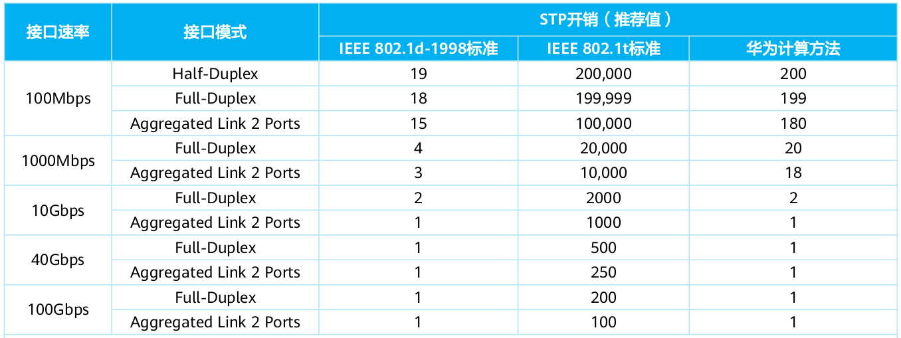
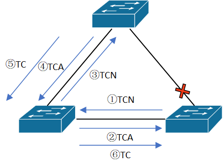
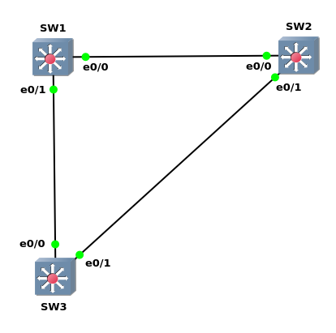

#### STP(Spanning Tree Protocol)<br>
通过阻塞接口, 阻止在物理冗余链路中形成环回链路<br>
拓扑稳定后，根桥按照Hello Timer规定的时间间隔发送配置BPDU。其他非根桥设备在收到上游设备发送过来的配置BPDU后，才会触发发出配置BPDU
<br>
<br>
<br>

STP迭代类型:<br>
- 802.1d Spanning Tree Protocol(STP)

- 802.1w Rapid Spanning Tree Protocol (RSTP)

- 802.1s Multiple Spanning Tree Protocol (MST, IEEE适用于STP的多VLAN版本)

- Per-VLAN Spanning Tree (PVST, Cisco适用于STP的多VLAN版本)

- Rapid Per-VLAN Spanning Tree(RPVST, Cisco适用于RSTP的多VLAN版本)
<br>
<br>
<br>

STP端口状态
|当前状态       |状态特征                                    |
|---------------|--------------------------------------------|
|Disable        |不接收/发送BPDU, 接口处于Down状态           |
|Blocking       |只接收BPDU                                  |
|Listening      |只接收/发送BPDU                             |
|Learning       |接收/发送BPDU, 接收但不转发帧, 从接收帧更新mac-address-table|
|Forwarding     |接收/转发BPDU和帧, 更新mac address-table             |

** STP由forwarding state到blocking state的过程即刻完成
<br>
<br>
<br>

802.1d端口类型
- Root port<br>
连接到根交换机(或离根交换机更近的上游交换机)的端口

- Designated port<br>
连接到下游交换机的端口, 该交换机端口处于forwarding状态
<br>
<br>
<br>

STP关键字
- STP组播mac地址<br>
01:80:c2:00:00:00

- Root bridge<br>
L2拓扑中最重要的交换机, 所有接口处于转发状态, 并且分类为designated port

- Bridge protocol data unit(BPDU)<br>
交换机之间交换信息的包, 分为以下类型:<br>
&emsp;&emsp;1.configuration BPDU(0x00)<br>
&emsp;&emsp;选举出根网桥之前, 交换机之间互相发送该类信息; 选举出根网桥后, 由根交换机主动向其他交换机发送, 其他交换器收到上游网桥的BPDU后, 再发送自己的BPDU<br>
&emsp;&emsp;2.topology change notification(TCN) BPDU(0x80)<br>
&emsp;&emsp;当拓扑发生改变时, 由非根交换机向上游交换机发送

- Root path cost<br>
通往根交换机的路径消耗

- System priority<br>
用于root switch选举, 使用4 bits, 最大值为(2^4-1) * 4096 = 15 * 4096 = 61440<br>

- System ID extension<br>
用于指定VLAN, 使用12 bits

- Root bridge identifier<br>
根交换机的信息

- Local bridge identifier<br>
当前交换机的信息

- Max age<br>
保留原BPDU信息的时间, 默认为20s<br>
修改值:<br>
`(config)# spanning-tree vlan <vlan> max-age <max_age>`

- Hello time<br>
发送BPDU的间隔时间, 默认为2s<br>
修改值:<br>
`(config)# spanning-tree vlan <vlan> hello-time <hello_time>`

- Forward delay<br>
交换机停留在listening/learning状态的时间, 默认为15s<br>
修改值:<br>
`(config)# spanning-tree vlan <vlan> forward-time <forward_time>`
<br>
<br>
<br>

STP收敛时间:<br>
1.直连链路故障(30s)<br>
$\textrm{Disable}\xrightarrow{\hspace{2cm}}\textrm{Blocking}\xrightarrow{\hspace{2cm}}\textrm{Listening}\xrightarrow{\textrm{Forward\ delay(15s)}}\textrm{Learning}\xrightarrow{\textrm{Forward\ delay(15s)}}\textrm{Forwarding}$

2.非直连链路或网桥故障(50s):<br>
$\textrm{Disable}\xrightarrow{\textrm{Max\ age(20s)}}\textrm{Blocking}\xrightarrow{\hspace{2cm}}\textrm{Listening}\xrightarrow{\textrm{Forward\ delay(15s)}}\textrm{Learning}\xrightarrow{\textrm{Forward\ delay(15s)}}\textrm{Forwarding}$
<br>
<br>
<br>

STP拓扑完成<br>
1.选举出root switch(root switch为可抢占)<br>
&emsp;&emsp;每个交换机将自己视为root switch, 发送configuration BPDU, 并将接收到的configuration BPDU与自身的进行比较, 比较结果如下:<br>
&emsp;&emsp;1)如果接收的BPDU的网桥ID次于自身BPDU, 忽略接收的BPDU<br>
&emsp;&emsp;2)如果接收的BPDU的网桥ID优于自身BPDU, 交换机更新BPDU信息<br>
** 网桥ID为8 bytes, 前2 bytes(4 bits优先级, 12 bits VLAN)为对应VLAN的优先级; 后6 bytes为mac地址. 网桥ID值低的获胜
<br>
<br>

2.从每一个非root switch中, 确定root port. 判断条件如下:<br>
1)最少path cost<br>
path cost为到root switch的总link cost<br>
链路成本如下:<br>

<br>
<br>

2)当前交换机的邻接交换机网桥ID, 网桥ID小的, 连接该交换机的接口成为root port
<br>
<br>

3)当前交换机的邻接交换机port ID(port ID由port priority和port number组成), port ID小的, 连接该端口的接口成为root port<br>
** port ID为2 bytes, 前4 bits为port priority, 后续12 bits为port number
<br>
<br>

4)当前交换机的port ID，port ID小的，接口成为root port
<br>
<br>

3.剩余所有的接口, 则进行如下判定:<br>
1)如果链路上的另一端为root port，则判定当前接口为designate端口<br>
2)如果链路上的另一端不为root port, 再进行如下比较:<br>
&emsp;&emsp;[1]如果当前接口的path cost更低, 则当前接口为designate port, 链路的另一端为alternate port, 反之则当前接口为alternate port, 链路另一端为designate port<br>
&emsp;&emsp;[2]如果当前接口的网桥ID更低, 则当前接口为designate port, 链路的另一端为alternate port, 反之则当前接口为alternate port, 链路的另一端为designate port
<br>
<br>

4.阻塞剩余接口
<br>
<br>
<br>

STP拓扑变动<br>
<br>

该拓扑中，顶部交换机为SW1，左侧交换机为SW2，右侧交换机为SW3，交换机网桥优先级一致，mac地址SW1 < SW2 < SW3。SW3上，与SW1的连接接口被关闭。流程如下：<br>
1.SW3向SW2发送TCN，SW2将TCN向上游SW1传递，并发送TCA给SW3<br>

2.SW1收到TCN，发送TCA给SW2，随后发送TC给SW2<br>

3.SW2将TC转发给SW3<br>
** TCA和TC都属于配置BPDU<br>
** TC会告知下游网桥, 将默认的300s的MAC地址表老化时间, 修改为Forward Delay时间
<br>
<br>
<br>

Cisco配置STP:
```
1.选择STP模式
(config)# spanning-tree mode {pvst | rapid-pvst | mst}


2.配置网桥优先级
1)直接配置优先级
(config)# spanning-tree vlan <vlan> priority <priority>

2)将网桥配置为根网桥
(config)# spanning-tree vlan <vlan> root primary

3)将网桥配置为次级根网桥
(config)# spanning-tree vlan <vlan> root secondary


3.配置链路cost
1)cost模式切换(short模式为802.1d，long模式为802.1t)
(config)# spanning-tree pathcost method {short | long}

2)配置指定cost
(config-if)# spanning-tree vlan 10 cost 2000


4.配置接口优先级
** 优先级必须为16的倍数, 默认为128
(config-if)# spanning-tree vlan <vlan> port-priority <priority>


5.显示stp信息
# show spanning-tree summary
```
<br>
<br>

Huawei配置STP:
```
1.启动stp
[HW] stp enable


2.选择STP模式
[HW] stp mode {stp | rstp | mstp}


3.配置网桥优先级
1)直接配置优先级
[HW] stp priority <priority>

2)配置为根网桥
[HW] stp root primary

3)配置为次级根网桥
[HW] stp root secondary


4.配置链路cost
1)配置cost模式
[HW] stp pathcost-standard {dot1d-1998 | dot1t | legacy}

2)配置cost
[HW-g0/0/1] stp cost <cost>


5.配置接口优先级
[HW-g0/0/1] stp priority <priority>


6.显示stp信息
<HW> display vlan brief
```
<br>
<br>

#### RSTP(Rapid STP)
相较于STP，RSTP能对拓扑变化更快地收敛<br>
拓扑稳定后，无论非根桥设备是否接收到根桥传来的配置BPDU报文，非根桥设备仍然按照Hello Timer规定的时间间隔发送配置BPDU
<br>
<br>

RSTP端口状态
|当前状态       |状态特征                                              |
|---------------|------------------------------------------------------|
|Discarding     |只接收/发送BPDU, 合并STP的blocking和listening状态     |
|Learning       |接收/发送BPDU, 接收但不转发流量, 更新mac address-table|
|Forwarding     |接收/转发BPDU和流量, 更新mac address-table            |

<br>
<br>

RSTP(802.1w)端口类型<br>
- Root port<br>
连接到根交换机(或离根交换机更近的上游交换机)的端口

- Designated port<br>
连接到下游交换机的端口, 该交换机端口处于Forwarding状态

- Alternative port<br>
处于Discarding状态的端口, 作为根接口的备份接口, 在根接口出现故障时快速转化

- Backup port<br>
处于Discarding状态的端口, 作为指定接口的备份, 在指定接口出现故障时快速转化

- edge port<br>
作为与终端设备直接连接的接口, 可以直接由Discarding转化为Forwarding状态<br>
但是一旦边缘端口收到BPDU报文，就丧失了边缘端口属性，成为普通STP端口<br>

Huawei配置边缘接口:<br>
`[SW-g0/0/1] stop edged-port enable`
<br>
<br>

图1<br>
<br>

示例1(如图1)
```
SW1# show spanning-tree

VLAN0001
  Spanning tree enabled protocol ieee
  Root ID    Priority    32769
             Address     aabb.cc00.0100
             This bridge is the root
             Hello Time   2 sec  Max Age 20 sec  Forward Delay 15 sec

  Bridge ID  Priority    32769  (priority 32768 sys-id-ext 1)
             Address     aabb.cc00.0100
             Hello Time   2 sec  Max Age 20 sec  Forward Delay 15 sec
             Aging Time  300 sec

Interface           Role Sts Cost      Prio.Nbr Type
------------------- ---- --- --------- -------- --------------------------------
Et0/0               Desg FWD 100       128.1    Shr 
Et0/1               Desg FWD 100       128.2    Shr


SW2# show spanning-tree

VLAN0001
  Spanning tree enabled protocol ieee
  Root ID    Priority    32769
             Address     aabb.cc00.0100
             Cost        100
             Port        1 (Ethernet0/0)
             Hello Time   2 sec  Max Age 20 sec  Forward Delay 15 sec

  Bridge ID  Priority    32769  (priority 32768 sys-id-ext 1)
             Address     aabb.cc00.0200
             Hello Time   2 sec  Max Age 20 sec  Forward Delay 15 sec
             Aging Time  300 sec

Interface           Role Sts Cost      Prio.Nbr Type
------------------- ---- --- --------- -------- --------------------------------
Et0/0               Root FWD 100       128.1    Shr 
Et0/1               Desg FWD 100       128.2    Shr


SW3# show spanning-tree 

VLAN0001
  Spanning tree enabled protocol ieee
  Root ID    Priority    32769
             Address     aabb.cc00.0100
             Cost        100
             Port        1 (Ethernet0/0)
             Hello Time   2 sec  Max Age 20 sec  Forward Delay 15 sec

  Bridge ID  Priority    32769  (priority 32768 sys-id-ext 1)
             Address     aabb.cc00.0300
             Hello Time   2 sec  Max Age 20 sec  Forward Delay 15 sec
             Aging Time  300 sec

Interface           Role Sts Cost      Prio.Nbr Type
------------------- ---- --- --------- -------- --------------------------------
Et0/0               Root FWD 100       128.1    Shr 
Et0/1               Altn BLK 100       128.2    Shr


配置SW3的e0/0接口cost为200
SW3(config)# int e0/0
SW3(config-if)# spanning-tree vlan 1 cost 300


SW1# show spanning-tree

VLAN0001
  Spanning tree enabled protocol ieee
  Root ID    Priority    32769
             Address     aabb.cc00.0100
             This bridge is the root
             Hello Time   2 sec  Max Age 20 sec  Forward Delay 15 sec

  Bridge ID  Priority    32769  (priority 32768 sys-id-ext 1)
             Address     aabb.cc00.0100
             Hello Time   2 sec  Max Age 20 sec  Forward Delay 15 sec
             Aging Time  15  sec

Interface           Role Sts Cost      Prio.Nbr Type
------------------- ---- --- --------- -------- --------------------------------
Et0/0               Desg FWD 100       128.1    Shr 
Et0/1               Desg FWD 100       128.2    Shr


SW2# show spanning-tree

VLAN0001
  Spanning tree enabled protocol ieee
  Root ID    Priority    32769
             Address     aabb.cc00.0100
             Cost        100
             Port        1 (Ethernet0/0)
             Hello Time   2 sec  Max Age 20 sec  Forward Delay 15 sec

  Bridge ID  Priority    32769  (priority 32768 sys-id-ext 1)
             Address     aabb.cc00.0200
             Hello Time   2 sec  Max Age 20 sec  Forward Delay 15 sec
             Aging Time  15  sec

Interface           Role Sts Cost      Prio.Nbr Type
------------------- ---- --- --------- -------- --------------------------------
Et0/0               Root FWD 100       128.1    Shr 
Et0/1               Desg FWD 100       128.2    Shr 


SW3# show spanning-tree

VLAN0001
  Spanning tree enabled protocol ieee
  Root ID    Priority    32769
             Address     aabb.cc00.0100
             Cost        200
             Port        2 (Ethernet0/1)
             Hello Time   2 sec  Max Age 20 sec  Forward Delay 15 sec

  Bridge ID  Priority    32769  (priority 32768 sys-id-ext 1)
             Address     aabb.cc00.0300
             Hello Time   2 sec  Max Age 20 sec  Forward Delay 15 sec
             Aging Time  15  sec

Interface           Role Sts Cost      Prio.Nbr Type
------------------- ---- --- --------- -------- --------------------------------
Et0/0               Altn BLK 300       128.1    Shr 
Et0/1               Root FWD 100       128.2    Shr
```
<br>
<br>

##### RSTP保护功能
###### 1.Root Guard
在指定端口上启用，当在该接口上收到优先级更高的BPDU时，接口进入Discarding状态，当经过一段时间后(两倍的Forwarding Delay时间)，如果接口没有再收到优先级更高的BPDU，则恢复到Forwarding状态
<br>
<br>

Cisco配置root guard<br>
`(config-if)# spanning-tree guard root`
<br>

Huawei配置root guard<br>
`[SW-g0/0/1] stp root-protection`
<br>
<br>

###### 2.BPDU Guard
在边缘接口上启用，当拥有边缘接口的设备配置该特性时，如果边缘接口收到BPDU，则进行关闭接口

Cisco在接口启用/关闭bpduguard<br>
`(config-if)# spanning-tree bpduguard {enable | disable}`
<br>

Huawei启用bpduguard<br>
`[SW1] stp bpdu-protection`
<br>
<br>
<br>

#### MSTP
MSTP（Multiple Spanning Tree Protocol）将整个二层网络划分为多个MST（Multiple Spanning Tree）域，各个域之间通过计算生成CST（Common Spanning Tree）。域内则通过计算生成多棵生成树，每棵生成树都被称为是一个多生成树实例。其中实例0被称为IST（Internal Spanning Tree），其他的多生成树实例为MSTI（Multiple Spanning Tree Instance）
<br>
<br>

同一个MST域的设备具有下列特点：<br>
1.都启动了MSTP<br>
2.具有相同的域名<br>
3.具有相同的VLAN到生成树实例映射配置<br>
4.具有相同的MSTP修订级别配置
<br>
<br>

相关名词:<br>
总根<br>
是所有交换机中，网桥ID最小的设备
<br>

域根<br>
IST域根 - IST(MSTI 0)中距离总根最近的设备<br>
MSTI域根 - 为生成树实例中的根网桥
<br>

主桥<br>
是除总根所在域的其他域内，距离总根最近的设备
<br>

IST<br>
内部生成树(Internal Spanning Tree)是MST域内的特殊MSTI，即MSTI 0
<br>

CST<br>
公共生成树(Common Spanning Tree)是连接MST域的生成树。将每个MST域看作一个节点，CST就是这些节点组成的生成树
<br>

CIST<br>
IST和CST组成的完成生成树
<br>
<br>

MSTP(802.1s)端口类型<br>
- Root port<br>
连接到根交换机(或离根交换机更近的上游交换机)的端口

- Designated port<br>
连接到下游交换机的端口, 该交换机端口处于Forwarding状态

- Alternative port<br>
处于Discarding状态的端口, 作为根接口的备份接口, 在根接口出现故障时快速转化

- Backup port<br>
处于Discarding状态的端口, 作为指定接口的备份, 在指定接口出现故障时快速转化

- edge port<br>
作为与终端设备直接连接的接口, 可以直接由Discarding转化为Forwarding状态<br>
但是一旦边缘端口收到BPDU报文，就丧失了边缘端口属性，成为普通STP端口

- master端口<br>
为MST域与总根相连的所有路径中，到总根的路径开销最小的端口

- 域边缘端口<br>
位于域的边缘并与其他MST域相连的端口
<br>
<br>
<br>

MSTP端口状态
|当前状态       |状态特征                                              |
|---------------|------------------------------------------------------|
|Discarding     |只接收/发送BPDU, 合并STP的blocking和listening状态     |
|Learning       |接收/发送BPDU, 接收但不转发流量, 更新mac address-table|
|Forwarding     |接收/转发BPDU和流量, 更新mac address-table            |

<br>
<br>

