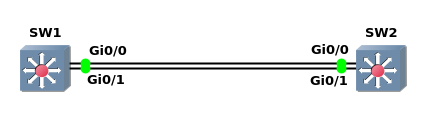

#### Etherchannel
Layer 2 Etherchannel<br>
将两台交换机之间的多个配置相同的物理接口, 聚合为一个逻辑接口, 也称port channel<br>
使用场景: 当链路流量接近饱和, 并且没有提供更高吞吐量的接口<br>
适用于ISO第二层和第三层
<br>
<br>

配置类型:<br>
1.手动配置etherchannel<br>
配置步骤<br>
** 链路两端的channel number可以不同, 但同一端的所有接口, channel number必须一致
```
SW1(config-if)# channel-group <channel_number> mode on
```
<br>

图1<br>
<br>

实例1<br>
```
SW1(config)# int range G0/0-1
SW1(config-if-range)# channel-group 1 mode on

SW2(config)# int range G0/0-1
SW2(config-if-range)# channel-group 2 mode on


SW1# show etherchannel summary
Flags:  D - down        P - bundled in port-channel
        I - stand-alone s - suspended
        H - Hot-standby (LACP only)
        R - Layer3      S - Layer2
        U - in use      N - not in use, no aggregation
        f - failed to allocate aggregator

        M - not in use, minimum links not met
        m - not in use, port not aggregated due to minimum links not met
        u - unsuitable for bundling
        w - waiting to be aggregated
        d - default port

        A - formed by Auto LAG


Number of channel-groups in use: 1
Number of aggregators:           1

Group  Port-channel  Protocol    Ports
------+-------------+-----------+-----------------------------------------------
1      Po1(SU)          -        Gi0/0(P)    Gi0/1(P)
```
<br>
<br>

2.动态配置etherchannel<br>
1)PAgP(Port Aggregation Protocol)<br>
Cisco专有协议, 最高支持8条链路加入
<br>

PAgP包含的两种模式:
- Desirable<br>
传送和接收PAgP包
<br>

- Auto<br>
接收PAgP包 
<br>
<br>

配置PAgP(至少有一端为desirable):<br>
`(config-if)# channel-group <etherchannel_id> mode {desirable | auto}`
<br>
<br>

示例2(如图1)<br>
```
SW1(config)# int range g0/0-1
SW1(config-if-range)# channel-group 1 mode desirable

SW2(config)# int range g0/0-1
SW2(config-if-range)# channel-group 2 mode auto


SW1# show etherchannel port-channel
		Channel-group listing: 
		----------------------

Group: 1 
----------
		Port-channels in the group: 
		---------------------------

Port-channel: Po1
------------

Age of the Port-channel   = 0d:00h:03m:15s
Logical slot/port   = 16/0          Number of ports = 2
GC                  = 0x00010001      HotStandBy port = null
Port state          = Port-channel Ag-Inuse 
Protocol            =   PAgP
Port security       = Disabled
Load share deferral = Disabled   

Ports in the Port-channel: 

Index   Load   Port     EC state        No of bits
------+------+------+------------------+-----------
  0     00     Gi0/0    Desirable-Sl       0
  0     00     Gi0/1    Desirable-Sl       0
          
Time since last port bundled:    0d:00h:00m:04s    Gi0/0
Time since last port Un-bundled: 0d:00h:01m:39s    Gi0/1


SW2# show etherchannel port-channel
		Channel-group listing: 
		----------------------

Group: 2 
----------
		Port-channels in the group: 
		---------------------------

Port-channel: Po2
------------

Age of the Port-channel   = 0d:00h:03m:41s
Logical slot/port   = 16/0          Number of ports = 2
GC                  = 0x00020001      HotStandBy port = null
Port state          = Port-channel Ag-Inuse 
Protocol            =   PAgP
Port security       = Disabled
Load share deferral = Disabled   

Ports in the Port-channel: 

Index   Load   Port     EC state        No of bits
------+------+------+------------------+-----------
  0     00     Gi0/0    Automatic-Sl       0
  0     00     Gi0/1    Automatic-Sl       0
          
Time since last port bundled:    0d:00h:01m:00s    Gi0/0
Time since last port Un-bundled: 0d:00h:02m:17s    Gi0/1
```
<br>
<br>

2)LACP(Link Aggregation Control Protocol)<br>
IEEE 802.3ad, 最高支持16条链路加入, 其中8条active, 8条备用
<br>

LACP包含的两种模式:
- Active<br>
发送和接收LACP包
<br>

- Passive<br>
接收LACP包
<br>

配置LACP(必须有一一端为active):<br>
```
(config-if)# channel-group <etherchannel_id> mode {active | passive}
```
<br>
<br>

** etherchannel需要接口信息一致, 列表如下:
- speed
- duplex
- 所有都为access接口, 或都为trunk接口
- 如果为access接口, 访问VLAN是否一致
- 如果为trunk接口, 允许VLAN列表是否一致
- 如果为trunk接口, native VLAN是否一致
- STP设置是否一致
<br>
<br>

从errdisable恢复<br>
```
(config)# errdisable recovery cause channel-misconfig (STP)
(config)# errdisable recovery interval <seconds>
```
<br>

查看逻辑接口port-channel<br>
`# show interface port-channel <etherchannel_id>`
<br>
<br>

查看etherchannel<br>
`# show etherchannel summary`
<br>
<br>

查看PAgP/LACP邻居<br>
`# show {pagp | lacp} neighbor`
<br>
<br>

发送/接收的PAgP/LACP包统计<br>
```
# show {pagp | lacp} counters
# clear {pagp | lacp} counters
```
<br>

配置etherchannel的负载均衡类别<br>
`(config)# port-channel load-balance <type>`

etherchannel支持的负载均衡类别列表:
|keyword        |description              |layer       |
|---------------|-------------------------|------------|
|src-mac        |source mac address       |2           |
|dst-mac        |destination mac address  |2           |
|src-dst-mac    |source and destination mac address|2  |
|src-ip         |source ip address        |3           |
|dst-ip         |destination ip address   |3           |
|src-dst-ip     |source and destination ip address|3   |
|src-port       |source TCP/UDP port      |4           |
|dst-port       |destination TCP/UDP port |4           |
|src-dst-port   |source and destination TCP/UDP port|4 |

查看负载均衡信息<br>
`# show etherchannel load-balance`
<br>
<br>
<br>
