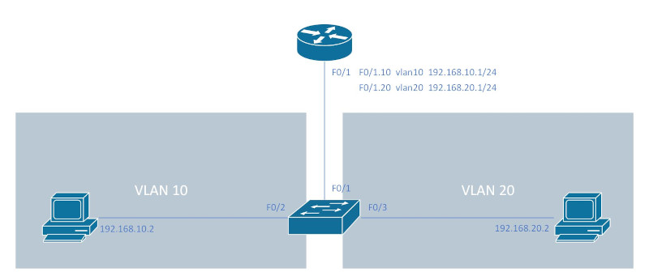
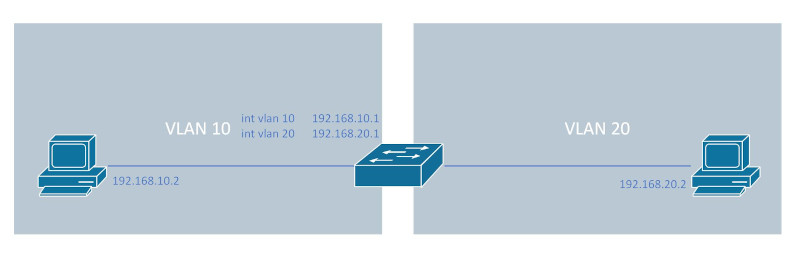

开启/关闭接口<br>
`(config-if)# [no] shutdown`
<br>
<br>

给接口配置IP<br>
```
(config)# interface f0/1
(config-if)# ip address 192.168.1.2 255.255.255.0
```
<br>
<br>

查看接口的IP层简短信息<br>
`# show ip interface brief`
<br>
<br>

查看接口的IP层详细信息<br>
`# show ip interface`
<br>
<br>

查看IP层接口和路由启用情况<br>
`# show protocols`
<br>
<br>

IP路由<br>
将IP package从发送位置转发到目标位置
<br>
<br>

路由表<br>
从当前路由器到达目标位置, 选择的下一跳IP地址(或出向接口). 路由表内容添加方式如下:<br>
&emsp;&emsp;1.默认添加: 任何与当前路由器直接相连的子网, 其路由会自动添加到路由表<br>
&emsp;&emsp;2.手动配置: 使用ip route指令将子网位置和下一跳/出向接口内容添加到路由表<br>
&emsp;&emsp;3.自动配置: 路由器使用路由协议, 邻接路由器之间, 如果使用的路由协议兼容, 会得到通告的路由
<br>
<br>

显示arp表内容<br>
`# show ip arp`
<br>
<br>

删除arp表内容<br>
`# clear ip arp <ip_addr>`
<br>
<br>

手动配置的路由类型(静态路由):<br>
1.static network route<br>
`(config)# ip route <subnet_id> <subnet_mask> {<next_hop_ip> | out_inter}`
<br>

2.static host route<br>
`(config)# ip route <host_ip> 255.255.255.255 {<next_hop_ip> | out_inter}`
<br>

3.floating static route<br>
`(config)# ip route <subnet_id> <subnet_mask> {<next_hop_ip> | out_inter} <administrative_distance>`
<br>

4.static default route<br>
`(config)# ip route 0.0.0.0 0.0.0.0 {<next_hop_ip> | out_inter}`
<br>
<br>

显示完整路由表<br>
`# show ip route`
<br>
<br>

显示指定类型路由<br>
`# show ip route {connected | static | ospf ...}`
<br>
<br>

显示到指定子网或IP的路由<br>
`# show ip route {<subnet_id> | <ip_addr>}`
<br>
<br>

<br>
静态路由配置实例<br>
```
R1(config)# int f0/1
R1(config-if)# ip address 192.168.1.1
R1(config-if)# no shutdown
R1(config)# int f0/2
R1(config-if)# ip address 192.168.2.1
R1(config-if)# no shutdown
R1(config)# ip route 192.168.3.0 255.255.255.0 192.168.1.2

R2(config)# int f0/1
R2(config-if)# ip address 192.168.1.2
R2(config-if)# no shutdown
R2(config)# int f0/2
R2(config-if)# ip address 192.168.3.1
R2(config-if)# no shutdown
R2(config)# ip route 192.168.2.0 255.255.255.0 192.168.1.1
```
<br>
<br>
<br>

配置vlan间路由的方式:<br>
1.使用路由器的路由功能<br>
&emsp;&emsp;每个vlan使用一个路由器接口, 该方式使用过多路由器接口, 不推荐
<br>

2.使用路由器的路由功能<br>
&emsp;&emsp;所有vlan使用同一个路由器接口(Router On A Stick, ROAS), 引用路由器子接口概念, 用于vlan数量较少的情况
<br>

3.使用第三层交换机的路由功能<br>
&emsp;&emsp;使用交换机的SVI接口
<br>

4.使用第三层交换机的路由功能<br>
&emsp;&emsp;使用交换机的路由接口, 用于第三层交换机与路由器(或第三层交换机之间)的连接
<br>
<br>

在VLAN间配置路由(路由器的单个接口)<br>
1.创建子接口<br>
`(config)# interface <interface>.<sub_interface>`
<br>

2.将子接口与vlan连接, 并指定封装模式<br>
`(config-subif)# encapsulation dot1q <vlan>`
<br>

3.配置子接口IP地址<br>
```
(config-subif)# ip address <ip_addr> <subnet_mask>
(config-subif)# no shutdown
```
<br>
<br>

<br>
配置实例
```
SW(config)# vlan 10
SW(config)# vlan 20
SW(config)# interface f0/2
SW(config-if)# switchport mode access
SW(config-if)# switchport access vlan 10
SW(config)# interface f0/3
SW(config-if)# switchport mode access
SW(config-if)# switchport access vlan 20
SW(config)# interface f0/1
SW(config-if)# switchport mode trunk

R(config)# ip routing
R(config)# interface f0/1
R(config-if)# no shutdown
R(config)# interface f0/1.10
R(config-subif)# encapsulation dot1q 10
R(config-subif)# ip address 192.168.10.1 255.255.255.0
R(config)# interface f0/1.20
R(config-subif)# encapsulation dot1q 20
R(config-subif)# ip address 192.168.20.1 255.255.255.0
```
<br>
<br>

在VLAN间配置路由(L3 switch的SVI接口)<br>
1.启动路由功能<br>
`(config)# ip routing`<br>
** 部分交换机型号需要设置SDM才能启动路由功能<br>
```
(config)# sdm prefer routing
# reload
```
<br>

2.给SVI接口赋予IP地址<br>
```
(config)# intface vlan <vlan>
(config-if)# ip address <ip_addr> <subnet_mask>
(config-if)# no shutdown
```
<br>
<br>

<br>
配置实例<br>
```
(config)# ip routing
(config)# vlan 10
(config)# vlan 20
(config)# interface f0/1
(config-if)# switchport mode access
(config-if)# switchport access vlan 10
(config)# interface f0/2
(config-if)# switchport mode access
(config-if)# switchport access vlan 20
(config)# interface vlan 10
(config-if)# ip address 192.168.10.1 255.255.255.0
(config-if)# no shutdown
(config)# interface vlan 20
(config-if)# ip address 192.168.20.1 255.255.255.0
(config-if)# no shutdown
```
<br>
<br>

第三层EtherChannel(第三层交换机的路由端口)<br>
1.将接口加入EtherChannel<br>
```
(config)# int range <range_interface>
(config-if-range)# no switchport
(config-if-range)# channel-group <number> mode on
```
<br>

2.配置port-channel端口<br>
```
(config)# interface port-channel <number>
(config-if)# no switchport
(config-if)# ip address <ip_addr> <subnet_mask>
```
<br>

<br>
配置实例
```
Switch(config)# ip routing
Switch(config)# vlan 10
Switch(config)# vlan 20
Switch(config)# int f0/3                                                  
Switch(config-if)# switchport mode access
Switch(config-if)# switchport access vlan 10
Switch(config)# int f0/4
Switch(config-if)# switchport mode access
Switch(config-if)# switchport access vlan 20
Switch(config)# int vlan 10
Switch(config-if)# ip address 192.168.10.1 255.255.255.0
Switch(config-if)# no shutdown
Switch(config)# int vlan 20
Switch(config-if)# ip address 192.168.20.1 255.255.255.0
Switch(config-if)# no shutdown
Switch(config)# int range f0/1-2
Switch(config-if-range)# no switchport
Switch(config-if-range)# channel-group 1 mode on
Switch(config)# int port-channel 1
Switch(config-if)# no switchport
Switch(config-if)# ip address 192.168.1.2 255.255.255.0
Switch(config-if)# ip route 192.168.2.0 255.255.255.0 192.168.1.1

Router(config)# int port-channel 1
Router(config-if)# ip address 192.168.1.1 255.255.255.0
Router(config)# int range f0/1-2
Router(config-if-range)# channel-group 1
Router(config-if-range)# no shutdown
Router(config)# int f0/3
Router(config-if)# ip address 192.168.2.1 255.255.255.0
Router(config-if-range)# no shutdown
Router(config)# ip route 192.168.10.0 255.255.255.0 192.168.1.2
Router(config)# ip route 192.168.20.0 255.255.255.0 192.168.1.2
```
<br>
<br>

Ping诊断工具<br>
<br>
```
R1(config)# int f0/0
R1(config-if)# ip address 192.168.1.1 255.255.255.0
R1(config-if)# no shutdown
R1(config)# int f0/1
R1(config-if)# ip address 192.168.2.1 255.255.255.0
R1(config-if)# no shutdown
R1(conifg)# ip route 192.168.3.0 255.255.255.0 192.168.1.2

R2(config)# int f0/0
R2(config-if)# ip address 192.168.1.2 255.255.255.0
R2(config-if)# no shutdown
R2(config)# int f0/1
R2(config-if)# ip address 192.168.3.1 255.255.255.0
R2(config-if)# no shutdown

PC1> ip 192.168.2.2 255.255.255.0 192.168.2.1

PC2> ip 192.168.3.2 255.255.255.0 192.168.3.1
```
<br>

使用basic ping测试R1的f0/0接口与PC2的连接<br>
```
R1# ping 192.168.1.2
Type escape sequence to abort.
Sending 5, 100-byte ICMP Echos to 192.168.1.2, timeout is 2 seconds:
.!!!!
Success rate is 80 percent (4/5), round-trip min/avg/max = 20/23/28 ms
```
<br>

使用extend ping测试R1的f0/0接口与PC2的连接<br>
```
R1# ping
Protocol [ip]: 
Target IP address: 192.168.3.2
Repeat count [5]: 
Datagram size [100]: 
Timeout in seconds [2]: 
Extended commands [n]: y
Source address or interface: 192.168.2.1
Type of service [0]: 
Set DF bit in IP header? [no]: 
Validate reply data? [no]: 
Data pattern [0xABCD]: 
Loose, Strict, Record, Timestamp, Verbose[none]: 
Sweep range of sizes [n]: 
Type escape sequence to abort.
Sending 5, 100-byte ICMP Echos to 192.168.3.2, timeout is 2 seconds:
Packet sent with a source address of 192.168.2.1 
.....
Success rate is 0 percent (0/5)
```
<br>

添加R2到192.168.2.0/24子网的路由<br>
`R2(config)# ip route 192.168.2.0 255.255.255.0 192.168.1.1`
<br>

再次使用extend ping测试R1的f0/0接口与PC2的连接<br>
```
R1# ping
Protocol [ip]: 
Target IP address: 192.168.3.2
Repeat count [5]: 
Datagram size [100]: 
Timeout in seconds [2]: 
Extended commands [n]: y
Source address or interface: 192.168.2.1
Type of service [0]: 
Set DF bit in IP header? [no]: 
Validate reply data? [no]: 
Data pattern [0xABCD]: 
Loose, Strict, Record, Timestamp, Verbose[none]: 
Sweep range of sizes [n]: 
Type escape sequence to abort.
Sending 5, 100-byte ICMP Echos to 192.168.3.2, timeout is 2 seconds:
Packet sent with a source address of 192.168.2.1 
!!!!!
Success rate is 100 percent (5/5), round-trip min/avg/max = 28/29/32 ms
```
