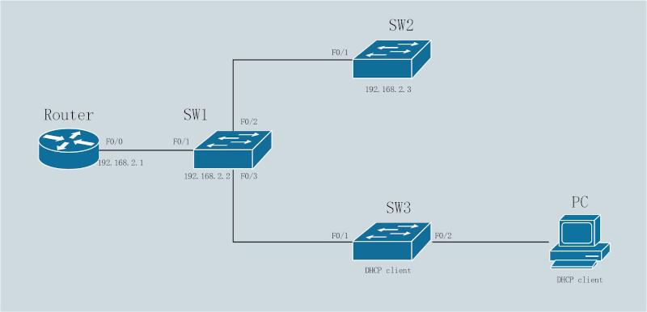
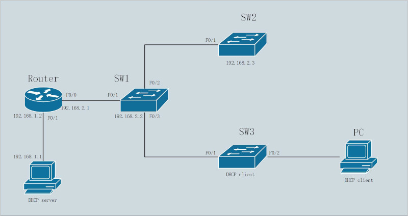

一、DHCP服务器搭建<br>
DHCP获取IP过程<br>

<br>
<br>

1)DHCP服务器与客户端在同一子网<br>
配置示意图<br>
<br>
在Router配置DHCP服务器, 并配置F0/0接口IP
```
Router(config)# ip dhcp excluded-address 192.168.2.1 192.168.2.20
Router(config)# ip dhcp pool inform_tech
Router(dhcp-config)# network 192.168.2.0 255.255.255.0
Router(dhcp-config)# default-router 192.168.2.1
Router(dhcp-config)# lease 0 1 30
Router(dhcp-config)# interface f0/0
ROuter(dhcp-config)# ip address 192.168.2.1 255.255.255.0
ROuter(dhcp-config)# no shutdown

```
<br>

SW1手动配置IP地址<br>
!交换机使用SVI(switch virtual interface)进行IP流量管理<br>
```
SW1(config)# interface vlan 1
SW1(config-if)# ip address 192.168.2.2 255.255.255.0
SW1(config-if)# no shutdown
SW1(config-if)# exit
SW1(config)# ip default-gateway 192.168.2.1
```
<br>

SW2手动配置IP地址<br>
```
SW2(config)# interface vlan 1
SW2(config-if)# ip address 192.168.2.3 255.255.255.0
SW2(config-if)# no shutdown
SW2(config-if)# exit
SW1(config)# ip default-gateway 192.168.2.1
```
<br>

SW3通过DHCP自动获取IP
```
SW3(config)# interface vlan 1
SW3(config-if)# ip address dhcp
SW3(config-if)# no shutdown
```
<br>
<br>

2)DHCP服务器与客户端不在一个子网<br>
配置示意图<br>
<br>
在主机上使用dhcpd配置DHCP服务器<br>
`sudo yum install dhcp`
```
steven@example.cn:~$ sudo vi /etc/dhcp/dhcpd.conf
subnet 192.168.1.0 netmask 255.255.255.0 {
    range 192.168.1.40 192.168.1.150;
    option routers 192.168.1.1;
}

subnet 192.168.2.0 netmask 255.255.255.0 {
    range 192.168.2.20 192.168.2.100;
    option routers 192.168.2.1;
}
```
```
steven@example.cn:~$ sudo vi /etc/sysconfig/network-scripts/ifcfg-enp3s0
BOOTPROTO=static
ONBOOT=yes
IPADDR=192.168.1.1
NETMASK=255.255.255.0
GATEWAY=192.168.1.2
```
`steven@example.cn:~$ sudo systemctl restart network`<br>

`steven@example.cn:~$ sudo systemctl start dhcpd`
<br>

Router手动配置IP地址, 并转发DHCP请求(helper-address)
```
Router(config)# interface f0/1
Router(config-if)# ip address 192.168.1.2 255.255.255.0
Router(config-if)# no shutdown
Router(config-if)# interface f0/0
Router(config-if)# ip address 192.168.2.1 255.255.255.0
Router(config-if)# no shutdown
Router(config-if)# ip helper-address 192.168.1.1
```
<br>

SW1手动配置IP地址<br>
```
SW1(config)# interface vlan 1
SW1(config-if)# ip address 192.168.2.2 255.255.255.0
SW1(config-if)# no shutdown
SW1(config-if)# exit
SW1(config)# ip default-gateway 192.168.2.1
```
<br>

SW2手动配置IP地址<br>
```
SW2(config)# interface vlan 1
SW2(config-if)# ip address 192.168.2.3 255.255.255.0
SW2(config-if)# no shutdown
SW2(config-if)# exit
SW1(config)# ip default-gateway 192.168.2.1
```
<br>

SW3通过DHCP自动获取IP
```
SW3(config)# interface vlan 1
SW3(config-if)# ip address dhcp
SW3(config-if)# no shutdown
```
