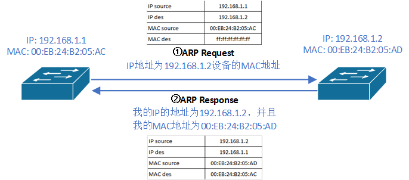
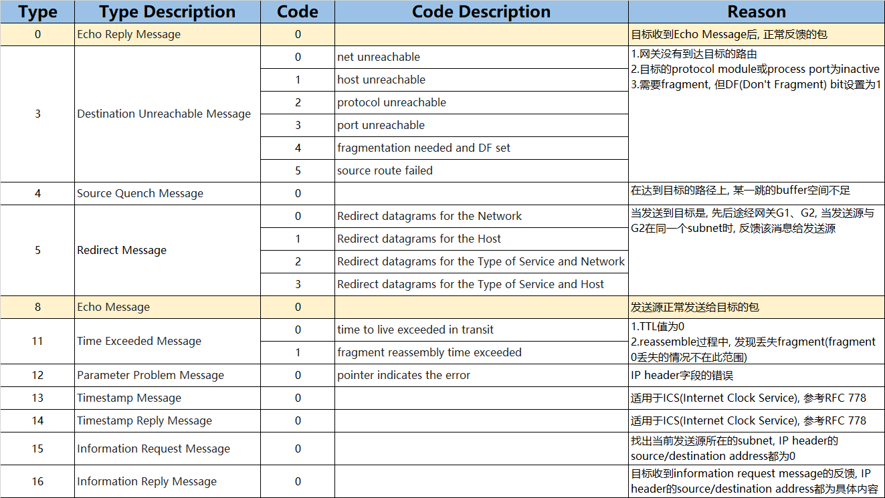
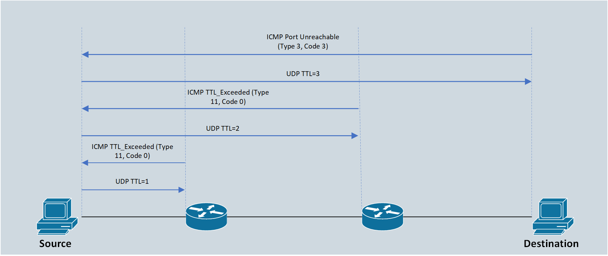

IP(Internet Protocol)<br>
位于TCP/IP协议栈的第三层, 用于标记在Internet中的位置<br>
由4个8 bits二进制组成, 每组之间使用'.'分隔. 如:<br>
`11000000 10101000 00000001 00000001`<br>
换算成十进制, 表示如下:<br>
`192.168.1.1`
<br>
<br>

掩码(mask)<br>
由4个8 bits二进制组成, 每组之间使用'.'分隔<br>
前面的1代表网络地址位, 后面的0代表主机地址位. 如:<br>
`11111111 11111111 00000000 00000000`<br>
换算成十进制, 表示如下:<br>
`255.255.0.0`<br>
换算成prefix模式, 表示如下:<br>
`/16`
<br>
<br>

```
 0                   1                   2                   3
 0 1 2 3 4 5 6 7 8 9 0 1 2 3 4 5 6 7 8 9 0 1 2 3 4 5 6 7 8 9 0 1
+-+-+-+-+-+-+-+-+-+-+-+-+-+-+-+-+-+-+-+-+-+-+-+-+-+-+-+-+-+-+-+-+
|Version|  IHL  |Type of Service|          Total Length         |
+-+-+-+-+-+-+-+-+-+-+-+-+-+-+-+-+-+-+-+-+-+-+-+-+-+-+-+-+-+-+-+-+
|         Identification        |Flags|      Fragment Offset    |
+-+-+-+-+-+-+-+-+-+-+-+-+-+-+-+-+-+-+-+-+-+-+-+-+-+-+-+-+-+-+-+-+
|  Time to Live |    Protocol   |         Header Checksum       |
+-+-+-+-+-+-+-+-+-+-+-+-+-+-+-+-+-+-+-+-+-+-+-+-+-+-+-+-+-+-+-+-+
|                       Source Address                          |
+-+-+-+-+-+-+-+-+-+-+-+-+-+-+-+-+-+-+-+-+-+-+-+-+-+-+-+-+-+-+-+-+
|                    Destination Address                        |
+-+-+-+-+-+-+-+-+-+-+-+-+-+-+-+-+-+-+-+-+-+-+-+-+-+-+-+-+-+-+-+-+
|                    Options                    |    Padding    |
+-+-+-+-+-+-+-+-+-+-+-+-+-+-+-+-+-+-+-+-+-+-+-+-+-+-+-+-+-+-+-+-+

field解析:
Version
    4 bits, Internet Protocol版本, 当前为4

IHL
    4 bits, IP Header的长度, 单位为4 bytes

Type of Service
    8 bits, 不同位的作用列表如下:
      Bits 0-2:  Precedence.
      Bit    3:  0 = Normal Delay,      1 = Low Delay.
      Bits   4:  0 = Normal Throughput, 1 = High Throughput.
      Bits   5:  0 = Normal Relibility, 1 = High Relibility.
      Bit  6-7:  Reserved for Future Use

Total Length
    16 bits, IP package的总长度(包含header和data), 单位为bytes

Identification
    16 bits, IP package的标识符, 用于fragment/assemble

Flags
    3 bits, fragment相关控制位. 具体如下:
        Bit 0: reserved, must be zero
        Bit 1: (DF) 0 = May Fragment,  1 = Don't Fragment
        Bit 2: (MF) 0 = Last Fragment, 1 = More Fragments

Fragment Offset
    13 bits, 当前fragment在datagram的定位, 单位为8 bytes
    ** datagram代表没有经过fragment操作的包

Time to Live
    8 bits, 代表datagram可以经过最大的路由跳数

Protocol
    8 bits, IOS协议栈下一层(或当前层, 如ICMP/OSPF/EIGRP等)协议层. 常见如下:
        1 - ICMP
        2 - IGMP
        6 - TCP
        17 - UDP
        89 - OSPF

Header Checksum
    16 bits, IP header部分的校验和

Source Address
    32 bits, 发送datagram设备接口的IP地址

Destination Address
    32 bits, 接收datagram设备接口的IP地址

Options
    variable, 可以为0 bit

Padding
    variable, 用于保持IP header的4 bytes对齐边界
```
<br>

```
classful network IP地址类型:
A类地址:
    以二进制0开始, 7 bits网络地址, 3 bytes主机地址
    范围: 0.0.0.0/8 ~ 127.0.0.0/8
    默认掩码: 255.0.0.0
    私有IP地址: 10.0.0.0/8
    环回链路地址: 127.0.0.1

B类地址:
    以二进制10开始, 14 bits网络地址, 2 bytes主机地址
    范围: 128.0.0.0/16 ~ 191.255.0.0/16
    默认掩码: 255.255.0.0
    链路本地地址: 169.254.0.0/16
    私有IP地址: 172.16.0.0/16 ~ 172.31.0.0/16

C类地址:
    以二进制110开始, 21 bits网络地址, 1 byte主机地址
    范围: 192.0.0.0/24 ~ 223.255.255.0/24
    默认掩码: 255.255.255.0
    私有IP地址: 192.168.0.0/24 ~ 192.168.255.0/24

D类地址:
    以二进制1110开始, 作为组播地址
    范围: 224.0.0.0 - 239.255.255.255
    组播对应mac地址规则:
        高24 bits - 0x01005e
        第25 bit  - 0
        低23 bits - IPv4组播地址的低23 bits

** 169.254.0.0/24是由于主机配置为DHCP, 但找不到合适DHCP服务器造成的
** 网络内的第一个IP地址为network ID, 代表整个网段
** 网络内的最后一个IP地址为广播地址
```
<br>
<br>

子网划分<br>
从主机位借位, 称为子网位, 实现将一个可用网段划分为多个可用网段<br>
例.<br>
`172.16.2.0 255.255.255.0`<br>
该子网从B类地址`172.16.0.0 255.255.0.0`的主机位借用8 bits用于子网位<br>
划分后的subnet ID长度=network ID长度 + 8 = 24

经过子网划分的网络, 称为classless network<br>
<br>
<br>


##### 获取subnet ID<br>
例.<br>
`130.4.102.1 255.255.252.0`
<br>

方法I<br>
1.转化为subnet mask为prefix模式<br>
`11111111 11111111 11111100 00000000` &emsp;$\Rightarrow$&emsp; /22
<br>

2.将DDN格式IP转化为32 bits模式<br>
|130          |4            |102          |1            |
|------------:|------------:|------------:|------------:|
|1000 0010    |0000 0100    |0110 0110    |0000 0001    |

<br>

3.取32 bits模式IP的前prefix代表的bits, 后续bits置0<br>
`10000010 00000100 011001`|`00 00000000`
<br>

4.32 bits模式的subnet mask转化为DDN模式<br>
|1000 0010    |0000 0100    |0110 0100    |0000 0000    |
|------------:|------------:|------------:|------------:|
|130          |4            |100          |0            |

最终结果:`130.4.100.0`
<br>
<br>

方法II<br>
1.将subnet mask为255对应字节的IP内容, 原样取下<br>
`130.4`
<br>

2.将subnet mask为0对应字节的IP内容, 置0<br>
`130.4.X.0`
<br>

3.将subnet mask既不为0也不为255的字节内容N, 和N对应字节的IP内容X, 做如下处理:<br>
1)取magic number = 256 - N<br>
&emsp;256 - 252 = 4
<br>

2)取为magic number整数倍, 并且最接近且$\leqslant$ X的数字<br>
remainder = 102 % 4 = 2<br>
lowest = 102 - 2 = 100<br>
最终结果: `130.4.100.0`
<br>
<br>

##### 获取subnet broadcast<br>
例.<br>
`130.4.102.1 255.255.252.0`
<br>

方法I<br>
1.转化为subnet mask为prefix模式<br>
`11111111 11111111 11111100 00000000` &emsp;$\Rightarrow$&emsp; /22
<br>

2.将DDN格式IP转化为32 bits模式<br>
|130          |4            |102          |1            |
|------------:|------------:|------------:|------------:|
|1000 0010    |0000 0100    |0110 0110    |0000 0001    |

<br>

3.取32 bits模式IP的前prefix代表的bits, 后续bits置1<br>
`10000010 00000100 011001`|`11 11111111`
<br>

4.32 bits模式的subnet mask转化为DDN模式<br>
|1000 0010    |0000 0100    |0110 0111    |1111 1111    |
|------------:|------------:|------------:|------------:|
|130          |4            |103          |255          |

最终结果:`130.4.103.255`
<br>
<br>

方法II<br>
1.将subnet mask为255对应字节的IP内容, 原样取下<br>
`130.4`
<br>

2.将subnet mask为0对应字节的IP内容, 置255<br>
`130.4.X.255`
<br>

3.将subnet mask既不为0也不为255的字节内容N, 和N对应字节的IP内容X, 做如下处理:<br>
1)取magic number = 256 - N<br>
&emsp;256 - 252 = 4
<br>

2)取为magic number整数倍, 并且最接近且$\leqslant$ X的数字<br>
remainder = 102 % 4 = 2<br>
lowest = 102 - 2 = 100<br>
highesr = 100 + 4 -1 = 103<br>
最终结果: `130.4.103.255`
<br>
<br>

#### ARP

<br>
<br>

#### ICMP
准备ping与traceroute测试环境<br>

```
R1(config)# int f0/0
R1(config-if)# ip address 192.168.1.1 255.255.255.0
R1(config-if)# no shutdown
R1(config)# int f0/1
R1(config-if)# ip address 192.168.2.1 255.255.255.0
R1(config-if)# no shutdown
R1(conifg)# ip route 192.168.3.0 255.255.255.0 192.168.1.2

R2(config)# int f0/0
R2(config-if)# ip address 192.168.1.2 255.255.255.0
R2(config-if)# no shutdown
R2(config)# int f0/1
R2(config-if)# ip address 192.168.3.1 255.255.255.0
R2(config-if)# no shutdown

PC1> ip 192.168.2.2 255.255.255.0 192.168.2.1

PC2> ip 192.168.3.2 255.255.255.0 192.168.3.1
```
<br>

Ping诊断工具<br>
使用basic ping测试R1的f0/0接口与PC2的连接
```
R1# ping 192.168.3.2
Type escape sequence to abort.
Sending 5, 100-byte ICMP Echos to 192.168.3.2, timeout is 2 seconds:
.!!!!
Success rate is 80 percent (4/5), round-trip min/avg/max = 20/23/28 ms
```
<br>

使用extend ping测试R1的f0/0接口与PC2的连接
```
R1# ping
Protocol [ip]: 
Target IP address: 192.168.3.2
Repeat count [5]: 
Datagram size [100]: 
Timeout in seconds [2]: 
Extended commands [n]: y
Source address or interface: 192.168.2.1
Type of service [0]: 
Set DF bit in IP header? [no]: 
Validate reply data? [no]: 
Data pattern [0xABCD]: 
Loose, Strict, Record, Timestamp, Verbose[none]: 
Sweep range of sizes [n]: 
Type escape sequence to abort.
Sending 5, 100-byte ICMP Echos to 192.168.3.2, timeout is 2 seconds:
Packet sent with a source address of 192.168.2.1 
.....
Success rate is 0 percent (0/5)
```
<br>

添加R2到192.168.2.0/24子网的路由<br>
`R2(config)# ip route 192.168.2.0 255.255.255.0 192.168.1.1`
<br>

再次使用extend ping测试R1的f0/0接口与PC2的连接
```
R1# ping
Protocol [ip]: 
Target IP address: 192.168.3.2
Repeat count [5]: 
Datagram size [100]: 
Timeout in seconds [2]: 
Extended commands [n]: y
Source address or interface: 192.168.2.1
Type of service [0]: 
Set DF bit in IP header? [no]: 
Validate reply data? [no]: 
Data pattern [0xABCD]: 
Loose, Strict, Record, Timestamp, Verbose[none]: 
Sweep range of sizes [n]: 
Type escape sequence to abort.
Sending 5, 100-byte ICMP Echos to 192.168.3.2, timeout is 2 seconds:
Packet sent with a source address of 192.168.2.1 
!!!!!
Success rate is 100 percent (5/5), round-trip min/avg/max = 28/29/32 ms
```
<br>

使用extend ping测试R1的f0/0接口与PC1的连接(测试PC1的default gateway)
```
R1# ping 
Protocol [ip]: 
Target IP address: 192.168.2.2
Repeat count [5]: 
Datagram size [100]: 
Timeout in seconds [2]: 
Extended commands [n]: y
Source address or interface: 192.168.1.1
Type of service [0]: 
Set DF bit in IP header? [no]: 
Validate reply data? [no]: 
Data pattern [0xABCD]: 
Loose, Strict, Record, Timestamp, Verbose[none]: 
Sweep range of sizes [n]: 
Type escape sequence to abort.
Sending 5, 100-byte ICMP Echos to 192.168.2.2, timeout is 2 seconds:
Packet sent with a source address of 192.168.1.1 
!!!!!
Success rate is 100 percent (5/5), round-trip min/avg/max = 28/29/32 ms
```
<br>
<br>

图8 - ICMP table<br>
<br>

<br>
<br>

<br>
traceroute原理:<br>
1.向下一跳目标发送三次TTL=1的UDP包, 然后目标返回ICMP信息(Time Exceed, Type 11 Code 0), 该ICMP信息包含目标的IP, 如果三次返回的IP相同, 则取该IP;<br>

2.向下一跳的下一跳目标发送三次TTL=2的UDP包, 然后目标返回ICMP信息(Time Exceed, Type 11 Code 0), 如果三次返回的IP相同, 则取该IP;<br>

3.TTL依次递增发送UDP包, 直到到达最终目标. 最终目标(或TTL 255耗尽)返回的ICMP信息为Port Unreachable(Type 3 Code 3)
<br>
<br>

测试PC1到PC2的路径<br>
```
PC1> trace 192.168.3.2                       
trace to 192.168.3.2, 8 hops max, press Ctrl+C to stop
 1   192.168.2.1   9.291 ms  9.819 ms  9.265 ms
 2     *192.168.1.2   15.022 ms  19.193 ms
 3     **192.168.3.2   23.611 ms (ICMP type:3, code:3, Destination port unreachable)

```


引用列表:<br>
[1]Internet Protocol: https://datatracker.ietf.org/doc/html/rfc791<br>

[2]Assigned Numbers: https://datatracker.ietf.org/doc/html/rfc790<br>

[3]IANA Guidelines for IPv4 Multicast Address Assignments: https://datatracker.ietf.org/doc/html/rfc5771

[4]Private IP: https://datatracker.ietf.org/doc/html/rfc790<br>
