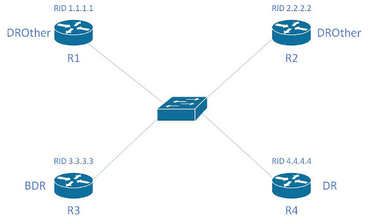
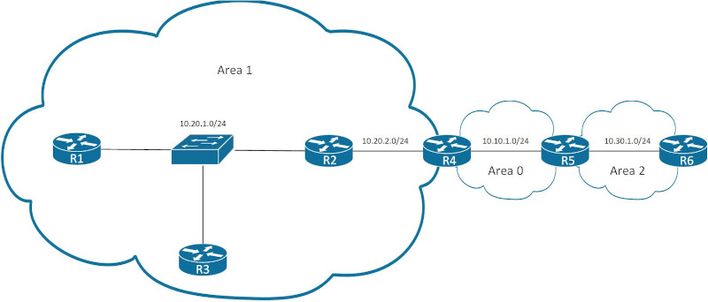

<br>

名词列表<br>
Routing protocol<br>
路由协议, 由交互信息和算法, 选出到达目标的最佳路径, 添加到路由表. 位于IP层.  如: RIP/OSPF/EIGRP/BGP
<br>
<br>

Routed/Routable protocol<br>
被路由协议和可路由协议, 定义包的结构和逻辑地址, 并允许被路由器转发. 如: IPv4/IPv6
<br>
<br>

AS(Autonomous System, 自治系统)<br>
代表一个管理主体控制下的路由集合. 如: 校园网/公司网络
<br>
<br>

ASN(AS Number)<br>
被权威机构赋予管理主体的全局唯一性标识码
<br>
<br>

IGP(Interior Gateway Protocols, 内部网关协议)<br>
代表机构内部(单个AS内)部署的路由协议. 如: RIP/OSPF/EIGRP/IS-IS等
<br>
<br>

EGP(Exterior Gateway Protocols, 外部网关协议)<br>
代表机构之间(多个AS之间)部署的路由协议. 目前该类只有BGP协议
<br>
<br>
<br>

IGP路由协议算法类型<br>
1.Distance vector<br>
RIP和Cisco IGRP使用该算法,  缺点是收敛速度较慢
<br>

2.Advance distance vector<br>
Cisco EIRGH使用该算法
<br>

3.Link state<br>
OSPF和IS-IS使用该算法, 相较于Distance vector, 会使用额外的CPU和内存资源
<br>
<br>
<br>

路由选择方式:<br>
1.prefix length<br>
优先选择符合的, 并且主机位更短的路由. 示例如下:<br>
10.0.3.0/28、10.0.3.0/26、10.0.3.0/24三个路由, 目标为10.3.0.12<br>
选择10.0.3.0/28作为路由
<br>
<br>

2.administration distance<br>
不同路由类型的判别<br>
AD越小的路由类型, 优先级越高, 该值独立于路由器. 不同路由类型的默认AD值如下:
|路由类型                |AD值                    |
|------------------------|------------------------|
|connected               |0                       |
|static                  |1                       |
|BGP(external routes)    |20                      |
|EIGRP(internal routes)  |90                      |
|IGRP                    |100                     |
|OSPF                    |110                     |
|IS-IS                   |115                     |
|RIP                     |120                     |
|EIGRP(external routes)  |170                     |
|BGP(internal routes)    |200                     |
|DHCP default route      |254                     |
|Unusable                |255                     |

<br>

3.metric<br>
同一路由类型的判别<br>
RIP使用经过的跳数(路由器)作为测量指标<br>
OSPF使用单条链路的cost作为参考, 并将每条链路的测量汇总作为测量指标
<br>
<br>
<br>

#### OSPF(Open Shortest Path First)
LSA(link-state advertisements, 链路状态通告): 到达指定链路的信息
<br>

LSDB(link-state database, 链路状态数据库): LSA的集合, 每个路由器都包含各自的LSDB
<br>
<br>
<br>

###### OSPF包的类型
|Type  |Packet Name   |Functional Overview                    |
|------|--------------|---------------------------------------|
|1     |Hello         |用于发现和维持邻接路由器               |
|2     |Database Description(DBD)|汇总LSDB信息, 用于邻接关系初步形成时|
|3     |Link-state Request(LSR)|用于从邻接路由器获取路由信息  |
|4     |Link-state Update(LSU)|发送路由信息, 用于LSR的响应    |
|5     |Link-state Ack|用于响应LSA泛洪                        |

<br>
<br>

###### 定时器类型
1.Hello Timer<br>
Hello package间隔发送时间
<br>

配置Hello Timer<br>
`(config-if)# ip ospf hello-interval <seconds>`
<br>
<br>

2.Dead Interval Timer<br>
当该时间段内, 没有接收到Hello package时, 认定断开连接. 默认为Hello Timer的4倍
<br>

配置Dead Interval Timer<br>
`(config-if)# ip ospf dead-interval <seconds>`
<br>
<br>

查看Hello/Dead Timer<br>
```
# show ip ospf interface | include Timer|line
FastEthernet0/1 is up, line protocol is up                                      
  Timer intervals configured, Hello 5, Dead 20, Wait 20, Retransmit 5           
FastEthernet0/0 is up, line protocol is up                                      
  Timer intervals configured, Hello 10, Dead 40, Wait 40, Retransmit 5        
```
** 链路两端的Hello/Dead Timer必须一致
<br>
<br>
<br>

###### OSPF步骤
1.位于相同链路, 并且使用OSPF的路由器成为neighbor<br>

<br>

显示OSPF neighbor<br>
`# show ip ospf neighbor`
<br>
<br>

2.neighbor路由器之间交换LSAs<br>

<br>

路由器之间进入full state后, 依然需要通过几个步骤, 监测路由拓扑, 步骤如下:<br>
1)在Hello interval间隔时间, 持续发送Hello message; 如果dead interval没有收到neighbor的Hello message, 代表neighbor已经下线
<br>

2)当拓扑发生改变, 离变化最近的路由器接收到LSAs, 向外扩散
<br>

3)即使拓扑没有发生改变, 也会在指定间隔时间(默认30分钟)扩散LSAs
<br>
<br>

Broadcast网络链路(以太网链路默认使用类型)<br>
<br>
情景1 - 当R4与其他路由器同时加入OSPF<br>
1)所有路由器刚刚加入OSPF, R4将自己视为DR<br>

2)R4接收到其他路由器发送的Hello packet, 进行如下两步比较:<br>
&emsp;&emsp;I、比较Broadcast域内所有接口的优先级, 优先级最大的成为DR. 当前R4与其它路由器接口的优先级都为默认值, 进入比较步骤II<br>
&emsp;&emsp;II、比较Broadcast域内所有路由器的RID, RID最大的成为DR. 当前R4的RID最大, R4成为DR<br>

3)BDR选举与DR选举类似, R3成为BDR<br>

```
Result:
R4#show ip ospf interface | include Designated.*ID|Router ID                    
  Process ID 1, Router ID 4.4.4.4, Network Type BROADCAST, Cost: 1              
  Designated Router (ID) 4.4.4.4, Interface address 172.16.1.4                  
  Backup Designated router (ID) 3.3.3.3, Interface address 172.16.1.3
```
<br>

情景2 - 当R4在一段时间后加入OSPF(此时R3为DR, R2为BDR)<br>
```
默认情况下, OSPF没有preempt机制, 所有R4加入后的角色为DROther
R4#show ip ospf int | include Designated.*ID|Router ID                          
  Process ID 1, Router ID 4.4.4.4, Network Type BROADCAST, Cost: 1              
  Designated Router (ID) 3.3.3.3, Interface address 172.16.1.3                  
  Backup Designated router (ID) 2.2.2.2, Interface address 172.16.1.2
```

```
清除R3的OSPF process, R3退出DR, BDR(R2)立马接替成为DR, router id最高(R4)的选举成为BDR
R3#clear ip ospf process                                                        
Reset ALL OSPF processes? [no]: yes

R4#show ip ospf int | include Designated.*ID|Router ID                          
  Process ID 1, Router ID 4.4.4.4, Network Type BROADCAST, Cost: 1              
  Designated Router (ID) 2.2.2.2, Interface address 172.16.1.2                  
  Backup Designated router (ID) 4.4.4.4, Interface address 172.16.1.4
```

```
清除R2的OSPF process, R2退出DR, BDR(R4)成为DR, router id最高(R3)的选举成为BDR
R2#clear ip ospf process                                                        
Reset ALL OSPF processes? [no]: yes

R4#show ip ospf int | include Designated.*ID|Router ID                          
  Process ID 1, Router ID 4.4.4.4, Network Type BROADCAST, Cost: 1              
  Designated Router (ID) 4.4.4.4, Interface address 172.16.1.4                  
  Backup Designated router (ID) 3.3.3.3, Interface address 172.16.1.3  
```
<br>

neighbor路由器之间的关系<br>

<br>

neighbor路由器之间的状态为full state, 称为adjacent neighbot<br>

neighbot路由器之间的状态为2-way state, 称为neighbot<br>

只有adjacent neighbor之间才能直接同步LSDB(通过LSU)
<br>
<br>

多播地址:<br>
224.0.0.5/01:00:5E:00:00:05<br>
AllSPFRouters - DR/BDR发送内容到其他所有路由器
<br>

224.0.0.6/01:00:5E:00:00:06<br>
AllDRouters - DROther发送内容到DR/BDR路由器
<br>
<br>

子网上所有路由器的Hello interval与Dead interval的值必须一致
<br>
<br>

显示LSDB内容<br>
`# show ip ospf database`
<br>
<br>

3.使用Dijkstra SPF math从LSDB中选取到达指定subnet的最优路径, 将其放入routing table
<br>
<br>
<br>

###### 配置OSPF
1.进入router子配置模式, 并指定进程ID<br>
`(config)# router ospf <process_id>`<br>
** process_id在本地唯一, 用于指定进程, 在其他路由器该值不必一致<br>
** 同一台router可以有多个process, 并且每个process有自己唯一的database, 在每个process内的内容只有通过reditribution, 才能被其他process获得
<br>
<br>

2.配置Router ID<br>
1)直接配置router id<br>
`(config-router)# router-id <router-id>`
<br>

2)从loopback接口中选择ip值最大的<br>
```
(config)# interface loopback <num>
(config-if)# ip address <ip_address> <subnet_mask>
```

3)从非loopback接口中选择ip值最大的
<br>
<br>

3.接口配置OSPF, 指定所属area<br>
1)在router子配置模式下使用network(旧版本)<br>
`(config-router)# network <subnet_id> <wildcard_mask> area <area_id>`<br>
** subnet_id与wildcard_mask配合, 所有接口IP与该组合相符的, 加入OSPF<br>
** wildcard_mask的0 bit代表接口IP与subnet_id的对应的bit必须一致<br>
** 当wildcard_mask的bit值为1, 但subnet_id对应的bit不为0时, 将该bit置0. 如:192.168.1.2 0.0.0.255, 将192.168.1.2修改为192.168.1.0<br>

2)在接口配置模式下使用ip ospf<br>
`(config-if)# ip ospf <process_id> area <area_id>`
<br>
<br>

查看配置OSPF的接口(含Router id)<br>
`# show ip ospf interface [brief]`
<br>
<br>
<br>

##### OSPF特征
1.passive interface<br>
不发送Hello消息, 并且不执行接收的OSPF包<br>

配置passive interface(默认所有接口为非passive)<br>
`(config-router)# passive-interface <interface>`<br>

配置所有接口默认为passive, 并配置非passive接口<br>
```
(config-router)# passive-interface default
(config-router)# no passive-interface <interface>
```
<br>

查看接口是否为passive
```
# show ip ospf interface
FastEthernet0/1 is up, line protocol is up 
  Internet Address 192.168.2.1/24, Area 0 
  Process ID 1, Router ID 1.1.1.1, Network Type BROADCAST, Cost: 1
  Enabled by interface config, including secondary ip addresses
  Transmit Delay is 1 sec, State WAITING, Priority 1
  No designated router on this network
  No backup designated router on this network
  Timer intervals configured, Hello 10, Dead 40, Wait 40, Retransmit 5
    oob-resync timeout 40
    No Hellos (Passive interface) 
    Wait time before Designated router selection 00:00:24
  Supports Link-local Signaling (LLS)
  Cisco NSF helper support enabled
  IETF NSF helper support enabled
  Index 2/2, flood queue length 0
  Next 0x0(0)/0x0(0)
  Last flood scan length is 0, maximum is 0
  Last flood scan time is 0 msec, maximum is 0 msec
  Neighbor Count is 0, Adjacent neighbor count is 0 
  Suppress hello for 0 neighbor(s)
```
<br>

2.OSPF默认路由通告<br>
将默认路由进行通告, 以当前通告路由器作为被通告路由器的默认路由, 并进行扩散
<br>

<br>

配置默认路由通告<br>
```
(config)# router ospf <process_id>
(config-router)# default-information originate
```

```
ISP(config)# interface f0/1
ISP(config-if)# ip address 172.16.1.2 255.255.255.0
ISP(config-if)# no shutdown

R1(config)# interface f0/1
R1(config-if)# ip address 172.16.1.1 255.255.255.0
R1(config-if)# no shutdown
R1(config)# interface f0/2
R1(config-if)# ip address 192.168.1.1 255.255.255.0
R1(config-if)# no shutdown
R1(config)# interface f0/3
R1(config-if)# ip address 192.168.2.1 255.255.255.0
R1(config-if)# no shutdown
R1(config)# router ospf 1
R1(config-router)# router-id 1.1.1.1
R1(config)# interface f0/2
R1(config-if)# ip ospf 1 area 0
R1(config)# interface f0/3
R1(config-if)# ip ospf 1 area 0

R2(config)# interface f0/1
R2(config-if)# ip address 192.168.1.2 255.255.255.0
R2(config-if)# no shutdown
R2(config)# router ospf 1
R2(config-router)# router-id 2.2.2.2
R2(config)# interface f0/1
R2(config-if)# ip ospf 1 area 0

R3(config)# interface f0/1
R3(config-if)# ip address 192.168.2.2 255.255.255.0
R3(config-if)# no shutdown
R3(config)# router ospf 1
R3(config-router)# router-id 3.3.3.3
R3(config)# interface f0/1
R3(config-if)# ip ospf 1 area 0

R2(config)# ip route 0.0.0.0 0.0.0.0 172.16.1.2
R2(config)# router ospf 1
R2(config-router)# default-information originate

R4# show ip route
O*E2  0.0.0.0/0 [110/1] via 192.168.2.1, 00:00:35, FastEthernet0/0
O     192.168.1.0/24 [110/2] via 192.168.2.1, 00:03:49, FastEthernet0/0
      192.168.2.0/24 is variably subnetted, 2 subnets, 2 masks
C        192.168.2.0/24 is directly connected, FastEthernet0/0
L        192.168.2.2/32 is directly connected, FastEthernet0/0
```
<br>
<br>

3.OSPF Metrics<br>
计算公式:
$$cost=reference\_bandwidth/interface\_bandwidth$$
** 如公式, reference_bandwidth默认值为100 Mbps, interface_bandwidth与接口speed一致, 结果为小数时, 取整为1
<br>

各种链路默认cost
|interface             |interface bandwidth  |formula             |OSPF cost   |
|----------------------|---------------------|--------------------|------------|
|Serial                |1544 Kbps            |100,000/1544        |64          |
|Ethernet              |10 Mbps              |100,000/10,000      |10          |
|Fast Ethernet         |100 Mbps             |100,000/100,000     |1           |
|Gigabit Ethernet      |1 Gbps               |100,000/1000,000    |1           |
|10 Gigabit Ethernet   |10 Gbps              |100,000/10,000,000  |1           |
|100 Gigabit Ethernet  |100 Gbps             |100,000/100,000,000 |1           |

配置cost方法:<br>
1)直接配置接口cost<br>
`(config-if)# ip ospf cost <num>`
<br>

2)配置reference bandwidth(单位为Mbps)<br>
`(config-router)# auto-cost reference-bandwidth <speed>`<br>
** 建议使用方案, 并且建议所有路由器的reference-bandwidth一致
<br>

3)配置interface bandwidth(单位为Kbps)<br>
`(config-if)# bandwidth <speed>`
<br>
<br>

4.OSPF负载均衡<br>
当多条路径达到子网的cost一致时, 会同时加入routing table, 默认支持4条路径
<br>

配置负载均衡路径数量<br>
`(config-router)# maximum-paths <num>`
<br>
<br>
<br>

##### 链路网络类型<br>
1.broadcast network type<br>
Ethernet link(Ethernet LAN/WAN)默认使用该类型<br>
配置broadcast network type<br>
`(config-if)# ip ospf network broadcast`
<br>

配置DR选举优先级<br>
`(config-if)# ip ospf priority <priority>`
<br>
<br>

2.point-to-point network type<br>
Serial link默认使用该类型<br>
point-to-point适用于只包含两台设备的链路. 如: Ethernet WAN、Serial link等<br>
配置point-to-point network type<br>
`(config-if)# ip ospf network point-to-point`
<br>
<br>

OSPF neighbor所需要的条件:
|Requirement       |Required for OSPF|Neighbor Missing if Incorrect|relative command  |
|---------------|-----------------|------------------|------------------|
|Interface must be in an up/up state.|Yes|Yes|show ip interface brief|
|Access control lists(ACL)must not filter routing protocol messages.|Yes|Yes|show access-list|
|Interfaces must be in the same subnet.|Yes|Yes|show ip ospf interface brief|
|They must pass routing protocol neighbor authentication(if configured).|Yes|Yes|show ip ospf interface|
|Hello and hold/dead timers must match.|Yes|Yes|show ip ospf interface|
|Router IDs(RID) must be unique.|Yes|Yes|show ip ospf|
|They must be in the same area.|Yes|Yes|show ip ospf interface brief|
|OSPF process must not be shut down.|Yes|Yes|show ip ospf|
|Neighboring interfaces must use same MTU setting.|Yes|No|show interfaces|
|Neighboring interfaces must use same OSPF network type.|Yes|No|show ip ospf interface|

** Required for OSPF代表是否为成为neighbor路由器正常工作所必须项<br>

** Neighbor Missing if Incorrect代表该项不符时, 是否丢失neighbor关系
<br>
<br>
<br>

### Area
AS内部可被划分为不同area, 每个area内所有路由器的LSDB内容相同<br>

area在接口级别进行设置, 并且单个接口只能属于一个area<br>

当路由器的多个接口分布在不同area时, 路由器包含有多个LSDB<br>

area 0为骨干area<br>

ABR(Area Border Router)为连接area 0与其他area的路由器, 所有非骨干area必须通过ABR与area 0相连<br>

所有area的路由器都在ABR处进行路由汇总<br>

单个area的路由器建议数量为50个(具体由路由器性能决定)
<br>
<br>
<br>

##### OSPF路由类型
1.area内路由, 路由表显示为O<br>

2.area间路由, 路由表显示为O IA<br>
图1<br>

<br>

示例<br>
如图1, R1的路由如下
```
R1#show ip route
Gateway of last resort is not set

     10.0.0.0/24 is subnetted, 4 subnets
O IA    10.10.1.0 [110/3] via 10.20.1.2, 00:04:03, FastEthernet0/0
O IA    10.30.1.0 [110/4] via 10.20.1.2, 00:02:39, FastEthernet0/0
O       10.20.2.0 [110/2] via 10.20.1.2, 00:08:17, FastEthernet0/0
C       10.20.1.0 is directly connected, FastEthernet0/0
```
<br>
<br>

##### LSA类型
|Type   |Name       |Link State ID             |Advertising Router        |Description         |
|-------|-----------|--------------------------|--------------------------|--------------------|
|1      |Router LSA |生成LSA的路由器的router-id|生成LSA的路由器的router-id|所有路由器都能生成<br>代表指定area内部的active路由器|
|2      |Network LSA|DR的接口IP                |DR的router-id             |由Broadcast/NBMA网络的DR路由器生成<br>代表指定area内部的链路<br>必须由两台或以上路由器组成的链路|
|3      |Summary Network LSA|Network ID        |ABR的router-id            |由ABR生成通告<br>代表其他area通过ABR通告的网络ID|

<br>
<br>

图2<br>
<br>

示例 - 如图2, R1的database如下
```
R1#show ip ospf database

            OSPF Router with ID (1.1.1.1) (Process ID 1)

		Router Link States (Area 1)

Link ID         ADV Router      Age         Seq#       Checksum Link count
1.1.1.1         1.1.1.1         105         0x80000002 0x0026C1 1
2.2.2.2         2.2.2.2         142         0x80000004 0x001673 2
3.3.3.3         3.3.3.3         157         0x80000003 0x005E44 2
4.4.4.4         4.4.4.4         146         0x80000003 0x004489 1

		Net Link States (Area 1)

Link ID         ADV Router      Age         Seq#       Checksum
10.20.1.3       3.3.3.3         106         0x80000002 0x00CB23
10.20.2.1       4.4.4.4         146         0x80000001 0x008070

		Summary Net Link States (Area 1)

Link ID         ADV Router      Age         Seq#       Checksum
10.10.1.0       4.4.4.4         276         0x80000001 0x001502
10.30.1.0       4.4.4.4         266         0x80000001 0x002ED3
```
<br>

显示不同LSA类型的database<br>
`# show ip ospf database {router | network | summary}`
<br>

示例 - 如图2, 分开显示LSA 1/2/3
```
R1#show ip ospf database router

            OSPF Router with ID (1.1.1.1) (Process ID 1)

		Router Link States (Area 1)

  LS age: 253
  Options: (No TOS-capability, DC)
  LS Type: Router Links
  Link State ID: 1.1.1.1
  Advertising Router: 1.1.1.1
  LS Seq Number: 80000002
  Checksum: 0x26C1
  Length: 36
  Number of Links: 1

    Link connected to: a Transit Network
     (Link ID) Designated Router address: 10.20.1.3
     (Link Data) Router Interface address: 10.20.1.1
      Number of TOS metrics: 0
       TOS 0 Metrics: 1


  LS age: 290
  Options: (No TOS-capability, DC)
  LS Type: Router Links
  Link State ID: 2.2.2.2
  Advertising Router: 2.2.2.2
  LS Seq Number: 80000004
  Checksum: 0x1673
  Length: 48
  Number of Links: 2
          
    Link connected to: a Transit Network
     (Link ID) Designated Router address: 10.20.2.1
     (Link Data) Router Interface address: 10.20.2.2
      Number of TOS metrics: 0
       TOS 0 Metrics: 1

    Link connected to: a Transit Network
     (Link ID) Designated Router address: 10.20.1.3
     (Link Data) Router Interface address: 10.20.1.2
      Number of TOS metrics: 0
       TOS 0 Metrics: 1
          
          
  LS age: 1391
  Options: (No TOS-capability, DC)
  LS Type: Router Links
  Link State ID: 3.3.3.3
  Advertising Router: 3.3.3.3
  LS Seq Number: 80000003
  Checksum: 0x5E44
  Length: 48
  Number of Links: 2
          
    Link connected to: a Stub Network
     (Link ID) Network/subnet number: 10.20.3.0
     (Link Data) Network Mask: 255.255.255.0
      Number of TOS metrics: 0
       TOS 0 Metrics: 1

    Link connected to: a Transit Network
     (Link ID) Designated Router address: 10.20.1.3
     (Link Data) Router Interface address: 10.20.1.3
      Number of TOS metrics: 0
       TOS 0 Metrics: 1
          
          
  Routing Bit Set on this LSA
  LS age: 1418
  Options: (No TOS-capability, DC)
  LS Type: Router Links
  Link State ID: 4.4.4.4
  Advertising Router: 4.4.4.4
  LS Seq Number: 80000003
  Checksum: 0x4489
  Length: 36
  Area Border Router
  Number of Links: 1
          
    Link connected to: a Transit Network
     (Link ID) Designated Router address: 10.20.2.1
     (Link Data) Router Interface address: 10.20.2.1
      Number of TOS metrics: 0
       TOS 0 Metrics: 1
```
```
R1#show ip ospf database network

            OSPF Router with ID (1.1.1.1) (Process ID 1)

		Net Link States (Area 1)

  Routing Bit Set on this LSA
  LS age: 1437
  Options: (No TOS-capability, DC)
  LS Type: Network Links
  Link State ID: 10.20.1.3 (address of Designated Router)
  Advertising Router: 3.3.3.3
  LS Seq Number: 80000002
  Checksum: 0xCB23
  Length: 36
  Network Mask: /24
	Attached Router: 3.3.3.3
	Attached Router: 1.1.1.1
	Attached Router: 2.2.2.2

  Routing Bit Set on this LSA
  LS age: 1477
  Options: (No TOS-capability, DC)
  LS Type: Network Links
  Link State ID: 10.20.2.1 (address of Designated Router)
  Advertising Router: 4.4.4.4
  LS Seq Number: 80000001
  Checksum: 0x8070
  Length: 32
  Network Mask: /24
        Attached Router: 4.4.4.4
        Attached Router: 2.2.2.2
```
```
R1#show ip ospf database summary

            OSPF Router with ID (1.1.1.1) (Process ID 1)

		Summary Net Link States (Area 1)

  Routing Bit Set on this LSA
  LS age: 1643
  Options: (No TOS-capability, DC, Upward)
  LS Type: Summary Links(Network)
  Link State ID: 10.10.1.0 (summary Network Number)
  Advertising Router: 4.4.4.4
  LS Seq Number: 80000001
  Checksum: 0x1502
  Length: 28
  Network Mask: /24
	TOS: 0 	Metric: 1 

  Routing Bit Set on this LSA
  LS age: 1633
  Options: (No TOS-capability, DC, Upward)
  LS Type: Summary Links(Network)
  Link State ID: 10.30.1.0 (summary Network Number)
  Advertising Router: 4.4.4.4
  LS Seq Number: 80000001
  Checksum: 0x2ED3
  Length: 28
  Network Mask: /24
        TOS: 0 	Metric: 2
```
<br>
<br>

##### OSPF路径选择
1.Intra-area<br>
优先选择area内路由, 如果多条路由都符合, 则比较metric
<br>

2.Interarea<br>
如果多条路由都是area间路由, 则比较metric
<br>
<br>
<br>

##### Area间路由汇总
将其他非骨干Area传播到Area 0的路由, 在ABR处进行汇总, 以此在非骨干Area链路状态发生变化时, 减少Area 0的拓扑变化<br>

ABR匹配到Area 0的目标属于summary地址, 但是在ABR非骨干Area没有对应目标网络时, 直接发送到接口Null0

从所有非骨干Area匹配的所有网络中, 选取到达ABR Metric最小的网络, 该Metric值作为汇总路由的Metric
<br>
<br>

在ABR配置汇总<br>
```
(config-router)# area <area-id> range <network_id> <subnet_mask> [advertise | not-advertise] [cost <metric>]

area-id
非骨干Area的id

network_id/subnet_mask
汇总后的网络ID和掩码

advertise | not-advertise
是否将汇总后的内容进行通告, 默认为advertise

<metric>
手动配置汇总路由的metric. 默认为非骨干Area汇总路由所有子集中链路metric最小的metric
```
图3<br>
<br>

示例 - area summary的作用(所有内容参考图3)<br>
情景一<br>
没有进行汇总时, 所有链路正常时, Area 1通过ABR R4进入Area 0的Type 3 LSA
```
R5#show ip ospf database summary | include Link State ID|Metric
  Link State ID: 10.1.1.0 (summary Network Number)
	TOS: 0 	Metric: 20 
  Link State ID: 10.1.2.0 (summary Network Number)
	TOS: 0 	Metric: 30 
  Link State ID: 10.1.3.0 (summary Network Number)
	TOS: 0 	Metric: 64 
  Link State ID: 10.1.4.0 (summary Network Number)
	TOS: 0 	Metric: 10


解析:
10.1.1.0/24网络到R4的路由: R2 --> R4

10.1.2.0/24网络到R4的路由: R1 --> R2 --> R4

10.1.3.0/24网络到R4的路由: R4

10.1.4.0/24网络到R4的路由: R4
```

情景二<br>
没有进行汇总时, 当R4连接链路10.1.4.0/24的接口出现故障, Area 1通过ABR R4进入Area 0的Type 3 LSA
```
R5#show ip ospf database summary | include Link State ID|Metric
  Link State ID: 10.1.1.0 (summary Network Number)
	TOS: 0 	Metric: 84 
  Link State ID: 10.1.2.0 (summary Network Number)
	TOS: 0 	Metric: 74 
  Link State ID: 10.1.3.0 (summary Network Number)
	TOS: 0 	Metric: 64 
  Link State ID: 10.1.4.0 (summary Network Number)
	TOS: 0 	Metric: 94 


解析:
10.1.1.0/24网络到R4的路由: R1 --> R3 --> R4

10.1.2.0/24网络到R4的路由: R3 --> R4

10.1.3.0/24网络到R4的路由: R4

10.1.4.0/24网络到R4的路由: R2 --> R1 --> R3 --> R4
```

情景三<br>
进行汇总后, 所有链路正常时, Area 1通过ABR R4进入Area 0的Type 3 LSA
```
R4(config-router)#area 1 range 10.1.0.0 255.255.248.0

R5#show ip ospf database summary | include Link State ID|Network Mask|Metric
  Link State ID: 10.1.0.0 (summary Network Number)
  Network Mask: /21
	TOS: 0 	Metric: 10

** 汇总路由的非环路策略, null0接口
R4#show ip route
Gateway of last resort is not set

     172.16.0.0/24 is subnetted, 1 subnets
C       172.16.1.0 is directly connected, FastEthernet0/1
     10.0.0.0/8 is variably subnetted, 5 subnets, 2 masks
C       10.1.3.0/24 is directly connected, Serial2/0
O       10.1.2.0/24 [110/30] via 10.1.4.2, 00:04:09, FastEthernet0/0
O       10.1.1.0/24 [110/20] via 10.1.4.2, 00:04:09, FastEthernet0/0
O       10.1.0.0/21 is a summary, 00:05:12, Null0
C       10.1.4.0/24 is directly connected, FastEthernet0/0

```

情景四<br>
进行汇总后, 当R4连接链路10.1.4.0/24的接口出现故障, Area 1通过ABR R4进入Area 0的Type 3 LSA
```
R5#show ip ospf database summary | include Link State ID|Network Mask|Metric
  Link State ID: 10.1.0.0 (summary Network Number)
  Network Mask: /21
	TOS: 0 	Metric: 64 
```

结果解析
```
当在ABR没有进行汇总时, 所有到ABR有链路Metric变化的链路情况, 都会影响到Area 0

当在ABR进行汇总后, 只有汇总路由的Metric(非骨干所有链路最小链路metric)产生变化时, 才会影响Area 0

当静态配置汇总路由的metric, Area 0不会受到非骨干Area链路变化的影响
```
<br>
<br>

##### 路由过滤
过滤方式:<br>
1.非骨干Area到Area 0方向的过滤<br>
使用Area间路由汇总语句<br>
`(config-router)# area <area_id> range <networ_id> <subnet_mask> not-advertise`
<br>
<br>
<br>

2.从非骨干Area到Area 0方向或从Area 0到非骨干Area方向的过滤<br>
配置语法:
```
(config-router)# area <area_id> filter-list prefix <prefix_list_name> {in | out}

area_id配合in/out, 代表从指定area进入/流出
```
<br>

prefix-list内容补充:<br>
配置语法:<br>
```
(config)# ip prefix-list <prefix_list_name> [seq <number>] {deny | permit} <network_id>/<length> [{ge | le} <prefix_length>]

<network_id>/<length>
在指定网络范围内

{ge | le} <prefix_length>
ge(great than and equal)指定最小子网掩码长度
le(less than and equal)指定最大子网掩码长度
```

图4<br>
<br>

示例 - 如图4, 在R3上过滤网络172.16.2.0/24
情景1, 没有过滤网络之前
```
R4#show ip ospf database summary | include Link State ID|Network Mask|Metric
  Link State ID: 10.12.1.0 (summary Network Number)
  Network Mask: /24
	TOS: 0 	Metric: 2 
  Link State ID: 10.22.1.0 (summary Network Number)
  Network Mask: /24
	TOS: 0 	Metric: 1 
  Link State ID: 172.16.1.0 (summary Network Number)
  Network Mask: /24
	TOS: 0 	Metric: 3 
  Link State ID: 172.16.2.0 (summary Network Number)
  Network Mask: /24
	TOS: 0 	Metric: 3 
  Link State ID: 172.16.3.0 (summary Network Number)
  Network Mask: /24
	TOS: 0 	Metric: 3 
```

情景2, 过滤网络172.16.2.0/24之后
```
R3(config)#ip prefix-list OUT_FILTER seq 5 deny 172.16.2.0/24
R3(config)#ip prefix-list OUT_FILTER seq 10 permit 0.0.0.0/0 le 32

R3(config)#router ospf 1
R3(config-router)#area 0 filter-list prefix OUT_FILTER out

R4#show ip ospf database summary | include Link State ID|Network Mask|Metric
  Link State ID: 10.12.1.0 (summary Network Number)
  Network Mask: /24
	TOS: 0 	Metric: 2 
  Link State ID: 10.22.1.0 (summary Network Number)
  Network Mask: /24
	TOS: 0 	Metric: 1 
  Link State ID: 172.16.1.0 (summary Network Number)
  Network Mask: /24
	TOS: 0 	Metric: 3 
  Link State ID: 172.16.3.0 (summary Network Number)
  Network Mask: /24
	TOS: 0 	Metric: 3 
```
<br>
<br>

3.在Area内不将路由安装到本机路由表(RIB), 但不影响Type 1 LSA在Area内路由器间的传播<br>
配置语法
```
(config-router)# distribute-list {<acl-number> | <acl-name> | prefix <prefix-list-name> | route-map <route-map-name>} in
```

示例 - 如图4, 配置R2不安装172.16.3.0/24到RIB<br>
```
R2(config)#ip prefix-list RIB_FILTER seq 5 deny 172.16.3.0/24
R2(config)#ip prefix-list RIB_FILTER seq 10 permit 0.0.0.0/0 le 32

R2(config)#router ospf 1
R2(config-router)#distribute-list prefix RIB_FILTER in

R2#show ip route
Gateway of last resort is not set

     172.16.0.0/24 is subnetted, 2 subnets
O       172.16.1.0 [110/2] via 10.12.1.1, 00:00:34, FastEthernet1/0
O       172.16.2.0 [110/2] via 10.12.1.1, 00:00:34, FastEthernet1/0
     10.0.0.0/24 is subnetted, 3 subnets
C       10.12.1.0 is directly connected, FastEthernet1/0
C       10.22.1.0 is directly connected, FastEthernet1/1
O IA    10.32.1.0 [110/2] via 10.22.1.1, 00:00:34, FastEthernet1/1

R3#show ip route
Gateway of last resort is not set

     172.16.0.0/24 is subnetted, 3 subnets
O IA    172.16.1.0 [110/3] via 10.22.1.2, 00:27:39, FastEthernet1/0
O IA    172.16.2.0 [110/3] via 10.22.1.2, 00:28:02, FastEthernet1/0
O IA    172.16.3.0 [110/3] via 10.22.1.2, 00:28:26, FastEthernet1/0
     10.0.0.0/24 is subnetted, 3 subnets
O IA    10.12.1.0 [110/2] via 10.22.1.2, 00:29:50, FastEthernet1/0
C       10.22.1.0 is directly connected, FastEthernet1/0
C       10.32.1.0 is directly connected, FastEthernet1/1
```
<br>

引用:<br>
[1] OSPFv2 RFC: https://datatracker.ietf.org/doc/html/rfc2328
