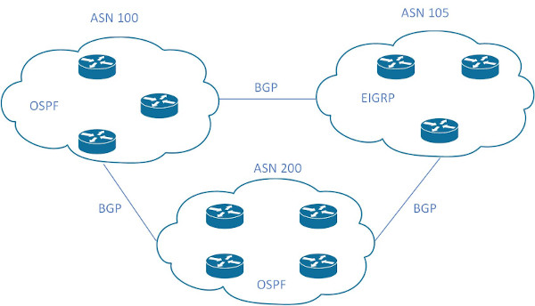

<br>

名词列表<br>
Routing protocol<br>
路由协议, 由交互信息和算法, 选出到达目标的最佳路径, 添加到路由表. 位于IP层.  如: RIP/OSPF/EIGRP/BGP
<br>
<br>

Routed/Routable protocol<br>
被路由协议和可路由协议, 定义包的结构和逻辑地址, 并允许被路由器转发. 如: IPv4/IPv6
<br>
<br>

AS(Autonomous System, 自治系统)<br>
代表一个管理主体控制下的路由集合. 如: 校园网/公司网络
<br>
<br>

ASN(AS Number)<br>
被权威机构赋予管理主体的全局唯一性标识码
<br>
<br>

IGP(Interior Gateway Protocols, 内部网关协议)<br>
代表机构内部(单个AS内)部署的路由协议. 如: RIP/OSPF/EIGRP/IS-IS等
<br>
<br>

EGP(Exterior Gateway Protocols, 外部网关协议)<br>
代表机构之间(多个AS之间)部署的路由协议. 目前该类只有BGP协议
<br>
<br>
<br>

IGP路由协议算法类型<br>
1.Distance vector<br>
RIP和Cisco IGRP使用该算法,  缺点是收敛速度较慢
<br>

2.Advance distance vector<br>
Cisco EIRGH使用该算法
<br>

3.Link state<br>
OSPF和IS-IS使用该算法, 相较于Distance vector, 会使用额外的CPU和内存资源
<br>
<br>
<br>

路由选择方式:<br>
1.prefix length<br>
优先选择符合的, 并且主机位更短的路由. 示例如下:<br>
10.0.3.0/28、10.0.3.0/26、10.0.3.0/24三个路由, 目标为10.3.0.12<br>
选择10.0.3.0/28作为路由
<br>
<br>

2.administration distance<br>
不同路由类型的判别<br>
AD越小的路由类型, 优先级越高, 该值独立于路由器. 不同路由类型的默认AD值如下:
|路由类型                |AD值                    |
|------------------------|------------------------|
|connected               |0                       |
|static                  |1                       |
|BGP(external routes)    |20                      |
|EIGRP(internal routes)  |90                      |
|IGRP                    |100                     |
|OSPF                    |110                     |
|IS-IS                   |115                     |
|RIP                     |120                     |
|EIGRP(external routes)  |170                     |
|BGP(internal routes)    |200                     |
|DHCP default route      |254                     |
|Unusable                |255                     |

<br>

3.metric<br>
同一路由类型的判别<br>
RIP使用经过的跳数(路由器)作为测量指标<br>
OSPF使用单条链路的cost作为参考, 并将每条链路的测量汇总作为测量指标
<br>
<br>
<br>

##### OSPF(Open Shortest Path First)
LSA(link-state advertisements, 链路状态通告): 到达指定链路的信息
<br>

LSDB(link-state database, 链路状态数据库): LSA的集合, 每个 路由器都包含各自的LSDB
<br>
<br>
<br>

OSPF步骤<br>
1.位于相同链路, 并且使用OSPF的路由器称为neighbor<br>

<br>

显示OSPF neighbor<br>
`# show ip ospf neighbor`
<br>
<br>

2.neighbor路由器之间交换LSAs<br>

<br>

路由器之间进入full state后, 依然需要通过几个步骤, 监测路由拓扑, 步骤如下:<br>
1)在Hello interval间隔时间, 持续发送Hello message; 如果dead interval没有收到neighbor的Hello message, 代表neighbor已经下线
<br>

2)当拓扑发生改变, 离变化最近的路由器接收到LSAs, 向外扩散
<br>

3)即使拓扑没有发生改变, 也会在指定间隔时间(默认30分钟)扩散LSAs
<br>
<br>

Broadcast网络链路(以太网链路默认使用类型)<br>
选举DR原理:<br>
当路由器的接口加入OSPF时, 检查是否已经有DR, 如果有, 直接接收该DR; 如果没有, 参与DR选举, router priority最高的选取为DR(Designated Router), router priority次级的选举为BDR(Backup DR), 如果router priority相同, 则router id最大的选举为DR, router id次级的选举为BDR, 其他的路由器为DROther<br>


<br>

neighbor路由器之间的关系<br>

<br>

neighbor路由器之间的状态为full state, 称为adjacent neighbot<br>

neighbot路由器之间的状态为2-way state, 称为neighbot<br>

只有adjacent neighbor之间才能直接同步LSDB(通过LSU)
<br>
<br>

多播地址:<br>
224.0.0.5<br>
All SPF Routers
<br>

224.0.0.6<br>
All SPF DRs
<br>
<br>

LSA类型<br>
|Type   |Name       |Link State ID             |Advertising Router        |Description         |
|-------|-----------|--------------------------|--------------------------|--------------------|
|1      |router-LSA |生成LSA的路由器的router-id|生成LSA的路由器的router-id|所有路由器都能生成, 代表area内路由器所有接口的状态|
|2      |network-LSA|DR的接口IP                |DR的router-id             |由Broadcast/NBMA网络的DR路由器生成, 代表连接到指定网络的routers, 并且链路上必须要有2台及以上路由器|

<br>
<br>

子网上所有路由器的Hello interval与Dead interval的值必须一致
<br>
<br>

显示LSDB内容<br>
`# show ip ospf database`
<br>
<br>

3.使用Dijkstra SPF math从LSDB中选取到达指定subnet的最优路径, 将其放入routing table
<br>
<br>
<br>

AS内部可被划分为不同area, 每个area内的LSDB内容相同<br>

area 0为骨干area<br>

所有非骨干area必须通过ABR(Area Border Router)与骨干area相连<br>

所有area的路由器都在ABR处进行路由汇总<br>

单个area的路由器建议数量为50个
<br>
<br>

配置OSPF<br>
1.进入router子配置模式, 并指定进程ID<br>
`(config)# router ospf <process_id>`<br>
** process_id在本地唯一, 用于指定进程, 在其他路由器该值不必一致
<br>
<br>

2.配置Router ID<br>
1)直接配置router id<br>
`(config-router)# router-id <router-id>`
<br>

2)从loopback接口中选择ip值最大的<br>
```
(config)# interface loopback <num>
(config-if)# ip address <ip_address> <subnet_mask>
```

3)从非loopback接口中选择ip值最大的
<br>

显示router-id<br>
```
# show ip ospf
 Routing Process "ospf 1" with ID 1.1.1.1
 Start time: 00:01:04.200, Time elapsed: 00:01:57.196
```
<br>
<br>

3.接口配置OSPF, 指定所属area<br>
1)在router子配置模式下使用network(旧版本)<br>
`(config-router)# network <subnet_id> <wildcard_mask> area <area_id>`<br>
** subnet_id与wildcard_mask配合, 所有接口IP与该组合相符的, 加入OSPF<br>
** wildcard_mask的0 bit代表接口IP与subnet_id的对应的bit必须一致<br>
** 当wildcard_mask的bit值为1, 但subnet_id对应的bit不为0时, 将该bit置0. 如:192.168.1.2 0.0.0.255, 将192.168.1.2修改为192.168.1.0<br>

2)在接口配置模式下使用ip ospf<br>
`(config-if)# ip ospf <process_id> area <area_id>`
<br>
<br>

查看配置OSPF的接口<br>
`# show ip ospf interface [brief]`
<br>
<br>

OSPF特征<br>
1.passive interface<br>
在链路上没有其他路由器时, 不发送/接收Hello消息<br>

配置passive interface(默认所有接口为非passive)<br>
`(config-router)# passive-interface <interface>`<br>

配置所有接口默认为passive, 并配置非passive接口<br>
```
(config-router)# passive-interface default
(config-router)# no passive-interface <interface>
```
<br>

查看接口是否为passive
```
# show ip ospf interface
FastEthernet0/1 is up, line protocol is up 
  Internet Address 192.168.2.1/24, Area 0 
  Process ID 1, Router ID 1.1.1.1, Network Type BROADCAST, Cost: 1
  Enabled by interface config, including secondary ip addresses
  Transmit Delay is 1 sec, State WAITING, Priority 1
  No designated router on this network
  No backup designated router on this network
  Timer intervals configured, Hello 10, Dead 40, Wait 40, Retransmit 5
    oob-resync timeout 40
    No Hellos (Passive interface) 
    Wait time before Designated router selection 00:00:24
  Supports Link-local Signaling (LLS)
  Cisco NSF helper support enabled
  IETF NSF helper support enabled
  Index 2/2, flood queue length 0
  Next 0x0(0)/0x0(0)
  Last flood scan length is 0, maximum is 0
  Last flood scan time is 0 msec, maximum is 0 msec
  Neighbor Count is 0, Adjacent neighbor count is 0 
  Suppress hello for 0 neighbor(s)
```
<br>

2.OSPF默认路由通告<br>
将默认路由进行通告, 以当前通告路由器作为被通告路由器的默认路由, 并进行扩散
<br>

<br>

配置默认路由通告<br>
```
(config)# router ospf <process_id>
(config-router)# default-information originate
```

```
ISP(config)# interface f0/1
ISP(config-if)# ip address 10.1.1.1 255.255.255.0
ISP(config-if)# no shutdown

R1(config)# interface f0/1
R1(config-if)# ip address 10.1.1.2 255.255.255.0
R1(config-if)# no shutdown
R1(config)# interface f0/2
R1(config-if)# ip address 192.168.1.1 255.255.255.0
R1(config-if)# no shutdown
R1(config)# interface f0/3
R1(config-if)# ip address 192.168.2.1 255.255.255.0
R1(config-if)# no shutdown
R1(config)# router ospf 1
R1(config-router)# router-id 1.1.1.1
R1(config)# interface f0/2
R1(config-if)# ip ospf 1 area 0
R1(config)# interface f0/3
R1(config-if)# ip ospf 1 area 0

R2(config)# interface f0/1
R2(config-if)# ip address 192.168.1.2 255.255.255.0
R2(config-if)# no shutdown
R2(config)# router ospf 1
R2(config-router)# router-id 2.2.2.2
R2(config)# interface f0/1
R2(config-if)# ip ospf 1 area 0

R3(config)# interface f0/1
R3(config-if)# ip address 192.168.2.2 255.255.255.0
R3(config-if)# no shutdown
R3(config)# router ospf 1
R3(config-router)# router-id 3.3.3.3
R3(config)# interface f0/1
R3(config-if)# ip ospf 1 area 0

R2(config)# ip route 0.0.0.0 0.0.0.0 10.1.1.1
R2(config)# router ospf 1
R2(config-router)# default-information originate

R4# show ip route
O*E2  0.0.0.0/0 [110/1] via 192.168.2.1, 00:00:35, FastEthernet0/0
O     192.168.1.0/24 [110/2] via 192.168.2.1, 00:03:49, FastEthernet0/0
      192.168.2.0/24 is variably subnetted, 2 subnets, 2 masks
C        192.168.2.0/24 is directly connected, FastEthernet0/0
L        192.168.2.2/32 is directly connected, FastEthernet0/0
```
<br>
<br>

3.OSPF Metrics<br>
计算公式:
$$cost=reference\_bandwidth/interface\_bandwidth$$
** 如公式, reference_bandwidth默认值为100 Mbps, interface_bandwidth与接口speed一致, 结果为小数时, 取整为1
<br>

各种链路默认cost
|interface             |interface bandwidth  |formula             |OSPF cost   |
|----------------------|---------------------|--------------------|------------|
|Serial                |1544 Kbps            |100,000/1544        |64          |
|Ethernet              |10 Mbps              |100,000/10,000      |10          |
|Fast Ethernet         |100 Mbps             |100,000/100,000     |1           |
|Gigabit Ethernet      |1 Gbps               |100,000/1000,000    |1           |
|10 Gigabit Ethernet   |10 Gbps              |100,000/10,000,000  |1           |
|100 Gigabit Ethernet  |100 Gbps             |100,000/100,000,000 |1           |

配置cost方法:<br>
1)直接配置接口cost<br>
`(config-if)# ip ospf cost <num>`
<br>

2)配置reference bandwidth(单位为Mbps)<br>
`(config-router)# auto-cost reference-bandwidth <speed>`<br>
** 建议使用方案, 并且建议所有路由器的reference-bandwidth一致
<br>

3)配置interface bandwidth(单位为Kbps)<br>
`(config-if)# bandwidth <speed>`
<br>
<br>

4.OSPF负载均衡<br>
当多条路径达到子网的cost一致时, 会同时加入routing table, 默认支持4条路径
<br>

配置负载均衡路径数量<br>
`(config-router)# maximum-paths <num>`
<br>
<br>

链路网络类型:<br>
1.broadcast network type<br>
Ethernet link(Ethernet LAN/WAN)默认使用该类型<br>
配置broadcast network type<br>
`(config-if)# ip ospf network broadcast`
<br>

配置DR选举优先级<br>
`(config-if)# ip ospf priority <priority>`
<br>
<br>

2.point-to-point network type<br>
Serial link默认使用该类型<br>
point-to-point适用于只包含两台设备的链路. 如: Ethernet WAN、Serial link等<br>
配置point-to-point network type<br>
`(config-if)# ip ospf network point-to-point`
<br>
<br>

OSPF neighbor所需要的条件:
|Requirement       |Required for OSPF|Neighbor Missing if Incorrect|relative command  |
|---------------|-----------------|------------------|------------------|
|Interface must be in an up/up state.|Yes|Yes|show ip interface brief|
|Access control lists(ACL)must not filter routing protocol messages.|Yes|Yes|show access-list|
|Interfaces must be in the same subnet.|Yes|Yes|show ip ospf interface brief|
|They must pass routing protocol neighbor authentication(if configured).|Yes|Yes|show ip ospf interface|
|Hello and hold/dead timers must match.|Yes|Yes|show ip ospf interface|
|Router IDs(RID) must be unique.|Yes|Yes|show ip ospf|
|They must be in the same area.|Yes|Yes|show ip ospf interface brief|
|OSPF process must not be shut down.|Yes|Yes|show ip ospf|
|Neighboring interfaces must use same MTU setting.|Yes|No|show interfaces|
|Neighboring interfaces must use same OSPF network type.|Yes|No|show ip ospf interface|

** Required for OSPF代表是否为成为neighbor路由器正常工作所必须项<br>

** Neighbor Missing if Incorrect代表该项不符时, 是否丢失neighbor关系
<br>
<br>

引用:<br>
[1] OSPFv2 RFC: https://datatracker.ietf.org/doc/html/rfc2328
