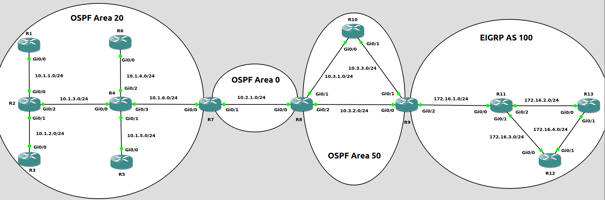
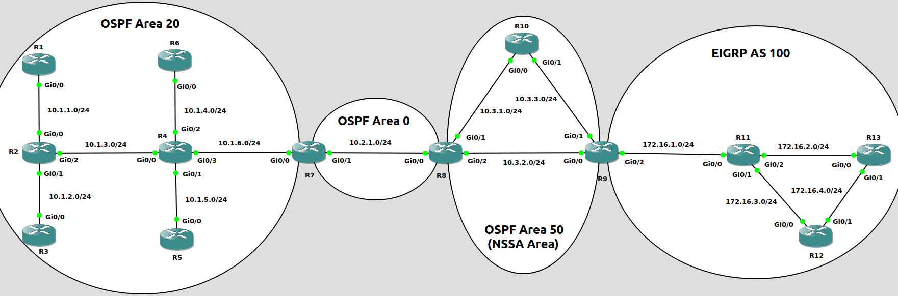

名词列表<br>
Routing protocol<br>
路由协议, 由交互信息和算法, 选出到达目标的最佳路径, 添加到路由表. 位于IP层.  如: RIP/OSPF/EIGRP/BGP
<br>
<br>

Routed/Routable protocol<br>
被路由协议和可路由协议, 定义包的结构和逻辑地址, 并允许被路由器转发. 如: IPv4/IPv6
<br>
<br>

IGP(Interior Gateway Protocols, 内部网关协议)<br>
代表机构内部(单个AS内)部署的路由协议. 如: RIP/OSPF/EIGRP/IS-IS等
<br>
<br>

EGP(Exterior Gateway Protocols, 外部网关协议)<br>
代表机构之间(多个AS之间)部署的路由协议. 目前该类只有BGP协议
<br>
<br>
<br>

IGP路由协议算法类型<br>
1.Distance vector<br>
RIP和Cisco IGRP使用该算法,  缺点是收敛速度较慢
<br>

2.Advance distance vector<br>
Cisco EIRGH使用该算法
<br>

3.Link state<br>
OSPF和IS-IS使用该算法, 相较于Distance vector, 会使用额外的CPU和内存资源
<br>
<br>
<br>

路由选择方式:<br>
1.prefix length<br>
优先选择符合的, 并且主机位更短的路由. 示例如下:<br>
10.0.3.0/28、10.0.3.0/26、10.0.3.0/24三个路由, 目标为10.3.0.12<br>
选择10.0.3.0/28作为路由
<br>
<br>

2.administration distance<br>
不同路由类型的判别<br>
AD越小的路由类型, 优先级越高, 该值独立于路由器. 不同路由类型的默认AD值如下:
|路由类型                |AD值                    |
|------------------------|------------------------|
|connected               |0                       |
|static route            |1                       |
|EIGRP(summary route)    |5                       |
|eBGP(external route)    |20                      |
|EIGRP(internal route)   |90                      |
|OSPF                    |110                     |
|IS-IS                   |115                     |
|RIP                     |120                     |
|EIGRP(external route)   |170                     |
|iBGP(internal route)    |200                     |
|Unusable                |255                     |

<br>

3.metric<br>
同一路由类型的判别<br>
RIP使用经过的跳数(路由器)作为测量指标<br>
OSPF使用单条链路的cost作为参考, 并将每条链路的测量汇总作为测量指标
<br>
<br>
<br>

#### OSPF(Open Shortest Path First)
Open Shortest Path First, 开放最短路径优先. 使用协议id 89.<br>
IPv4使用224.0.0.5(AllSPFRouters)/224.0.0.6(AllDRouters)作为多播地址<br>

LSA(link-state advertisements, 链路状态通告): 到达指定链路的信息
<br>

LSDB(link-state database, 链路状态数据库): LSA的集合, 每个Area内的路由器都包含相同的LSDB
<br>
<br>
<br>

###### OSPF包的类型
|Type  |Packet Name   |Functional Overview                    |
|------|--------------|---------------------------------------|
|1     |Hello         |用于发现和维持邻接路由器               |
|2     |Database Description(DBD)|汇总LSDB信息, 用于邻接关系初步形成时|
|3     |Link-state Request(LSR)|用于从邻接路由器获取路由信息  |
|4     |Link-state Update(LSU)|发送路由信息, 用于LSR的响应    |
|5     |Link-state Ack|用于响应LSA泛洪                        |

<br>
<br>

###### 定时器类型
1.Hello Timer<br>
Hello package间隔发送时间
<br>

配置Hello Timer<br>
`(config-if)# ip ospf hello-interval <seconds>`
<br>
<br>

2.Dead Interval Timer<br>
当该时间段内, 没有接收到Hello package时, 认定断开连接. 默认为Hello Timer的4倍
<br>

配置Dead Interval Timer<br>
`(config-if)# ip ospf dead-interval <seconds>`
<br>
<br>

查看Hello/Dead Timer<br>
```
# show ip ospf interface | include Timer|line
FastEthernet0/1 is up, line protocol is up                                      
  Timer intervals configured, Hello 5, Dead 20, Wait 20, Retransmit 5           
FastEthernet0/0 is up, line protocol is up                                      
  Timer intervals configured, Hello 10, Dead 40, Wait 40, Retransmit 5        
```
** 链路两端的Hello/Dead Timer必须一致
<br>
<br>
<br>

###### OSPF步骤
1.位于相同链路, 并且使用OSPF的路由器成为neighbor<br>

图1<br>

<br>

显示OSPF neighbor<br>
`# show ip ospf neighbor`
<br>
<br>

2.neighbor路由器之间交换LSAs<br>

图2<br>

<br>

路由器之间进入full state后, 依然需要通过几个步骤, 监测路由拓扑, 步骤如下:<br>
1)在Hello interval间隔时间, 持续发送Hello message; 如果dead interval没有收到neighbor的Hello message, 代表neighbor已经下线
<br>

2)当拓扑发生改变, 离变化最近的路由器接收到LSAs, 向外扩散
<br>

3)即使拓扑没有发生改变, 也会在指定间隔时间(默认30分钟)扩散LSAs
<br>
<br>

Broadcast网络链路(以太网链路默认使用类型)<br>

图3<br>
<br>
情景1 - 当R4与其他路由器同时加入OSPF<br>
1)所有路由器刚刚加入OSPF, R4将自己视为DR<br>

2)R4接收到其他路由器发送的Hello packet, 进行如下两步比较:<br>
&emsp;&emsp;I、比较Broadcast域内所有接口的优先级, 优先级最大的成为DR. 当前R4与其它路由器接口的优先级都为默认值, 进入比较步骤II<br>
&emsp;&emsp;II、比较Broadcast域内所有路由器的RID, RID最大的成为DR. 当前R4的RID最大, R4成为DR<br>

3)BDR选举与DR选举类似, R3成为BDR<br>

```
Result:
R4#show ip ospf interface | include Designated.*ID|Router ID                    
  Process ID 1, Router ID 4.4.4.4, Network Type BROADCAST, Cost: 1              
  Designated Router (ID) 4.4.4.4, Interface address 172.16.1.4                  
  Backup Designated router (ID) 3.3.3.3, Interface address 172.16.1.3
```
<br>

情景2 - 当R4在一段时间后加入OSPF(此时R3为DR, R2为BDR)<br>
1)默认情况下, OSPF没有preempt机制, 所有R4加入后的角色为DROther
```
R4#show ip ospf int | include Designated.*ID|Router ID                          
  Process ID 1, Router ID 4.4.4.4, Network Type BROADCAST, Cost: 1              
  Designated Router (ID) 3.3.3.3, Interface address 172.16.1.3                  
  Backup Designated router (ID) 2.2.2.2, Interface address 172.16.1.2
```
<br>

2)清除R3的OSPF process, R3退出DR, BDR(R2)立马接替成为DR, router id最高(R4)的选举成为BDR
```
R3#clear ip ospf process                                                        
Reset ALL OSPF processes? [no]: yes

R4#show ip ospf int | include Designated.*ID|Router ID                          
  Process ID 1, Router ID 4.4.4.4, Network Type BROADCAST, Cost: 1              
  Designated Router (ID) 2.2.2.2, Interface address 172.16.1.2                  
  Backup Designated router (ID) 4.4.4.4, Interface address 172.16.1.4
```
<br>

3)清除R2的OSPF process, R2退出DR, BDR(R4)成为DR, router id最高(R3)的选举成为BDR
```
R2#clear ip ospf process                                                        
Reset ALL OSPF processes? [no]: yes

R4#show ip ospf int | include Designated.*ID|Router ID                          
  Process ID 1, Router ID 4.4.4.4, Network Type BROADCAST, Cost: 1              
  Designated Router (ID) 4.4.4.4, Interface address 172.16.1.4                  
  Backup Designated router (ID) 3.3.3.3, Interface address 172.16.1.3  
```
<br>
<br>

neighbor路由器之间的关系<br>

图4<br>

<br>

neighbor路由器之间的状态为full state, 称为adjacent neighbot<br>

neighbot路由器之间的状态为2-way state, 称为neighbot<br>

只有adjacent neighbor之间才能直接同步LSDB(通过LSU)
<br>
<br>

协议号和多播地址:<br>
协议号 - 89
<br>

224.0.0.5/01:00:5E:00:00:05<br>
AllSPFRouters - DR/BDR发送内容到其他所有路由器
<br>

224.0.0.6/01:00:5E:00:00:06<br>
AllDRouters - DROther发送内容到DR/BDR路由器
<br>
<br>

子网上所有路由器的Hello interval与Dead interval的值必须一致
<br>
<br>

显示LSDB内容<br>
`# show ip ospf database`
<br>
<br>

3.使用Dijkstra SPF math从LSDB中选取到达指定subnet的最优路径, 将其放入routing table
<br>

观察neighbors关系形成:<br>
`# debug ip ospf adj`
<br>
<br>
<br>

##### 配置OSPF
1.进入router子配置模式, 并指定进程ID<br>
`(config)# router ospf <process_id>`<br>
** process_id在本地唯一, 用于指定进程, 在其他路由器该值不必一致<br>
** 同一台router可以有多个process, 并且每个process有自己唯一的database, 在每个process内的内容只有通过redistribute, 才能被其他process获得
<br>
<br>

2.配置Router ID<br>
`(config-router)# router-id <router-id>`
<br>
** Router ID配置优先级:<br>
1)直接配置<br>
2)从loopback接口中选择ip值最大的<br>
3)从非loopback接口中选择ip值最大的
<br>
<br>

3.接口配置OSPF, 指定所属area<br>
1)在router子配置模式下使用network<br>
`(config-router)# network <subnet_id> <wildcard_mask> area <area_id>`<br>
** subnet_id与wildcard_mask配合, 所有接口IP与该组合相符的, 加入OSPF<br>
** wildcard_mask的0 bit代表接口IP与subnet_id的对应的bit必须一致<br>
** 当wildcard_mask的bit值为1, 但subnet_id对应的bit不为0时, 将该bit置0. 如:192.168.1.2 0.0.0.255, 将192.168.1.2修改为192.168.1.0<br>

2)在接口配置模式下使用ip ospf<br>
`(config-if)# ip ospf <process_id> area <area_id>`
<br>

*4.接口优先级配置<br>
`(config-if)# ip ospf priority <priority>`
<br>
<br>

查看配置OSPF的接口(含Router id)<br>
`# show ip ospf interface [brief]`
<br>
<br>
<br>

***Area***<br>
AS内部可被划分为不同area, 每个area内所有路由器的LSDB内容相同<br>

area在接口级别进行设置, 并且单个接口只能属于一个area<br>

当路由器的多个接口分布在不同area时, 路由器包含有多个LSDB<br>

area 0为骨干area<br>

ABR(Area Border Router)为连接area 0与其他area的路由器, 所有非骨干area必须通过ABR与area 0相连<br>

ABR的所有接口可以配置在一个process内, 也可以不同area的接口配置不同process, 但需要进行redistribute<br>

单个area的路由器建议数量为50个(具体由路由器性能决定)
<br>
<br>
<br>

***ASBR(Autonomous System Boundary Router)***<br>
OSPF与其他路由协议的边界, 即该路由器的一部分接口属于OSPF, 一部分接口属于其他路由协议.<br>
<br>
<br>
<br>

#### LSA类型

图5<br>
<br>
```
路由redistribute:
redistribute OSPF into EIGRP
(config)# router eigrp 100
(config-router)# redistribute ospf 1 metric 1000000 1 255 1 1500

redistribute EIGRP into OSPF
(config)# route ospf 1
(config-router)# redistribute eigrp 100


R4 OSPF database信息:
R4# show ip ospf database                      

            OSPF Router with ID (4.4.4.4) (Process ID 1)

		Router Link States (Area 20)

Link ID         ADV Router      Age         Seq#       Checksum Link count
1.1.1.1         1.1.1.1         1643        0x8000000A 0x008483 1
2.2.2.2         2.2.2.2         1694        0x8000000D 0x009DFF 3
3.3.3.3         3.3.3.3         1635        0x80000009 0x002AC9 1
4.4.4.4         4.4.4.4         1301        0x80000011 0x00D661 4
5.5.5.5         5.5.5.5         1448        0x8000000A 0x0002D6 1
6.6.6.6         6.6.6.6         1311        0x8000000A 0x00AD24 1
7.7.7.7         7.7.7.7         1205        0x8000000B 0x009C26 1

		Net Link States (Area 20)

Link ID         ADV Router      Age         Seq#       Checksum
10.1.1.1        1.1.1.1         1643        0x80000008 0x0056BF
10.1.2.2        2.2.2.2         1694        0x80000008 0x007790
10.1.3.2        2.2.2.2         1694        0x80000008 0x009E64
10.1.4.4        4.4.4.4         1552        0x80000008 0x00EBFB
10.1.5.4        4.4.4.4         1552        0x80000008 0x00AE3C
10.1.6.4        4.4.4.4         1301        0x80000008 0x0008D9
          
                Summary Net Link States (Area 20)
          
Link ID         ADV Router      Age         Seq#       Checksum
10.2.1.0        7.7.7.7         1205        0x80000008 0x000DFE
10.3.1.0        7.7.7.7         1205        0x80000008 0x000BFE
10.3.2.0        7.7.7.7         1205        0x80000008 0x00FF09
10.3.3.0        7.7.7.7         952         0x80000008 0x00FE08
          
                Summary ASB Link States (Area 20)
          
Link ID         ADV Router      Age         Seq#       Checksum
9.9.9.9         7.7.7.7         196         0x80000003 0x0019DE
          
                Type-5 AS External Link States
          
Link ID         ADV Router      Age         Seq#       Checksum Tag
172.16.1.0      9.9.9.9         210         0x80000003 0x004478 0
172.16.2.0      9.9.9.9         210         0x80000003 0x003982 0
172.16.3.0      9.9.9.9         210         0x80000003 0x002E8C 0
172.16.4.0      9.9.9.9         210         0x80000003 0x002396 0


R10 OSPF database信息:
R10#show ip ospf database

            OSPF Router with ID (10.10.10.10) (Process ID 1)

		Router Link States (Area 50)

Link ID         ADV Router      Age         Seq#       Checksum Link count
8.8.8.8         8.8.8.8         5           0x80000018 0x00BEAE 2
9.9.9.9         9.9.9.9         2           0x80000018 0x00D588 2
10.10.10.10     10.10.10.10     2           0x80000017 0x0095C2 2

		Net Link States (Area 50)

Link ID         ADV Router      Age         Seq#       Checksum
10.3.1.10       10.10.10.10     11          0x80000003 0x003F70
10.3.2.9        9.9.9.9         26          0x80000003 0x003A7D
10.3.3.10       10.10.10.10     11          0x80000003 0x005B4E

		Summary Net Link States (Area 50)

Link ID         ADV Router      Age         Seq#       Checksum
10.1.1.0        8.8.8.8         40          0x8000000C 0x0011F0
10.1.2.0        8.8.8.8         40          0x8000000C 0x0006FA
10.1.3.0        8.8.8.8         40          0x8000000C 0x00F010
10.1.4.0        8.8.8.8         40          0x8000000C 0x00E51A
10.1.5.0        8.8.8.8         40          0x8000000C 0x00DA24
10.1.6.0        8.8.8.8         40          0x8000000C 0x00C539
10.2.1.0        8.8.8.8         40          0x8000000C 0x00E61D
          
                Type-5 AS External Link States
          
Link ID         ADV Router      Age         Seq#       Checksum Tag
172.16.1.0      9.9.9.9         30          0x80000001 0x004876 0
172.16.2.0      9.9.9.9         30          0x80000001 0x003D80 0
172.16.3.0      9.9.9.9         30          0x80000001 0x00328A 0
172.16.4.0      9.9.9.9         30          0x80000001 0x002794 0


R10 OSPF route信息:
R10# show ip route ospf | begin Gateway
Gateway of last resort is not set

      10.0.0.0/8 is variably subnetted, 12 subnets, 2 masks
O IA     10.1.1.0/24 [110/5] via 10.3.1.8, 00:01:18, GigabitEthernet0/0
O IA     10.1.2.0/24 [110/5] via 10.3.1.8, 00:01:18, GigabitEthernet0/0
O IA     10.1.3.0/24 [110/4] via 10.3.1.8, 00:01:18, GigabitEthernet0/0
O IA     10.1.4.0/24 [110/4] via 10.3.1.8, 00:01:18, GigabitEthernet0/0
O IA     10.1.5.0/24 [110/4] via 10.3.1.8, 00:01:18, GigabitEthernet0/0
O IA     10.1.6.0/24 [110/3] via 10.3.1.8, 00:01:18, GigabitEthernet0/0
O IA     10.2.1.0/24 [110/2] via 10.3.1.8, 00:01:18, GigabitEthernet0/0
O        10.3.2.0/24 [110/2] via 10.3.3.9, 00:01:18, GigabitEthernet0/1
                     [110/2] via 10.3.1.8, 00:01:18, GigabitEthernet0/0
      172.16.0.0/24 is subnetted, 4 subnets
O E2     172.16.1.0 [110/20] via 10.3.3.9, 00:01:18, GigabitEthernet0/1
O E2     172.16.2.0 [110/20] via 10.3.3.9, 00:01:18, GigabitEthernet0/1
O E2     172.16.3.0 [110/20] via 10.3.3.9, 00:01:18, GigabitEthernet0/1
O E2     172.16.4.0 [110/20] via 10.3.3.9, 00:01:18, GigabitEthernet0/1


将Area 50设置为NSSA Area后:
R8(config)# router ospf 1
R8(config-router)# area 50 nssa

R9(config)# router ospf 1
R9(config-router)# area 50 nssa

R10(config)# router ospf 1
R10(config-router)# area 50 nssa


R10 OSPF database信息:
R10# show ip ospf database

            OSPF Router with ID (10.10.10.10) (Process ID 1)

		Router Link States (Area 50)

Link ID         ADV Router      Age         Seq#       Checksum Link count
8.8.8.8         8.8.8.8         598         0x80000013 0x0074F5 2
9.9.9.9         9.9.9.9         601         0x80000013 0x0085D7 2
10.10.10.10     10.10.10.10     527         0x80000013 0x004313 2

		Net Link States (Area 50)

Link ID         ADV Router      Age         Seq#       Checksum
10.3.1.10       10.10.10.10     610         0x80000001 0x00E8C2
10.3.2.9        9.9.9.9         628         0x80000001 0x00E3CF
10.3.3.10       10.10.10.10     613         0x80000001 0x0005A0

		Summary Net Link States (Area 50)

Link ID         ADV Router      Age         Seq#       Checksum
10.1.1.0        8.8.8.8         719         0x8000000B 0x00B844
10.1.2.0        8.8.8.8         719         0x8000000B 0x00AD4E
10.1.3.0        8.8.8.8         719         0x8000000B 0x009863
10.1.4.0        8.8.8.8         719         0x8000000B 0x008D6D
10.1.5.0        8.8.8.8         719         0x8000000B 0x008277
10.1.6.0        8.8.8.8         719         0x8000000B 0x006D8C
10.2.1.0        8.8.8.8         719         0x8000000B 0x008E70
          
                Type-7 AS External Link States (Area 50)
          
Link ID         ADV Router      Age         Seq#       Checksum Tag
172.16.1.0      9.9.9.9         628         0x80000001 0x00EBAF 0
172.16.2.0      9.9.9.9         628         0x80000001 0x00E0B9 0
172.16.3.0      9.9.9.9         628         0x80000001 0x00D5C3 0
172.16.4.0      9.9.9.9         628         0x80000001 0x00CACD 0


R10 OSPF route信息:
R10# Gateway of last resort is not set

      10.0.0.0/8 is variably subnetted, 12 subnets, 2 masks
O IA     10.1.1.0/24 [110/5] via 10.3.1.8, 00:09:32, GigabitEthernet0/0
O IA     10.1.2.0/24 [110/5] via 10.3.1.8, 00:09:32, GigabitEthernet0/0
O IA     10.1.3.0/24 [110/4] via 10.3.1.8, 00:09:32, GigabitEthernet0/0
O IA     10.1.4.0/24 [110/4] via 10.3.1.8, 00:09:32, GigabitEthernet0/0
O IA     10.1.5.0/24 [110/4] via 10.3.1.8, 00:09:32, GigabitEthernet0/0
O IA     10.1.6.0/24 [110/3] via 10.3.1.8, 00:09:32, GigabitEthernet0/0
O IA     10.2.1.0/24 [110/2] via 10.3.1.8, 00:09:32, GigabitEthernet0/0
O        10.3.2.0/24 [110/2] via 10.3.3.9, 00:09:32, GigabitEthernet0/1
                     [110/2] via 10.3.1.8, 00:09:32, GigabitEthernet0/0
      172.16.0.0/24 is subnetted, 4 subnets
O N2     172.16.1.0 [110/20] via 10.3.3.9, 00:09:32, GigabitEthernet0/1
O N2     172.16.2.0 [110/20] via 10.3.3.9, 00:09:32, GigabitEthernet0/1
O N2     172.16.3.0 [110/20] via 10.3.3.9, 00:09:32, GigabitEthernet0/1
O N2     172.16.4.0 [110/20] via 10.3.3.9, 00:09:32, GigabitEthernet0/1


LSA类型列表:
Type 1 - Router
  区域内路由器, field列表如下:
    Link ID
    路由器标识符, 为路由器Router ID

    ADV Router
    发送LSA路由器的标识符, 为路由器Router ID

    Age
    收到该LSA的时间累计, 当累计到1800 seconds时, 发送该LSA的路由器会发送新的LSA, 并将Age重置为0
    累计到3600 seconds时, 认为该LSA的路由器失效, 从LSDB中删除

    Sequence
    发送LSA的路由器, 每发送一次LSA, sequence会递增1
    当路由器接收到LSA, 如果sequence大于当前保存sequence, 会更新LSA; 如果sequence小于当前保存sequence, 则丢弃接收到的LSA

    Checksum
    LSA的校验和

    Link count
    加入当前Area的接口数量


Type 2 - Network
  当前区域内子网, field列表如下:
    Link ID
    子网Designate Router的接口IP

    ADV Router
    子网Designate Router的Router ID


Type 3 - Summary
  通过ABR通告的其他区域子网. field列表如下:
    Link ID
    其他Area的子网ID

    ADV Router
    生成该LSA的Area Border Router(ABR)的Router ID

  metric计算规则:
    所有区域的所有路径总metric和, 与Area内metric计算规则并无二致


Type 4 - ASBR Summary
  与ASBR位于不同Area, 由ABR传播的ASBR信息. field列表如下:
    Link ID
    ASBR的Router ID

    ADV Router
    ABR的Router ID

  metric计算规则:
    metric = ABR 7到ABR R8的metric + ABR R8到ASBR R9的metric
    OSPF Area 20内的所有路由器的metric一致

Type 5 - AS External
  通过ASBR进行redistribute的其他路由协议内容. field列表如下:
    Link ID
    其他路由协议redistribute的子网ID

    ADV Router
    生成该LSA的Autonomous System Border Router(ASBR)的Router ID

    Metric计算规则:
      Type 1
      metric = redistribute metric + OSPF metric

      Type 2(默认类型)
      metric = redistribute metric
      ** 在路由选择中, 如果多个Type 2路由的metric相同, 则比较forwarding metric(从当前路由器到ASBR的metric)
    ** 在路由选择中, Type 1优先于Type 2


Type 7 - NSSA External
  只有当ASBR位于的Aaea为Not-So-Stubby Area(NSSA, 查看后续NSSA补充)时, 才会生成该类型LSA. field列表如下:
    Link ID
    其他路由协议redistribute的子网ID

    ADV Router
    生成该LSA的Autonomous System Border Router(ASBR)的Router ID
    
    Metric计算规则:
      Type 1
      metric = redistribute metric + OSPF metric, 优先于Type 5的类型1 metric

      Type 2(默认类型)
      metric = redistribute metric, 优先于Type 5的类型2 metric


查看不同Type的详细信息
# show ip ospf database {router | network | summary | asbr-summary | external | nssa-external}
```
<br>

##### Stub Area
不允许Type 4/5 LSA进入该Area, 但ABR生成一个Type 3 LSA, 该LSA指定一个默认路由<br>
将Area内所有路由器配置为stub, 即可配置为Stub Area<br>

路由器配置stub:
```
(config)# router ospf <process_id>
(config-router)# area <area_id> stub
```
<br>

##### Not-So-Stubby Area
不允许Type 4/5 LSA通过ABR进入Area, 但Type 4/5 LSA可以通过ASBR进入<br>
将Area内所有路由器配置为nssa, 即可配置为NSSA Area<br>

路由器配置NSSA:
```
(config)# router ospf <process_id>
(config-router)# area <area_id> nssa
```
<br>

LSA 1在Inter-area的传播(如图6)<br>

图6<br>
<br>
<br>

LSA 5在Inter-area的传播(如图7)<br>

图7<br>
<br>
<br>

LSA 7在Inter-area的传播(如图8)<br>

图8<br>
<br>
<br>
<br>

##### OSPF路径选择
1.Intra-area<br>
优先选择area内路由, 如果多条路由都符合, 则比较metric
<br>

2.Interarea<br>
如果多条路由都是area间路由, 则比较metric
<br>
<br>
<br>

#### OSPF特征
##### 1.passive interface
不发送Hello消息, 并且不执行接收的OSPF包<br>

配置passive interface(默认所有接口为非passive)<br>
`(config-router)# passive-interface <interface>`<br>

配置所有接口默认为passive, 并配置非passive接口<br>
```
(config-router)# passive-interface default
(config-router)# no passive-interface <interface>
```
<br>

查看接口是否为passive
```
# show ip ospf interface f0/1 | include Passive
    No Hellos (Passive interface) 
```
<br>

##### 2.OSPF默认路由通告
将默认路由通告给下游路由器, 以上游路由器作为默认路由<br>
当前路由器必须自己包含默认路由<br>

图9
<br>

配置默认路由通告<br>
```
(config)# router ospf <process_id>
(config-router)# default-information originate [always] [metric <metric_value>] [metric_type <type>]

always
当前路由器没有默认路由, 也向下进行通告
```

```
ISP(config)# interface f0/1
ISP(config-if)# ip address 172.16.1.2 255.255.255.0
ISP(config-if)# no shutdown

R1(config)# interface f0/1
R1(config-if)# ip address 172.16.1.1 255.255.255.0
R1(config-if)# no shutdown
R1(config)# interface f0/2
R1(config-if)# ip address 192.168.1.1 255.255.255.0
R1(config-if)# no shutdown
R1(config)# interface f0/3
R1(config-if)# ip address 192.168.2.1 255.255.255.0
R1(config-if)# no shutdown
R1(config)# router ospf 1
R1(config-router)# router-id 1.1.1.1
R1(config)# interface f0/2
R1(config-if)# ip ospf 1 area 0
R1(config)# interface f0/3
R1(config-if)# ip ospf 1 area 0

R2(config)# interface f0/1
R2(config-if)# ip address 192.168.1.2 255.255.255.0
R2(config-if)# no shutdown
R2(config)# router ospf 1
R2(config-router)# router-id 2.2.2.2
R2(config)# interface f0/1
R2(config-if)# ip ospf 1 area 0

R3(config)# interface f0/1
R3(config-if)# ip address 192.168.2.2 255.255.255.0
R3(config-if)# no shutdown
R3(config)# router ospf 1
R3(config-router)# router-id 3.3.3.3
R3(config)# interface f0/1
R3(config-if)# ip ospf 1 area 0

R2(config)# ip route 0.0.0.0 0.0.0.0 172.16.1.2
R2(config)# router ospf 1
R2(config-router)# default-information originate

R4# show ip route
O*E2  0.0.0.0/0 [110/1] via 192.168.2.1, 00:00:35, FastEthernet0/0
O     192.168.1.0/24 [110/2] via 192.168.2.1, 00:03:49, FastEthernet0/0
      192.168.2.0/24 is variably subnetted, 2 subnets, 2 masks
C        192.168.2.0/24 is directly connected, FastEthernet0/0
L        192.168.2.2/32 is directly connected, FastEthernet0/0
```
<br>
<br>

##### 3.OSPF Metrics
计算公式:<br>
$$cost=\frac{Reference\ Bandwidth}{Interface\ Bandwidth}$$
** 如公式, Reference\ Bandwidth默认值为100 Mbps, Interface\ Bandwidth与接口speed一致, 结果为小数时, 取整为1<br>
** 由于OSPF的metric为16 bits, 所有单条链路的cost最高为65535
<br>

各种链路默认cost
|interface             |interface bandwidth  |formula             |OSPF cost   |
|----------------------|---------------------|--------------------|------------|
|Serial                |1544 Kbps            |100,000/1544        |64          |
|Ethernet              |10 Mbps              |100,000/10,000      |10          |
|Fast Ethernet         |100 Mbps             |100,000/100,000     |1           |
|Gigabit Ethernet      |1 Gbps               |100,000/1000,000    |1           |
|10 Gigabit Ethernet   |10 Gbps              |100,000/10,000,000  |1           |
|100 Gigabit Ethernet  |100 Gbps             |100,000/100,000,000 |1           |

配置cost方法:<br>
1)直接配置接口cost<br>
`(config-if)# ip ospf cost <num>`
<br>

2)配置加入指定OSPF Process的所有接口的reference bandwidth(单位为Mbps)<br>
`(config-router)# auto-cost reference-bandwidth <speed>`<br>
** 建议使用方案, 并且建议所有路由器的reference-bandwidth一致
<br>

3)配置interface bandwidth(单位为Kbps)<br>
`(config-if)# bandwidth <speed>`
<br>
<br>

##### 4.OSPF负载均衡
当多条路径达到子网的cost一致时, 会同时加入routing table, 默认支持4条路径
<br>

配置负载均衡路径数量<br>
`(config-router)# maximum-paths <num>`
<br>
<br>
<br>


##### 5.路由汇总
在ABR处进行汇总, 在当前Area链路状态发生变化时, 减少其他Area的拓扑变化<br>

从参与汇总的所有网络中, 选取到达ABR Metric最小的网络, 该Metric值作为汇总路由的Metric
<br>
<br>

配置汇总语法<br>
```
(config)# router ospf <process_id>
(config-router)# area <area_id> range <network_id> <subnet_mask> [advertise | not-advertise] [cost <metric>]

area_id
非目标Area的id

network_id/subnet_mask
汇总后的网络ID和掩码

advertise | not-advertise
是否将汇总后的内容进行通告, 默认为advertise

<metric>
手动配置汇总路由的metric. 默认为非目标Area汇总路由所有子集中链路metric最小的metric
```
<br>

图10<br>
<br>

以下所有示例1/2/3均参考图10<br>
示例1 - 非骨干Area的路由汇总(Type 1 LSA)<br>
情景一<br>
没有进行汇总时, 所有链路正常时, Area 2的Type 1 LSA通过ABR R4进入Area 0, 成为Type 3 LSA
```
R5#show ip ospf database summary | include Link State ID|Network Mask|Metric
  Link State ID: 10.2.1.0 (summary Network Number)
  Network Mask: /24
	TOS: 0 	Metric: 2 
  Link State ID: 10.2.2.0 (summary Network Number)
  Network Mask: /24
	TOS: 0 	Metric: 3 
  Link State ID: 10.2.3.0 (summary Network Number)
  Network Mask: /24
	TOS: 0 	Metric: 64 
  Link State ID: 10.2.4.0 (summary Network Number)
  Network Mask: /24
	TOS: 0 	Metric: 1 
```
<br>

情景二<br>
没有进行汇总时, 当R4连接链路10.2.4.0/24的接口出现故障, Area 2的Type 1 LSA通过ABR R4进入Area 0, 成为Type 3 LSA
```
R5#show ip ospf database summary | include Link State ID|Network Mask|Metric
  Link State ID: 10.2.1.0 (summary Network Number)
  Network Mask: /24
	TOS: 0 	Metric: 66 
  Link State ID: 10.2.2.0 (summary Network Number)
  Network Mask: /24
	TOS: 0 	Metric: 65 
  Link State ID: 10.2.3.0 (summary Network Number)
  Network Mask: /24
	TOS: 0 	Metric: 64 
  Link State ID: 10.2.4.0 (summary Network Number)
  Network Mask: /24
	TOS: 0 	Metric: 67
```
<br>

情景三<br>
进行汇总后, 所有链路正常时, 将Area 2的路由(Type 1 LSA)进行汇总, 再通过ABR R4进入Area 0
```
R4(config-router)#area 2 range 10.2.0.0 255.255.248.0

R5#show ip ospf database summary | include Link State ID|Network Mask|Metric
  Link State ID: 10.2.0.0 (summary Network Number)
  Network Mask: /21
	TOS: 0 	Metric: 1

** 汇总路由的非环路策略, null0接口
R4#show ip route | include 10\.2.*/24|10\.2.*/21
O       10.2.0.0/21 is a summary, 00:04:02, Null0
O       10.2.1.0/24 [110/2] via 10.2.4.2, 00:04:02, FastEthernet1/0
O       10.2.2.0/24 [110/3] via 10.2.4.2, 00:04:02, FastEthernet1/0
C       10.2.3.0/24 is directly connected, Serial2/0
C       10.2.4.0/24 is directly connected, FastEthernet1/0
```
<br>

情景四<br>
进行汇总后, 当R4连接链路10.2.4.0/24的接口出现故障, 将Area 2路由(Type 1 LSA)进行汇总, 通过ABR R4进入Area 0
```
R5#show ip ospf database summary | include Link State ID|Network Mask|Metric
  Link State ID: 10.2.0.0 (summary Network Number)
  Network Mask: /21
	TOS: 0 	Metric: 64
```
<br>
<br>

示例2 - Area 0的路由汇总(Type 1 LSA)<br>
情景一<br>
没有进行汇总, 所有链路正常时, Area 0的Type 1 LSA通过ABR R4进入Area 2, 成为Type 3 LSA
```
R2#show ip ospf database summary | include Link State ID|Network Mask|Metric
  Link State ID: 10.1.1.0 (summary Network Number)
  Network Mask: /24
	TOS: 0 	Metric: 1 
  Link State ID: 10.1.2.0 (summary Network Number)
  Network Mask: /24
	TOS: 0 	Metric: 1 
  Link State ID: 10.1.3.0 (summary Network Number)
  Network Mask: /24
	TOS: 0 	Metric: 2 
```
<br>

情景二<br>
没有进行汇总时, 当R4连接链路10.1.2.0/24的接口出现故障, Area 0的Type 1 LSA通过ABR R4进入Area 2, 成为Type 3 LSA
```
R2#show ip ospf database summary | include Link State ID|Network Mask|Metric
  Link State ID: 10.1.1.0 (summary Network Number)
  Network Mask: /24
	TOS: 0 	Metric: 1 
  Link State ID: 10.1.2.0 (summary Network Number)
  Network Mask: /24
	TOS: 0 	Metric: 3 
  Link State ID: 10.1.3.0 (summary Network Number)
  Network Mask: /24
	TOS: 0 	Metric: 2 
```
<br>

情景三<br>
进行汇总后, 所有链路正常时, 将Area 0的路由(Type 1 LSA)进行汇总, 再通过ABR R4进入Area 2
```
R4(config-router)#area 0 range 10.1.0.0 255.255.252.0

R2#show ip ospf database summary | include Link State ID|Network Mask|Metric
  Link State ID: 10.1.0.0 (summary Network Number)
  Network Mask: /22
	TOS: 0 	Metric: 1

** 汇总路由的非环路策略, null0接口
R4#show ip route | include 10\.1.*/24|10\.1.*/22
O       10.1.3.0/24 [110/2] via 10.1.2.2, 00:01:48, FastEthernet1/1
C       10.1.2.0/24 is directly connected, FastEthernet1/1
C       10.1.1.0/24 is directly connected, FastEthernet1/2
O       10.1.0.0/22 is a summary, 00:01:48, Null0
```
<br>

情景四<br>
进行汇总后, 当R4连接链路10.1.2.0/24的接口出现故障, 将Area 0路由(Type 1 LSA)进行汇总, 通过ABR R4进入Area 2
```
R5#show ip ospf database summary | include Link State ID|Network Mask|Metric
  Link State ID: 10.1.0.0 (summary Network Number)
  Network Mask: /22
	TOS: 0 	Metric: 1
```
<br>
<br>

示例3 - Area 0的路由汇总(Type 3 LSA)<br>
情景一<br>
没有进行汇总, 所有链路正常时, Area 0的Type 3 LSA通过ABR R4进入Area 2
```
R2#show ip ospf database summary | include Link State ID|Network Mask|Metric
  Link State ID: 10.3.1.0 (summary Network Number)
  Network Mask: /24
	TOS: 0 	Metric: 2 
  Link State ID: 10.3.2.0 (summary Network Number)
  Network Mask: /24
	TOS: 0 	Metric: 2 
  Link State ID: 10.3.3.0 (summary Network Number)
  Network Mask: /24
	TOS: 0 	Metric: 3
```
<br>

情景二<br>
没有进行汇总时, 当R6连接链路10.3.1.0/24的接口出现故障, Area 0的Type 3 LSA通过ABR R4进入Area 2
```
R2#show ip ospf database summary | include Link State ID|Network Mask|Metric
  Link State ID: 10.3.1.0 (summary Network Number)
  Network Mask: /24
	TOS: 0 	Metric: 4 
  Link State ID: 10.3.2.0 (summary Network Number)
  Network Mask: /24
	TOS: 0 	Metric: 2 
  Link State ID: 10.3.3.0 (summary Network Number)
  Network Mask: /24
	TOS: 0 	Metric: 3
```
<br>

情景三<br>
进行汇总后, 所有链路正常时, 将Area 0的路由(Type 3 LSA)进行汇总, 再通过ABR R4进入Area 2
```
R4(config-router)#area 0 range 10.3.0.0 255.255.252.0

R2#show ip ospf database summary | include Link State ID|Network Mask|Metric
  Link State ID: 10.3.1.0 (summary Network Number)
  Network Mask: /24
	TOS: 0 	Metric: 2 
  Link State ID: 10.3.2.0 (summary Network Number)
  Network Mask: /24
	TOS: 0 	Metric: 2 
  Link State ID: 10.3.3.0 (summary Network Number)
  Network Mask: /24
	TOS: 0 	Metric: 3
```
<br>

*结果解析*
```
1.由示例1得知, 当在ABR没有进行汇总时, 所有到ABR有链路Metric变化的链路情况, 都会影响到目标Area

当在ABR进行汇总后, 只有汇总路由的Metric(非骨干所有链路最小链路metric)产生变化时, 才会影响目标Area

当静态配置汇总路由的metric, 目标Area不会受到非目标Area链路变化的影响


2.由示例1/2/3得知, 汇总支持Type 1 LSA(非Area 0到Area 0 或 Area 0到非Area 0方向皆可), 但不支持Type 3 LSA汇总
```
<br>
<br>

##### 6.External路由汇总
1)在ASBR处于非Stub Area时, 在ASBR上进行汇总<br>

2)在ASBR处于NSSA Area时, 可以在ASBR上进行汇总, 也可以在Type 7转化为Type 5的ABR上进行汇总<br>

External汇总配置:
```
(config)# router ospf <process_id>
(config-router)# summary-address <network_id> <subnet_mask>>
```
<br>

图11<br>
<br>

示例1 - 非Stub Area汇总(参考图11)<br>
配置汇总前
```
R10# show ip route ospf | include 172.16
      172.16.0.0/24 is subnetted, 4 subnets
O E2     172.16.1.0 [110/20] via 10.3.3.9, 00:14:43, GigabitEthernet0/1
O E2     172.16.2.0 [110/20] via 10.3.3.9, 00:14:43, GigabitEthernet0/1
O E2     172.16.3.0 [110/20] via 10.3.3.9, 00:14:43, GigabitEthernet0/1
O E2     172.16.4.0 [110/20] via 10.3.3.9, 00:14:43, GigabitEthernet0/1


R4# show ip route ospf | include 172.16
      172.16.0.0/24 is subnetted, 4 subnets
O E2     172.16.1.0 [110/20] via 10.1.6.7, 00:00:12, GigabitEthernet0/3
O E2     172.16.2.0 [110/20] via 10.1.6.7, 00:00:12, GigabitEthernet0/3
O E2     172.16.3.0 [110/20] via 10.1.6.7, 00:00:12, GigabitEthernet0/3
O E2     172.16.4.0 [110/20] via 10.1.6.7, 00:00:12, GigabitEthernet0/3
```
<br>

在ASBR上进行汇总
```
R9(config)# router ospf 3
R9(config-router)# summary-address 172.16.0.0 255.255.248.0
```
<br>

配置汇总后
```
R10# show ip route ospf | include 172.16
      172.16.0.0/21 is subnetted, 1 subnets
O E2     172.16.0.0 [110/20] via 10.3.3.9, 00:00:48, GigabitEthernet0/1


R4# show ip route ospf | include 172.16
      172.16.0.0/21 is subnetted, 1 subnets
O E2     172.16.0.0 [110/20] via 10.1.6.7, 00:01:20, GigabitEthernet0/3
```
<br>
<br>

图12<br>
<br>

示例2 - NSSA在ASBR上汇总(参考图12)<br>
配置汇总前
```
R10# show ip route ospf | include 172.16
      172.16.0.0/24 is subnetted, 4 subnets
O N2     172.16.1.0 [110/20] via 10.3.3.9, 00:00:08, GigabitEthernet0/1
O N2     172.16.2.0 [110/20] via 10.3.3.9, 00:00:08, GigabitEthernet0/1
O N2     172.16.3.0 [110/20] via 10.3.3.9, 00:00:08, GigabitEthernet0/1
O N2     172.16.4.0 [110/20] via 10.3.3.9, 00:00:08, GigabitEthernet0/1


R4# show ip route ospf | include 172.16
      172.16.0.0/24 is subnetted, 4 subnets
O E2     172.16.1.0 [110/20] via 10.1.6.7, 00:00:00, GigabitEthernet0/3
O E2     172.16.2.0 [110/20] via 10.1.6.7, 00:00:00, GigabitEthernet0/3
O E2     172.16.3.0 [110/20] via 10.1.6.7, 00:00:00, GigabitEthernet0/3
O E2     172.16.4.0 [110/20] via 10.1.6.7, 00:00:00, GigabitEthernet0/3
```
<br>

在ASBR上进行汇总
```
R9(config)# router ospf 3
R9(config-router)# summary-address 172.16.0.0 255.255.248.0
```
<br>

配置汇总后
```
R10# show ip route ospf | include 172.16
      172.16.0.0/21 is subnetted, 1 subnets
O N2     172.16.0.0 [110/20] via 10.3.3.9, 00:00:08, GigabitEthernet0/1


R4# show ip route ospf | include 172.16
      172.16.0.0/21 is subnetted, 1 subnets
O E2     172.16.0.0 [110/20] via 10.1.6.7, 00:00:36, GigabitEthernet0/3
```
<br>

示例3 - NSSA在ABR上汇总(参考图12)<br>
配置汇总前
```
R10# show ip route ospf | include 172.16
      172.16.0.0/24 is subnetted, 4 subnets
O N2     172.16.1.0 [110/20] via 10.3.3.9, 00:00:08, GigabitEthernet0/1
O N2     172.16.2.0 [110/20] via 10.3.3.9, 00:00:08, GigabitEthernet0/1
O N2     172.16.3.0 [110/20] via 10.3.3.9, 00:00:08, GigabitEthernet0/1
O N2     172.16.4.0 [110/20] via 10.3.3.9, 00:00:08, GigabitEthernet0/1


R4# show ip route ospf | include 172.16
      172.16.0.0/24 is subnetted, 4 subnets
O E2     172.16.1.0 [110/20] via 10.1.6.7, 00:00:00, GigabitEthernet0/3
O E2     172.16.2.0 [110/20] via 10.1.6.7, 00:00:00, GigabitEthernet0/3
O E2     172.16.3.0 [110/20] via 10.1.6.7, 00:00:00, GigabitEthernet0/3
O E2     172.16.4.0 [110/20] via 10.1.6.7, 00:00:00, GigabitEthernet0/3
```
<br>

在ABR R8上进行汇总
```
R8(config)# router ospf 3
R8(config-router)# summary-address 172.16.0.0 255.255.248.0
```
<br>

配置汇总后
```
R10# show ip route ospf | include 172.16
      172.16.0.0/24 is subnetted, 4 subnets
O N2     172.16.1.0 [110/20] via 10.3.3.9, 00:04:22, GigabitEthernet0/1
O N2     172.16.2.0 [110/20] via 10.3.3.9, 00:04:22, GigabitEthernet0/1
O N2     172.16.3.0 [110/20] via 10.3.3.9, 00:04:22, GigabitEthernet0/1
O N2     172.16.4.0 [110/20] via 10.3.3.9, 00:04:22, GigabitEthernet0/1


R4# show ip route ospf | include 172.16
      172.16.0.0/21 is subnetted, 1 subnets
O E2     172.16.0.0 [110/20] via 10.1.6.7, 00:03:35, GigabitEthernet0/3
```
<br>
<br>
<br>

##### 7.路由过滤
过滤方式:<br>
1.Type 1 LSA过滤<br>
使用Area间路由汇总语句<br>
`(config-router)# area <area_id> range <networ_id> <subnet_mask> not-advertise`
<br>

图13<br>
<br>

以下内容都参考图13<br>
示例 - 在R4上过滤10.2.2.0/24网络<br>
情景一<br>
过滤10.2.2.0/24之前
```
R5#show ip ospf database summary | include Link State ID 
  Link State ID: 10.2.1.0 (summary Network Number)
  Link State ID: 10.2.2.0 (summary Network Number)
  Link State ID: 10.2.3.0 (summary Network Number)
  Link State ID: 10.2.4.0 (summary Network Number)
  Link State ID: 10.3.1.0 (summary Network Number)
  Link State ID: 10.3.2.0 (summary Network Number)
  Link State ID: 10.3.3.0 (summary Network Number)
```

情景二<br>
过滤10.2.2.0/24之后
```
R4(config-router)#area 2 range 10.2.2.0 255.255.255.0 not-advertise

R5#show ip ospf database summary | include Link State ID 
  Link State ID: 10.2.1.0 (summary Network Number)
  Link State ID: 10.2.3.0 (summary Network Number)
  Link State ID: 10.2.4.0 (summary Network Number)
  Link State ID: 10.3.1.0 (summary Network Number)
  Link State ID: 10.3.2.0 (summary Network Number)
  Link State ID: 10.3.3.0 (summary Network Number)
```
<br>
<br>

2.Type 1 LSA和Type 3 LSA过滤<br>
配置语法:
```
(config-router)# area <area_id> filter-list prefix <prefix_list_name> {in | out}

area_id配合in/out, 代表从指定area进入/流出
```
<br>

prefix-list内容补充:<br>
配置语法:<br>
```
(config)# ip prefix-list <prefix_list_name> [seq <number>] {deny | permit} <network_id>/<length> [{ge | le} <prefix_length>]

<network_id>/<length>
在指定网络范围内

{ge | le} <prefix_length>
ge(great than and equal)指定最小子网掩码长度
le(less than and equal)指定最大子网掩码长度
```
<br>

示例 - 在R4上过滤网络10.3.1.0/24<br>
情景一<br>
过滤10.3.1.0/24之前
```
R2#show ip ospf database summary | include Link State ID
  Link State ID: 10.1.1.0 (summary Network Number)
  Link State ID: 10.1.2.0 (summary Network Number)
  Link State ID: 10.1.3.0 (summary Network Number)
  Link State ID: 10.3.1.0 (summary Network Number)
  Link State ID: 10.3.2.0 (summary Network Number)
  Link State ID: 10.3.3.0 (summary Network Number)
```

情景二<br>
过滤10.3.1.0/24之后
```
R4(config)#ip prefix-list OUT_FILTER seq 5 deny 10.3.1.0/24
R4(config)#ip prefix-list OUT_FILTER seq 10 permit 0.0.0.0/0 le 32

R4(config)#router ospf <process_id>
R4(config-router)#area 0 filter-list prefix OUT_FILTER out

R2#show ip ospf database summary | include Link State ID
  Link State ID: 10.1.1.0 (summary Network Number)
  Link State ID: 10.1.2.0 (summary Network Number)
  Link State ID: 10.1.3.0 (summary Network Number)
  Link State ID: 10.3.2.0 (summary Network Number)
  Link State ID: 10.3.3.0 (summary Network Number)
```
<br>
<br>

3.不将Type 1 LSA或Type 3 LSA安装到本机路由表(RIB), 并且不影响在路由器间的传播<br>
配置语法
```
(config-router)# distribute-list {<acl_number> | <acl_name> | prefix <prefix_list_name> | route-map <route_map_name>} in
```

示例 - 配置R4不安装10.2.1.0/24到RIB<br>
```
配置前:
R4#show ip route | begin Gateway
Gateway of last resort is not set

     10.0.0.0/24 is subnetted, 10 subnets
O IA    10.3.1.0 [110/2] via 10.1.1.2, 00:19:57, FastEthernet1/0
O       10.1.3.0 [110/2] via 10.1.2.2, 00:19:57, FastEthernet0/1
                 [110/2] via 10.1.1.2, 00:19:57, FastEthernet1/0
O       10.2.1.0 [110/2] via 10.2.4.2, 00:19:57, FastEthernet0/0
C       10.1.2.0 is directly connected, FastEthernet0/1
O IA    10.3.3.0 [110/3] via 10.1.1.2, 00:19:57, FastEthernet1/0
O       10.2.2.0 [110/3] via 10.2.4.2, 00:19:57, FastEthernet0/0
C       10.1.1.0 is directly connected, FastEthernet1/0
O IA    10.3.2.0 [110/2] via 10.1.1.2, 00:19:57, FastEthernet1/0
C       10.2.3.0 is directly connected, Serial3/0
C       10.2.4.0 is directly connected, FastEthernet0/0


配置后:
R4(config)#ip prefix-list RIB_FILTER seq 5 deny 10.2.1.0/24
R4(config)#ip prefix-list RIB_FILTER seq 10 permit 0.0.0.0/0 le 32

R4(config)#router ospf <process_id>
R4(config-router)#distribute-list prefix RIB_FILTER in

R4#show ip route | begin Gateway
Gateway of last resort is not set

     10.0.0.0/24 is subnetted, 9 subnets
O IA    10.3.1.0 [110/2] via 10.1.1.2, 00:00:11, FastEthernet1/0
O       10.1.3.0 [110/2] via 10.1.2.2, 00:00:11, FastEthernet0/1
                 [110/2] via 10.1.1.2, 00:00:11, FastEthernet1/0
C       10.1.2.0 is directly connected, FastEthernet0/1
O IA    10.3.3.0 [110/3] via 10.1.1.2, 00:00:11, FastEthernet1/0
O       10.2.2.0 [110/3] via 10.2.4.2, 00:00:11, FastEthernet0/0
C       10.1.1.0 is directly connected, FastEthernet1/0
O IA    10.3.2.0 [110/2] via 10.1.1.2, 00:00:11, FastEthernet1/0
C       10.2.3.0 is directly connected, Serial3/0
C       10.2.4.0 is directly connected, FastEthernet0/0

R4#show ip ospf database summary | include Link State ID
  Link State ID: 10.2.1.0 (summary Network Number)
  Link State ID: 10.2.2.0 (summary Network Number)
  Link State ID: 10.2.3.0 (summary Network Number)
  Link State ID: 10.2.4.0 (summary Network Number)
  Link State ID: 10.3.1.0 (summary Network Number)
  Link State ID: 10.3.2.0 (summary Network Number)
  Link State ID: 10.3.3.0 (summary Network Number)
  Link State ID: 10.1.1.0 (summary Network Number)
  Link State ID: 10.1.2.0 (summary Network Number)
  Link State ID: 10.1.3.0 (summary Network Number)
  Link State ID: 10.3.1.0 (summary Network Number)
  Link State ID: 10.3.2.0 (summary Network Number)
  Link State ID: 10.3.3.0 (summary Network Number)

R5#show ip route | begin Gateway
Gateway of last resort is not set

     10.0.0.0/24 is subnetted, 10 subnets
O IA    10.3.1.0 [110/2] via 10.1.3.2, 00:43:10, FastEthernet0/1
C       10.1.3.0 is directly connected, FastEthernet0/1
O IA    10.2.1.0 [110/3] via 10.1.2.1, 00:47:15, FastEthernet0/0
C       10.1.2.0 is directly connected, FastEthernet0/0
O IA    10.3.3.0 [110/3] via 10.1.3.2, 00:52:20, FastEthernet0/1
O IA    10.2.2.0 [110/4] via 10.1.2.1, 00:25:53, FastEthernet0/0
O       10.1.1.0 [110/2] via 10.1.3.2, 00:52:10, FastEthernet0/1
                 [110/2] via 10.1.2.1, 00:49:47, FastEthernet0/0
O IA    10.3.2.0 [110/2] via 10.1.3.2, 00:52:20, FastEthernet0/1
O IA    10.2.3.0 [110/65] via 10.1.2.1, 00:48:25, FastEthernet0/0
O IA    10.2.4.0 [110/2] via 10.1.2.1, 00:49:47, FastEthernet0/0
```
<br>
<br>

<br>

##### 链路网络类型<br>
1.broadcast<br>
broadcast multi-access, Ethernet link(Ethernet LAN/WAN)默认使用该类型, 可使用DR/BDR<br>

2.non-broadcast<br>
nonbroadcast multi-access(NBMA), Frame Relay默认使用该类型, 可使用DR/BDR<br>

3.point-to-point<br>
Serial link(HDLC/PPP封装)默认使用该类型, 不可使用DR/BDR<br>

4.point-to-multipoint<br>
没有链路默认使用该类型, 必须手动配置, 不可使用DR/BDR<br>

配置broadcast network type<br>
`(config-if)# ip ospf network {broadcast | non-broadcast | point-to-point | point-to-multipoint}`
<br>
<br>
<br>

##### OSPF neighbor所需要的条件:
|Requirement       |Required for OSPF|Neighbor Missing if Incorrect|relative command  |
|---------------|-----------------|------------------|------------------|
|Interface must be in an up/up state.|Yes|Yes|show ip interface brief|
|Access control lists(ACL)must not filter routing protocol messages.|Yes|Yes|show access-list|
|Interfaces must be in the same subnet.|Yes|Yes|show ip ospf interface brief|
|They must pass routing protocol neighbor authentication(if configured).|Yes|Yes|show ip ospf interface|
|Hello and hold/dead timers must match.|Yes|Yes|show ip ospf interface|
|Router IDs(RID) must be unique.|Yes|Yes|show ip ospf|
|They must be in the same area.|Yes|Yes|show ip ospf interface brief|
|OSPF process must not be shut down.|Yes|Yes|show ip ospf|
|Neighboring interfaces must use same MTU setting.|Yes|No|show interfaces|
|Neighboring interfaces must use same OSPF network type.|Yes|No|show ip ospf interface|

** Required for OSPF代表是否为成为neighbor路由器正常工作所必须项<br>

** Neighbor Missing if Incorrect代表该项不符时, 是否丢失neighbor关系
<br>
<br>
<br>
#### OSPFv3
OSPFv3特性<br>
1.同时支持IPv4和IPv6<br>

2.IPv6使用link local地址作为构建邻接关系的地址<br>

3.Router ID在只使用IPv6的情况必须手动配置
<br>
<br>

协议号和多播地址:<br>
协议号 - 89<br>

FF02::05 - ALLSPFRouters<br>

FF02::06 - ALLDRouters
<br>
<br>

###### OSPFv3包的类型
|Type  |Packet Name   |Functional Overview                    |
|------|--------------|---------------------------------------|
|1     |Hello         |用于发现和维持邻接路由器               |
|2     |Database Description(DBD)|汇总LSDB信息, 用于邻接关系初步形成时|
|3     |Link-state Request(LSR)|用于从邻接路由器获取路由信息  |
|4     |Link-state Update(LSU)|发送路由信息, 用于LSR的响应    |
|5     |Link-state Ack|用于响应LSA泛洪                        |

<br>
<br>

OSPFv3的IPv6配置步骤:<br>
1.开启ipv6路由<br>
`(config)# ipv6 unicast-routing`
<br>

2.创建ospfv3进程<br>
`(config)# router ospfv3 <process_id>`
<br>

3.指定Router ID<br>
`(config-router)# router-id <router_id>`
<br>

4.接口上启动ospfv3<br>
`(config-if)# ospfv3 <process_id> ipv6 area <area_id>`
<br>
<br>

OSPFv3邻接路由器查看<br>
`# show ospfv3 ipv6 neighbor`
<br>
<br>

OSPFv3接口信息<br>
`# show ospfv3 interface <interface_type> <interface_num>`
<br>
<br>

OSPFv3接口简略信息<br>
`# show ospfv3 interface brief`
<br>
<br>

图14<br>
<br>

示例 - 如图14, 配置代码
```
R1(config)#ipv6 unicast-routing
R1(config)#router ospfv3 1
R1(config-router)#router-id 1.1.1.1
R1(config-router)#int f0/0
R1(config-if)#ipv6 add 2001:db8:1::1/64
R1(config-if)#no shutdown
R1(config-if)#ospfv3 1 ipv6 area 0

R2(config)#ipv6 unicast-routing
R2(config)#router ospfv3 1
R2(config-router)#router-id 2.2.2.2
R2(config-router)#int f0/0
R2(config-if)#ipv6 add 2001:db8:1::2/64
R2(config-if)#no shutdown
R2(config-if)#ospfv3 1 ipv6 area 0
R2(config-if)#int f0/1
R2(config-if)#ipv6 add 2001:db8:2::2/64
R2(config-if)#no shutdown
R2(config-if)#ospfv3 1 ipv6 area 0

R3(config)#ipv6 unicast-routing
R3(config)#router ospfv3 1
R3(config-router)#router-id 3.3.3.3
R3(config-router)#int f0/0
R3(config-if)#ipv6 add 2001:db8:2::1/64
R3(config-if)#no shutdown
R3(config-if)#ospfv3 1 ipv6 area 0
R3(config-if)#int f0/1
R3(config-if)#ipv6 add 2001:db8:3::1/64
R3(config-if)#no shutdown
R3(config-if)#ospfv3 1 ipv6 area 1

R4(config)#ipv6 unicast-routing 
R4(config)#router ospfv3 1
R4(config-router)#router-id 4.4.4.4
R4(config-router)#int f0/0
R4(config-if)#ipv6 add 2001:db8:3::2/64
R4(config-if)#no shutdown
R4(config-if)#ospfv3 1 ipv6 area 1


R3# show ospfv3 ipv6 neighbor

          OSPFv3 1 address-family ipv6 (router-id 3.3.3.3)

Neighbor ID     Pri   State           Dead Time   Interface ID    Interface
2.2.2.2           1   FULL/DR         00:00:31    4               FastEthernet0/0
4.4.4.4           1   FULL/BDR        00:00:37    3               FastEthernet0/1


R3# show ospfv3 interface f0/0
FastEthernet0/0 is up, line protocol is up 
  Link Local Address FE80::C803:5FF:FED3:8, Interface ID 3
  Area 0, Process ID 1, Instance ID 0, Router ID 3.3.3.3
  Network Type BROADCAST, Cost: 1
  Transmit Delay is 1 sec, State BDR, Priority 1
  Designated Router (ID) 2.2.2.2, local address FE80::C802:5FF:FEA4:6
  Backup Designated router (ID) 3.3.3.3, local address FE80::C803:5FF:FED3:8
  Timer intervals configured, Hello 10, Dead 40, Wait 40, Retransmit 5
    Hello due in 00:00:04
  Graceful restart helper support enabled
  Index 1/1/1, flood queue length 0
  Next 0x0(0)/0x0(0)/0x0(0)
  Last flood scan length is 1, maximum is 1
  Last flood scan time is 0 msec, maximum is 0 msec
  Neighbor Count is 1, Adjacent neighbor count is 1 
    Adjacent with neighbor 2.2.2.2  (Designated Router)
  Suppress hello for 0 neighbor(s)


R3# show ospfv3 interface brief
Interface    PID   Area            AF         Cost  State Nbrs F/C
Fa0/0        1     0               ipv6       1     BDR   1/1
Fa0/1        1     1               ipv6       1     DR    1/1


R4#show ipv6 route ospf
OI  2001:DB8:1::/64 [110/3]
     via FE80::C803:5FF:FED3:6, FastEthernet0/0
OI  2001:DB8:2::/64 [110/2]
     via FE80::C803:5FF:FED3:6, FastEthernet0/0
```
<br>
<br>

##### OSPFv3特征
###### 1.Passive Interface
不发送Hello消息, 并且不执行接收的OSPF包<br>

配置passive interface(默认所有接口为非passive)<br>
`(config-router)# passive-interface <interface>`<br>

配置所有接口默认为passive, 并配置非passive接口<br>
```
(config-router)# passive-interface default
(config-router)# no passive-interface <interface>
```
<br>

查看接口是否为passive
```
R3# show ospfv3 interface f0/0 | include Passive
    No Hellos (Passive interface) 
```
<br>
<br>

###### 2.Network Type
配置接口类型:<br>
`(config-if)# ospfv3 network {broadcast | point-to-point}`
<br>
<br>

查看接口类型:<br>
`# show ospfv3 interface <interface_type> <interface_num> | include Network`
<br>
<br>
<br>

###### 3.OSPFv6的IPV6与IPv4双通道
OSPFv3的双通道配置步骤:<br>
1.开启ipv6路由<br>
`(config)# ipv6 unicast-routing`
<br>

2.创建ospfv3进程<br>
`(config)# router ospfv3 <process_id>`
<br>

3.指定Router ID<br>
`(config-router)# router-id <router_id>`
<br>

4.接口上启动ospfv3<br>
```
(config-if)# ospfv3 <process_id> ipv6 area <area_id>
(config-if)# ospfv3 <process_id> ipv4 area <area_id>
```
<br>
<br>

###### 4.Area间路由汇总
配置汇总
```
(config)# router ospf <process_id>
(config-router)# address-family ipv6 unicast
(config-router-af)# area <area_id> range <prefix>/<prefix_length> [advertise | not-advertise] [cost <metric>]
```
<br>

图15<br>
<br>

以下所有示例1/2/3均参考图15<br>
示例1 - 非骨干Area的路由汇总(Type 1 LSA)<br>
情景一<br>
没有进行汇总时, 所有链路正常时, Area 2的Type 1 LSA通过ABR R4进入Area 0, 成为Type 3 LSA
```
R5#show ipv6 ospf database inter-area prefix | include Metric|Prefix.*:
  Metric: 1 
  Prefix Address: 2001:DB8:2:4::
  Prefix Length: 64, Options: None
  Metric: 64 
  Prefix Address: 2001:DB8:2:3::
  Prefix Length: 64, Options: None
  Metric: 3 
  Prefix Address: 2001:DB8:2:2::
  Prefix Length: 64, Options: None
  Metric: 2 
  Prefix Address: 2001:DB8:2:1::
  Prefix Length: 64, Options: None
```
<br>

情景二<br>
没有进行汇总时, 当R4连接链路2001:db8:2:4::/64的接口出现故障, Area 2的Type 1 LSA通过ABR R4进入Area 0, 成为Type 3 LSA
```
R5#show ipv6 ospf database inter-area prefix | include Metric|Prefix.*:
  Metric: 64 
  Prefix Address: 2001:DB8:2:3::
  Prefix Length: 64, Options: None
  Metric: 65 
  Prefix Address: 2001:DB8:2:2::
  Prefix Length: 64, Options: None
  Metric: 66 
  Prefix Address: 2001:DB8:2:1::
  Prefix Length: 64, Options: None
  Metric: 67 
  Prefix Address: 2001:DB8:2:4::
  Prefix Length: 64, Options: None
```
<br>

情景三<br>
进行汇总后, 所有链路正常时, 将Area 2的路由(Type 1 LSA)进行汇总, 再通过ABR R4进入Area 0
```
R4(config-router)# address-family ipv6 unicast
R4(config-router-af)#area 2 range 2001:db8:2:0::/61

R5#show ipv6 ospf database inter-area prefix | include Metric|Prefix.*:
  Metric: 67 
  Prefix Address: 2001:DB8:2::
  Prefix Length: 61, Options: None

** 汇总路由的非环路策略, null0接口
R4#show ipv6 route | section DB8:2.*/64|DB8:2.*/61
O   2001:DB8:2::/61 [110/67]
     via Null0, directly connected
O   2001:DB8:2:1::/64 [110/2]
     via FE80::C802:9FF:FE1A:6, FastEthernet0/0
O   2001:DB8:2:2::/64 [110/3]
     via FE80::C802:9FF:FE1A:6, FastEthernet0/0
C   2001:DB8:2:3::/64 [0/0]
     via Serial2/0, directly connected
C   2001:DB8:2:4::/64 [0/0]
     via FastEthernet0/0, directly connected
```
<br>

情景四<br>
进行汇总后, 当R4连接链路2001:bd8:2:4::/64的接口出现故障, 将Area 2路由(Type 1 LSA)进行汇总, 通过ABR R4进入Area 0
```
R5#show ipv6 ospf database inter-area prefix | include Metric|Prefix.*:
  Metric: 128 
  Prefix Address: 2001:DB8:2::
  Prefix Length: 61, Options: None
```
<br>
<br>

示例2 - Area 0的路由汇总(Type 1 LSA)<br>
情景一<br>
没有进行汇总, 所有链路正常时, Area 0的Type 1 LSA通过ABR R4进入Area 2, 成为Type 3 LSA
```
R2#show ipv6 ospf database inter-area prefix | include Metric|Prefix.*:
  Metric: 2 
  Prefix Address: 2001:DB8:1:3::
  Prefix Length: 64, Options: None
  Metric: 1 
  Prefix Address: 2001:DB8:1:1::
  Prefix Length: 64, Options: None
  Metric: 1 
  Prefix Address: 2001:DB8:1:2::
  Prefix Length: 64, Options: None

```
<br>

情景二<br>
没有进行汇总时, 当R4连接链路2001:db8:1:2::/64的接口出现故障, Area 0的Type 1 LSA通过ABR R4进入Area 2, 成为Type 3 LSA
```
R2#show ipv6 ospf database inter-area prefix | include Metric|Prefix.*:
  Metric: 2 
  Prefix Address: 2001:DB8:1:3::
  Prefix Length: 64, Options: None
  Metric: 1 
  Prefix Address: 2001:DB8:1:1::
  Prefix Length: 64, Options: None
  Metric: 3 
  Prefix Address: 2001:DB8:1:2::
  Prefix Length: 64, Options: None
```
<br>

情景三<br>
进行汇总后, 所有链路正常时, 将Area 0的路由(Type 1 LSA)进行汇总, 再通过ABR R4进入Area 2
```
R4(config-router)#address-family ipv6 unicast 
R4(config-router-af)#area 0 range 2001:db8:1::/62

R2#show ipv6 ospf database inter-area prefix | include Metric|Prefix.*:
  Metric: 2 
  Prefix Address: 2001:DB8:1::
  Prefix Length: 62, Options: None

** 汇总路由的非环路策略, null0接口
R4#show ipv6 route | section DB8:1.*/64|DB8:1.*/62
O   2001:DB8:1::/62 [110/2]
     via Null0, directly connected
C   2001:DB8:1:1::/64 [0/0]
     via FastEthernet1/0, directly connected
C   2001:DB8:1:2::/64 [0/0]
     via FastEthernet0/1, directly connected
O   2001:DB8:1:3::/64 [110/2]
     via FE80::C806:9FF:FECE:8, FastEthernet1/0
     via FE80::C805:9FF:FEAE:8, FastEthernet0/1
```
<br>

情景四<br>
进行汇总后, 当R4连接链路2001:db8:1:2::/64的接口出现故障, 将Area 0路由(Type 1 LSA)进行汇总, 通过ABR R4进入Area 2
```
R2#show ipv6 ospf database inter-area prefix | include Metric|Prefix.*:
  Metric: 3 
  Prefix Address: 2001:DB8:1::
  Prefix Length: 62, Options: None
```
<br>
<br>

示例3 - Area 0的路由汇总(Type 3 LSA)<br>
情景一<br>
没有进行汇总, 所有链路正常时, Area 0的Type 3 LSA通过ABR R4进入Area 2
```
R2#show ipv6 ospf database inter-area prefix | include Metric|Prefix.*:
  Metric: 2 
  Prefix Address: 2001:DB8:3:1::
  Prefix Length: 64, Options: None
  Metric: 2 
  Prefix Address: 2001:DB8:3:2::
  Prefix Length: 64, Options: None
  Metric: 3 
  Prefix Address: 2001:DB8:3:3::
  Prefix Length: 64, Options: None

```
<br>

情景二<br>
没有进行汇总时, 当R6连接链路2001:db8:3:1::/64的接口出现故障, Area 0的Type 3 LSA通过ABR R4进入Area 2
```
  Metric: 4 
  Prefix Address: 2001:DB8:3:1::
  Prefix Length: 64, Options: None
  Metric: 2 
  Prefix Address: 2001:DB8:3:2::
  Prefix Length: 64, Options: None
  Metric: 3 
  Prefix Address: 2001:DB8:3:3::
  Prefix Length: 64, Options: None

```
<br>

情景三<br>
进行汇总后, 所有链路正常时, 将Area 0的路由(Type 3 LSA)进行汇总, 再通过ABR R4进入Area 2
```
R4(config-router)#address-family ipv6 unicast 
R4(config-router-af)#area 0 range 2001:db8:3::/62

  Metric: 2 
  Prefix Address: 2001:DB8:3:1::
  Prefix Length: 64, Options: None
  Metric: 2 
  Prefix Address: 2001:DB8:3:2::
  Prefix Length: 64, Options: None
  Metric: 3 
  Prefix Address: 2001:DB8:3:3::
  Prefix Length: 64, Options: None
```
<br>
<br>

###### 5.路由过滤
过滤方式:<br>
1.Type 1 LSA过滤<br>
使用Area间路由汇总语句<br>
`(config-router-af)# area <area_id> range <prefix>/<prefix-length> not-advertise`
<br>
<br>

图16<br>
<br>

以下内容都参考图16<br>
示例 - 在R4上过滤2001:db8:2:2::/64网络<br>
情景一<br>
过滤之前
```
R5#show ipv6 ospf database inter-area prefix | include Prefix Address
  Prefix Address: 2001:DB8:2:4::
  Prefix Address: 2001:DB8:2:3::
  Prefix Address: 2001:DB8:2:2::
  Prefix Address: 2001:DB8:2:1::
  Prefix Address: 2001:DB8:3:3::
  Prefix Address: 2001:DB8:3:2::
  Prefix Address: 2001:DB8:3:1::

```
<br>

情景二
```
R4(config-router)# address-family ipv6 unicast
R4(config-router-af)# area 2 range 2001:db8:2:2::/64 not-advertise

R5# show ipv6 ospf database inter-area prefix | include Prefix Address
  Prefix Address: 2001:DB8:2:4::
  Prefix Address: 2001:DB8:2:3::
  Prefix Address: 2001:DB8:2:1::
  Prefix Address: 2001:DB8:3:3::
  Prefix Address: 2001:DB8:3:2::
  Prefix Address: 2001:DB8:3:1::
```
<br>
<br>

2.Type 1 LSA和Type 3 LSA过滤<br>
配置语法:
```
(config-router)# address-family ipv6 unicast
(config-router-af)# area <area_id> filter-list prefix <prefix_list_name> {in | out}

area_id配合in/out, 代表从指定area进入/流出
```
<br>

示例 - 在R4上过滤网络2001;db8:3:1::/64<br>
情景一<br>
过滤之前
```
R2# show ipv6 ospf database inter-area prefix | include Prefix Address
  Prefix Address: 2001:DB8:1:3::
  Prefix Address: 2001:DB8:1:1::
  Prefix Address: 2001:DB8:1:2::
  Prefix Address: 2001:DB8:3:1::
  Prefix Address: 2001:DB8:3:2::
  Prefix Address: 2001:DB8:3:3::
```
<br>

情景二
过滤之后
```
R4(config)# ipv6 prefix-list OUT_FILTER seq 5 deny 2001:db8:3:1::/64
R4(config)# ipv6 prefix-list OUT_FILTER seq 10 permit ::/0 le 128

R4(config)# router ospfv3 1
R4(config-router)# address-family ipv6 unicast
R4(config-router-af)# area 0 filter-list prefix OUT_FILTER out

R2#show ipv6 ospf database inter-area prefix | include Prefix Address
  Prefix Address: 2001:DB8:1:3::
  Prefix Address: 2001:DB8:1:1::
  Prefix Address: 2001:DB8:1:2::
  Prefix Address: 2001:DB8:3:2::
  Prefix Address: 2001:DB8:3:3::
```
<br>
<br>

3.不将Type 1 LSA或Type 3 LSA安装到本机路由表(RIB), 并且不影响在路由器间的传播
配置语法
```
(config)# router ospfv3 <process_id>
(config-router)# address-family ipv6 unicast
(config-router-af)# distribute-list {<acl_number> | <acl_name> | prefix <prefix_list_name> | route-map <route_map_name>} in
```
<br>

示例 - 配置R4不安装2001:db8:2:1::/64到RIB
```
配置前:
R4# show ipv6 route
C   2001:DB8:1:1::/64 [0/0]
     via FastEthernet1/0, directly connected
L   2001:DB8:1:1::1/128 [0/0]
     via FastEthernet1/0, receive
C   2001:DB8:1:2::/64 [0/0]
     via FastEthernet0/1, directly connected
L   2001:DB8:1:2::1/128 [0/0]
     via FastEthernet0/1, receive
O   2001:DB8:1:3::/64 [110/2]
     via FE80::C805:9FF:FEAE:8, FastEthernet0/1
     via FE80::C806:9FF:FECE:8, FastEthernet1/0
O   2001:DB8:2:1::/64 [110/2]
     via FE80::C802:9FF:FE1A:6, FastEthernet0/0
O   2001:DB8:2:2::/64 [110/3]
     via FE80::C802:9FF:FE1A:6, FastEthernet0/0
C   2001:DB8:2:3::/64 [0/0]
     via Serial2/0, directly connected
L   2001:DB8:2:3::1/128 [0/0]
     via Serial2/0, receive
C   2001:DB8:2:4::/64 [0/0]
     via FastEthernet0/0, directly connected
L   2001:DB8:2:4::1/128 [0/0]
     via FastEthernet0/0, receive
OI  2001:DB8:3:1::/64 [110/2]
     via FE80::C806:9FF:FECE:8, FastEthernet1/0
OI  2001:DB8:3:2::/64 [110/2]
     via FE80::C806:9FF:FECE:8, FastEthernet1/0
OI  2001:DB8:3:3::/64 [110/3]
     via FE80::C806:9FF:FECE:8, FastEthernet1/0
L   FF00::/8 [0/0]
     via Null0, receive


配置后:
R4(config)#ipv6 prefix-list RIB_FILTER seq 5 deny 2001:db8:2:1::/64
R4(config)#ipv6 prefix-list RIB_FILTER seq 10 permit ::/0 le 128
R4(config)#router ospfv3 1
R4(config-router)#address-family ipv6 unicast
R4(config-router-af)#distribute-list prefix RIB_FILTER in

R4# show ipv6 route
C   2001:DB8:1:1::/64 [0/0]
     via FastEthernet1/0, directly connected
L   2001:DB8:1:1::1/128 [0/0]
     via FastEthernet1/0, receive
C   2001:DB8:1:2::/64 [0/0]
     via FastEthernet0/1, directly connected
L   2001:DB8:1:2::1/128 [0/0]
     via FastEthernet0/1, receive
O   2001:DB8:1:3::/64 [110/2]
     via FE80::C805:9FF:FEAE:8, FastEthernet0/1
     via FE80::C806:9FF:FECE:8, FastEthernet1/0
O   2001:DB8:2:2::/64 [110/3]
     via FE80::C802:9FF:FE1A:6, FastEthernet0/0
C   2001:DB8:2:3::/64 [0/0]
     via Serial2/0, directly connected
L   2001:DB8:2:3::1/128 [0/0]
     via Serial2/0, receive
C   2001:DB8:2:4::/64 [0/0]
     via FastEthernet0/0, directly connected
L   2001:DB8:2:4::1/128 [0/0]
     via FastEthernet0/0, receive
OI  2001:DB8:3:1::/64 [110/2]
     via FE80::C806:9FF:FECE:8, FastEthernet1/0
OI  2001:DB8:3:2::/64 [110/2]
     via FE80::C806:9FF:FECE:8, FastEthernet1/0
OI  2001:DB8:3:3::/64 [110/3]
     via FE80::C806:9FF:FECE:8, FastEthernet1/0
L   FF00::/8 [0/0]
     via Null0, receive
```
<br>
<br>

引用:<br>
[1] OSPFv2 RFC: https://datatracker.ietf.org/doc/html/rfc2328
