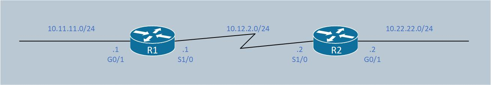
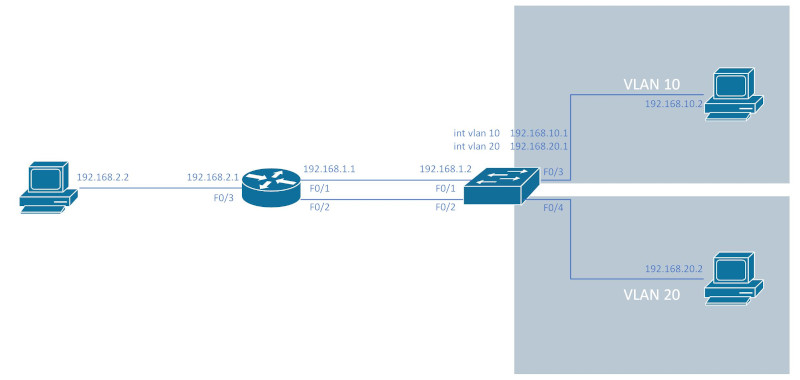

IP路由<br>
将IP package从发送位置转发到目标位置
<br>
<br>

路由表<br>
从当前路由器到达目标位置, 选择的下一跳IP地址(或出向接口). 路由表内容添加方式如下:<br>
&emsp;&emsp;1.默认添加: 任何与当前路由器直接相连的子网, 其路由会自动添加到路由表<br>
&emsp;&emsp;2.手动配置: 使用ip route指令将子网位置和下一跳/出向接口内容添加到路由表<br>
&emsp;&emsp;3.自动配置: 路由器使用路由协议, 邻接路由器之间, 如果使用的路由协议兼容, 会得到通告的路由
<br>
<br>

开启/关闭接口<br>
```
(config-if)# [no] shutdown

[HW-g0/0/0] [undo] shutdown
```
<br>
<br>

给接口配置IP<br>
```
(config-if)# ip address 192.168.1.2 255.255.255.0

[HW-g0/0/0] ip address 192.168.1.2 24
```
<br>
<br>


<br>
静态路由配置方法<br>
1.Directly attached static route(只适用于PPP/HDLC等Point-to-Point链路)<br>
```
(config)# ip route <subnet> <subnet_mask> <interface_id>

[HW] ip route-static <subnet> {<prefix_length> | <mask>} <egress_interface>
```
<br>

2.Recursive static route<br>
```
(config)# ip route <network> <subnet_mask> <next_hop_ip>

[HW] ip route-static <subnet> {<prefix_length> | <mask>} <next_hop>
```
<br>

3.Fully specified static route<br>
```
(config)# ip route <network> <subnet_mask> <interface_id> <next_hop_ip>

[HW] ip route-static <subnet> {<prefix_length> | <mask>} <egress_interface> <next_hop>
```
<br>
<br>

静态路由类型<br>
1.static network route<br>
```
(config)# ip route <subnet_id> <subnet_mask> {<next_hop_ip> | <interface_id>}

[HW] ip route-static <subnet> {<prefix_length> | <mask>} <next_hop>
```
<br>

2.static host route<br>
```
(config)# ip route <host_ip> 255.255.255.255 {<next_hop_ip> | <interface_id>}

[HW] ip route-static <subnet> {255.255.255.255 | 32}  <next_hop>
```
<br>

3.floating static route<br>
```
(config)# ip route <subnet_id> <subnet_mask> {<next_hop_ip> | <interface_id>} <administrative_distance>

[HW] ip route-static <subnet> {<prefix_length> | <mask>} <next_hop> preference <prefer_value>
```
<br>

4.static default route<br>
```
(config)# ip route 0.0.0.0 0.0.0.0 {<next_hop_ip> | <interface_id>}

[HW] ip route-static 0.0.0.0 0 <next_hop>
```
<br>

5.static null route<br>
```
(config)# ip route <subnet_id> <subnet_mask> <null_interface>

[HW] ip route-static <subnet> {<prefix_length> | <mask>} <null_interface>
```
<br>
<br>
<br>

查看接口的IP层信息<br>
```
# show ip interface [brief]

<HW> display ip interface [brief]
```
<br>
<br>

查看IP层接口和路由启用情况<br>
`# show protocols`
<br>
<br>

显示arp表内容<br>
```
# show ip arp

<HW> display arp
```
<br>
<br>

删除arp表内容<br>
`# clear ip arp <ip_addr>`
<br>
<br>
<br>

显示完整路由表<br>
```
# show ip route

<HW> display ip routing-table
```
<br>
<br>

显示指定类型路由<br>
```
# show ip route {connected | static | ospf ...}

<HW> display ip routing-table protocol {direct | static | ospf | isis | rip | bgp}
```
<br>
<br>

显示到指定子网或IP的路由<br>
```
# show ip route {<subnet_id> | <ip_addr>}

<HW> display ip routing-table {<subnet_id> | <ip_addr>}
```
<br>
<br>

<br>
静态路由配置实例<br>
```
R1(config)# int f0/1
R1(config-if)# ip address 192.168.1.1
R1(config-if)# no shutdown
R1(config)# int f0/2
R1(config-if)# ip address 192.168.2.1
R1(config-if)# no shutdown
R1(config)# ip route 192.168.3.0 255.255.255.0 192.168.1.2

R2(config)# int f0/1
R2(config-if)# ip address 192.168.1.2
R2(config-if)# no shutdown
R2(config)# int f0/2
R2(config-if)# ip address 192.168.3.1
R2(config-if)# no shutdown
R2(config)# ip route 192.168.2.0 255.255.255.0 192.168.1.1
```
<br>
<br>
<br>

第三层EtherChannel(第三层交换机的路由端口)<br>
1.将接口加入EtherChannel<br>
```
(config)# int range <range_interface>
(config-if-range)# no switchport
(config-if-range)# channel-group <number> mode on
```
<br>

2.配置port-channel端口<br>
```
(config)# interface port-channel <number>
(config-if)# no switchport
(config-if)# ip address <ip_addr> <subnet_mask>
```
<br>

<br>
配置实例
```
Switch(config)# ip routing
Switch(config)# vlan 10
Switch(config)# vlan 20
Switch(config)# int f0/3                                                  
Switch(config-if)# switchport mode access
Switch(config-if)# switchport access vlan 10
Switch(config)# int f0/4
Switch(config-if)# switchport mode access
Switch(config-if)# switchport access vlan 20
Switch(config)# int vlan 10
Switch(config-if)# ip address 192.168.10.1 255.255.255.0
Switch(config-if)# no shutdown
Switch(config)# int vlan 20
Switch(config-if)# ip address 192.168.20.1 255.255.255.0
Switch(config-if)# no shutdown
Switch(config)# int range f0/1-2
Switch(config-if-range)# no switchport
Switch(config-if-range)# channel-group 1 mode on
Switch(config)# int port-channel 1
Switch(config-if)# no switchport
Switch(config-if)# ip address 192.168.1.2 255.255.255.0
Switch(config-if)# ip route 192.168.2.0 255.255.255.0 192.168.1.1

Router(config)# int port-channel 1
Router(config-if)# ip address 192.168.1.1 255.255.255.0
Router(config)# int range f0/1-2
Router(config-if-range)# channel-group 1
Router(config-if-range)# no shutdown
Router(config)# int f0/3
Router(config-if)# ip address 192.168.2.1 255.255.255.0
Router(config-if-range)# no shutdown
Router(config)# ip route 192.168.10.0 255.255.255.0 192.168.1.2
Router(config)# ip route 192.168.20.0 255.255.255.0 192.168.1.2
```
<br>
<br>
<br>

