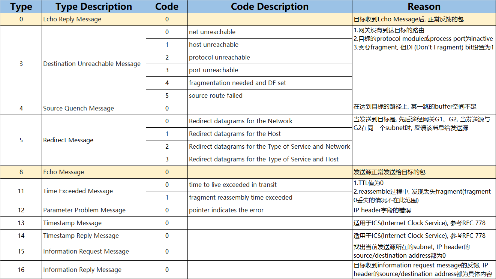
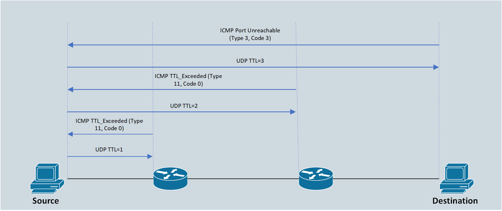

开启/关闭接口<br>
`(config-if)# [no] shutdown`
<br>
<br>

给接口配置IP<br>
```
(config)# interface f0/1
(config-if)# ip address 192.168.1.2 255.255.255.0
```
<br>
<br>

查看接口的IP层简短信息<br>
`# show ip interface brief`
<br>
<br>

查看接口的IP层详细信息<br>
`# show ip interface`
<br>
<br>

查看IP层接口和路由启用情况<br>
`# show protocols`
<br>
<br>

IP路由<br>
将IP package从发送位置转发到目标位置
<br>
<br>

路由表<br>
从当前路由器到达目标位置, 选择的下一跳IP地址(或出向接口). 路由表内容添加方式如下:<br>
&emsp;&emsp;1.默认添加: 任何与当前路由器直接相连的子网, 其路由会自动添加到路由表<br>
&emsp;&emsp;2.手动配置: 使用ip route指令将子网位置和下一跳/出向接口内容添加到路由表<br>
&emsp;&emsp;3.自动配置: 路由器使用路由协议, 邻接路由器之间, 如果使用的路由协议兼容, 会得到通告的路由
<br>
<br>

显示arp表内容<br>
`# show ip arp`
<br>
<br>

删除arp表内容<br>
`# clear ip arp <ip_addr>`
<br>
<br>
<br>

<br>
静态路由配置方法<br>
1.Directly attached static route(只适用于PPP/HDLC等Point-to-Point链路)<br>
`(config)# ip route <network> <subnet_mask> <interface_id>`
<br>

实例<br>
`R1(config)# ip route 10.22.22.0 255.255.255.0 S1/0`
<br>

2.Recursive static route<br>
`(config)# ip route <network> <subnet_mask> <next_hop_ip>`
<br>

实例<br>
`R1(config)# ip route 10.22.22.0 255.255.255.0 10.12.2.2`
<br>

3.Fully specified static route<br>
`(config)# ip route <network> <subnet_mask> <interface_id> <next_hop_ip>`
<br>

实例<br>
`R1(config)# ip route 10.22.22.0 255.255.255.0 S1/0 10.12.2.2`
<br>
<br>

静态路由类型<br>
1.static network route<br>
`(config)# ip route <subnet_id> <subnet_mask> {<next_hop_ip> | <interface_id>}`
<br>

2.static host route<br>
`(config)# ip route <host_ip> 255.255.255.255 {<next_hop_ip> | <interface_id>}`
<br>

3.floating static route<br>
`(config)# ip route <subnet_id> <subnet_mask> {<next_hop_ip> | <interface_id>} <administrative_distance>`
<br>

4.static default route<br>
`(config)# ip route 0.0.0.0 0.0.0.0 {<next_hop_ip> | <interface_id>}`
<br>

5.static null route<br>
`(config)# ip route <subnet_id> <subnet_mask> <null_interface>`

实例<br>
ISP提供给Company ABC公司的网络为172.16.0.0/20, R1的默认路由为192.168.1.2<br>
<br>
错误配置:
```
ISP(config)# int f0/0
ISP(config-if)# ip address 192.168.1.2 255.255.255.252
ISP(config-if)# no shutdown
ISP(config)# ip route 172.16.0.0 255.255.240.0 192.168.1.1

R1(config)# int f0/0
R1(config-if)# ip address 192.168.1.1 255.255.255.252
R1(config-if)# no shutdown
R1(config)# int f0/1
R1(config-if)# ip address 172.16.1.1 255.255.255.252
R1(config-if)# no shutdown
R1(config)# int f0/2
R1(config-if)# ip address 172.16.2.1 255.255.255.0
R1(config-if)# no shutdown
R1(config)# ip route 172.16.3.0 255.255.255.0 172.16.1.2
R1(config)# ip route 0.0.0.0 0.0.0.0 192.168.1.2

R2(config)# int f0/0
R2(config-if)# ip address 172.16.1.2 255.255.255.252
R2(config-if)# no shutdown
R2(config)# int f0/1
R2(config-if)# ip address 172.16.3.1 255.255.255.0
R2(config-if)# no shutdown
R2(config)# ip route 0.0.0.0 0.0.0.0 172.16.1.1
```
<br>

测试结果1:
```
R2# trace 172.16.5.5
 
Type escape sequence to abort.                                                  
Tracing the route to 172.16.5.5                                                 
                                                                                
  1 172.16.1.1 0 msec 0 msec 0 msec                                             
  2 192.168.1.2 0 msec 0 msec                                                  
  3 192.168.1.1 0 msec 0 msec 0 msec                                            
  4 192.168.1.2 4 msec 0 msec 0 msec                                            
  5 192.168.1.1 4 msec 0 msec 0 msec                                            
  6 192.168.1.2 4 msec 0 msec 0 msec                                            
  7 192.168.1.1 4 msec 0 msec 0 msec                                            
  8 192.168.1.2 4 msec 0 msec 0 msec                                            
  9 192.168.1.1 4 msec 0 msec 0 msec
  ...
```
<br>

配置补充:
```
R2(config)# ip route 172.16.0.0 255.255.240.0 null0
```
<br>

测试结果2:
```
R2# trace 172.16.5.5
                                                                                
Type escape sequence to abort.                                                  
Tracing the route to 172.16.5.5                                                 
                                                                                
  1 172.16.1.1 0 msec 0 msec 0 msec                                             
  2 172.16.1.1 !H  !H  *
```
<br>
<br>

显示完整路由表<br>
`# show ip route`
<br>
<br>

显示指定类型路由<br>
`# show ip route {connected | static | ospf ...}`
<br>
<br>

显示到指定子网或IP的路由<br>
`# show ip route {<subnet_id> | <ip_addr>}`
<br>
<br>

<br>
静态路由配置实例<br>
```
R1(config)# int f0/1
R1(config-if)# ip address 192.168.1.1
R1(config-if)# no shutdown
R1(config)# int f0/2
R1(config-if)# ip address 192.168.2.1
R1(config-if)# no shutdown
R1(config)# ip route 192.168.3.0 255.255.255.0 192.168.1.2

R2(config)# int f0/1
R2(config-if)# ip address 192.168.1.2
R2(config-if)# no shutdown
R2(config)# int f0/2
R2(config-if)# ip address 192.168.3.1
R2(config-if)# no shutdown
R2(config)# ip route 192.168.2.0 255.255.255.0 192.168.1.1
```
<br>
<br>
<br>

##### VLAN间路由(inter-VLAN)
配置vlan间路由的方式:<br>
1.使用路由器的路由功能<br>
&emsp;&emsp;每个vlan使用一个路由器接口, 该方式使用过多路由器接口, 不推荐
<br>

2.使用路由器的路由功能<br>
&emsp;&emsp;所有vlan使用同一个路由器接口(Router On A Stick, ROAS), 引用路由器子接口概念, 用于vlan数量较少的情况
<br>

3.使用第三层交换机的路由功能<br>
&emsp;&emsp;使用交换机的SVI接口
<br>

4.使用第三层交换机的路由功能<br>
&emsp;&emsp;使用交换机的路由接口, 用于只有一个接口连接到指定VLAN的情况
<br>
<br>

在VLAN间配置路由(路由器的单个接口, ROAS - router on a stick )<br>
1.创建子接口<br>
`(config)# interface <interface>.<sub_interface>`
<br>

2.将子接口与vlan连接, 并指定封装模式<br>
`(config-subif)# encapsulation dot1q <vlan>`
<br>

3.配置子接口IP地址<br>
```
(config-subif)# ip address <ip_addr> <subnet_mask>
(config-subif)# no shutdown
```
<br>

4.配置native vlan<br>
1)在路由器物理接口上直接配置ip address<br>
`(config)# int f0/0`<br>
`(config-if)# ip address <ip_addr> <subnet_mask>`<br>

2)在路由器子接口上配置封装时, 指定native<br>
`(config)# int f0/0.10`<br>
`(config-if)# encapsulation dot1q <vlan_id> native`
<br>
<br>

<br>
配置实例
```
SW1(config)# vlan 10
SW1(config-vlan)# vlan 20
SW1(config-vlan)# int g0/0
SW1(config-if)# switchport trunk encapsulation dot1q
SW1(config-if)# switchport mode trunk
SW1(config-if)# int g0/1
SW1(config-if)# switchport mode access
SW1(config-if)# switchport access vlan 10
SW1(config-if)# int g0/2
SW1(config-if)# switchport mode access
SW1(config-if)# switchport access vlan 20

R1(config)# interface f0/0
R1(config-if)# ip add 192.168.1.1 255.255.255.0
R1(config-if)# no shutdown
R1(config-if)# interface f0/0.10
R1(config-subif)# encapsulation dot1q 10
R1(config-subif)# ip address 192.168.10.1 255.255.255.0
R1(config-subif)# interface f0/0.20
R1(config-subif)# encapsulation dot1q 20
R1(config-subif)# ip address 192.168.20.1 255.255.255.0

PC1> ip 192.168.10.2 255.255.255.0 192.168.10.1

PC2> ip 192.168.20.2 255.255.255.0 192.168.20.1


R1# show ip route connected | begin Gateway 
Gateway of last resort is not set

      192.168.1.0/24 is variably subnetted, 2 subnets, 2 masks
C        192.168.1.0/24 is directly connected, FastEthernet0/0
L        192.168.1.1/32 is directly connected, FastEthernet0/0
      192.168.10.0/24 is variably subnetted, 2 subnets, 2 masks
C        192.168.10.0/24 is directly connected, FastEthernet0/0.10
L        192.168.10.1/32 is directly connected, FastEthernet0/0.10
      192.168.20.0/24 is variably subnetted, 2 subnets, 2 masks
C        192.168.20.0/24 is directly connected, FastEthernet0/0.20
L        192.168.20.1/32 is directly connected, FastEthernet0/0.20


R1# show vlans

Virtual LAN ID:  1 (IEEE 802.1Q Encapsulation)

   vLAN Trunk Interface:   FastEthernet0/0

 This is configured as native Vlan for the following interface(s) :
FastEthernet0/0

   Protocols Configured:   Address:              Received:        Transmitted:

FastEthernet0/0 (1)
           IP              192.168.1.1                  0                   0
        Other                                           0                  16

   103 packets, 6964 bytes input
   16 packets, 1792 bytes output

Virtual LAN ID:  10 (IEEE 802.1Q Encapsulation)

   vLAN Trunk Interface:   FastEthernet0/0.10

   Protocols Configured:   Address:              Received:        Transmitted:

FastEthernet0/0.10 (10)
           IP              192.168.10.1                11                   9
        Other                                           0                   3
          
   60 packets, 4416 bytes input
   12 packets, 1056 bytes output
          
Virtual LAN ID:  20 (IEEE 802.1Q Encapsulation)
          
   vLAN Trunk Interface:   FastEthernet0/0.20
          
   Protocols Configured:   Address:              Received:        Transmitted:
          
FastEthernet0/0.20 (20)
           IP              192.168.20.1                 6                   5
        Other                                           0                   3
          
   55 packets, 3906 bytes input
   8 packets, 648 bytes output


PC1> ping 192.168.20.2

84 bytes from 192.168.20.2 icmp_seq=1 ttl=63 time=33.520 ms
84 bytes from 192.168.20.2 icmp_seq=2 ttl=63 time=14.658 ms
84 bytes from 192.168.20.2 icmp_seq=3 ttl=63 time=15.277 ms
84 bytes from 192.168.20.2 icmp_seq=4 ttl=63 time=22.420 ms
84 bytes from 192.168.20.2 icmp_seq=5 ttl=63 time=20.637 ms
```
<br>
<br>

在VLAN间配置路由(L3 switch的SVI接口)<br>
1.启动路由功能<br>
```
(config)# sdm prefer lanbase-routing
# reload
(config)# ip routing
```
<br>

2.给SVI接口赋予IP地址<br>
```
(config)# intface vlan <vlan>
(config-if)# ip address <ip_addr> <subnet_mask>
(config-if)# no shutdown
```
<br>
<br>

<br>
配置实例<br>
```
SW1(config)# ip routing
SW1(config)# vlan 10
SW1(config-vlan)# vlan 20
SW1(config-vlan)# int g0/0
SW1(config-if)# switchport mode access 
SW1(config-if)# switchport access vlan 10
SW1(config-if)# switchport mode access 
SW1(config-if)# int g0/1
SW1(config-if)# switchport mode access
SW1(config-if)# switchport access vlan 20
SW1(config-if)# int vlan 10
SW1(config-if)# ip add 192.168.10.1 255.255.255.0
SW1(config-if)# no shutdown
SW1(config-if)# int vlan 20
SW1(config-if)# ip add 192.168.20.1 255.255.255.0
SW1(config-if)# no shutdown

PC1> ip 192.168.10.2 255.255.255.0 192.168.10.1

PC2> ip 192.168.20.2 255.255.255.0 192.168.20.1


SW1# show ip route | begin Gateway
Gateway of last resort is not set

      192.168.10.0/24 is variably subnetted, 2 subnets, 2 masks
C        192.168.10.0/24 is directly connected, Vlan10
L        192.168.10.1/32 is directly connected, Vlan10
      192.168.20.0/24 is variably subnetted, 2 subnets, 2 masks
C        192.168.20.0/24 is directly connected, Vlan20
L        192.168.20.1/32 is directly connected, Vlan20


PC1> ping 192.168.20.2

84 bytes from 192.168.20.2 icmp_seq=1 ttl=63 time=3.404 ms
84 bytes from 192.168.20.2 icmp_seq=2 ttl=63 time=3.509 ms
84 bytes from 192.168.20.2 icmp_seq=3 ttl=63 time=3.966 ms
84 bytes from 192.168.20.2 icmp_seq=4 ttl=63 time=3.987 ms
84 bytes from 192.168.20.2 icmp_seq=5 ttl=63 time=4.563 ms
```
<br>
<br>

在VLAN间配置路由(L3 switch的routed接口)<br>
1.启动路由功能<br>
```
(config)# sdm prefer lanbase-routing
# reload
(config)# ip routing
```
<br>

2.给routed接口赋予IP地址<br>
```
(config)# intface g0/0
(config-if)# no switchport
(config-if)# ip address <ip_addr> <subnet_mask>
(config-if)# no shutdown
```
<br>
<br>

<br>
配置实例<br>
```
SW1(config)# ip routing
SW1(config)# int g0/0
SW1(config-if)# no switchport   
SW1(config-if)# ip add 192.168.10.1 255.255.255.0
SW1(config-if)# no shutdown
SW1(config-if)# int g0/1
SW1(config-if)# no switchport                    
SW1(config-if)# ip add 192.168.20.1 255.255.255.0
SW1(config-if)# no shutdown

PC1> ip 192.168.10.2 255.255.255.0 192.168.10.1

PC2> ip 192.168.20.2 255.255.255.0 192.168.20.1


PC1> ping 192.168.20.2

84 bytes from 192.168.20.2 icmp_seq=1 ttl=63 time=5.080 ms
84 bytes from 192.168.20.2 icmp_seq=2 ttl=63 time=2.451 ms
84 bytes from 192.168.20.2 icmp_seq=3 ttl=63 time=2.977 ms
84 bytes from 192.168.20.2 icmp_seq=4 ttl=63 time=2.697 ms
84 bytes from 192.168.20.2 icmp_seq=5 ttl=63 time=1.995 ms
```
<br>
<br>

第三层EtherChannel(第三层交换机的路由端口)<br>
1.将接口加入EtherChannel<br>
```
(config)# int range <range_interface>
(config-if-range)# no switchport
(config-if-range)# channel-group <number> mode on
```
<br>

2.配置port-channel端口<br>
```
(config)# interface port-channel <number>
(config-if)# no switchport
(config-if)# ip address <ip_addr> <subnet_mask>
```
<br>

<br>
配置实例
```
Switch(config)# ip routing
Switch(config)# vlan 10
Switch(config)# vlan 20
Switch(config)# int f0/3                                                  
Switch(config-if)# switchport mode access
Switch(config-if)# switchport access vlan 10
Switch(config)# int f0/4
Switch(config-if)# switchport mode access
Switch(config-if)# switchport access vlan 20
Switch(config)# int vlan 10
Switch(config-if)# ip address 192.168.10.1 255.255.255.0
Switch(config-if)# no shutdown
Switch(config)# int vlan 20
Switch(config-if)# ip address 192.168.20.1 255.255.255.0
Switch(config-if)# no shutdown
Switch(config)# int range f0/1-2
Switch(config-if-range)# no switchport
Switch(config-if-range)# channel-group 1 mode on
Switch(config)# int port-channel 1
Switch(config-if)# no switchport
Switch(config-if)# ip address 192.168.1.2 255.255.255.0
Switch(config-if)# ip route 192.168.2.0 255.255.255.0 192.168.1.1

Router(config)# int port-channel 1
Router(config-if)# ip address 192.168.1.1 255.255.255.0
Router(config)# int range f0/1-2
Router(config-if-range)# channel-group 1
Router(config-if-range)# no shutdown
Router(config)# int f0/3
Router(config-if)# ip address 192.168.2.1 255.255.255.0
Router(config-if-range)# no shutdown
Router(config)# ip route 192.168.10.0 255.255.255.0 192.168.1.2
Router(config)# ip route 192.168.20.0 255.255.255.0 192.168.1.2
```
<br>
<br>
<br>

准备ping与traceroute测试环境<br>

```
R1(config)# int f0/0
R1(config-if)# ip address 192.168.1.1 255.255.255.0
R1(config-if)# no shutdown
R1(config)# int f0/1
R1(config-if)# ip address 192.168.2.1 255.255.255.0
R1(config-if)# no shutdown
R1(conifg)# ip route 192.168.3.0 255.255.255.0 192.168.1.2

R2(config)# int f0/0
R2(config-if)# ip address 192.168.1.2 255.255.255.0
R2(config-if)# no shutdown
R2(config)# int f0/1
R2(config-if)# ip address 192.168.3.1 255.255.255.0
R2(config-if)# no shutdown

PC1> ip 192.168.2.2 255.255.255.0 192.168.2.1

PC2> ip 192.168.3.2 255.255.255.0 192.168.3.1
```
<br>

Ping诊断工具<br>
使用basic ping测试R1的f0/0接口与PC2的连接
```
R1# ping 192.168.3.2
Type escape sequence to abort.
Sending 5, 100-byte ICMP Echos to 192.168.3.2, timeout is 2 seconds:
.!!!!
Success rate is 80 percent (4/5), round-trip min/avg/max = 20/23/28 ms
```
<br>

使用extend ping测试R1的f0/0接口与PC2的连接
```
R1# ping
Protocol [ip]: 
Target IP address: 192.168.3.2
Repeat count [5]: 
Datagram size [100]: 
Timeout in seconds [2]: 
Extended commands [n]: y
Source address or interface: 192.168.2.1
Type of service [0]: 
Set DF bit in IP header? [no]: 
Validate reply data? [no]: 
Data pattern [0xABCD]: 
Loose, Strict, Record, Timestamp, Verbose[none]: 
Sweep range of sizes [n]: 
Type escape sequence to abort.
Sending 5, 100-byte ICMP Echos to 192.168.3.2, timeout is 2 seconds:
Packet sent with a source address of 192.168.2.1 
.....
Success rate is 0 percent (0/5)
```
<br>

添加R2到192.168.2.0/24子网的路由<br>
`R2(config)# ip route 192.168.2.0 255.255.255.0 192.168.1.1`
<br>

再次使用extend ping测试R1的f0/0接口与PC2的连接
```
R1# ping
Protocol [ip]: 
Target IP address: 192.168.3.2
Repeat count [5]: 
Datagram size [100]: 
Timeout in seconds [2]: 
Extended commands [n]: y
Source address or interface: 192.168.2.1
Type of service [0]: 
Set DF bit in IP header? [no]: 
Validate reply data? [no]: 
Data pattern [0xABCD]: 
Loose, Strict, Record, Timestamp, Verbose[none]: 
Sweep range of sizes [n]: 
Type escape sequence to abort.
Sending 5, 100-byte ICMP Echos to 192.168.3.2, timeout is 2 seconds:
Packet sent with a source address of 192.168.2.1 
!!!!!
Success rate is 100 percent (5/5), round-trip min/avg/max = 28/29/32 ms
```
<br>

使用extend ping测试R1的f0/0接口与PC1的连接(测试PC1的default gateway)
```
R1# ping 
Protocol [ip]: 
Target IP address: 192.168.2.2
Repeat count [5]: 
Datagram size [100]: 
Timeout in seconds [2]: 
Extended commands [n]: y
Source address or interface: 192.168.1.1
Type of service [0]: 
Set DF bit in IP header? [no]: 
Validate reply data? [no]: 
Data pattern [0xABCD]: 
Loose, Strict, Record, Timestamp, Verbose[none]: 
Sweep range of sizes [n]: 
Type escape sequence to abort.
Sending 5, 100-byte ICMP Echos to 192.168.2.2, timeout is 2 seconds:
Packet sent with a source address of 192.168.1.1 
!!!!!
Success rate is 100 percent (5/5), round-trip min/avg/max = 28/29/32 ms
```
<br>

图8 - ICMP table<br>
<br>

<br>
<br>

<br>
traceroute原理:<br>
1.向下一跳目标发送三次TTL=1的UDP包, 然后目标返回ICMP信息(Time Exceed, Type 11 Code 0), 该ICMP信息包含目标的IP, 如果三次返回的IP相同, 则取该IP;<br>

2.向下一跳的下一跳目标发送三次TTL=2的UDP包, 然后目标返回ICMP信息(Time Exceed, Type 11 Code 0), 如果三次返回的IP相同, 则取该IP;<br>

3.TTL依次递增发送UDP包, 直到到达最终目标. 最终目标(或TTL 255耗尽)返回的ICMP信息为Port Unreachable(Type 3 Code 3)
<br>
<br>

测试PC1到PC2的路径<br>
```
PC1> trace 192.168.3.2                       
trace to 192.168.3.2, 8 hops max, press Ctrl+C to stop
 1   192.168.2.1   9.291 ms  9.819 ms  9.265 ms
 2     *192.168.1.2   15.022 ms  19.193 ms
 3     **192.168.3.2   23.611 ms (ICMP type:3, code:3, Destination port unreachable)

```
