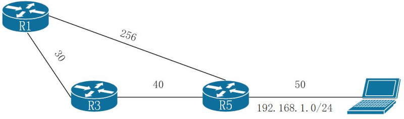
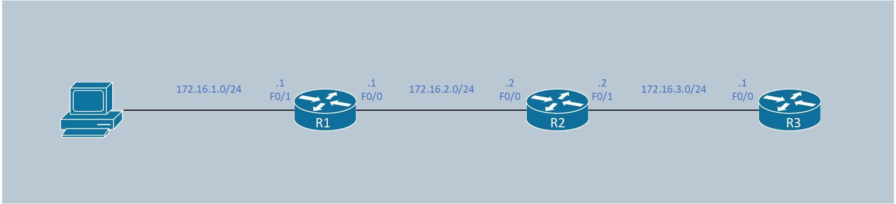

#### EIGRP(Enhanced Interior Gateway Routing Protocol)<br>
enhanced distance vector路由协议, 与distance vector使用hopcount作为metric计算规则作区分
<br>
<br>
<br>

图1<br>
<br>
##### 专业术语表
|Term      |Definition                                              |
|----------|--------------------------------------------------------|
|Successor route|到达目标子网最短路径的路由<br> 如: 从R1抵达192.168.1.0/24的successor route为R1 --> R3 --> R5|
|Successor|Successor route中, 起始路由器的下一跳.<br> 如: 从R1抵达192.168.1.0/24的successor为R3|
|Feasible distance(FD)|Successor route的总metric值.<br> 如: R1抵达192.168.1.0/24的FD为30+40+50=120|
|Reported distance(RD)|邻接路由器通告的, 到达指定子网的metric值.<br> 如: R1收到R5到达192.168.1.0/24的RD为50|
|Feasibility condition|路由器接收到的RD必须小于FD|
|Feasible successor|符合Feasibility condition条件的, 作为备用路由.<br> 如: 从R1视角, 50(R1从R5接收的RD) < 120(R1的FD), R1 --> R5为备用路由|

<br>
<br>
<br>

##### EIGRP packet类型
|Type      |Packet Name   |Function                       |
|----------|--------------|-------------------------------|
|1         |Hello         |发现neighbor和检测neighbor是否失效|
|2         |Request       |从neighbor处获取特定信息           |
|3         |Update        |传送路由和reachability信息          |
|4         |Query         |用于在收敛时发现其他路径       |
|5         |Reply         |响应Query的信息            |

** EIGRP使用RTP(Reliable Transport Protocol)保证按序转发packet, 并且确保接收者收到packet
<br>
<br>
<br>

##### EIGRP路由器成为neighbor的条件
1.K值一致<br>

2.子网匹配<br>

3.AS number匹配<br>

4.认证参数匹配
<br>
<br>
<br>

##### Metric计算类型
1.classic metric<br>
EIGRP classic metric计算方式, 只能在classic configuration mode下生效<br>
计算公式如下:<br>
$$Metric=256\times[(\frac{K_1\times10^7}{Bandwidth_{min}}+\frac{K_2\times\frac{10^7}{Bandwidth_{min}}}{256-Load}+\frac{K_3\times Total_{delay}}{10})\times\frac{K_5}{K_4+Reliability}]$$<br>

参数列表:<br>
$Bandwidth_{min}$代表路由上带宽最小的链路带宽, 单位为kbps<br>
$Load$代表接口的负载<br>
$Total_{delay}$代表路由上所有链路的累计delay, 单位为 $\mu s$<br>
$Reliability$代表接口可靠性<br>

系数:<br>
默认情况下<br>
$$K_1=1, K_2=0, K_3=1, K_4=0, K_5=0$$<br>
此时, metric公式简化为:<br>
$$Metric=256\times(\frac{K_1\times10^7}{Bandwidth_{min}}+\frac{K_3\times Total_{delay}}{10})$$<br>
** 当$K_5=0$时, 忽略以下部分:<br>
$$\frac{K_5}{K_4+Reliability}$$<br>
<br>
<br>

classic metric模式下的接口metric
|Interface Type|Link Speed(Kbps)|Delay$(\mu s)$|Metric|
|---|---:|---:|---:|
|Serial|64|20,000|40,512,000|
|T1|1544|20,000|2,170,031|
|Ethernet|10,000|1,000|281,600|
|FastEthernet|100,000|100|28,160|
|GigabitEthernet|1,000,000|10|2,816|
|10GigabitEthernet|10,000,000|10|512|

<br>
<br>

图2<br>
<br>
classic metric示例(参考图2):<br>
```
R1(config)# int f0/0
R1(config-if)# ip add 192.168.1.1 255.255.255.0
R1(config-if)# bandwidth 10000
R1(config-if)# delay 100
R1(config-if)# no shutdown
R1(config-if)# int f0/1
R1(config-if)# ip add 10.2.10.1 255.255.255.0
R1(config-if)# no shutdown
R1(config-if)# router eigrp 100
R1(config-router)# eigrp router-id 1.1.1.1
R1(config-router)# network 192.168.1.0 0.0.0.255
R1(config-router)# network 10.2.10.0 0.0.0.255

R2(config)# int f0/0
R2(config-if)# ip add 192.168.1.2 255.255.255.0
R2(config-if)# bandwidth 10000
R2(config-if)# delay 100
R2(config-if)# no shutdown
R2(config-if)# int f0/1
R2(config-if)# ip add 192.168.2.2 255.255.255.0
R2(config-if)# no shutdown
R2(config-if)# router eigrp 100
R2(config-router)# eigrp router-id 2.2.2.2
R2(config-router)# network 192.168.1.0 0.0.0.255
R2(config-router)# network 192.168.2.0 0.0.0.255

R3(config)# int f0/0
R3(config-if)# ip add 192.168.2.3 255.255.255.0
R3(config-if)# no shutdown
R3(config-if)# router eigrp 100
R3(config-router)# eigrp router-id 3.3.3.3
R3(config-router)# network 192.168.2.0 0.0.0.255


R1# show ip eigrp topology
P 10.2.10.0/24, 1 successors, FD is 28160
        via Connected, FastEthernet0/1

R2# show ip eigrp topology
P 10.2.10.0/24, 1 successors, FD is 284160
        via 192.168.1.1 (284160/28160), FastEthernet0/0

R3# show ip eigrp topology
P 10.2.10.0/24, 1 successors, FD is 286720
        via 192.168.2.2 (286720/284160), FastEthernet0/0
```
结果分析:<br>
R1到10.2.10.0/24子网的metric:<br>
$$metric=256\times[1\times\frac{10^7}{10^5}+\frac{1\times 100}{10}]=256\times(100+10)=28160$$<br>
R2到10.2.10.0/24子网的metric:<br>
$$metric=256\times[1\times\frac{10^7}{10^4}+\frac{1\times(100+1000)}{10}]=256\times(1000+110)=28416$$<br>
R3到10.2.10.0/24子网的metric:<br>
$$metric=256\times[1\times\frac{10^7}{10^4}+\frac{1\times(100+1000+100)}{10}]=256\times(1000+120)=286720$$
<br>
<br>

2.wide metric<br>
EIGRP wide metric计算方式, 只能在named configuration mode下生效<br>
计算公式如下:<br>
$$
Metric=65536*[(\frac{K_1*10^7}{Bandwidth_{min}}+\frac{K_2*\frac{10^7}{Bandwidth_{min}}}{256-Load}+\frac{K_3*Total_{delay}}{10^6}+K_6*Extended)*\frac{K_5}{K_4+Reliability}]
$$
<br>

参数列表:<br>
$Bandwidth_{min}$代表路由上带宽最小的链路带宽, 单位为kbps<br>
$Load$代表接口的负载<br>
$Total_{delay}$代表路由上所有链路的累计delay, 单位为 $ps$<br>
$Extended$代表jitter/energy等拓展属性<br>
$Reliability$代表接口可靠性<br>

系数:<br>
默认情况下
$$
K_1=1, K_2=0, K_3=1, K_4=0, K_5=0, K_6=0
$$
此时, metric公式简化为:
$$
Metric=65536*(\frac{K_1*10^7}{Bandwidth_{min}}+\frac{K_3*Total_{delay}}{10^6})
$$
** 当$K_5=0$时, 忽略以下部分:
$$
\frac{K_5}{K_4+Reliability}
$$
<br>
<br>

wide metric模式下的接口metric
|Interface Type|Link Speed(Kbps)|Delay(ps)|
|---|---:|---:|
|Serial|64|$2*10^{10}$|
|T1|1544|$2*10^{10}$|
|Ethernet|10,000|$10^9$|
|FastEthernet|100,000|$10^8$|
|GigabitEthernet|1,000,000|$10^7$|
|beyond GigabitEthernet|>1,000,000|$10^{13}/bandwidth$|

<br>
<br>

wide metric示例(参考图2):<br>
```
R1(config)# int f0/0
R1(config-if)# ip add 192.168.1.1 255.255.255.0
R1(config-if)# bandwidth 10000
R1(config-if)# delay 100
R1(config-if)# no shutdown
R1(config-if)# int f0/1
R1(config-if)# ip add 10.2.10.1 255.255.255.0
R1(config-if)# no shutdown
R1(config-if)# router eigrp TEST
R1(config-router)# address-family ipv4 unicast autonomous-system 100
R1(config-router-af)# eigrp router-id 1.1.1.1
R1(config-router-af)# network 192.168.1.0 0.0.0.255
R1(config-router-af)# network 10.2.10.0 0.0.0.255

R2(config)# int f0/0
R2(config-if)# ip add 192.168.1.2 255.255.255.0
R2(config-if)# bandwidth 10000
R2(config-if)# delay 100
R2(config-if)# no shutdown
R2(config-if)# int f0/1
R2(config-if)# ip add 192.168.2.2 255.255.255.0
R2(config-if)# no shutdown
R2(config-if)# router eigrp TEST
R2(config-router)# address-family ipv4 unicast autonomous-system 100
R2(config-router-af)# eigrp router-id 2.2.2.2
R2(config-router-af)# network 192.168.1.0 0.0.0.255
R2(config-router-af)# network 192.168.2.0 0.0.0.255

R3(config)# int f0/0
R3(config-if)# ip add 192.168.2.3 255.255.255.0
R3(config-if)# no shutdown
R3(config-if)# router eigrp TEST
R3(config-router)# address-family ipv4 unicast autonomous-system 100
R3(config-router-af)# eigrp router-id 3.3.3.3
R3(config-router-af)# network 192.168.2.0 0.0.0.255


R1# show ip eigrp topology | section 10.2.10.0/24
P 10.2.10.0/24, 1 successors, FD is 13107200
        via Connected, FastEthernet0/1

R2# show ip eigrp topology | section 10.2.10.0/24
P 10.2.10.0/24, 1 successors, FD is 137625600
        via 192.168.1.1 (137625600/13107200), FastEthernet0/0

R3# show ip eigrp topology | section 10.2.10.0/24
P 10.2.10.0/24, 1 successors, FD is 144179200
        via 192.168.2.2 (144179200/137625600), FastEthernet0/0
```
结果分析:<br>
R1到10.2.10.0/24子网的metric:<br>
$$
metric=65536*[1*\frac{10^7}{10^5}+\frac{1*10^8}{10^6}]=256*(100+100)=13107200
$$
R2到10.2.10.0/24子网的metric:<br>
$$
metric=65536*[1*\frac{10^7}{10^4}+\frac{1*(10^8+10^9)}{10^6}]=256*(1000+1100)=137625600
$$
R3到10.2.10.0/24子网的metric:<br>
$$
metric=256*[1*\frac{10^7}{10^4}+\frac{1*(10^8+10^9+10^8)}{10^6}]=256*(1000+1200)=144179200
$$
<br>
<br>

BandWidth/Delay属性<br>
```
修改BandWidth值
(config-if)# bandwidth <value>

修改Delay值
(config-if)# delay <value>

查看BandWidth和Delay值
# show int <interface_id> | include DLY
```
<br>
<br>
<br>

配置EIGRP<br>
1.classic mode<br>
1)配置eigrp process<br>
`(config)# router eigrp <as_number>`<br>

2)配置router id<br>
`(config-router)# eigrp router-id <router_id>`<br>

3)将接口配置eigrp<br>
`(config-router)# network <subnet_id> <wildcard_mask>`

*4)设置k值<br>
`(config-router)# metric weights <TOS> <k1> <k2> <k3> <k4> <k5>`
<br>
<br>

2.named mode<br>
1)配置eigrp process<br>
`(config)# router eigrp <process_name>`<br>

2)指定IPv4/IPv4协议簇<br>
`(config-router)# address-family {ipv4 | ipv6} {unicast | vrf <vrf_name>} autonomous-system <as_number>`<br>

3)配置router id<br>
`(config-router-af)# eigrp router-id <router_id>`<br>

4)将接口配置eigrp<br>
`(config-router-af)# network <subnet_id> <wildcard_mask>`<br>

*5)设置k值<br>
`(config-router-af)# metric weights <TOS> <k1> <k2> <k3> <k4> <k5> <k6>`
<br>
<br>
<br>

显示配置EIGRP的接口<br>
```
# show ip eigrp interfaces [detail] [<interface_id>]
Field                    Description
Interface                运行EIGRP的接口
Peers                    当前接口检测到的EIGRP邻居
Xmit Queue Un/Reliable   发送队列中的Unreliable和Reliable消息数量
Mean SRTT                消息往返的平均时间, 单位为ms
Pacing Time Un/Reliable  Unreliable和Reliable消息的发送间隔时间
```
<br>
<br>
<br>

查看接口的EIGRP邻居<br>
```
# show ip eigrp neighbors [<interface_id>]
Field                    Description
Address                  EIGRP邻居的IP地址
Interface                与该邻居连接的本地接口
Hold                     本地holdtime-上次从邻居接收hello packet的时间间隔
Uptime                   EIGRP邻居关系维持时间
SRTT                     消息往返的平平均时间, 单位为ms
RTO                      等待ACK的时间, 超过该时间后重新发送
Q Cnt                    在队列中等待发送的包(update/query/reply)
Seq Num                  邻居上次发送过来的packet的序列号(hello包不在计算范围)
```
<br>
<br>
<br>

packet传输记录<br>
`# debug eigrp packets`
<br>
<br>
<br>

图3<br>
<br>
实例配置
```
R1(config)# int f0/0
R1(config-if)# ip address 172.16.2.1 255.255.255.0
R1(config-if)# no shutdown
R1(config-if)# int f0/1
R1(config-if)# ip address 172.16.1.1 255.255.255.0
R1(config-if)# no shutdown
R1(config)# router eigrp 1
R1(config-router)# network 172.16.1.0 0.0.0.255
R1(config-router)# network 172.16.2.0 0.0.0.255

R2(config)# int f0/0
R2(config-if)# ip address 172.16.2.2 255.255.255.0
R2(config-if)# no shutdown
R2(config-if)# int f0/1
R2(config-if)# ip address 172.16.3.2 255.255.255.0
R2(config-if)# no shutdown
R2(config)# router eigrp 1
R2(config-router)# network 172.16.2.0 0.0.0.255
R2(config-router)# network 172.16.3.0 0.0.0.255

R3(config)# int f0/0
R3(config-if)# ip address 172.16.3.1 255.255.255.0
R3(config-if)# no shutdown
R3(config)# router eigrp 1
R3(config-router)# network 172.16.3.0 0.0.0.255


查看R1的EIGRP拓扑表
R1#show ip eigrp topology [all-links]                                                     
IP-EIGRP Topology Table for AS(1)/ID(172.16.1.1)                               
                                                                               
Codes: P - Passive, A - Active, U - Update, Q - Query, R - Reply,              
       r - reply Status, s - sia Status                                        
                                                                               
P 172.16.1.0/24, 1 successors, FD is 28160                                     
        via Connected, FastEthernet0/1

** 展示拓扑表的successor和feasible successor, 指定all-links则包括不满足feasibility condition的路由
** 状态代码
P - 已计算出最佳路径(ready)
A - 正在计算最佳路径(not ready)


查看R3的EIGRP路由
R3#show ip route
Gateway of last resort is not set

D       172.16.1.0 [90/33280] via 172.16.3.2, 00:08:23, FastEthernet0/0
```
<br>
<br>
<br>

EIGRP特性<br>
1.passive interface<br>
不发送和执行Hello packet, 不与邻接路由器组成neighbor<br>

配置passive interface
```
classic mode:
# 配置单个接口为passive
(config)# router eigrp <as_number>
(config-router)# passive-interface <interface_id>

# 配置AS内所有接口默认为passive, 并且配置单个接口为非passive
(config)# router eigrp <as_number>
(config-router)# passive-interface default
(config-router)# no passive-interface <interface_id>


named mode:
# 配置单个接口为passive
(config)# router eigrp <process_name>
(config-router)# address-family ipv4 unicast autonomous-system <as_number>
(config-router-af)# af-interface <interface_id>
(config-router-af-interface)# passive-interface

# 配置AS内所有接口默认为passive, 并且配置单个接口为非passive
(config)# router eigrp <process_name>
(config-router)# address-family ipv4 unicast autonomous-system <as_number>
(config-router-af)# af-interface default
(config-router-af-interface)# passive-interface
(config-router-af-interface)# exit-af-interface
(config-router-af)# af-interface <interface_id>
(config-router-af-interface)# no passive-interface
```
<br>
<br>
<br>

2.Authentication<br>
在认证的前提下成为neighbor, 防止恶意添加路由<br>

配置认证
```
1)配置keychain
(config)# key chain <keychain_name>
(config-keychain)# key <key_number>
(config-keychain-key)# key-string <passwd>

2)配置authentication接口
i.classic mode
(config-if)# ip authentication key-chain eigrp <as_number> <keychain_name>
(config-if)# ip authentication mode eigrp <as_number> md5

ii.named mode
(config-router-af-interface)# authentication key-chain <keychain_name>
(config-router-af-interface)# authentication mode {md5 | hmac-sha-256 <passwd>}


显示key chain
# show key chain

** 可通过以下查看接口是否配置认证
# show ip eigrp interface detail
```
<br>
<br>
<br>

查看EIGRP的K值和passive接口<br>
`# show ip protocols`
