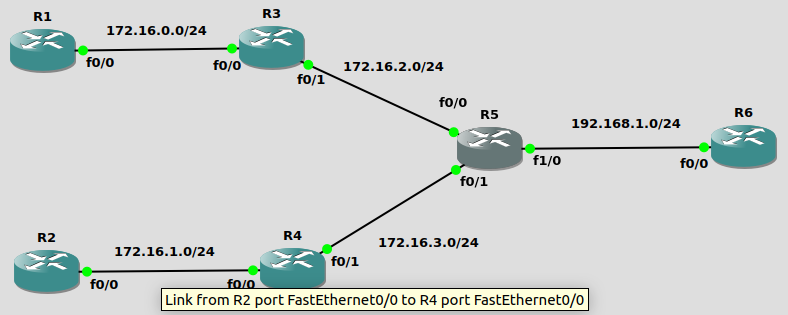
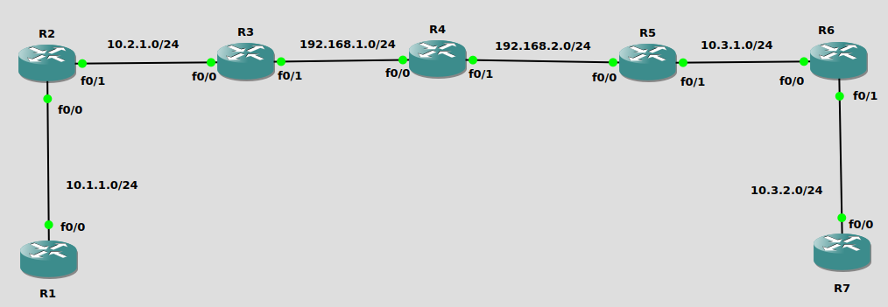
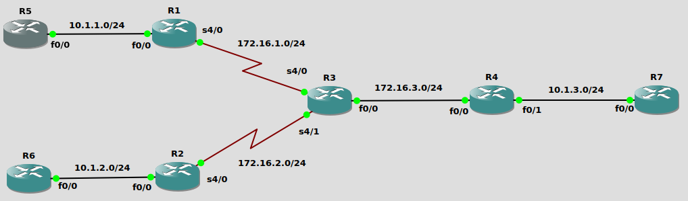
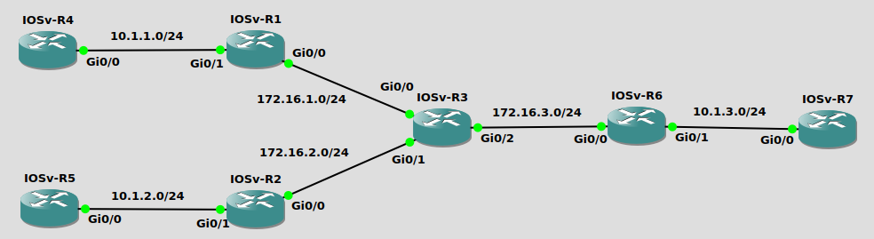
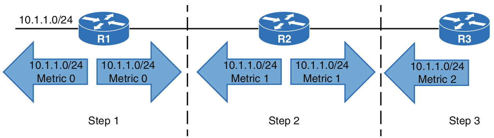
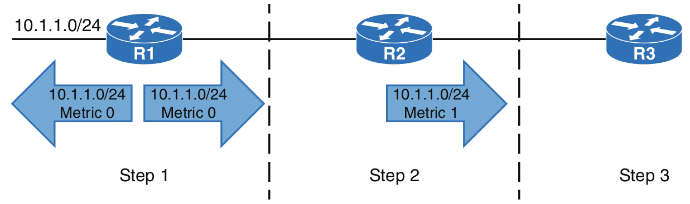
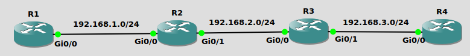

#### EIGRP(Enhanced Interior Gateway Routing Protocol)<br>
enhanced distance vector路由协议, 与distance vector使用hopcount作为metric计算规则作区分
<br>
<br>
<br>

图1<br>
<br>
##### 专业术语表
|Term      |Definition                                              |
|----------|--------------------------------------------------------|
|Successor route|到达目标子网最短路径的路由<br> 如: 从R1抵达192.168.1.0/24的successor route为R1 --> R3 --> R5|
|Successor|Successor route中, 起始路由器的下一跳.<br> 如: 从R1抵达192.168.1.0/24的successor为R3|
|Feasible distance(FD)|抵达目标子网的总metric值.<br> 如: R1抵达192.168.1.0/24的FD为30+40+50=120|
|Reported distance(RD)|邻接路由器通告的, 到达指定子网的metric值.<br> 如: R1收到R5到达192.168.1.0/24的RD为50|
|Feasibility condition|路由器接收到的RD必须小于FD|
|Feasible successor|符合Feasibility condition条件的, 作为备用路由.<br> 如: 从R1视角, 50(R1从R5接收的RD) < 120(R1的FD), R1 --> R5为备用路由|

<br>
<br>
<br>

##### EIGRP packet类型
|Type      |Packet Name   |Function                       |
|----------|--------------|-------------------------------|
|1         |Hello         |发现neighbor和检测neighbor是否失效|
|2         |Request       |从neighbor处获取特定信息           |
|3         |Update        |传送路由和reachability信息          |
|4         |Query         |用于在收敛时发现其他路径       |
|5         |Reply         |响应Query的信息            |

** EIGRP使用RTP(Reliable Transport Protocol)保证按序转发packet, 并且确保接收者收到packet
<br>
<br>
<br>

##### EIGRP路由器成为neighbor的条件
1.K值一致<br>

2.子网匹配<br>

3.AS number匹配<br>

4.认证参数匹配
<br>
<br>
<br>

##### Metric计算类型
1.classic metric<br>
EIGRP classic metric计算方式, 只能在classic configuration mode下生效<br>
计算公式如下:<br>
$$Metric=256\times[(\frac{K_1\times10^7}{Bandwidth_{min}}+\frac{K_2\times\frac{10^7}{Bandwidth_{min}}}{256-Load}+\frac{K_3\times Total_{delay}}{10})\times\frac{K_5}{K_4+Reliability}]$$
<br>

参数列表:<br>
$Bandwidth_{min}$代表路由上带宽最小的链路带宽, 单位为kbps<br>
$Load$代表接口的负载. 如: 1/255即为1<br>
$Total_{delay}$代表路由上所有链路的累计delay, 单位为 $\mu s$<br>
$Reliability$代表接口可靠性. 如: 120/255即为120
<br>
<br>

系数:<br>
默认情况下<br>
$$K_1=1, K_2=0, K_3=1, K_4=0, K_5=0$$
此时, metric公式简化为:<br>
$$Metric=256\times(\frac{K_1\times10^7}{Bandwidth_{min}}+\frac{K_3\times Total_{delay}}{10})$$
<br>
<br>

classic metric模式下的接口metric
|Interface Type|Link Speed(Kbps)|Delay$(\mu s)$|Metric|
|---|---:|---:|---:|
|Serial|64|20,000|40,512,000|
|T1|1544|20,000|2,170,031|
|Ethernet|10,000|1,000|281,600|
|FastEthernet|100,000|100|28,160|
|GigabitEthernet|1,000,000|10|2,816|
|10GigabitEthernet|10,000,000|10|512|

<br>
<br>

图2<br>
<br>
classic metric示例(参考图2):<br>
```
R1(config)# int f0/0
R1(config-if)# ip add 192.168.1.1 255.255.255.0
R1(config-if)# bandwidth 10000
R1(config-if)# delay 100
R1(config-if)# no shutdown
R1(config-if)# int f0/1
R1(config-if)# ip add 10.2.10.1 255.255.255.0
R1(config-if)# no shutdown
R1(config-if)# router eigrp 100
R1(config-router)# eigrp router-id 1.1.1.1
R1(config-router)# network 192.168.1.0 0.0.0.255
R1(config-router)# network 10.2.10.0 0.0.0.255

R2(config)# int f0/0
R2(config-if)# ip add 192.168.1.2 255.255.255.0
R2(config-if)# bandwidth 10000
R2(config-if)# delay 100
R2(config-if)# no shutdown
R2(config-if)# int f0/1
R2(config-if)# ip add 192.168.2.2 255.255.255.0
R2(config-if)# no shutdown
R2(config-if)# router eigrp 100
R2(config-router)# eigrp router-id 2.2.2.2
R2(config-router)# network 192.168.1.0 0.0.0.255
R2(config-router)# network 192.168.2.0 0.0.0.255

R3(config)# int f0/0
R3(config-if)# ip add 192.168.2.3 255.255.255.0
R3(config-if)# no shutdown
R3(config-if)# router eigrp 100
R3(config-router)# eigrp router-id 3.3.3.3
R3(config-router)# network 192.168.2.0 0.0.0.255


R1# show ip eigrp topology
P 10.2.10.0/24, 1 successors, FD is 28160
        via Connected, FastEthernet0/1

R2# show ip eigrp topology
P 10.2.10.0/24, 1 successors, FD is 284160
        via 192.168.1.1 (284160/28160), FastEthernet0/0

R3# show ip eigrp topology
P 10.2.10.0/24, 1 successors, FD is 286720
        via 192.168.2.2 (286720/284160), FastEthernet0/0
```
结果分析:<br>
R1到10.2.10.0/24子网的metric:<br>
$$metric=256\times[1\times\frac{10^7}{10^5}+\frac{1\times 100}{10}]=256\times(100+10)=28160$$
R2到10.2.10.0/24子网的metric:<br>
$$metric=256\times[1\times\frac{10^7}{10^4}+\frac{1\times(100+1000)}{10}]=256\times(1000+110)=28416$$
R3到10.2.10.0/24子网的metric:<br>
$$metric=256\times[1\times\frac{10^7}{10^4}+\frac{1\times(100+1000+100)}{10}]=256\times(1000+120)=286720$$
<br>
<br>

2.wide metric<br>
EIGRP wide metric计算方式, 只能在named configuration mode下生效<br>
计算公式如下:<br>
$$Metric=65536\times[(\frac{K_1\times 10^7}{Bandwidth_{min}}+\frac{K_2\times\frac{10^7}{Bandwidth_{min}}}{256-Load}+\frac{K_3\times Total_{delay}}{10^6}+K_6\times Extended)\times\frac{K_5}{K_4+Reliability}]$$
<br>

参数列表:<br>
$Bandwidth_{min}$代表路由上带宽最小的链路带宽, 单位为kbps<br>
$Load$代表接口的负载. 如: 1/255即为1<br>
$Total_{delay}$代表路由上所有链路的累计delay, 单位为 $ps$<br>
$Extended$代表jitter/energy等拓展属性<br>
$Reliability$代表接口可靠性. 如: 120/255即为120
<br>
<br>

系数:<br>
默认情况下<br>
$$K_1=1, K_2=0, K_3=1, K_4=0, K_5=0, K_6=0$$
此时, metric公式简化为:<br>
$$Metric=65536\times(\frac{K_1\times 10^7}{Bandwidth_{min}}+\frac{K_3\times Total_{delay}}{10^6})$$
<br>
<br>

wide metric模式下的接口metric
|Interface Type|Link Speed(Kbps)|Delay(ps)|
|---|---:|---:|
|Serial|64|$2*10^{10}$|
|T1|1544|$2*10^{10}$|
|Ethernet|10,000|$10^9$|
|FastEthernet|100,000|$10^8$|
|GigabitEthernet|1,000,000|$10^7$|
|beyond GigabitEthernet|>1,000,000|$10^{13}/bandwidth$|

<br>
<br>

wide metric示例(参考图2):<br>
```
R1(config)# int f0/0
R1(config-if)# ip add 192.168.1.1 255.255.255.0
R1(config-if)# bandwidth 10000
R1(config-if)# delay 100
R1(config-if)# no shutdown
R1(config-if)# int f0/1
R1(config-if)# ip add 10.2.10.1 255.255.255.0
R1(config-if)# no shutdown
R1(config-if)# router eigrp TEST
R1(config-router)# address-family ipv4 unicast autonomous-system 100
R1(config-router-af)# eigrp router-id 1.1.1.1
R1(config-router-af)# network 192.168.1.0 0.0.0.255
R1(config-router-af)# network 10.2.10.0 0.0.0.255

R2(config)# int f0/0
R2(config-if)# ip add 192.168.1.2 255.255.255.0
R2(config-if)# bandwidth 10000
R2(config-if)# delay 100
R2(config-if)# no shutdown
R2(config-if)# int f0/1
R2(config-if)# ip add 192.168.2.2 255.255.255.0
R2(config-if)# no shutdown
R2(config-if)# router eigrp TEST
R2(config-router)# address-family ipv4 unicast autonomous-system 100
R2(config-router-af)# eigrp router-id 2.2.2.2
R2(config-router-af)# network 192.168.1.0 0.0.0.255
R2(config-router-af)# network 192.168.2.0 0.0.0.255

R3(config)# int f0/0
R3(config-if)# ip add 192.168.2.3 255.255.255.0
R3(config-if)# no shutdown
R3(config-if)# router eigrp TEST
R3(config-router)# address-family ipv4 unicast autonomous-system 100
R3(config-router-af)# eigrp router-id 3.3.3.3
R3(config-router-af)# network 192.168.2.0 0.0.0.255


R1# show ip eigrp topology | section 10.2.10.0/24
P 10.2.10.0/24, 1 successors, FD is 13107200
        via Connected, FastEthernet0/1

R2# show ip eigrp topology | section 10.2.10.0/24
P 10.2.10.0/24, 1 successors, FD is 137625600
        via 192.168.1.1 (137625600/13107200), FastEthernet0/0

R3# show ip eigrp topology | section 10.2.10.0/24
P 10.2.10.0/24, 1 successors, FD is 144179200
        via 192.168.2.2 (144179200/137625600), FastEthernet0/0
```
结果分析:<br>
R1到10.2.10.0/24子网的metric:<br>
$$metric=65536\times[1\times\frac{10^7}{10^5}+\frac{1\times 10^8}{10^6}]=65536\times(100+100)=13107200$$
R2到10.2.10.0/24子网的metric:<br>
$$metric=65536\times[1\times\frac{10^7}{10^4}+\frac{1\times(10^8+10^9)}{10^6}]=65536\times(1000+1100)=137625600$$
R3到10.2.10.0/24子网的metric:<br>
$$metric=65536\times[1\times\frac{10^7}{10^4}+\frac{1\times(10^8+10^9+10^8)}{10^6}]=65536\times(1000+1200)=144179200$$
<br>
<br>

BandWidth/Delay属性<br>
```
修改BandWidth值
(config-if)# bandwidth <value>

修改Delay值
(config-if)# delay <value>

查看BandWidth和Delay值
# show int <interface_id> | include DLY
```
<br>
<br>
<br>

配置EIGRP<br>
1.classic mode<br>
1)配置eigrp process<br>
`(config)# router eigrp <as_number>`<br>

2)配置router id<br>
`(config-router)# eigrp router-id <router_id>`<br>

3)将接口配置eigrp<br>
`(config-router)# network <subnet_id> <wildcard_mask>`

*4)设置k值<br>
`(config-router)# metric weights <TOS> <k1> <k2> <k3> <k4> <k5>`
<br>
<br>

2.named mode<br>
1)配置eigrp process<br>
`(config)# router eigrp <process_name>`<br>

2)指定IPv4协议簇<br>
`(config-router)# address-family ipv4 [unicast | multicast] [vrf <vrf_name>] autonomous-system <as_number>`<br>

3)配置router id<br>
`(config-router-af)# eigrp router-id <router_id>`<br>

4)将接口配置eigrp<br>
`(config-router-af)# network <subnet_id> <wildcard_mask>`<br>

*5)设置k值<br>
`(config-router-af)# metric weights <TOS> <k1> <k2> <k3> <k4> <k5> <k6>`
<br>
<br>
<br>

显示配置EIGRP的接口<br>
```
# show ip eigrp interfaces [detail] [<interface_id>]
Field                    Description
Interface                运行EIGRP的接口
Peers                    当前接口检测到的EIGRP邻居
Xmit Queue Un/Reliable   发送队列中的Unreliable和Reliable消息数量
Mean SRTT                消息往返的平均时间, 单位为ms
Pacing Time Un/Reliable  Unreliable和Reliable消息的发送间隔时间
```
<br>
<br>
<br>

查看接口的EIGRP邻居<br>
```
# show ip eigrp neighbors [<interface_id>]
Field                    Description
Address                  EIGRP邻居的IP地址
Interface                与该邻居连接的本地接口
Hold                     本地holdtime-上次从邻居接收hello packet的时间间隔
Uptime                   EIGRP邻居关系维持时间
SRTT                     消息往返的平平均时间, 单位为ms
RTO                      等待ACK的时间, 超过该时间后重新发送
Q Cnt                    在队列中等待发送的包(update/query/reply)
Seq Num                  邻居上次发送过来的packet的序列号(hello包不在计算范围)
```
<br>
<br>
<br>

packet传输记录<br>
`# debug eigrp packets`
<br>
<br>
<br>

图3<br>
<br>
实例配置
```
R1(config)# int f0/0
R1(config-if)# ip address 172.16.2.1 255.255.255.0
R1(config-if)# no shutdown
R1(config-if)# int f0/1
R1(config-if)# ip address 172.16.1.1 255.255.255.0
R1(config-if)# no shutdown
R1(config)# router eigrp 1
R1(config-router)# network 172.16.1.0 0.0.0.255
R1(config-router)# network 172.16.2.0 0.0.0.255

R2(config)# int f0/0
R2(config-if)# ip address 172.16.2.2 255.255.255.0
R2(config-if)# no shutdown
R2(config-if)# int f0/1
R2(config-if)# ip address 172.16.3.2 255.255.255.0
R2(config-if)# no shutdown
R2(config)# router eigrp 1
R2(config-router)# network 172.16.2.0 0.0.0.255
R2(config-router)# network 172.16.3.0 0.0.0.255

R3(config)# int f0/0
R3(config-if)# ip address 172.16.3.1 255.255.255.0
R3(config-if)# no shutdown
R3(config)# router eigrp 1
R3(config-router)# network 172.16.3.0 0.0.0.255


查看R1的EIGRP拓扑表
R1#show ip eigrp topology [all-links]                                                     
IP-EIGRP Topology Table for AS(1)/ID(172.16.1.1)                               
                                                                               
Codes: P - Passive, A - Active, U - Update, Q - Query, R - Reply,              
       r - reply Status, s - sia Status                                        
                                                                               
P 172.16.1.0/24, 1 successors, FD is 28160                                     
        via Connected, FastEthernet0/1

** 展示拓扑表的successor和feasible successor, 指定all-links则包括不满足feasibility condition的路由
** 状态代码
    P - 已计算出最佳路径(ready)
    A - 正在计算最佳路径(not ready)


查看R3的EIGRP路由
R3#show ip route
Gateway of last resort is not set

D       172.16.1.0 [90/33280] via 172.16.3.2, 00:08:23, FastEthernet0/0
```
<br>
<br>
<br>

EIGRP Timer<br>
1)Hello Timer<br>
发送Hello包的间隔时间, 默认为5s<br>

Hold Time<br>
等待neighbor的Hello包的时间, 如果超过该时间未接收到neighbor的Hello包, 则与neighbor断开, 默认为15s<br>

classic mode配置:
```
(config)# interface <interface_id>
(config-if)# ip hello-interval eigrp <as_number> <seconds>
(config-if)# ip hold-time eigrp <as_number> <second>
```

named mode配置:
```
(config)# router eigrp <process_name>
(config-router)# address-family ipv4 unicast autonomous-system <as_number>
(config-router-af)# af-interface <interface_id>
(config-router-af-interface)# hello-interval <seconds>
(config-router-af-interface)# hello-time <seconds>
```
<br>

2)Active Timer<br>
当源路由器发出Query, 如果超出该时间为收到Reply, 则认定目标路由器SIA(Stack In Active), 默认为180s<br>
细化: 当源路由器发出Query, 如果超出该定时器的1/2时间未收到Reply, 则再发出SIA Query, 如果剩余定时器的1/2时间未收到SIA Reply, 则认定目标路由器SIA<br>

classic mode配置:
```
(config)# router eigrp <as_number>
(config-router)# timers active-time {<minutes> | disabled}
```

named mode配置:
```
(config)# router eigrp <process_name>
(config-router)# address-family ipv4 unicast autonomous-system <as_number>
(config-router-af)# topology base
(config-router-af-topology)# timers active-time {<minutes> | disabled}
```
<br>
<br>
<br>

EIGRP特性<br>
1.Passive Interface<br>
不发送和执行Hello packet, 不与邻接路由器组成neighbor<br>

配置passive interface
```
classic mode:
# 配置单个接口为passive
(config)# router eigrp <as_number>
(config-router)# passive-interface <interface_id>

# 配置AS内所有接口默认为passive, 并且配置单个接口为非passive
(config)# router eigrp <as_number>
(config-router)# passive-interface default
(config-router)# no passive-interface <interface_id>


named mode:
# 配置单个接口为passive
(config)# router eigrp <process_name>
(config-router)# address-family ipv4 unicast autonomous-system <as_number>
(config-router-af)# af-interface <interface_id>
(config-router-af-interface)# passive-interface

# 配置AS内所有接口默认为passive, 并且配置单个接口为非passive
(config)# router eigrp <process_name>
(config-router)# address-family ipv4 unicast autonomous-system <as_number>
(config-router-af)# af-interface default
(config-router-af-interface)# passive-interface
(config-router-af-interface)# exit-af-interface
(config-router-af)# af-interface <interface_id>
(config-router-af-interface)# no passive-interface
```
<br>

查看EIGRP的进程内容(包含K值/passive接口/Active Timer等)<br>
`# show ip protocols`
<br>
<br>
<br>

2.Authentication<br>
在认证的前提下成为neighbor, 防止恶意添加路由<br>

配置认证
```
1)配置keychain
(config)# key chain <keychain_name>
(config-keychain)# key <key_number>
(config-keychain-key)# key-string <passwd>

2)配置authentication接口
classic mode:
(config-if)# ip authentication key-chain eigrp <as_number> <keychain_name>
(config-if)# ip authentication mode eigrp <as_number> md5

named mode:
(config-router-af-interface)# authentication key-chain <keychain_name>
(config-router-af-interface)# authentication mode {md5 | hmac-sha-256 <passwd>}


显示key chain
# show key chain

** 可通过以下查看接口是否配置认证
# show ip eigrp interface detail
```
<br>
<br>
<br>

3.Load Balancing<br>
1)Equal-Cost MultiPathing(ECMP)<br>
EIGRP允许多个相同metric的路由, 加入路由表. 可加入数量默认为4个, 允许配置数量[1,16]<br>

classic mode配置方法:<br>
```
(config)# router eigrp <as_number>
(config-router)# maximum-paths <num>
```
<br>

named mode配置方法:<br>
```
(config)# router eigrp <process_name>
(config-router)# address-family ipv4 unicast autonomous-system <as_number>
(config-router-af)# topology base
(config-router-af-topology)# maximum-paths <num>
```
<br>
<br>

2)Unequal-Cost MultiPathing<br>
当Feasible Successor满足下列条件时, 也加入路由表:<br>
$$\frac{Feasible Successor FD}{Successor Route FD}\leq Variance\ Multiplier$$
并且也同时被maximum-paths限制<br>
Unequal-Cost MultiPathing也被Feasibility condition限制<br>

classic mode配置方法:<br>
```
(config)# router eigrp <as_number>
(config-router)# variance <value>
```
<br>

named mode配置方法:<br>
```
(config)# router eigrp <process_name>
(config-router)# address-family ipv4 unicast autonomous-system <as_number>
(config-router-af)# topology base
(config-router-af-topology)# variance <value>
```
<br>
<br>

4.Route Summarization<br>
从接口出口方向, 通告该接口的neighbor, 当前路由器其他某几个接口的路由汇总<br>
汇总路由的metric, 使用汇总前各个prefix之中的最小metric值<br>

classic mode配置路由汇总<br>
```
(config)# interface <interface_id>
(config-if)# ip summary-address eigrp <as_number> <sum_subnet_id>/<sum_prefix>
```
<br>

named mode配置路由汇总<br>
```
(config)# router eigrp <process_name>
(config-router)# address-family ipv4 unicast autonomous-system <as_number>
(config-router-af)# af-interface <interface_id>
(config-router-af-interface)# summary-address <sum_sunbet_id>/<sum_prefix>
```
<br>

classic mode配置metric属性<br>
```
(config)# router eigrp <as_number>
(config-router)# summary-metric <sum_subnet_id>/<sum_prefix> <min_bandwidth> <totle_delay> <reliability> <load> <MTU>
```
<br>

named mode配置metric属性<br>
```
(config)# router eigrp <process_name>
(config-router)# address-family ipv4 unicast autonomous-system <as_number>
(config-router-af)# topology base
(config-router-af-topology)# summary-metric <sum_subnet_id>/<sum_prefix> <min_bandwidth> <totle_delay> <reliability> <load> <MTU>
```
<br>

图4<br>
<br>
```
汇总前:
R5(config)# interface f0/0
R5(config-if)# bandwidth 10000

R6# show ip route eigrp | begin Gateway
Gateway of last resort is not set

      172.16.0.0/24 is subnetted, 4 subnets
D        172.16.0.0 [90/263680] via 192.168.1.5, 00:00:20, FastEthernet0/0
D        172.16.1.0 [90/33280] via 192.168.1.5, 00:00:20, FastEthernet0/0
D        172.16.2.0 [90/261120] via 192.168.1.5, 00:00:20, FastEthernet0/0
D        172.16.3.0 [90/30720] via 192.168.1.5, 00:00:20, FastEthernet0/0


汇总后:
R5(config)# int f1/0
R5(config-if)# ip summary-address eigrp 100 172.16.0.0/22

R6# show ip route eigrp | begin Gateway
Gateway of last resort is not set

      172.16.0.0/22 is subnetted, 1 subnets
D        172.16.0.0 [90/30720] via 192.168.1.5, 00:00:11, FastEthernet0/0
```
<br>
<br>

5.Automatic Summarization<br>
当路由器开启自动汇总功能, 路由器会在classful网络边界自动进行路由汇总<br>
release 15.0之前版本默认开启; release 15.0及之后版本默认不开启<br>

classic mode配置:
```
(config)# router eigrp <as_number>
(config-router)# auto-summary
```
<br>

named mode配置:
```
(config)# router eigrp <process_name>
(config-router)# address-family ipv4 unicast autonomous-system <as_number>
(config-router-af)# topology base
(config-router-af-topology)# auto-summary
```
<br>

图5
<br>
示例(如图5)
```
在R3与R5上开启自动汇总
R3(config)# router eigrp 100
R3(config-router)# auto-summary

R5(config)# router eigrp 100
R5(config-router)# auto-summary


R4# show ip route topologys | begin Gateway
Gateway of last resort is not set

D     10.0.0.0/8 [90/30720] via 192.168.2.5, 00:00:13, FastEthernet0/1
                 [90/30720] via 192.168.1.3, 00:00:13, FastEthernet0/0
```
<br>
<br>

6.Stub Router<br>
默认情况下, 该种类路由器只通告connected和summary路由<br>

classic mode配置:
```
(config)# router eigrp <as_number>
(config-router)# eigrp stub [connected | receive-only | redistributed | static | summary]...
```
<br>

named mode配置:
```
(config)# router eigrp <process_name>
(config-router)# address-family ipv4 unicast autonomous-system <as_number>
(config-router-af)# eigrp stub [connected | receive-only | redistributed | static | summary]...
```
<br>

图6<br>
<br>
示例(如图6)
```
R3配置stub router之前
R1# show ip route eigrp | begin Gateway
Gateway of last resort is not set

      10.0.0.0/8 is variably subnetted, 4 subnets, 2 masks
D        10.1.2.0/24 [90/2684416] via 172.16.1.3, 00:02:20, Serial4/0
D        10.1.3.0/24 [90/2174976] via 172.16.1.3, 00:01:17, Serial4/0
      172.16.0.0/16 is variably subnetted, 4 subnets, 2 masks
D        172.16.2.0/24 [90/2681856] via 172.16.1.3, 00:02:20, Serial4/0
D        172.16.3.0/24 [90/2172416] via 172.16.1.3, 00:02:03, Serial4/0

R2# show ip route eigrp | begin Gateway
Gateway of last resort is not set

      10.0.0.0/8 is variably subnetted, 4 subnets, 2 masks
D        10.1.1.0/24 [90/2684416] via 172.16.2.3, 00:03:07, Serial4/0
D        10.1.3.0/24 [90/2174976] via 172.16.2.3, 00:02:04, Serial4/0
      172.16.0.0/16 is variably subnetted, 4 subnets, 2 masks
D        172.16.1.0/24 [90/2681856] via 172.16.2.3, 00:03:07, Serial4/0
D        172.16.3.0/24 [90/2172416] via 172.16.2.3, 00:02:50, Serial4/0

R4# show ip route eigrp | begin Gateway
Gateway of last resort is not set

      10.0.0.0/8 is variably subnetted, 4 subnets, 2 masks
D        10.1.1.0/24 [90/2174976] via 172.16.3.3, 00:00:01, FastEthernet0/0
D        10.1.2.0/24 [90/2174976] via 172.16.3.3, 00:00:01, FastEthernet0/0
      172.16.0.0/16 is variably subnetted, 4 subnets, 2 masks
D        172.16.1.0/24 [90/2172416] via 172.16.3.3, 00:00:01, FastEthernet0/0
D        172.16.2.0/24 [90/2172416] via 172.16.3.3, 00:00:01, FastEthernet0/0


R3配置stub router之后
R3(config)# router eigrp 100
R3(config-router)# eigrp stub

R1# show ip route eigrp | begin Gateway
Gateway of last resort is not set

      172.16.0.0/16 is variably subnetted, 4 subnets, 2 masks
D        172.16.2.0/24 [90/2681856] via 172.16.1.3, 00:00:04, Serial4/0
D        172.16.3.0/24 [90/2172416] via 172.16.1.3, 00:00:04, Serial4/0

R2# show ip route eigrp | begin Gateway
Gateway of last resort is not set

      172.16.0.0/16 is variably subnetted, 4 subnets, 2 masks
D        172.16.1.0/24 [90/2681856] via 172.16.2.3, 00:00:17, Serial4/0
D        172.16.3.0/24 [90/2172416] via 172.16.2.3, 00:00:17, Serial4/0

R4# show ip route eigrp | begin Gateway
Gateway of last resort is not set

      172.16.0.0/16 is variably subnetted, 4 subnets, 2 masks
D        172.16.1.0/24 [90/2172416] via 172.16.3.3, 00:05:50, FastEthernet0/0
D        172.16.2.0/24 [90/2172416] via 172.16.3.3, 00:05:50, FastEthernet0/0
```
<br>
<br>

7.Stub Site<br>
从wan interface接口接收的子网, 不允许向其他wan interface接口进行子网通告<br>
只能在named mode下配置<br>
Version 15.5(3)M release software and later support<br>

配置
```
(config)# router eigrp <process_name>
(config-router)# address-family ipv4 unicast autonomous-system <as_number>
(config-router-af)# eigrp stub-site <as_number>:<identifier>
(config-router-af)# af-interface <interface_id>
(config-router-af-interface)# stub-site wan-interface
```
<br>

图7<br>
<br>
示例(如图7)
```
配置stub site之前
R1# show ip route eigrp | begin Gateway
Gateway of last resort is not set

      10.0.0.0/8 is variably subnetted, 4 subnets, 2 masks
D        10.1.2.0/24 [90/20480] via 172.16.1.3, 00:02:37, GigabitEthernet0/0
D        10.1.3.0/24 [90/20480] via 172.16.1.3, 00:01:21, GigabitEthernet0/0
      172.16.0.0/16 is variably subnetted, 4 subnets, 2 masks
D        172.16.2.0/24 [90/15360] via 172.16.1.3, 00:02:37, GigabitEthernet0/0
D        172.16.3.0/24 [90/15360] via 172.16.1.3, 00:02:17, GigabitEthernet0/0

R2# show ip route eigrp | begin Gateway
Gateway of last resort is not set

      10.0.0.0/8 is variably subnetted, 4 subnets, 2 masks
D        10.1.1.0/24 [90/20480] via 172.16.2.3, 00:02:48, GigabitEthernet0/0
D        10.1.3.0/24 [90/20480] via 172.16.2.3, 00:01:32, GigabitEthernet0/0
      172.16.0.0/16 is variably subnetted, 4 subnets, 2 masks
D        172.16.1.0/24 [90/15360] via 172.16.2.3, 00:02:48, GigabitEthernet0/0
D        172.16.3.0/24 [90/15360] via 172.16.2.3, 00:02:28, GigabitEthernet0/0

R6# show ip route eigrp | begin Gateway
Gateway of last resort is not set

      10.0.0.0/8 is variably subnetted, 4 subnets, 2 masks
D        10.1.1.0/24 [90/20480] via 172.16.3.3, 00:01:48, GigabitEthernet0/0
D        10.1.2.0/24 [90/20480] via 172.16.3.3, 00:01:48, GigabitEthernet0/0
      172.16.0.0/16 is variably subnetted, 4 subnets, 2 masks
D        172.16.1.0/24 [90/15360] via 172.16.3.3, 00:01:48, GigabitEthernet0/0
D        172.16.2.0/24 [90/15360] via 172.16.3.3, 00:01:48, GigabitEthernet0/0


配置stub site之后
R3(config)# router eigrp TEST
R3(config-router)# address-family ipv4 unicast autonomous-system 100
R3(config-router-af)# eigrp stub-site 100:1
R3(config-router-af)# af-interface g0/0
R3(config-router-af-interface)# stub-site wan-interface
R3(config-router-af-interface)# af-interface g0/1
R3(config-router-af-interface)# stub-site wan-interface

R1# show ip route eigrp | begin Gateway
Gateway of last resort is not set

      10.0.0.0/8 is variably subnetted, 3 subnets, 2 masks
D        10.1.3.0/24 [90/20480] via 172.16.1.3, 00:00:33, GigabitEthernet0/0
      172.16.0.0/16 is variably subnetted, 4 subnets, 2 masks
D        172.16.2.0/24 [90/15360] via 172.16.1.3, 00:00:33, GigabitEthernet0/0
D        172.16.3.0/24 [90/15360] via 172.16.1.3, 00:00:33, GigabitEthernet0/0

R2# show ip route eigrp | begin Gateway
Gateway of last resort is not set

      10.0.0.0/8 is variably subnetted, 3 subnets, 2 masks
D        10.1.3.0/24 [90/20480] via 172.16.2.3, 00:00:49, GigabitEthernet0/0
      172.16.0.0/16 is variably subnetted, 4 subnets, 2 masks
D        172.16.1.0/24 [90/15360] via 172.16.2.3, 00:00:49, GigabitEthernet0/0
D        172.16.3.0/24 [90/15360] via 172.16.2.3, 00:00:49, GigabitEthernet0/0

R6# show ip route eigrp | begin Gateway
Gateway of last resort is not set

      10.0.0.0/8 is variably subnetted, 4 subnets, 2 masks
D        10.1.1.0/24 [90/20480] via 172.16.3.3, 00:01:07, GigabitEthernet0/0
D        10.1.2.0/24 [90/20480] via 172.16.3.3, 00:00:57, GigabitEthernet0/0
      172.16.0.0/16 is variably subnetted, 4 subnets, 2 masks
D        172.16.1.0/24 [90/15360] via 172.16.3.3, 00:06:14, GigabitEthernet0/0
D        172.16.2.0/24 [90/15360] via 172.16.3.3, 00:06:14, GigabitEthernet0/0
```
<br>
<br>

8.Bandwidth Percentage<br>
EIGRP只占用带宽的指定百分比, 从而保留充足带宽给予其他tranffic packet<br>

classic mode配置:
```
(config)# interface <interface_id>
(config-if)# ip bandwidth-percent eigrp <as_number> <percentage>
```
<br>

named mode配置:
```
(config)# router eigrp <process_name>
(config-router)# address-family ipv4 unicast autonomous-system <as_number>
(config-router-af)# af-interface <interface_id>
(config-router-af-interface)# bandwidth-percent <percentage>
```
<br>
<br>

9.Split Horizon<br>
防止通告信息, 在出去的方向往回进行通告<br>
EIGRP默认开启该特性<br>
在如下链路中需关闭: Frame Relay/Dynamic Multipoint Virtual Private Network(DMVPN)/Layer 2 Virtual Private Network(L2VPN)<br>

不开启时如下图<br>
<br>


开启时如下图<br>
<br>

classic mode配置(关闭split horizon):
```
(config)# interface <interface_id>
(config-if)# no ip split-horizon eigrp <as_number>
```
<br>

named mode配置(关闭split horizon):
```
(config)# router eigrp <process_name>
(config-router)# address-family ipv4 unicast autonomous-system <as_number>
(config-router-af)# af-interface <interface_id>
(config-router-af-interface)# no split-horizon
```
<br>
<br>

10.Route Filtering<br>
在入/出口处对目标流量进行过滤<br>

classic mode配置:
```
(config)# router eigrp <as_numebr>
(config-router)# distribute-list {<acl_num> | <acl_name> | prefix <prefix_list_name> | route-map <route_map_name> | gateway <prefix_list_name>} {in | out} [<interface_id>]
```
<br>

named mode配置:
```
(config)# router eigrp <process_name>
(config-router)# address-family ipv4 unicast autonomous-system <as_number>
(config-router-af)# topology base
(config-router-af-topology)# distribute-list {<acl_num> | <acl_name> | prefix <prefix_list_name> | route-map <route_map_name> | gateway <prefix_list_name>} {in | out} [<interface_id>]
```
<br>
<br>

11.Offset List<br>
用于在指定添加下修改path metric<br>
不能只用于connected子网<br>

公式如下:<br>
$$Metric=256\times(\frac{K_1\times10^7}{Bandwidth_{min}}+\frac{K_3\times Total_{delay}}{10})+offset$$
<br>

classic mode配置:
```
(config)# router eigrp <as_number>
(config-router)# offset-list {<acl_num> | <acl_name>} {in | out} <offset_value> [<interface_id>]
```
<br>

named mode配置:
```
(config)# router eigrp <process_name>
(config-router)# address-family ipv4 unicast autonomous-system <as_number>
(config-router-af)# topology base
(config-router-af-topology)# offset-list {<acl_num> | <acl_name>} {in | out} <offset_value> [<interface_id>]
```
<br>

图8<br>
<br>
示例(如图8)
```
设置offset list之前
R3# show ip route eigrp | begin Gateway
Gateway of last resort is not set

D     192.168.1.0/24 [90/3072] via 192.168.2.2, 00:00:01, GigabitEthernet0/0

R4#show ip route eigrp | begin Gateway
Gateway of last resort is not set

D     192.168.1.0/24 [90/3328] via 192.168.3.3, 00:04:33, GigabitEthernet0/0
D     192.168.2.0/24 [90/3072] via 192.168.3.3, 00:06:31, GigabitEthernet0/0


设置offset list之后
R3(config)# ip access-list standard SUB_R1_R2
R3(config-std-nacl)# permit 192.168.1.0
R3(config)# router eigrp 100
R3(config-router)# offset-list SUB_R1_R2 in 200

R3# show ip route eigrp | begin Gateway
Gateway of last resort is not set

D     192.168.1.0/24 [90/3272] via 192.168.2.2, 00:00:01, GigabitEthernet0/0

R4#show ip route eigrp | begin Gateway
Gateway of last resort is not set

D     192.168.1.0/24 [90/3528] via 192.168.3.3, 00:04:33, GigabitEthernet0/0
D     192.168.2.0/24 [90/3072] via 192.168.3.3, 00:06:31, GigabitEthernet0/0
```
<br>
<br>

邻接路由器无法成为neighbor的原因<br>
|Reason|command|
|---|---|
|Interface is down|(config-if)# shutdown<br> # show ip int brief|
|Mismatched autonomous system number|(config)# router eigrp <as_number><br> # show ip protocols|
|Incorrect network statement|(config-router)# network <subnet_id> <wildcard_mask><br> # show ip eigrp interfaces|
|Mismatched K value|(config-router)# metric weights 0 <k1> <k2> <k3> <k4> <k5><br> # show ip protocols|
|Passive interface|(config-router)# passive-interface <interface_id><br> # show ip protocols|
|Different subnets|# show running-config interface <interface_id>|
|Authentication|# show key chain<br> # show run interface <interface_id>|
|inbound ACL|# show ip interface <interface_id><br> # show access-lists {<acl_num> | <acl_name>}|
|Timers|# show ip eigrp interfaces detail|

<br>
<br>
<br>

#### EIGRPv6
EIGRP和EIGRPv6都使用协议id 88<br>
EIGRP多播地址: 224.0.0.10; EIGRPv6多播地址FF02::A<br>

配置EIGRPv6
```
1.classic mode
1)配置eigrp process
(config)# ipv6 router eigrp <as_number>

2)配置router id
(config-rtr)# eigrp router-id <router_id>
** Router ID按如下优先级:
    i 手动赋予
    ii 最大的loopback IPv4地址
    iii 最大的IPv4地址

3)将接口配置eigrp
(config-if)# ipv6 eigrp <as_number>


2.named mode
1)配置eigrp process
(config)# router eigrp <process_name>

2)指定IPv6协议簇
(config-router)# address-family ipv6 unicast autonomous-system <as_number>

3)配置router id
(config-router-af)# eigrp router-id <router_id>

4)接口自动配置eigrp

5)接口退出eigrp进程
(config-router-af)# af-interface <interface_id>
(config-router-af-interface)# shutdown
```
<br>
<br>

EIGRPv6特性<br>
1.Route Summarization<br>
手动汇总路由<br>
由于IPv6不存在classful和classless路由, 所以没有自动路由汇总<br>

classic mode配置
```
(config)# interface <interface_id>
(config-if)# ipv6 summary-address eigrp <as_number> <ipv6_prefix>/<prefix_length>
```
<br>

named mode配置
```
(config)# router eigrp <process_name>
(config-router)# address-family ipv6 unicast autonomous-system <as_number>
(config-router-af)# af-interface <interface_id>
(config-router-af-interface)# summary-address <ipv6_prefix>/<prefix_length>
```
<br>
<br>

2.Route Filtering<br>
在入/出口处对目标流量进行过滤<br>

classic mode配置:
```
(config)# ipv6 router eigrp <as_numebr>
(config-rtr)# distribute-list {<acl_num> | <acl_name> | prefix <prefix_list_name> | route-map <route_map_name> | gateway <prefix_list_name>} {in | out} [<interface_id>]
```

named mode配置:
```
(config)# router eigrp <process_name>
(config-router)# address-family ipv6 unicast autonomous-system <as_number>
(config-router-af)# topology base
(config-router-af-topology)# distribute-list {<acl_num> | <acl_name> | prefix <prefix_list_name> | route-map <route_map_name> | gateway <prefix_list_name>} {in | out} [<interface_id>]
```
<br>
<br>

查看EIGRPv6信息:
```
# show ipv6 eigrp interface [detail]
# show ipv6 eigrp neighbor
# show ipv6 eigrp topology
# show ipv6 route eigrp
# show ipv6 protocols
```
