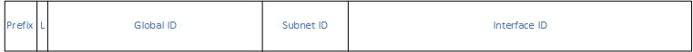
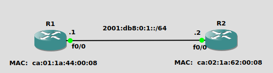
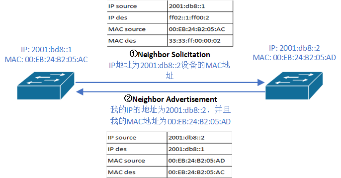

IPv6与IPv4在IP层协议的使用区别<br>
1.OSPFv2只支持IPv4, OSPFv3同时支持IPv4与IPv6
<br>

2.IPv4使用ICMP测试网络连通性, IPv6使用ICMPv6测试网络连通性
<br>

3.IPv4使用ARP发现子网IP的MAC地址, IPv6使用NDP发现子网IP的mac地址
<br>
<br>

IPv6地址格式<br>
IPv6一共128 bits, 使用16进制, 分为32个16进制<br>
4个16进制数字为一组, 称为quartet, 共8个quartet<br>
使用':'在quartet之间进行分隔
<br>

IPv6地址实例:<br>
`2340:1111:AAAA:0001:1234:5678:9ABC:1234`
<br>
<br>

IPv6地址的缩略形式<br>
1)在每个quartet内的前置0, 进行删除
<br>

2)如果多个连续quartet内的值全为0, 缩写为::<br>
** IPv6地址最多只能有一个::, 并且为最多连续quartet值全为0的部分, 以避免混淆
<br>

实例.<br>
`FE00:0000:0000:0012:0000:0000:0000:0567`
<br>

1)删除quartet内的前置0<br>
`FE00:0:0:12:0:0:0:567`
<br>

2)对连续的, quartet内值全为0, 的字段进行缩写<br>
`FE00:0:0:12::567`
<br>
<br>

展开缩略的IPv6地址<br>
1)将每个quartet内的前置0补齐
<br>

2)根据缺少的quartet数量, 展开::内容
<br>

实例<br>
`FE00:0:0:12::567`
<br>

1)补齐quartet内的前置0<br>
`FE00:0000:0000:0012::0567`
<br>

2)展开::内容<br>
`FE00:0000:0000:0012:0000:0000:0000:0567`
<br>
<br>

IPv6相关名词<br>
例<br>
`2001:DB8:1:1:1234::9ABC/64`
<br>

2001:DB8:1:1:1234::9ABC为IPv6 address
<br>

2001:DB8:1:1::为IPv6 prefix, 类似于IPv4的subnet ID
<br>

64为IPv6 prefix length, 类似于IPv4的prefix length
<br>
<br>
<br>

IPv6地址类型<br>
1.loopback地址<br>
`::1`<br>
作用于节点向自己发送消息, 不能将该地址赋予物理接口, 可赋予loopback接口. 类似于IPv4的127.0.0.1
<br>
<br>

2.IPv4兼容地址<br>
1)用于IPv4和IPv6多栈<br>
`::C0A8:0A01`<br>
C0A8:0A01代表携带的IPv4地址信息, 对应IPv4地址192.168.10.1
<br>

2)用于仅支持IPv4的节点<br>
`::FFFF:C0A8:0101`<br>
C0A8:0101代表携带的IPv4地址信息, 对应IPv4地址192.168.1.1
<br>
<br>

3.global unique address<br>
格式:`2000::/3`<br>
类似于IPv4的public IP<br>
从ISP获取的prefix length为小于64的P, 64-P用于子网划分, 配置格式prefix length为64
<br>
<br>

4.unique local address<br>
<br>
field列表:<br>
&emsp;&emsp;Prefix: 7 bits, FC00::/7代表unique local地址<br>

&emsp;&emsp;L: 1 bit, 该bit值为1时, 代表本地赋值; 值为0时, 代表保留留待后用<br>

&emsp;&emsp;Global ID: 40 bits, 使用伪随机算法, 使得该部分内容唯一. 步骤如下:<br>
&emsp;&emsp;&emsp;&emsp;1)使用64 bits NTP, 代表自1900-01-01 00:00距现在的时间(单位为s), 首32 bits为整数部分, 末32 bits为小数部分<br>
&emsp;&emsp;&emsp;&emsp;2)使用EUI-64标识符, 方法: 提取mac地址, 将其分为两个24 bits的部分, 中间插入0xFFFE, 第7 bits取反<br>
&emsp;&emsp;&emsp;&emsp;3)将NTP与EUI-64合并, 使用SHA-1 digest算法, 指定结果为160 bits, 取最后40 bits作为Global ID<br>

&emsp;&emsp;Subnet ID: 16 bits, 用于子网划分<br>

&emsp;&emsp;Interface ID: 64 bits, 用于子网内的节点进行IP部署
<br>
<br>

5.link local address<br>
格式: FE80::/10<br>
仅限于在单条链路内使用的地址, 不可被路由器进行转发<br>
单个路由器可以有多个接口配置相同的link local地址, 但是不同的设备必须配置不同的Link local地址<br>
手动配置为FE80::/64
<br>
<br>

6.anycast address<br>
格式: 与unicast地址一致<br>
将地址配置在不同节点的接口上, 当向该IP地址发送消息时, 选择最近的配置该IP地址的节点作为目标
<br>
<br>

7.multicast address<br>
格式: FF00::/8<br>
1)link-local multicast address列表
|地址              |类型              |
|------------------|------------------|
|FF02::1           |All Nodes         |
|FF02::2           |All Routers       |
|FF02::5           |All OSPF Routers  |
|FF02::6           |All OSPF DRs      |
|FF02::9           |All RIPng Routers |
|FF02::A           |All EIGRP Routers |

<br>

2)solicited-node multicast address<br>
格式: FF02::1:FF00:0/104<br>
最后24 bits使用unicast地址的最后24 bits进行补充, 该multicast地址的个数取决于接口的unicast地址的个数
<br>

组播mac地址规则:<br>
前16 bits - 0x3333<br>
后32 bits - 从IPv6组播地址的后32 bits截取
<br>
<br>
<br>

IPv6使用NDP代表IPv4的ARP进行MAC地址查找<br>
如图<br>
<br>
```
R1(config)# interface f0/0
R1(config-if)# ipv6 address 2001:db8:0:1::1/64
R1(config-if)# no shutdown

R2(config)# interface f0/0
R2(config-if)# ipv6 address 2001:db8:0:1::2/64
R2(config-if)# no shutdown

R2# ping 2001:db8:0:1::1

在ping操作之前, R2没有R1的MAC地址信息. 流程如下:
1.R2发送Neighbor Solicitation(ICMPv6), 该信息地址如下:
       src                    dst
IP     2001:db8:0:1::2        ff02::1:ff00:1
MAC    ca:02:1a:62:00:08      33:33:ff:00:00:01
** ff02::1:ff00:1由ff02::1:ffxx:xxxx与R1的IPv6地址的最后24 bits构成
** 33:33:ff:00:00:01由33:33:ff:xx:xx:xx与R1的IPv6地址的最后24 bits构成

2.R1发送Neighbor Advertisement(ICMPv6), 该信息地址如下:
       src                    dst
IP     2001:db8:0:1::1        ff02::1:ff00:2
MAC    ca:01:1a:44:00:08      ca:02:1a:62:00:08

R2# show ipv6 neighbors
IPv6 Address                              Age Link-layer Addr State Interface
FE80::C801:1AFF:FE44:8                     21 ca01.1a44.0008  STALE Fa0/0
2001:DB8:0:1::1                            21 ca01.1a44.0008  STALE Fa0/0
```
<br>
<br>
<br>

开启IPv6路由<br>
`(config)# ipv6 unicast-routing`
<br>

IPv6地址配置(global unique和unique local)<br>
1.静态配置<br>
1)手动配置完整IPv6地址<br>
`(config-if)# ipv6 address <address>/<prefix_length>`
<br>

2)使用EUI-64配置IPv6地址<br>
`(config-if)# ipv6 address <prefix>/<prefix_length> eui-64`
<br>
<br>

2.动态学习<br>
1)使用stateful DHCPv6<br>
```
(config-ig)# ipv6 enable
(config-ig)# ipv6 address dhcp
```
<br>

2)使用stateless DHCPv6(通过SLAAC获取IPv6地址, 通过DHCP获取dns/domain等额外信息)<br>
`(config-if)# ipv6 address autoconfig`<br>

3)使用SLAAC(Stateless Address Autoconfiguration)<br>
`(config-if)# ipv6 address autoconfig`<br>
** 只有链路另一端的prefix-length为/64时, SLAAC才能起作用<br>
** 通过neighbor获得prefix与prefix-length, 然后使用EUI-64生成地址<br>
** 链路上的主机自动使用SLAAC获得地址
<br>
<br>

IPv6地址配置(link local)<br>
1)手动配置<br>
`(config-if)# ipv6 address <address> link-local`
<br>

2)自动配置<br>
`(config-if)# ipv6 enable`
<br>

3)当接口配置global unique或unique local地址时, 自动生成link local地址
<br>
<br>

IPv6地址配置(anycast)<br>
`(config-if)# ipv6 address <address>/128 anycast`
<br>
<br>

显示接口简略信息<br>
`# show ipv6 interface brief`
<br>
<br>

显示接口详细信息<br>
`# show ipv6 interface [<interface>]`
<br>
<br>

IPv6静态路由<br>
1.配置静态路由<br>
1)next_hop为global unique或unique local地址<br>
`(config)# ipv6 route <prefix>/64 <next_hop>`
<br>

2)next_hop为link local地址<br>
`(config)# ipv6 route <prefix>/64 <out_interface> <next_hop>`
<br>

3)只能作用于PPP/HDLC等Point-to-Point链路<br>
`(config)# ipv6 route <prefix>/64 <out_interface>`
<br>
<br>

2.配置默认路由<br>
`(config)# ipv6 route ::/0 <next_hop>`
<br>
<br>

3.配置host路由<br>
`(config)# ipv6 route <address>/128 <next_hop>`
<br>
<br>

4.配置float路由<br>
`(config)# ipv6 route <prefix>/64 <next_hop> <administration_distance>`
<br>
<br>
<br>

#### NDP(IPv4的ARP部分)

<br>
<br>
<br>

引用:<br>
[1] IPv6 Specification: https://www.rfc-editor.org/info/rfc8200

[2] IPv6 Addressing Architecture: https://www.rfc-editor.org/info/rfc4291

[3] IPv6 Unique Local Unicast Address: https://www.rfc-editor.org/info/rfc4193

[4] Neighbor Discovery Potocol: https://www.rfc-editor.org/info/rfc4861
