图1<br>
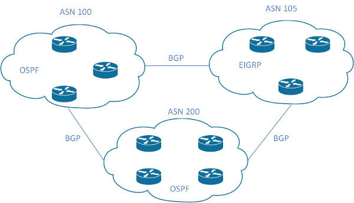<br>

名词列表:<br>
AS(Autonomous System):<br>
位于单个机构控制下的所有路由器集合<br>
AS内部使用IGP进行路由, AS之间使用EGP进行路由<br>
机构连接上Internet需要获得ASN(AS Number)<br>
ASN最初版本为2 bytes, RFC 4893拓展到4 bytes<br>
private ASN:<br>
&emsp;&emsp;2 bytes: 64,512 - 65,535<br>
&emsp;&emsp;4 bytes: 4,200,000,000 - 4,294,967,294<br>
只能使用IANA/ISP提供的公有ASN, 或使用私有ASN, 使用其他机构的ASN容易导致信息丢失和通讯混乱
<br>
<br>

BGP(Border Gateway Protocol):<br>
BGP属于EGP(Exterior Gateway Protocol)<br>
BGP用于在AS之间进行通信<br>
BGP使用TCP作为传输层协议, 并且使用TCP 179端口侦听<br>
位于AS边界的, 与其他AS通信的router, 称为BGP speaker<br>
不同AS之间的BGP speaker通信使用eBGP, 同一AS内的BGP speaker通信使用iBGP<br>
BGP Identifier为4字节无符号整数, 为某个IPv4值, 用于标识发送BGP信息的路由器
<br>
<br>

BGP peer类型:<br>
1.按AS划分<br>
1)eBGP<br>
与不同AS的路由器组成peer<br>

2)iBGP<br>
与同一个AS内的路由器组成peer<br>
** 当前路由器从iBGP peer接收到的NLRI, 不会再转发给其他iBGP peer
<br>
<br>

2.按hop划分<br>
1)single hop peer<br>
连接到同一个子网的peer<br>

2.multi hop peer<br>
不在同一个子网内的peer, 需要通过IGP或静态路由到达peer(不能通过默认路由)<br>
iBGP才使用该类型<br>
实现依赖于TCP
<br>
<br>

消息格式<br>
1.所有消息类型统一BGP header格式
```
0                   1                   2                   3
0 1 2 3 4 5 6 7 8 9 0 1 2 3 4 5 6 7 8 9 0 1 2 3 4 5 6 7 8 9 0 1
+-+-+-+-+-+-+-+-+-+-+-+-+-+-+-+-+-+-+-+-+-+-+-+-+-+-+-+-+-+-+-+-+
|                                                               |
+                                                               +
|                                                               |
+                                                               +
|                           Marker                              |
+                                                               +
|                                                               |
+-+-+-+-+-+-+-+-+-+-+-+-+-+-+-+-+-+-+-+-+-+-+-+-+-+-+-+-+-+-+-+-+
|          Length               |      Type     |
+-+-+-+-+-+-+-+-+-+-+-+-+-+-+-+-+-+-+-+-+-+-+-+-+

Marker
16 bytes, 用于兼容, 所有bits置1

Length
2 bytes, 无符号整数, 消息的总长度(包含header长度), 长度单位为bytes
长度范围限制在19~4096 bytes

Type
1 byte, 无符号整数, 指定消息类型. 列表如下:
    1 - OPEN
    2 - UPDATE
    3 - NOTIFICATION
    4 - KEEPALIVE
```
<br>

2.消息类型<br>
1)OPEN Message<br>
TCP连接建立后, 发送的第一个消息. 并且如果接收到OPEN Message并接受, 回复KEEPALIVE Message<br>

OPEN Message消息结构
```
0                   1                   2                   3
0 1 2 3 4 5 6 7 8 9 0 1 2 3 4 5 6 7 8 9 0 1 2 3 4 5 6 7 8 9 0 1
+-+-+-+-+-+-+-+-+
|    Version    |
+-+-+-+-+-+-+-+-+-+-+-+-+-+-+-+-+
|     My Autonomous System      |
+-+-+-+-+-+-+-+-+-+-+-+-+-+-+-+-+
|           Hold Time           |
+-+-+-+-+-+-+-+-+-+-+-+-+-+-+-+-+-+-+-+-+-+-+-+-+-+-+-+-+-+-+-+-+
|                         BGP Identifier                        |
+-+-+-+-+-+-+-+-+-+-+-+-+-+-+-+-+-+-+-+-+-+-+-+-+-+-+-+-+-+-+-+-+
| Opt Parm Len  |
+-+-+-+-+-+-+-+-+-+-+-+-+-+-+-+-+-+-+-+-+-+-+-+-+-+-+-+-+-+-+-+-+
|                                                               |
|             Optional Parameters (variable)                    |
|                                                               |
+-+-+-+-+-+-+-+-+-+-+-+-+-+-+-+-+-+-+-+-+-+-+-+-+-+-+-+-+-+-+-+-+

Version
1 byte, 无符号整数, 标识协议版本号, 当前BGP版本为4

My Autonomous System
2 bytes, 无符号整数, 发送该消息router的ASN

Hold Time
2 bytes, 无符号整数, 接收者从自己的Hold Time配置和OPEN Message消息收到的值, 取较小值作为自己的Hold Timer
当接收到UPDATE和KEEPALIVE消息时, hold timer重置为初始值
当hold timer达到0时, neighbor移除
Cisco默认值为180s

BGP Identifier
4 bytes, 无符号整数, BGP speaker的某个IPv4值, 在router启动时确定

Opt Parm Len
1 byte, 无符号整数, 代表后续所有可选参数的总长度, 长度单位为bytes

Optional Parameters
可选参数, 可指定多个可选参数, 每个可选参数包含以下字段:
    Parm Type - 1 byte
    Parm Length - 1 byte
    Parameter Value - variable length
```
<br>

2)UPDATE Message<br>
在BGP peer之间传输路由信息

UPDATE Message格式
```
+-----------------------------------------------------+
|   Withdrawn Routes Length (2 octets)                |
+-----------------------------------------------------+
|   Withdrawn Routes (variable)                       |
+-----------------------------------------------------+
|   Total Path Attribute Length (2 octets)            |
+-----------------------------------------------------+
|   Path Attributes (variable)                        |
+-----------------------------------------------------+
|   Network Layer Reachability Information (variable) |
+-----------------------------------------------------+

Withdrawn Routes Length
2 bytes, 无符号整数, 后续Withdrawn Routes字段的长度, 长度单位为bytes

Withdrawn Routes
可变长度, 指定不可用的路由列表. 每个路由项内容如下:
    Length - 1 byte, 指定后续Prefix字段的长度, 单位为bits
    Prefix - 可变长度, IP地址的前置网络位, 需要字节对齐, 内容的bits不是8的整数倍时, 需要填充内容对齐

Total Path Attribute Length
2 bytes, 无符号整数, 后续Path Attributes的长度, 长度单位为bytes

Path Attributes
可变长度, 为路径属性列表. Path Attributes归类参考表1. 每条路径属性包含内容如下:
    attribute type - 2 bytes, 由以下内容构成:
        attr flags - 1 byte, 构成内容如下:
            bit 0 - attribute为optional(1) or well-known(0)
            bit 1 - 对于optional attribute, transitive(1) or non-transitive(0); 对于well-known attribute, 必须为1
            bit 2 - 对于optional transitive attribute, partial(1, 不能识别出) or complete(0, 能识别出); 对于optional non-transitive和well-known attribute, 必须为1
            bit 3 - Extended Length bit, attribute length is 1-byte(0) or 2-bytes(1)
            bit 4~7 - 保留bits
        attr type code - 1 byte, 消息子类型代码. 具体参考表2
    attribute length - 用于指定后续attribute value的长度, 长度单位为bytes. 当attr flags的bit 3为0时, 当前字段为1 byte; 当bit 3为1时, 该字段字段为2 bytes
    attribute value - 与type code搭配, 消息子类型的值. 列表如下:
        a)ORIGIN - 参考表3
        b)AS_PATH - 由path segment的序列组成, 每个path segment的结构如下:
            0                   1
            0 1 2 3 4 5 6 7 8 9 0 1 2 3 4 5 
            +-+-+-+-+-+-+-+-+-+-+-+-+-+-+-+-+
            | path segment  | path segment  |
            |     type      |    length     |
            +-+-+-+-+-+-+-+-+-+-+-+-+-+-+-+-+
            |      path segment value       |
            |          (variable)           |
            +-+-+-+-+-+-+-+-+-+-+-+-+-+-+-+-+

            path segment type
            1 byte, 用于指定path segment的排列类型. 类型如下:
                1 - AS_SET, AS无序排列
                2 - AS_SEQUENCE, AS依次从最左侧添加到序列. 如: AS_SEQUENCE: 2 11 13, 表示先后依次经过AS13 11 2
            path segment length
            1 byte, 指定后续path segment value的AS的个数(1 byte length限制单个path segment的AS个数为255)
            path segment value
            ASN列表, 每个ASN占据2 bytes位置, 最多可以为255个, 即 510 bytes
        c)NEXT_HOP
        d)MULTI_EXIT_DISC
        e)LOCAL_PREF
        f)ATOMIC_AGGREGATE
        g)AGGREGATOR

Network Layer Reachability Information
可变长度, 为路由内容, 由一个或多个2-tuple组成. 2-tuple单元如下:
    +---------------------------+
    |   Length (1 octet)        |
    +---------------------------+
    |   Prefix (variable)       |
    +---------------------------+
    Length
    1 byte, 指定后续Prefix的bits数
    为0时, 代表Prefix可匹配任何IP地址
 
    Prefix
    指定IP的网络位, 并且由于字节边界, 当Prefix不是8的整数位时, 需要可能少的填充尾部, 达到边界对齐

** UPDATE Message的path attributes应该根据attr type code, 进行升序排序
** 最小的UPDATE Message的大小为23 bytes
```
<br>
<br>

表1 - Path Attributes classify
|Name    |Description                                  |
|---     |---                                          |
|Well-known mandatory|BGP必须能识别出该类, 并且每个UPDATE Message必须包含该内容|
|Well-known discretionary|BGP必须识别出该类, 但是UPDATE Message不是必须包含该内容|
|Optional transitive|BGP不是必须识别出该类, 但是需要继续转发|
|Optional non-transitive|BGP不是必须识别出该类, 并且直接丢弃, 不再转发|

<br>
<br>

表2 - Path Attributes Type code
|Type code|Type Name  |Classify     |Description                        |
|---      |---        |---          |---                                |
|1        |ORIGIN     |well-known mandatory|生成NLRI的BGP speaker|
|2        |AS_PATH    |well-known mandatory|NLRI信息通过的AS路径. 修改AS_PATH内容规则:<br>  1)当通告给internal peer时, 不应该修改AS_PATH<br>  2)当通告给external peer时, 如果AS_PATH的第一个路径段为AS_SEQUENCE类型, 将当前AS的ASN prepend到路径段; 如果上述操作导致路径段溢出(路径段AS容量255), 在AS_PATH prepend一个新的路径段, 并将ASN prepend到新路径段<br>  3)当通告给external peer时, 如果AS_PATH的第一个路径段为AS_SET类型, 在AS_PATH prepend一个新的AS_SEQUENCE类型的路径段, 并将当前AS的ASN prepend到新路径段<br>  4)当通告给external peer时, 如果AS_PATH为空, 在AS_PATH新建一个AS_SEQUENCE类型的路径段, 并将当前AS的ASN prepend到路径段|
|3        |NEXT_HOP   |well-known mandatory|能到达NLRI指定地址的下一跳. 规则如下:<br>  1)当发送非当前AS内生成route到internal peer时, 不应该修改该值<br>  2)当发送当前AS内生成route到internal peer时, 则选择发送的接口地址<br>  3)当发送到external peer时, 则选择发送的接口地址|
|4        |MULTI_EXIT_DISC|optional non-transitive|用于external peer有多条路径可达时, 使用4 bytes的度量单位metric, 值小的优先|
|5        |LOCAL_PREF|well-known|用于internal peer有多条路径可达时, 使用4 bytes的度量单位degree of preference, 值大的优先|
|6        |ATOMIC_AGGREGATE|well-known discretionary|聚合后的网络, 是保留源AS_PATH(atomic), 还是从聚合位置所属AS作为起始|
|7        |AGGREGATOR|optional transitive|当前网络是否为聚合后的网络, 需要包含聚合所属AS和router-id|

<br>
<br>

表3 - ORIGIN的attribute value
|Attr Type Code|Attr Value|Description|
|---           |---       |---        |
|1             |0         |IGP, 路由从IGP或internal peer获得|
|1             |1         |EGP, 路由从external peer获得|
|1             |2         |INCOMPLETE, 路由由其他方式获得|

<br>
<br>

3)KEEPALIVE Message<br>
BGP不提供基于TCP的keep-alive机制, 只是用于维持与peer的连接, 防止hold timer过期 
默认发送间隔时间为holder time的1/3, 即Cisco的默认间隔发送时间为180 * 1/3 = 60s
消息长度只有19 bytes(BGP header长度)
<br>
<br>

4)NOTIFICATION Message<br>
检测到错误, 发送错误, 然后立即关闭与peer的连接<br>

NOTIFICATION Message格式
```
0                   1                   2                   3
0 1 2 3 4 5 6 7 8 9 0 1 2 3 4 5 6 7 8 9 0 1 2 3 4 5 6 7 8 9 0 1
+-+-+-+-+-+-+-+-+-+-+-+-+-+-+-+-+-+-+-+-+-+-+-+-+-+-+-+-+-+-+-+-+
| Error code    | Error subcode |   Data (variable)             |
+-+-+-+-+-+-+-+-+-+-+-+-+-+-+-+-+-+-+-+-+-+-+-+-+-+-+-+-+-+-+-+-+

Error code
1 byte, 无符号整数, 表示NOTIFICATION的类型

Error subcode
1 byte, 无符号整数, 每个Error code下更详细分类. 详细查看表4

Data
可变长度, 对NOTIFITION详细的描述, 以此诊断出问题

** 最小的NOTIFICATION Message长度为21 bytes
```

表4 - NOTIFICATION Message

图2<br>
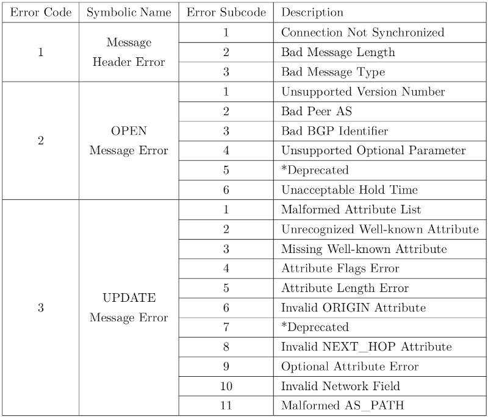
<br>
<br>
<br>

BGP speaker告知路由不可用的方式:<br>
1.在update message添加withdrawn routes字段<br>

2.使用新路由替换update message的BLRI字段原内容<br>

3.关闭与peer的连接, 两个BGP speaker之间通告的所有路由不可用
<br>
<br>
<br>

BGP阻止链路环回的方法, 丢弃AS_PATH包含当前AS的ASN的包, 如下图<br>

图3<br>
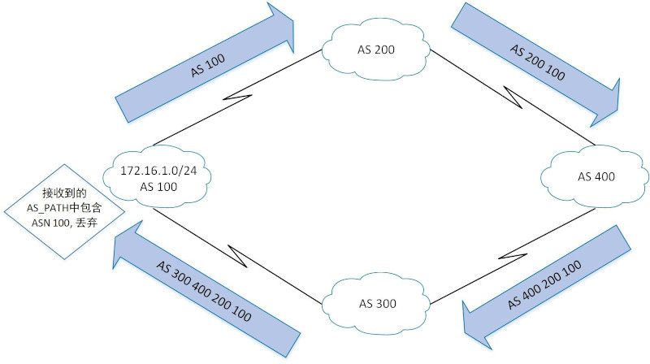
<br>
<br>
<br>

图4<br>
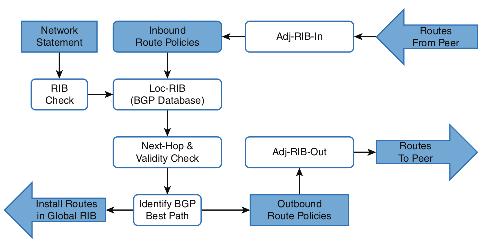<br>
BGP speaker的三种RIB(Routing Information Base):<br>
1.Adj-RIBs-In<br>
从peers的UPDATE messages接收到的通告内容<br>

2.Loc-RIB<br>
当前BGP speaker筛选的可用路由信息<br>

3.Adj-RIBs-Out<br>
当前BGP speaker筛选, 使用UPDATE messages发送给peers的通告内容
<br>
<br>
<br>

配置IPv4 BGP<br>
1.初始化BGP路由进程<br>
`(config)# router bgp <as_number>`
<br>

2.配置Router ID<br>
`(config-router)# bgp router-id <router_id>`<br>
** 当没有配置router-id时, 优先选用up状态的loopback接口地址最大的, 其次选用up状态的物理接口地址最大的
<br>

3.BGP peer的地址和ASN<br>
`(config-router)# neighbor <ip_add> remote-as <as_number>`
<br>

4.将指定网络(connected/static/IGP)加入BGP database(Loc-RIB)<br>
`(config-router)# network <network_id> mask <subnet_mask> [route-map <route_map_name>]`<br>
** 网络加入BGP database原理: 将global RIB中的connected/static/IGP路由与配置的network进行匹配, 能匹配到结果则加入BGP database<br>
** 也可以通过redistribute获得AS内网络的NLRI<br>
** 参考示例1
<br>

*5.配置authentication<br>
`(config-router)# neighbor <ip_add> password <passwd>`
<br>

*6.配置Timer<br>
`(config-router)# neighbor <ip_add> timers <keepalive_timer> <hold_timer>`
<br>

*7.修改源为loopback接口<br>
`(config-router)# neighbor <foreign_loopback_add> update-source <local_lookback_interface>`<br>
** 参考示例3<br>

*8.传递信息给iBGP时, 修改next hop(默认不修改)<br>
`(config-router)# neighbor <foreign_loopback_add> next-hop-self [all]`<br>
** 携带all参数时, 传递给eBGP时也进行修改<br>
** 参考示例4
<br>
<br>
<br>

BGP简略信息<br>
`# show bgp ipv4 unicast summary`
<br>
<br>
<br>

BGP peer信息<br>
`# show bgp ipv4 unicast neighbors [<peer_addr>]`
<br>
<br>
<br>

图5<br>
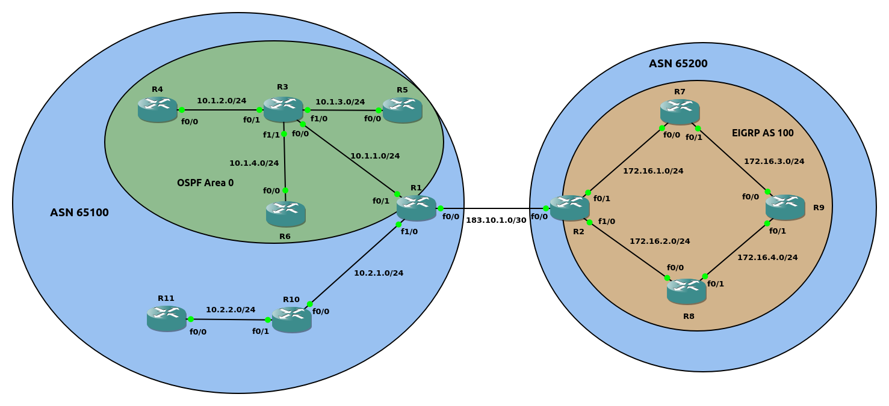<br>

示例1(如图5)
```
OSPF区域配置
R1(config)# router ospf 1
R1(config-router)# router-id 1.1.1.1
R1(config-router)# network 10.1.1.0 0.0.0.255 area 0

R3(config)# router ospf 1
R3(config-router)# router-id 3.3.3.3
R3(config-router)# network 10.1.0.0 0.0.255.255 area 0

R4(config)# router ospf 1
R4(config-router)# router-id 4.4.4.4
R4(config-router)# network 10.1.2.0 0.0.0.255 area 0

R5(config)# router ospf 1
R5(config-router)# router-id 5.5.5.5
R5(config-router)# network 10.1.3.0 0.0.0.255 area 0

R6(config)# router ospf 1
R6(config-router)# router-id 6.6.6.6  
R6(config-router)# network 10.1.4.0 0.0.0.255 area 0


R1与R11静态配置
R1(config)# ip route 10.2.2.0 255.255.255.0 10.2.1.10

R11(config)# ip route 10.2.1.0 255.255.255.0 10.2.2.10 


EIGRP区域配置
R2(config)# router eigrp 100
R2(config-router)# eigrp router-id 2.2.2.2
R2(config-router)# network 172.16.1.0 0.0.0.255 
R2(config-router)# network 172.16.2.0 0.0.0.255

R7(config)# router eigrp 100
R7(config-router)# eigrp router-id 7.7.7.7
R7(config-router)# network 172.16.1.0 0.0.0.255
R7(config-router)# network 172.16.3.0 0.0.0.255

R8(config)# router eigrp 100
R8(config-router)# eigrp router-id 8.8.8.8
R8(config-router)# network 172.16.2.0 0.0.0.255
R8(config-router)# network 172.16.4.0 0.0.0.255

R9(config)# router eigrp 100
R9(config-router)# eigrp router-id 9.9.9.9
R9(config-router)# network 172.16.3.0 0.0.0.255
R9(config-router)# network 172.16.4.0 0.0.0.255


OSPF与静态配置区域互通
R10(config)# ip route 10.1.0.0 255.255.248.0 10.2.1.1

R11(config)# ip route 10.1.0.0 255.255.248.0 10.2.2.10

R1(config)# router ospf 1
R1(config-router)# redistribute static
R1(config-router)# redistribute connected


BGP配置
R1(config)# router bgp 65100
R1(config-router)# bgp router-id 1.1.1.1
R1(config-router)# neighbor 183.10.1.2 remote-as 65200
R1(config-router)# redistribute connected
R1(config-router)# redistribute static
R1(config-router)# redistribute ospf 1

R2(config)# router bgp 65200
R2(config-router)# bgp router-id 2.2.2.2
R2(config-router)# neighbor 183.10.1.1 remote-as 65100
R2(config-router)# redistribute connected
R2(config-router)# redistribute eigrp
R2(config-router)# network 172.16.1.0 mask 255.255.255.0
R2(config-router)# network 172.16.3.0 mask 255.255.255.0


BGP包含三个table
1.Adj-RIB-in

2.Loc-RIB(BGP database)

3.Adj-RIB-out


R1 BGP database
R1# show bgp ipv4 unicast | begin Network                             
     Network          Next Hop            Metric LocPrf Weight Path
 *>  10.1.1.0/24      0.0.0.0                  0         32768 ?
 *>  10.1.2.0/24      10.1.1.3                 2         32768 ?
 *>  10.1.3.0/24      10.1.1.3                 2         32768 ?
 *>  10.1.4.0/24      10.1.1.3                 2         32768 ?
 *>  10.2.1.0/24      0.0.0.0                  0         32768 ?
 *>  10.2.2.0/24      10.2.1.10                0         32768 ?
 *>  172.16.1.0/24    183.10.1.2               0             0 65200 i
 *>  172.16.2.0/24    183.10.1.2               0             0 65200 ?
 *>  172.16.3.0/24    183.10.1.2           30720             0 65200 i
 *>  172.16.4.0/24    183.10.1.2           30720             0 65200 ?
 *   183.10.1.0/30    183.10.1.2               0             0 65200 ?
 *>                   0.0.0.0                  0         32768 ?

R2 BGP database
R2# show bgp ipv4 unicast | begin Network
     Network          Next Hop            Metric LocPrf Weight Path
 *>  10.1.1.0/24      183.10.1.1               0             0 65100 ?
 *>  10.1.2.0/24      183.10.1.1               2             0 65100 ?
 *>  10.1.3.0/24      183.10.1.1               2             0 65100 ?
 *>  10.1.4.0/24      183.10.1.1               2             0 65100 ?
 *>  10.2.1.0/24      183.10.1.1               0             0 65100 ?
 *>  10.2.2.0/24      183.10.1.1               0             0 65100 ?
 *>  172.16.1.0/24    0.0.0.0                  0         32768 i
 *>  172.16.2.0/24    0.0.0.0                  0         32768 ?
 *>  172.16.3.0/24    172.16.1.7           30720         32768 i
 *>  172.16.4.0/24    172.16.2.8           30720         32768 ?
 *>  183.10.1.0/30    0.0.0.0                  0         32768 ?
 *                    183.10.1.1               0             0 65100 ?


Field解析:
Network
安装到Loc-RIB的network prefix
当network prefix包含多条path时, 第二条及之后省略network prefix. 标记如下:
  * - 有效NLRI
  > - best path

Next Hop
下一跳地址
connected网络的值为0.0.0.0

Metric
MULTI_EXIT_DISC值, 使用注入Loc-RIB之前的metric值(connected/static/IGP的metric值)

Weight
当前AS内生成的NLRI为32768, 其他eBGP注入的为0

Path
? - 由IGP redistribute
! - 由network匹配获得
<AS_number> - 路由经过其他autonomous system


R1的通告给R2的prefix(Adj-RIB-out)
R1# show bgp ipv4 unicast neighbors 183.10.1.2 advertised-routes | begin Network       
     Network          Next Hop            Metric LocPrf Weight Path
 *>  10.1.1.0/24      0.0.0.0                  0         32768 ?
 *>  10.1.2.0/24      10.1.1.3                 2         32768 ?
 *>  10.1.3.0/24      10.1.1.3                 2         32768 ?
 *>  10.1.4.0/24      10.1.1.3                 2         32768 ?
 *>  10.2.1.0/24      0.0.0.0                  0         32768 ?
 *>  10.2.2.0/24      10.2.1.10                0         32768 ?
 *>  183.10.1.0/30    0.0.0.0                  0         32768 ?

Total number of prefixes 7


R2从R1接收的通告(Adj-RIB-int)
R2# show bgp ipv4 unicast neighbors 183.10.1.1 routes | begin Network    
     Network          Next Hop            Metric LocPrf Weight Path
 *>  10.1.1.0/24      183.10.1.1               0             0 65100 ?
 *>  10.1.2.0/24      183.10.1.1               2             0 65100 ?
 *>  10.1.3.0/24      183.10.1.1               2             0 65100 ?
 *>  10.1.4.0/24      183.10.1.1               2             0 65100 ?
 *>  10.2.1.0/24      183.10.1.1               0             0 65100 ?
 *>  10.2.2.0/24      183.10.1.1               0             0 65100 ?
 *   183.10.1.0/30    183.10.1.1               0             0 65100 ?

Total number of prefixes 7 


R1的BGP路由表
R1# show ip route bgp | begin Gateway
Gateway of last resort is not set

      172.16.0.0/24 is subnetted, 4 subnets
B        172.16.1.0 [20/0] via 183.10.1.2, 01:24:57
B        172.16.2.0 [20/0] via 183.10.1.2, 01:28:36
B        172.16.3.0 [20/30720] via 183.10.1.2, 01:28:06
B        172.16.4.0 [20/30720] via 183.10.1.2, 01:28:06

** BGP只通告best path给BGP peers
```
<br>
<br>

图6<br>
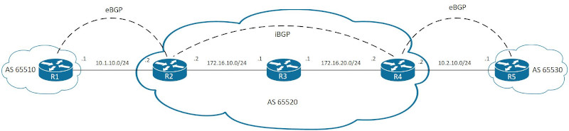<br>
配置过程(如图6)
```
ospf配置
R2(config)# router ospf 1
R2(config-router)# router-id 2.2.2.2
R2(config)# int f0/1
R2(config-if)# ip add 172.16.10.2 255.255.255.0
R2(config-if)# no shutdown
R2(config-if)# ip ospf 1 area 0

R3(config)# router ospf 1
R3(config-router)# router-id 3.3.3.3
R3(config)# int f0/0
R3(config-if)# ip add 172.16.10.1 255.255.255.0
R3(config-if)# no shutdown
R3(config-if)# ip ospf 1 area 0
R3(config)# int f0/1
R3(config-if)# ip add 172.16.20.1 255.255.255.0
R3(config-if)# no shutdown
R3(config-if)# ip ospf 1 area 0

R4(config)# router ospf 1
R4(config-router)# router-id 4.4.4.4
R4(config)# int f0/0
R4(config-if)# ip add 172.16.20.2 255.255.255.0
R4(config-if)# no shutdown
R4(config-if)# ip ospf 1 area 0


BGP配置
R1(config)# router bgp 65510
R1(config-router)# bgp router-id 1.1.1.1
R1(config-router)# neighbor 10.1.10.2 remote-as 65520
R1(config)# int f0/0
R1(config-if)# ip add 10.1.10.1 255.255.255.0
R1(config-if)# no shutdown

R2(config)# router bgp 65520
R2(config-router)# bgp router-id 2.2.2.2
R2(config-router)# neighbor 10.1.10.1 remote-as 65510
R2(config-router)# neighbor 172.16.20.2 remote-as 65520
R2(config-router)# network 10.1.10.0 mask 255.255.255.0
R2(config-router)# network 172.16.10.0 mask 255.255.255.0
R2(config-router)# network 172.16.20.0 mask 255.255.255.0
R2(config)# int f0/0
R2(config-if)# ip add 10.1.10.2 255.255.255.0
R2(config-if)# no shutdown

R4(config)# router bgp 65520
R4(config-router)# bgp router-id 4.4.4.4
R4(config-router)# neighbor 10.2.10.1 remote-as 65530
R4(config-router)# neighbor 172.16.10.2 remote-as 65520
R4(config-router)# network 10.2.10.0 mask 255.255.255.0
R4(config-router)# network 172.16.10.0 mask 255.255.255.0
R4(config-router)# network 172.16.20.0 mask 255.255.255.0
R4(config)# int f0/1
R4(config-if)# ip add 10.2.10.2 255.255.255.0
R4(config-if)# no shutdown

R5(config)# router bgp 65530
R5(config-router)# bgp router-id 5.5.5.5
R5(config-router)# neighbor 10.2.10.2 remote-as 65520
R5(config)# int f0/0
R5(config-if)# ip add 10.2.10.1 255.255.255.0
R5(config-if)# no shutdown

** BGP multi-hop internal peer需要配置静态路由或通过IGP建立, 默认路由不适用
** AS 65520为transit AS, 一般应用于Service Provider, 而不在个人机构使用
```
<br>
<br>

图7<br>
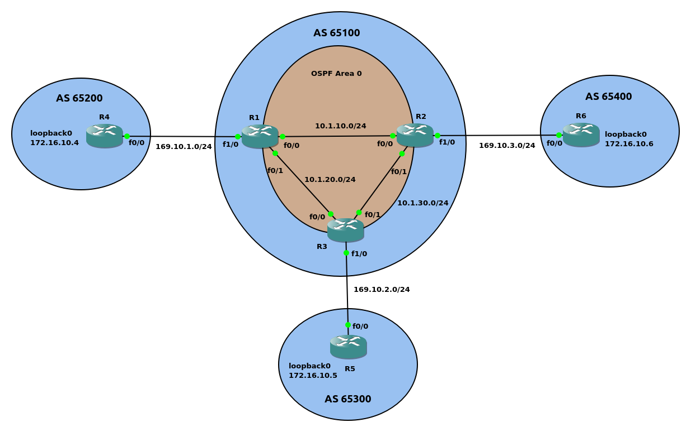<br>
示例2(如图7)
```
OSPF区域配置
R1(config-if)# router ospf 1
R1(config-router)# router-id 1.1.1.1
R1(config-router)# network 10.1.0.0 0.0.255.255 area 0

R2(config-if)# router ospf 1
R2(config-router)# router-id 2.2.2.2
R2(config-router)# network 10.1.0.0 0.0.255.255 area 0

R3(config-if)# router ospf 1
R3(config-router)# router-id 3.3.3.3
R3(config-router)# network 10.1.0.0 0.0.255.255 area 0


BGP配置
R1(config)# router bgp 65100
R1(config-router)# bgp router-id 1.1.1.1
R1(config-router)# neighbor 10.1.10.2 remote-as 65100
R1(config-router)# neighbor 10.1.20.3 remote-as 65100
R1(config-router)# neighbor 169.10.1.4 remote-as 65200
R1(config-router)# redistribute connected 
R1(config-router)# redistribute ospf 1

R2(config)# router bgp 65100
R2(config-router)# bgp router-id 2.2.2.2
R2(config-router)# neighbor 10.1.10.1 remote-as 65100
R2(config-router)# neighbor 10.1.30.3 remote-as 65100
R2(config-router)# neighbor 169.10.3.6 remote-as 65400
R2(config-router)# redistribute connected
R2(config-router)# redistribute ospf 1

R3(config)# router bgp 65100
R3(config-router)# bgp router-id 3.3.3.3
R3(config-router)# neighbor 10.1.20.1 remote-as 65100
R3(config-router)# neighbor 10.1.30.2 remote-as 65100 
R3(config-router)# neighbor 169.10.2.5 remote-as 65300
R3(config-router)# redistribute connected
R3(config-router)# redistribute ospf 1

R4(config)# router bgp 65200
R4(config-router)# bgp router-id 4.4.4.4
R4(config-router)# neighbor 169.10.1.1 remote-as 65100
R4(config-router)# redistribute connected

R5(config)# router bgp 65300
R5(config-router)# bgp router-id 5.5.5.5 
R5(config-router)# neighbor 169.10.2.3 remote-as 65100
R5(config-router)# redistribute connected

R6(config)# router bgp 65400
R6(config-router)# bgp router-id 6.6.6.6
R6(config-router)# neighbor 169.10.3.2 remote-as 65100
R6(config-router)# redistribute connected


查看R4的路由表
R4# show ip route | begin Gateway
Gateway of last resort is not set

      10.0.0.0/24 is subnetted, 3 subnets
B        10.1.10.0 [20/0] via 169.10.1.1, 00:18:29
B        10.1.20.0 [20/0] via 169.10.1.1, 00:18:29
B        10.1.30.0 [20/2] via 169.10.1.1, 00:18:29
      169.10.0.0/16 is variably subnetted, 4 subnets, 2 masks
C        169.10.1.0/24 is directly connected, FastEthernet0/0
L        169.10.1.4/32 is directly connected, FastEthernet0/0
B        169.10.2.0/24 [20/0] via 169.10.1.1, 00:18:29
B        169.10.3.0/24 [20/0] via 169.10.1.1, 00:18:29


当R1的f0/1接口出现故障, R1的邻接表和路由表
R1(config)# int f0/1
R1(config-if)# shutdown
R1# show bgp ipv4 unicast summary | begin Neighbor
Neighbor        V           AS MsgRcvd MsgSent   TblVer  InQ OutQ Up/Down  State/PfxRcd
10.1.10.2       4        65100      43      44       13    0    0 00:34:39        4
10.1.20.3       4        65100       0       0        1    0    0 00:03:38 Idle
169.10.1.4      4        65200      38      42       13    0    0 00:30:36        1

R1# show ip route | begin Gateway
Gateway of last resort is not set

      10.0.0.0/8 is variably subnetted, 4 subnets, 2 masks
C        10.1.10.0/24 is directly connected, FastEthernet0/0
L        10.1.10.1/32 is directly connected, FastEthernet0/0
O        10.1.20.0/24 [110/3] via 10.1.10.2, 00:07:58, FastEthernet0/0
O        10.1.30.0/24 [110/2] via 10.1.10.2, 00:44:37, FastEthernet0/0
      169.10.0.0/16 is variably subnetted, 3 subnets, 2 masks
C        169.10.1.0/24 is directly connected, FastEthernet1/0
L        169.10.1.1/32 is directly connected, FastEthernet1/0
B        169.10.3.0/24 [200/0] via 10.1.10.2, 00:36:31

分析:
由于R2从iBGP接收到169.10.2.0/24网络信息, 但是不能再传递给其他iBGP, 所以R1无法收到169.10.2.0/24网络信息

```
<br>
<br>

示例3, 重新配置, 使用Loopback接口作为neighbor地址(如图7)
```
R1/R2/R3配置loopback0接口
R1(config)# interface loopback0
R1(config-if)# ip add 172.16.10.1 255.255.255.255

R2(config)# interface loopback0
R2(config-if)# ip add 172.16.10.2 255.255.255.255

R3(config)# interface loopback0
R3(config-if)# ip add 172.16.10.3 255.255.255.255


OSPF区域配置
R1(config-if)# router ospf 1
R1(config-router)# router-id 1.1.1.1
R1(config-router)# network 10.1.0.0 0.0.255.255 area 0
R1(config-router)# network 172.16.10.0 0.0.0.255 area 0

R2(config-if)# router ospf 1
R2(config-router)# router-id 2.2.2.2
R2(config-router)# network 10.1.0.0 0.0.255.255 area 0
R2(config-router)# network 172.16.10.0 0.0.0.255 area 0


R3(config-if)# router ospf 1
R3(config-router)# router-id 3.3.3.3
R3(config-router)# network 10.1.0.0 0.0.255.255 area 0
R3(config-router)# network 172.16.10.0 0.0.0.255 area 0


BGP配置
R1(config)# router bgp 65100
R1(config-router)# bgp router-id 1.1.1.1
R1(config-router)# neighbor 172.16.10.2 remote-as 65100
R1(config-router)# neighbor 172.16.10.2 update-source Loopback0
R1(config-router)# neighbor 172.16.10.3 remote-as 65100
R1(config-router)# neighbor 172.16.10.3 update-source Loopback0
R1(config-router)# neighbor 169.10.1.4 remote-as 65200
R1(config-router)# redistribute connected 
R1(config-router)# redistribute ospf 1

R2(config)# router bgp 65100
R2(config-router)# bgp router-id 2.2.2.2
R2(config-router)# neighbor 172.16.10.1 remote-as 65100
R2(config-router)# neighbor 172.16.10.1 update-source Loopback0
R2(config-router)# neighbor 172.16.10.3 remote-as 65100
R2(config-router)# neighbor 172.16.10.3 update-source Loopback0
R2(config-router)# neighbor 169.10.3.6 remote-as 65400
R2(config-router)# redistribute connected
R2(config-router)# redistribute ospf 1

R3(config)# router bgp 65100
R3(config-router)# bgp router-id 3.3.3.3
R3(config-router)# neighbor 172.16.10.1 remote-as 65100
R3(config-router)# neighbor 172.16.10.1 update-source Loopback0
R3(config-router)# neighbor 172.16.10.2 remote-as 65100 
R3(config-router)# neighbor 172.16.10.2 update-source Loopback0
R3(config-router)# neighbor 169.10.2.5 remote-as 65300
R3(config-router)# redistribute connected
R3(config-router)# redistribute ospf 1

R4(config)# router bgp 65200
R4(config-router)# bgp router-id 4.4.4.4
R4(config-router)# neighbor 169.10.1.1 remote-as 65100
R4(config-router)# redistribute connected

R5(config)# router bgp 65300
R5(config-router)# bgp router-id 5.5.5.5 
R5(config-router)# neighbor 169.10.2.3 remote-as 65100
R5(config-router)# redistribute connected

R6(config)# router bgp 65400
R6(config-router)# bgp router-id 6.6.6.6
R6(config-router)# neighbor 169.10.3.2 remote-as 65100
R6(config-router)# redistribute connected


当R1的f0/1接口出现故障, R1的邻接表和路由表
R1(config)# int f0/1
R1(config-if)# shutdown
R1# show bgp ipv4 unicast summary | begin Neighbor
Neighbor        V           AS MsgRcvd MsgSent   TblVer  InQ OutQ Up/Down  State/PfxRcd
169.10.1.4      4        65200      84      96       31    0    0 01:12:48        1
172.16.10.2     4        65100      27      31       31    0    0 00:18:54        6
172.16.10.3     4        65100      29      30       31    0    0 00:18:58        7

R1# show ip route | begin Gateway                 
Gateway of last resort is not set

      10.0.0.0/8 is variably subnetted, 4 subnets, 2 masks
C        10.1.10.0/24 is directly connected, FastEthernet0/0
L        10.1.10.1/32 is directly connected, FastEthernet0/0
O        10.1.20.0/24 [110/3] via 10.1.10.2, 00:12:14, FastEthernet0/0
O        10.1.30.0/24 [110/2] via 10.1.10.2, 01:24:46, FastEthernet0/0
      169.10.0.0/16 is variably subnetted, 4 subnets, 2 masks
C        169.10.1.0/24 is directly connected, FastEthernet1/0
L        169.10.1.1/32 is directly connected, FastEthernet1/0
B        169.10.2.0/24 [200/0] via 172.16.10.3, 00:11:47
B        169.10.3.0/24 [200/0] via 172.16.10.2, 00:19:32
      172.16.0.0/16 is variably subnetted, 4 subnets, 2 masks
C        172.16.10.0/24 is directly connected, Loopback0
L        172.16.10.1/32 is directly connected, Loopback0
O        172.16.10.2/32 [110/2] via 10.1.10.2, 00:22:52, FastEthernet0/0
O        172.16.10.3/32 [110/3] via 10.1.10.2, 00:12:14, FastEthernet0/0
```
<br>
<br>

示例4, R1/R2/R3不对connected网络进行redistribute(如图7)
```
R1/R2/R3配置loopback0接口
R1(config)# interface loopback0
R1(config-if)# ip add 172.16.10.1 255.255.255.255

R2(config)# interface loopback0
R2(config-if)# ip add 172.16.10.2 255.255.255.255

R3(config)# interface loopback0
R3(config-if)# ip add 172.16.10.3 255.255.255.255


OSPF区域配置
R1(config-if)# router ospf 1
R1(config-router)# router-id 1.1.1.1
R1(config-router)# network 10.1.0.0 0.0.255.255 area 0
R1(config-router)# network 172.16.10.0 0.0.0.255 area 0

R2(config-if)# router ospf 1
R2(config-router)# router-id 2.2.2.2
R2(config-router)# network 10.1.0.0 0.0.255.255 area 0
R2(config-router)# network 172.16.10.0 0.0.0.255 area 0


R3(config-if)# router ospf 1
R3(config-router)# router-id 3.3.3.3
R3(config-router)# network 10.1.0.0 0.0.255.255 area 0
R3(config-router)# network 172.16.10.0 0.0.0.255 area 0


BGP配置
R1(config)# router bgp 65100
R1(config-router)# bgp router-id 1.1.1.1
R1(config-router)# neighbor 172.16.10.2 remote-as 65100
R1(config-router)# neighbor 172.16.10.2 update-source Loopback0
R1(config-router)# neighbor 172.16.10.3 remote-as 65100
R1(config-router)# neighbor 172.16.10.3 update-source Loopback0
R1(config-router)# neighbor 169.10.1.4 remote-as 65200
R1(config-router)# redistribute ospf 1

R2(config)# router bgp 65100
R2(config-router)# bgp router-id 2.2.2.2
R2(config-router)# neighbor 172.16.10.1 remote-as 65100
R2(config-router)# neighbor 172.16.10.1 update-source Loopback0
R2(config-router)# neighbor 172.16.10.3 remote-as 65100
R2(config-router)# neighbor 172.16.10.3 update-source Loopback0
R2(config-router)# neighbor 169.10.3.6 remote-as 65400
R2(config-router)# redistribute ospf 1

R3(config)# router bgp 65100
R3(config-router)# bgp router-id 3.3.3.3
R3(config-router)# neighbor 172.16.10.1 remote-as 65100
R3(config-router)# neighbor 172.16.10.1 update-source Loopback0
R3(config-router)# neighbor 172.16.10.2 remote-as 65100 
R3(config-router)# neighbor 172.16.10.2 update-source Loopback0
R3(config-router)# neighbor 169.10.2.5 remote-as 65300
R3(config-router)# redistribute ospf 1

R4(config)# router bgp 65200
R4(config-router)# bgp router-id 4.4.4.4
R4(config-router)# neighbor 169.10.1.1 remote-as 65100
R4(config-router)# redistribute connected

R5(config)# router bgp 65300
R5(config-router)# bgp router-id 5.5.5.5 
R5(config-router)# neighbor 169.10.2.3 remote-as 65100
R5(config-router)# redistribute connected

R6(config)# router bgp 65400
R6(config-router)# bgp router-id 6.6.6.6
R6(config-router)# neighbor 169.10.3.2 remote-as 65100
R6(config-router)# redistribute connected


R1# show bgp ipv4 unicast | include 172.16.10.6
 * i 172.16.10.6/32   169.10.3.6               0    100      0 65400 ?

R2# show bgp ipv4 unicast | include 172.16.10.6
 *>  172.16.10.6/32   169.10.3.6               0             0 65400 ?

R3# show bgp ipv4 unicast | include 172.16.10.6
 * i 172.16.10.6/32   169.10.3.6               0    100      0 65400 ?


分析:
由于iBGP传递NLRI时, 不修改next hop, 并且如果发送NLRI的iBGP没有redistribute connected网络时, eBGP网络不可达, 因此R1/R3无法找到可达信息


使当前路由器在向指定iBGP传递NLRI时, 修改next hop
增加配置:
R1(config-router)# neighbor 172.16.10.2 next-hop-self
R1(config-router)# neighbor 172.16.10.3 next-hop-self

R2(config-router)# neighbor 172.16.10.1 next-hop-self
R2(config-router)# neighbor 172.16.10.3 next-hop-self

R3(config-router)# neighbor 172.16.10.1 next-hop-self
R3(config-router)# neighbor 172.16.10.2 next-hop-self


验证
R1# show bgp ipv4 unicast | include 172.16.10.6
 *>i 172.16.10.6/32   172.16.10.2              0    100      0 65400 ?

R2# show bgp ipv4 unicast | include 172.16.10.6
 *>  172.16.10.6/32   169.10.3.6               0             0 65400 ?

R3# show bgp ipv4 unicast | include 172.16.10.6
 *>i 172.16.10.6/32   172.16.10.2              0    100      0 65400 ?
```
<br>
<br>

BGP路由汇总<br>
汇总配置语法
```
(config-router)# aggregate-address network subnet-mask [summary-only] [as-set]

summary-only
代表汇总后只显示汇总后的网络. 默认汇总后和汇总前的网络都显示
假设汇总172.16.1.0/24与172.16.2.0/24为172.16.0.0/22, 默认结果172.16.0.0/22、172.16.1.0/24、172.16.2.0/24都显示. 提供该参数后, 只显示汇总后的172.16.0.0/22

as-set
代表保留合并后网络的完整AS path
当AS 100汇总AS 200的172.16.1.0/24与172.16.2.0/24为172.16.0.0/22, 默认AS path的起源为AS 100. 提供该参数后, 汇总后的网络AS path的起源为AS 200
```

图8<br>
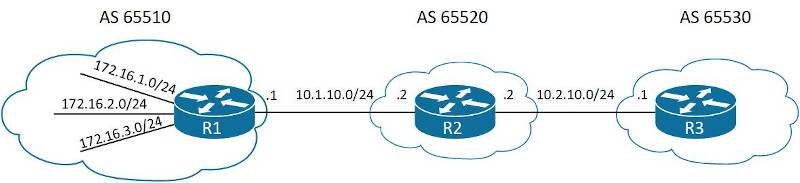<br>

配置过程(如图8):
```
R1(config)# int f0/0
R1(config-if)# ip add 10.1.10.1 255.255.255.0
R1(config-if)# no shutdown
R1(config-if)# int f0/1
R1(config-if)# ip add 172.16.1.1 255.255.255.0
R1(config-if)# no shutdown
R1(config-if)# int f1/0
R1(config-if)# ip add 172.16.2.1 255.255.255.0
R1(config-if)# no shutdown
R1(config-if)# int f1/1
R1(config-if)# ip add 172.16.3.1 255.255.255.0
R1(config-if)# no shutdown
R1(config)# router bgp 65510
R1(config-router)# bgp router-id 1.1.1.1
R1(config-router)# neighbor 10.1.10.2 remote-as 65520
R1(config-router)# network 10.1.10.0 mask 255.255.255.0
R1(config-router)# network 172.16.1.0 mask 255.255.255.0
R1(config-router)# network 172.16.2.0 mask 255.255.255.0
R1(config-router)# network 172.16.3.0 mask 255.255.255.0

R2(config)# int f0/0
R2(config-if)# ip add 10.1.10.2 255.255.255.0
R2(config-if)# no shutdown
R2(config)# int f0/1
R2(config-if)# ip add 10.2.10.2 255.255.255.0
R2(config-if)# no shutdown
R2(config)# router bgp 65520
R2(config-router)# bgp router-id 2.2.2.2
R2(config-router)# neighbor 10.1.10.1 remote-as 65510
R2(config-router)# neighbor 10.2.10.1 remote-as 65530
R2(config-router)# network 10.1.10.0 mask 255.255.255.0
R2(config-router)# network 10.2.10.0 mask 255.255.255.0

R3(config)# int f0/0
R3(config-if)# ip add 10.2.10.1 255.255.255.0
R3(config-if)# no shutdown
R3(config)# router bgp 65530
R3(config-router)# bgp router-id 3.3.3.3
R3(config-router)# neighbor 10.2.10.2 remote-as 65520
R3(config-router)# network 10.2.10.0 mask 255.255.255.0
```
<br>

情景一<br>
没有配置汇总之前
```
R1# show bgp ipv4 unicast | begin Network
     Network          Next Hop            Metric LocPrf Weight Path
 *   10.1.10.0/24     10.1.10.2                0             0 65520 i
 *>                   0.0.0.0                  0         32768 i
 *>  10.2.10.0/24     10.1.10.2                0             0 65520 i
 *>  172.16.1.0/24    0.0.0.0                  0         32768 i
 *>  172.16.2.0/24    0.0.0.0                  0         32768 i
 *>  172.16.3.0/24    0.0.0.0                  0         32768 i

R2# show bgp ipv4 unicast | begin Network
     Network          Next Hop            Metric LocPrf Weight Path
 *>  10.1.10.0/24     0.0.0.0                  0         32768 i
 *                    10.1.10.1                0             0 65510 i
 *   10.2.10.0/24     10.2.10.1                0             0 65530 i
 *>                   0.0.0.0                  0         32768 i
 *>  172.16.1.0/24    10.1.10.1                0             0 65510 i
 *>  172.16.2.0/24    10.1.10.1                0             0 65510 i
 *>  172.16.3.0/24    10.1.10.1                0             0 65510 i

R3# show bgp ipv4 unicast | begin Network
     Network          Next Hop            Metric LocPrf Weight Path
 *>  10.1.10.0/24     10.2.10.2                0             0 65520 i
 *>  10.2.10.0/24     0.0.0.0                  0         32768 i
 *                    10.2.10.2                0             0 65520 i
 *>  172.16.1.0/24    10.2.10.2                              0 65520 65510 i
 *>  172.16.2.0/24    10.2.10.2                              0 65520 65510 i
 *>  172.16.3.0/24    10.2.10.2                              0 65520 65510 i
```
<br>

情景二<br>
在R1将172.16.1.0/24、172.16.2.0/24、172.16.3.0/24汇总成172.16.0.0/21
```
R1(config)# router bgp 65510
R1(config-router)# aggregate-address 172.16.0.0 255.255.248.0

R1# show bgp ipv4 unicast | begin Network
     Network          Next Hop            Metric LocPrf Weight Path
 *   10.1.10.0/24     10.1.10.2                0             0 65520 i
 *>                   0.0.0.0                  0         32768 i
 *>  10.2.10.0/24     10.1.10.2                0             0 65520 i
 *>  172.16.0.0/21    0.0.0.0                            32768 i
 *>  172.16.1.0/24    0.0.0.0                  0         32768 i
 *>  172.16.2.0/24    0.0.0.0                  0         32768 i
 *>  172.16.3.0/24    0.0.0.0                  0         32768 i

R2# show bgp ipv4 unicast | begin Network
     Network          Next Hop            Metric LocPrf Weight Path
 *>  10.1.10.0/24     0.0.0.0                  0         32768 i
 *                    10.1.10.1                0             0 65510 i
 *   10.2.10.0/24     10.2.10.1                0             0 65530 i
 *>                   0.0.0.0                  0         32768 i
 *>  172.16.0.0/21    10.1.10.1                0             0 65510 i
 *>  172.16.1.0/24    10.1.10.1                0             0 65510 i
 *>  172.16.2.0/24    10.1.10.1                0             0 65510 i
 *>  172.16.3.0/24    10.1.10.1                0             0 65510 i

R3# show bgp ipv4 unicast | begin Network
     Network          Next Hop            Metric LocPrf Weight Path
 *>  10.1.10.0/24     10.2.10.2                0             0 65520 i
 *>  10.2.10.0/24     0.0.0.0                  0         32768 i
 *                    10.2.10.2                0             0 65520 i
 *>  172.16.0.0/21    10.2.10.2                              0 65520 65510 i
 *>  172.16.1.0/24    10.2.10.2                              0 65520 65510 i
 *>  172.16.2.0/24    10.2.10.2                              0 65520 65510 i
 *>  172.16.3.0/24    10.2.10.2                              0 65520 65510 i
```
<br>

情景三<br>
在R1上使用聚合的summary-only参数, 只显示聚合后的网络
```
R1(config)# router bgp 65510
R1(config-router)# aggregate-address 172.16.0.0 255.255.248.0 summary-only

R1# show bgp ipv4 unicast | begin Network
     Network          Next Hop            Metric LocPrf Weight Path
 *   10.1.10.0/24     10.1.10.2                0             0 65520 i
 *>                   0.0.0.0                  0         32768 i
 *>  10.2.10.0/24     10.1.10.2                0             0 65520 i
 *>  172.16.0.0/21    0.0.0.0                            32768 i
 s>  172.16.1.0/24    0.0.0.0                  0         32768 i
 s>  172.16.2.0/24    0.0.0.0                  0         32768 i
 s>  172.16.3.0/24    0.0.0.0                  0         32768 i

R2# show bgp ipv4 unicast | begin Network
     Network          Next Hop            Metric LocPrf Weight Path
 *>  10.1.10.0/24     0.0.0.0                  0         32768 i
 *                    10.1.10.1                0             0 65510 i
 *   10.2.10.0/24     10.2.10.1                0             0 65530 i
 *>                   0.0.0.0                  0         32768 i
 *>  172.16.0.0/21    10.1.10.1                0             0 65510 i

R3# show bgp ipv4 unicast | begin Network
     Network          Next Hop            Metric LocPrf Weight Path
 *>  10.1.10.0/24     10.2.10.2                0             0 65520 i
 *>  10.2.10.0/24     0.0.0.0                  0         32768 i
 *                    10.2.10.2                0             0 65520 i
 *>  172.16.0.0/21    10.2.10.2                              0 65520 65510 i
```
<br>

情景四<br>
在R2上聚合, 查看AS路径
```
R2(config)#router bgp 65520
R2(config-router)# aggregate-address 172.16.0.0 255.255.248.0

R1# show bgp ipv4 unicast | begin Network
     Network          Next Hop            Metric LocPrf Weight Path
 *   10.1.10.0/24     10.1.10.2                0             0 65520 i
 *>                   0.0.0.0                  0         32768 i
 *>  10.2.10.0/24     10.1.10.2                0             0 65520 i
 *>  172.16.0.0/21    10.1.10.2                0             0 65520 i
 *>  172.16.1.0/24    0.0.0.0                  0         32768 i
 *>  172.16.2.0/24    0.0.0.0                  0         32768 i
 *>  172.16.3.0/24    0.0.0.0                  0         32768 i

R2# show bgp ipv4 unicast | begin Network
     Network          Next Hop            Metric LocPrf Weight Path
 *>  10.1.10.0/24     0.0.0.0                  0         32768 i
 *                    10.1.10.1                0             0 65510 i
 *   10.2.10.0/24     10.2.10.1                0             0 65530 i
 *>                   0.0.0.0                  0         32768 i
 *>  172.16.0.0/21    0.0.0.0                            32768 i
 *>  172.16.1.0/24    10.1.10.1                0             0 65510 i
 *>  172.16.2.0/24    10.1.10.1                0             0 65510 i
 *>  172.16.3.0/24    10.1.10.1                0             0 65510 i

R3# show bgp ipv4 unicast | begin Network
     Network          Next Hop            Metric LocPrf Weight Path
 *>  10.1.10.0/24     10.2.10.2                0             0 65520 i
 *>  10.2.10.0/24     0.0.0.0                  0         32768 i
 *                    10.2.10.2                0             0 65520 i
 *>  172.16.0.0/21    10.2.10.2                0             0 65520 i
 *>  172.16.1.0/24    10.2.10.2                              0 65520 65510 i
 *>  172.16.2.0/24    10.2.10.2                              0 65520 65510 i
 *>  172.16.3.0/24    10.2.10.2                              0 65520 65510 i

** 汇合后的路径起源为生成它的AS
```
<br>

情景五<br>
在R2上进行汇总, 并使用as-set参数
```
R2(config)#router bgp 65520
R2(config-router)# aggregate-address 172.16.0.0 255.255.248.0

R1# show bgp ipv4 unicast | begin Network
     Network          Next Hop            Metric LocPrf Weight Path
 *   10.1.10.0/24     10.1.10.2                0             0 65520 i
 *>                   0.0.0.0                  0         32768 i
 *>  10.2.10.0/24     10.1.10.2                0             0 65520 i
 *>  172.16.1.0/24    0.0.0.0                  0         32768 i
 *>  172.16.2.0/24    0.0.0.0                  0         32768 i
 *>  172.16.3.0/24    0.0.0.0                  0         32768 i

R2# show bgp ipv4 unicast | begin Network
     Network          Next Hop            Metric LocPrf Weight Path
 *>  10.1.10.0/24     0.0.0.0                  0         32768 i
 *                    10.1.10.1                0             0 65510 i
 *   10.2.10.0/24     10.2.10.1                0             0 65530 i
 *>                   0.0.0.0                  0         32768 i
 *>  172.16.0.0/21    0.0.0.0                       100  32768 65510 i
 *>  172.16.1.0/24    10.1.10.1                0             0 65510 i
 *>  172.16.2.0/24    10.1.10.1                0             0 65510 i
 *>  172.16.3.0/24    10.1.10.1                0             0 65510 i

R3# show bgp ipv4 unicast | begin Network
     Network          Next Hop            Metric LocPrf Weight Path
 *>  10.1.10.0/24     10.2.10.2                0             0 65520 i
 *>  10.2.10.0/24     0.0.0.0                  0         32768 i
 *                    10.2.10.2                0             0 65520 i
 *>  172.16.0.0/21    10.2.10.2                0             0 65520 65510 i
 *>  172.16.1.0/24    10.2.10.2                              0 65520 65510 i
 *>  172.16.2.0/24    10.2.10.2                              0 65520 65510 i
 *>  172.16.3.0/24    10.2.10.2                              0 65520 65510 i
```
<br>
<br>

#### MP-BGP(MultiProtocol BGP)
配置MP-BGP<br>
1.初始化BGP路由进程<br>
`(config)# router bgp <as_number>`
<br>

2.配置Router ID<br>
`(config-router)# bgp router-id <router_id>`<br>
** 当没有配置router-id时, 优先选用up状态的loopback接口地址最大的, 其次选用up状态的物理接口地址最大的
<br>

3.取消自动激活IPv4 address-family<br>
`(config-router)# no bgp default ip4-unicast`
<br>

4.BGP peer的地址和ASN<br>
`(config-router)# neighbor <ip_add> remote-as <as_number>`
<br>

5.设置IPv6 address-family<br>
`(config-router)# address-family ipv6 unicast`
<br>

6.激活peer的address-family<br>
`(config-router-af)# neighbor <ip_add> activate`<br>

7.选择加入BGP的网络<br>
`(config-router-af)# network <prefix>/<prefix_length>`
<br>
<br>
<br>

图9<br>
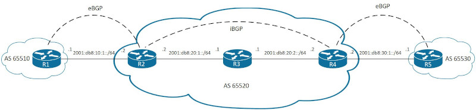<br>

配置过程(如图9)
```
ospfv3配置
R2(config)# ipv6 unicast-routing
R2(config)# router ospfv3 1
R2(config-router)# router-id 2.2.2.2
R2(config)# int f0/1
R2(config-if)# ipv6 add 2001:db8:20:1::2/64
R2(config-if)# no shutdown
R2(config-if)# ospfv3 1 ipv6 area 0

R3(config)# ipv6 unicast-routing
R3(config)# router ospfv3 1
R3(config-router)# router-id 3.3.3.3
R3(config)# int f0/0
R3(config-if)# ipv6 add 2001:db8:20:1::1/64
R3(config-if)# no shutdown
R3(config-if)# ospfv3 1 ipv6 area 0
R3(config)# int f0/1
R3(config-if)# ipv6 add 2001:db8:20:2::1/64
R3(config-if)# no shutdown
R3(config-if)# ospfv3 1 ipv6 area 0

R4(config)# ipv6 unicast-routing
R4(config)# router ospfv3 1
R4(config-router)# router-id 4.4.4.4
R4(config)# int f0/0
R4(config-if)# ipv6 add 2001:db8:20:2::2/64
R4(config-if)# no shutdown
R4(config-if)# ospfv3 1 ipv6 area 0


BGP配置
R1(config)# ipv6 unicast-routing
R1(config)# router bgp 65510
R1(config-router)# bgp router-id 1.1.1.1
R1(config-router)# no bgp default ipv4-unicast
R1(config-router)# neighbor 2001:db8:10:1::2 remote-as 65520
R1(config-router)# address-family ipv6
R1(config-router-af)# neighbor 2001:db8:10:1::2 activate
R1(config-router-af)# network 2001:db8:10:1::/64
R1(config)# int f0/0
R1(config-if)# ipv6 add 2001:db8:10:1::1/64
R1(config-if)# no shutdown

R2(config)# router bgp 65520
R2(config-router)# bgp router-id 2.2.2.2
R2(config-router)# no bgp default ipv4-unicast
R2(config-router)# neighbor 2001:db8:10:1::1 remote-as 65510
R2(config-router)# neighbor 2001:db8:20:2::2 remote-as 65520
R2(config-router)# address-family ipv6
R2(config-router-af)# neighbor 2001:db8:10:1::1 activate
R2(config-router-af)# neighbor 2001:db8:20:2::2 activate
R2(config-router-af)# network 2001:db8:10:1::/64
R2(config-router-af)# network 2001:db8:20:1::/64
R2(config-router-af)# network 2001:db8:20:2::/64
R2(config)# int f0/0
R2(config-if)# ipv6 add 2001:db8:10:1::2/64
R2(config-if)# no shutdown

R4(config)# router bgp 65520
R4(config-router)# bgp router-id 4.4.4.4
R4(config-router)# no bgp default ipv4-unicast
R4(config-router)# neighbor 2001:db8:30:1::1 remote-as 65530
R4(config-router)# neighbor 2001:db8:20:1::2 remote-as 65520
R4(config-router)# address-family ipv6
R4(config-router-af)# neighbor 2001:db8:30:1::1 activate
R4(config-router-af)# neighbor 2001:db8:20:1::2 activate
R4(config-router-af)# network 2001:db8:30:1::/64
R4(config-router-af)# network 2001:db8:20:1::/64
R4(config-router-af)# network 2001:db8:20:2::/64
R4(config)# int f0/1
R4(config-if)# ipv6 add 2001:db8:30:1::2/64
R4(config-if)# no shutdown

R5(config)# ipv6 unicast-routing
R5(config)# router bgp 65530
R5(config-router)# bgp router-id 5.5.5.5
R5(config-router)# no bgp default ipv4-unicast
R5(config-router)# neighbor 2001:db8:30:1::2 remote-as 65520
R5(config-router)# address-family ipv6
R5(config-router-af)# neighbor 2001:db8:30:1::2 activate
R5(config-router-af)# network 2001:db8:30:1::/64
R5(config)# int f0/0
R5(config-if)# ipv6 add 2001:db8:30:1::1/64
R5(config-if)# no shutdown

** BGP multi-hop internal peer需要配置静态路由或通过IGP建立, 默认路由不适用
** AS 65520为transit AS, 一般应用于Service Provider, 而不在个人机构使用
```
<br>
<br>


BGP ipv6路由汇总<br>
汇总配置语法
```
(config-router-af)# aggregate-address <prefix>/<prefix_length> [summary-only] [as-set]
```
<br>
<br>

#### 条件匹配方式
##### 1.extend ACL
```
(config)# ip access-list extended {<acl_num> | <acl_name>}
(config-ext-nacl)# [<sequence>] {permit | deny} <protocol> <source> <source_wildcard> <destination> <destination_wildcard>
sequence
未指定时, 自动按步进5进行递增

source
Network ID的bits模式

source_wildcard
使用wildcard模式, 指定Network ID可活动的bits. bit值为1代表可活动, 为0代表固定

destination
掩码的bits长度

destination_wildward
使用wildward模式, 指定掩码可活动的bits. bit值为1代表可活动, 为0代表固定

例:
192.168.0.0 0.0.255.255 255.255.255.0 0.0.0.255
代表network ID为192.168.x.x, 并且子网掩码位于24到32之间的网络

** 192.168.0.0 0.0.255.255 255.255.255.0 0.0.0.0
与
192.168.0.0 0.0.255.255 host 255.255.255.0
含义一致
```
<br>

##### 2.prefix list
```
(config)# {ip | ipv6} prefix-list <prefix_list_name> [seq <sequence_number>] {permit | deny} <high_order_bit_pattern>/<high_order_bit_count> [ge <ge_value>] [le <le_value>]
seq
未指定时, 自动按步进5进行递增

high_order_bit_pattern
Network ID的bits模式

high_order_bit_count
固定的bits数量

ge_value
网络掩码的最小长度

le_value
网络掩码的最大长度

** prefix list最后包含一个隐式deny all

例:
192.168.0.0/13 ge 24 le 28
代表网络的前13 bits与二进制位11000000 10101|000 00000000 00000000的前13 bits完全一致, 并且子网掩码在24与28之间的网络


# show ip prefix-list
```
<br>

##### 3.AS PATH ACL(Regular Expression)<br>
根据AS PATH查询符合的结果. 查询语句:<br>
`show bgp {ipv4 | ipv6} unicast regexp <re_pattern>`
<br>

RE符号
|符号   |描述                                          |
|---    |---                                           |
|_      |匹配一个空格                                  |
|^      |匹配字符串的起始                              |
|$      |匹配字符串的结尾                              |
|[]     |从多个字符中选取出一个字符                    |
|[-]    |从多个连续字符中选取出一个字符                |
|[^]    |对多个字符序列取反, 并在结果中选取出一个字符  |
|()     |子匹配模式                                    |
|\|     |从多个字符串中匹配一个字符串                  |
|.      |匹配任意一个字符(包括空格)                    |
|*      |从前一个字符或子匹配中, 匹配0次或多次         |
|+      |从前一个字符或子匹配中, 匹配1次或多次         |
|?      |从前一个字符或子匹配中, 匹配0次或1次          |

<br>
<br>

RE example
|RE         |Meaning                           |
|---        |---                               |
|^$         |当前AS生成的路由                  |
|_200$      |从AS 200生成的路由                |
|^200\_      |从邻居AS 200传递过来的路由        |
|\_200\_      |经过了AS 200的路由                |

<br>
<br>

AS PATH ACL配置语法
```
(config)# ip as-path access-list <acl_num> {permit | deny} <as_path_pattern>

acl_num
AS PATH ACL的序列号范围为1-500

as_path_pattern
使用正则表达式匹配AS PATH

** AS path ACL最后包含一个隐式deny all
```
<br>
<br>

图10<br>
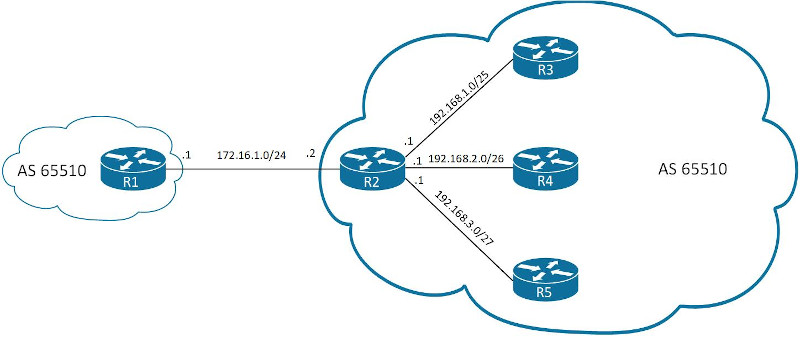<br>

配置过程(如图10)
```
R1(config)# int f0/0
R1(config-if)# ip add 172.16.1.1 255.255.255.0
R1(config-if)# no shutdown
R1(config)# router bgp 65510
R1(config-router)# bgp router-id 1.1.1.1
R1(config-router)# neighbor 172.16.1.2 remote-as 65520
R1(config-router)# network 172.16.1.0 mask 255.255.255.0

R2(config)# int f0/0
R2(config-if)# ip add 172.16.1.2 255.255.255.0
R2(config-if)# no shutdown
R2(config)# int f0/1
R2(config-if)# ip add 192.168.1.1 255.255.255.128
R2(config-if)# no shutdown
R2(config)# int f1/0
R2(config-if)# ip add 172.16.2.1 255.255.255.192
R2(config-if)# no shutdown
R2(config)# int f1/1
R2(config-if)# ip add 172.16.3.1 255.255.255.224
R2(config-if)# no shutdown
R2(config)# router bgp 65520
R2(config-router)# bgp router-id 2.2.2.2
R2(config-router)# neighbor 172.16.1.1 remote-as 65510
R2(config-router)# network 172.16.1.0 mask 255.255.255.0
R2(config-router)# network 192.168.1.0 mask 255.255.255.128
R2(config-router)# network 192.168.2.0 mask 255.255.255.192
R2(config-router)# network 192.168.3.0 mask 255.255.255.224
```
<br>

图11<br>
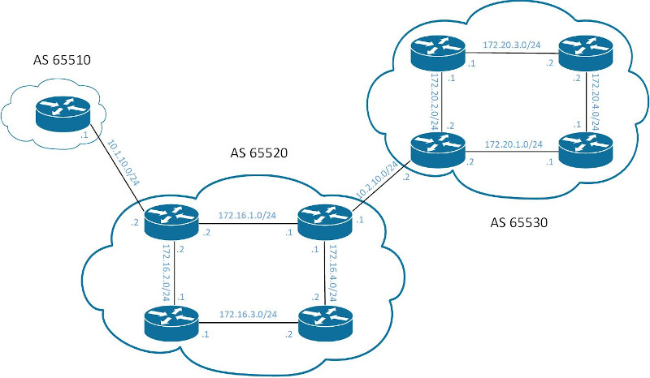<br>

配置过程(如图11)
```
配置OSPF:
R2(config)# router ospf 1
R2(config)# router-id 2.2.2.2
R2(config)# int f0/0
R2(config-if)# ip add 10.1.10.2 255.255.255.0
R2(config-if)# no shutdown
R2(config)# int f0/1
R2(config-if)# ip add 172.16.1.2 255.255.255.0
R2(config-if)# no shutdown
R2(config-if)# ip ospf 1 area 0
R2(config)# int f1/0
R2(config-if)# ip add 172.16.2.2 255.255.255.0
R2(config-if)# no shutdown
R2(config-if)# ip ospf 1 area 0

R3(config)# router opsf 1
R3(config-router)# router-id 3.3.3.3
R3(config)# int f0/0
R3(config-if)# ip add 172.16.1.1 255.255.255.0
R3(config-if)# no shutdown
R3(config-if)# ip ospf 1 area 0
R3(config)# int f0/1
R3(config-if)# ip add 172.16.4.1 255.255.255.0
R3(config-if)# no shutdown
R3(config-if)# ip ospf 1 area 0
R3(config)# int f1/0
R3(config-if)# ip add 10.2.10.1 255.255.255.0
R3(config-if)# no shutdown

R4(config)# router ospf 1
R4(config-router)# router-id 4.4.4.4
R4(config)# int f0/0
R4(config-if)# ip add 172.16.2.1 255.255.255.0
R4(config-if)# no shutdown
R4(config-if)# ip ospf 1 area 0
R4(config)# int f0/1
R4(config-if)# ip add 172.16.3.1 255.255.255.0
R4(config-if)# no shutdown
R4(config-if)# ip ospf 1 area 0

R5(config)# router ospf 1
R5(config-router)# router-id 5.5.5.5
R5(config)# int f0/0
R5(config-if)# ip add 172.16.4.2 255.255.255.0
R5(config-if)# no shutdown
R5(config-if)# ip ospf 1 area 0
R5(config)# int f0/1
R5(config-if)# ip add 172.16.3.2 255.255.255.0
R5(config-if)# no shutdown
R5(config-if)# ip ospf 1 area 0

R6(config)# router opsf 1
R6(config-router)# router-id 6.6.6.6
R6(config)# int f0/0
R6(config-if)# ip add 10.2.10.2 255.255.255.0
R6(config-if)# no shutdown
R6(config)# int f0/1
R6(config-if)# ip add 172.20.2.2 255.255.255.0
R6(config-if)# no shutdown
R6(config-if)# ip ospf 1 area 0
R6(config)# int f1/0
R6(config-if)# ip add 172.20.1.2 255.255.255.0
R6(config-if)# no shutdown
R6(config-if)# ip ospf 1 area 0

R7(config)# router ospf 1
R7(config-router)# router-id 7.7.7.7
R7(config)# int f0/0
R7(config-if)# ip add 172.20.2.1 255.255.255.0
R7(config-if)# no shutdown
R7(config-if)# ip ospf 1 area 0
R7(config)# int f0/1
R7(config-if)# ip add 172.20.3.1 255.255.255.0
R7(config-if)# no shutdown
R7(config-if)# ip ospf 1 area 0

R8(config)# router ospf 1
R8(config-router)# router-id 8.8.8.8
R8(config)# int f0/0
R8(config-if)# ip add 172.20.3.2 255.255.255.0
R8(config-if)# no shutdown
R8(config-if)# ip ospf 1 area 0
R8(config)# int f0/1
R8(config-if)# ip add 172.20.4.2 255.255.255.0
R8(config-if)# no shutdown
R8(config-if)# ip ospf 1 area 0

R9(config)# router ospf 1
R9(config-router)# router-id 9.9.9.9
R9(config)# int f0/0
R9(config-if)# ip add 172.20.1.1 255.255.255.0
R9(config-if)# no shutdown
R9(config-if)# ip ospf 1 area 0
R9(config)# int f0/1
R9(config-if)# ip add 172.20.4.1 255.255.255.0
R9(config-if)# no shutdown
R9(config-if)# ip ospf 1 area 0


BGP配置
R1(config)# int f0/0
R1(cofnig-if)# ip add 10.1.10.1 255.255.255.0
R1(config-if)# no shutdown
R1(config)# router bgp 65510
R1(config-router)# bgp router-id 1.1.1.1
R1(config-router)# neighbor 10.1.10.2 remote-as 65520
R1(config-router)# network 10.1.10.0 mask 255.255.255.0

R2(config)# router bgp 65520
R2(config-router)# bgp router-id 2.2.2.2
R2(config-router)# neighbor 10.1.10.1 remote-as 65510
R2(config-router)# neighbor 172.16.1.1 remote-as 65520
R2(config-router)# network 10.1.10.0 mask 255.255.255.0
R2(config-router)# network 172.16.1.0 mask 255.255.255.0
R2(config-router)# network 172.16.2.0 mask 255.255.255.0
R2(config-router)# network 172.16.3.0 mask 255.255.255.0
R2(config-router)# network 172.16.4.0 mask 255.255.255.0

R3(config)# router bgp 65520
R3(config-router)# bgp router-id 3.3.3.3
R3(config-router)# neighbor 10.2.10.2 remote-as 65530
R3(config-router)# neighbor 172.16.1.2 remote-as 65520
R3(config-router)# network 10.2.10.0 mask 255.255.255.0
R3(config-router)# network 172.16.1.0 mask 255.255.255.0
R3(config-router)# network 172.16.2.0 mask 255.255.255.0
R3(config-router)# network 172.16.3.0 mask 255.255.255.0
R3(config-router)# network 172.16.4.0 mask 255.255.255.0

R6(config)# router bgp 65530
R6(config-router)# bgp router-id 6.6.6.6
R6(config-router)# neighbor 10.2.10.1 remote-as 65520
R6(config-router)# network 10.2.10.0 mask 255.255.255.0
R6(config-router)# network 172.20.1.0 mask 255.255.255.0
R6(config-router)# network 172.20.2.0 mask 255.255.255.0
R6(config-router)# network 172.20.3.0 mask 255.255.255.0
R6(config-router)# network 172.20.4.0 mask 255.255.255.0
```
<br>

#### 流量筛选方式
##### 1.distribute list
distribute list配置语法
```
(config-router)# neighbor <ip_addr> distribute-list {<acl_num> | <acl_name>} {in | out}
```
<br>

```
如图5
配置distribute list之前
R1# show bgp ipv4 unicast | begin Network
     Network          Next Hop            Metric LocPrf Weight Path
 *   172.16.1.0/24    172.16.1.2               0             0 65520 i
 *>                   0.0.0.0                  0         32768 i
 *>  192.168.1.0/25   172.16.1.2               0             0 65520 i
 *>  192.168.2.0/26   172.16.1.2               0             0 65520 i
 *>  192.168.3.0/27   172.16.1.2               0             0 65520 i


配置distribute list之后
R1(config)# ip access-list extended TEST
R1(config-ext-nacl)# 5 permit ip 192.168.0.0 0.0.255.0 255.255.255.0 0.0.0.192
R1(config)# router bgp 65510
R1(config-router)# neighbor 172.16.1.2 distribute-list TEST in
R1# clear bgp ipv4 unicast * soft

R1# show bgp ipv4 unicast | begin Network
     Network          Next Hop            Metric LocPrf Weight Path
 *>  172.16.1.0/24    0.0.0.0                  0         32768 i
 *>  192.168.1.0/25   172.16.1.2               0             0 65520 i
 *>  192.168.2.0/26   172.16.1.2               0             0 65520 i
```
<br>

##### 2.prefix list
prefix list配置语法
```
(config-router)# neighbor <ip_addr> prefix-list <prefix_list_name> {in | out}
```
<br>

```
如图5
配置prefix list之前
R1# show bgp ipv4 unicast | begin Network
     Network          Next Hop            Metric LocPrf Weight Path
 *   172.16.1.0/24    172.16.1.2               0             0 65520 i
 *>                   0.0.0.0                  0         32768 i
 *>  192.168.1.0/25   172.16.1.2               0             0 65520 i
 *>  192.168.2.0/26   172.16.1.2               0             0 65520 i
 *>  192.168.3.0/27   172.16.1.2               0             0 65520 i


配置prefix list之后
R1(config)# ip prefix-list TEST seq 5 permit 192.168.0.0/16 ge 25 le 26
R1(config)# router bgp 65510
R1(config-router)# neighbor 172.16.1.2 prefix-list TEST in
R1# clear bgp ipv4 unicast * soft

R1# show bgp ipv4 unicast | begin Network
     Network          Next Hop            Metric LocPrf Weight Path
 *>  172.16.1.0/24    0.0.0.0                  0         32768 i
 *>  192.168.1.0/25   172.16.1.2               0             0 65520 i
 *>  192.168.2.0/26   172.16.1.2               0             0 65520 i
```
<br>

##### 3.AS path ACL
AS path ACL配置语法
```
(config-router)# neighbor <ip_addr> filter-list <acl_number> {in | out}
```
<br>

```
如图6
配置AS path ACL之前
R1# show bgp ipv4 unicast | begin Network
     Network          Next Hop            Metric LocPrf Weight Path
 *   10.1.10.0/24     10.1.10.2                0             0 65520 i
 *>                   0.0.0.0                  0         32768 i
 *>  10.2.10.0/24     10.1.10.2                              0 65520 i
 *>  172.16.1.0/24    10.1.10.2                0             0 65520 i
 *>  172.16.2.0/24    10.1.10.2                0             0 65520 i
 *>  172.16.3.0/24    10.1.10.2                2             0 65520 i
 *>  172.16.4.0/24    10.1.10.2                2             0 65520 i
 *>  172.20.1.0/24    10.1.10.2                              0 65520 65530 i
 *>  172.20.2.0/24    10.1.10.2                              0 65520 65530 i
 *>  172.20.3.0/24    10.1.10.2                              0 65520 65530 i
 *>  172.20.4.0/24    10.1.10.2                              0 65520 65530 i


配置AS path ACL之后
R2(config)# ip as-path access-list 1 permit ^$
R2(config)# router bgp 65520
R2(config-router)# neighbor 10.1.10.1 filter-list 1 out

R1# show bgp ipv4 unicast | begin Network
     Network          Next Hop            Metric LocPrf Weight Path
 *   10.1.10.0/24     10.1.10.2                0             0 65520 i
 *>                   0.0.0.0                  0         32768 i
 *>  10.2.10.0/24     10.1.10.2                              0 65520 i
 *>  172.16.1.0/24    10.1.10.2                0             0 65520 i
 *>  172.16.2.0/24    10.1.10.2                0             0 65520 i
 *>  172.16.3.0/24    10.1.10.2                2             0 65520 i
 *>  172.16.4.0/24    10.1.10.2                2             0 65520 i
```
<br>

##### 4.Route Map
route map配置语法:
```
(config)# route-map <route_map_name> [permit | deny] [<sequence_num>]
(config-route-map)# {<match_statement> | <set_statement>} | <description_statement>

(config-router)# neighbor <ip_addr> route-map <route_map_name> {in | out}
```
<br>

match_statement列表
|match command                |Description                            |
|---                          |---                                    |
|match as-path <acl_num>      |使用AS PATH ACL对AS PATH进行筛选       |
|match ip address {<acl_num> \| <acl_name>|使用ACL对IP进行过滤         |
|match ip address prefix-list <prefix_list_name|使用prefix list对IP进行过滤|
|match local-preference <local-preference>|根据BGP属性LOCAL_PREF进行过滤|
|match metric {1-4294967295 \| external 1-4294967295} [+- deviation]|根据MULTI_EXIT_DISC进行过滤, 并可以指定误差|
|match tag <tag_value>|根据tag进行过滤|

<br>
<br>

set_statement列表
|set command                 |Description                            |
|---                         |---                                    |
|set as-path prepend {<as_num_pattern> \| last-as 1-10}|在AS PATH添加指定ASN|
|set ip next-hop {<ip_addr> \| peer-address \| self}|设置下一跳|
|set local-preference <0-4294967295>|设置LOCAL_PREF值|
|set metric {+value \| -value \| value}|修改或设置MULTI_EXIT_DISC值|
|set origin {igp \| incomplete}|设置origin属性|
|set tag <tag_value>|设置tag属性|
|set weight <0-65535>|设置weight属性|

<br>
<br>

|route-map规则:|
|:---|
|1.如果permit/deny没有指定, 默认为permit|
|2.如果sequence没有指定, 默认以步进10进行增长|
|3.如果没有指定match语句, 则默认为all prefix|
|4.如果最后没有'permit, 并且permit下不包含match(all prefix)'的内容, 默认为deny all|
|5.match后可指定多个具体编号或值, 但逻辑为or|
|6.如果一条route-map语句环境内包含多个match/set语句, 则逻辑为and|

<br>
<br>

route map与extend ACL结合的复杂性
```
ip access-list extended ACL-ONE
deny 172.16.1.0 0.0.0.0 255.255.255.0 0.0.0.0
permit 172.16.0.0 0.0.0.0 255.255.0.0 0.0.0.0

route-map EXAMPLE permit 10
match ip address ACL-ONE

route-map EXAMPLE permit 20
set metric 20

extended ACL的
deny 172.16.1.0 0.0.0.0 255.255.255.0 0.0.0.0
并不会应用在route map中进行流量过滤, 而是作为
permit 172.16.0.0 0.0.0.0 255.255.0.0 0.0.0.0
的子网, 从sequence 10中被match剔除, 即172.16.1.0/24不被sequence 10匹配, 而是被后续的sequence 20匹配
```
<br>

route map中的continue关键字
```
route-map EXAMPLE permit 10
match ip address ACL-ONE
set metric 20
continue

route-map EXAMPLE permit 20
match ip address ACL-TWO
set ip next-hop 10.12.1.1

route-map EXAMPLE permit 30
set ip next-hop 10.13.1.3


当一个网络位于ACL-ONE中, 即被sequence 10匹配中, 执行完sequence 10中的mathch/set语句后, 不会再进行后续匹配; 如果在sequence 10最后加入continue关键字, 会依旧进行后续sequence

** continue会增加route map复杂性, 不建议使用
```
<br>

```
如图6
配置route map之前
R1# show bgp ipv4 unicast | begin Network
     Network          Next Hop            Metric LocPrf Weight Path
 *   10.1.10.0/24     10.1.10.2                0             0 65520 i
 *>                   0.0.0.0                  0         32768 i
 *>  10.2.10.0/24     10.1.10.2                              0 65520 i
 *>  172.16.1.0/24    10.1.10.2                0             0 65520 i
 *>  172.16.2.0/24    10.1.10.2                0             0 65520 i
 *>  172.16.3.0/24    10.1.10.2                2             0 65520 i
 *>  172.16.4.0/24    10.1.10.2                2             0 65520 i
 *>  172.20.1.0/24    10.1.10.2                              0 65520 65530 i
 *>  172.20.2.0/24    10.1.10.2                              0 65520 65530 i
 *>  172.20.3.0/24    10.1.10.2                              0 65520 65530 i
 *>  172.20.4.0/24    10.1.10.2                              0 65520 65530 i


配置route map之后
R1(config)# ip prefix-list SET_METRIC permit 172.16.0.0/22 ge 24
R1(config)# ip prefix-list FILTER permit 172.20.2.0/23 ge 24
R1(config)# route-map TRAFFIC_REFRESH permit 10
R1(config-route-map)# match ip address prefix-list SET_METRIC
R1(config-route-map)# set metric 200
R1(config)# route-map TRAFFIC_REFRESH deny 20
R1(config-route-map)# match ip address prefix-list FLITER
R1(config)# route-map TRAFFIC_REFRESH permit 30
R1(config)# router bgp 65510
R1(config-router)# neighbor 10.1.10.2 route-map TRAFFIC_REFRESH in
R1# clear bgp ipv4 unicast * soft

R1#show bgp ipv4 unicast | begin Network
     Network          Next Hop            Metric LocPrf Weight Path
 *   10.1.10.0/24     10.1.10.2                0             0 65520 i
 *>                   0.0.0.0                  0         32768 i
 *>  10.2.10.0/24     10.1.10.2                              0 65520 i
 *>  172.16.1.0/24    10.1.10.2              200             0 65520 i
 *>  172.16.2.0/24    10.1.10.2              200             0 65520 i
 *>  172.16.3.0/24    10.1.10.2              200             0 65520 i
 *>  172.16.4.0/24    10.1.10.2                2             0 65520 i
 *>  172.20.1.0/24    10.1.10.2                              0 65520 65530 i
 *>  172.20.4.0/24    10.1.10.2                              0 65520 65530 i
```
<br>

清除peer缓存
```
# clear bgp ipv4 unicast <ip_addr> [soft]

可使用*代替IP地址, 清除所有peers的缓存
```
<br>
<br>

BGP路径选择
```
BGP选择最佳路径顺序:
1.选择prefix length更长的

2.根据PATH ATTRIBUTE(PA)进行衡量, 考量顺序如下:
    1)WEIGHT
        仅当前路由器有效的2 bytes内容, 值高的获胜. 如图6
        R2#show bgp ipv4 unicast 10.1.10.0/24
        BGP routing table entry for 10.1.10.0/24, version 3
        Paths: (2 available, best #1, table default)
          Advertised to update-groups:
             2          4         
          Refresh Epoch 1
          Local
            0.0.0.0 from 0.0.0.0 (2.2.2.2)
              Origin IGP, metric 0, localpref 100, weight 32768, valid, sourced, local, best
              rx pathid: 0, tx pathid: 0x0
          Refresh Epoch 3
          65510
            10.1.10.1 from 10.1.10.1 (1.1.1.1)
              Origin IGP, metric 0, localpref 100, valid, external
              rx pathid: 0, tx pathid: 0

    2)LOCAL_PREF
        值高的获胜

    3)Local originated
        是否在当前AS内生成. 优先顺序如下:
        a)当前AS生成
        b)当前AS内聚合
        c)从BGP peer接收

    4)AIGP 

    5)AS_PATH
        短的path获胜

    6)ORIGIN
        优先顺序如下:
        a)IGP(通过network指定)
        b)EGP
        c)Incomplete(通过redistribute获取)

    7)MULTI_EXIT_DISC
        值小的获胜

    8)eBGP/iBGP
        优先级如下:
        a)eBGP peer
        b)confederation member AS peer(待定)
        c)iBGP peer
      
    9)Lowest IGP metric
        到达BGP路由器使用更短的IGP metric

    10)If both paths are external (eBGP), prefer the first (oldest)

    11)Prefer the route that comes from the BGP peer with the lower RID

    12)Prefer the route with the minimum cluster list length

    13)Prefer the path that comes from the lowest neighbor address(iBGP)
```
<br>
<br>

eBGP与iBGP的差别<br>
1.eBGP的TTL为1, iBGP的TTL为255<br>

2.eBGP的AD为20, iBGP的AD为200
<br>
<br>


引用:<br>
[1]IPv4 BGP(BGP-4): https://datatracker.ietf.org/doc/html/rfc4271

[2]IPv4 BGP usage: https://datatracker.ietf.org/doc/html/rfc1772

[3]BGP support for four-octet ASN: https://datatracker.ietf.org/doc/html/rfc4893

[4]IPv6 BGP: https://datatracker.ietf.org/doc/html/rfc4760
