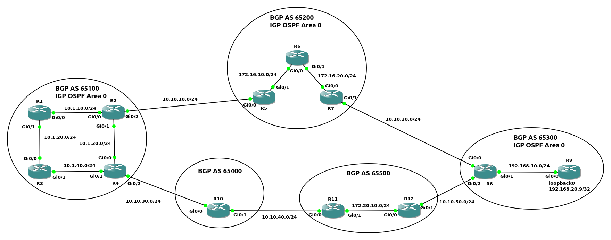

图1<br>
<br>

名词列表:<br>
AS(Autonomous System):<br>
位于单个机构控制下的所有路由器集合<br>
AS内部使用IGP进行路由, AS之间使用EGP进行路由<br>
机构连接上Internet需要获得ASN(AS Number)<br>
ASN最初版本为2 bytes, RFC 4893拓展到4 bytes<br>
private ASN:<br>
&emsp;&emsp;2 bytes: 64,512 - 65,535<br>
&emsp;&emsp;4 bytes: 4,200,000,000 - 4,294,967,294<br>
只能使用IANA/ISP提供的公有ASN, 或使用私有ASN, 使用其他机构的ASN容易导致信息丢失和通讯混乱
<br>
<br>

BGP(Border Gateway Protocol):<br>
BGP属于EGP(Exterior Gateway Protocol)<br>
BGP用于在AS之间进行通信<br>
BGP使用TCP作为传输层协议, 并且使用TCP 179端口侦听<br>
位于AS边界的, 与其他AS通信的router, 称为BGP speaker<br>
不同AS之间的BGP speaker通信使用eBGP, 同一AS内的BGP speaker通信使用iBGP<br>
BGP Identifier为4字节无符号整数, 为某个IPv4值, 用于标识发送BGP信息的路由器
<br>
<br>

BGP peer类型:<br>
1.按AS划分<br>
1)eBGP<br>
与不同AS的路由器组成peer<br>

2)iBGP<br>
与同一个AS内的路由器组成peer<br>
** 当前路由器从iBGP peer接收到的NLRI, 不会再转发给其他iBGP peer
<br>
<br>

2.按hop划分<br>
1)single hop peer<br>
连接到同一个子网的peer<br>

2.multi hop peer<br>
不在同一个子网内的peer, 需要通过IGP或静态路由到达peer(不能通过默认路由)<br>
iBGP才使用该类型<br>
实现依赖于TCP
<br>
<br>

消息格式<br>
1.所有消息类型统一BGP header格式
```
0                   1                   2                   3
0 1 2 3 4 5 6 7 8 9 0 1 2 3 4 5 6 7 8 9 0 1 2 3 4 5 6 7 8 9 0 1
+-+-+-+-+-+-+-+-+-+-+-+-+-+-+-+-+-+-+-+-+-+-+-+-+-+-+-+-+-+-+-+-+
|                                                               |
+                                                               +
|                                                               |
+                                                               +
|                           Marker                              |
+                                                               +
|                                                               |
+-+-+-+-+-+-+-+-+-+-+-+-+-+-+-+-+-+-+-+-+-+-+-+-+-+-+-+-+-+-+-+-+
|          Length               |      Type     |
+-+-+-+-+-+-+-+-+-+-+-+-+-+-+-+-+-+-+-+-+-+-+-+-+

Marker
16 bytes, 用于兼容, 所有bits置1

Length
2 bytes, 无符号整数, 消息的总长度(包含header长度), 长度单位为bytes
长度范围限制在19~4096 bytes

Type
1 byte, 无符号整数, 指定消息类型. 列表如下:
    1 - OPEN
    2 - UPDATE
    3 - NOTIFICATION
    4 - KEEPALIVE
```
<br>

2.消息类型<br>
1)OPEN Message<br>
TCP连接建立后, 发送的第一个消息. 并且如果接收到OPEN Message并接受, 回复KEEPALIVE Message<br>

OPEN Message消息结构
```
0                   1                   2                   3
0 1 2 3 4 5 6 7 8 9 0 1 2 3 4 5 6 7 8 9 0 1 2 3 4 5 6 7 8 9 0 1
+-+-+-+-+-+-+-+-+
|    Version    |
+-+-+-+-+-+-+-+-+-+-+-+-+-+-+-+-+
|     My Autonomous System      |
+-+-+-+-+-+-+-+-+-+-+-+-+-+-+-+-+
|           Hold Time           |
+-+-+-+-+-+-+-+-+-+-+-+-+-+-+-+-+-+-+-+-+-+-+-+-+-+-+-+-+-+-+-+-+
|                         BGP Identifier                        |
+-+-+-+-+-+-+-+-+-+-+-+-+-+-+-+-+-+-+-+-+-+-+-+-+-+-+-+-+-+-+-+-+
| Opt Parm Len  |
+-+-+-+-+-+-+-+-+-+-+-+-+-+-+-+-+-+-+-+-+-+-+-+-+-+-+-+-+-+-+-+-+
|                                                               |
|             Optional Parameters (variable)                    |
|                                                               |
+-+-+-+-+-+-+-+-+-+-+-+-+-+-+-+-+-+-+-+-+-+-+-+-+-+-+-+-+-+-+-+-+

Version
1 byte, 无符号整数, 标识协议版本号, 当前BGP版本为4

My Autonomous System
2 bytes, 无符号整数, 发送该消息router的ASN

Hold Time
2 bytes, 无符号整数, 接收者从自己的Hold Time配置和OPEN Message消息收到的值, 取较小值作为自己的Hold Timer
当接收到UPDATE和KEEPALIVE消息时, hold timer重置为初始值
当hold timer达到0时, neighbor移除
Cisco默认值为180s

BGP Identifier
4 bytes, 无符号整数, BGP speaker的某个IPv4值, 在router启动时确定

Opt Parm Len
1 byte, 无符号整数, 代表后续所有可选参数的总长度, 长度单位为bytes

Optional Parameters
可选参数, 可指定多个可选参数, 每个可选参数包含以下字段:
    Parm Type - 1 byte
    Parm Length - 1 byte
    Parameter Value - variable length
```
<br>

2)UPDATE Message<br>
在BGP peer之间传输路由信息

UPDATE Message格式
```
+-----------------------------------------------------+
|   Withdrawn Routes Length (2 octets)                |
+-----------------------------------------------------+
|   Withdrawn Routes (variable)                       |
+-----------------------------------------------------+
|   Total Path Attribute Length (2 octets)            |
+-----------------------------------------------------+
|   Path Attributes (variable)                        |
+-----------------------------------------------------+
|   Network Layer Reachability Information (variable) |
+-----------------------------------------------------+

Withdrawn Routes Length
2 bytes, 无符号整数, 后续Withdrawn Routes字段的长度, 长度单位为bytes

Withdrawn Routes
可变长度, 指定不可用的路由列表. 每个路由项内容如下:
    Length - 1 byte, 指定后续Prefix字段的长度, 单位为bits
    Prefix - 可变长度, IP地址的前置网络位, 需要字节对齐, 内容的bits不是8的整数倍时, 需要填充内容对齐

Total Path Attribute Length
2 bytes, 无符号整数, 后续Path Attributes的长度, 长度单位为bytes

Path Attributes
可变长度, 为路径属性列表. Path Attributes归类参考表1. 每条路径属性包含内容如下:
    attribute type - 2 bytes, 由以下内容构成:
        attr flags - 1 byte, 构成内容如下:
            bit 0 - attribute为optional(1) or well-known(0)
            bit 1 - 对于optional attribute, transitive(1) or non-transitive(0); 对于well-known attribute, 必须为1
            bit 2 - 对于optional transitive attribute, partial(1, 不能识别出) or complete(0, 能识别出); 对于optional non-transitive和well-known attribute, 必须为1
            bit 3 - Extended Length bit, attribute length is 1-byte(0) or 2-bytes(1)
            bit 4~7 - 保留bits
        attr type code - 1 byte, 消息子类型代码. 具体参考表2
    attribute length - 用于指定后续attribute value的长度, 长度单位为bytes. 当attr flags的bit 3为0时, 当前字段为1 byte; 当bit 3为1时, 该字段字段为2 bytes
    attribute value - 与type code搭配, 消息子类型的值. 列表如下:
        a)ORIGIN - 参考表3
        b)AS_PATH - 由path segment的序列组成, 每个path segment的结构如下:
            0                   1
            0 1 2 3 4 5 6 7 8 9 0 1 2 3 4 5 
            +-+-+-+-+-+-+-+-+-+-+-+-+-+-+-+-+
            | path segment  | path segment  |
            |     type      |    length     |
            +-+-+-+-+-+-+-+-+-+-+-+-+-+-+-+-+
            |      path segment value       |
            |          (variable)           |
            +-+-+-+-+-+-+-+-+-+-+-+-+-+-+-+-+

            path segment type
            1 byte, 用于指定path segment的排列类型. 类型如下:
                1 - AS_SET, AS无序排列
                2 - AS_SEQUENCE, AS依次从最左侧添加到序列. 如: AS_SEQUENCE: 2 11 13, 表示先后依次经过AS13 11 2
            path segment length
            1 byte, 指定后续path segment value的AS的个数(1 byte length限制单个path segment的AS个数为255)
            path segment value
            ASN列表, 每个ASN占据2 bytes位置, 最多可以为255个, 即 510 bytes
        c)NEXT_HOP
        d)MULTI_EXIT_DISC
        e)LOCAL_PREF
        f)ATOMIC_AGGREGATE
        g)AGGREGATOR

Network Layer Reachability Information
可变长度, 为路由内容, 由一个或多个2-tuple组成. 2-tuple单元如下:
    +---------------------------+
    |   Length (1 octet)        |
    +---------------------------+
    |   Prefix (variable)       |
    +---------------------------+
    Length
    1 byte, 指定后续Prefix的bits数
    为0时, 代表Prefix可匹配任何IP地址
 
    Prefix
    指定IP的网络位, 并且由于字节边界, 当Prefix不是8的整数位时, 需要可能少的填充尾部, 达到边界对齐

** UPDATE Message的path attributes应该根据attr type code, 进行升序排序
** 最小的UPDATE Message的大小为23 bytes
```
<br>
<br>

表1 - Path Attributes classify
|Name|Supported by All BGP Implementations|Advertised Between Autonomous Systems|
|---|---|---|
|Well-known mandatory|Yes|Yes|
|Well-known discretionary|Yes|No|
|Optional transitive|No|Yes|
|Optional non-transitive|No|No|

<br>
<br>

表2 - Path Attributes Type code
|Type code|Type Name  |Classify     |Description                        |
|---      |---        |---          |---                                |
|1        |ORIGIN     |well-known mandatory|生成NLRI的BGP speaker|
|2        |AS_PATH    |well-known mandatory|NLRI信息通过的AS路径. 修改AS_PATH内容规则:<br>  1)当通告给internal peer时, 不应该修改AS_PATH<br>  2)当通告给external peer时, 如果AS_PATH的第一个路径段为AS_SEQUENCE类型, 将当前AS的ASN prepend到路径段; 如果上述操作导致路径段溢出(路径段AS容量255), 在AS_PATH prepend一个新的路径段, 并将ASN prepend到新路径段<br>  3)当通告给external peer时, 如果AS_PATH的第一个路径段为AS_SET类型, 在AS_PATH prepend一个新的AS_SEQUENCE类型的路径段, 并将当前AS的ASN prepend到新路径段<br>  4)当通告给external peer时, 如果AS_PATH为空, 在AS_PATH新建一个AS_SEQUENCE类型的路径段, 并将当前AS的ASN prepend到路径段|
|3        |NEXT_HOP   |well-known mandatory|能到达NLRI指定地址的下一跳. 规则如下:<br>  1)当发送非当前AS内生成route到internal peer时, 不应该修改该值<br>  2)当发送当前AS内生成route到internal peer时, 则选择发送的接口地址<br>  3)当发送到external peer时, 则选择发送的接口地址|
|4        |MULTI_EXIT_DISC|optional non-transitive|用于external peer有多条路径可达时, 使用4 bytes的度量单位metric, 值小的优先|
|5        |LOCAL_PREF|well-known discretionary|在iBGP间传播, eBGP之间不传播, 值大的优先|
|6        |ATOMIC_AGGREGATE|well-known discretionary|聚合后的网络, 是保留源AS_PATH(atomic), 还是从聚合位置所属AS作为起始, 参考aggregate-address的as-set参数|
|7        |AGGREGATOR|optional transitive|当前网络是否为聚合后的网络, 需要包含聚合所属AS和router-id|

<br>
<br>

表3 - ORIGIN的attribute value
|Attr Type Code|Attr Value|Description|
|---           |---       |---        |
|1             |0         |IGP, 路由从IGP或internal peer获得|
|1             |1         |EGP, 路由从external peer获得|
|1             |2         |INCOMPLETE, 路由由其他方式获得|

<br>
<br>

3)KEEPALIVE Message<br>
BGP不提供基于TCP的keep-alive机制, 只是用于维持与peer的连接, 防止hold timer过期 
默认发送间隔时间为holder time的1/3, 即Cisco的默认间隔发送时间为180 * 1/3 = 60s
消息长度只有19 bytes(BGP header长度)
<br>
<br>

4)NOTIFICATION Message<br>
检测到错误, 发送错误, 然后立即关闭与peer的连接<br>

NOTIFICATION Message格式
```
0                   1                   2                   3
0 1 2 3 4 5 6 7 8 9 0 1 2 3 4 5 6 7 8 9 0 1 2 3 4 5 6 7 8 9 0 1
+-+-+-+-+-+-+-+-+-+-+-+-+-+-+-+-+-+-+-+-+-+-+-+-+-+-+-+-+-+-+-+-+
| Error code    | Error subcode |   Data (variable)             |
+-+-+-+-+-+-+-+-+-+-+-+-+-+-+-+-+-+-+-+-+-+-+-+-+-+-+-+-+-+-+-+-+

Error code
1 byte, 无符号整数, 表示NOTIFICATION的类型

Error subcode
1 byte, 无符号整数, 每个Error code下更详细分类. 详细查看表4

Data
可变长度, 对NOTIFITION详细的描述, 以此诊断出问题

** 最小的NOTIFICATION Message长度为21 bytes
```

表4 - NOTIFICATION Message

图2<br>

<br>
<br>
<br>

BGP speaker告知路由不可用的方式:<br>
1.在update message添加withdrawn routes字段<br>

2.使用新路由替换update message的BLRI字段原内容<br>

3.关闭与peer的连接, 两个BGP speaker之间通告的所有路由不可用
<br>
<br>
<br>

BGP阻止链路环回的方法, 丢弃AS_PATH包含当前AS的ASN的包, 如下图<br>

图3<br>

<br>
<br>
<br>

图4<br>
<br>
BGP speaker的三种RIB(Routing Information Base):<br>
1.Adj-RIBs-In<br>
从peers的UPDATE messages接收到的通告内容<br>

2.Loc-RIB<br>
当前BGP speaker筛选的可用路由信息<br>

3.Adj-RIBs-Out<br>
当前BGP speaker筛选, 使用UPDATE messages发送给peers的通告内容
<br>
<br>
<br>

配置IPv4 BGP<br>
1.初始化BGP路由进程<br>
`(config)# router bgp <as_number>`
<br>

2.配置Router ID<br>
`(config-router)# bgp router-id <router_id>`<br>
** 当没有配置router-id时, 优先选用up状态的loopback接口地址最大的, 其次选用up状态的物理接口地址最大的
<br>

3.BGP peer的地址和ASN<br>
`(config-router)# neighbor <ip_add> remote-as <as_number>`
<br>

4.将指定网络(connected/static/IGP)加入BGP database(Loc-RIB)<br>
`(config-router)# network <network_id> mask <subnet_mask> [route-map <route_map_name>]`<br>
** 网络加入BGP database原理: 将global RIB中的connected/static/IGP路由与配置的network进行匹配(完全一致的精确匹配), 能匹配到结果则加入BGP database<br>
** 也可以通过redistribute获得AS内网络的NLRI<br>
** 参考示例1
<br>

5.redistribute其他网络到BGP<br>
`(config-router)# redistribute {ospf <process_id> | eigrp <as_number> | static | connected}`
<br>

*6.配置authentication<br>
`(config-router)# neighbor <ip_add> password <passwd>`
<br>

*7.配置Timer<br>
`(config-router)# neighbor <ip_add> timers <keepalive_timer> <hold_timer>`
<br>

*8.修改源为loopback接口<br>
`(config-router)# neighbor <foreign_loopback_add> update-source <local_lookback_interface>`<br>
** 参考示例3<br>

*9.传递信息给iBGP时, 修改next hop(默认不修改)<br>
`(config-router)# neighbor <foreign_loopback_add> next-hop-self [all]`<br>
** 携带all参数时, 传递给eBGP时也进行修改<br>
** 参考示例4
<br>
<br>
<br>

BGP简略信息<br>
`# show bgp ipv4 unicast summary`
<br>
<br>
<br>

BGP peer信息<br>
`# show bgp ipv4 unicast neighbors [<peer_addr>]`
<br>
<br>
<br>

图5<br>
<br>

示例1(如图5)
```
OSPF区域配置
R1(config)# router ospf 1
R1(config-router)# router-id 1.1.1.1
R1(config-router)# network 10.1.1.0 0.0.0.255 area 0

R3(config)# router ospf 1
R3(config-router)# router-id 3.3.3.3
R3(config-router)# network 10.1.0.0 0.0.255.255 area 0

R4(config)# router ospf 1
R4(config-router)# router-id 4.4.4.4
R4(config-router)# network 10.1.2.0 0.0.0.255 area 0

R5(config)# router ospf 1
R5(config-router)# router-id 5.5.5.5
R5(config-router)# network 10.1.3.0 0.0.0.255 area 0

R6(config)# router ospf 1
R6(config-router)# router-id 6.6.6.6  
R6(config-router)# network 10.1.4.0 0.0.0.255 area 0


R1与R11静态配置
R1(config)# ip route 10.2.2.0 255.255.255.0 10.2.1.10

R11(config)# ip route 10.2.1.0 255.255.255.0 10.2.2.10 


EIGRP区域配置
R2(config)# router eigrp 100
R2(config-router)# eigrp router-id 2.2.2.2
R2(config-router)# network 172.16.1.0 0.0.0.255 
R2(config-router)# network 172.16.2.0 0.0.0.255

R7(config)# router eigrp 100
R7(config-router)# eigrp router-id 7.7.7.7
R7(config-router)# network 172.16.1.0 0.0.0.255
R7(config-router)# network 172.16.3.0 0.0.0.255

R8(config)# router eigrp 100
R8(config-router)# eigrp router-id 8.8.8.8
R8(config-router)# network 172.16.2.0 0.0.0.255
R8(config-router)# network 172.16.4.0 0.0.0.255

R9(config)# router eigrp 100
R9(config-router)# eigrp router-id 9.9.9.9
R9(config-router)# network 172.16.3.0 0.0.0.255
R9(config-router)# network 172.16.4.0 0.0.0.255


OSPF与静态配置区域互通
R10(config)# ip route 10.1.0.0 255.255.248.0 10.2.1.1

R11(config)# ip route 10.1.0.0 255.255.248.0 10.2.2.10

R1(config)# router ospf 1
R1(config-router)# redistribute static
R1(config-router)# redistribute connected


BGP配置
R1(config)# router bgp 65100
R1(config-router)# bgp router-id 1.1.1.1
R1(config-router)# neighbor 183.10.1.2 remote-as 65200
R1(config-router)# redistribute connected
R1(config-router)# redistribute static
R1(config-router)# redistribute ospf 1

R2(config)# router bgp 65200
R2(config-router)# bgp router-id 2.2.2.2
R2(config-router)# neighbor 183.10.1.1 remote-as 65100
R2(config-router)# redistribute connected
R2(config-router)# redistribute eigrp
R2(config-router)# network 172.16.1.0 mask 255.255.255.0
R2(config-router)# network 172.16.3.0 mask 255.255.255.0


BGP包含三个table
1.Adj-RIB-in

2.Loc-RIB(BGP database)

3.Adj-RIB-out


R1 BGP database
R1# show bgp ipv4 unicast | begin Network                             
     Network          Next Hop            Metric LocPrf Weight Path
 *>  10.1.1.0/24      0.0.0.0                  0         32768 ?
 *>  10.1.2.0/24      10.1.1.3                 2         32768 ?
 *>  10.1.3.0/24      10.1.1.3                 2         32768 ?
 *>  10.1.4.0/24      10.1.1.3                 2         32768 ?
 *>  10.2.1.0/24      0.0.0.0                  0         32768 ?
 *>  10.2.2.0/24      10.2.1.10                0         32768 ?
 *>  172.16.1.0/24    183.10.1.2               0             0 65200 i
 *>  172.16.2.0/24    183.10.1.2               0             0 65200 ?
 *>  172.16.3.0/24    183.10.1.2           30720             0 65200 i
 *>  172.16.4.0/24    183.10.1.2           30720             0 65200 ?
 *   183.10.1.0/30    183.10.1.2               0             0 65200 ?
 *>                   0.0.0.0                  0         32768 ?

R2 BGP database
R2# show bgp ipv4 unicast | begin Network
     Network          Next Hop            Metric LocPrf Weight Path
 *>  10.1.1.0/24      183.10.1.1               0             0 65100 ?
 *>  10.1.2.0/24      183.10.1.1               2             0 65100 ?
 *>  10.1.3.0/24      183.10.1.1               2             0 65100 ?
 *>  10.1.4.0/24      183.10.1.1               2             0 65100 ?
 *>  10.2.1.0/24      183.10.1.1               0             0 65100 ?
 *>  10.2.2.0/24      183.10.1.1               0             0 65100 ?
 *>  172.16.1.0/24    0.0.0.0                  0         32768 i
 *>  172.16.2.0/24    0.0.0.0                  0         32768 ?
 *>  172.16.3.0/24    172.16.1.7           30720         32768 i
 *>  172.16.4.0/24    172.16.2.8           30720         32768 ?
 *>  183.10.1.0/30    0.0.0.0                  0         32768 ?
 *                    183.10.1.1               0             0 65100 ?


Field解析:
Network
安装到Loc-RIB的network prefix
当network prefix包含多条path时, 第二条及之后省略network prefix. 标记如下:
  * - 有效NLRI
  > - best path

Next Hop
下一跳地址
connected网络的值为0.0.0.0

Metric
MULTI_EXIT_DISC值, 使用注入Loc-RIB之前的metric值(connected/static/IGP的metric值)

Weight
当前AS内生成的NLRI为32768, 其他eBGP注入的为0

Path
? - 由IGP redistribute
! - 由network匹配获得
<AS_number> - 路由经过其他autonomous system


R1的通告给R2的prefix(Adj-RIB-out)
R1# show bgp ipv4 unicast neighbors 183.10.1.2 advertised-routes | begin Network       
     Network          Next Hop            Metric LocPrf Weight Path
 *>  10.1.1.0/24      0.0.0.0                  0         32768 ?
 *>  10.1.2.0/24      10.1.1.3                 2         32768 ?
 *>  10.1.3.0/24      10.1.1.3                 2         32768 ?
 *>  10.1.4.0/24      10.1.1.3                 2         32768 ?
 *>  10.2.1.0/24      0.0.0.0                  0         32768 ?
 *>  10.2.2.0/24      10.2.1.10                0         32768 ?
 *>  183.10.1.0/30    0.0.0.0                  0         32768 ?

Total number of prefixes 7


R2从R1接收的通告(Adj-RIB-int)
R2# show bgp ipv4 unicast neighbors 183.10.1.1 routes | begin Network    
     Network          Next Hop            Metric LocPrf Weight Path
 *>  10.1.1.0/24      183.10.1.1               0             0 65100 ?
 *>  10.1.2.0/24      183.10.1.1               2             0 65100 ?
 *>  10.1.3.0/24      183.10.1.1               2             0 65100 ?
 *>  10.1.4.0/24      183.10.1.1               2             0 65100 ?
 *>  10.2.1.0/24      183.10.1.1               0             0 65100 ?
 *>  10.2.2.0/24      183.10.1.1               0             0 65100 ?
 *   183.10.1.0/30    183.10.1.1               0             0 65100 ?

Total number of prefixes 7 


R1的BGP路由表
R1# show ip route bgp | begin Gateway
Gateway of last resort is not set

      172.16.0.0/24 is subnetted, 4 subnets
B        172.16.1.0 [20/0] via 183.10.1.2, 01:24:57
B        172.16.2.0 [20/0] via 183.10.1.2, 01:28:36
B        172.16.3.0 [20/30720] via 183.10.1.2, 01:28:06
B        172.16.4.0 [20/30720] via 183.10.1.2, 01:28:06

** BGP只通告best path给BGP peers
```
<br>
<br>

图6<br>
<br>
配置过程(如图6)
```
ospf配置
R2(config)# router ospf 1
R2(config-router)# router-id 2.2.2.2
R2(config)# int f0/1
R2(config-if)# ip add 172.16.10.2 255.255.255.0
R2(config-if)# no shutdown
R2(config-if)# ip ospf 1 area 0

R3(config)# router ospf 1
R3(config-router)# router-id 3.3.3.3
R3(config)# int f0/0
R3(config-if)# ip add 172.16.10.1 255.255.255.0
R3(config-if)# no shutdown
R3(config-if)# ip ospf 1 area 0
R3(config)# int f0/1
R3(config-if)# ip add 172.16.20.1 255.255.255.0
R3(config-if)# no shutdown
R3(config-if)# ip ospf 1 area 0

R4(config)# router ospf 1
R4(config-router)# router-id 4.4.4.4
R4(config)# int f0/0
R4(config-if)# ip add 172.16.20.2 255.255.255.0
R4(config-if)# no shutdown
R4(config-if)# ip ospf 1 area 0


BGP配置
R1(config)# router bgp 65510
R1(config-router)# bgp router-id 1.1.1.1
R1(config-router)# neighbor 10.1.10.2 remote-as 65520
R1(config)# int f0/0
R1(config-if)# ip add 10.1.10.1 255.255.255.0
R1(config-if)# no shutdown

R2(config)# router bgp 65520
R2(config-router)# bgp router-id 2.2.2.2
R2(config-router)# neighbor 10.1.10.1 remote-as 65510
R2(config-router)# neighbor 172.16.20.2 remote-as 65520
R2(config-router)# network 10.1.10.0 mask 255.255.255.0
R2(config-router)# network 172.16.10.0 mask 255.255.255.0
R2(config-router)# network 172.16.20.0 mask 255.255.255.0
R2(config)# int f0/0
R2(config-if)# ip add 10.1.10.2 255.255.255.0
R2(config-if)# no shutdown

R4(config)# router bgp 65520
R4(config-router)# bgp router-id 4.4.4.4
R4(config-router)# neighbor 10.2.10.1 remote-as 65530
R4(config-router)# neighbor 172.16.10.2 remote-as 65520
R4(config-router)# network 10.2.10.0 mask 255.255.255.0
R4(config-router)# network 172.16.10.0 mask 255.255.255.0
R4(config-router)# network 172.16.20.0 mask 255.255.255.0
R4(config)# int f0/1
R4(config-if)# ip add 10.2.10.2 255.255.255.0
R4(config-if)# no shutdown

R5(config)# router bgp 65530
R5(config-router)# bgp router-id 5.5.5.5
R5(config-router)# neighbor 10.2.10.2 remote-as 65520
R5(config)# int f0/0
R5(config-if)# ip add 10.2.10.1 255.255.255.0
R5(config-if)# no shutdown

** BGP multi-hop internal peer需要配置静态路由或通过IGP建立, 默认路由不适用
** AS 65520为transit AS, 一般应用于Service Provider, 而不在个人机构使用
```
<br>
<br>

图7<br>
<br>

示例2(如图7)
```
OSPF区域配置
R1(config-if)# router ospf 1
R1(config-router)# router-id 1.1.1.1
R1(config-router)# network 10.1.0.0 0.0.255.255 area 0

R2(config-if)# router ospf 1
R2(config-router)# router-id 2.2.2.2
R2(config-router)# network 10.1.0.0 0.0.255.255 area 0

R3(config-if)# router ospf 1
R3(config-router)# router-id 3.3.3.3
R3(config-router)# network 10.1.0.0 0.0.255.255 area 0


BGP配置
R1(config)# router bgp 65100
R1(config-router)# bgp router-id 1.1.1.1
R1(config-router)# neighbor 10.1.10.2 remote-as 65100
R1(config-router)# neighbor 10.1.20.3 remote-as 65100
R1(config-router)# neighbor 169.10.1.4 remote-as 65200
R1(config-router)# redistribute connected 
R1(config-router)# redistribute ospf 1

R2(config)# router bgp 65100
R2(config-router)# bgp router-id 2.2.2.2
R2(config-router)# neighbor 10.1.10.1 remote-as 65100
R2(config-router)# neighbor 10.1.30.3 remote-as 65100
R2(config-router)# neighbor 169.10.3.6 remote-as 65400
R2(config-router)# redistribute connected
R2(config-router)# redistribute ospf 1

R3(config)# router bgp 65100
R3(config-router)# bgp router-id 3.3.3.3
R3(config-router)# neighbor 10.1.20.1 remote-as 65100
R3(config-router)# neighbor 10.1.30.2 remote-as 65100 
R3(config-router)# neighbor 169.10.2.5 remote-as 65300
R3(config-router)# redistribute connected
R3(config-router)# redistribute ospf 1

R4(config)# router bgp 65200
R4(config-router)# bgp router-id 4.4.4.4
R4(config-router)# neighbor 169.10.1.1 remote-as 65100
R4(config-router)# redistribute connected

R5(config)# router bgp 65300
R5(config-router)# bgp router-id 5.5.5.5 
R5(config-router)# neighbor 169.10.2.3 remote-as 65100
R5(config-router)# redistribute connected

R6(config)# router bgp 65400
R6(config-router)# bgp router-id 6.6.6.6
R6(config-router)# neighbor 169.10.3.2 remote-as 65100
R6(config-router)# redistribute connected


查看R4的路由表
R4# show ip route | begin Gateway
Gateway of last resort is not set

      10.0.0.0/24 is subnetted, 3 subnets
B        10.1.10.0 [20/0] via 169.10.1.1, 00:18:29
B        10.1.20.0 [20/0] via 169.10.1.1, 00:18:29
B        10.1.30.0 [20/2] via 169.10.1.1, 00:18:29
      169.10.0.0/16 is variably subnetted, 4 subnets, 2 masks
C        169.10.1.0/24 is directly connected, FastEthernet0/0
L        169.10.1.4/32 is directly connected, FastEthernet0/0
B        169.10.2.0/24 [20/0] via 169.10.1.1, 00:18:29
B        169.10.3.0/24 [20/0] via 169.10.1.1, 00:18:29


当R1的f0/1接口出现故障, R1的邻接表和路由表
R1(config)# int f0/1
R1(config-if)# shutdown
R1# show bgp ipv4 unicast summary | begin Neighbor
Neighbor        V           AS MsgRcvd MsgSent   TblVer  InQ OutQ Up/Down  State/PfxRcd
10.1.10.2       4        65100      43      44       13    0    0 00:34:39        4
10.1.20.3       4        65100       0       0        1    0    0 00:03:38 Idle
169.10.1.4      4        65200      38      42       13    0    0 00:30:36        1

R1# show ip route | begin Gateway
Gateway of last resort is not set

      10.0.0.0/8 is variably subnetted, 4 subnets, 2 masks
C        10.1.10.0/24 is directly connected, FastEthernet0/0
L        10.1.10.1/32 is directly connected, FastEthernet0/0
O        10.1.20.0/24 [110/3] via 10.1.10.2, 00:07:58, FastEthernet0/0
O        10.1.30.0/24 [110/2] via 10.1.10.2, 00:44:37, FastEthernet0/0
      169.10.0.0/16 is variably subnetted, 3 subnets, 2 masks
C        169.10.1.0/24 is directly connected, FastEthernet1/0
L        169.10.1.1/32 is directly connected, FastEthernet1/0
B        169.10.3.0/24 [200/0] via 10.1.10.2, 00:36:31

分析:
由于R2从iBGP接收到169.10.2.0/24网络信息, 但是不能再传递给其他iBGP, 所以R1无法收到169.10.2.0/24网络信息

```
<br>
<br>

示例3, 重新配置, 使用Loopback接口作为neighbor地址(如图7)
```
R1/R2/R3配置loopback0接口
R1(config)# interface loopback0
R1(config-if)# ip add 172.16.10.1 255.255.255.255

R2(config)# interface loopback0
R2(config-if)# ip add 172.16.10.2 255.255.255.255

R3(config)# interface loopback0
R3(config-if)# ip add 172.16.10.3 255.255.255.255


OSPF区域配置
R1(config-if)# router ospf 1
R1(config-router)# router-id 1.1.1.1
R1(config-router)# network 10.1.0.0 0.0.255.255 area 0
R1(config-router)# network 172.16.10.0 0.0.0.255 area 0

R2(config-if)# router ospf 1
R2(config-router)# router-id 2.2.2.2
R2(config-router)# network 10.1.0.0 0.0.255.255 area 0
R2(config-router)# network 172.16.10.0 0.0.0.255 area 0


R3(config-if)# router ospf 1
R3(config-router)# router-id 3.3.3.3
R3(config-router)# network 10.1.0.0 0.0.255.255 area 0
R3(config-router)# network 172.16.10.0 0.0.0.255 area 0


BGP配置
R1(config)# router bgp 65100
R1(config-router)# bgp router-id 1.1.1.1
R1(config-router)# neighbor 172.16.10.2 remote-as 65100
R1(config-router)# neighbor 172.16.10.2 update-source Loopback0
R1(config-router)# neighbor 172.16.10.3 remote-as 65100
R1(config-router)# neighbor 172.16.10.3 update-source Loopback0
R1(config-router)# neighbor 169.10.1.4 remote-as 65200
R1(config-router)# redistribute connected 
R1(config-router)# redistribute ospf 1

R2(config)# router bgp 65100
R2(config-router)# bgp router-id 2.2.2.2
R2(config-router)# neighbor 172.16.10.1 remote-as 65100
R2(config-router)# neighbor 172.16.10.1 update-source Loopback0
R2(config-router)# neighbor 172.16.10.3 remote-as 65100
R2(config-router)# neighbor 172.16.10.3 update-source Loopback0
R2(config-router)# neighbor 169.10.3.6 remote-as 65400
R2(config-router)# redistribute connected
R2(config-router)# redistribute ospf 1

R3(config)# router bgp 65100
R3(config-router)# bgp router-id 3.3.3.3
R3(config-router)# neighbor 172.16.10.1 remote-as 65100
R3(config-router)# neighbor 172.16.10.1 update-source Loopback0
R3(config-router)# neighbor 172.16.10.2 remote-as 65100 
R3(config-router)# neighbor 172.16.10.2 update-source Loopback0
R3(config-router)# neighbor 169.10.2.5 remote-as 65300
R3(config-router)# redistribute connected
R3(config-router)# redistribute ospf 1

R4(config)# router bgp 65200
R4(config-router)# bgp router-id 4.4.4.4
R4(config-router)# neighbor 169.10.1.1 remote-as 65100
R4(config-router)# redistribute connected

R5(config)# router bgp 65300
R5(config-router)# bgp router-id 5.5.5.5 
R5(config-router)# neighbor 169.10.2.3 remote-as 65100
R5(config-router)# redistribute connected

R6(config)# router bgp 65400
R6(config-router)# bgp router-id 6.6.6.6
R6(config-router)# neighbor 169.10.3.2 remote-as 65100
R6(config-router)# redistribute connected


当R1的f0/1接口出现故障, R1的邻接表和路由表
R1(config)# int f0/1
R1(config-if)# shutdown
R1# show bgp ipv4 unicast summary | begin Neighbor
Neighbor        V           AS MsgRcvd MsgSent   TblVer  InQ OutQ Up/Down  State/PfxRcd
169.10.1.4      4        65200      84      96       31    0    0 01:12:48        1
172.16.10.2     4        65100      27      31       31    0    0 00:18:54        6
172.16.10.3     4        65100      29      30       31    0    0 00:18:58        7

R1# show ip route | begin Gateway                 
Gateway of last resort is not set

      10.0.0.0/8 is variably subnetted, 4 subnets, 2 masks
C        10.1.10.0/24 is directly connected, FastEthernet0/0
L        10.1.10.1/32 is directly connected, FastEthernet0/0
O        10.1.20.0/24 [110/3] via 10.1.10.2, 00:12:14, FastEthernet0/0
O        10.1.30.0/24 [110/2] via 10.1.10.2, 01:24:46, FastEthernet0/0
      169.10.0.0/16 is variably subnetted, 4 subnets, 2 masks
C        169.10.1.0/24 is directly connected, FastEthernet1/0
L        169.10.1.1/32 is directly connected, FastEthernet1/0
B        169.10.2.0/24 [200/0] via 172.16.10.3, 00:11:47
B        169.10.3.0/24 [200/0] via 172.16.10.2, 00:19:32
      172.16.0.0/16 is variably subnetted, 4 subnets, 2 masks
C        172.16.10.0/24 is directly connected, Loopback0
L        172.16.10.1/32 is directly connected, Loopback0
O        172.16.10.2/32 [110/2] via 10.1.10.2, 00:22:52, FastEthernet0/0
O        172.16.10.3/32 [110/3] via 10.1.10.2, 00:12:14, FastEthernet0/0
```
<br>
<br>

示例4, R1/R2/R3不对connected网络进行redistribute(如图7)
```
R1/R2/R3配置loopback0接口
R1(config)# interface loopback0
R1(config-if)# ip add 172.16.10.1 255.255.255.255

R2(config)# interface loopback0
R2(config-if)# ip add 172.16.10.2 255.255.255.255

R3(config)# interface loopback0
R3(config-if)# ip add 172.16.10.3 255.255.255.255


OSPF区域配置
R1(config-if)# router ospf 1
R1(config-router)# router-id 1.1.1.1
R1(config-router)# network 10.1.0.0 0.0.255.255 area 0
R1(config-router)# network 172.16.10.0 0.0.0.255 area 0

R2(config-if)# router ospf 1
R2(config-router)# router-id 2.2.2.2
R2(config-router)# network 10.1.0.0 0.0.255.255 area 0
R2(config-router)# network 172.16.10.0 0.0.0.255 area 0


R3(config-if)# router ospf 1
R3(config-router)# router-id 3.3.3.3
R3(config-router)# network 10.1.0.0 0.0.255.255 area 0
R3(config-router)# network 172.16.10.0 0.0.0.255 area 0


BGP配置
R1(config)# router bgp 65100
R1(config-router)# bgp router-id 1.1.1.1
R1(config-router)# neighbor 172.16.10.2 remote-as 65100
R1(config-router)# neighbor 172.16.10.2 update-source Loopback0
R1(config-router)# neighbor 172.16.10.3 remote-as 65100
R1(config-router)# neighbor 172.16.10.3 update-source Loopback0
R1(config-router)# neighbor 169.10.1.4 remote-as 65200
R1(config-router)# redistribute ospf 1

R2(config)# router bgp 65100
R2(config-router)# bgp router-id 2.2.2.2
R2(config-router)# neighbor 172.16.10.1 remote-as 65100
R2(config-router)# neighbor 172.16.10.1 update-source Loopback0
R2(config-router)# neighbor 172.16.10.3 remote-as 65100
R2(config-router)# neighbor 172.16.10.3 update-source Loopback0
R2(config-router)# neighbor 169.10.3.6 remote-as 65400
R2(config-router)# redistribute ospf 1

R3(config)# router bgp 65100
R3(config-router)# bgp router-id 3.3.3.3
R3(config-router)# neighbor 172.16.10.1 remote-as 65100
R3(config-router)# neighbor 172.16.10.1 update-source Loopback0
R3(config-router)# neighbor 172.16.10.2 remote-as 65100 
R3(config-router)# neighbor 172.16.10.2 update-source Loopback0
R3(config-router)# neighbor 169.10.2.5 remote-as 65300
R3(config-router)# redistribute ospf 1

R4(config)# router bgp 65200
R4(config-router)# bgp router-id 4.4.4.4
R4(config-router)# neighbor 169.10.1.1 remote-as 65100
R4(config-router)# redistribute connected

R5(config)# router bgp 65300
R5(config-router)# bgp router-id 5.5.5.5 
R5(config-router)# neighbor 169.10.2.3 remote-as 65100
R5(config-router)# redistribute connected

R6(config)# router bgp 65400
R6(config-router)# bgp router-id 6.6.6.6
R6(config-router)# neighbor 169.10.3.2 remote-as 65100
R6(config-router)# redistribute connected


R1# show bgp ipv4 unicast | include 172.16.10.6
 * i 172.16.10.6/32   169.10.3.6               0    100      0 65400 ?

R2# show bgp ipv4 unicast | include 172.16.10.6
 *>  172.16.10.6/32   169.10.3.6               0             0 65400 ?

R3# show bgp ipv4 unicast | include 172.16.10.6
 * i 172.16.10.6/32   169.10.3.6               0    100      0 65400 ?


分析:
由于iBGP传递NLRI时, 不修改next hop, 并且如果发送NLRI的iBGP没有redistribute connected网络时, eBGP网络不可达, 因此R1/R3无法找到可达信息


使当前路由器在向指定iBGP传递NLRI时, 修改next hop
增加配置:
R1(config-router)# neighbor 172.16.10.2 next-hop-self
R1(config-router)# neighbor 172.16.10.3 next-hop-self

R2(config-router)# neighbor 172.16.10.1 next-hop-self
R2(config-router)# neighbor 172.16.10.3 next-hop-self

R3(config-router)# neighbor 172.16.10.1 next-hop-self
R3(config-router)# neighbor 172.16.10.2 next-hop-self


验证
R1# show bgp ipv4 unicast | include 172.16.10.6
 *>i 172.16.10.6/32   172.16.10.2              0    100      0 65400 ?

R2# show bgp ipv4 unicast | include 172.16.10.6
 *>  172.16.10.6/32   169.10.3.6               0             0 65400 ?

R3# show bgp ipv4 unicast | include 172.16.10.6
 *>i 172.16.10.6/32   172.16.10.2              0    100      0 65400 ?
```
<br>
<br>

##### iBGP可伸缩性
1)Route Reflectors<br>

图8<br>
<br>

图9<br>
<br>

图10<br>
<br>

在iBGP Reflectors组成的环境中, reflectors之间互相连接, 互为iBGP; reflectors属下的reflector client(可以有多个client)只与reflector组成iBGP, 并且在reflectors指定client.<br>
如图8, iBGP发送的NLRI, reflector只能传送给reflector client(由iBGP接收的NLRI不能再传递给下一个iBGP)<br>
如图9, reflector client发送的NLRI, reflector可以发送给iBGP和其他reflector client<br>
如图10, eBGP发送的NLRI, reflector可以发送给iBGP和reflector client
<br>
<br>

图11<br>
<br>

reflect配置(如图11)
```
R1(config)# router ospf 1
R1(config-router)# router-id 1.1.1.1
R1(config-router)# network 172.16.0.0 0.0.255.255 area 0

R2(config)# router ospf 1
R2(config-router)# router-id 2.2.2.2
R2(config-router)# network 172.16.0.0 0.0.255.255 area 0

R3(config)# router ospf 1
R3(config-router)# router-id 3.3.3.3
R3(config-router)# network 172.16.2.0 0.0.0.255 area 0

R4(config)# router ospf 1
R4(config-router)# router-id 4.4.4.4
R4(config-router)# network 172.16.3.0 0.0.0.255 area 0


R1(config)# router bgp 65100
R1(config-router)# bgp router-id 1.1.1.1
R1(config-router)# neighbor 10.1.10.5 remote-as 65200
R1(config-router)# neighbor 172.16.1.2 remote-as 65100
R1(config-router)# neighbor 172.16.2.3 remote-as 65100
R1(config-router)# neighbor 172.16.2.3 route-reflector-client 
R1(config-router)# redistribute ospf 1
R1(config-router)# redistribute connected 

R2(config)# router bgp 65100
R2(config-router)# bgp router-id 2.2.2.2
R2(config-router)# neighbor 10.1.20.6 remote-as 65300
R2(config-router)# neighbor 172.16.1.1 remote-as 65100 
R2(config-router)# neighbor 172.16.3.4 remote-as 65100
R2(config-router)# neighbor 172.16.3.4 route-reflector-client
R2(config-router)# redistribute ospf 1
R2(config-router)# redistribute connected

R3(config)# router bgp 65100
R3(config-router)# bgp router-id 3.3.3.3
R3(config-router)# neighbor 10.1.30.7 remote-as 65500
R3(config-router)# neighbor 172.16.2.1 remote-as 65100
R3(config-router)# redistribute ospf 1
R3(config-router)# redistribute connected

R4(config)# router bgp 65100
R4(config-router)# bgp router-id 4.4.4.4
R4(config-router)# neighbor 10.1.40.8 remote-as 65400
R4(config-router)# neighbor 172.16.3.2 remote-as 65100
R4(config-router)# redistribute ospf 1
R4(config-router)# redistribute connected

R5(config)# router bgp 65200
R5(config-router)# bgp router-id 5.5.5.5
R5(config-router)# neighbor 10.1.10.1 remote-as 65100
R5(config-router)# redistribute connected

R6(config)# router bgp 65300
R6(config-router)# bgp router-id 6.6.6.6
R6(config-router)# neighbor 10.1.20.2 remote-as 65100
R6(config-router)# redistribute connected

R7(config)# router bgp 65500
R7(config-router)# bgp router-id 7.7.7.7
R7(config-router)# neighbor 10.1.30.3 remote-as 65100 
R7(config-router)# redistribute connected

R8(config)# router bgp 65400
R8(config-router)# bgp router-id 8.8.8.8
R8(config-router)# neighbor 10.1.40.4 remote-as 65100
R8(config-router)# redistribute connected


R5路由表
R5# show ip route | begin Gateway
Gateway of last resort is not set

      5.0.0.0/32 is subnetted, 1 subnets
C        5.5.5.5 is directly connected, Loopback0
      6.0.0.0/32 is subnetted, 1 subnets
B        6.6.6.6 [20/0] via 10.1.10.1, 00:01:23
      7.0.0.0/32 is subnetted, 1 subnets
B        7.7.7.7 [20/0] via 10.1.10.1, 00:00:52
      8.0.0.0/32 is subnetted, 1 subnets
B        8.8.8.8 [20/0] via 10.1.10.1, 00:00:52
      10.0.0.0/8 is variably subnetted, 5 subnets, 2 masks
C        10.1.10.0/24 is directly connected, FastEthernet0/0
L        10.1.10.5/32 is directly connected, FastEthernet0/0
B        10.1.20.0/24 [20/0] via 10.1.10.1, 00:05:56
B        10.1.30.0/24 [20/0] via 10.1.10.1, 00:05:56
B        10.1.40.0/24 [20/0] via 10.1.10.1, 00:05:56
      172.16.0.0/24 is subnetted, 3 subnets
B        172.16.1.0 [20/0] via 10.1.10.1, 00:05:56
B        172.16.2.0 [20/0] via 10.1.10.1, 00:05:56
B        172.16.3.0 [20/2] via 10.1.10.1, 00:05:56


R3查看10.1.40.0/24的NLRI信息
R3# show bgp ipv4 unicast 10.1.40.0/24 | include Originator
      Originator: 4.4.4.4, Cluster list: 1.1.1.1, 2.2.2.2

Route Reflector避免路由loop的策略
ORIGINATOR_ID
由第一个经过的route reflector生成, 内容为生成该NLRI的路由器的RID, 不能被后续经过的route reflector覆盖内容
当路由器接收该NLRI, 并且当前路由器的RID为ORIGINATOR_ID值时, 丢弃NLRI信息

CLUSTER_LIST
由经过的route reflector添加, 为生成该NLRI的路由器之后经过路径的RID列表
当路由器接收该NLRI, 并且当前路由器的RID包含在CLUSTER_LIST中时, 丢弃NLRI信息
```
<br>

2)Confederation<br>
使用sub AS作为成员AS, 并且sub AS通常为private ASN<br>

配置步骤:
[1] 配置bgp<br>
`(config)# router bgp <member_asn>`<br>

[2] 配置Router ID<br>
`(config-router)# bgp router-id <router-id>`<br>

[3] 配置neighbor<br>
`(config-router)# neighbor <peer_ip> remote-as <peer_asn>`

[4] 配置所属ASN<br>
`(config-router)# bgp confederation identifier <as_number>`

[5] 当与其他member AS连接时, 指定peer的ASN<br>
`(config-router)# bgp confederation peers <peer_member_asn>`
<br>
<br>

图12<br>
<br>

示例5(如图12)
```
OSPF区域配置
R1(config)# router ospf 1
R1(config-router)# router-id 1.1.1.1
R1(config-router)# network 172.16.10.0 0.0.0.255 area 0

R2(config)# router ospf 1
R2(config-router)# router-id 2.2.2.2
R2(config-router)# network 172.16.10.0 0.0.0.255 area 0
R2(config-router)# network 172.20.10.0 0.0.0.255 area 0

R3(config)# router ospf 1
R3(config-router)# router-id 3.3.3.3
R3(config-router)# network 172.16.0.0 0.0.255.255 area 0
R3(config-router)# network 172.20.10.0 0.0.0.255 area 0

R4(config)# router ospf 1
R4(config-router)# router-id 4.4.4.4
R4(config-router)# network 172.16.20.0 0.0.0.255 area 0

R5(config)# router ospf 1
R5(config-router)# router-id 5.5.5.5
R5(config-router)# network 172.16.30.0 0.0.0.255 area 0

R6(config)# router ospf 1
R6(config-router)# router-id 6.6.6.6
R6(config-router)# network 172.16.40.0 0.0.0.255 area 0


BGP配置
R1(config)# router bgp 65100
R1(config-router)# bgp router-id 1.1.1.1
R1(config-router)# neighbor 10.1.10.7 remote-as 200
R1(config-router)# neighbor 172.16.10.2 remote-as 65100
R1(config-router)# bgp confederation iden
R1(config-router)# bgp confederation identifier 100
R1(config-router)# redistribute ospf 1
R1(config-router)# redistribute connected

R2(config)# router bgp 65100
R2(config-router)# bgp router-id 2.2.2.2
R2(config-router)# neighbor 10.1.20.8 remote-as 300
R2(config-router)# neighbor 172.16.10.1 remote-as 65100 
R2(config-router)# neighbor 172.20.10.3 remote-as 65200
R2(config-router)# bgp confederation iden
R2(config-router)# bgp confederation identifier 100
R2(config-router)# bgp confederation pee
R2(config-router)# bgp confederation peers 65200
R2(config-router)# redistribute ospf 1
R2(config-router)# redistribute connected

R3(config)# router bgp 65200
R3(config-router)# bgp router-id 3.3.3.3
R3(config-router)# neighbor 10.1.30.9 remote-as 400
R3(config-router)# neighbor 172.20.10.2 remote-as 65100
R3(config-router)# neighbor 172.16.20.4 remote-as 65200
R3(config-router)# neighbor 172.16.20.4 route-reflector-client
R3(config-router)# neighbor 172.16.30.5 remote-as 65200
R3(config-router)# neighbor 172.16.30.5 route-reflector-client 
R3(config-router)# neighbor 172.16.40.6 remote-as 65200
R3(config-router)# neighbor 172.16.40.6 route-reflector-client 
R3(config-router)# bgp confederation identifier 100
R3(config-router)# bgp confederation peers 65100
R3(config-router)# redistribute ospf 1
R3(config-router)# redistribute connected

R4(config)# router bgp 65200
R4(config-router)# bgp router-id 4.4.4.4
R4(config-router)# neighbor 10.1.40.10 remote-as 500
R4(config-router)# neighbor 172.16.20.3 remote-as 65200 
R4(config-router)# bgp confederation identifier 100
R4(config-router)# redistribute ospf 1
R4(config-router)# redistribute connected


R5(config)# router bgp 65200
R5(config-router)# bgp router-id 5.5.5.5
R5(config-router)# neighbor 10.1.50.11 remote-as 600
R5(config-router)# neighbor 172.16.30.3 remote-as 65200
R5(config-router)# bgp confederation identifier 100
R5(config-router)# redistribute ospf 1
R5(config-router)# redistribute connected

R6(config)# router bgp 65200
R6(config-router)# bgp router-id 6.6.6.6
R6(config-router)# neighbor 10.1.60.12 remote-as 700
R6(config-router)# neighbor 172.16.40.3 remote-as 65200
R6(config-router)# bgp confederation identifier 100
R6(config-router)# redistribute ospf 1
R6(config-router)# redistribute connected

R7(config-if)# router bgp 200
R7(config-router)# bgp router-id 7.7.7.7
R7(config-router)# neighbor 10.1.10.1 remote-as 100
R7(config-router)# redistribute connected

R8(config)# router bgp 300
R8(config-router)# bgp router-id 8.8.8.8
R8(config-router)# neighbor 10.1.20.2 remote-as 100
R8(config-router)# redistribute connected 

R9(config)# router bgp 400
R9(config-router)# bgp router-id 9.9.9.9
R9(config-router)# neighbor 10.1.30.3 remote-as 100
R9(config-router)# redistribute connected

R10(config)# router bgp 500
R10(config-router)# bgp router-id 10.10.10.10
R10(config-router)# neighbor 10.1.40.4 remote-as 100
R10(config-router)# redistribute connected

R11(config)# router bgp 600
R11(config-router)# bgp router-id 11.11.11.11
R11(config-router)# neighbor 10.1.50.5 remote-as 100
R11(config-router)# redistribute connected

R12(config)# router bgp 700
R12(config-router)# bgp router-id 12.12.12.12
R12(config-router)# neighbor 10.1.60.6 remote-as 100
R12(config-router)# redistribute connected


查看R7的路由表
R7# show ip route | begin Gateway
Gateway of last resort is not set

      7.0.0.0/32 is subnetted, 1 subnets
C        7.7.7.7 is directly connected, Loopback0
      8.0.0.0/32 is subnetted, 1 subnets
B        8.8.8.8 [20/0] via 10.1.10.1, 00:06:28
      9.0.0.0/32 is subnetted, 1 subnets
B        9.9.9.9 [20/0] via 10.1.10.1, 00:05:27
      10.0.0.0/8 is variably subnetted, 8 subnets, 2 masks
C        10.1.10.0/24 is directly connected, FastEthernet0/0
L        10.1.10.7/32 is directly connected, FastEthernet0/0
B        10.1.20.0/24 [20/0] via 10.1.10.1, 00:06:28
B        10.1.30.0/24 [20/0] via 10.1.10.1, 00:06:28
B        10.1.40.0/24 [20/0] via 10.1.10.1, 00:06:28
B        10.1.50.0/24 [20/0] via 10.1.10.1, 00:06:28
B        10.1.60.0/24 [20/0] via 10.1.10.1, 00:06:28
B        10.10.10.10/32 [20/0] via 10.1.10.1, 00:03:36
      11.0.0.0/32 is subnetted, 1 subnets
B        11.11.11.11 [20/0] via 10.1.10.1, 00:04:56
      12.0.0.0/32 is subnetted, 1 subnets
B        12.12.12.12 [20/0] via 10.1.10.1, 00:04:25
      172.16.0.0/24 is subnetted, 4 subnets
B        172.16.10.0 [20/0] via 10.1.10.1, 00:06:28
B        172.16.20.0 [20/3] via 10.1.10.1, 00:06:28
B        172.16.30.0 [20/3] via 10.1.10.1, 00:06:28
B        172.16.40.0 [20/3] via 10.1.10.1, 00:06:28
      172.20.0.0/24 is subnetted, 1 subnets
B        172.20.10.0 [20/2] via 10.1.10.1, 00:06:28


查看R1的Loc RIB
R1# show bgp ipv4 unicast | begin Network
     Network          Next Hop            Metric LocPrf Weight Path
 *>  7.7.7.7/32       10.1.10.7                0             0 200 ?
 *>i 8.8.8.8/32       10.1.20.8                0    100      0 300 ?
 *>i 9.9.9.9/32       10.1.30.9                0    100      0 (65200) 400 ?
 *   10.1.10.0/24     10.1.10.7                0             0 200 ?
 *>                   0.0.0.0                  0         32768 ?
 *>i 10.1.20.0/24     172.16.10.2              0    100      0 ?
 *>i 10.1.30.0/24     172.20.10.3              0    100      0 (65200) ?
 *>i 10.1.40.0/24     172.16.20.4              0    100      0 (65200) ?
 *>i 10.1.50.0/24     172.16.30.5              0    100      0 (65200) ?
 *>i 10.1.60.0/24     172.16.40.6              0    100      0 (65200) ?
 *>i 10.10.10.10/32   10.1.40.10               0    100      0 (65200) 500 ?
 *>i 11.11.11.11/32   10.1.50.11               0    100      0 (65200) 600 ?
 *>i 12.12.12.12/32   10.1.60.12               0    100      0 (65200) 700 ?
 * i 172.16.10.0/24   172.16.10.2              0    100      0 ?
 *>                   0.0.0.0                  0         32768 ?
 * i 172.16.20.0/24   172.20.10.3              2    100      0 ?
 *>                   172.16.10.2              3         32768 ?
 * i 172.16.30.0/24   172.20.10.3              2    100      0 ?
 *>                   172.16.10.2              3         32768 ?
 * i 172.16.40.0/24   172.20.10.3              2    100      0 ?
 *>                   172.16.10.2              3         32768 ?
 * i 172.20.10.0/24   172.16.10.2              0    100      0 ?
 *>                   172.16.10.2              2         32768 ?
```
<br>
<br>

##### BGP路由汇总
汇总配置语法
```
(config-router)# aggregate-address <network> <subnet-mask> [summary-only] [as-set]

summary-only
代表抑制汇总地址范围内的未汇总地址的传播, 只传播汇总后的地址. 默认汇总后和汇总前的网络都显示

as-set
代表保留合并后网络的完整AS path
```

图13<br>
<br>

示例6(如图13):
```
R1(config)# router bgp 65100
R1(config-router)# bgp router-id 1.1.1.1
R1(config-router)# neighbor 10.1.10.2 remote-as 65200
R1(config-router)# redistribute connected

R2(config)# router bgp 65200
R2(config-router)# bgp router-id 2.2.2.2
R2(config-router)# neighbor 10.1.10.1 remote-as 65100
R2(config-router)# neighbor 10.1.20.3 remote-as 65300
R2(config-router)# redistribute connected

R3(config)# router bgp 65300
R3(config-router)# bgp router-id 3.3.3.3 
R3(config-router)# neighbor 10.1.20.2 remote-as 65200
R3(config-router)# redistribute connected


情景1:
在R2配置路由汇总172.16.0.0/22
R2(config-router)# aggregate-address 172.16.0.0 255.255.252.0

R3查看172.16网络
R3# show bgp ipv4 unicast | include 172.16
 *>  172.16.0.0/22    10.1.20.2                0             0 65200 i
 *>  172.16.1.0/24    10.1.20.2                              0 65200 65100 ?
 *>  172.16.2.0/24    10.1.20.2                              0 65200 65100 ?
 *>  172.16.3.0/24    10.1.20.2                              0 65200 65100 ?

分析1:
汇总地址后, 默认传播汇总后的地址和汇总前更详细的地址


情景2:
在R2配置路由汇总172.16.0.0/22, 并配置summary-only参数
R2(config-router)# aggregate-address 172.16.0.0 255.255.252.0 summary-only

R3查看172.16网络
R3# show bgp ipv4 unicast | include 172.16
 *>  172.16.0.0/22    10.1.20.2                0             0 65200 i

分析2:
汇总地址时携带summary-only参数, 只传播汇总后的地址


情景3:
由情景1的配置, 再观察R3的172.16网络
R3# show bgp ipv4 unicast | include 172.16
 *>  172.16.0.0/22    10.1.20.2                0             0 65200 i
 *>  172.16.1.0/24    10.1.20.2                              0 65200 65100 ?
 *>  172.16.2.0/24    10.1.20.2                              0 65200 65100 ?
 *>  172.16.3.0/24    10.1.20.2                              0 65200 65100 ?

汇总后的网络, 起点为汇总路由器所属Autonomous System, 丢失65100 AS信息
在R2配置路由汇总172.16.0.0/22, 并配置as-set参数
R2(config-router)#aggregate-address 172.16.0.0 255.255.252.0 as-set

R3查看172.16网络
R3# show bgp ipv4 unicast | include 172.16
 *>  172.16.0.0/22    10.1.20.2                0             0 65200 65100 ?
 *>  172.16.1.0/24    10.1.20.2                              0 65200 65100 ?
 *>  172.16.2.0/24    10.1.20.2                              0 65200 65100 ?
 *>  172.16.3.0/24    10.1.20.2                              0 65200 65100 ?

分析3:
汇总地址时携带as-set参数, 保留汇总路由前子网的AS_PATH信息


情景4:
在R2配置192.168.0.0/16的路由汇总, 并携带summary-only和as-set参数
R2(config-router)#aggregate-address 192.168.0.0 255.255.0.0 summary-only as-set

R1/R3查看192.168网络
R1# show bgp ipv4 unicast | include 192.168
 *>  192.168.1.1/32   0.0.0.0                  0         32768 ?
R3# show bgp ipv4 unicast | include 192.168
 *>  192.168.3.3/32   0.0.0.0                  0         32768 ?

查找不到192.168.0.0/16信息, 在R2查看
R2# show bgp ipv4 unicast | include 192.168
 *>  192.168.0.0/16   0.0.0.0                       100  32768 {65100,65300} ?
 s>  192.168.1.1/32   10.1.10.1                0             0 65100 ?
 s>  192.168.2.2/32   0.0.0.0                  0         32768 ?
 s>  192.168.3.3/32   10.1.20.3                0             0 65300 ?

分析4:
由于192.168.0.0/16同时保留了192.168.1.1/192.168.3.3的AS_PATH源(65100/65300), 当R1/R3收到192.168.0.0/16时, 发现AS_PATH包含当前所在ASN, 直接丢弃


分析5:
结合情景3/4, as-set保留未合并前地址的源ASN, 并不是在所有情况下适用, 需要在传播的下游, 不存在合并地址的子网络
```
<br>
<br>
<br>

##### 路由过滤
BGP过滤路由方法<br>
1.distribution list<br>
配置语法:<br>
`(config-router)# neighbor <foreign_ip_address> distribute-list {<acl_number> | <acl_name>} {in | out}`<br>

使用standard ACL或extended ACL进行过滤<br>
1)standard ACL<br>
如: deny 192.168.0.0 0.0.255.255<br>
其中, 192.168.0.0为network, 0.0.255.255为wildcar mask, wildcard mask取反值255.255.0.0为掩码<br>
以下情况匹配<br>
&emsp;&emsp;[1]network不匹配时, 路由项属于ACL的子网<br>
&emsp;&emsp;[2]network匹配, 无论如何都匹配<br>

2)extended ACL<br>
如: deny ip 10.1.0.0 0.0.255.0 host 255.255.255.0<br>
其中, 10.1.0.0 0.0.255.0为extended ACL的source field, 用于匹配路由的网络位, 如10.1.10.0; host 255.255.255.0为extended ACL的destination field, 用于匹配路由的prefix长度, 如/24<br>
10.1.0.0 0.0.255.0中, wildcard 0.0.255.0的bit值为1, 则代表网路地址字段的对应bit可以任意取值(0或1), bit值为0则固定; 所以, 10.1.0.0 0.0.255.0代表网络位为10.1.x.0(x代表0-255的任意取值)<br>
host 255.255.255.0代表prefix为/24
<br>
<br>

2.prefix list<br>
BGP应用prefix-list配置语法:<br>
`(config-router)# neighbor <foreign_ip_address> prefix-list <prefix_list_name> {in | out}`<br>

prefix-list内容参考:<br>
12.condition_match.md的prefix-list部分
<br>
<br>

3.AS_PATH ACL<br>
BGP应用AS_PATH ACL配置:<br>
`(config-router)# neighbor <foreign_ip_address> filter-list <acl_number> {in | out}`<br>
** 暂时发现out有效, in无效<br>

AS_PATH ACL配置:<br>
`(config)# ip as-path access-list <acl_number> {deny | permit} <regex_query>`<br>

AS_PATH regular expression:<br>
|symbol|description|
|---|---|
|_|匹配空格|
|^|AS_PATH起始|
|$|AS_PATH结束|
|[]|从系列字符中选取一个|
|[-]|从系列连续字符中选取一个|
|[^]|从系列字符之外的字符中选取一个|
|()|分组匹配|
|\||或(or)匹配|
|.|匹配任意单个字符(包括空格)|
|*|匹配前面单个字符0或多次|
|+|匹配前面单个字符1或多次|
|?|匹配前面单个字符0或1次|

<br>
<br>

4.route map<br>
利用ACL/prefix list/ACL PATH进行操作<br>

BGP配置route map:<br>
`(config-router)# neighbor <foreign_ip_address> route-map <route_map_name> {in | out}`<br>

配置route-map的语法:<br>
```
(config)# route-map <route_map_name> {deny | permit} <route_map_seq>
(config-route-map)# description <description>
(config-route-map)# match {ip address {<acl_number> | <acl_name> | prefix-list <prefix_list_name>} | as-path ...}
(config-route-map)# set {metric | local-preference ...} <value>
```
** route-map <route_map_name> {deny | permit} <route_map_seq>代表deny/permit所有内容
<br>
<br>

** neighbor不能同时使用distribution list和prefix list 
<br>
<br>
<br>

图14<br>
<br>

示例7(如图14)
```
配置AS 65100的OSPF
R1(config)# router ospf 1
R1(config-router)# router-id 1.1.1.1
R1(config-router)# network 10.1.0.0 0.0.255.255 area 0

R2(config)# router ospf 1
R2(config-router)# router-id 2.2.2.2
R2(config-router)# network 10.1.0.0 0.0.255.255 area 0

R3(config)# router ospf 1
R3(config-router)# router-id 3.3.3.3
R3(config-router)# network 10.1.0.0 0.0.255.255 area 0

R4(config)# router ospf 1
R4(config-router)# router-id 4.4.4.4
R4(config-router)# network 10.1.0.0 0.0.255.255 area 0


配置AS 65200的EIGRP
R5(config)# router eigrp 100
R5(config-router)# eigrp router-id 5.5.5.5
R5(config-router)# network 172.16.0.0 0.0.255.255

R6(config)# router eigrp 100
R6(config-router)# eigrp router-id 6.6.6.6
R6(config-router)# network 172.16.0.0 0.0.255.255

R7(config)# router eigrp 100
R7(config-router)# eigrp router-id 7.7.7.7
R7(config-router)# network 172.16.0.0 0.0.255.255


配置AS 65300的EIGRP
R8(config)# router eigrp 200
R8(config-router)# eigrp router-id 8.8.8.8
R8(config-router)# network 192.168.10.0 0.0.0.255

R9(config)# router eigrp 200
R9(config-router)# eigrp router-id 9.9.9.9
R9(config-router)# network 192.168.0.0 0.0.255.255


配置BGP
R4(config)# router bgp 65100
R4(config-router)# bgp router-id 4.4.4.4
R4(config-router)# neighbor 10.10.10.5 remote-as 65200
R4(config-router)# redistribute ospf 1
R4(config-router)# redistribute connected

R5(config)# router bgp 65200
R5(config-router)# bgp router-id 5.5.5.5
R5(config-router)# neighbor 10.10.10.4 remote-as 65100
R5(config-router)# neighbor 172.16.20.7 remote-as 65200 
R5(config-router)# redistribute eigrp 100
R5(config-router)# redistribute connected

R7(config)# router bgp 65200
R7(config-router)# bgp router-id 7.7.7.7
R7(config-router)# neighbor 10.10.20.8 remote-as 65300
R7(config-router)# neighbor 172.16.20.5 remote-as 65200
R7(config-router)# redistribute eigrp 100
R7(config-router)# redistribute connected

R8(config)# router bgp 65300
R8(config-router)# bgp router-id 8.8.8.8
R8(config-router)# neighbor 10.10.20.7 remote-as 65200
R8(config-router)# redistribute eigrp 200
R8(config-router)# redistribute connected


1.distribute-list
1)standard ACL
未过滤前, R7 bgp database:
R7# show bgp ipv4 unicast | begin Network
     Network          Next Hop            Metric LocPrf Weight Path
 *>i 10.1.10.0/24     10.10.10.4               2    100      0 65100 ?
 *>i 10.1.20.0/24     10.10.10.4               2    100      0 65100 ?
 *>i 10.1.30.0/24     10.10.10.4               0    100      0 65100 ?
 *>i 10.1.40.0/24     10.10.10.4               0    100      0 65100 ?
 *>i 10.10.10.0/24    172.16.20.5              0    100      0 ?
 *   10.10.20.0/24    10.10.20.8               0             0 65300 ?
 *>                   0.0.0.0                  0         32768 ?
 *>  172.16.10.0/24   172.16.20.5          30720         32768 ?
 * i                  172.16.20.5              0    100      0 ?
 *>  172.16.20.0/24   0.0.0.0                  0         32768 ?
 * i                  172.16.20.5              0    100      0 ?
 *>  172.16.30.0/24   0.0.0.0                  0         32768 ?
 * i                  172.16.10.6          30720    100      0 ?
 *>  192.168.10.0     10.10.20.8               0             0 65300 ?
 *>  192.168.20.0     10.10.20.8          156160             0 65300 ?


在R8进行过滤操作
R8(config)# ip access-list standard 1 
R8(config-std-nacl)# deny 192.168.10.0 0.0.0.255
R8(config-std-nacl)# permit any
R8(config)# router bgp 65300
R8(config-router)# neighbor 10.10.20.7 distribute-list 1 out

过滤后R7 bgp database
R7# show bgp ipv4 unicast | begin Network
     Network          Next Hop            Metric LocPrf Weight Path
 *>i 10.1.10.0/24     10.10.10.4               2    100      0 65100 ?
 *>i 10.1.20.0/24     10.10.10.4               2    100      0 65100 ?
 *>i 10.1.30.0/24     10.10.10.4               0    100      0 65100 ?
 *>i 10.1.40.0/24     10.10.10.4               0    100      0 65100 ?
 *>i 10.10.10.0/24    172.16.20.5              0    100      0 ?
 *   10.10.20.0/24    10.10.20.8               0             0 65300 ?
 *>                   0.0.0.0                  0         32768 ?
 *>  172.16.10.0/24   172.16.20.5          30720         32768 ?
 * i                  172.16.20.5              0    100      0 ?
 *>  172.16.20.0/24   0.0.0.0                  0         32768 ?
 * i                  172.16.20.5              0    100      0 ?
 *>  172.16.30.0/24   0.0.0.0                  0         32768 ?
 * i                  172.16.10.6          30720    100      0 ?
 *>  192.168.20.0     10.10.20.8          156160             0 65300 ?


2)extended ACL
未过滤前, R5 bgp database:
R5# show bgp ipv4 unicast | begin Network
     Network          Next Hop            Metric LocPrf Weight Path
 *>  10.1.10.0/24     10.10.10.4               2             0 65100 ?
 *>  10.1.20.0/24     10.10.10.4               2             0 65100 ?
 *>  10.1.30.0/24     10.10.10.4               0             0 65100 ?
 *>  10.1.40.0/24     10.10.10.4               0             0 65100 ?
 *>  10.10.10.0/24    0.0.0.0                  0         32768 ?
 *                    10.10.10.4               0             0 65100 ?
 *>i 10.10.20.0/24    172.16.20.7              0    100      0 ?
 * i 172.16.10.0/24   172.16.20.7          30720    100      0 ?
 *>                   0.0.0.0                  0         32768 ?
 * i 172.16.20.0/24   172.16.20.7              0    100      0 ?
 *>                   0.0.0.0                  0         32768 ?
 * i 172.16.30.0/24   172.16.20.7              0    100      0 ?
 *>                   172.16.10.6          30720         32768 ?
 *>i 192.168.20.0     10.10.20.8          156160    100      0 65300 ?


在R4配置过滤
R4(config)#ip access-list extended 100
R4(config-ext-nacl)# deny ip 10.1.0.0 0.0.255.0 host 255.255.255.0
R4(config-ext-nacl)# permit ip any any
R4(config-ext-nacl)# exit
R4(config)# router bgp 65100
R4(config-router)# neighbor 10.10.10.5 distribute-list 100 out

过滤后R5 bgp database
R5# show bgp ipv4 unicast | begin Network
     Network          Next Hop            Metric LocPrf Weight Path
 *>  10.10.10.0/24    0.0.0.0                  0         32768 ?
 *                    10.10.10.4               0             0 65100 ?
 *>i 10.10.20.0/24    172.16.20.7              0    100      0 ?
 * i 172.16.10.0/24   172.16.20.7          30720    100      0 ?
 *>                   0.0.0.0                  0         32768 ?
 * i 172.16.20.0/24   172.16.20.7              0    100      0 ?
 *>                   0.0.0.0                  0         32768 ?
 * i 172.16.30.0/24   172.16.20.7              0    100      0 ?
 *>                   172.16.10.6          30720         32768 ?
 *>i 192.168.20.0     10.10.20.8          156160    100      0 65300 ?


2.prefix-list
为过滤前, R5的bgp database
R5# show bgp ipv4 unicast | begin Network
     Network          Next Hop            Metric LocPrf Weight Path
 *>  10.1.10.0/24     10.10.10.4               2             0 65100 ?
 *>  10.1.20.0/24     10.10.10.4               2             0 65100 ?
 *>  10.1.30.0/24     10.10.10.4               0             0 65100 ?
 *>  10.1.40.0/24     10.10.10.4               0             0 65100 ?
 *   10.10.10.0/24    10.10.10.4               0             0 65100 ?
 *>                   0.0.0.0                  0         32768 ?
 *>i 10.10.20.0/24    172.16.20.7              0    100      0 ?
 * i 172.16.10.0/24   172.16.20.7          30720    100      0 ?
 *>                   0.0.0.0                  0         32768 ?
 * i 172.16.20.0/24   172.16.20.7              0    100      0 ?
 *>                   0.0.0.0                  0         32768 ?
 * i 172.16.30.0/24   172.16.20.7              0    100      0 ?
 *>                   172.16.10.6          30720         32768 ?
 *>i 192.168.10.0     10.10.20.8               0    100      0 65300 ?
 *>i 192.168.20.0     10.10.20.8          156160    100      0 65300 ?


在R4上配置prefix list
R4(config)# ip prefix-list RFC seq 10 deny 10.1.0.0/16 le 25
R4(config)# ip prefix-list RFC seq 20 permit 0.0.0.0/0 le 32
R4(config)# router bgp 65100
R4(config-router)# neighbor 10.10.10.5 prefix-list RFC out

配置过滤后R5的bgp database
R5# show bgp ipv4 unicast | begin Network
     Network          Next Hop            Metric LocPrf Weight Path
 *   10.10.10.0/24    10.10.10.4               0             0 65100 ?
 *>                   0.0.0.0                  0         32768 ?
 *>i 10.10.20.0/24    172.16.20.7              0    100      0 ?
 * i 172.16.10.0/24   172.16.20.7          30720    100      0 ?
 *>                   0.0.0.0                  0         32768 ?
 * i 172.16.20.0/24   172.16.20.7              0    100      0 ?
 *>                   0.0.0.0                  0         32768 ?
 * i 172.16.30.0/24   172.16.20.7              0    100      0 ?
 *>                   172.16.10.6          30720         32768 ?
 *>i 192.168.10.0     10.10.20.8               0    100      0 65300 ?
 *>i 192.168.20.0     10.10.20.8          156160    100      0 65300 ?


3.AS_PATH ACL
1)R7不接收从65100传输的NLRI
未过滤前, R7的BGP database
R7# show bgp ipv4 unicast | begin Network
     Network          Next Hop            Metric LocPrf Weight Path
 *>i 10.1.10.0/24     10.10.10.4               2    100      0 65100 ?
 *>i 10.1.20.0/24     10.10.10.4               2    100      0 65100 ?
 *>i 10.1.30.0/24     10.10.10.4               0    100      0 65100 ?
 *>i 10.1.40.0/24     10.10.10.4               0    100      0 65100 ?
 *>i 10.10.10.0/24    172.16.20.5              0    100      0 ?
 *   10.10.20.0/24    10.10.20.8               0             0 65300 ?
 *>                   0.0.0.0                  0         32768 ?
 *>  172.16.10.0/24   172.16.20.5          30720         32768 ?
 * i                  172.16.20.5              0    100      0 ?
 *>  172.16.20.0/24   0.0.0.0                  0         32768 ?
 * i                  172.16.20.5              0    100      0 ?
 *>  172.16.30.0/24   0.0.0.0                  0         32768 ?
 * i                  172.16.10.6          30720    100      0 ?
 *>  192.168.10.0     10.10.20.8               0             0 65300 ?
 *>  192.168.20.0     10.10.20.8          156160             0 65300 ?


查看R7接收AS 65100 eBGP传播的NLRI
R7# show bgp ipv4 unicast regexp ^65100_                
! Output omitted for brevity
     Network          Next Hop            Metric LocPrf Weight Path
 *>i 10.1.10.0/24     10.10.10.4               2    100      0 65100 ?
 *>i 10.1.20.0/24     10.10.10.4               2    100      0 65100 ?
 *>i 10.1.30.0/24     10.10.10.4               0    100      0 65100 ?
 *>i 10.1.40.0/24     10.10.10.4               0    100      0 65100 ?

执行过滤操作, 不在172.16.20.0/24向外传播AS 65100传播过来的NLRI
R5(config)# ip as-path access-list 1 deny ^65100_
R5(config)# ip as-path access-list 1 permit ^.*$
R5(config)# router bgp 65200
R5(config-router)# neighbor 172.16.20.7 filter-list 1 out

过滤后, R7的BGP database
R7# show bgp ipv4 unicast | begin Network
     Network          Next Hop            Metric LocPrf Weight Path
 *>i 10.10.10.0/24    172.16.20.5              0    100      0 ?
 *   10.10.20.0/24    10.10.20.8               0             0 65300 ?
 *>                   0.0.0.0                  0         32768 ?
 *>  172.16.10.0/24   172.16.20.5          30720         32768 ?
 * i                  172.16.20.5              0    100      0 ?
 *>  172.16.20.0/24   0.0.0.0                  0         32768 ?
 * i                  172.16.20.5              0    100      0 ?
 *>  172.16.30.0/24   0.0.0.0                  0         32768 ?
 * i                  172.16.10.6          30720    100      0 ?
 *>  192.168.10.0     10.10.20.8               0             0 65300 ?
 *>  192.168.20.0     10.10.20.8          156160             0 65300 ?


2)R5只传播由AS 65300生成的NLRI
过滤前, R4的BGP database
R4# show bgp ipv4 unicast | begin Network
     Network          Next Hop            Metric LocPrf Weight Path
 *>  10.1.10.0/24     10.1.30.2                2         32768 ?
 *>  10.1.20.0/24     10.1.40.3                2         32768 ?
 *>  10.1.30.0/24     0.0.0.0                  0         32768 ?
 *>  10.1.40.0/24     0.0.0.0                  0         32768 ?
 *   10.10.10.0/24    10.10.10.5               0             0 65200 ?
 *>                   0.0.0.0                  0         32768 ?
 *>  10.10.20.0/24    10.10.10.5                             0 65200 ?
 *>  172.16.10.0/24   10.10.10.5               0             0 65200 ?
 *>  172.16.20.0/24   10.10.10.5               0             0 65200 ?
 *>  172.16.30.0/24   10.10.10.5           30720             0 65200 ?
 *>  192.168.10.0     10.10.10.5                             0 65200 65300 ?
 *>  192.168.20.0     10.10.10.5                             0 65200 65300 ?


查看R5只传播AS 65300生成的NLRI
R5# show bgp ipv4 unicast regexp _65300$
! Output omitted for brevity
     Network          Next Hop            Metric LocPrf Weight Path
 *>i 192.168.10.0     10.10.20.8               0    100      0 65300 ?
 *>i 192.168.20.0     10.10.20.8          156160    100      0 65300 ?

执行过滤操作
R5(config)# ip as-path access-list 1 permit ^65300$
R5(config)# router bgp 65200             
R5(config-router)# neighbor 10.10.10.4 filter-list 1 out

过滤后, R4的BGP database
R4# show bgp ipv4 unicast | begin Network
     Network          Next Hop            Metric LocPrf Weight Path
 *>  10.1.10.0/24     10.1.30.2                2         32768 ?
 *>  10.1.20.0/24     10.1.40.3                2         32768 ?
 *>  10.1.30.0/24     0.0.0.0                  0         32768 ?
 *>  10.1.40.0/24     0.0.0.0                  0         32768 ?
 *>  10.10.10.0/24    0.0.0.0                  0         32768 ?
 *>  192.168.10.0     10.10.10.5                             0 65200 65300 ?
 *>  192.168.20.0     10.10.10.5                             0 65200 65300 ?


4.route map
配置前R4的BGP database
R4# show bgp ipv4 unicast | begin Network
     Network          Next Hop            Metric LocPrf Weight Path
 *>  10.1.10.0/24     10.1.30.2                2         32768 ?
 *>  10.1.20.0/24     10.1.40.3                2         32768 ?
 *>  10.1.30.0/24     0.0.0.0                  0         32768 ?
 *>  10.1.40.0/24     0.0.0.0                  0         32768 ?
 *   10.10.10.0/24    10.10.10.5               0             0 65200 ?
 *>                   0.0.0.0                  0         32768 ?
 *>  10.10.20.0/24    10.10.10.5                             0 65200 ?
 *>  172.16.10.0/24   10.10.10.5               0             0 65200 ?
 *>  172.16.20.0/24   10.10.10.5               0             0 65200 ?
 *>  172.16.30.0/24   10.10.10.5           30720             0 65200 ?
 *>  192.168.10.0     10.10.10.5                             0 65200 65300 ?
 *>  192.168.20.0     10.10.10.5                             0 65200 65300 ?


对R4进行配置
对65300生成的NLRI设置metric为200, 对10.10.20.0/24设置local-reference为100
R4(config)# ip as-path access-list 1 permit _65300$
R4(config)# ip access-list standard 1
R4(config-std-nacl)# permit 10.10.20.0 0.0.0.255
R4(config-std-nacl)# exit
R4(config)# route-map FILTER permit 10
R4(config-route-map)# match ip address 1 
R4(config-route-map)# set local-preference 100
R4(config-route-map)# exit
R4(config)# route-map FILTER permit 20
R4(config-route-map)# match as-path 1
R4(config-route-map)# set metric 200
R4(config-route-map)# exit
R4(config)# route-map FILTER permit 30
R4(config-route-map)# exit
R4(config)# router bgp 65100
R4(config-router)# neighbor 10.10.10.5 route-map FILTER in

配置后R4的BGP database
R4# show bgp ipv4 unicast | begin Network
     Network          Next Hop            Metric LocPrf Weight Path
 *>  10.1.10.0/24     10.1.30.2                2         32768 ?
 *>  10.1.20.0/24     10.1.40.3                2         32768 ?
 *>  10.1.30.0/24     0.0.0.0                  0         32768 ?
 *>  10.1.40.0/24     0.0.0.0                  0         32768 ?
 *   10.10.10.0/24    10.10.10.5               0             0 65200 ?
 *>                   0.0.0.0                  0         32768 ?
 *>  10.10.20.0/24    10.10.10.5                    100      0 65200 ?
 *>  172.16.10.0/24   10.10.10.5               0             0 65200 ?
 *>  172.16.20.0/24   10.10.10.5               0             0 65200 ?
 *>  172.16.30.0/24   10.10.10.5           30720             0 65200 ?
 *>  192.168.10.0     10.10.10.5             200             0 65200 65300 ?
 *>  192.168.20.0     10.10.10.5             200             0 65200 65300 ?
```
<br>
<br>

##### BGP Process
reset BGP Process配置<br>
```
# clear bgp ipv4 unicast {<foreign_ip_address> | *} [soft] [in | out]

*代表与所有peer的连接
soft参数代表grace重置连接, 不携带该参数时, 进行强制关闭
```
<br>
<br>

##### Maximum Prefix
限制接收prefix的数量<br>

配置过程:<br>
```
(config-router)# neighbor <foreign_ip_address> maximum-prefix <prefix_count> [<warning_percentage>] [restart <time>] [warning-only]

默认当超过count数量时, BGP session进入Idle状态
warning_percentage参数, 代表超过指定limit百分比则进行通知
restart参数在BGP session进入Idle状态后, 一定时间后进行重启session, 单位为mins
warning-only参数, 超过count限制时, 只进行警告, session依然运行
```
<br>
<br>
<br>

##### PATH Selection
路径选择:<br>
1.prefix length<br>
prefix length越大, 优先级越高<br>
如: 192.168.10.0/28优先于192.168.10.0/24
<br>
<br>

2.BGP path attribute<br>
attribute按如下顺序比较:<br>
1)weight<br>
Cisco specific参数, 本地路由器有效, 不在iBGP/eBGP间传播<br>
weight值越高, 优先级越高<br>


2)local preference<br>
在iBGP间传播, 不在eBGP间传播<br>
local preference值越高, 优先级越高. 默认值为100<br>


3)是否为本地生成<br>
NLRI优先级如下:<br>
&emsp;&emsp;[1]当前路由器生成, network或redistribute指令获得<br>
&emsp;&emsp;[2]当前路由器汇总, aggregate-address指令获得<br>
&emsp;&emsp;[3]从BGP peer接收<br>


4)Accumulated Interior Gateway Protocol(AIGP)<br>
在多个穿越AS的途径中, 所有的AS使用相同的IGP, 使用IGP的累计metric进行路径选择<br>
适用于单个管理域下的多个AS(由于路由太多IGP无法承受, 而使用的BGP), 如SP(Server Provider)<br>

可添加到AIGP的路由<br>
[1] redistribute到BGP的静态路由<br>
[2] redistribute到BGP的IGP路由<br>
[3] 通过iBGP学习, 并且AS_PATH为空的路由<br>
[4] 通过eBGP学习, 但是AS_PATH只包含AIGP administrative domain的AS号
<br>

5)AS_PATH<br>
越短的AS_PATH, 优先级越高<br>

6)Origin Type<br>
优先级如下:<br>
[1] IGP origin<br>
&emsp;&emsp;使用BGP process的network指令获得的路由<br>
[2] Exterior Gateway Protocol(EGP) origin<br>
&emsp;&emsp;从iBGP/eBGP获得的路由<br>
[3] Incomplete origin<br>
&emsp;&emsp;从BGP process的redistribute指令获得的路由<br>

7)Multi-Exit Discriminator(MED)<br>
通过network/redistribute学习, 并且可以在originate AS内传播, 或传出originate AS的下一跳AS<br>
通过eBGP从originate AS学习NLRI, 并且可以在当前AS的iBGP间传播, 但无法再传出当前AS<br>
MED越小, 优先级越高<br>
没有MED的路径, 由于包含MED的路径<br>

8)eBGP over iBGP<br>
从eBGP收到的NLRI的AD为20<br>
从iBGP收到的NLRI的AD为200<br>
所以相同的NLRI, eBGP优于iBGP<br>
具体优先级:<br>
&emsp;&emsp;[1]eBGP peers<br>
&emsp;&emsp;[2]Confederation member AS peers<br>
&emsp;&emsp;[3]iBGP peers<br>

9)Lowest IGP Metric<br>
到多个BGP next-hop, 取最小IGP cost的路径<br>

10)Oldest eBGP path<br>
维持最开始的与eBGP组成的路径<br>

11)Lowest eBGP/iBGP neighbor router ID<br>
eBGP neighbor拥有更小的router ID<br>

12)Lowest iBGP neighbor address<br>


图15<br>
<br>

图16<br>
<br>

图17<br>
<br>

示例8(如无特别说明, 参考图15)
```
图15配置:
配置AS 65100的OSPF
R1(config)# router ospf 1
R1(config-router)# router-id 1.1.1.1
R1(config-router)# network 10.1.0.0 0.0.255.255 area 0

R2(config)# router ospf 1
R2(config-router)# router-id 2.2.2.2
R2(config-router)# network 10.1.0.0 0.0.255.255 area 0

R3(config)# router ospf 1
R3(config-router)# router-id 3.3.3.3
R3(config-router)# network 10.1.0.0 0.0.255.255 area 0

R4(config)# router ospf 1
R4(config-router)# router-id 4.4.4.4
R4(config-router)# network 10.1.0.0 0.0.255.255 area 0


配置AS 65200的OSPF
R5(config)# router ospf 1
R5(config-router)# router-id 5.5.5.5
R5(config-router)# network 172.16.10.0 0.0.0.255 area 0

R6(config)# router ospf 1
R6(config-router)# router-id 6.6.6.6
R6(config-router)# network 172.16.0.0 0.0.255.255 area 0

R7(config)# router ospf 1
R7(config-router)# router-id 7.7.7.7
R7(config-router)# network 172.16.20.0 0.0.0.255 area 0


配置AS 65300的OSPF
R8(config)# router ospf 1
R8(config-router)# router-id 8.8.8.8
R8(config-router)# network 192.168.10.0 0.0.0.255 area 0

R9(config)# router ospf 1 
R9(config-router)# router-id 9.9.9.9
R9(config-router)# network 192.168.0.0 0.0.255.255 area 0


配置BGP
R2(config)# router bgp 65100
R2(config-router)# bgp router-id 2.2.2.2
R2(config-router)# neighbor 10.10.10.5 remote-as 65200
R2(config-router)# neighbor 10.1.30.4 remote-as 65100
R2(config-router)# redistribute ospf 1
R2(config-router)# redistribute connected

R4(config)# router bgp 65100
R4(config-router)# bgp router-id 4.4.4.4
R4(config-router)# neighbor 10.10.30.10 remote-as 65400
R4(config-router)# neighbor 10.1.30.2 remote-as 65100
R4(config-router)# redistribute ospf 1
R4(config-router)# redistribute connected

R5(config)# router bgp 65200
R5(config-router)# bgp router-id 5.5.5.5
R5(config-router)# neighbor 10.10.10.2 remote-as 65100
R5(config-router)# neighbor 172.16.20.7 remote-as 65200 
R5(config-router)# redistribute ospf 1
R5(config-router)# redistribute connected

R7(config)# router bgp 65200
R7(config-router)# bgp router-id 7.7.7.7
R7(config-router)# neighbor 10.10.20.8 remote-as 65300
R7(config-router)# neighbor 172.16.10.5 remote-as 65200
R7(config-router)# redistribute ospf 1
R7(config-router)# redistribute connected

R8(config)# router bgp 65300
R8(config-router)# bgp router-id 8.8.8.8
R8(config-router)# neighbor 10.10.20.7 remote-as 65200
R8(config-router)# neighbor 10.10.50.12 remote-as 65500
R8(config-router)# redistribute ospf 1
R8(config-router)# redistribute connected

R10(config)# router bgp 65400
R10(config-router)# bgp router-id 10.10.10.10
R10(config-router)# neighbor 10.10.30.4 remote-as 65100 
R10(config-router)# neighbor 10.10.40.11 remote-as 65500
R10(config-router)# redistribute connected

R11(config)# router bgp 65500
R11(config-router)# bgp router-id 11.11.11.11
R11(config-router)# neighbor 10.10.40.10 remote-as 65400
R11(config-router)# neighbor 172.20.10.12 remote-as 65500
R11(config-router)# redistribute connected

R12(config)# router bgp 65500
R12(config-router)# bgp router-id 12.12.12.12
R12(config-router)# neighbor 10.10.50.8 remote-as 65300
R12(config-router)# neighbor 172.20.10.11 remote-as 65500
R12(config-router)# redistribute connected


** 后续每个path attribute的配置都是基于基本配置
1)weight
未修改weight前, R4到192.168.10.0的best path
R4# show bgp ipv4 unicast 192.168.10.0
BGP routing table entry for 192.168.10.0/24, version 23
Paths: (2 available, best #1, table default)
  Advertised to update-groups:
     2         
  Refresh Epoch 1
  65200 65300
    10.10.10.5 from 10.1.30.2 (2.2.2.2)
      Origin incomplete, metric 0, localpref 100, valid, internal, best
      rx pathid: 0, tx pathid: 0x0
  Refresh Epoch 1
  65400 65500 65300
    10.10.30.10 from 10.10.30.10 (10.10.10.10)
      Origin incomplete, localpref 100, valid, external
      rx pathid: 0, tx pathid: 0


在R4配置route map, 使AS 65400传播的192.168.10.0/24的weight为200
R4(config)# ip prefix-list PRE192_168_10 permit 192.168.10.0/24
R4(config)# route-map AS65400 permit 10
R4(config-route-map)# match ip address prefix-list PRE192_168_10
R4(config-route-map)# set weight 200
R4(config-route-map)# route-map AS65400 permit 20
R4(config-route-map)# router bgp 65100
R4(config-router)# neighbor 10.10.30.10 route-map AS65400 in
R4(config-router)# end
R4# clear bgp ipv4 unicast 10.10.30.10 soft in

修改weight后, R4到192.168.10.0的best path
R4# show bgp ipv4 unicast 192.168.10.0
BGP routing table entry for 192.168.10.0/24, version 25
Paths: (2 available, best #2, table default)
  Advertised to update-groups:
     1         
  Refresh Epoch 1
  65200 65300
    10.10.10.5 from 10.1.30.2 (2.2.2.2)
      Origin incomplete, metric 0, localpref 100, valid, internal
      rx pathid: 0, tx pathid: 0
  Refresh Epoch 2
  65400 65500 65300
    10.10.30.10 from 10.10.30.10 (10.10.10.10)
      Origin incomplete, localpref 100, weight 200, valid, external, best
      rx pathid: 0, tx pathid: 0x0


2)local preference
未修改local preference前, R4到192.168.10.0的best path
R4# show bgp ipv4 unicast 192.168.10.0
BGP routing table entry for 192.168.10.0/24, version 28
Paths: (2 available, best #2, table default)
  Advertised to update-groups:
     2         
  Refresh Epoch 5
  65400 65500 65300
    10.10.30.10 from 10.10.30.10 (10.10.10.10)
      Origin incomplete, localpref 100, valid, external
      rx pathid: 0, tx pathid: 0
  Refresh Epoch 1
  65200 65300
    10.10.10.5 from 10.1.30.2 (2.2.2.2)
      Origin incomplete, metric 0, localpref 100, valid, internal, best
      rx pathid: 0, tx pathid: 0x0


在R4配置route map, 使AS 65400传播的192.168.10.0/24的local preference为200
R4(config)# ip prefix-list PRE192_168_10 permit 192.168.10.0/24
R4(config)# route-map AS65400 permit 10
R4(config-route-map)# match ip address prefix-list PRE192_168_10
R4(config-route-map)# set local-preference 200
R4(config-route-map)# route-map AS65400 permit 20
R4(config-route-map)# router bgp 65100
R4(config-router)# neighbor 10.10.30.10 route-map AS65400 in
R4(config-router)# end
R4# clear bgp ipv4 unicast 10.10.30.10 soft in

修改local preference后, R4到192.168.10.0的best path
R4# show bgp ipv4 unicast 192.168.10.0
BGP routing table entry for 192.168.10.0/24, version 35
Paths: (1 available, best #1, table default)
  Advertised to update-groups:
     1         
  Refresh Epoch 6
  65400 65500 65300
    10.10.30.10 from 10.10.30.10 (10.10.10.10)
      Origin incomplete, localpref 200, valid, external, best
      rx pathid: 0, tx pathid: 0x0


3)是否由本地生成
查看R4关于10.10.30.0/24的BGP database
R4# show bgp ipv4 unicast 10.10.30.0
BGP routing table entry for 10.10.30.0/24, version 6
Paths: (2 available, best #2, table default)
  Advertised to update-groups:
     1          2         
  Refresh Epoch 7
  65400
    10.10.30.10 from 10.10.30.10 (10.10.10.10)
      Origin incomplete, metric 0, localpref 100, valid, external
      rx pathid: 0, tx pathid: 0
  Refresh Epoch 1
  Local
    0.0.0.0 from 0.0.0.0 (4.4.4.4)
      Origin incomplete, metric 0, localpref 100, weight 32768, valid, sourced, best
      rx pathid: 0, tx pathid: 0x0


由于local路由的weight为32768, 将10.10.30.10传播的10.10.30.0/24的weight配置为32768再进行比较
R4(config)# ip prefix-list PRE10_10_30 permit 10.10.30.0/24
R4(config)# route-map AS65400 permit 10
R4(config-route-map)# match ip address prefix-list PRE10_10_30
R4(config-route-map)# set weight 32768
R4(config-route-map)# route-map AS65400 permit 20
R4(config-route-map)# router bgp 65100
R4(config-router)# neighbor 10.10.30.10 route-map AS65400 in
R4(config-router)# end
R4# clear bgp ipv4 unicast 10.10.30.10 soft in

再次查看R4关于10.10.30.0/24的BGP database
R4# show bgp ipv4 unicast 10.10.30.0
BGP routing table entry for 10.10.30.0/24, version 6
Paths: (2 available, best #2, table default)
  Advertised to update-groups:
     1          2         
  Refresh Epoch 8
  65400
    10.10.30.10 from 10.10.30.10 (10.10.10.10)
      Origin incomplete, metric 0, localpref 100, weight 32768, valid, external
      rx pathid: 0, tx pathid: 0
  Refresh Epoch 1
  Local
    0.0.0.0 from 0.0.0.0 (4.4.4.4)
      Origin incomplete, metric 0, localpref 100, weight 32768, valid, sourced, best
      rx pathid: 0, tx pathid: 0x0


4)Accumulated IGP(AIGP)
配置前
R4# show bgp 192.168.20.9
BGP routing table entry for 192.168.20.9/32, version 24
Paths: (2 available, best #2, table default)
  Advertised to update-groups:
     2         
  Refresh Epoch 9
  65400 65500 65300
    10.10.30.10 from 10.10.30.10 (10.10.10.10)
      Origin incomplete, localpref 100, valid, external
      rx pathid: 0, tx pathid: 0
  Refresh Epoch 1
  65200 65300
    10.10.10.5 from 10.1.30.2 (2.2.2.2)
      Origin incomplete, metric 0, localpref 100, valid, internal, best
      rx pathid: 0, tx pathid: 0x0


配置1
将非best path路径R4 -- R10 -- R11 -- R12 -- R8配置AIGP
R8(config)# router bgp 65300
R8(config-router)# neighbor 10.10.50.12 aigp

R12(config)# router bgp 65500
R12(config-router)# neighbor 10.10.50.8 aigp
R12(config-router)# neighbor 172.20.10.11 aigp

R11(config)# router bgp 65500
R11(config-router)# neighbor 10.10.40.10 aigp
R11(config-router)# neighbor 172.20.10.12 aigp

R10(config)# router bgp 65400
R10(config-router)# neighbor 10.10.40.11 aigp
R10(config-router)# neighbor 10.10.30.4 aigp

R4(config)# router bgp 65100
R4(config-router)# neighbor 10.10.30.10 aigp

查看R4的G0/2接口是否开启AIGP
R4# show bgp ipv4 unicast neighbors 10.10.30.10 | include AIGP
  AIGP is enabled
  
R8(config)# ip prefix-list PRE_NET permit 192.168.20.9/32 
R8(config)# route-map AIGP permit 10 
R8(config-route-map)# match ip address prefix-list PRE_NET 
R8(config-route-map)# set aigp-metric igp-metric 
R8(config-route-map)# route-map AIGP permit 20 
R8(config-route-map)# router bgp 65300 
R8(config-router)# redistribute ospf 1 route-map AIGP
R8(config-router)# end 
R8# clear bgp ipv4 unicast 10.10.50.12 soft out 

路径R4 -- R10 -- R11 -- R12 -- R8配置AIGP后的结果
R4# show bgp 192.168.20.9                                    
BGP routing table entry for 192.168.20.9/32, version 38
Paths: (2 available, best #1, table default)
  Advertised to update-groups:
     1         
  Refresh Epoch 10
  65400 65500 65300
    10.10.30.10 from 10.10.30.10 (10.10.10.10)
      Origin incomplete, aigp-metric 2, localpref 100, valid, external, best
      rx pathid: 0, tx pathid: 0x0
  Refresh Epoch 1
  65200 65300
    10.10.10.5 from 10.1.30.2 (2.2.2.2)
      Origin incomplete, metric 0, localpref 100, valid, internal
      rx pathid: 0, tx pathid: 0

结论1:
当没有AIGP和有AIGP的路径进行选择时, 选择配置AIGP的路径


配置2(在配置1的基础上)
将路径R2 -- R5 -- R7 -- R8配置AIGP, 并在R2与R4配置AIGP
R4(config)# router bgp 65100
R4(config-router)# neighbor 10.1.30.2 aigp

R2(config)# router bgp 65100
R2(config-router)# neighbor 10.10.10.5 aigp
R2(config-router)# neighbor 10.1.30.4 aigp

R5(config)# router bgp 65200
R5(config-router)# neighbor 10.10.10.2 aigp
R5(config-router)# neighbor 172.16.20.7 aigp

R7(config)# router bgp 65200
R7(config-router)# neighbor 10.10.20.8 aigp
R7(config-router)# neighbor 172.16.10.5 aigp

R8(config)# router bgp 65300
R8(config-router)# neighbor 10.10.20.7 aigp

配置后的结果
R4# show bgp 192.168.20.9                                    
BGP routing table entry for 192.168.20.9/32, version 38
Paths: (1 available, best #1, table default)
  Advertised to update-groups:
     4         
  Refresh Epoch 10
  65400 65500 65300
    10.10.30.10 from 10.10.30.10 (10.10.10.10)
      Origin incomplete, aigp-metric 2, localpref 100, valid, external, best
      rx pathid: 0, tx pathid: 0x0

结论2:
当多条AIGP路径出现时, 选择AIGP metric小的路径
R4 -- R2 -- R5 -- R7 -- R8 -- R9的路径为AIGP metric 4
R4 -- R10 -- R11 -- R12 -- R8 -- R9的路径为AIGP metric 2
上述路径AIGP metric值可与结论3结合论证


配置3(在配置2的基础上)
断开R2与R4的AIGP连接
R2(config)# router bgp 65100
R2(config-router)# no neighbor 10.1.30.4 aigp

R4(config)# router bgp 65100
R4(config-router)# no neighbor 10.1.30.2 aigp

查看R5与R7到192.168.20.9的metric
R7# show ip route | include 192.168.20.9
B        192.168.20.9 [20/2] via 10.10.20.8, 00:26:06

R5# show ip route | include 192.168.20.9
B        192.168.20.9 [200/4] via 10.10.20.8, 00:01:19

查看R11与R12到192.168.20.9的metric
R12# show ip route | include 192.168.20.9
B        192.168.20.9 [20/2] via 10.10.50.8, 00:43:35

R11# show ip route | include 192.168.20.9
B        192.168.20.9 [200/2] via 10.10.50.8, 00:43:12

结论3:
当AIGP经过的AS, 如果iBGP是同一链路(connected network), metric无法进行累加; 如果iBGP之间包含两个hop或以上, 由IGP进行redistribute, 则metric在AS内进行metric累加


5)AS_PATH
未在AS_PATH添加AS之前, R4的结果
R4# show bgp 192.168.20.9
BGP routing table entry for 192.168.20.9/32, version 25
Paths: (2 available, best #1, table default)
  Advertised to update-groups:
     2         
  Refresh Epoch 1
  65200 65300
    10.10.10.5 from 10.1.30.2 (2.2.2.2)
      Origin incomplete, metric 0, localpref 100, valid, internal, best
      rx pathid: 0, tx pathid: 0x0
  Refresh Epoch 1
  65400 65500 65300
    10.10.30.10 from 10.10.30.10 (10.10.10.10)
      Origin incomplete, localpref 100, valid, external
      rx pathid: 0, tx pathid: 0


在R2的R2 -- R5路径上配置AS_PATH
R2(config)# ip prefix-list PRE192 permit 192.168.20.9/32
R2(config)# route-map AS65200 permit 10
R2(config-route-map)# match ip address prefix-list PRE192
R2(config-route-map)# set as-path prepend 65600 65800
R2(config-route-map)# route-map AS65200 permit 20
R2(config-route-map)# router bgp 65100
R2(config-router)# neighbor 10.10.10.5 route-map AS65200 in

配置AS_PATH后的结果
R4# show bgp 192.168.20.9
BGP routing table entry for 192.168.20.9/32, version 32
Paths: (1 available, best #1, table default)
  Advertised to update-groups:
     1         
  Refresh Epoch 1
  65400 65500 65300
    10.10.30.10 from 10.10.30.10 (10.10.10.10)
      Origin incomplete, localpref 100, valid, external, best
      rx pathid: 0, tx pathid: 0x0


6)Origin Type
未配置前, R2的BGP Database
R2#show bgp 192.168.20.9
BGP routing table entry for 192.168.20.9/32, version 72
Paths: (1 available, best #1, table default)
  Advertised to update-groups:
     1         
  Refresh Epoch 7
  65200 65300
    10.10.10.5 from 10.10.10.5 (5.5.5.5)
      Origin incomplete, localpref 100, valid, external, best
      rx pathid: 0, tx pathid: 0x0


R2配置R2 -- R4路径的AS_PATH, 达到两条路径的AS_PATH长度一致
R2(config)# ip prefix-list PRE192 permit 192.168.20.9/32
R2(config)# route-map AS65200 permit 10
R2(config-route-map)# match ip address prefix-list PRE192
R2(config-route-map)# set as-path prepend 65600
R2(config-route-map)# route-map AS65200 permit 20
R2(config-route-map)# router bgp 65100
R2(config-router)# neighbor 10.10.10.5 route-map AS65200 in

配置AS_PATH后的R2的BGP Database
R2# show bgp 192.168.20.9                    
BGP routing table entry for 192.168.20.9/32, version 64
Paths: (2 available, best #1, table default)
  Advertised to update-groups:
     1         
  Refresh Epoch 6
  65600 65200 65300
    10.10.10.5 from 10.10.10.5 (5.5.5.5)
      Origin incomplete, localpref 100, valid, external, best
      rx pathid: 0, tx pathid: 0x0
  Refresh Epoch 1
  65400 65500 65300
    10.10.30.10 from 10.1.30.4 (4.4.4.4)
      Origin incomplete, metric 0, localpref 100, valid, internal
      rx pathid: 0, tx pathid: 0


R4配置origin type为igp
R4(config)# ip prefix-list PRE192 permit 192.168.20.9/32
R4(config)# route-map AS65400 permit 10
R4(config-route-map)# match ip address prefix-list PRE192
R4(config-route-map)# set origin igp
R4(config-route-map)# route-map AS65400 permit 20
R4(config-route-map)# router bgp 65100
R4(config-router)# neighbor 10.10.30.10 route-map AS65400 in

R2配置origin type后的BGP Database
R2# show bgp 192.168.20.9
BGP routing table entry for 192.168.20.9/32, version 70
Paths: (2 available, best #2, table default)
  Advertised to update-groups:
     2         
  Refresh Epoch 6
  65600 65200 65300
    10.10.10.5 from 10.10.10.5 (5.5.5.5)
      Origin incomplete, localpref 100, valid, external
      rx pathid: 0, tx pathid: 0
  Refresh Epoch 1
  65400 65500 65300
    10.10.30.10 from 10.1.30.4 (4.4.4.4)
      Origin IGP, metric 0, localpref 100, valid, internal, best
      rx pathid: 0, tx pathid: 0x0


7)Multi-Exit Discriminator(MED)
配置1(基于AS_PATH路径长度相同, 比较不同metric路径)
R2的R2 -- R5路径配置AS_PATH, 并且R2配置192.168.20.9/32的MED为20
R2(config)# ip prefix-list PRE192 permit 192.168.20.9/32
R2(config)# route-map AS65200 permit 10
R2(config-route-map)# match ip address prefix-list PRE192
R2(config-route-map)# set as-path prepend 65600
R2(config-route-map)# set metric 20
R2(config-route-map)# route-map AS65200 permit 20
R2(config-route-map)# router bgp 65100
R2(config-router)# bgp always-compare-med
R2(config-router)# neighbor 10.10.10.5 route-map AS65200 in

R4配置192.168.20.9/32的MED为40
R4(config)# ip prefix-list PRE192 permit 192.168.20.9/32
R4(config)# route-map AS65400 permit 10
R4(config-route-map)# match ip address prefix-list PRE192
R4(config-route-map)# set metric 40
R4(config-route-map)# route-map AS65400 permit 20
R4(config-route-map)# router bgp 65100
R4(config-router)# bgp always-compare-med
R4(config-router)# neighbor 10.10.30.10 route-map AS65400 in

配置MED后, R4到192.168.20.9/32的结果
R4# show bgp 192.168.20.9                    
BGP routing table entry for 192.168.20.9/32, version 58
Paths: (2 available, best #1, table default)
  Advertised to update-groups:
     2         
  Refresh Epoch 1
  65600 65200 65300
    10.10.10.5 from 10.1.30.2 (2.2.2.2)
      Origin incomplete, metric 20, localpref 100, valid, internal, best
      rx pathid: 0, tx pathid: 0x0
  Refresh Epoch 4
  65400 65500 65300
    10.10.30.10 from 10.10.30.10 (10.10.10.10)
      Origin incomplete, metric 40, localpref 100, valid, external
      rx pathid: 0, tx pathid: 0

** bgp always-compare-med的作用
med默认只作用于AS_PATH完全一致的多条路径, always-compare-med强制用于比较AS_PATH不同的路径


配置2(比较med metric 0与没有med metric的路径, 基于基础配置)
R2(config)# ip prefix-list PRE192 permit 192.168.20.9/32
R2(config)# route-map AS65200 permit 10
R2(config-route-map)# match ip address prefix-list PRE192
R2(config-route-map)# set as-path prepend 65600
R2(config-route-map)# route-map AS65200 permit 20
R2(config-route-map)# router bgp 65100
R2(config-router)# bgp always-compare-med
R2(config-router)# neighbor 10.10.10.5 route-map AS65200 in

R4(config-route-map)# router bgp 65100
R4(config-router)# bgp always-compare-med

R4结果
R4# show bgp 192.168.20.9
BGP routing table entry for 192.168.20.9/32, version 61
Paths: (2 available, best #2, table default)
  Advertised to update-groups:
     1         
  Refresh Epoch 1
  65600 65200 65300
    10.10.10.5 from 10.1.30.2 (2.2.2.2)
      Origin incomplete, metric 0, localpref 100, valid, internal
      rx pathid: 0, tx pathid: 0
  Refresh Epoch 5
  65400 65500 65300
    10.10.30.10 from 10.10.30.10 (10.10.10.10)
      Origin incomplete, localpref 100, valid, external, best
      rx pathid: 0, tx pathid: 0x0


配置3(将没有metric值的path, med置为infinity, 基于配置2)
R4(config)# router bgp 65100
R4(config-router)# bgp bestpath med missing-as-worst

R4结果
R4# show bgp 192.168.20.9
BGP routing table entry for 192.168.20.9/32, version 76
BGP Bestpath: med
Paths: (2 available, best #1, table default)
  Advertised to update-groups:
     2         
  Refresh Epoch 1
  65600 65200 65300
    10.10.10.5 from 10.1.30.2 (2.2.2.2)
      Origin incomplete, metric 0, localpref 100, valid, internal, best
      rx pathid: 0, tx pathid: 0x0
  Refresh Epoch 5
  65400 65500 65300
    10.10.30.10 from 10.10.30.10 (10.10.10.10)
      Origin incomplete, metric 4294967295, localpref 100, valid, external
      rx pathid: 0, tx pathid: 0


8)eBGP over iBGP
参考图16
给予图15配置的修改
R4(config)# router bgp 65100
R4(config-router)# no neighbor 10.10.30.10 remote-as 65400
R4(config-router)# neighbor 10.10.30.11 remote-as 65500

R11(config)# router bgp 65500
R11(config-router)# no neighbor 10.10.40.10 remote-as 65400
R11(config-router)# neighbor 10.10.30.4 remote-as 65100


R2# show bgp ipv4 unicast 192.168.20.9
BGP routing table entry for 192.168.20.9/32, version 20
Paths: (2 available, best #1, table default)
  Advertised to update-groups:
     1         
  Refresh Epoch 1
  65200 65300
    10.10.10.5 from 10.10.10.5 (5.5.5.5)
      Origin incomplete, localpref 100, valid, external, best
      rx pathid: 0, tx pathid: 0x0
  Refresh Epoch 1
  65500 65300
    10.10.30.11 from 10.1.30.4 (4.4.4.4)
      Origin incomplete, metric 0, localpref 100, valid, internal
      rx pathid: 0, tx pathid: 0

R4# show bgp ipv4 unicast 192.168.20.9
BGP routing table entry for 192.168.20.9/32, version 16
Paths: (2 available, best #2, table default)
  Advertised to update-groups:
     2         
  Refresh Epoch 1
  65200 65300
    10.10.10.5 from 10.1.30.2 (2.2.2.2)
      Origin incomplete, metric 0, localpref 100, valid, internal
      rx pathid: 0, tx pathid: 0
  Refresh Epoch 1
  65500 65300
    10.10.30.11 from 10.10.30.11 (11.11.11.11)
      Origin incomplete, localpref 100, valid, external, best
      rx pathid: 0, tx pathid: 0x0


9) closest IGP neighbor
如图16, 基于8)eBGP over iBGP的配置进行修改
R2(config)# router bgp 65100
R2(config-router)# neighbor 10.1.20.3 remote-as 65100

R3(config)# router bgp 65100
R3(config-router)# bgp router-id 3.3.3.3
R3(config-router)# neighbor 10.1.10.2 remote-as 65100
R3(config-router)# neighbor 10.1.40.4 remote-as 65100
R3(config-router)# redistribute ospf 1
R3(config-router)# redistribute connected

R4(config)# router bgp 65100
R4(config-router)# neighbor 10.1.40.3 remote-as 65100


R3# show bgp ipv4 unicast 192.168.20.9
BGP routing table entry for 192.168.20.9/32, version 19
Paths: (2 available, best #1, table default)
  Not advertised to any peer
  Refresh Epoch 2
  65500 65300
    10.10.30.11 from 10.1.40.4 (4.4.4.4)
      Origin incomplete, metric 0, localpref 100, valid, internal, best
      rx pathid: 0, tx pathid: 0x0
  Refresh Epoch 2
  65200 65300
    10.10.10.5 (metric 2) from 10.1.10.2 (2.2.2.2)
      Origin incomplete, metric 0, localpref 100, valid, internal
      rx pathid: 0, tx pathid: 0


10)Oldest eBGP path
11)Lowest eBGP/iBGP neighbor router ID
如图17, 基于8)eBGP over iBGP的配置进行修改
R10(config)# router ospf 1
R10(config-router)# router-id 10.10.10.10
R10(config-router)# network 172.20.0.0 0.0.255.255 area 0

R11(config)# router ospf 1
R11(config-router)# router-id 11.11.11.11
R11(config-router)# network 172.20.0.0 0.0.255.255 area 0
R11(config-router)# router bgp 65500
R11(config-router)# redistribute ospf 1

R12(config)# router ospf 1
R12(config-router)# router-id 12.12.12.12
R12(config-router)# network 172.20.0.0 0.0.255.255 area 0
R12(config-router)# router bgp 65500
R12(config-router)# redistribute ospf 1

R8# show bgp ipv4 unicast 10.1.10.0
BGP routing table entry for 10.1.10.0/24, version 15
Paths: (2 available, best #2, table default)
  Advertised to update-groups:
     1         
  Refresh Epoch 1
  65500 65100
    10.10.50.12 from 10.10.50.12 (12.12.12.12)
      Origin incomplete, localpref 100, valid, external
      rx pathid: 0, tx pathid: 0
  Refresh Epoch 4
  65200 65100
    10.10.20.7 from 10.10.20.7 (7.7.7.7)
      Origin incomplete, localpref 100, valid, external, best
      rx pathid: 0, tx pathid: 0x0


R7(config)# router bgp 65200
R7(config-router)# bgp router-id 20.20.20.20

R8# show bgp ipv4 unicast 10.1.10.0
BGP routing table entry for 10.1.10.0/24, version 22
Paths: (2 available, best #2, table default)
  Advertised to update-groups:
     1         
  Refresh Epoch 1
  65200 65100
    10.10.20.7 from 10.10.20.7 (20.20.20.20)
      Origin incomplete, localpref 100, valid, external
      rx pathid: 0, tx pathid: 0
  Refresh Epoch 1
  65500 65100
    10.10.50.12 from 10.10.50.12 (12.12.12.12)
      Origin incomplete, localpref 100, valid, external, best
      rx pathid: 0, tx pathid: 0x0


R7(config)# router bgp 65200
R7(config-router)# bgp router-id 20.20.20.20

R8# show bgp ipv4 unicast 10.1.10.0
R8# show bgp ipv4 unicast 10.1.10.0
BGP routing table entry for 10.1.10.0/24, version 22
Paths: (2 available, best #2, table default)
  Advertised to update-groups:
     1         
  Refresh Epoch 1
  65200 65100
    10.10.20.7 from 10.10.20.7 (7.7.7.7)
      Origin incomplete, localpref 100, valid, external
      rx pathid: 0, tx pathid: 0
  Refresh Epoch 1
  65500 65100
    10.10.50.12 from 10.10.50.12 (12.12.12.12)
      Origin incomplete, localpref 100, valid, external, best
      rx pathid: 0, tx pathid: 0x0


# debug bgp ipv4 unicast
# debug ip tcp transactions
```
<br>
<br>
<br>

##### BGP Equal-Cost Multipath
`(config-router)# maximum-paths <number>`
<br>
<br>
<br>

##### Troubleshoot BGP Neighbor Adjacencies
reason list
|reason|stuck in state|
|---|---|
|Interface is down|Idle|
|Layer 3 connectivity is broken|如果两端都没有L3连接, 则为Idle<br> 若某一端可以ping通另一端, 则为Idle <--> Active|
|Neighbor does not have a route to the local router|如果两端都没有L3连接, 则为Idle<br> 若某一端可以ping通另一端, 则为Idle <--> Active|
|Incorrect neighbor statement|neighbor_add错误时, Idle <--> Active<br> neighbor_as错误时, Idle <--> Closing|
|ACL|Idle <--> Active|
|BGP packets sourced from the wrong IP address||
|The TTL(time-to-live) of the BGP packet expires|Idle|
|Mismatched authentication|Idle <--> Active|
|Timer|Idle <--> Closing|

<br>
** 补充<br>
没有route, 则为Idle<br>
route完善, TCP handshake完成, 发送open message, 但message没有得到相应, 则为Active
<br>
<br>

Troubleshoot BGP neighbor Adjacecies Examples<br>
如图15, 配置引用图15对应配置<br>
```
1)Interface is down
R2# show bgp ipv4 unicast summary | begin Neighbor
Neighbor        V           AS MsgRcvd MsgSent   TblVer  InQ OutQ Up/Down  State/PfxRcd
10.1.30.4       4        65100      11      14       18    0    0 00:03:36        7
10.10.10.5      4        65200      12      10       18    0    0 00:03:35       11

R2(config)# int g0/2
R2(config-if)# shutdown

R2# show bgp ipv4 unicast summary | begin Neighbor
Neighbor        V           AS MsgRcvd MsgSent   TblVer  InQ OutQ Up/Down  State/PfxRcd
10.1.30.4       4        65100      27      31       37    0    0 00:17:14       16
10.10.10.5      4        65200       0       0        1    0    0 00:13:13 Idle


2)Layer 3 connectivity is broken
R2(config)# int loopback0
R2(config-if)# ip address 2.2.2.2 255.255.255.255
R2(config-if)# router bgp 65100
R2(config-router)# neighbor 10.1.30.4 update-source loopback0

R4(config)# router bgp 65100
R4(config-router)# no neighbor 10.1.30.2 remote-as 65100
R4(config-router)# neighbor 2.2.2.2 remote-as 65100

R4# show ip route 2.2.2.2 255.255.255.255
% Network not in table

R4# ping 2.2.2.2
Type escape sequence to abort.
Sending 5, 100-byte ICMP Echos to 2.2.2.2, timeout is 2 seconds:
.....
Success rate is 0 percent (0/5)

R2# show bgp ipv4 unicast summary | begin Neighbor
Neighbor        V           AS MsgRcvd MsgSent   TblVer  InQ OutQ Up/Down  State/PfxRcd
10.1.30.4       4        65100       0       0        1    0    0 00:01:43 Idle
10.10.10.5      4        65200      52      55       69    0    0 00:27:45       13

R2# show bgp ipv4 unicast summary | begin Neighbor
Neighbor        V           AS MsgRcvd MsgSent   TblVer  InQ OutQ Up/Down  State/PfxRcd
10.1.30.4       4        65100       0       0        1    0    0 00:01:44 Active
10.10.10.5      4        65200      52      55       69    0    0 00:27:46       13

R4# show bgp ipv4 unicast summary | begin Neighbor
Neighbor        V           AS MsgRcvd MsgSent   TblVer  InQ OutQ Up/Down  State/PfxRcd
2.2.2.2         4        65100       0       0        1    0    0 00:02:14 Idle
10.10.30.10     4        65400      98     114      463    0    0 00:52:44       13


R2(config)# router ospf 1
R2(config-router)# network 2.2.2.2 0.0.0.0 area 0

R4# show ip route 2.2.2.2 255.255.255.255
Routing entry for 2.2.2.2/32
  Known via "ospf 1", distance 110, metric 2, type intra area
  Redistributing via bgp 65100
  Advertised by bgp 65100
  Last update from 10.1.30.2 on GigabitEthernet0/0, 00:00:37 ago
  Routing Descriptor Blocks:
  * 10.1.30.2, from 2.2.2.2, 00:00:37 ago, via GigabitEthernet0/0
      Route metric is 2, traffic share count is 1

R4# ping 2.2.2.2                         
Type escape sequence to abort.
Sending 5, 100-byte ICMP Echos to 2.2.2.2, timeout is 2 seconds:
!!!!!
Success rate is 100 percent (5/5), round-trip min/avg/max = 1/1/1 ms

R2# show bgp ipv4 unicast summary | begin Neighbor
Neighbor        V           AS MsgRcvd MsgSent   TblVer  InQ OutQ Up/Down  State/PfxRcd
10.1.30.4       4        65100      15      16       72    0    0 00:00:13        7
10.10.10.5      4        65200      56      60       72    0    0 00:29:48       11


3)Neighbor does not have a route to the local router
可参考2)


4)Incorrect neighbor statement
neighbor <neighbor_add> remote-as <neighbor_as>必须确保neighbor_add和neighbor_as的准确

[1]neighbor_add错误
R2(config)# router bgp 65100
R2(config-router)# no neighbor 10.1.30.4 remote-as 65100
R2(config-router)# neighbor 10.1.30.5 remote-as 65100

R2# show bgp ipv4 unicast summary | begin Neighbor
Neighbor        V           AS MsgRcvd MsgSent   TblVer  InQ OutQ Up/Down  State/PfxRcd
10.1.30.5       4        65100       0       0        1    0    0 never    Idle
10.10.10.5      4        65200      98     106       94    0    0 01:02:44       13

R2# show bgp ipv4 unicast summary | begin Neighbor
Neighbor        V           AS MsgRcvd MsgSent   TblVer  InQ OutQ Up/Down  State/PfxRcd
10.1.30.5       4        65100       0       0        1    0    0 never    Active
10.10.10.5      4        65200      98     107       94    0    0 01:02:45       13


[2]neighbor_as错误
R2(config)# router bgp 65100
R2(config-router)# no neighbor 10.1.30.5 remote-as 65100
R2(config-router)# neighbor 10.1.30.4 remote-as 65300

R2# show bgp ipv4 unicast summary | begin Neighbor
Neighbor        V           AS MsgRcvd MsgSent   TblVer  InQ OutQ Up/Down  State/PfxRcd
10.1.30.4       4        65300       0       0        1    0    0 never    Idle
10.10.10.5      4        65200     104     113       94    0    0 01:08:10       13
R2# show bgp ipv4 unicast summary | begin Neighbor
Neighbor        V           AS MsgRcvd MsgSent   TblVer  InQ OutQ Up/Down  State/PfxRcd
10.1.30.4       4        65300       2       2        1    0    0 00:00:00 Closing
10.10.10.5      4        65200     104     113       94    0    0 01:08:11       13


5)ACL
R2(config)# ip access-list extended 100
R2(config-ext-nacl)# 10 deny tcp any any eq bgp
R2(config-ext-nacl)# 20 deny tcp any eq bgp any
R2(config-ext-nacl)# 30 permit ip any any
R2(config-ext-nacl)# int g0/1
R2(config-if)# ip access-group 100 in

R2# show ip int g0/1 | include access list
  Outgoing access list is not set
  Inbound  access list is 100
  
R2# show bgp ipv4 unicast summary | begin Neighbor
Neighbor        V           AS MsgRcvd MsgSent   TblVer  InQ OutQ Up/Down  State/PfxRcd
10.1.30.4       4        65100       0       0        1    0    0 00:00:11 Idle
10.10.10.5      4        65200      32      33       25    0    0 00:21:00       12

R2# show bgp ipv4 unicast summary | begin Neighbor
Neighbor        V           AS MsgRcvd MsgSent   TblVer  InQ OutQ Up/Down  State/PfxRcd
10.1.30.4       4        65100       0       0        1    0    0 00:04:04 Idle
10.10.10.5      4        65200      37      37       27    0    0 00:24:54       13

R2# show bgp ipv4 unicast summary | begin Neighbor
Neighbor        V           AS MsgRcvd MsgSent   TblVer  InQ OutQ Up/Down  State/PfxRcd
10.1.30.4       4        65100       0       0        1    0    0 00:04:03 Active
10.10.10.5      4        65200      37      37       27    0    0 00:24:53       13


6)BGP packets sourced from the wrong IP address


7)The TTL(time-to-live) of the BGP packet expires
由于eBGP peer的TTL为1, 当使用loopback接口建立neighbor关系时, 无法成功
R2(config)# int loopback0
R2(config-if)# ip address 2.2.2.2 255.255.255.255
R2(config-if)# router ospf 1
R2(config-router)# network 2.2.2.2 0.0.0.0 area 0 
R2(config-router)# router bgp 65100
R2(config-router)# neighbor 5.5.5.5 remote-as 65200
R2(config-router)# neighbor 5.5.5.5 update-source loopback0

R5(config)# int loopback0
R5(config-if)# ip address 5.5.5.5 255.255.255.255
R5(config-if)# router ospf 1
R5(config-router)# network 5.5.5.5 0.0.0.0 area 0
R5(config-router)# router bgp 65200
R5(config-router)# neighbor 2.2.2.2 remote-as 65100
R5(config-router)# neighbor 2.2.2.2 update-source loopback0

R5# show bgp ipv4 unicast summary | begin Neighbor
Neighbor        V           AS MsgRcvd MsgSent   TblVer  InQ OutQ Up/Down  State/PfxRcd
2.2.2.2         4        65100       0       0        1    0    0 00:04:15 Idle
10.10.10.2      4        65100      29      30      109    0    0 00:07:46        9
172.16.20.7     4        65200     142     168      109    0    0 01:50:12       10


R2(config)# router bgp 65100
R2(config-router)# neighbor 5.5.5.5 ebgp-multihop 2

R5(config)# router bgp 65200
R5(config-router)# neighbor 2.2.2.2 ebgp-multihop 2

R5# show bgp ipv4 unicast summary | begin Neighbor
Neighbor        V           AS MsgRcvd MsgSent   TblVer  InQ OutQ Up/Down  State/PfxRcd
2.2.2.2         4        65100      19      24      130    0    0 00:00:43        9
10.10.10.2      4        65100      38      39      130    0    0 00:09:26        9
172.16.20.7     4        65200     149     181      130    0    0 01:51:52       10

R5# show bgp ipv4 unicast neighbor | include BGP neighbor|TTL
BGP neighbor is 2.2.2.2,  remote AS 65100, external link
  External BGP neighbor may be up to 2 hops away.
  External BGP neighbor NOT configured for connected checks (multi-hop no-disable-connected-check)
Connection is ECN Disabled, Mininum incoming TTL 0, Outgoing TTL 2
BGP neighbor is 10.10.10.2,  remote AS 65100, external link
  External BGP neighbor configured for connected checks (single-hop no-disable-connected-check)
Connection is ECN Disabled, Mininum incoming TTL 0, Outgoing TTL 1
BGP neighbor is 172.16.20.7,  remote AS 65200, internal link
Connection is ECN Disabled, Mininum incoming TTL 0, Outgoing TTL 255

** eBGP peer使用loopback接口建立neighbor, 必须借助物理接口的neighbor信息; iBGP peer使用loopback接口建立neighbor, 不需要借助物理接口的neighbor信息


8)Mismatched authentication
R2(config)# router bgp 65100
R2(config-router)# neighbor 10.10.10.5 password cisco

R5(config)#router bgp 65200
R5(config-router)# neighbor 10.10.10.2 password hw
R5# clear bgp ipv4 unicast *

R2# show bgp ipv4 unicast summary | begin Neighbor
Neighbor        V           AS MsgRcvd MsgSent   TblVer  InQ OutQ Up/Down  State/PfxRcd
10.1.30.4       4        65100      12       2        1    0    0 00:00:36       16
10.10.10.5      4        65200       0       0        1    0    0 00:00:37 Idle

R2# show bgp ipv4 unicast summary | begin Neighbor
Neighbor        V           AS MsgRcvd MsgSent   TblVer  InQ OutQ Up/Down  State/PfxRcd
10.1.30.4       4        65100      12       2        1    0    0 00:00:37       16
10.10.10.5      4        65200       0       0        1    0    0 00:00:38 Active


R5(config)#router bgp 65200
R5(config-router)# neighbor 10.10.10.2 password cisco

R2# show bgp ipv4 unicast summary | begin Neighbor
Neighbor        V           AS MsgRcvd MsgSent   TblVer  InQ OutQ Up/Down  State/PfxRcd
10.1.30.4       4        65100      17      12       28    0    0 00:02:44        7
10.10.10.5      4        65200      12      11       19    0    0 00:00:20       13


9)Timer
BGP peer从两个neighbor之中选取最小的timer, 所以timer不需要一致
当一端设置minimum hold time, 但另一端的hold timer小于该值时, 无法构建neighbor


R2(config)# router bgp 65100
R2(config-router)# neighbor 10.10.10.5 timer 60 180 100

R5(config)# router bgp 65200
R5(config-router)# neighbor 10.10.10.2 timer 30 90
R5# clear bgp ipv4 unicast 10.10.10.2

R2# show bgp ipv4 unicast summary | begin Neighbor
Neighbor        V           AS MsgRcvd MsgSent   TblVer  InQ OutQ Up/Down  State/PfxRcd
10.1.30.4       4        65100      93      88       71    0    0 01:07:38       15
10.10.10.5      4        65200       0       0        1    0    0 00:01:36 Idle

R2# show bgp ipv4 unicast summary | begin Neighbor
Neighbor        V           AS MsgRcvd MsgSent   TblVer  InQ OutQ Up/Down  State/PfxRcd
10.1.30.4       4        65100      93      88       71    0    0 01:07:36       15
10.10.10.5      4        65200       1       2        1    0    0 00:00:05 Closing


R5(config)# router bgp 65200
R5(config-router)# neighbor 10.10.10.2 timer 60 180

R2# show bgp ipv4 unicast summary | begin Neighbor
Neighbor        V           AS MsgRcvd MsgSent   TblVer  InQ OutQ Up/Down  State/PfxRcd
10.1.30.4       4        65100     101      97       80    0    0 01:11:53        7
10.10.10.5      4        65200      12      11       71    0    0 00:00:16       13

```
<br>
<br>

##### Troubleshoot BGP Routes
reason list
|reason|
|---|
|Missing or bad network mask command|
|Next-hop router not reachable|
|BGP split-horizon rule|
|Better source of information|
|Route filtering|

<br>
<br>

Troubleshoot BGP Routes Examples<br>

图18<br>
<br>

如图18
```
图18配置:
配置OSPF
R1(config)# router ospf 1
R1(config-router)# router-id 1.1.1.1
R1(config-router)# network 172.16.0.0 0.0.255.255 area 0

R2(config)# router ospf 1
R2(config-router)# router-id 2.2.2.2
R2(config-router)# network 172.16.0.0 0.0.255.255 area 0

R3(config)# router ospf 1
R3(config-router)# router-id 3.3.3.3
R3(config-router)# network 172.16.0.0 0.0.255.255 area 0

R4(config)# router ospf 1
R4(config-router)# router-id 4.4.4.4
R4(config-router)# network 172.16.0.0 0.0.255.255 area 0


配置BGP
R4(config)# router bgp 65100
R4(config-router)# bgp router-id 4.4.4.4
R4(config-router)# neighbor 10.10.10.5 remote-as 65200
R4(config-router)# redistribute ospf 1
R4(config-router)# redistribute connected

R5(config)# router bgp 65200
R5(config-router)# bgp router-id 5.5.5.5
R5(config-router)# neighbor 10.10.10.4 remote-as 65100
R5(config-router)# neighbor 172.20.10.6 remote-as 65200
R5(config-router)# redistribute connected

R6(config)# router bgp 65200
R6(config-router)# bgp router-id 6.6.6.6
R6(config-router)# neighbor 10.20.10.7 remote-as 65300
R6(config-router)# neighbor 172.20.10.5 remote-as 65200
R6(config-router)# redistribute connected

R7(config)# router bgp 65300
R7(config-router)# bgp router-id 7.7.7.7
R7(config-router)# neighbor 10.20.10.6 remote-as 65200 
R7(config-router)# redistribute connected


1)Missing or bad network mask command
R4(config)# router bgp 65100
R4(config-router)# no redistribute ospf 1
R4(config-router)# network 172.16.0.0 mask 255.255.0.0

R5# show ip route | include 172.16.10.0


R4(config)# router bgp 65100
R4(config-router)# no network 172.16.0.0 mask 255.255.0.0
R4(config-router)# network 172.16.10.0 mask 255.255.255.0

R5# show bgp ipv4 unicast | include 172.16.10.0
 *>   172.16.10.0/24   10.10.10.4               2             0 65100 i


2)Next-hop router not reachable
R4(config)# int loopback0
R4(config-if)# ip address 4.4.4.4 255.255.255.255
R4(config-if)# router ospf 1
R4(config-router)# network 4.4.4.4 0.0.0.0 area 0
R4(config-router)# router bgp 65100
R4(config-router)# neighbor 5.5.5.5 remote-as 65200
R4(config-router)# neighbor 5.5.5.5 update-source loopback0
R4(config-router)# neighbor 5.5.5.5 ebgp-multihop 2

R5(config)# int loopback0
R5(config-if)# ip address 5.5.5.5 255.255.255.255
R5(config-if)# router bgp 65200
R5(config-router)# neighbor 4.4.4.4 remote-as 65100
R5(config-router)# neighbor 4.4.4.4 update-source loopback0
R5(config-router)# neighbor 4.4.4.4 ebgp-multihop 2

R6# show bgp ipv4 unicast | begin Network
     Network          Next Hop            Metric LocPrf Weight Path
 * i  4.4.4.4/32       4.4.4.4                  0    100      0 65100 ?
 *>i  5.5.5.5/32       172.20.10.5              0    100      0 ?
 *>i  10.10.10.0/24    172.20.10.5              0    100      0 ?
 *    10.20.10.0/24    10.20.10.7               0             0 65300 ?
 *>                    0.0.0.0                  0         32768 ?
 * i  172.16.10.0/24   4.4.4.4                  2    100      0 65100 ?
 * i  172.16.20.0/24   4.4.4.4                  2    100      0 65100 ?
 * i  172.16.30.0/24   4.4.4.4                  0    100      0 65100 ?
 * i  172.16.40.0/24   4.4.4.4                  0    100      0 65100 ?
 *>   172.20.10.0/24   0.0.0.0                  0         32768 ?
 * i                   172.20.10.5              0    100      0 ?

R6# show ip route | begin Gateway
Gateway of last resort is not set

      5.0.0.0/32 is subnetted, 1 subnets
B        5.5.5.5 [200/0] via 172.20.10.5, 00:10:24
      10.0.0.0/8 is variably subnetted, 3 subnets, 2 masks
B        10.10.10.0/24 [200/0] via 172.20.10.5, 00:37:48
C        10.20.10.0/24 is directly connected, GigabitEthernet0/1
L        10.20.10.6/32 is directly connected, GigabitEthernet0/1
      172.20.0.0/16 is variably subnetted, 2 subnets, 2 masks
C        172.20.10.0/24 is directly connected, GigabitEthernet0/0
L        172.20.10.6/32 is directly connected, GigabitEthernet0/0


R5(config-if)# router bgp 65200
R5(config-router)# neighbor 172.20.10.6 next-hop-self

R6# show bgp ipv4 unicast | begin Network
     Network          Next Hop            Metric LocPrf Weight Path
 *>i  4.4.4.4/32       172.20.10.5              0    100      0 65100 ?
 *>i  5.5.5.5/32       172.20.10.5              0    100      0 ?
 *>i  10.10.10.0/24    172.20.10.5              0    100      0 ?
 *    10.20.10.0/24    10.20.10.7               0             0 65300 ?
 *>                    0.0.0.0                  0         32768 ?
 *>i  172.16.10.0/24   172.20.10.5              2    100      0 65100 ?
 *>i  172.16.20.0/24   172.20.10.5              2    100      0 65100 ?
 *>i  172.16.30.0/24   172.20.10.5              0    100      0 65100 ?
 *>i  172.16.40.0/24   172.20.10.5              0    100      0 65100 ?
 *>   172.20.10.0/24   0.0.0.0                  0         32768 ?
 * i                   172.20.10.5              0    100      0 ?

R6# show ip route | begin Gateway        
Gateway of last resort is not set

      4.0.0.0/32 is subnetted, 1 subnets
B        4.4.4.4 [200/0] via 172.20.10.5, 00:00:21
      5.0.0.0/32 is subnetted, 1 subnets
B        5.5.5.5 [200/0] via 172.20.10.5, 00:13:54
      10.0.0.0/8 is variably subnetted, 3 subnets, 2 masks
B        10.10.10.0/24 [200/0] via 172.20.10.5, 00:41:18
C        10.20.10.0/24 is directly connected, GigabitEthernet0/1
L        10.20.10.6/32 is directly connected, GigabitEthernet0/1
      172.16.0.0/24 is subnetted, 4 subnets
B        172.16.10.0 [200/2] via 172.20.10.5, 00:00:21
B        172.16.20.0 [200/2] via 172.20.10.5, 00:00:21
B        172.16.30.0 [200/0] via 172.20.10.5, 00:00:21
B        172.16.40.0 [200/0] via 172.20.10.5, 00:00:21
      172.20.0.0/16 is variably subnetted, 2 subnets, 2 masks
C        172.20.10.0/24 is directly connected, GigabitEthernet0/0
L        172.20.10.6/32 is directly connected, GigabitEthernet0/0


3)BGP split-horizon rule


4)Better source of information
与其他动态路由协议比较优先级时, 使用Administration Distance进行比较


5)Route filtering
show bgp ipv4 unicast neighbors <ip_address> | include prefix|filter|Route map
```
<br>
<br>

##### Server/Client角色
默认情况下, 拥有更高BGP RID的路由器成为server<br>

配置Server/Client<br>
`neighbor <neigh_add> transport connection-mode {active | passive}`<br>
** active为主动发起tcp连接的client, passive为被动连接的server
<br>
<br>
<br>

##### Private ASN
private ASN不能进入Internet, 在进入Internet前, 使用以下指令从AS PATH移除private ASN<br>
`neighbor <ip_address> remove-private-as`
<br>
<br>
<br>

#### MP-BGP(MultiProtocol BGP)
配置MP-BGP<br>
1.初始化BGP路由进程<br>
`(config)# router bgp <as_number>`
<br>

2.配置Router ID<br>
`(config-router)# bgp router-id <router_id>`<br>
** 当没有配置router-id时, 优先选用up状态的loopback接口地址最大的, 其次选用up状态的物理接口地址最大的
<br>

3.取消自动激活IPv4 address-family<br>
`(config-router)# no bgp default ip4-unicast`
<br>

4.BGP peer的地址和ASN<br>
`(config-router)# neighbor <ip_add> remote-as <as_number>`
<br>

5.设置IPv6 address-family<br>
`(config-router)# address-family ipv6 unicast`
<br>

6.激活peer的address-family<br>
`(config-router-af)# neighbor <ip_add> activate`<br>

7.选择加入BGP的网络<br>
`(config-router-af)# network <prefix>/<prefix_length>`<br>

8.redistribute网络到MP-BGP<br>
`(config-router-af)# redistribute {ospf <process_id> | eigrp <as_number> | static | connected}`
<br>
<br>
<br>

图19<br>
<br>

配置过程(如图19)
```
ospfv3配置
R2(config)# ipv6 unicast-routing
R2(config)# router ospfv3 1
R2(config-router)# router-id 2.2.2.2
R2(config)# int f0/1
R2(config-if)# ipv6 add 2001:db8:20:1::2/64
R2(config-if)# no shutdown
R2(config-if)# ospfv3 1 ipv6 area 0

R3(config)# ipv6 unicast-routing
R3(config)# router ospfv3 1
R3(config-router)# router-id 3.3.3.3
R3(config)# int f0/0
R3(config-if)# ipv6 add 2001:db8:20:1::1/64
R3(config-if)# no shutdown
R3(config-if)# ospfv3 1 ipv6 area 0
R3(config)# int f0/1
R3(config-if)# ipv6 add 2001:db8:20:2::1/64
R3(config-if)# no shutdown
R3(config-if)# ospfv3 1 ipv6 area 0

R4(config)# ipv6 unicast-routing
R4(config)# router ospfv3 1
R4(config-router)# router-id 4.4.4.4
R4(config)# int f0/0
R4(config-if)# ipv6 add 2001:db8:20:2::2/64
R4(config-if)# no shutdown
R4(config-if)# ospfv3 1 ipv6 area 0


BGP配置
R1(config)# ipv6 unicast-routing
R1(config)# router bgp 65510
R1(config-router)# bgp router-id 1.1.1.1
R1(config-router)# no bgp default ipv4-unicast
R1(config-router)# neighbor 2001:db8:10:1::2 remote-as 65520
R1(config-router)# address-family ipv6
R1(config-router-af)# neighbor 2001:db8:10:1::2 activate
R1(config-router-af)# network 2001:db8:10:1::/64
R1(config)# int f0/0
R1(config-if)# ipv6 add 2001:db8:10:1::1/64
R1(config-if)# no shutdown

R2(config)# router bgp 65520
R2(config-router)# bgp router-id 2.2.2.2
R2(config-router)# no bgp default ipv4-unicast
R2(config-router)# neighbor 2001:db8:10:1::1 remote-as 65510
R2(config-router)# neighbor 2001:db8:20:2::2 remote-as 65520
R2(config-router)# address-family ipv6
R2(config-router-af)# neighbor 2001:db8:10:1::1 activate
R2(config-router-af)# neighbor 2001:db8:20:2::2 activate
R2(config-router-af)# network 2001:db8:10:1::/64
R2(config-router-af)# network 2001:db8:20:1::/64
R2(config-router-af)# network 2001:db8:20:2::/64
R2(config)# int f0/0
R2(config-if)# ipv6 add 2001:db8:10:1::2/64
R2(config-if)# no shutdown

R4(config)# router bgp 65520
R4(config-router)# bgp router-id 4.4.4.4
R4(config-router)# no bgp default ipv4-unicast
R4(config-router)# neighbor 2001:db8:30:1::1 remote-as 65530
R4(config-router)# neighbor 2001:db8:20:1::2 remote-as 65520
R4(config-router)# address-family ipv6
R4(config-router-af)# neighbor 2001:db8:30:1::1 activate
R4(config-router-af)# neighbor 2001:db8:20:1::2 activate
R4(config-router-af)# network 2001:db8:30:1::/64
R4(config-router-af)# network 2001:db8:20:1::/64
R4(config-router-af)# network 2001:db8:20:2::/64
R4(config)# int f0/1
R4(config-if)# ipv6 add 2001:db8:30:1::2/64
R4(config-if)# no shutdown

R5(config)# ipv6 unicast-routing
R5(config)# router bgp 65530
R5(config-router)# bgp router-id 5.5.5.5
R5(config-router)# no bgp default ipv4-unicast
R5(config-router)# neighbor 2001:db8:30:1::2 remote-as 65520
R5(config-router)# address-family ipv6
R5(config-router-af)# neighbor 2001:db8:30:1::2 activate
R5(config-router-af)# network 2001:db8:30:1::/64
R5(config)# int f0/0
R5(config-if)# ipv6 add 2001:db8:30:1::1/64
R5(config-if)# no shutdown

** BGP multi-hop internal peer需要配置静态路由或通过IGP建立, 默认路由不适用
** AS 65520为transit AS, 一般应用于Service Provider, 而不在个人机构使用
```
<br>
<br>


##### MP-BGP路由汇总
汇总配置语法
```
(config-router-af)# aggregate-address <prefix>/<prefix_length> [summary-only] [as-set]
```
<br>
<br>


eBGP与iBGP的差别<br>
1.eBGP的TTL为1, iBGP的TTL为255<br>

2.eBGP的AD为20, iBGP的AD为200
<br>
<br>


引用:<br>
[1]IPv4 BGP(BGP-4): https://datatracker.ietf.org/doc/html/rfc4271

[2]IPv4 BGP usage: https://datatracker.ietf.org/doc/html/rfc1772

[3]BGP Route Reflection: https://datatracker.ietf.org/doc/html/rfc1966

[4]Autonomous System Confederations for BGP: https://datatracker.ietf.org/doc/html/rfc3065

[5]BGP support for four-octet ASN: https://datatracker.ietf.org/doc/html/rfc4893

[6]The Accumulated IGP Metric Attribute for BGP: https://www.rfc-editor.org/rfc/rfc7311.html

[7]Multiprotocol Extensions for BGP-4: https://datatracker.ietf.org/doc/html/rfc4760
