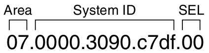
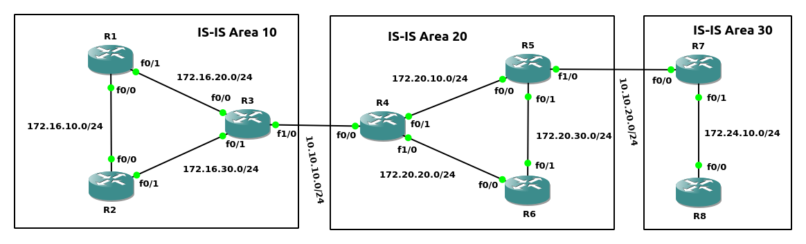

ISO术语:<br>
1.Intermediate System (IS)<br>
A router<br>

2.End System (ES)<br>
A host
<br>
<br>

IS-IS特性:<br>
1.划分Area<br>

2.所有接口都属于一个Area, Area boundary在链路上<br>

3.IS-IS在广播多路访问链路上选举Designated IS
<br>
<br>

IS-IS路由器类型:<br>
1.L1<br>
所有L1路由器包含一致的L1 LSDB, 邻接路由器都在相同Area内<br>

2.L2<br>
所有L2路由器包含一致的L2 LSDB, 邻接路由器可以处于不同Area<br>

3.L1/L2<br>
与L1邻接路由器包含一致的L1 LSDB, 与L2邻接路由器包含一致的L2 LSDB, 与L1/L2邻接路由器包含一致的L1 LSDB与L2 LSDB
<br>
<br>

IS-IS DIS选举过程(DIS开启preempt功能):
1.prioirty值最大的选举为DIS<br>

2.mac address值最大的选举为DIS
<br>
<br>


IS-IS配置步骤:<br>
1.配置IS-IS进程<br>
`(config)# router isis [<area_tag>]`<br>
** 当使用多个IS-IS进程时, 配合area_tag使用
<br>

2.配置NET<br>
`(config-router)# net <network_entity_title>`<br>
** network_entity_title格式参考图1
<br>

3.配置L1/L2类型<br>
`(config-router)# is-type {level-1 | level-2-only | level-1-2}`<br>
** 所有路由器默认为level-1-2
<br>

4.接口配置ISIS<br>
`(config-if)# ip router isis [<area_tag>]`
<br>
<br>

图1 - network_entity_title格式<br>
<br>
Field解析:<br>
Area ID: 1-13 bytes, 指定当前所处Area<br>

System ID: 6 bytes, 用于指定设备, 具有唯一性<br>

SEL: 1 byte, NSAP Selector, 设置为0x00
<br>
<br>

图2 - network_entity_title模板<br>

<br>
<br>

计时器<br>
1)Hello Timer(默认10s)<br>
`(config-if)# isis hello-interval <seconds>`<br>

2)Dold timer(默认为Hello Timer * 3)<br>
`(config-if)# isis hello-multiplier <factor>`
<br>
<br>

显示neighbors<br>
```
# show clns is-neighbors [<interface_id>] [detail]
# show clns neighbors [<interface_id>] [detail]
# show isis neighbors [detail]
```
<br>

显示database<br>
`# show isis database [l1 | l2] [detail | verbose]`
<br>

显示topology<br>
# show isis topology
<br>
<br>

图3<br>
<br>

示例1(如图3)
```
R1(config)# router isis
R1(config-router)# net 0a.0000.0000.0001.00
R1(config-router)# int f0/0
R1(config-if)# ip router isis
R1(config-if)# int f0/1
R1(config-if)# ip router isis

R2(config)# router isis
R2(config-router)# net 0a.0000.0000.0002.00
R2(config-router)# int f0/0
R2(config-if)# ip router isis
R2(config-if)# int f0/1
R2(config-if)# ip router isis

R3(config)# router isis
R3(config-router)# net 0a.0000.0000.0003.00
R3(config-router)# int f0/0
R3(config-if)# ip router isis
R3(config-if)# int f0/1
R3(config-if)# ip router isis
R3(config-if)# int f1/0
R3(config-if)# ip router isis

R4(config)# router isis
R4(config-router)# net 14.0000.0000.0004.00
R4(config-router)# int f0/0
R4(config-if)# ip router isis
R4(config-if)# int f0/1
R4(config-if)# ip router isis
R4(config-if)# int f1/0
R4(config-if)# ip router isis

R5(config)# router isis
R5(config-router)# net 14.0000.0000.0005.00
R5(config-router)# int f0/0
R5(config-if)# ip router isis
R5(config-if)# int f0/1
R5(config-if)# ip router isis
R5(config-if)# int f1/0
R5(config-if)# ip router isis

R6(config)# router isis
R6(config-router)# net 14.0000.0000.0006.00
R6(config-router)# int f0/0
R6(config-if)# ip router isis
R6(config-if)# int f0/1
R6(config-if)# ip router isis

R7(config)# router isis
R7(config-router)# net 1e.0000.0000.0007.00
R7(config-router)# int f0/0
R7(config-if)# ip router isis
R7(config-if)# int f0/1
R7(config-if)# ip router isis

R8(config)# router isis
R8(config-router)# net 1e.0000.0000.0008.00
R8(config-router)# int f0/0
R8(config-if)# ip router isis


R3# show clns is-neighbors
System Id      Interface   State  Type Priority  Circuit Id         Format
R1             Fa0/0       Up     L1   64        R3.01              Phase V
R2             Fa0/1       Up     L1L2 64/64     R3.02              Phase V
R4             Fa1/0       Up     L2   64        R4.01              Phase V

column解析:
System Id - neighbor的system ID
Interface - 与该neighbor连接的当前路由器接口
State - 与neighbor的状态. 只有两种状态: Init/Up
Type - neighbor路由器的Type
Priority - neighbor用于在Broadcast网络中选取DIS的优先级
Circuit ID - 分为两部分, 第一部分为Broadcast网络中DIS的System ID; 第二部分为DIS接口的唯一标识符
Format - 通常为Phase V, 代表OSI/DECnet Phase V. 另外一个可能只为DECnet Phase V
```
