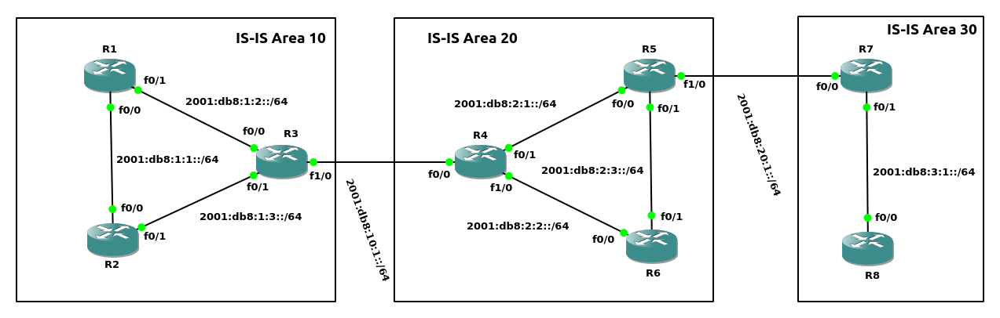

ISO术语:<br>
1.Intermediate System (IS)<br>
A router<br>

2.End System (ES)<br>
A host
<br>
<br>

IS-IS特性:<br>
1.划分Area<br>

2.所有接口都属于一个Area, Area boundary在链路上<br>

3.IS-IS在broadcast链路上选举Designated IS
<br>
<br>

IS-IS路由器类型:<br>
1.L1<br>
区域内所有L1路由器包含一致的L1 LSDB, 邻接路由器都在相同Area内<br>
** L1路由器不接收其他Area的路由, 而是生成一个指向最近L1/L2路由器的默认路由<br>
** L1多播地址: 0180.c200.0014, AllL1ISs<br>

2.L2<br>
所有L2路由器包含一致的L2 LSDB, 邻接路由器可以处于不同Area<br>
** L2多播地址: 0180.c200.0015, AllL2ISs<br>

3.L1/L2<br>
与L1邻接路由器包含一致的L1 LSDB, 与L2邻接路由器包含一致的L2 LSDB, 与L1/L2邻接路由器包含一致的L1 LSDB与L2 LSDB
<br>
<br>

IS-IS DIS选举过程(DIS开启preempt功能):
1.prioirty值最大的选举为DIS<br>

2.mac address值最大的选举为DIS
<br>
<br>

IS-IS PDU类型:<br>
|PDU Name|Type number|
|---|---|
|Level 1 LAN IS-IS Hello PDU|15|
|Level 2 LAN IS-IS Hello PDU|16|
|Point-to-point IS-IS Hello PDU|17|
|Level 1 LSP|18|
|Level 2 LSP|20|
|Level 1 CSNP|24|
|Level 2 CSNP|25|
|Level 1 PSNP|26|
|Level 2 PSNP|27|

<br>
<br>

IS-IS配置步骤:<br>
1.配置IS-IS进程<br>
`(config)# router isis [<area_tag>]`<br>
** 当使用多个IS-IS进程时, 配合area_tag使用
<br>

2.配置NET<br>
`(config-router)# net <network_entity_title>`<br>
** network_entity_title格式参考图1
<br>

3.配置L1/L2类型<br>
`(config-router)# is-type {level-1 | level-2-only | level-1-2}`<br>
** 所有路由器默认为level-1-2
<br>

4.接口配置ISIS<br>
`(config-if)# ip router isis [<area_tag>]`
<br>

5.配置优先级(用于DIS选举, 默认为64)<br>
`(config-if)# isis priority <priority>`
<br>

6.设置Remaining Lifetime (即MaxAge, 默认为1200s)/refresh internal(默认为900s)<br>
````
(config-router)# max-lsp-lifetime <seconds>
(config-router)# lsp-refresh-interval <seconds>
````
<br>

7.配置忽略error, 丢弃LSP<br>
`(config-router)# ignore-lsp-errors`<br>
** 在version 12.0之前, 在收到错误的checksum时, 路由器会执行route purge<br>
** 在version 12.0及之后, 默认使用改配置
<br>

8.配置在broadcast中, 发送CSNP(complete SNP, 类似与OSPF的Database description)的周期<br>
`(config)# isis csnp-interval <seconds>`
<br>

9.配置OL bit, 指定时间后取消<br>
`(config-router)# set-overload-bit on-startup <second>`<br>
** 当IS-IS与BGP同时配置时, 为等待BGP收敛, 不将当前路由器作为transit, 设置OL bit
<br>

10.设置OL bit, 直到BGP收敛<br>
`(config-router)# set-overload-bit on-startup wait-for-bgp`<br>
** 相比较于指定second, wait-for-bgp动态等待BGP收敛, 但是当BGP收敛出现问题时, 会导致一致无法取消OL bit
<br>

11.手动设置OL bit<br>
`(config-router)# set-verload-bit`
<br>

12.设置支持的最大Area数量(默认为3)<br>
`(config-router)# max-area-addresses <num>`
<br>
<br>

图1 - network_entity_title格式<br>
<br>
Field解析:<br>
Area ID: 1-13 bytes, 指定当前所处Area<br>

System ID: 6 bytes, 用于指定设备, 具有唯一性. 常使用某个接口的MAC地址<br>

SEL: 1 byte, NSAP Selector, 设置为0x00
<br>
<br>

图2 - network_entity_title模板<br>

<br>
<br>

计时器<br>
1)Hello Timer(默认10s)<br>
`(config-if)# isis hello-interval <seconds>`<br>

2)Dold timer(默认为Hello Timer * 3)<br>
`(config-if)# isis hello-multiplier <factor>`
<br>
<br>

metric<br>
1.IS-IS默认给每个链路分配metric为10, 可使用如下配置(累积metric最高为1023):<br>
`(config-if)# isis metric <value> [level-1 | level-2]`<br>

2.IS-IS可使用拓展支持更大的metric空间<br>
`(config-router)# metric-style {narrow | wide | transition}`<br>
** narrow为旧版本窄metric空间, wide为32 bit metric空间, transition支持两种TLV模式
<br>
<br>

路径选择:<br>
1.L1优于L2<br>

2.metric值小的
<br>
<br>

显示neighbors<br>
```
# show clns is-neighbors [<interface_id>] [detail]
# show clns neighbors [<interface_id>] [detail]
# show isis neighbors [detail]
```
<br>

显示database<br>
`# show isis database [l1 | l2] [detail | verbose]`
<br>

显示topology<br>
`# show isis topology`
<br>
<br>

图3<br>
<br>

示例1(如图3)
```
R1(config)# router isis
R1(config-router)# net 0a.ca01.bed1.0008.00
R1(config-router)# is-type level-1
R1(config-router)# int f0/0
R1(config-if)# ip router isis
R1(config-if)# int f0/1
R1(config-if)# ip router isis

R2(config)# router isis
R2(config-router)# net 0a.ca02.beef.0008.00
R2(config-router)# is-type level-1
R2(config-router)# int f0/0
R2(config-if)# ip router isis
R2(config-if)# int f0/1
R2(config-if)# ip router isis

R3(config)# router isis
R3(config-router)# net 0a.ca03.bf0d.0008.00
R3(config-router)# int f0/0
R3(config-if)# ip router isis
R3(config-if)# int f0/1
R3(config-if)# ip router isis
R3(config-if)# int f1/0
R3(config-if)# ip router isis

R4(config)# router isis
R4(config-router)# net 14.ca04.bf2f.0008.00
R4(config-router)# int f0/0
R4(config-if)# ip router isis
R4(config-if)# int f0/1
R4(config-if)# ip router isis
R4(config-if)# int f1/0
R4(config-if)# ip router isis

R5(config)# router isis
R5(config-router)# net 14.ca05.bf4d.0008.00
R5(config-router)# int f0/0
R5(config-if)# ip router isis
R5(config-if)# int f0/1
R5(config-if)# ip router isis
R5(config-if)# int f1/0
R5(config-if)# ip router isis

R6(config)# router isis
R6(config-router)# net 14.ca06.bf6c.0008.00
R6(config-router)# is-type level-1
R6(config-router)# int f0/0
R6(config-if)# ip router isis
R6(config-if)# int f0/1
R6(config-if)# ip router isis

R7(config)# router isis
R7(config-router)# net 1e.ca07.bf8b.0008.00
R7(config-router)# int f0/0
R7(config-if)# ip router isis
R7(config-if)# int f0/1
R7(config-if)# ip router isis

R8(config)# router isis
R8(config-router)# net 1e.ca08.bfa9.0008.00
R8(config-router)# is-type level-1
R8(config-router)# int f0/0
R8(config-if)# ip router isis


查看CLNS Neighbors
R3# show clns is-neighbors
System Id      Interface   State  Type Priority  Circuit Id         Format
R2             Fa0/1       Up     L1   64        R3.02              Phase V
R1             Fa0/0       Up     L1   64        R3.01              Phase V
R4             Fa1/0       Up     L2   64        R4.01              Phase V

column解析:
System Id - neighbor的system ID
Interface - 与该neighbor连接的当前路由器接口
State - 与neighbor的状态. 只有两种状态: Init/Up
Type - neighbor路由器的Type
Priority - neighbor用于在Broadcast网络中选取DIS的优先级
Circuit ID - 分为两部分, 如下:
    System ID - Broadcast网络中DIS的System ID
    Pseudo node ID - DIS接口的唯一标识符
Format - 通常为Phase V, 代表OSI/DECnet Phase V. 另外一个可能只为DECnet Phase V


查看ISIS Database
R3# show isis database                        

IS-IS Level-1 Link State Database:
LSPID                 LSP Seq Num  LSP Checksum  LSP Holdtime      ATT/P/OL
R1.00-00              0x00000002   0x5264        900               0/0/0
R2.00-00              0x00000003   0xDDBF        903               0/0/0
R2.01-00              0x00000001   0x7CD6        903               0/0/0
R3.00-00            * 0x00000004   0x0883        915               1/0/0
R3.01-00            * 0x00000001   0x84CA        906               0/0/0
R3.02-00            * 0x00000001   0x96B6        904               0/0/0
IS-IS Level-2 Link State Database:
LSPID                 LSP Seq Num  LSP Checksum  LSP Holdtime      ATT/P/OL
R3.00-00            * 0x00000003   0x16B0        904               0/0/0
R4.00-00              0x00000005   0xAFDE        912               0/0/0
R4.01-00              0x00000001   0x4C87        902               0/0/0
R5.00-00              0x00000004   0x2214        910               0/0/0
R5.01-00              0x00000001   0x6B65        908               0/0/0
R7.00-00              0x00000002   0xE3E2        898               0/0/0
R7.01-00              0x00000001   0x903B        899               0/0/0

Field解析:
LSPID - 8 bytes, 代表生成LSP的路由器. 由以下部分组成:
    System ID - 6 bytes, 路由器的System ID
    Pesudo node ID - 1 byte, 如果为非0, 代表路由器在LAN上为DIS
    LSP number - 1 byte, 如果LSP的大小超过MTU时, 进行fragment, 该字段用于区分fragment后的不同segment
** 如果该字段后跟随*, 代表当前路由器
LSP Seq Num - 4 bytes, LSP的序列号
LSP Checksum - 2 bytes, LSP的校验和
LSP Holdtime - LSP的hold timer, 由默认的1200s逐渐减少
ATT/P/OL - 分为三个字段, 详细如下:
    ATT - 代表该LAN为是否为当前Area与其他Area的连接
    P - 代表partition repair capability, Cisco没有实现该功能, 所以为0
    OL - Overload bit, 设置时, 代表不可以作为transit路由器


查看LSP详细内容
R3# show isis database detail level-2 R4.00-00

IS-IS Level-2 LSP R4.00-00
LSPID                 LSP Seq Num  LSP Checksum  LSP Holdtime      ATT/P/OL
R4.00-00              0x00000005   0xAFDE        838               0/0/0
  Area Address: 14
  NLPID:        0xCC 
  Hostname: R4
  IP Address:   172.20.20.4
  Metric: 10         IS R4.01
  Metric: 10         IS R5.01
  Metric: 10         IP 10.10.10.0 255.255.255.0
  Metric: 20         IP 10.10.20.0 255.255.255.0
  Metric: 10         IP 172.20.10.0 255.255.255.0
  Metric: 10         IP 172.20.20.0 255.255.255.0
  Metric: 20         IP 172.20.30.0 255.255.255.0


查看System ID与Hostname对应列表
R3# show isis hostname
Level  System ID      Dynamic Hostname  (notag)
 2     CA05.BF4D.0008 R5
 2     CA04.BF2F.0008 R4
     * CA03.BF0D.0008 R3
 1     CA02.BEEF.0008 R2
 1     CA01.BED1.0008 R1
 2     CA07.BF8B.0008 R7


查看CLNS protocol
R3# show clns protocol 

IS-IS Router: <Null Tag>
  System Id: CA03.BF0D.0008.00  IS-Type: level-1-2
  Manual area address(es): 
	0a
  Routing for area address(es): 
	0a
  Interfaces supported by IS-IS:
	FastEthernet1/0 - IP
	FastEthernet0/1 - IP
	FastEthernet0/0 - IP
  Redistribute:
    static (on by default)
  Distance for L2 CLNS routes: 110
  RRR level: none
  Generate narrow metrics: level-1-2
  Accept narrow metrics:   level-1-2
  Generate wide metrics:   none
  Accept wide metrics:     none
```
<br>
<br>

#### IS-IS特征
##### 1.Area Migration with nondisruptively
将IS-IS的Area进行迁移时, 不用中断邻接关闭<br>

示例2(如图3)
```
配置基于示例1, 将Area 10修改为Area 1
1)添加新Area
R1(config)# router isis
R1(config-router)# net 01.ca01.bed1.0008.00

R2(config)# router isis
R2(config-router)# net 01.ca02.beef.0008.00

R3(config)# router isis
R3(config-router)# net 01.ca03.bf0d.0008.00


2)删除原来的Area
R1(config)# router isis
R1(config-router)# no net 0a.ca01.bed1.0008.00

R2(config)# router isis
R2(config-router)# no net 0a.ca02.beef.0008.00

R3(config)# router isis
R3(config-router)# no net 0a.ca03.bf0d.0008.00
```
<br>
<br>

##### 2.Route Summarization(区域间路由汇总)
在区域边界路由器上进行路由汇总<br>

区域间路由汇总配置:<br>
`(config-router)# summary-address <summary_net> <net_mask>`<br>
** metric采用more-specific中最低的<br>

示例3(如图3)
```
R3# show ip route | begin Gateway
Gateway of last resort is not set

      10.0.0.0/8 is variably subnetted, 3 subnets, 2 masks
C        10.10.10.0/24 is directly connected, FastEthernet1/0
L        10.10.10.3/32 is directly connected, FastEthernet1/0
i L2     10.10.20.0/24 [115/30] via 10.10.10.4, 00:00:58, FastEthernet1/0
      172.16.0.0/16 is variably subnetted, 5 subnets, 2 masks
i L1     172.16.10.0/24 [115/20] via 172.16.30.2, 00:01:10, FastEthernet0/1
                        [115/20] via 172.16.20.1, 00:01:10, FastEthernet0/0
C        172.16.20.0/24 is directly connected, FastEthernet0/0
L        172.16.20.3/32 is directly connected, FastEthernet0/0
C        172.16.30.0/24 is directly connected, FastEthernet0/1
L        172.16.30.3/32 is directly connected, FastEthernet0/1
      172.20.0.0/24 is subnetted, 3 subnets
i L2     172.20.10.0 [115/20] via 10.10.10.4, 00:01:20, FastEthernet1/0
i L2     172.20.20.0 [115/20] via 10.10.10.4, 00:01:20, FastEthernet1/0
i L2     172.20.30.0 [115/30] via 10.10.10.4, 00:00:58, FastEthernet1/0
      172.24.0.0/24 is subnetted, 1 subnets
i L2     172.24.10.0 [115/40] via 10.10.10.4, 00:00:58, FastEthernet1/0


R4# show ip route | begin Gateway
Gateway of last resort is not set

      10.0.0.0/8 is variably subnetted, 3 subnets, 2 masks
C        10.10.10.0/24 is directly connected, FastEthernet0/0
L        10.10.10.4/32 is directly connected, FastEthernet0/0
i L1     10.10.20.0/24 [115/20] via 172.20.10.5, 00:01:15, FastEthernet0/1
      172.16.0.0/24 is subnetted, 3 subnets
i L2     172.16.10.0 [115/30] via 10.10.10.3, 00:01:13, FastEthernet0/0
i L2     172.16.20.0 [115/20] via 10.10.10.3, 00:01:25, FastEthernet0/0
i L2     172.16.30.0 [115/20] via 10.10.10.3, 00:01:25, FastEthernet0/0
      172.20.0.0/16 is variably subnetted, 5 subnets, 2 masks
C        172.20.10.0/24 is directly connected, FastEthernet0/1
L        172.20.10.4/32 is directly connected, FastEthernet0/1
C        172.20.20.0/24 is directly connected, FastEthernet1/0
L        172.20.20.4/32 is directly connected, FastEthernet1/0
i L1     172.20.30.0/24 [115/20] via 172.20.20.6, 00:01:15, FastEthernet1/0
                        [115/20] via 172.20.10.5, 00:01:15, FastEthernet0/1
      172.24.0.0/24 is subnetted, 1 subnets
i L2     172.24.10.0 [115/30] via 172.20.10.5, 00:01:03, FastEthernet0/1


R5# show ip route | begin Gateway
Gateway of last resort is not set

      10.0.0.0/8 is variably subnetted, 3 subnets, 2 masks
i L1     10.10.10.0/24 [115/20] via 172.20.10.4, 00:01:39, FastEthernet0/0
C        10.10.20.0/24 is directly connected, FastEthernet1/0
L        10.10.20.5/32 is directly connected, FastEthernet1/0
      172.16.0.0/24 is subnetted, 3 subnets
i L2     172.16.10.0 [115/40] via 172.20.10.4, 00:01:19, FastEthernet0/0
i L2     172.16.20.0 [115/30] via 172.20.10.4, 00:01:19, FastEthernet0/0
i L2     172.16.30.0 [115/30] via 172.20.10.4, 00:01:19, FastEthernet0/0
      172.20.0.0/16 is variably subnetted, 5 subnets, 2 masks
C        172.20.10.0/24 is directly connected, FastEthernet0/0
L        172.20.10.5/32 is directly connected, FastEthernet0/0
i L1     172.20.20.0/24 [115/20] via 172.20.30.6, 00:01:39, FastEthernet0/1
                        [115/20] via 172.20.10.4, 00:01:39, FastEthernet0/0
C        172.20.30.0/24 is directly connected, FastEthernet0/1
L        172.20.30.5/32 is directly connected, FastEthernet0/1
      172.24.0.0/24 is subnetted, 1 subnets
i L2     172.24.10.0 [115/20] via 10.10.20.7, 00:01:29, FastEthernet1/0


R7# show ip route | begin Gateway
Gateway of last resort is not set

      10.0.0.0/8 is variably subnetted, 3 subnets, 2 masks
i L2     10.10.10.0/24 [115/30] via 10.10.20.5, 00:02:15, FastEthernet0/0
C        10.10.20.0/24 is directly connected, FastEthernet0/0
L        10.10.20.7/32 is directly connected, FastEthernet0/0
      172.16.0.0/24 is subnetted, 3 subnets
i L2     172.16.10.0 [115/50] via 10.10.20.5, 00:02:05, FastEthernet0/0
i L2     172.16.20.0 [115/40] via 10.10.20.5, 00:02:05, FastEthernet0/0
i L2     172.16.30.0 [115/40] via 10.10.20.5, 00:02:05, FastEthernet0/0
      172.20.0.0/24 is subnetted, 3 subnets
i L2     172.20.10.0 [115/20] via 10.10.20.5, 00:02:15, FastEthernet0/0
i L2     172.20.20.0 [115/30] via 10.10.20.5, 00:02:15, FastEthernet0/0
i L2     172.20.30.0 [115/20] via 10.10.20.5, 00:02:15, FastEthernet0/0
      172.24.0.0/16 is variably subnetted, 2 subnets, 2 masks
C        172.24.10.0/24 is directly connected, FastEthernet0/1
L        172.24.10.7/32 is directly connected, FastEthernet0/1


基于示例1的配置
R3(config)# router isis
R3(config-router)# summary-address 172.16.0.0 255.255.0.0

R4(config)# router isis
R4(config-router)# summary-address 172.20.0.0 255.255.0.0

R5(config)# router isis
R5(config-router)# summary-address 172.20.0.0 255.255.0.0


R3# show ip route | begin Gateway
Gateway of last resort is not set

      10.0.0.0/8 is variably subnetted, 3 subnets, 2 masks
C        10.10.10.0/24 is directly connected, FastEthernet1/0
L        10.10.10.3/32 is directly connected, FastEthernet1/0
i L2     10.10.20.0/24 [115/30] via 10.10.10.4, 00:09:50, FastEthernet1/0
      172.16.0.0/16 is variably subnetted, 6 subnets, 3 masks
i su     172.16.0.0/16 [115/10] via 0.0.0.0, 00:05:45, Null0
i L1     172.16.10.0/24 [115/20] via 172.16.30.2, 00:10:02, FastEthernet0/1
                        [115/20] via 172.16.20.1, 00:10:02, FastEthernet0/0
C        172.16.20.0/24 is directly connected, FastEthernet0/0
L        172.16.20.3/32 is directly connected, FastEthernet0/0
C        172.16.30.0/24 is directly connected, FastEthernet0/1
L        172.16.30.3/32 is directly connected, FastEthernet0/1
i L2  172.20.0.0/16 [115/20] via 10.10.10.4, 00:05:25, FastEthernet1/0
      172.24.0.0/24 is subnetted, 1 subnets
i L2     172.24.10.0 [115/40] via 10.10.10.4, 00:09:50, FastEthernet1/0


R4# show ip route | begin Gateway
Gateway of last resort is not set

      10.0.0.0/8 is variably subnetted, 3 subnets, 2 masks
C        10.10.10.0/24 is directly connected, FastEthernet0/0
L        10.10.10.4/32 is directly connected, FastEthernet0/0
i L1     10.10.20.0/24 [115/20] via 172.20.10.5, 00:07:38, FastEthernet0/1
i L2  172.16.0.0/16 [115/20] via 10.10.10.3, 00:03:29, FastEthernet0/0
      172.20.0.0/16 is variably subnetted, 6 subnets, 3 masks
i su     172.20.0.0/16 [115/10] via 0.0.0.0, 00:03:13, Null0
C        172.20.10.0/24 is directly connected, FastEthernet0/1
L        172.20.10.4/32 is directly connected, FastEthernet0/1
C        172.20.20.0/24 is directly connected, FastEthernet1/0
L        172.20.20.4/32 is directly connected, FastEthernet1/0
i L1     172.20.30.0/24 [115/20] via 172.20.20.6, 00:07:38, FastEthernet1/0
                        [115/20] via 172.20.10.5, 00:07:38, FastEthernet0/1
      172.24.0.0/24 is subnetted, 1 subnets
i L2     172.24.10.0 [115/30] via 172.20.10.5, 00:07:26, FastEthernet0/1


R5# show ip route | begin Gateway
Gateway of last resort is not set

      10.0.0.0/8 is variably subnetted, 3 subnets, 2 masks
i L1     10.10.10.0/24 [115/20] via 172.20.10.4, 00:10:49, FastEthernet0/0
C        10.10.20.0/24 is directly connected, FastEthernet1/0
L        10.10.20.5/32 is directly connected, FastEthernet1/0
i L2  172.16.0.0/16 [115/30] via 172.20.10.4, 00:06:31, FastEthernet0/0
      172.20.0.0/16 is variably subnetted, 6 subnets, 3 masks
i su     172.20.0.0/16 [115/10] via 0.0.0.0, 00:01:47, Null0
C        172.20.10.0/24 is directly connected, FastEthernet0/0
L        172.20.10.5/32 is directly connected, FastEthernet0/0
i L1     172.20.20.0/24 [115/20] via 172.20.30.6, 00:10:49, FastEthernet0/1
                        [115/20] via 172.20.10.4, 00:10:49, FastEthernet0/0
C        172.20.30.0/24 is directly connected, FastEthernet0/1
L        172.20.30.5/32 is directly connected, FastEthernet0/1
      172.24.0.0/24 is subnetted, 1 subnets
i L2     172.24.10.0 [115/20] via 10.10.20.7, 00:10:39, FastEthernet1/0


R7# show ip route | begin Gateway
Gateway of last resort is not set

      10.0.0.0/8 is variably subnetted, 3 subnets, 2 masks
i L2     10.10.10.0/24 [115/30] via 10.10.20.5, 00:08:46, FastEthernet0/0
C        10.10.20.0/24 is directly connected, FastEthernet0/0
L        10.10.20.7/32 is directly connected, FastEthernet0/0
i L2  172.16.0.0/16 [115/40] via 10.10.20.5, 00:05:28, FastEthernet0/0
i L2  172.20.0.0/16 [115/20] via 10.10.20.5, 00:00:42, FastEthernet0/0
      172.24.0.0/16 is variably subnetted, 2 subnets, 2 masks
C        172.24.10.0/24 is directly connected, FastEthernet0/1
L        172.24.10.7/32 is directly connected, FastEthernet0/1
R7# show ip route | begin Gateway
Gateway of last resort is not set

      10.0.0.0/8 is variably subnetted, 3 subnets, 2 masks
i L2     10.10.10.0/24 [115/30] via 10.10.20.5, 00:08:51, FastEthernet0/0
C        10.10.20.0/24 is directly connected, FastEthernet0/0
L        10.10.20.7/32 is directly connected, FastEthernet0/0
i L2  172.16.0.0/16 [115/40] via 10.10.20.5, 00:05:33, FastEthernet0/0
i L2  172.20.0.0/16 [115/20] via 10.10.20.5, 00:00:47, FastEthernet0/0
      172.24.0.0/16 is variably subnetted, 2 subnets, 2 masks
C        172.24.10.0/24 is directly connected, FastEthernet0/1
L        172.24.10.7/32 is directly connected, FastEthernet0/1
```
<br>
<br>

##### 3.Authentication(认证)
认证配置方式:<br>
1.Clear-text password authentication(Type 1)<br>
1)old style password<br>

2)key chain<br>

2.HMAC-MD5 encrypted hash authentication(Type 54)
<br>
<br>

配置认证的范围:<br>
1.在接口配置<br>

2.在区域内配置(L1路由器)<br>

3.在domain内配置(L2路由器)
<br>
<br>

接口级配置过程:<br>
1)配置key chain<br>

2)接口使用的认证方式<br>

3)在接口使用key chain
<br>
<br>

Area/Domain级配置过程:<br>
1)配置key chain<br>

2)Area/Domain使用的认证方式<br>

3)配置key chain
<br>
<br>

示例4(如图3)
```
基于示例1的配置
R1的F0/0接口与R2的F0/0接口使用接口级配置, 并且配置key-chain
R1(config)# key chain CHAIN
R1(config-keychain)# key 1 
R1(config-keychain-key)# key-string cisco
R1(config-keychain-key)# int f0/0
R1(config-if)# isis authentication mode text
R1(config-if)# isis authentication key-chain CHAIN

R2(config)# key chain CATCH
R2(config-keychain)# key 2
R2(config-keychain-key)# key-string cisco
R2(config-keychain-key)# int f0/0
R2(config-if)# isis authentication mode text
R2(config-if)# isis authentication key-chain CATCH


Area 20内的R4/R5/R6的L1使用Area级配置, 并且配置md5
R4(config)# key chain INTRA_AREA
R4(config-keychain)# key 1 
R4(config-keychain-key)# key-string LEVEL_ONE
R4(config-keychain-key)# router isis 
R4(config-router)# authentication mode md5 level-1
R4(config-router)# authentication key-chain INTRA_AREA level-1

R5(config)# key chain INTRA_AREA
R5(config-keychain)# key 1
R5(config-keychain-key)# key-string LEVEL_ONE
R5(config-keychain-key)# router isis
R5(config-router)# authentication mode md5 level-1
R5(config-router)# authentication key-chain INTRA_AREA level-1

R6(config)# key chain INTRA_AREA
R6(config-keychain)# key 1 
R6(config-keychain-key)# key-string LEVEL_ONE
R6(config-keychain-key)# router isis
R6(config-router)# authentication mode md5 level-1
R6(config-router)# authentication key-chain INTRA_AREA level-1


R3/R4/R5/R7 L2使用domain级配置, 并且配置md5
R3(config)# key chain INTRA_DOMAIN
R3(config-keychain)# key 1
R3(config-keychain-key)# key-string LEVEL_TWO
R3(config-keychain-key)# router isis
R3(config-router)# authentication mode md5 level-2
R3(config-router)# authentication key-chain INTRA_DOMAIN level-2

R4(config)# key chain INTRA_DOMAIN
R4(config-keychain)# key 1
R4(config-keychain-key)# key-string LEVEL_TWO
R4(config-keychain-key)# router isis
R4(config-router)# authentication mode md5 level-2
R4(config-router)# authentication key-chain INTRA_DOMAIN level-2

R5(config)# key chain INTRA_DOMAIN
R5(config-keychain)# key 1
R5(config-keychain-key)# key-string LEVEL_TWO
R5(config-keychain-key)# router isis
R5(config-router)# authentication mode md5 level-2
R5(config-router)# authentication key-chain INTRA_DOMAIN level-2

R7(config)# key chain INTRA_DOMAIN
R7(config-keychain)# key 1
R7(config-keychain-key)# key-string LEVEL_TWO
R7(config-keychain-key)# router isis
R7(config-router)# authentication mode md5 level-2
R7(config-router)# authentication key-chain INTRA_DOMAIN level-2
```
<br>
<br>

##### 4.IPv6

图4<br>
<br>

示例5(如图4)
```
R1(config)# ipv6 unicast-routing
R1(config)# router isis
R1(config-router)# net 0a.ca01.1c35.0008.00
R1(config-router)# is-type level-1
R1(config-router)# int f0/0
R1(config-if)# ipv6 router isis
R1(config-if)# int f0/1
R1(config-if)# ipv6 router isis

R2(config)# ipv6 unicast-routing
R2(config)# router isis
R2(config-router)# net 0a.ca02.1c53.0008.00
R2(config-router)# is-type level-1
R2(config-router)# int f0/0
R2(config-if)# ipv6 router isis
R2(config-if)# int f0/1
R2(config-if)# ipv6 router isis

R3(config)# ipv6 unicast-routing
R3(config)# router isis
R3(config-router)# net 0a.ca03.1c71.0008.00
R3(config-router)# int f0/0
R3(config-if)# ipv6 router isis
R3(config-if)# int f0/1
R3(config-if)# ipv6 router isis
R3(config-if)# int f1/0
R3(config-if)# ipv6 router isis

R4(config)# ipv6 unicast-routing 
R4(config)# router isis
R4(config-router)# net 14.ca04.1c8f.0008.00
R4(config-router)# int f0/0
R4(config-if)# ipv6 router isis
R4(config-if)# int f0/1
R4(config-if)# ipv6 router isis
R4(config-if)# int f1/0
R4(config-if)# ipv6 router isis

R5(config)# ipv6 unicast-routing
R5(config)# router isis
R5(config-router)# net 14.ca05.1cad.0008.00
R5(config-router)# int f0/0
R5(config-if)# ipv6 router isis
R5(config-if)# int f0/1
R5(config-if)# ipv6 router isis
R5(config-if)# int f1/0
R5(config-if)# ipv6 router isis

R6(config)# ipv6 unicast-routing
R6(config)# router isis 
R6(config-router)# net 14.ca06.1ccb.0008.00
R6(config-router)# is-type level-1
R6(config-router)# int f0/0
R6(config-if)# ipv6 router isis
R6(config-if)# int f0/1
R6(config-if)# ipv6 router isis

R7(config)# ipv6 unicast-routing
R7(config)# router isis
R7(config-router)# net 1e.ca07.1ce9.0008.00
R7(config-router)# int f0/0
R7(config-if)# ipv6 router isis
R7(config-if)# int f0/1
R7(config-if)# ipv6 router isis

R8(config)# ipv6 unicast-routing
R8(config)# router isis
R8(config-router)# net 1e.ca08.1d07.0008.00
R8(config-router)# is-type level-1
R8(config-router)# int f0/0
R8(config-if)# ipv6 router isis


R3# show ipv6 route | begin Application
       lr - LISP site-registrations, ld - LISP dyn-eid, a - Application
I1  2001:DB8:1:1::/64 [115/20]
     via FE80::C802:1CFF:FE53:6, FastEthernet0/1
     via FE80::C801:1CFF:FE35:6, FastEthernet0/0
C   2001:DB8:1:2::/64 [0/0]
     via FastEthernet0/0, directly connected
L   2001:DB8:1:2::3/128 [0/0]
     via FastEthernet0/0, receive
C   2001:DB8:1:3::/64 [0/0]
     via FastEthernet0/1, directly connected
L   2001:DB8:1:3::3/128 [0/0]
     via FastEthernet0/1, receive
I2  2001:DB8:2:1::/64 [115/20]
     via FE80::C804:1CFF:FE8F:8, FastEthernet1/0
I2  2001:DB8:2:2::/64 [115/20]
     via FE80::C804:1CFF:FE8F:8, FastEthernet1/0
I2  2001:DB8:2:3::/64 [115/30]
     via FE80::C804:1CFF:FE8F:8, FastEthernet1/0
I2  2001:DB8:3:1::/64 [115/40]
     via FE80::C804:1CFF:FE8F:8, FastEthernet1/0
C   2001:DB8:10:1::/64 [0/0]
     via FastEthernet1/0, directly connected
L   2001:DB8:10:1::3/128 [0/0]
     via FastEthernet1/0, receive
I2  2001:DB8:20:1::/64 [115/30]
     via FE80::C804:1CFF:FE8F:8, FastEthernet1/0
L   FF00::/8 [0/0]
     via Null0, receive


区域间路由汇总配置
R3(config)# router isis 
R3(config-router)# address-family ipv6
R3(config-router-af)# summary-prefix 2001:db8:1::/48

R4(config)# router isis 
R4(config-router)# address-family ipv6 
R4(config-router-af)# summary-prefix 2001:db8:2::/48

R5(config)# router isis
R5(config-router)# address-family ipv6 
R5(config-router-af)# summary-prefix 2001:db8:2::/48


R3# show ipv6 route | begin Application
       lr - LISP site-registrations, ld - LISP dyn-eid, a - Application
IS  2001:DB8:1::/48 [115/10]
     via Null0, directly connected
I1  2001:DB8:1:1::/64 [115/20]
     via FE80::C802:1CFF:FE53:6, FastEthernet0/1
     via FE80::C801:1CFF:FE35:6, FastEthernet0/0
C   2001:DB8:1:2::/64 [0/0]
     via FastEthernet0/0, directly connected
L   2001:DB8:1:2::3/128 [0/0]
     via FastEthernet0/0, receive
C   2001:DB8:1:3::/64 [0/0]
     via FastEthernet0/1, directly connected
L   2001:DB8:1:3::3/128 [0/0]
     via FastEthernet0/1, receive
I2  2001:DB8:2::/48 [115/20]
     via FE80::C804:1CFF:FE8F:8, FastEthernet1/0
I2  2001:DB8:3:1::/64 [115/40]
     via FE80::C804:1CFF:FE8F:8, FastEthernet1/0
C   2001:DB8:10:1::/64 [0/0]
     via FastEthernet1/0, directly connected
L   2001:DB8:10:1::3/128 [0/0]
     via FastEthernet1/0, receive
I2  2001:DB8:20:1::/64 [115/30]
     via FE80::C804:1CFF:FE8F:8, FastEthernet1/0
L   FF00::/8 [0/0]
     via Null0, receive


R4# show ipv6 route | begin Application
       lr - LISP site-registrations, ld - LISP dyn-eid, a - Application
I2  2001:DB8:1::/48 [115/20]
     via FE80::C803:1CFF:FE71:1C, FastEthernet0/0
IS  2001:DB8:2::/48 [115/10]
     via Null0, directly connected
C   2001:DB8:2:1::/64 [0/0]
     via FastEthernet0/1, directly connected
L   2001:DB8:2:1::4/128 [0/0]
     via FastEthernet0/1, receive
C   2001:DB8:2:2::/64 [0/0]
     via FastEthernet1/0, directly connected
L   2001:DB8:2:2::4/128 [0/0]
     via FastEthernet1/0, receive
I1  2001:DB8:2:3::/64 [115/20]
     via FE80::C805:1CFF:FEAD:8, FastEthernet0/1
     via FE80::C806:1CFF:FECB:8, FastEthernet1/0
I2  2001:DB8:3:1::/64 [115/30]
     via FE80::C805:1CFF:FEAD:8, FastEthernet0/1
C   2001:DB8:10:1::/64 [0/0]
     via FastEthernet0/0, directly connected
L   2001:DB8:10:1::4/128 [0/0]
     via FastEthernet0/0, receive
I1  2001:DB8:20:1::/64 [115/20]
     via FE80::C805:1CFF:FEAD:8, FastEthernet0/1
L   FF00::/8 [0/0]
     via Null0, receive
```
<br>
<br>

##### 5.IPv4 with IPv6

引用:<br>
[1] Use of OSI IS-IS for Routing in TCP/IP and Dual Environments: https://datatracker.ietf.org/doc/html/rfc1195

[2] Routing IPv6 with IS-IS: https://datatracker.ietf.org/doc/html/rfc5308

