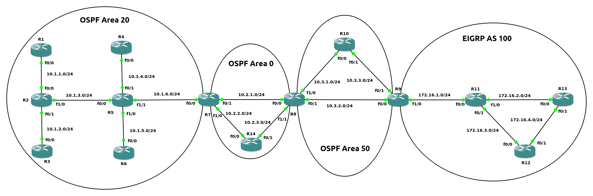
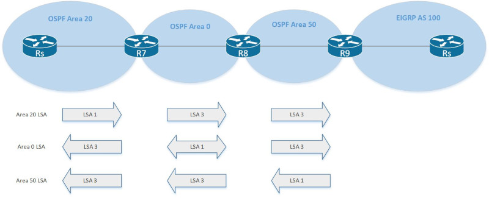
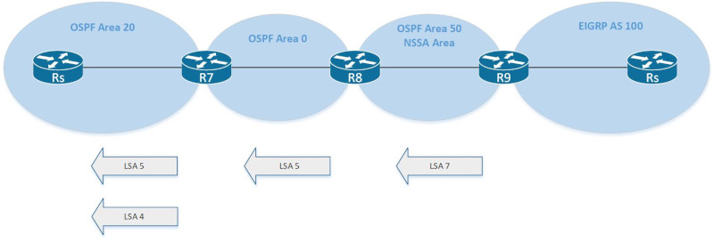
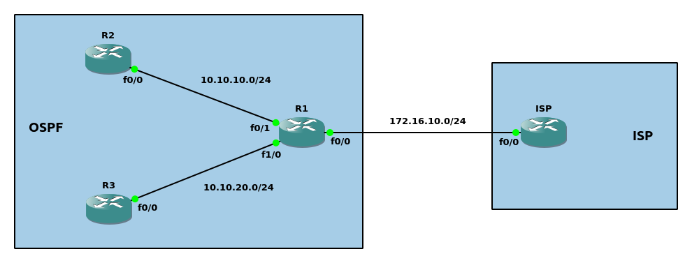
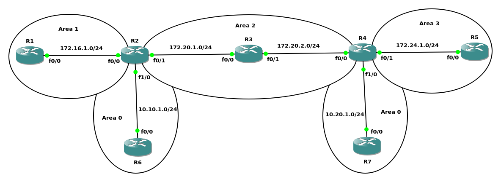
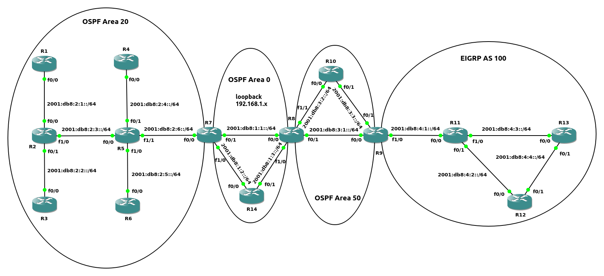

名词列表<br>
Routing protocol<br>
路由协议, 由交互信息和算法, 选出到达目标的最佳路径, 添加到路由表. 位于IP层.  如: RIP/OSPF/EIGRP/BGP
<br>
<br>

Routed/Routable protocol<br>
被路由协议和可路由协议, 定义包的结构和逻辑地址, 并允许被路由器转发. 如: IPv4/IPv6
<br>
<br>

IGP(Interior Gateway Protocols, 内部网关协议)<br>
代表机构内部(单个AS内)部署的路由协议. 如: RIP/OSPF/EIGRP/IS-IS等
<br>
<br>

EGP(Exterior Gateway Protocols, 外部网关协议)<br>
代表机构之间(多个AS之间)部署的路由协议. 目前该类只有BGP协议
<br>
<br>
<br>

IGP路由协议算法类型<br>
1.Distance vector<br>
RIP和Cisco IGRP使用该算法,  缺点是收敛速度较慢
<br>

2.Advance distance vector<br>
Cisco EIRGH使用该算法
<br>

3.Link state<br>
OSPF和IS-IS使用该算法, 相较于Distance vector, 会使用额外的CPU和内存资源
<br>
<br>
<br>

路由选择方式:<br>
1.prefix length<br>
优先选择符合的, 并且主机位更短的路由. 示例如下:<br>
10.0.3.0/28、10.0.3.0/26、10.0.3.0/24三个路由, 目标为10.3.0.12<br>
选择10.0.3.0/28作为路由
<br>
<br>

2.administration distance<br>
不同路由类型的判别<br>
AD越小的路由类型, 优先级越高, 该值独立于路由器. 不同路由类型的默认AD值如下:
|路由类型                |AD值                    |
|------------------------|------------------------|
|connected               |0                       |
|static route            |1                       |
|eBGP(external AS route) |20                      |
|EIGRP(internal route)   |90                      |
|OSPF                    |110                     |
|IS-IS                   |115                     |
|RIP                     |120                     |
|EIGRP(from redistribute route)   |170                     |
|iBGP(current AS route)  |200                     |
|Unusable                |255                     |

<br>

3.metric<br>
同一路由类型的判别<br>
RIP使用经过的跳数(路由器)作为测量指标<br>
OSPF使用单条链路的cost作为参考, 并将每条链路的测量汇总作为测量指标
<br>
<br>
<br>

#### OSPF(Open Shortest Path First)
Open Shortest Path First, 开放最短路径优先. 使用协议id 89.<br>
IPv4使用224.0.0.5(AllSPFRouters)/224.0.0.6(AllDRouters)作为多播地址<br>

LSA(link-state advertisements, 链路状态通告): 到达指定链路的信息
<br>

LSDB(link-state database, 链路状态数据库): LSA的集合, 每个Area内的路由器都包含相同的LSDB
<br>
<br>
<br>

###### OSPF包的类型
|Type  |Packet Name   |Functional Overview                    |
|------|--------------|---------------------------------------|
|1     |Hello         |用于发现和维持邻接路由器               |
|2     |Database Description(DBD)|汇总LSDB信息, 用于邻接关系初步形成时|
|3     |Link-state Request(LSR)|用于从邻接路由器获取路由信息  |
|4     |Link-state Update(LSU)|发送路由信息, 用于LSR的响应    |
|5     |Link-state Ack|用于响应LSA泛洪                        |

<br>
<br>


###### OSPF步骤
图1<br>

<br>

位于相同链路, 并且使用OSPF的路由器成为neighbor<br>
如图1, 为邻接路由器之间经历不同状态, 成为full neighbor的过程
<br>
<br>

路由器之间进入full state后, 依然需要通过几个步骤, 监测路由拓扑, 步骤如下:<br>
1)在Hello interval间隔时间, 持续发送Hello message; 如果dead interval没有收到neighbor的Hello message, 代表neighbor已经下线
<br>

2)当拓扑发生改变, 离变化最近的路由器接收到LSAs, 向外扩散
<br>

3)即使拓扑没有发生改变, 也会在指定间隔时间(默认30分钟)扩散LSAs
<br>
<br>

Broadcast网络链路(以太网链路默认使用类型)<br>

图2<br>
<br>
情景1 - 当R4与其他路由器同时加入OSPF<br>
1)所有路由器刚刚加入OSPF, R4将自己视为DR<br>

2)R4接收到其他路由器发送的Hello packet, 进行如下两步比较:<br>
&emsp;&emsp;I、比较Broadcast域内所有接口的优先级, 优先级最大的成为DR. 当前R4与其它路由器接口的优先级都为默认值, 进入比较步骤II<br>
&emsp;&emsp;II、比较Broadcast域内所有路由器的RID, RID最大的成为DR. 当前R4的RID最大, R4成为DR<br>

3)BDR选举与DR选举类似, R3成为BDR<br>

```
Result:
R4# show ip ospf interface | include Designated.*ID|Router ID                   
  Process ID 1, Router ID 4.4.4.4, Network Type BROADCAST, Cost: 1              
  Designated Router (ID) 4.4.4.4, Interface address 172.16.1.4                  
  Backup Designated router (ID) 3.3.3.3, Interface address 172.16.1.3
```
<br>

情景2 - 当R4在一段时间后加入OSPF(此时R3为DR, R2为BDR)<br>
1)默认情况下, OSPF没有preempt机制, 所有R4加入后的角色为DROther
```
R4# show ip ospf int | include Designated.*ID|Router ID                         
  Process ID 1, Router ID 4.4.4.4, Network Type BROADCAST, Cost: 1              
  Designated Router (ID) 3.3.3.3, Interface address 172.16.1.3                  
  Backup Designated router (ID) 2.2.2.2, Interface address 172.16.1.2
```
<br>

2)清除R3的OSPF process, R3退出DR, BDR(R2)立马接替成为DR, router id最高(R4)的选举成为BDR
```
R3# clear ip ospf process                                                       
Reset ALL OSPF processes? [no]: yes

R4# show ip ospf int | include Designated.*ID|Router ID                        
  Process ID 1, Router ID 4.4.4.4, Network Type BROADCAST, Cost: 1              
  Designated Router (ID) 2.2.2.2, Interface address 172.16.1.2                  
  Backup Designated router (ID) 4.4.4.4, Interface address 172.16.1.4
```
<br>

3)清除R2的OSPF process, R2退出DR, BDR(R4)成为DR, router id最高(R3)的选举成为BDR
```
R2# clear ip ospf process                                                        
Reset ALL OSPF processes? [no]: yes

R4#show ip ospf int | include Designated.*ID|Router ID                          
  Process ID 1, Router ID 4.4.4.4, Network Type BROADCAST, Cost: 1              
  Designated Router (ID) 4.4.4.4, Interface address 172.16.1.4                  
  Backup Designated router (ID) 3.3.3.3, Interface address 172.16.1.3  
```
<br>
<br>

neighbor路由器之间的关系<br>

图3<br>

<br>

neighbor路由器之间的状态为full state, 称为adjacent neighbot<br>

neighbor路由器之间的状态为2-way state, 称为neighbot<br>

只有adjacent neighbor之间才能直接同步LSDB(通过LSU)
<br>
<br>

协议号和多播地址:<br>
协议号 - 89
<br>

224.0.0.5/01:00:5E:00:00:05<br>
AllSPFRouters - DR/BDR发送内容到其他所有路由器
<br>

224.0.0.6/01:00:5E:00:00:06<br>
AllDRouters - DROther发送内容到DR/BDR路由器
<br>
<br>

显示LSDB内容<br>
`# show ip ospf database`
<br>
<br>
<br>

##### 配置OSPF
1.进入router子配置模式, 并指定进程ID<br>
`(config)# router ospf <process_id>`<br>
** process_id在本地唯一, 用于指定进程, 在其他路由器该值不必一致<br>
** 同一台router可以有多个process, 并且每个process有自己唯一的database, 在每个process内的内容只有通过redistribute, 才能被其他process获得
<br>
<br>

2.配置Router ID<br>
`(config-router)# router-id <router-id>`
<br>
** Router ID配置优先级:<br>
1)直接配置<br>
2)从loopback接口中选择ip值最大的<br>
3)从非loopback接口中选择ip值最大的
<br>
<br>

3.接口配置OSPF, 指定所属area<br>
1)在router子配置模式下使用network<br>
`(config-router)# network <subnet_id> <wildcard_mask> area <area_id>`<br>
** subnet_id与wildcard_mask配合, 所有接口IP与该组合相符的, 加入OSPF<br>
** wildcard_mask的0 bit代表接口IP与subnet_id的对应的bit必须一致<br>
** 当wildcard_mask的bit值为1, 但subnet_id对应的bit不为0时, 将该bit置0. 如:192.168.1.2 0.0.0.255, 将192.168.1.2修改为192.168.1.0<br>

2)在接口配置模式下使用ip ospf<br>
`(config-if)# ip ospf <process_id> area <area_id>`<br>

模式优先级:<br>
** ip ospf <process_id> area <area_id>优于
** network <subnet_id> <wildcard_mask> area <area_id>
<br>
<br>

*4.接口优先级配置<br>
`(config-if)# ip ospf priority <priority>`
<br>
<br>

查看配置OSPF的接口(含Router id)<br>
`# show ip ospf interface [brief]`
<br>
<br>

###### 定时器类型
1.Hello Timer<br>
Hello package间隔发送时间
<br>

配置Hello Timer<br>
`(config-if)# ip ospf hello-interval <seconds>`
<br>
<br>

2.Dead Interval Timer<br>
当该时间段内, 没有接收到Hello package时, 认定断开连接. 默认为Hello Timer的4倍
<br>

配置Dead Interval Timer<br>
`(config-if)# ip ospf dead-interval <seconds>`<br>
** OSPF包含Wait timer, 与Dead Timer一致, 当IOS启动后, 等待Wait timer时间后, 再发送DBD(参考图1)
<br>
<br>

查看Hello/Dead Timer<br>
```
# show ip ospf interface | include Timer|line
FastEthernet0/1 is up, line protocol is up                                      
  Timer intervals configured, Hello 5, Dead 20, Wait 20, Retransmit 5           
FastEthernet0/0 is up, line protocol is up                                      
  Timer intervals configured, Hello 10, Dead 40, Wait 40, Retransmit 5        
```
** 链路两端的Hello/Dead Timer必须一致
<br>
<br>
<br>

***Area***<br>
AS内部可被划分为不同area, 每个area内所有路由器的LSDB内容相同<br>

area在接口级别进行设置, 并且单个接口只能属于一个area<br>

当路由器的多个接口分布在不同area时, 路由器包含有多个LSDB<br>

area 0为骨干area<br>

ABR(Area Border Router)为连接area 0与其他area的路由器, 所有非骨干area必须通过ABR与area 0相连<br>

ABR的所有接口可以配置在一个process内, 也可以不同area的接口配置不同process, 但需要进行redistribute<br>

单个area的路由器建议数量为50个(具体由路由器性能决定)
<br>
<br>
<br>

***ASBR(Autonomous System Boundary Router)***<br>
OSPF与其他路由协议的边界, 即该路由器的一部分接口属于OSPF, 一部分接口属于其他路由协议.<br>
<br>
<br>
<br>

#### LSA类型

图4<br>
<br>

示例1(如图4)
```
配置OSPF
R1(config)# router ospf 1
R1(config-router)# router-id 192.168.1.1
R1(config-router)# network 192.168.1.1 0.0.0.0 area 20
R1(config-router)# network 10.1.1.0 0.0.0.255 area 20

R2(config)# router ospf 1
R2(config-router)# router-id 192.168.1.2
R2(config-router)# network 192.168.1.2 0.0.0.0 area 20
R2(config-router)# network 10.1.0.0 0.0.255.255 area 20

R3(config)# router ospf 1
R3(config-router)# router-id 192.168.1.3
R3(config-router)# network 192.168.1.3 0.0.0.0 area 20
R3(config-router)# network 10.1.2.0 0.0.0.255 area 20

R4(config)# router ospf 1
R4(config-router)# router-id 192.168.1.4 
R4(config-router)# network 192.168.1.4 0.0.0.0 area 20
R4(config-router)# network 10.1.4.0 0.0.0.255 area 20

R5(config)# router ospf 1
R5(config-router)# router-id 192.168.1.5
R5(config-router)# network 192.168.1.5 0.0.0.0 area 20
R5(config-router)# network 10.1.0.0 0.0.255.255 area 20

R6(config)# router ospf 1
R6(config-router)# router-id 192.168.1.6
R6(config-router)# network 192.168.1.6 0.0.0.0 area 20
R6(config-router)# network 10.1.5.0 0.0.0.255 area 20

R7(config)# router ospf 1
R7(config-router)# router-id 192.168.1.7    
R7(config-router)# network 192.168.1.7 0.0.0.0 area 20
R7(config-router)# network 10.1.6.0 0.0.0.255 area 20
R7(config-router)# network 192.168.2.7 0.0.0.0 area 0
R7(config-router)# network 10.2.0.0 0.0.255.255 area 0

R8(config)# router ospf 1
R8(config-router)# router-id 192.168.1.8
R8(config-router)# network 192.168.2.8 0.0.0.0 area 0
R8(config-router)# network 10.2.0.0 0.0.255.255 area 0
R8(config-router)# network 192.168.1.8 0.0.0.0 area 50
R8(config-router)# network 10.3.0.0 0.0.255.255 area 50

R14(config)# router ospf 1
R14(config-router)# router-id 192.168.1.14
R14(config-router)# network 192.168.1.14 0.0.0.0 area 0
R14(config-router)# network 10.2.0.0 0.0.255.255 area 0

R9(config)# router ospf 1
R9(config-router)# router-id 192.168.1.9 
R9(config-router)# network 192.168.1.9 0.0.0.0 area 50
R9(config-router)# network 10.3.0.0 0.0.255.255 area 50

R10(config)# router ospf 1
R10(config-router)# router-id 192.168.1.10
R10(config-router)# network 192.168.1.10 0.0.0.0 area 50
R10(config-router)# network 10.3.0.0 0.0.255.255 area 50


配置EIGRP
R9(config)# router eigrp 100
R9(config-router)# eigrp router-id 192.168.1.9
R9(config-router)# network 192.168.1.9 0.0.0.0 
R9(config-router)# network 172.16.1.0 0.0.0.255

R11(config)# router eigrp 100
R11(config-router)# eigrp router-id 192.168.1.11
R11(config-router)# network 192.168.1.11 0.0.0.0
R11(config-router)# network 172.16.0.0 0.0.255.255

R12(config)# router eigrp 100
R12(config-router)# eigrp router-id 192.168.1.12
R12(config-router)# network 192.168.1.12 0.0.0.0
R12(config-router)# network 172.16.0.0 0.0.255.255

R13(config)# router eigrp 100
R13(config-router)# eigrp router-id 192.168.1.13 
R13(config-router)# network 192.168.1.13 0.0.0.0
R13(config-router)# network 172.16.0.0 0.0.255.255


redistribute
R9(config)# router ospf 1
R9(config-router)# redistribute eigrp 100
R9(config-router)# router eigrp 100
R9(config-router)# redistribute ospf 1 metric 100000 10 255 1 1500


R10 ospf database
R10# show ip ospf database           

            OSPF Router with ID (192.168.1.10) (Process ID 1)

		Router Link States (Area 50)

Link ID         ADV Router      Age         Seq#       Checksum Link count
192.168.1.8     192.168.1.8     641         0x80000005 0x00EC6B 3
192.168.1.9     192.168.1.9     645         0x80000004 0x0088C6 3
192.168.1.10    192.168.1.10    649         0x80000004 0x0098B4 3

		Net Link States (Area 50)

Link ID         ADV Router      Age         Seq#       Checksum
10.3.1.10       192.168.1.10    649         0x80000001 0x00DFE6
10.3.2.9        192.168.1.9     644         0x80000001 0x00DAED
10.3.3.10       192.168.1.10    1080        0x80000001 0x00D7EB

		Summary Net Link States (Area 50)

Link ID         ADV Router      Age         Seq#       Checksum
10.1.1.0        192.168.1.8     651         0x80000002 0x00D2E6
10.1.2.0        192.168.1.8     651         0x80000002 0x00C7F0
10.1.3.0        192.168.1.8     651         0x80000002 0x00B206
10.1.4.0        192.168.1.8     651         0x80000002 0x00A710
10.1.5.0        192.168.1.8     651         0x80000002 0x009C1A
10.1.6.0        192.168.1.8     651         0x80000002 0x00872F
10.2.1.0        192.168.1.8     651         0x80000002 0x00A813
10.2.2.0        192.168.1.8     651         0x80000002 0x00A712
10.2.3.0        192.168.1.8     651         0x80000002 0x009227
192.168.1.1     192.168.1.8     651         0x80000002 0x00AFA9
192.168.1.2     192.168.1.8     651         0x80000002 0x009BBD
192.168.1.3     192.168.1.8     651         0x80000002 0x009BBB
192.168.1.4     192.168.1.8     651         0x80000002 0x0087CF
192.168.1.5     192.168.1.8     651         0x80000002 0x0073E3
192.168.1.7     192.168.1.8     651         0x80000002 0x005501
192.168.1.14    192.168.1.8     651         0x80000002 0x000F40
192.168.2.7     192.168.1.8     651         0x80000002 0x004A0B
192.168.2.8     192.168.1.8     651         0x80000002 0x00361F
          
                Type-5 AS External Link States
          
Link ID         ADV Router      Age         Seq#       Checksum Tag
172.16.1.0      192.168.1.9     1123        0x80000001 0x000E61 0
172.16.2.0      192.168.1.9     1116        0x80000001 0x00036B 0
172.16.3.0      192.168.1.9     1116        0x80000001 0x00F775 0
172.16.4.0      192.168.1.9     1116        0x80000001 0x00EC7F 0
192.168.1.11    192.168.1.9     1116        0x80000001 0x007344 0
192.168.1.12    192.168.1.9     1115        0x80000001 0x00694D 0
192.168.1.13    192.168.1.9     1116        0x80000001 0x005F56 0


R14 ospf database
R14# show ip ospf database

            OSPF Router with ID (192.168.1.14) (Process ID 1)

		Router Link States (Area 0)

Link ID         ADV Router      Age         Seq#       Checksum Link count
192.168.1.7     192.168.1.7     690         0x80000004 0x006BF2 3
192.168.1.8     192.168.1.8     436         0x80000005 0x00D184 3
192.168.1.14    192.168.1.14    689         0x80000003 0x003AF9 3

		Net Link States (Area 0)

Link ID         ADV Router      Age         Seq#       Checksum
10.2.1.8        192.168.1.8     696         0x80000001 0x00E9E4
10.2.2.14       192.168.1.14    689         0x80000001 0x00BA01
10.2.3.14       192.168.1.14    689         0x80000001 0x00BDFB

		Summary Net Link States (Area 0)

Link ID         ADV Router      Age         Seq#       Checksum
10.1.1.0        192.168.1.7     691         0x80000001 0x00D0EB
10.1.2.0        192.168.1.7     691         0x80000001 0x00C5F5
10.1.3.0        192.168.1.7     691         0x80000001 0x00B00B
10.1.4.0        192.168.1.7     691         0x80000001 0x00A515
10.1.5.0        192.168.1.7     691         0x80000001 0x009A1F
10.1.6.0        192.168.1.7     726         0x80000001 0x008534
10.3.1.0        192.168.1.8     726         0x80000001 0x009E1D
10.3.2.0        192.168.1.8     726         0x80000001 0x009327
10.3.3.0        192.168.1.8     430         0x80000001 0x009226
192.168.1.1     192.168.1.7     686         0x80000001 0x00ADAE
192.168.1.2     192.168.1.7     691         0x80000001 0x0099C2
192.168.1.3     192.168.1.7     691         0x80000001 0x0099C0
192.168.1.4     192.168.1.7     686         0x80000001 0x0085D4
192.168.1.5     192.168.1.7     691         0x80000001 0x0071E8
192.168.1.7     192.168.1.7     726         0x80000001 0x005306
192.168.1.8     192.168.1.8     726         0x80000001 0x004314
192.168.1.9     192.168.1.8     427         0x80000002 0x004113
192.168.1.10    192.168.1.8     430         0x80000001 0x00391B
          
                Summary ASB Link States (Area 0)
          
Link ID         ADV Router      Age         Seq#       Checksum
192.168.1.9     192.168.1.8     427         0x80000002 0x00292B
          
                Type-5 AS External Link States
          
Link ID         ADV Router      Age         Seq#       Checksum Tag
172.16.1.0      192.168.1.9     908         0x80000001 0x000E61 0
172.16.2.0      192.168.1.9     901         0x80000001 0x00036B 0
172.16.3.0      192.168.1.9     901         0x80000001 0x00F775 0
172.16.4.0      192.168.1.9     901         0x80000001 0x00EC7F 0
192.168.1.11    192.168.1.9     901         0x80000001 0x007344 0
192.168.1.12    192.168.1.9     900         0x80000001 0x00694D 0
192.168.1.13    192.168.1.9     901         0x80000001 0x005F56 0


R4 ospf database
R4# show ip ospf database

            OSPF Router with ID (192.168.1.4) (Process ID 1)

		Router Link States (Area 20)

Link ID         ADV Router      Age         Seq#       Checksum Link count
192.168.1.1     192.168.1.1     729         0x80000002 0x006F54 2
192.168.1.2     192.168.1.2     728         0x80000003 0x008ECD 4
192.168.1.3     192.168.1.3     733         0x80000002 0x00DBDC 2
192.168.1.4     192.168.1.4     726         0x80000002 0x007836 2
192.168.1.5     192.168.1.5     727         0x80000004 0x004FC3 5
192.168.1.7     192.168.1.7     731         0x80000002 0x00405B 2

		Net Link States (Area 20)

Link ID         ADV Router      Age         Seq#       Checksum
10.1.1.2        192.168.1.2     728         0x80000001 0x00C522
10.1.2.3        192.168.1.3     733         0x80000001 0x00C220
10.1.3.5        192.168.1.5     731         0x80000001 0x00AB30
10.1.4.5        192.168.1.5     727         0x80000001 0x00BC1C
10.1.6.7        192.168.1.7     731         0x80000001 0x00A827

		Summary Net Link States (Area 20)
          
Link ID         ADV Router      Age         Seq#       Checksum
10.2.1.0        192.168.1.7     762         0x80000001 0x00B00D
10.2.2.0        192.168.1.7     762         0x80000001 0x00A517
10.2.3.0        192.168.1.7     728         0x80000001 0x00A416
10.3.1.0        192.168.1.7     728         0x80000001 0x00AE0D
10.3.2.0        192.168.1.7     728         0x80000001 0x00A317
10.3.3.0        192.168.1.7     470         0x80000001 0x00A216
192.168.1.8     192.168.1.7     728         0x80000001 0x005304
192.168.1.9     192.168.1.7     466         0x80000002 0x005103
192.168.1.10    192.168.1.7     470         0x80000001 0x00490B
192.168.1.14    192.168.1.7     723         0x80000001 0x00173A
192.168.2.7     192.168.1.7     762         0x80000001 0x004810
192.168.2.8     192.168.1.7     728         0x80000001 0x00480E
          
                Summary ASB Link States (Area 20)
          
Link ID         ADV Router      Age         Seq#       Checksum
192.168.1.9     192.168.1.7     466         0x80000002 0x00391B
          
                Type-5 AS External Link States
          
Link ID         ADV Router      Age         Seq#       Checksum Tag
172.16.1.0      192.168.1.9     949         0x80000001 0x000E61 0
172.16.2.0      192.168.1.9     942         0x80000001 0x00036B 0
172.16.3.0      192.168.1.9     942         0x80000001 0x00F775 0
172.16.4.0      192.168.1.9     942         0x80000001 0x00EC7F 0
192.168.1.11    192.168.1.9     942         0x80000001 0x007344 0
192.168.1.12    192.168.1.9     941         0x80000001 0x00694D 0
192.168.1.13    192.168.1.9     942         0x80000001 0x005F56 0


将Area 50设置为NSSA Area
R8(config)# router ospf 1
R8(config-router)# area 50 nssa

R9(config)# router ospf 1
R9(config-router)# area 50 nssa

R10(config)# router ospf 1
R10(config-router)# area 50 nssa


R10# show ip ospf database           

            OSPF Router with ID (192.168.1.10) (Process ID 1)

		Router Link States (Area 50)

Link ID         ADV Router      Age         Seq#       Checksum Link count
192.168.1.8     192.168.1.8     586         0x80000008 0x0092BA 3
192.168.1.9     192.168.1.9     723         0x80000007 0x00281E 3
192.168.1.10    192.168.1.10    734         0x80000008 0x00360D 3

		Net Link States (Area 50)

Link ID         ADV Router      Age         Seq#       Checksum
10.3.1.10       192.168.1.10    734         0x80000004 0x007F3E
10.3.2.9        192.168.1.9     723         0x80000004 0x007A45
10.3.3.10       192.168.1.10    734         0x80000004 0x007743

		Summary Net Link States (Area 50)

Link ID         ADV Router      Age         Seq#       Checksum
10.1.1.0        192.168.1.8     586         0x80000004 0x00743D
10.1.2.0        192.168.1.8     586         0x80000004 0x006947
10.1.3.0        192.168.1.8     586         0x80000004 0x00545C
10.1.4.0        192.168.1.8     586         0x80000004 0x004966
10.1.5.0        192.168.1.8     586         0x80000004 0x003E70
10.1.6.0        192.168.1.8     586         0x80000004 0x002985
10.2.1.0        192.168.1.8     586         0x80000004 0x004A69
10.2.2.0        192.168.1.8     586         0x80000004 0x004968
10.2.3.0        192.168.1.8     586         0x80000004 0x00347D
192.168.1.1     192.168.1.8     586         0x80000004 0x0051FF
192.168.1.2     192.168.1.8     586         0x80000004 0x003D14
192.168.1.3     192.168.1.8     586         0x80000004 0x003D12
192.168.1.4     192.168.1.8     586         0x80000004 0x002926
192.168.1.5     192.168.1.8     586         0x80000004 0x00153A
192.168.1.7     192.168.1.8     586         0x80000004 0x00F657
192.168.1.14    192.168.1.8     586         0x80000004 0x00B096
192.168.2.7     192.168.1.8     586         0x80000004 0x00EB61
192.168.2.8     192.168.1.8     586         0x80000004 0x00D775
          
                Type-7 AS External Link States (Area 50)
          
Link ID         ADV Router      Age         Seq#       Checksum Tag
172.16.1.0      192.168.1.9     723         0x80000002 0x0033BD 0
172.16.2.0      192.168.1.9     723         0x80000002 0x0028C7 0
172.16.3.0      192.168.1.9     723         0x80000002 0x001DD1 0
172.16.4.0      192.168.1.9     723         0x80000002 0x0012DB 0
192.168.1.11    192.168.1.9     723         0x80000002 0x0098A0 0
192.168.1.12    192.168.1.9     723         0x80000002 0x008EA9 0
192.168.1.13    192.168.1.9     723         0x80000002 0x0084B2 0


R14# show ip ospf database

            OSPF Router with ID (192.168.1.14) (Process ID 1)

		Router Link States (Area 0)

Link ID         ADV Router      Age         Seq#       Checksum Link count
192.168.1.7     192.168.1.7     568         0x80000005 0x0069F3 3
192.168.1.8     192.168.1.8     622         0x80000007 0x00D37E 3
192.168.1.14    192.168.1.14    1501        0x80000004 0x0038FA 3

		Net Link States (Area 0)

Link ID         ADV Router      Age         Seq#       Checksum
10.2.1.8        192.168.1.8     1887        0x80000002 0x00E7E5
10.2.2.14       192.168.1.14    1501        0x80000002 0x00B802
10.2.3.14       192.168.1.14    1501        0x80000002 0x00BBFC

		Summary Net Link States (Area 0)

Link ID         ADV Router      Age         Seq#       Checksum
10.1.1.0        192.168.1.7     568         0x80000002 0x00CEEC
10.1.2.0        192.168.1.7     568         0x80000002 0x00C3F6
10.1.3.0        192.168.1.7     568         0x80000002 0x00AE0C
10.1.4.0        192.168.1.7     568         0x80000002 0x00A316
10.1.5.0        192.168.1.7     568         0x80000002 0x009820
10.1.6.0        192.168.1.7     568         0x80000002 0x008335
10.3.1.0        192.168.1.8     1887        0x80000002 0x009C1E
10.3.2.0        192.168.1.8     1887        0x80000002 0x009128
10.3.3.0        192.168.1.8     1640        0x80000002 0x009027
192.168.1.1     192.168.1.7     568         0x80000002 0x00ABAF
192.168.1.2     192.168.1.7     568         0x80000002 0x0097C3
192.168.1.3     192.168.1.7     568         0x80000002 0x0097C1
192.168.1.4     192.168.1.7     568         0x80000002 0x0083D5
192.168.1.5     192.168.1.7     568         0x80000002 0x006FE9
192.168.1.7     192.168.1.7     568         0x80000002 0x005107
192.168.1.8     192.168.1.8     1887        0x80000002 0x004115
192.168.1.9     192.168.1.8     622         0x80000002 0x004113
192.168.1.10    192.168.1.8     1640        0x80000002 0x00371C
          
                Type-5 AS External Link States
          
Link ID         ADV Router      Age         Seq#       Checksum Tag
172.16.1.0      192.168.1.8     622         0x80000002 0x00CD2E 0
172.16.2.0      192.168.1.8     622         0x80000002 0x00C238 0
172.16.3.0      192.168.1.8     622         0x80000002 0x00B742 0
172.16.4.0      192.168.1.8     622         0x80000002 0x00AC4C 0
192.168.1.11    192.168.1.8     622         0x80000002 0x003311 0
192.168.1.12    192.168.1.8     622         0x80000002 0x00291A 0
192.168.1.13    192.168.1.8     622         0x80000002 0x001F23 0


R4# show ip ospf database

            OSPF Router with ID (192.168.1.4) (Process ID 1)

		Router Link States (Area 20)

Link ID         ADV Router      Age         Seq#       Checksum Link count
192.168.1.1     192.168.1.1     494         0x80000003 0x006D55 2
192.168.1.2     192.168.1.2     578         0x80000004 0x008CCE 4
192.168.1.3     192.168.1.3     557         0x80000003 0x00D9DD 2
192.168.1.4     192.168.1.4     1553        0x80000003 0x007637 2
192.168.1.5     192.168.1.5     615         0x80000005 0x004DC4 5
192.168.1.7     192.168.1.7     600         0x80000003 0x003E5C 2

		Net Link States (Area 20)

Link ID         ADV Router      Age         Seq#       Checksum
10.1.1.2        192.168.1.2     578         0x80000002 0x00C323
10.1.2.3        192.168.1.3     557         0x80000002 0x00C021
10.1.3.5        192.168.1.5     615         0x80000002 0x00A931
10.1.4.5        192.168.1.5     615         0x80000002 0x00BA1D
10.1.6.7        192.168.1.7     600         0x80000002 0x00A628

		Summary Net Link States (Area 20)
          
Link ID         ADV Router      Age         Seq#       Checksum
10.2.1.0        192.168.1.7     600         0x80000002 0x00AE0E
10.2.2.0        192.168.1.7     602         0x80000002 0x00A318
10.2.3.0        192.168.1.7     602         0x80000002 0x00A217
10.3.1.0        192.168.1.7     602         0x80000002 0x00AC0E
10.3.2.0        192.168.1.7     602         0x80000002 0x00A118
10.3.3.0        192.168.1.7     132         0x80000002 0x00A017
192.168.1.8     192.168.1.7     602         0x80000002 0x005105
192.168.1.9     192.168.1.7     2663        0x80000004 0x004D05
192.168.1.10    192.168.1.7     132         0x80000002 0x00470C
192.168.1.14    192.168.1.7     603         0x80000002 0x00153B
192.168.2.7     192.168.1.7     603         0x80000002 0x004611
192.168.2.8     192.168.1.7     603         0x80000002 0x00460F
          
                Summary ASB Link States (Area 20)
          
Link ID         ADV Router      Age         Seq#       Checksum
192.168.1.8     192.168.1.7     2679        0x80000001 0x003B1C
          
                Type-5 AS External Link States
          
Link ID         ADV Router      Age         Seq#       Checksum Tag
172.16.1.0      192.168.1.8     659         0x80000002 0x00CD2E 0
172.16.2.0      192.168.1.8     661         0x80000002 0x00C238 0
172.16.3.0      192.168.1.8     661         0x80000002 0x00B742 0
172.16.4.0      192.168.1.8     661         0x80000002 0x00AC4C 0
192.168.1.11    192.168.1.8     662         0x80000002 0x003311 0
192.168.1.12    192.168.1.8     662         0x80000002 0x00291A 0
192.168.1.13    192.168.1.8     662         0x80000002 0x001F23 0


LSA类型列表:
Type 1 - Router
  区域内路由器, field列表如下:
    Link ID
    路由器标识符, 为路由器Router ID

    ADV Router
    发送LSA路由器的标识符, 为路由器Router ID

    Age
    收到该LSA的时间累计, 当累计到1800 seconds时, 发送该LSA的路由器会发送新的LSA, 并将Age重置为0
    累计到3600 seconds时, 认为该LSA的路由器失效, 从LSDB中删除

    Sequence
    发送LSA的路由器, 每发送一次LSA, sequence会递增1
    当路由器接收到LSA, 如果sequence大于当前保存sequence, 会更新LSA; 如果sequence小于当前保存sequence, 则丢弃接收到的LSA

    Checksum
    LSA的校验和

    Link count
    加入当前Area的接口数量


Type 2 - Network
  当前区域内子网, field列表如下:
    Link ID
    子网Designate Router的接口IP

    ADV Router
    子网Designate Router的Router ID


Type 3 - Summary
  通过ABR通告的其他区域子网. field列表如下:
    Link ID
    其他Area的子网ID

    ADV Router
    生成该LSA的Area Border Router(ABR)的Router ID

  metric计算规则:
    所有区域的所有路径总metric和, 与Area内metric计算规则并无二致


Type 4 - ASBR Summary
  与ASBR位于不同Area, 由ABR传播的ASBR信息. field列表如下:
    Link ID
    ASBR的Router ID

    ADV Router
    ABR的Router ID

  metric计算规则:
    metric = ABR 7到ABR R8的metric + ABR R8到ASBR R9的metric
    OSPF Area 20内的所有路由器的metric一致

Type 5 - AS External
  通过ASBR进行redistribute的其他路由协议内容. field列表如下:
    Link ID
    其他路由协议redistribute的子网ID

    ADV Router
    生成该LSA的Autonomous System Border Router(ASBR)的Router ID

    Metric计算规则:
      Type 1
      metric = redistribute metric + OSPF metric

      Type 2(默认类型)
      metric = redistribute metric
      ** 在路由选择中, 如果多个Type 2路由的metric相同, 则比较forwarding metric(从当前路由器到ASBR的metric)
    ** 在路由选择中, Type 1优先于Type 2


Type 7 - NSSA External
  只有当ASBR位于的Aaea为Not-So-Stubby Area(NSSA, 查看后续NSSA补充)时, 才会生成该类型LSA. field列表如下:
    Link ID
    其他路由协议redistribute的子网ID

    ADV Router
    生成该LSA的Autonomous System Border Router(ASBR)的Router ID
    
    Metric计算规则:
      Type 1
      metric = redistribute metric + OSPF metric, 优先于Type 5的类型1 metric

      Type 2(默认类型)
      metric = redistribute metric, 优先于Type 5的类型2 metric


查看不同Type的详细信息
# show ip ospf database {router | network | summary | asbr-summary | external | nssa-external}
```
<br>

##### Stub Area
不允许Type 4/5 LSA进入该Area, 但ABR生成一个Type 3 LSA, 该LSA指定一个默认路由<br>
不允许ASBR通过redistribute获得路由<br>
将Area内所有路由器配置为stub, 即可配置为Stub Area<br>

路由器配置stub:
```
(config)# router ospf <process_id>
(config-router)# area <area_id> stub
```
<br>

示例2(如图4)
```
基于示例1的基本配置
1)Area 20作为Stub Area
R1(config)# router ospf 1
R1(config-router)# area 20 stub

R2(config)# router ospf 1
R2(config-router)# area 20 stub

R3(config)# router ospf 1
R3(config-router)# area 20 stub

R4(config)# router ospf 1
R4(config-router)# area 20 stub

R5(config)# router ospf 1
R5(config-router)# area 20 stub

R6(config)# router ospf 1
R6(config-router)# area 20 stub

R7(config)# router ospf 1
R7(config-router)# area 20 stub


R4# show ip ospf database

            OSPF Router with ID (192.168.1.4) (Process ID 1)

		Router Link States (Area 20)

Link ID         ADV Router      Age         Seq#       Checksum Link count
192.168.1.1     192.168.1.1     415         0x80000005 0x00873B 2
192.168.1.2     192.168.1.2     360         0x80000008 0x00A2B6 4
192.168.1.3     192.168.1.3     393         0x80000005 0x00F3C3 2
192.168.1.4     192.168.1.4     360         0x80000006 0x008E1E 2
192.168.1.5     192.168.1.5     344         0x80000009 0x0063AC 5
192.168.1.7     192.168.1.7     343         0x80000005 0x005842 2

		Net Link States (Area 20)

Link ID         ADV Router      Age         Seq#       Checksum
10.1.1.2        192.168.1.2     413         0x80000004 0x00DD09
10.1.2.3        192.168.1.3     393         0x80000004 0x00DA07
10.1.3.5        192.168.1.5     360         0x80000004 0x00C317
10.1.4.5        192.168.1.5     361         0x80000004 0x00D403
10.1.6.7        192.168.1.7     344         0x80000004 0x00C00E

		Summary Net Link States (Area 20)
          
Link ID         ADV Router      Age         Seq#       Checksum
0.0.0.0         192.168.1.7     346         0x80000001 0x007458
10.2.1.0        192.168.1.7     347         0x80000003 0x00CAF2
10.2.2.0        192.168.1.7     347         0x80000003 0x00BFFC
10.2.3.0        192.168.1.7     348         0x80000003 0x00BEFB
10.3.1.0        192.168.1.7     348         0x80000003 0x00C8F2
10.3.2.0        192.168.1.7     348         0x80000003 0x00BDFC
10.3.3.0        192.168.1.7     348         0x80000005 0x00B8FD
192.168.1.8     192.168.1.7     349         0x80000003 0x006DE9
192.168.1.9     192.168.1.7     349         0x80000008 0x0063EC
192.168.1.10    192.168.1.7     349         0x80000005 0x005FF2
192.168.1.14    192.168.1.7     349         0x80000003 0x003120
192.168.2.7     192.168.1.7     350         0x80000003 0x0062F5
192.168.2.8     192.168.1.7     350         0x80000003 0x0062F3


2)Area 50作为Stub Area
R8(config)# router ospf 1
R8(config-router)# area 50 stub

R9(config)# router ospf 1
R9(config-router)# area 50 stub

R10(config)# router ospf 1
R10(config-router)# area 50 stub


R10# show ip ospf database

            OSPF Router with ID (192.168.1.10) (Process ID 1)

		Router Link States (Area 50)

Link ID         ADV Router      Age         Seq#       Checksum Link count
192.168.1.8     192.168.1.8     39          0x80000014 0x00EC5E 3
192.168.1.9     192.168.1.9     39          0x80000013 0x0082C1 3
192.168.1.10    192.168.1.10    35          0x80000012 0x009AA6 3

		Net Link States (Area 50)

Link ID         ADV Router      Age         Seq#       Checksum
10.3.1.10       192.168.1.10    35          0x8000000D 0x00E5D6
10.3.2.9        192.168.1.9     44          0x8000000E 0x00DEDE
10.3.3.10       192.168.1.10    35          0x8000000E 0x00DBDC

		Summary Net Link States (Area 50)

Link ID         ADV Router      Age         Seq#       Checksum
0.0.0.0         192.168.1.8     58          0x80000001 0x006E5D
10.1.1.0        192.168.1.8     58          0x80000002 0x00F0CA
10.1.2.0        192.168.1.8     58          0x80000002 0x00E5D4
10.1.3.0        192.168.1.8     58          0x80000002 0x00D0E9
10.1.4.0        192.168.1.8     58          0x80000002 0x00C5F3
10.1.5.0        192.168.1.8     58          0x80000002 0x00BAFD
10.1.6.0        192.168.1.8     58          0x8000000C 0x00911D
10.2.1.0        192.168.1.8     58          0x8000000C 0x00B201
10.2.2.0        192.168.1.8     58          0x8000000C 0x00B1FF
10.2.3.0        192.168.1.8     58          0x8000000C 0x009C15
192.168.1.1     192.168.1.8     58          0x80000002 0x00CD8D
192.168.1.2     192.168.1.8     58          0x80000002 0x00B9A1
192.168.1.3     192.168.1.8     58          0x80000002 0x00B99F
192.168.1.4     192.168.1.8     58          0x80000002 0x00A5B3
192.168.1.5     192.168.1.8     58          0x80000002 0x0091C7
192.168.1.7     192.168.1.8     58          0x8000000C 0x005FEE
192.168.1.14    192.168.1.8     58          0x8000000C 0x00192E
192.168.2.7     192.168.1.8     58          0x8000000C 0x0054F8
192.168.2.8     192.168.1.8     58          0x8000000C 0x00400D
```
<br>
<br>

##### Totally Stub Area
不允许Type 3/4/5 LSA进入该Area, 但ABR生成一个Type 3 LSA(唯一的Type 3 LSA), 该LSA指定一个默认路由<br>
不允许ASBR通过redistribute获得路由<br>
将Area内所有路由器配置为stub, ABR配置为stub no-summary, 即可配置为Stub Area<br>

路由器配置stub:
```
ABR(config)# router ospf <process_id>
ABR(config-router)# area <area_id> stub no-summary

(config)# router ospf <process_id>
(config-router)# area <area_id> stub
```
<br>

示例3(如图4)
```
基于示例1的基本配置
1)OSPF Area 20作为Total Stub Area
R1(config)# router ospf 1
R1(config-router)# area 20 stub

R2(config)# router ospf 1
R2(config-router)# area 20 stub

R3(config)# router ospf 1
R3(config-router)# area 20 stub

R4(config)# router ospf 1
R4(config-router)# area 20 stub

R5(config)# router ospf 1
R5(config-router)# area 20 stub

R6(config)# router ospf 1
R6(config-router)# area 20 stub

R7(config)# router ospf 1
R7(config-router)# area 20 stub no-summary


R4# show ip ospf database

            OSPF Router with ID (192.168.1.4) (Process ID 1)

		Router Link States (Area 20)

Link ID         ADV Router      Age         Seq#       Checksum Link count
192.168.1.1     192.168.1.1     1061        0x80000005 0x00873B 2
192.168.1.2     192.168.1.2     1006        0x80000008 0x00A2B6 4
192.168.1.3     192.168.1.3     1039        0x80000005 0x00F3C3 2
192.168.1.4     192.168.1.4     1006        0x80000006 0x008E1E 2
192.168.1.5     192.168.1.5     22          0x8000000B 0x005FAE 5
192.168.1.7     192.168.1.7     22          0x80000007 0x005444 2

		Net Link States (Area 20)

Link ID         ADV Router      Age         Seq#       Checksum
10.1.1.2        192.168.1.2     1059        0x80000004 0x00DD09
10.1.2.3        192.168.1.3     1039        0x80000004 0x00DA07
10.1.3.5        192.168.1.5     1006        0x80000004 0x00C317
10.1.4.5        192.168.1.5     1007        0x80000004 0x00D403
10.1.6.7        192.168.1.7     19          0x80000006 0x00BC10

		Summary Net Link States (Area 20)
          
Link ID         ADV Router      Age         Seq#       Checksum
0.0.0.0         192.168.1.7     33          0x80000003 0x00705A


2)OSPF Area 50作为Total Stub Area
R8(config)# router ospf 1
R8(config-router)# area 50 stub no-summary

R9(config)# router ospf 1
R9(config-router)# area 50 stub

R10(config)# router ospf 1
R10(config-router)# area 50 stub


R10# show ip ospf database         

            OSPF Router with ID (192.168.1.10) (Process ID 1)

		Router Link States (Area 50)

Link ID         ADV Router      Age         Seq#       Checksum Link count
192.168.1.8     192.168.1.8     51          0x80000017 0x00E661 3
192.168.1.9     192.168.1.9     758         0x80000013 0x0082C1 3
192.168.1.10    192.168.1.10    753         0x80000012 0x009AA6 3

		Net Link States (Area 50)

Link ID         ADV Router      Age         Seq#       Checksum
10.3.1.10       192.168.1.10    753         0x8000000D 0x00E5D6
10.3.2.9        192.168.1.9     762         0x8000000E 0x00DEDE
10.3.3.10       192.168.1.10    753         0x8000000E 0x00DBDC

		Summary Net Link States (Area 50)

Link ID         ADV Router      Age         Seq#       Checksum
0.0.0.0         192.168.1.8     59          0x80000003 0x006A5F
```
<br>
<br>

##### Not-So-Stubby Area
不允许Type 4/5 LSA通过ABR进入Area<br>
ASBR可以通过redistribute获得Type 7 LSA<br>
将Area内所有路由器配置为nssa, 即可配置为NSSA Area<br>

路由器配置NSSA:
```
(config)# router ospf <process_id>
(config-router)# area <area_id> nssa

ABR(config)# router ospf <process_id>
ABR(config-router)# area <area_id> nssa [default-information-originate]

** default-information-originate可注入默认路由, 并且默认路由类型为Type 7 LSA
```
<br>

示例4(如图4)
```
基于示例1的基本配置
1)Area 20作为NSSA Area(不注入默认路由)
R1(config)# router ospf 1
R1(config-router)# area 20 nssa

R2(config)# router ospf 1
R2(config-router)# area 20 nssa

R3(config)# router ospf 1
R3(config-router)# area 20 nssa

R4(config)# router ospf 1
R4(config-router)# area 20 nssa

R5(config)# router ospf 1
R5(config-router)# area 20 nssa

R6(config)# router ospf 1
R6(config-router)# area 20 nssa

R7(config)# router ospf 1
R7(config-router)# area 20 nssa


R4# show ip ospf database

            OSPF Router with ID (192.168.1.4) (Process ID 1)

		Router Link States (Area 20)

Link ID         ADV Router      Age         Seq#       Checksum Link count
192.168.1.1     192.168.1.1     140         0x8000000E 0x00FCB4 2
192.168.1.2     192.168.1.2     109         0x80000015 0x001034 4
192.168.1.3     192.168.1.3     131         0x8000000E 0x00693D 2
192.168.1.4     192.168.1.4     115         0x8000000F 0x000497 2
192.168.1.5     192.168.1.5     96          0x80000017 0x00CE2B 5
192.168.1.7     192.168.1.7     97          0x8000000F 0x00D1B4 2

		Net Link States (Area 20)

Link ID         ADV Router      Age         Seq#       Checksum
10.1.1.2        192.168.1.2     139         0x8000000D 0x005382
10.1.2.3        192.168.1.3     131         0x8000000D 0x005080
10.1.3.5        192.168.1.5     109         0x8000000D 0x003990
10.1.4.5        192.168.1.5     116         0x8000000C 0x004C7B
10.1.6.7        192.168.1.7     97          0x8000000D 0x003687

		Summary Net Link States (Area 20)
          
Link ID         ADV Router      Age         Seq#       Checksum
10.2.1.0        192.168.1.7     97          0x80000003 0x005263
10.2.2.0        192.168.1.7     98          0x80000003 0x00476D
10.2.3.0        192.168.1.7     99          0x80000003 0x00466C
10.3.1.0        192.168.1.7     99          0x80000003 0x005063
10.3.2.0        192.168.1.7     99          0x80000003 0x00456D
10.3.3.0        192.168.1.7     99          0x80000002 0x00466B
192.168.1.8     192.168.1.7     99          0x80000003 0x00F45A
192.168.1.9     192.168.1.7     99          0x80000002 0x00F657
192.168.1.10    192.168.1.7     100         0x80000002 0x00EC60
192.168.1.14    192.168.1.7     100         0x80000003 0x00B890
192.168.2.7     192.168.1.7     100         0x80000003 0x00E966
192.168.2.8     192.168.1.7     100         0x80000003 0x00E964


2)Area 20作为NSSA Area(注入默认路由)
R1(config)# router ospf 1
R1(config-router)# area 20 nssa

R2(config)# router ospf 1
R2(config-router)# area 20 nssa

R3(config)# router ospf 1
R3(config-router)# area 20 nssa

R4(config)# router ospf 1
R4(config-router)# area 20 nssa

R5(config)# router ospf 1
R5(config-router)# area 20 nssa

R6(config)# router ospf 1
R6(config-router)# area 20 nssa

R7(config)# router ospf 1
R7(config-router)# area 20 nssa default-information-originate


R4# show ip ospf database

            OSPF Router with ID (192.168.1.4) (Process ID 1)

		Router Link States (Area 20)

Link ID         ADV Router      Age         Seq#       Checksum Link count
192.168.1.1     192.168.1.1     247         0x8000000F 0x00FAB5 2
192.168.1.2     192.168.1.2     279         0x80000016 0x000E35 4
192.168.1.3     192.168.1.3     362         0x8000000F 0x00673E 2
192.168.1.4     192.168.1.4     186         0x80000014 0x00F99C 2
192.168.1.5     192.168.1.5     7           0x8000001D 0x004077 6
192.168.1.7     192.168.1.7     14          0x80000018 0x00BFBD 2

		Net Link States (Area 20)

Link ID         ADV Router      Age         Seq#       Checksum
10.1.1.2        192.168.1.2     279         0x8000000E 0x005183
10.1.2.3        192.168.1.3     362         0x8000000E 0x004E81
10.1.3.5        192.168.1.5     149         0x8000000E 0x003791
10.1.4.5        192.168.1.5     149         0x8000000D 0x004A7C
10.1.6.5        192.168.1.5     17          0x80000001 0x007657
10.1.6.7        192.168.1.7     18          0x80000013 0x002A8D

                Summary Net Link States (Area 20)
          
Link ID         ADV Router      Age         Seq#       Checksum
10.2.1.0        192.168.1.7     19          0x80000004 0x005064
10.2.2.0        192.168.1.7     20          0x80000004 0x00456E
10.2.3.0        192.168.1.7     20          0x80000004 0x00446D
10.3.1.0        192.168.1.7     20          0x80000004 0x004E64
10.3.2.0        192.168.1.7     20          0x80000004 0x00436E
10.3.3.0        192.168.1.7     20          0x80000004 0x00426D
192.168.1.8     192.168.1.7     20          0x80000004 0x00F25B
192.168.1.9     192.168.1.7     20          0x80000004 0x00F259
192.168.1.10    192.168.1.7     20          0x80000004 0x00E862
192.168.1.14    192.168.1.7     20          0x80000004 0x00B691
192.168.2.7     192.168.1.7     20          0x80000004 0x00E767
192.168.2.8     192.168.1.7     20          0x80000004 0x00E765
          
                Type-7 AS External Link States (Area 20)
          
Link ID         ADV Router      Age         Seq#       Checksum Tag
0.0.0.0         192.168.1.7     20          0x80000001 0x00CF70 0


3)Area 50作为NSSA Area(不注入默认路由)
R8(config)# router ospf 1
R8(config-router)# area 50 nssa

R9(config)# router ospf 1
R9(config-router)# area 50 nssa

R10(config)# router ospf 1
R10(config-router)# area 50 nssa


R10# show ip ospf database

            OSPF Router with ID (192.168.1.10) (Process ID 1)

		Router Link States (Area 50)

Link ID         ADV Router      Age         Seq#       Checksum Link count
192.168.1.8     192.168.1.8     30          0x8000001E 0x0066D0 3
192.168.1.9     192.168.1.9     35          0x80000019 0x000430 3
192.168.1.10    192.168.1.10    29          0x80000018 0x00161D 3

		Net Link States (Area 50)

Link ID         ADV Router      Age         Seq#       Checksum
10.3.1.10       192.168.1.10    29          0x80000012 0x00634C
10.3.2.9        192.168.1.9     43          0x80000013 0x005C54
10.3.3.10       192.168.1.10    35          0x80000012 0x005B51

		Summary Net Link States (Area 50)

Link ID         ADV Router      Age         Seq#       Checksum
10.1.1.0        192.168.1.8     61          0x80000002 0x00783B
10.1.2.0        192.168.1.8     61          0x80000002 0x006D45
10.1.3.0        192.168.1.8     61          0x80000002 0x00585A
10.1.4.0        192.168.1.8     61          0x80000002 0x004D64
10.1.5.0        192.168.1.8     61          0x80000002 0x00426E
10.1.6.0        192.168.1.8     22          0x80000003 0x002B84
10.2.1.0        192.168.1.8     61          0x80000003 0x004C68
10.2.2.0        192.168.1.8     61          0x80000003 0x004B67
10.2.3.0        192.168.1.8     61          0x80000003 0x00367C
192.168.1.1     192.168.1.8     61          0x80000002 0x0055FD
192.168.1.2     192.168.1.8     61          0x80000002 0x004112
192.168.1.3     192.168.1.8     61          0x80000002 0x004110
192.168.1.4     192.168.1.8     61          0x80000002 0x002D24
192.168.1.5     192.168.1.8     61          0x80000002 0x001938
192.168.1.7     192.168.1.8     61          0x80000003 0x00F856
192.168.1.14    192.168.1.8     61          0x80000003 0x00B295
192.168.2.7     192.168.1.8     61          0x80000003 0x00ED60
192.168.2.8     192.168.1.8     61          0x80000003 0x00D974
          
                Type-7 AS External Link States (Area 50)
          
Link ID         ADV Router      Age         Seq#       Checksum Tag
172.16.1.0      192.168.1.9     48          0x80000001 0x0035BC 0
172.16.2.0      192.168.1.9     48          0x80000001 0x002AC6 0
172.16.3.0      192.168.1.9     48          0x80000001 0x001FD0 0
172.16.4.0      192.168.1.9     48          0x80000001 0x0014DA 0
192.168.1.11    192.168.1.9     48          0x80000001 0x009A9F 0
192.168.1.12    192.168.1.9     48          0x80000001 0x0090A8 0
192.168.1.13    192.168.1.9     48          0x80000001 0x0086B1 0


4)Area 50作为NSSA Area(注入默认路由)
R8(config)# router ospf 1
R8(config-router)# area 50 nssa default-information-originate

R9(config)# router ospf 1
R9(config-router)# area 50 nssa

R10(config)# router ospf 1
R10(config-router)# area 50 nssa


R10# show ip ospf database

            OSPF Router with ID (192.168.1.10) (Process ID 1)

		Router Link States (Area 50)

Link ID         ADV Router      Age         Seq#       Checksum Link count
192.168.1.8     192.168.1.8     155         0x8000001E 0x0066D0 3
192.168.1.9     192.168.1.9     160         0x80000019 0x000430 3
192.168.1.10    192.168.1.10    154         0x80000018 0x00161D 3

		Net Link States (Area 50)

Link ID         ADV Router      Age         Seq#       Checksum
10.3.1.10       192.168.1.10    154         0x80000012 0x00634C
10.3.2.9        192.168.1.9     167         0x80000013 0x005C54
10.3.3.10       192.168.1.10    159         0x80000012 0x005B51

		Summary Net Link States (Area 50)

Link ID         ADV Router      Age         Seq#       Checksum
10.1.1.0        192.168.1.8     185         0x80000002 0x00783B
10.1.2.0        192.168.1.8     185         0x80000002 0x006D45
10.1.3.0        192.168.1.8     185         0x80000002 0x00585A
10.1.4.0        192.168.1.8     185         0x80000002 0x004D64
10.1.5.0        192.168.1.8     185         0x80000002 0x00426E
10.1.6.0        192.168.1.8     146         0x80000003 0x002B84
10.2.1.0        192.168.1.8     185         0x80000003 0x004C68
10.2.2.0        192.168.1.8     185         0x80000003 0x004B67
10.2.3.0        192.168.1.8     185         0x80000003 0x00367C
192.168.1.1     192.168.1.8     185         0x80000002 0x0055FD
192.168.1.2     192.168.1.8     185         0x80000002 0x004112
192.168.1.3     192.168.1.8     185         0x80000002 0x004110
192.168.1.4     192.168.1.8     185         0x80000002 0x002D24
192.168.1.5     192.168.1.8     185         0x80000002 0x001938
192.168.1.7     192.168.1.8     185         0x80000003 0x00F856
192.168.1.14    192.168.1.8     185         0x80000003 0x00B295
192.168.2.7     192.168.1.8     185         0x80000003 0x00ED60
192.168.2.8     192.168.1.8     185         0x80000003 0x00D974
          
                Type-7 AS External Link States (Area 50)
          
Link ID         ADV Router      Age         Seq#       Checksum Tag
0.0.0.0         192.168.1.8     15          0x80000001 0x00C975 0
172.16.1.0      192.168.1.9     172         0x80000001 0x0035BC 0
172.16.2.0      192.168.1.9     172         0x80000001 0x002AC6 0
172.16.3.0      192.168.1.9     172         0x80000001 0x001FD0 0
172.16.4.0      192.168.1.9     172         0x80000001 0x0014DA 0
192.168.1.11    192.168.1.9     172         0x80000001 0x009A9F 0
192.168.1.12    192.168.1.9     172         0x80000001 0x0090A8 0
192.168.1.13    192.168.1.9     172         0x80000001 0x0086B1 0
```
<br>
<br>

##### Totally NSSA
不允许Type 3/4/5 LSA通过ABR进入Area, 但ABR生成一个Type 3 LSA(唯一的Type 3 LSA), 该LSA指定一个默认路由<br>
ASBR可以通过redistribute获得Type 7 LSA<br>
将Area内所有路由器配置为nssa, ABR配置为nssa no-summary, 即可配置为NSSA Area<br>

路由器配置Totally NSSA:
```
ABR(config)# router ospf <process_id>
ABR(config-router)# area <area_id> nssa no-summary

(config)# router ospf <process_id>
(config-router)# area <area_id> nssa
```
<br>

示例5(如图4)
```
基于示例1的基本配置
1)Area 20作为Totally NSSA Area
R1(config)# router ospf 1
R1(config-router)# area 20 nssa

R2(config)# router ospf 1
R2(config-router)# area 20 nssa

R3(config)# router ospf 1
R3(config-router)# area 20 nssa

R4(config)# router ospf 1
R4(config-router)# area 20 nssa

R5(config)# router ospf 1
R5(config-router)# area 20 nssa

R6(config)# router ospf 1
R6(config-router)# area 20 nssa

R7(config)# router ospf 1
R7(config-router)# area 20 nssa no-summary


R4# show ip ospf database

            OSPF Router with ID (192.168.1.4) (Process ID 1)

		Router Link States (Area 20)

Link ID         ADV Router      Age         Seq#       Checksum Link count
192.168.1.1     192.168.1.1     697         0x8000000F 0x00FAB5 2
192.168.1.2     192.168.1.2     729         0x80000016 0x000E35 4
192.168.1.3     192.168.1.3     812         0x8000000F 0x00673E 2
192.168.1.4     192.168.1.4     636         0x80000014 0x00F99C 2
192.168.1.5     192.168.1.5     96          0x8000001E 0x00C032 5
192.168.1.7     192.168.1.7     464         0x80000018 0x00BFBD 2

		Net Link States (Area 20)

Link ID         ADV Router      Age         Seq#       Checksum
10.1.1.2        192.168.1.2     729         0x8000000E 0x005183
10.1.2.3        192.168.1.3     812         0x8000000E 0x004E81
10.1.3.5        192.168.1.5     599         0x8000000E 0x003791
10.1.4.5        192.168.1.5     599         0x8000000D 0x004A7C
10.1.6.7        192.168.1.7     468         0x80000013 0x002A8D

		Summary Net Link States (Area 20)
          
Link ID         ADV Router      Age         Seq#       Checksum
0.0.0.0         192.168.1.7     216         0x80000001 0x00FBC8


2)Area 50作为Totally NSSA Area
R8(config)# router ospf 1
R8(config-router)# area 50 nssa no-summary

R9(config)# router ospf 1
R9(config-router)# area 50 nssa

R10(config)# router ospf 1
R10(config-router)# area 50 nssa


R10# show ip ospf database

            OSPF Router with ID (192.168.1.10) (Process ID 1)

		Router Link States (Area 50)

Link ID         ADV Router      Age         Seq#       Checksum Link count
192.168.1.8     192.168.1.8     135         0x80000005 0x0098B7 3
192.168.1.9     192.168.1.9     129         0x80000005 0x002C1C 3
192.168.1.10    192.168.1.10    125         0x80000006 0x003A0B 3

		Net Link States (Area 50)

Link ID         ADV Router      Age         Seq#       Checksum
10.3.1.10       192.168.1.10    134         0x80000001 0x00853B
10.3.2.9        192.168.1.9     145         0x80000001 0x008042
10.3.3.10       192.168.1.10    129         0x80000003 0x007942

		Summary Net Link States (Area 50)

Link ID         ADV Router      Age         Seq#       Checksum
0.0.0.0         192.168.1.8     158         0x80000001 0x00F5CD

		Type-7 AS External Link States (Area 50)
          
Link ID         ADV Router      Age         Seq#       Checksum Tag
172.16.1.0      192.168.1.9     147         0x80000001 0x0035BC 0
172.16.2.0      192.168.1.9     147         0x80000001 0x002AC6 0
172.16.3.0      192.168.1.9     147         0x80000001 0x001FD0 0
172.16.4.0      192.168.1.9     147         0x80000001 0x0014DA 0
192.168.1.11    192.168.1.9     147         0x80000001 0x009A9F 0
192.168.1.12    192.168.1.9     147         0x80000001 0x0090A8 0
192.168.1.13    192.168.1.9     147         0x80000001 0x0086B1 0
```

LSA 1在Inter-area的传播(如图5)<br>

图5<br>
<br>
<br>

LSA 5在Inter-area的传播(如图6)<br>

图6<br>
<br>
<br>

LSA 7在Inter-area的传播(如图7)<br>

图7<br>
<br>
<br>
<br>

##### OSPF路径选择
路径优先级:<br>
1.intra area路由<br>

2.inter area路由<br>

3.External路由(LSA Type 5/7, Type 1路由)<br>
计算规则:<br>
redistribute的metric + 距离ASBR的metric值<br>

4.External路由(LSA Type 5/7, Type 2路由)
计算规则:<br>
redistribute的metric值<br>
** 当metric值相等时, 会比较forwarding cost, 即距离ASBR的metric值
<br>
<br>

#### OSPF特征
##### 1.passive interface
不发送Hello消息, 并且不执行接收的OSPF包<br>

配置passive interface(默认所有接口为非passive)<br>
`(config-router)# passive-interface <interface>`<br>

配置所有接口默认为passive, 并配置非passive接口<br>
```
(config-router)# passive-interface default
(config-router)# no passive-interface <interface>
```
<br>

查看接口是否为passive
```
# show ip ospf interface f0/1 | include Passive
    No Hellos (Passive interface) 
```
<br>

##### 2.OSPF默认路由通告
将当前路由器的地址, 作为默认路由通告给下游路由器<br>
当前路由器必须自己包含默认路由<br>

图8<br>
<br>

配置默认路由通告<br>
```
(config)# router ospf <process_id>
(config-router)# default-information originate [always] [metric <metric_value>] [metric_type <type>]

always
当前路由器没有默认路由, 也向下进行通告
```
<br>

示例6(如图8)
```
R1(config)# router ospf 1
R1(config-router)# router-id 192.168.1.1 
R1(config-router)# network 192.168.1.1 0.0.0.0 area 0
R1(config-router)# network 10.10.0.0 0.0.255.255 area 0
R1(config-router)# default-information originate 

R2(config)# router ospf 1
R2(config-router)# router-id 192.168.1.2 
R2(config-router)# network 192.168.1.2 0.0.0.0 area 0
R2(config-router)# network 10.10.10.0 0.0.0.255 area 0

R3(config)# router ospf 1
R3(config-router)# router-id 192.168.1.3
R3(config-router)# network 192.168.1.3 0.0.0.0 area 0
R3(config-router)# network 10.10.20.0 0.0.0.255 area 0
```
<br>
<br>

##### 3.OSPF Metrics
计算公式:<br>
$$cost=\frac{Reference\ Bandwidth}{Interface\ Bandwidth}$$
** 如公式, Reference Bandwidth默认值为100 Mbps, Interface Bandwidth与接口speed一致, 结果为小数时, 取整为1<br>
** 由于OSPF的metric为16 bits, 所有单条链路的cost最高为65535
<br>

各种链路默认cost
|interface             |interface bandwidth  |formula             |OSPF cost   |
|----------------------|---------------------|--------------------|------------|
|Serial                |1544 Kbps            |100,000/1544        |64          |
|Ethernet              |10 Mbps              |100,000/10,000      |10          |
|Fast Ethernet         |100 Mbps             |100,000/100,000     |1           |
|Gigabit Ethernet      |1 Gbps               |100,000/1000,000    |1           |
|10 Gigabit Ethernet   |10 Gbps              |100,000/10,000,000  |1           |
|100 Gigabit Ethernet  |100 Gbps             |100,000/100,000,000 |1           |

配置cost方法:<br>
1)直接配置接口cost<br>
`(config-if)# ip ospf cost <num>`
<br>

2)配置加入指定OSPF Process的所有接口的reference bandwidth(单位为Mbps)<br>
`(config-router)# auto-cost reference-bandwidth <speed>`<br>
** 建议使用方案, 并且建议所有路由器的reference-bandwidth一致
<br>

3)配置interface bandwidth(单位为Kbps)<br>
`(config-if)# bandwidth <speed>`
<br>
<br>

##### 4.OSPF负载均衡
当多条路径达到子网的cost一致时, 会同时加入routing table, 默认支持4条路径<br>
OSPF只支持equal-cost负载均衡
<br>

配置负载均衡路径数量<br>
`(config-router)# maximum-paths <num>`
<br>
<br>
<br>


##### 5.Inter-area路由汇总
在ABR处进行汇总, 在当前Area链路状态发生变化时, 减少其他Area的拓扑变化<br>

从参与汇总的所有网络中, 选取到达ABR Metric最小的网络, 该Metric值作为汇总路由的Metric
<br>
<br>

配置汇总语法<br>
```
(config)# router ospf <process_id>
(config-router)# area <area_id> range <network_id> <subnet_mask> [advertise | not-advertise] [cost <metric>]

area_id
需要进行汇总的Area

network_id/subnet_mask
汇总后的网络ID和掩码

advertise | not-advertise
是否将汇总后的内容进行通告, 默认为advertise

<metric>
手动配置汇总路由的metric. 默认为非目标Area汇总路由所有子集中链路metric最小的metric
```
<br>

示例7(如图4)
```
非骨干Area(生成route Area)到Area 0的汇总
R7(config)# router ospf 1
R7(config-router)# area 20 range 10.1.0.0 255.255.0.0


R14# show ip route | begin Gateway
Gateway of last resort is not set

      10.0.0.0/8 is variably subnetted, 9 subnets, 3 masks
O IA     10.1.0.0/16 [110/2] via 10.2.2.7, 00:00:40, FastEthernet0/0
O        10.2.1.0/24 [110/2] via 10.2.3.8, 00:02:53, FastEthernet0/1
                     [110/2] via 10.2.2.7, 00:02:48, FastEthernet0/0
C        10.2.2.0/24 is directly connected, FastEthernet0/0
L        10.2.2.14/32 is directly connected, FastEthernet0/0
C        10.2.3.0/24 is directly connected, FastEthernet0/1
L        10.2.3.14/32 is directly connected, FastEthernet0/1
O IA     10.3.1.0/24 [110/2] via 10.2.3.8, 00:02:52, FastEthernet0/1
O IA     10.3.2.0/24 [110/2] via 10.2.3.8, 00:02:52, FastEthernet0/1
O IA     10.3.3.0/24 [110/3] via 10.2.3.8, 00:02:52, FastEthernet0/1
      172.16.0.0/24 is subnetted, 4 subnets
O E2     172.16.1.0 [110/20] via 10.2.3.8, 00:02:52, FastEthernet0/1
O E2     172.16.2.0 [110/20] via 10.2.3.8, 00:02:52, FastEthernet0/1
O E2     172.16.3.0 [110/20] via 10.2.3.8, 00:02:52, FastEthernet0/1
O E2     172.16.4.0 [110/20] via 10.2.3.8, 00:02:52, FastEthernet0/1
      192.168.1.0/32 is subnetted, 13 subnets
O IA     192.168.1.1 [110/5] via 10.2.2.7, 00:02:47, FastEthernet0/0
O IA     192.168.1.2 [110/4] via 10.2.2.7, 00:02:47, FastEthernet0/0
O IA     192.168.1.3 [110/5] via 10.2.2.7, 00:02:47, FastEthernet0/0
O IA     192.168.1.4 [110/4] via 10.2.2.7, 00:02:47, FastEthernet0/0
O IA     192.168.1.5 [110/3] via 10.2.2.7, 00:02:47, FastEthernet0/0
O IA     192.168.1.7 [110/2] via 10.2.2.7, 00:02:47, FastEthernet0/0
O IA     192.168.1.8 [110/2] via 10.2.3.8, 00:02:52, FastEthernet0/1
O IA     192.168.1.9 [110/3] via 10.2.3.8, 00:02:52, FastEthernet0/1
O IA     192.168.1.10 [110/3] via 10.2.3.8, 00:02:47, FastEthernet0/1
O E2     192.168.1.11 [110/20] via 10.2.3.8, 00:02:52, FastEthernet0/1
O E2     192.168.1.12 [110/20] via 10.2.3.8, 00:02:52, FastEthernet0/1
O E2     192.168.1.13 [110/20] via 10.2.3.8, 00:02:52, FastEthernet0/1
C        192.168.1.14 is directly connected, Loopback0
      192.168.2.0/32 is subnetted, 2 subnets
O        192.168.2.7 [110/2] via 10.2.2.7, 00:02:48, FastEthernet0/0
O        192.168.2.8 [110/2] via 10.2.3.8, 00:02:53, FastEthernet0/1


Area 0(生成route Area)到非骨干Area的汇总
R7(config)# router ospf 1
R7(config-router)# area 0 range 10.2.0.0 255.255.0.0


R4# show ip route | begin Gateway
Gateway of last resort is not set

      10.0.0.0/8 is variably subnetted, 11 subnets, 3 masks
O        10.1.1.0/24 [110/3] via 10.1.4.5, 00:05:45, FastEthernet0/0
O        10.1.2.0/24 [110/3] via 10.1.4.5, 00:05:45, FastEthernet0/0
O        10.1.3.0/24 [110/2] via 10.1.4.5, 00:05:50, FastEthernet0/0
C        10.1.4.0/24 is directly connected, FastEthernet0/0
L        10.1.4.4/32 is directly connected, FastEthernet0/0
O        10.1.5.0/24 [110/2] via 10.1.4.5, 00:05:50, FastEthernet0/0
O        10.1.6.0/24 [110/2] via 10.1.4.5, 00:05:50, FastEthernet0/0
O IA     10.2.0.0/16 [110/3] via 10.1.4.5, 00:00:23, FastEthernet0/0
O IA     10.3.1.0/24 [110/4] via 10.1.4.5, 00:05:50, FastEthernet0/0
O IA     10.3.2.0/24 [110/4] via 10.1.4.5, 00:05:50, FastEthernet0/0
O IA     10.3.3.0/24 [110/5] via 10.1.4.5, 00:05:50, FastEthernet0/0
      172.16.0.0/24 is subnetted, 4 subnets
O E2     172.16.1.0 [110/20] via 10.1.4.5, 00:05:50, FastEthernet0/0
O E2     172.16.2.0 [110/20] via 10.1.4.5, 00:05:50, FastEthernet0/0
O E2     172.16.3.0 [110/20] via 10.1.4.5, 00:05:50, FastEthernet0/0
O E2     172.16.4.0 [110/20] via 10.1.4.5, 00:05:50, FastEthernet0/0
      192.168.1.0/32 is subnetted, 13 subnets
O        192.168.1.1 [110/4] via 10.1.4.5, 00:05:45, FastEthernet0/0
O        192.168.1.2 [110/3] via 10.1.4.5, 00:05:45, FastEthernet0/0
O        192.168.1.3 [110/4] via 10.1.4.5, 00:05:45, FastEthernet0/0
C        192.168.1.4 is directly connected, Loopback0
O        192.168.1.5 [110/2] via 10.1.4.5, 00:05:50, FastEthernet0/0
O        192.168.1.7 [110/3] via 10.1.4.5, 00:05:50, FastEthernet0/0
O IA     192.168.1.8 [110/4] via 10.1.4.5, 00:05:50, FastEthernet0/0
O IA     192.168.1.9 [110/5] via 10.1.4.5, 00:05:50, FastEthernet0/0
O IA     192.168.1.10 [110/5] via 10.1.4.5, 00:05:45, FastEthernet0/0
O E2     192.168.1.11 [110/20] via 10.1.4.5, 00:05:50, FastEthernet0/0
O E2     192.168.1.12 [110/20] via 10.1.4.5, 00:05:50, FastEthernet0/0
O E2     192.168.1.13 [110/20] via 10.1.4.5, 00:05:50, FastEthernet0/0
O IA     192.168.1.14 [110/4] via 10.1.4.5, 00:05:45, FastEthernet0/0
      192.168.2.0/32 is subnetted, 2 subnets
O IA     192.168.2.7 [110/3] via 10.1.4.5, 00:05:50, FastEthernet0/0
O IA     192.168.2.8 [110/4] via 10.1.4.5, 00:05:50, FastEthernet0/0


Area 0(非生成route Area)到非骨干Area的汇总
R8(config)# router ospf 1
R8(config-router)# area 0 range 10.1.0.0 255.255.0.0


R10# show ip route | begin Gateway
Gateway of last resort is not set

      10.0.0.0/8 is variably subnetted, 14 subnets, 2 masks
O IA     10.1.1.0/24 [110/5] via 10.3.1.8, 00:06:29, FastEthernet0/0
O IA     10.1.2.0/24 [110/5] via 10.3.1.8, 00:06:29, FastEthernet0/0
O IA     10.1.3.0/24 [110/4] via 10.3.1.8, 00:06:29, FastEthernet0/0
O IA     10.1.4.0/24 [110/4] via 10.3.1.8, 00:06:29, FastEthernet0/0
O IA     10.1.5.0/24 [110/4] via 10.3.1.8, 00:06:29, FastEthernet0/0
O IA     10.1.6.0/24 [110/3] via 10.3.1.8, 00:06:29, FastEthernet0/0
O IA     10.2.1.0/24 [110/2] via 10.3.1.8, 00:11:28, FastEthernet0/0
O IA     10.2.2.0/24 [110/3] via 10.3.1.8, 00:11:28, FastEthernet0/0
O IA     10.2.3.0/24 [110/2] via 10.3.1.8, 00:11:28, FastEthernet0/0
C        10.3.1.0/24 is directly connected, FastEthernet0/0
L        10.3.1.10/32 is directly connected, FastEthernet0/0
O        10.3.2.0/24 [110/2] via 10.3.3.9, 00:11:28, FastEthernet0/1
                     [110/2] via 10.3.1.8, 00:11:28, FastEthernet0/0
C        10.3.3.0/24 is directly connected, FastEthernet0/1
L        10.3.3.10/32 is directly connected, FastEthernet0/1
      172.16.0.0/24 is subnetted, 4 subnets
O E2     172.16.1.0 [110/20] via 10.3.3.9, 00:11:28, FastEthernet0/1
O E2     172.16.2.0 [110/20] via 10.3.3.9, 00:11:28, FastEthernet0/1
O E2     172.16.3.0 [110/20] via 10.3.3.9, 00:11:28, FastEthernet0/1
O E2     172.16.4.0 [110/20] via 10.3.3.9, 00:11:28, FastEthernet0/1
      192.168.1.0/32 is subnetted, 13 subnets
O IA     192.168.1.1 [110/6] via 10.3.1.8, 00:11:25, FastEthernet0/0
O IA     192.168.1.2 [110/5] via 10.3.1.8, 00:11:25, FastEthernet0/0
O IA     192.168.1.3 [110/6] via 10.3.1.8, 00:11:25, FastEthernet0/0
O IA     192.168.1.4 [110/5] via 10.3.1.8, 00:11:25, FastEthernet0/0
O IA     192.168.1.5 [110/4] via 10.3.1.8, 00:11:30, FastEthernet0/0
O IA     192.168.1.7 [110/3] via 10.3.1.8, 00:11:30, FastEthernet0/0
O        192.168.1.8 [110/2] via 10.3.1.8, 00:11:31, FastEthernet0/0
O        192.168.1.9 [110/2] via 10.3.3.9, 00:11:31, FastEthernet0/1
C        192.168.1.10 is directly connected, Loopback0
O E2     192.168.1.11 [110/20] via 10.3.3.9, 00:11:31, FastEthernet0/1
O E2     192.168.1.12 [110/20] via 10.3.3.9, 00:11:31, FastEthernet0/1
O E2     192.168.1.13 [110/20] via 10.3.3.9, 00:11:32, FastEthernet0/1
O IA     192.168.1.14 [110/3] via 10.3.1.8, 00:11:32, FastEthernet0/0
      192.168.2.0/32 is subnetted, 2 subnets
O IA     192.168.2.7 [110/3] via 10.3.1.8, 00:11:31, FastEthernet0/0
O IA     192.168.2.8 [110/2] via 10.3.1.8, 00:11:32, FastEthernet0/0


结论:
区域间汇总只支持LSA Type 1/2类型, 不支持LSA Type 3类型
```
<br>
<br>

##### 6.External路由汇总
1)在ASBR处于非Stub Area时, 在ASBR上进行汇总<br>

2)在ASBR处于NSSA Area时, 可以在ASBR上进行汇总, 也可以在Type 7转化为Type 5的ABR上进行汇总<br>

External汇总配置:
```
(config)# router ospf <process_id>
(config-router)# summary-address <network_id> <subnet_mask>>
```
<br>

示例8(如图4)
```
R9(config)# router ospf 1
R9(config-router)# summary-address 172.16.0.0 255.255.0.0


R10# show ip route | begin Gateway
Gateway of last resort is not set

      10.0.0.0/8 is variably subnetted, 14 subnets, 2 masks
O IA     10.1.1.0/24 [110/5] via 10.3.1.8, 00:16:48, FastEthernet0/0
O IA     10.1.2.0/24 [110/5] via 10.3.1.8, 00:16:48, FastEthernet0/0
O IA     10.1.3.0/24 [110/4] via 10.3.1.8, 00:16:48, FastEthernet0/0
O IA     10.1.4.0/24 [110/4] via 10.3.1.8, 00:16:48, FastEthernet0/0
O IA     10.1.5.0/24 [110/4] via 10.3.1.8, 00:16:48, FastEthernet0/0
O IA     10.1.6.0/24 [110/3] via 10.3.1.8, 00:16:48, FastEthernet0/0
O IA     10.2.1.0/24 [110/2] via 10.3.1.8, 00:21:47, FastEthernet0/0
O IA     10.2.2.0/24 [110/3] via 10.3.1.8, 00:21:47, FastEthernet0/0
O IA     10.2.3.0/24 [110/2] via 10.3.1.8, 00:21:47, FastEthernet0/0
C        10.3.1.0/24 is directly connected, FastEthernet0/0
L        10.3.1.10/32 is directly connected, FastEthernet0/0
O        10.3.2.0/24 [110/2] via 10.3.3.9, 00:21:47, FastEthernet0/1
                     [110/2] via 10.3.1.8, 00:21:47, FastEthernet0/0
C        10.3.3.0/24 is directly connected, FastEthernet0/1
L        10.3.3.10/32 is directly connected, FastEthernet0/1
O E2  172.16.0.0/16 [110/20] via 10.3.3.9, 00:00:14, FastEthernet0/1
      192.168.1.0/32 is subnetted, 13 subnets
O IA     192.168.1.1 [110/6] via 10.3.1.8, 00:21:42, FastEthernet0/0
O IA     192.168.1.2 [110/5] via 10.3.1.8, 00:21:42, FastEthernet0/0
O IA     192.168.1.3 [110/6] via 10.3.1.8, 00:21:42, FastEthernet0/0
O IA     192.168.1.4 [110/5] via 10.3.1.8, 00:21:49, FastEthernet0/0
O IA     192.168.1.5 [110/4] via 10.3.1.8, 00:21:53, FastEthernet0/0
O IA     192.168.1.7 [110/3] via 10.3.1.8, 00:21:54, FastEthernet0/0
O        192.168.1.8 [110/2] via 10.3.1.8, 00:21:55, FastEthernet0/0
O        192.168.1.9 [110/2] via 10.3.3.9, 00:21:55, FastEthernet0/1
C        192.168.1.10 is directly connected, Loopback0
O E2     192.168.1.11 [110/20] via 10.3.3.9, 00:21:57, FastEthernet0/1
O E2     192.168.1.12 [110/20] via 10.3.3.9, 00:21:57, FastEthernet0/1
O E2     192.168.1.13 [110/20] via 10.3.3.9, 00:21:57, FastEthernet0/1
O IA     192.168.1.14 [110/3] via 10.3.1.8, 00:21:57, FastEthernet0/0
      192.168.2.0/32 is subnetted, 2 subnets
O IA     192.168.2.7 [110/3] via 10.3.1.8, 00:21:57, FastEthernet0/0
O IA     192.168.2.8 [110/2] via 10.3.1.8, 00:21:58, FastEthernet0/0
```
<br>
<br>

示例9(如图4)
```
1)NSSA区域在ASBR上配置汇总
R8(config)# router ospf 1
R8(config-router)# area 50 nssa

R9(config)# router ospf 1
R9(config-router)# area 50 nssa

R10(config)# router ospf 1
R10(config-router)# area 50 nssa

R9(config)# router ospf 1
R9(config-router)# summary-address 172.16.0.0 255.255.0.0


R10# show ip route | begin Gateway
Gateway of last resort is not set

      10.0.0.0/8 is variably subnetted, 14 subnets, 2 masks
O IA     10.1.1.0/24 [110/5] via 10.3.1.8, 00:16:48, FastEthernet0/0
O IA     10.1.2.0/24 [110/5] via 10.3.1.8, 00:16:48, FastEthernet0/0
O IA     10.1.3.0/24 [110/4] via 10.3.1.8, 00:16:48, FastEthernet0/0
O IA     10.1.4.0/24 [110/4] via 10.3.1.8, 00:16:48, FastEthernet0/0
O IA     10.1.5.0/24 [110/4] via 10.3.1.8, 00:16:48, FastEthernet0/0
O IA     10.1.6.0/24 [110/3] via 10.3.1.8, 00:16:48, FastEthernet0/0
O IA     10.2.1.0/24 [110/2] via 10.3.1.8, 00:21:47, FastEthernet0/0
O IA     10.2.2.0/24 [110/3] via 10.3.1.8, 00:21:47, FastEthernet0/0
O IA     10.2.3.0/24 [110/2] via 10.3.1.8, 00:21:47, FastEthernet0/0
C        10.3.1.0/24 is directly connected, FastEthernet0/0
L        10.3.1.10/32 is directly connected, FastEthernet0/0
O        10.3.2.0/24 [110/2] via 10.3.3.9, 00:21:47, FastEthernet0/1
                     [110/2] via 10.3.1.8, 00:21:47, FastEthernet0/0
C        10.3.3.0/24 is directly connected, FastEthernet0/1
L        10.3.3.10/32 is directly connected, FastEthernet0/1
O E2  172.16.0.0/16 [110/20] via 10.3.3.9, 00:00:14, FastEthernet0/1
      192.168.1.0/32 is subnetted, 13 subnets
O IA     192.168.1.1 [110/6] via 10.3.1.8, 00:21:42, FastEthernet0/0
O IA     192.168.1.2 [110/5] via 10.3.1.8, 00:21:42, FastEthernet0/0
O IA     192.168.1.3 [110/6] via 10.3.1.8, 00:21:42, FastEthernet0/0
O IA     192.168.1.4 [110/5] via 10.3.1.8, 00:21:49, FastEthernet0/0
O IA     192.168.1.5 [110/4] via 10.3.1.8, 00:21:53, FastEthernet0/0
O IA     192.168.1.7 [110/3] via 10.3.1.8, 00:21:54, FastEthernet0/0
O        192.168.1.8 [110/2] via 10.3.1.8, 00:21:55, FastEthernet0/0
O        192.168.1.9 [110/2] via 10.3.3.9, 00:21:55, FastEthernet0/1
C        192.168.1.10 is directly connected, Loopback0
O E2     192.168.1.11 [110/20] via 10.3.3.9, 00:21:57, FastEthernet0/1
O E2     192.168.1.12 [110/20] via 10.3.3.9, 00:21:57, FastEthernet0/1
O E2     192.168.1.13 [110/20] via 10.3.3.9, 00:21:57, FastEthernet0/1
O IA     192.168.1.14 [110/3] via 10.3.1.8, 00:21:57, FastEthernet0/0
      192.168.2.0/32 is subnetted, 2 subnets
O IA     192.168.2.7 [110/3] via 10.3.1.8, 00:21:57, FastEthernet0/0
O IA     192.168.2.8 [110/2] via 10.3.1.8, 00:21:58, FastEthernet0/0


2)NSSA区域在ABR上配置汇总
R8(config)# router ospf 1
R8(config-router)# area 50 nssa

R9(config)# router ospf 1
R9(config-router)# area 50 nssa

R10(config)# router ospf 1
R10(config-router)# area 50 nssa

R8(config)# router ospf 1
R8(config-router)# summary-address 172.16.0.0 255.255.0.0


R14# show ip route | begin Gateway
Gateway of last resort is not set

      10.0.0.0/8 is variably subnetted, 14 subnets, 2 masks
O IA     10.1.1.0/24 [110/4] via 10.2.2.7, 00:27:00, FastEthernet0/0
O IA     10.1.2.0/24 [110/4] via 10.2.2.7, 00:27:00, FastEthernet0/0
O IA     10.1.3.0/24 [110/3] via 10.2.2.7, 00:27:00, FastEthernet0/0
O IA     10.1.4.0/24 [110/3] via 10.2.2.7, 00:27:00, FastEthernet0/0
O IA     10.1.5.0/24 [110/3] via 10.2.2.7, 00:27:00, FastEthernet0/0
O IA     10.1.6.0/24 [110/2] via 10.2.2.7, 00:27:00, FastEthernet0/0
O        10.2.1.0/24 [110/2] via 10.2.3.8, 00:34:19, FastEthernet0/1
                     [110/2] via 10.2.2.7, 00:34:14, FastEthernet0/0
C        10.2.2.0/24 is directly connected, FastEthernet0/0
L        10.2.2.14/32 is directly connected, FastEthernet0/0
C        10.2.3.0/24 is directly connected, FastEthernet0/1
L        10.2.3.14/32 is directly connected, FastEthernet0/1
O IA     10.3.1.0/24 [110/2] via 10.2.3.8, 00:34:18, FastEthernet0/1
O IA     10.3.2.0/24 [110/2] via 10.2.3.8, 00:34:18, FastEthernet0/1
O IA     10.3.3.0/24 [110/3] via 10.2.3.8, 00:05:31, FastEthernet0/1
O E2  172.16.0.0/16 [110/20] via 10.2.3.8, 00:00:14, FastEthernet0/1
      192.168.1.0/32 is subnetted, 13 subnets
O IA     192.168.1.1 [110/5] via 10.2.2.7, 00:34:13, FastEthernet0/0
O IA     192.168.1.2 [110/4] via 10.2.2.7, 00:34:13, FastEthernet0/0
O IA     192.168.1.3 [110/5] via 10.2.2.7, 00:34:13, FastEthernet0/0
O IA     192.168.1.4 [110/4] via 10.2.2.7, 00:34:13, FastEthernet0/0
O IA     192.168.1.5 [110/3] via 10.2.2.7, 00:34:13, FastEthernet0/0
O IA     192.168.1.7 [110/2] via 10.2.2.7, 00:34:13, FastEthernet0/0
O IA     192.168.1.8 [110/2] via 10.2.3.8, 00:34:18, FastEthernet0/1
O IA     192.168.1.9 [110/3] via 10.2.3.8, 00:05:32, FastEthernet0/1
O IA     192.168.1.10 [110/3] via 10.2.3.8, 00:05:27, FastEthernet0/1
O E2     192.168.1.11 [110/20] via 10.2.3.8, 00:05:26, FastEthernet0/1
O E2     192.168.1.12 [110/20] via 10.2.3.8, 00:05:26, FastEthernet0/1
O E2     192.168.1.13 [110/20] via 10.2.3.8, 00:05:26, FastEthernet0/1
C        192.168.1.14 is directly connected, Loopback0
      192.168.2.0/32 is subnetted, 2 subnets
O        192.168.2.7 [110/2] via 10.2.2.7, 00:34:14, FastEthernet0/0
O        192.168.2.8 [110/2] via 10.2.3.8, 00:34:19, FastEthernet0/1
```
<br>
<br>


##### 7.路由过滤
1)intra-area filter<br>
由于Area内所有路由器的LSDB都需要相等, 所以intra-area只是不将路由安装到当前路由器(只能设置inbound), 但是不影响路由的传播
<br>

配置方法
```
(config)# router ospf <process_id>
(config-router)# distribute-list {<acl_num> | <acl_name> | prefix <prefix_list> | route-map <route_map>} in
```
<br>

示例10(如图4)
```
R5(config)# ip access-list standard 1
R5(config-std-nacl)# 10 deny 192.168.1.3
R5(config-std-nacl)# 20 permit any
R5(config-std-nacl)# router ospf 1
R5(config-router)# distribute-list 1 in

R5# show ip route | include 192.168.1.3

R6# show ip route | include 192.168.1.3
O        192.168.1.3 [110/4] via 10.1.5.5, 00:03:33, FastEthernet0/0
```
<br>
<br>

2)inter-area filter<br>
Type 1 LSA和Type 3 LSA过滤<br>
配置语法:
```
(config-router)# area <area_id> filter-list prefix <prefix_list_name> {in | out}

area_id配合in, 代表流入area_id的路由
area_id配合out, 代表从area_id流出的路由
```
<br>

示例11(如图4)
```
R14# show ip route | begin Gateway
Gateway of last resort is not set

      10.0.0.0/8 is variably subnetted, 14 subnets, 2 masks
O IA     10.1.1.0/24 [110/4] via 10.2.2.7, 00:01:15, FastEthernet0/0
O IA     10.1.2.0/24 [110/4] via 10.2.2.7, 00:01:15, FastEthernet0/0
O IA     10.1.3.0/24 [110/3] via 10.2.2.7, 00:01:15, FastEthernet0/0
O IA     10.1.4.0/24 [110/3] via 10.2.2.7, 00:01:15, FastEthernet0/0
O IA     10.1.5.0/24 [110/3] via 10.2.2.7, 00:01:15, FastEthernet0/0
O IA     10.1.6.0/24 [110/2] via 10.2.2.7, 00:01:15, FastEthernet0/0
O        10.2.1.0/24 [110/2] via 10.2.3.8, 00:24:38, FastEthernet0/1
                     [110/2] via 10.2.2.7, 00:24:33, FastEthernet0/0
C        10.2.2.0/24 is directly connected, FastEthernet0/0
L        10.2.2.14/32 is directly connected, FastEthernet0/0
C        10.2.3.0/24 is directly connected, FastEthernet0/1
L        10.2.3.14/32 is directly connected, FastEthernet0/1
O IA     10.3.1.0/24 [110/2] via 10.2.3.8, 00:24:38, FastEthernet0/1
O IA     10.3.2.0/24 [110/2] via 10.2.3.8, 00:24:38, FastEthernet0/1
O IA     10.3.3.0/24 [110/3] via 10.2.3.8, 00:24:38, FastEthernet0/1
      172.16.0.0/24 is subnetted, 4 subnets
O E2     172.16.1.0 [110/20] via 10.2.3.8, 00:24:38, FastEthernet0/1
O E2     172.16.2.0 [110/20] via 10.2.3.8, 00:24:38, FastEthernet0/1
O E2     172.16.3.0 [110/20] via 10.2.3.8, 00:24:38, FastEthernet0/1
O E2     172.16.4.0 [110/20] via 10.2.3.8, 00:24:38, FastEthernet0/1
      192.168.1.0/32 is subnetted, 14 subnets
O IA     192.168.1.1 [110/5] via 10.2.2.7, 00:01:16, FastEthernet0/0
O IA     192.168.1.2 [110/4] via 10.2.2.7, 00:01:16, FastEthernet0/0
O IA     192.168.1.3 [110/5] via 10.2.2.7, 00:01:16, FastEthernet0/0
O IA     192.168.1.4 [110/4] via 10.2.2.7, 00:01:17, FastEthernet0/0
O IA     192.168.1.5 [110/3] via 10.2.2.7, 00:01:17, FastEthernet0/0
O IA     192.168.1.6 [110/4] via 10.2.2.7, 00:01:17, FastEthernet0/0
O IA     192.168.1.7 [110/2] via 10.2.2.7, 00:01:17, FastEthernet0/0
O IA     192.168.1.8 [110/2] via 10.2.3.8, 00:24:41, FastEthernet0/1
O IA     192.168.1.9 [110/3] via 10.2.3.8, 00:24:41, FastEthernet0/1
O IA     192.168.1.10 [110/3] via 10.2.3.8, 00:24:36, FastEthernet0/1
O E2     192.168.1.11 [110/20] via 10.2.3.8, 00:24:41, FastEthernet0/1
O E2     192.168.1.12 [110/20] via 10.2.3.8, 00:24:41, FastEthernet0/1
O E2     192.168.1.13 [110/20] via 10.2.3.8, 00:24:41, FastEthernet0/1
C        192.168.1.14 is directly connected, Loopback0
      192.168.2.0/32 is subnetted, 2 subnets
O        192.168.2.7 [110/2] via 10.2.2.7, 00:24:36, FastEthernet0/0
O        192.168.2.8 [110/2] via 10.2.3.8, 00:24:41, FastEthernet0/1


R7(config)# ip prefix-list AREA_20_FILTER deny 10.1.0.0/22 le 32
R7(config)# ip prefix-list AREA_20_FILTER permit 0.0.0.0/0 le 32
R7(config)# router ospf 1 
R7(config-router)# area 20 filter-list prefix AREA_20_FILTER out


R14# show ip route | begin Gateway
Gateway of last resort is not set

      10.0.0.0/8 is variably subnetted, 11 subnets, 2 masks
O IA     10.1.4.0/24 [110/3] via 10.2.2.7, 00:01:30, FastEthernet0/0
O IA     10.1.5.0/24 [110/3] via 10.2.2.7, 00:01:30, FastEthernet0/0
O IA     10.1.6.0/24 [110/2] via 10.2.2.7, 00:01:30, FastEthernet0/0
O        10.2.1.0/24 [110/2] via 10.2.3.8, 00:24:53, FastEthernet0/1
                     [110/2] via 10.2.2.7, 00:24:48, FastEthernet0/0
C        10.2.2.0/24 is directly connected, FastEthernet0/0
L        10.2.2.14/32 is directly connected, FastEthernet0/0
C        10.2.3.0/24 is directly connected, FastEthernet0/1
L        10.2.3.14/32 is directly connected, FastEthernet0/1
O IA     10.3.1.0/24 [110/2] via 10.2.3.8, 00:24:53, FastEthernet0/1
O IA     10.3.2.0/24 [110/2] via 10.2.3.8, 00:24:53, FastEthernet0/1
O IA     10.3.3.0/24 [110/3] via 10.2.3.8, 00:24:53, FastEthernet0/1
      172.16.0.0/24 is subnetted, 4 subnets
O E2     172.16.1.0 [110/20] via 10.2.3.8, 00:24:53, FastEthernet0/1
O E2     172.16.2.0 [110/20] via 10.2.3.8, 00:24:53, FastEthernet0/1
O E2     172.16.3.0 [110/20] via 10.2.3.8, 00:24:53, FastEthernet0/1
O E2     172.16.4.0 [110/20] via 10.2.3.8, 00:24:53, FastEthernet0/1
      192.168.1.0/32 is subnetted, 14 subnets
O IA     192.168.1.1 [110/5] via 10.2.2.7, 00:01:30, FastEthernet0/0
O IA     192.168.1.2 [110/4] via 10.2.2.7, 00:01:30, FastEthernet0/0
O IA     192.168.1.3 [110/5] via 10.2.2.7, 00:01:31, FastEthernet0/0
O IA     192.168.1.4 [110/4] via 10.2.2.7, 00:01:32, FastEthernet0/0
O IA     192.168.1.5 [110/3] via 10.2.2.7, 00:01:32, FastEthernet0/0
O IA     192.168.1.6 [110/4] via 10.2.2.7, 00:01:33, FastEthernet0/0
O IA     192.168.1.7 [110/2] via 10.2.2.7, 00:01:33, FastEthernet0/0
O IA     192.168.1.8 [110/2] via 10.2.3.8, 00:24:56, FastEthernet0/1
O IA     192.168.1.9 [110/3] via 10.2.3.8, 00:24:56, FastEthernet0/1
O IA     192.168.1.10 [110/3] via 10.2.3.8, 00:24:51, FastEthernet0/1
O E2     192.168.1.11 [110/20] via 10.2.3.8, 00:24:56, FastEthernet0/1
O E2     192.168.1.12 [110/20] via 10.2.3.8, 00:24:56, FastEthernet0/1
O E2     192.168.1.13 [110/20] via 10.2.3.8, 00:24:56, FastEthernet0/1
C        192.168.1.14 is directly connected, Loopback0
      192.168.2.0/32 is subnetted, 2 subnets
O        192.168.2.7 [110/2] via 10.2.2.7, 00:24:51, FastEthernet0/0
O        192.168.2.8 [110/2] via 10.2.3.8, 00:24:56, FastEthernet0/1
```
<br>
<br>

##### 8.virtual link
ABR遵循如下规则:<br>
1.当ABR从Area 0接收到Type 1/2 LSA, 将其转化为Type 3 LSA, 并扩散到非骨干Area<br>

2.当ABR从非骨干Area接收到Type 1/2 LSA, 将其转化为Type 3 LSA, 并扩散到Area 0<br>

3.当ABR从Area 0接收到Type 3 LSA, 将其重新生成Type 3 LSA, 并扩散到非骨干Area<br>

4.当ABR从非骨干Area接收到Type 3 LSA, 不扩散到Area 0
<br>
<br>

图9<br>
<br>

如图15, Area 1和左侧Area 0的路由, 无法传播进右侧Area 0<br>
Area 3和右侧Area 0的路由, 无法传播进左侧Area 0<br>
可以通过Virtual link, 通过两个处于同一个Area(R2/R4 in Area 2), 创建一条tunnel, 该tunnel Area称为transit area
<br>
<br>

配置方法:
```
(config)# router ospf <process_id>
(config-router)# area <transit_area_id> virtual-link <remote_router_id>
```
<br>

示例12(如图15)<br>
```
R1(config)# router ospf 1
R1(config-router)# router-id 192.168.1.1 
R1(config-router)# network 192.168.1.1 0.0.0.0 area 1
R1(config-router)# network 172.16.1.0 0.0.0.255 area 1

R2(config)# router ospf 1
R2(config-router)# router-id 192.168.1.2
R2(config-router)# network 192.168.1.2 0.0.0.0 area 0
R2(config-router)# network 172.16.1.0 0.0.0.255 area 1
R2(config-router)# network 10.10.1.0 0.0.0.255 area 0
R2(config-router)# network 172.20.1.0 0.0.0.255 area 2

R3(config)# router ospf 1
R3(config-router)# router-id 192.168.1.3
R3(config-router)# network 192.168.1.3 0.0.0.0 area 2
R3(config-router)# network 172.20.0.0 0.0.255.255 area 2

R4(config)# router ospf 1
R4(config-router)# router-id 192.168.1.4
R4(config-router)# network 192.168.1.4 0.0.0.0 area 0
R4(config-router)# network 172.20.2.0 0.0.0.255 area 2
R4(config-router)# network 10.20.1.0 0.0.0.255 area 0
R4(config-router)# network 172.24.1.0 0.0.0.255 area 3

R5(config)# router ospf 1
R5(config-router)# router-id 192.168.1.5                
R5(config-router)# network 192.168.1.5 0.0.0.0 area 3
R5(config-router)# network 172.24.1.0 0.0.0.255 area 3

R6(config)# router ospf 1
R6(config-router)# router-id 192.168.1.6 
R6(config-router)# network 192.168.1.6 0.0.0.0 area 0
R6(config-router)# network 10.10.1.0 0.0.0.255 area 0

R7(config)# router ospf 1
R7(config-router)# router-id 192.168.1.7
R7(config-router)# network 192.168.1.7 0.0.0.0 area 0
R7(config-router)# network 10.20.1.0 0.0.0.255 area 0


配置virtual link之前
R6# show ip route | begin Gateway
Gateway of last resort is not set

      10.0.0.0/8 is variably subnetted, 2 subnets, 2 masks
C        10.10.1.0/24 is directly connected, FastEthernet0/0
L        10.10.1.6/32 is directly connected, FastEthernet0/0
      172.16.0.0/24 is subnetted, 1 subnets
O IA     172.16.1.0 [110/2] via 10.10.1.2, 00:00:43, FastEthernet0/0
      172.20.0.0/24 is subnetted, 2 subnets
O IA     172.20.1.0 [110/2] via 10.10.1.2, 00:00:43, FastEthernet0/0
O IA     172.20.2.0 [110/3] via 10.10.1.2, 00:00:43, FastEthernet0/0
      192.168.1.0/32 is subnetted, 4 subnets
O IA     192.168.1.1 [110/3] via 10.10.1.2, 00:00:43, FastEthernet0/0
O        192.168.1.2 [110/2] via 10.10.1.2, 00:00:43, FastEthernet0/0
O IA     192.168.1.3 [110/3] via 10.10.1.2, 00:00:43, FastEthernet0/0
C        192.168.1.6 is directly connected, Loopback0


R7# show ip route | begin Gateway
Gateway of last resort is not set

      10.0.0.0/8 is variably subnetted, 2 subnets, 2 masks
C        10.20.1.0/24 is directly connected, FastEthernet0/0
L        10.20.1.7/32 is directly connected, FastEthernet0/0
      172.20.0.0/24 is subnetted, 2 subnets
O IA     172.20.1.0 [110/3] via 10.20.1.4, 00:08:41, FastEthernet0/0
O IA     172.20.2.0 [110/2] via 10.20.1.4, 00:08:50, FastEthernet0/0
      172.24.0.0/24 is subnetted, 1 subnets
O IA     172.24.1.0 [110/2] via 10.20.1.4, 00:08:50, FastEthernet0/0
      192.168.1.0/32 is subnetted, 4 subnets
O IA     192.168.1.3 [110/3] via 10.20.1.4, 00:08:41, FastEthernet0/0
O        192.168.1.4 [110/2] via 10.20.1.4, 00:08:50, FastEthernet0/0
O IA     192.168.1.5 [110/3] via 10.20.1.4, 00:08:50, FastEthernet0/0
C        192.168.1.7 is directly connected, Loopback0

结论
由于Type 3 LSA无法由ABR从非骨干Area向Area 0扩散
右侧Area 0与Area 3的路由, 在左侧Area 0断开
左侧Area 0与Area 1的路由, 在右侧Area 0断开


配置virtual link
R2(config)# router ospf 1
R2(config-router)# area 2 virtual-link 192.168.1.4

R4(config)# router ospf 1
R4(config-router)# area 2 virtual-link 192.168.1.2


配置virtual link之前
R2# show ip ospf virtual-links
Virtual Link OSPF_VL0 to router 192.168.1.4 is up
  Run as demand circuit
  DoNotAge LSA allowed.
  Transit area 2, via interface FastEthernet0/1
 Topology-MTID    Cost    Disabled     Shutdown      Topology Name
        0           2         no          no            Base
  Transmit Delay is 1 sec, State POINT_TO_POINT,
  Timer intervals configured, Hello 10, Dead 40, Wait 40, Retransmit 5
    Hello due in 00:00:00
    Adjacency State FULL (Hello suppressed)
    Index 2/4, retransmission queue length 0, number of retransmission 0
    First 0x0(0)/0x0(0) Next 0x0(0)/0x0(0)
    Last retransmission scan length is 0, maximum is 0
    Last retransmission scan time is 0 msec, maximum is 0 msec


R4# show ip ospf virtual-links
Virtual Link OSPF_VL0 to router 192.168.1.2 is up
  Run as demand circuit
  DoNotAge LSA allowed.
  Transit area 2, via interface FastEthernet0/0
 Topology-MTID    Cost    Disabled     Shutdown      Topology Name
        0           2         no          no            Base
  Transmit Delay is 1 sec, State POINT_TO_POINT,
  Timer intervals configured, Hello 10, Dead 40, Wait 40, Retransmit 5
    Hello due in 00:00:05
    Adjacency State FULL (Hello suppressed)
    Index 2/4, retransmission queue length 0, number of retransmission 0
    First 0x0(0)/0x0(0) Next 0x0(0)/0x0(0)
    Last retransmission scan length is 0, maximum is 0
    Last retransmission scan time is 0 msec, maximum is 0 msec


R6# show ip route | begin Gateway
Gateway of last resort is not set

      10.0.0.0/8 is variably subnetted, 3 subnets, 2 masks
C        10.10.1.0/24 is directly connected, FastEthernet0/0
L        10.10.1.6/32 is directly connected, FastEthernet0/0
O        10.20.1.0/24 [110/4] via 10.10.1.2, 00:01:23, FastEthernet0/0
      172.16.0.0/24 is subnetted, 1 subnets
O IA     172.16.1.0 [110/2] via 10.10.1.2, 00:33:04, FastEthernet0/0
      172.20.0.0/24 is subnetted, 2 subnets
O IA     172.20.1.0 [110/2] via 10.10.1.2, 00:33:04, FastEthernet0/0
O IA     172.20.2.0 [110/3] via 10.10.1.2, 00:33:04, FastEthernet0/0
      172.24.0.0/24 is subnetted, 1 subnets
O IA     172.24.1.0 [110/4] via 10.10.1.2, 00:01:23, FastEthernet0/0
      192.168.1.0/32 is subnetted, 7 subnets
O IA     192.168.1.1 [110/3] via 10.10.1.2, 00:33:04, FastEthernet0/0
O        192.168.1.2 [110/2] via 10.10.1.2, 00:33:04, FastEthernet0/0no ipv6 add 2001:DB8:2:3::5/64
O IA     192.168.1.3 [110/3] via 10.10.1.2, 00:33:04, FastEthernet0/0
O        192.168.1.4 [110/4] via 10.10.1.2, 00:01:23, FastEthernet0/0
O IA     192.168.1.5 [110/5] via 10.10.1.2, 00:01:23, FastEthernet0/0
C        192.168.1.6 is directly connected, Loopback0
O        192.168.1.7 [110/5] via 10.10.1.2, 00:01:23, FastEthernet0/0


R7# show ip route | begin Gateway
Gateway of last resort is not set

      10.0.0.0/8 is variably subnetted, 3 subnets, 2 masks
O        10.10.1.0/24 [110/4] via 10.20.1.4, 00:01:38, FastEthernet0/0
C        10.20.1.0/24 is directly connected, FastEthernet0/0
L        10.20.1.7/32 is directly connected, FastEthernet0/0
      172.16.0.0/24 is subnetted, 1 subnets
O IA     172.16.1.0 [110/4] via 10.20.1.4, 00:01:38, FastEthernet0/0
      172.20.0.0/24 is subnetted, 2 subnets
O IA     172.20.1.0 [110/3] via 10.20.1.4, 00:26:39, FastEthernet0/0
O IA     172.20.2.0 [110/2] via 10.20.1.4, 00:26:48, FastEthernet0/0
      172.24.0.0/24 is subnetted, 1 subnets
O IA     172.24.1.0 [110/2] via 10.20.1.4, 00:26:48, FastEthernet0/0
      192.168.1.0/32 is subnetted, 7 subnets
O IA     192.168.1.1 [110/5] via 10.20.1.4, 00:01:38, FastEthernet0/0
O        192.168.1.2 [110/4] via 10.20.1.4, 00:01:38, FastEthernet0/0
O IA     192.168.1.3 [110/3] via 10.20.1.4, 00:26:39, FastEthernet0/0
O        192.168.1.4 [110/2] via 10.20.1.4, 00:26:48, FastEthernet0/0
O IA     192.168.1.5 [110/3] via 10.20.1.4, 00:26:48, FastEthernet0/0
O        192.168.1.6 [110/5] via 10.20.1.4, 00:01:38, FastEthernet0/0
C        192.168.1.7 is directly connected, Loopback0
```
<br>
<br>

##### 9.Authentication
OSPF的认证方式:<br>
1.Null<br>

2.Simple password authentication<br>

3.Cryptographic authentication
<br>
<br>

Authentication配置
```
plaintext:
给当前路由所有属于指定area的接口, 启动认证, 并且手动给每个接口配置passwd
(config-router)# area <area_id> authentication
(config-if)# ip ospf authentication-key <passwd>

手动给每个接口启动认证, 并配置接口passwd
(config-if)# ip ospf authentication
(config-if)# ip ospf authentication-key <passwd>


MD5:
给当前路由所有属于指定area的接口, 启动认证, 并且手动给每个接口配置passwd
(config-router)# area <area_id> authentication message-digest
(config-if)# ip ospf message-digest-key <key_number> md5 <passwd>

手动给每个接口启动认证, 并配置接口passwd
(config-if)# ip ospf authentication message-digest
(config-if)# ip ospf message-digest-key <key_number> md5 <passwd>
```
<br>

示例13(如图4)<br>
10.1.1.0/24, 10.1.2.0/24配置plaintext认证, 10.1.3.0/24配置MD5认证<br>
并且R2/R3使用接口启动认证, R1/R5使用Area启动配置
```
R1(config)# router ospf 1
R1(config-router)# area 20 authentication 
R1(config-router)# int f0/0
R1(config-if)# ip ospf authentication-key cisco

R2(config)# int f0/0
R2(config-if)# ip ospf authentication 
R2(config-if)# ip ospf authentication-key cisco
R2(config-if)# int f0/1
R2(config-if)# ip ospf authentication 
R2(config-if)# ip ospf authentication-key cisco
R2(config-if)# int f1/0
R2(config-if)# ip ospf authentication message-digest
R2(config-if)# ip ospf message-digest-key 2 md5 h3c

R3(config)# int f0/0
R3(config-if)# ip ospf authentication
R3(config-if)# ip ospf authentication-key change

R5(config)# router ospf 1
R5(config-router)# area 20 authentication message-digest
R5(config-router)# int f0/0
R5(config-if)# ip ospf message-digest-key 2 md5 h3c
```
<br>
<br>

##### 链路网络类型<br>
1.broadcast<br>
broadcast multi-access, Ethernet link(Ethernet LAN/WAN)默认使用该类型, 可使用DR/BDR<br>
默认Timer<br>
Hello/Dead - 10/40<br>

2.non-broadcast<br>
nonbroadcast multi-accoess(NBMA), Frame Relay默认使用该类型, 可使用DR/BDR<br>
默认Timer<br>
Hello/Dead - 30/120<br>

3.point-to-point<br>
Serial link(HDLC/PPP封装)默认使用该类型, 不可使用DR/BDR<br>
默认Timer<br>
Hello/Dead - 10/40<br>

4.point-to-multipoint<br>
没有链路默认使用该类型, 必须手动配置, 不可使用DR/BDR<br>
默认Timer<br>
Hello/Dead - 30/120<br>

配置broadcast network type<br>
`(config-if)# ip ospf network {broadcast | non-broadcast | point-to-point | point-to-multipoint}`
<br>
<br>
<br>

##### OSPF neighbor所需要的条件:
|Requirement       |Required for OSPF|Neighbor Missing if Incorrect|relative command  |
|---|---|---|---|
|接口必须启动|Yes|Yes|show ip interface brief|
|接口必须加入OSPF|Yes|Yes|show ip ospf interface brief<br> show ip protocols|
|Hello/hold计时器必须一致|Yes|Yes|show ip ospf interface <interface_id><br> debug ip ospf hello|
|接口必须加入相同Area|Yes|Yes|show ip ospf interface brief<br> debug ip ospf adj|
|接口加入的Area类型必须一致(normal/Stub/NSSA)|Yes|Yes|show ip ospf<br> debug ip ospf hello|
|接口必须位于相同子网|Yes|Yes|show ip ospf interface brief <interface_id> \| include Address|
|没有Passive接口|Yes|Yes|show ip ospf interface \| include Passive<br> show ip protocols \| include Passive|
|如果配置Authentication, 必须一致|Yes|Yes|show ip ospf interface <intterface_id>|
|是否配置ACL|Yes|Yes|show ip interface <interface_id><br> show access-lists {<acl_num> | <acl_name>}|
|MTU是否一致|Yes|No|show interfaces <interface_id> \| include MTU|
|Router ID是否具有唯一性|Yes|Yes|show ip ospf|
|OSPF进程是否shutdown|Yes|Yes|show ip ospf \| include shutdown|
|接口的网络类型是否一致|Yes|No|show ip ospf interface|

** Required for OSPF代表是否为成为neighbor路由器正常工作所必须项<br>

** Neighbor Missing if Incorrect代表该项不符时, 是否丢失neighbor关系<br>
<br>
<br>
<br>

#### OSPFv3
OSPFv3特性<br>
1.同时支持IPv4和IPv6<br>

2.增加新的LSA类型<br>

3.OSPFv3使用link代替OSPF的network, 并且使用link local IPv6地址作为构建邻接关系的地址<br>

4.相对于IPv4 OSPF的neighbor认证, OSPFv3使用IPSec拓展<br>

5.Router ID在只使用IPv6的情况必须手动配置
<br>
<br>

协议号和多播地址:<br>
协议号 - 89<br>

FF02::05 - ALLSPFRouters<br>

FF02::06 - ALLDRouters
<br>
<br>

###### OSPFv3包的类型
|Type  |Packet Name   |Functional Overview                    |
|------|--------------|---------------------------------------|
|1     |Hello         |用于发现和维持邻接路由器               |
|2     |Database Description(DBD)|汇总LSDB信息, 用于邻接关系初步形成时|
|3     |Link-state Request(LSR)|用于从邻接路由器获取路由信息  |
|4     |Link-state Update(LSU)|发送路由信息, 用于LSR的响应    |
|5     |Link-state Ack|用于响应LSA泛洪                        |

<br>
<br>

OSPFv3的IPv6配置步骤:<br>
1.开启ipv6路由<br>
`(config)# ipv6 unicast-routing`
<br>

2.创建ospfv3进程(全局配置)<br>
`(config)# router ospfv3 <process_id>`
<br>

3.指定Router ID<br>
`(config-router)# router-id <router_id>`
<br>

4.接口上启动ospfv3<br>
`(config-if)# ospfv3 <process_id> ipv6 area <area_id>`
<br>

5.address-family级配置(以redistribute为例, af级配置只作用于IPv4或IPv6, 全局配置作用于IPv4和IPv6)
```
(config-router)# address-family ipv6 unicast
(config-router-af)# redistribute eigrp <as_number>
```
<br>

OSPFv3邻接路由器查看<br>
`# show ospfv3 neighbor`
<br>
<br>

OSPFv3接口信息<br>
`# show ospfv3 interface <interface_type> <interface_num>`
<br>
<br>

OSPFv3接口简略信息<br>
`# show ospfv3 interface brief`
<br>
<br>

图10<br>
<br>

示例14(如图10)
```
配置OSPFv3
R1(config)# ipv6 unicast-routing
R1(config)# router ospfv3 1
R1(config-router)# router-id 192.168.1.1
R1(config-router)# int f0/0
R1(config-if)# ospfv3 1 ipv6 area 20

R2(config)# ipv6 unicast-routing
R2(config)# router ospfv3 1
R2(config-router)# router-id 192.168.1.2
R2(config-router)# int f0/0
R2(config-if)# ospfv3 1 ipv6 area 20
R2(config-if)# int f0/1
R2(config-if)# ospfv3 1 ipv6 area 20
R2(config-if)# int f1/0
R2(config-if)# ospfv3 1 ipv6 area 20

R3(config)# ipv6 unicast-routing
R3(config)# router ospfv3 1
R3(config-router)# router-id 192.168.1.3
R3(config-router)# int f0/0
R3(config-if)# ospfv3 1 ipv6 area 20

R4(config)# ipv6 unicast-routing
R4(config)# router ospfv3 1
R4(config-router)# router-id 192.168.1.4
R4(config-router)# int f0/0
R4(config-if)# ospfv3 1 ipv6 area 20

R5(config)# ipv6 unicast-routing
R5(config)# router ospfv3 1
R5(config-router)# router-id 192.168.1.5
R5(config-router)# int f0/0
R5(config-if)# ospfv3 1 ipv6 area 20
R5(config-if)# int f0/1
R5(config-if)# ospfv3 1 ipv6 area 20
R5(config-if)# int f1/0
R5(config-if)# ospfv3 1 ipv6 area 20
R5(config-if)# int f1/1
R5(config-if)# ospfv3 1 ipv6 area 20

R6(config)# ipv6 unicast-routing
R6(config)# router ospfv3 1
R6(config-router)# router-id 192.168.1.6
R6(config-router)# int f0/0
R6(config-if)# ospfv3 1 ipv6 area 20

R7(config)# ipv6 unicast-routing
R7(config)# router ospfv3 1
R7(config-router)# router-id 192.168.1.7
R7(config-router)# int f0/0
R7(config-if)# ospfv3 1 ipv6 area 20
R7(config-if)# int f0/1
R7(config-if)# ospfv3 1 ipv6 area 0
R7(config-if)# int f1/0
R7(config-if)# ospfv3 1 ipv6 area 0

R8(config)# ipv6 unicast-routing
R8(config)# router ospfv3 1
R8(config-router)# router-id 192.168.1.8
R8(config-router)# int f0/0
R8(config-if)# ospfv3 1 ipv6 area 0
R8(config-if)# int f0/1
R8(config-if)# ospfv3 1 ipv6 area 50
R8(config-if)# int f1/0
R8(config-if)# ospfv3 1 ipv6 area 0
R8(config-if)# int f1/1
R8(config-if)# ospfv3 1 ipv6 area 50

R14(config)# ipv6 unicast-routing 
R14(config)# router ospfv3 1
R14(config-router)# router-id 192.168.1.14
R14(config-router)# int f0/0
R14(config-if)# ospfv3 1 ipv6 area 0
R14(config-if)# int f0/1
R14(config-if)# ospfv3 1 ipv6 area 0

R9(config)# ipv6 unicast-routing
R9(config)# router ospfv3 1
R9(config-router)# router-id 192.168.1.9
R9(config-router)# int f0/0
R9(config-if)# ospfv3 1 ipv6 area 50
R9(config-if)# int f0/1
R9(config-if)# ospfv3 1 ipv6 area 50

R10(config)# ipv6 unicast-routing
R10(config)# router ospfv3 1
R10(config-router)# router-id 192.168.1.10
R10(config-router)# int f0/0
R10(config-if)# ospfv3 1 ipv6 area 50
R10(config-if)# int f0/1
R10(config-if)# ospfv3 1 ipv6 area 50


配置EIGRPv6
R9(config)# ipv6 router eigrp 100 
R9(config-rtr)# eigrp router-id 192.168.1.9
R9(config-rtr)# int f1/0
R9(config-if)# ipv6 eigrp 100

R11(config)# ipv6 unicast-routing
R11(config)# ipv6 router eigrp 100
R11(config-rtr)# eigrp router-id 192.168.1.11
R11(config-rtr)# int f0/0
R11(config-if)# ipv6 eigrp 100
R11(config-if)# int f0/1
R11(config-if)# ipv6 eigrp 100
R11(config-if)# int f1/0
R11(config-if)# ipv6 eigrp 100

R12(config)# ipv6 unicast-routing
R12(config)# ipv6 router eigrp 100
R12(config-rtr)# eigrp router-id 192.168.1.12
R12(config-rtr)# int f0/0
R12(config-if)# ipv6 eigrp 100
R12(config-if)# int f0/1
R12(config-if)# ipv6 eigrp 100

R13(config)# ipv6 unicast-routing
R13(config)# ipv6 router eigrp 100
R13(config-rtr)# eigrp router-id 192.168.1.13
R13(config-rtr)# int f0/0
R13(config-if)# ipv6 eigrp 100
R13(config-if)# int f0/1
R13(config-if)# ipv6 eigrp 100


redistribute
R9(config)# router ospfv3 1
R9(config-router)# address-family ipv6 unicast
R9(config-router-af)# redistribute eigrp 100 include-connected
R9(config-router-af)# ipv6 router eigrp 100
R9(config-rtr)# redistribute ospf 1 metric 100000 10 255 1 1500 include-connected


R10# show ospfv3 database

          OSPFv3 1 address-family ipv6 (router-id 192.168.1.10)

		Router Link States (Area 50)

ADV Router       Age         Seq#        Fragment ID  Link count  Bits
 192.168.1.8     499         0x80000003  0            2           B
 192.168.1.9     499         0x80000003  0            2           E
 192.168.1.10    503         0x80000002  0            2           None

		Net Link States (Area 50)

ADV Router       Age         Seq#        Link ID    Rtr count
 192.168.1.9     506         0x80000001  3          2
 192.168.1.10    503         0x80000001  3          2
 192.168.1.10    503         0x80000001  4          2

		Inter Area Prefix Link States (Area 50)

ADV Router       Age         Seq#        Prefix
 192.168.1.8     537         0x80000001  2001:DB8:1:3::/64
 192.168.1.8     537         0x80000001  2001:DB8:1:1::/64
 192.168.1.8     500         0x80000001  2001:DB8:1:2::/64
 192.168.1.8     492         0x80000001  2001:DB8:2:1::/64
 192.168.1.8     492         0x80000001  2001:DB8:2:2::/64
 192.168.1.8     492         0x80000001  2001:DB8:2:3::/64
 192.168.1.8     492         0x80000001  2001:DB8:2:4::/64
 192.168.1.8     492         0x80000001  2001:DB8:2:5::/64
 192.168.1.8     492         0x80000001  2001:DB8:2:6::/64
          
                Link (Type-8) Link States (Area 50)
          
ADV Router       Age         Seq#        Link ID    Interface
 192.168.1.9     541         0x80000002  4          Fa0/1
 192.168.1.10    544         0x80000002  4          Fa0/1
 192.168.1.8     542         0x80000002  6          Fa0/0
 192.168.1.10    544         0x80000002  3          Fa0/0
          
                Intra Area Prefix Link States (Area 50)
          
ADV Router       Age         Seq#        Link ID    Ref-lstype  Ref-LSID
 192.168.1.9     506         0x80000001  3072       0x2002      3
 192.168.1.10    503         0x80000001  3072       0x2002      3
 192.168.1.10    503         0x80000001  4096       0x2002      4
          
                Type-5 AS External Link States
          
ADV Router       Age         Seq#        Prefix
 192.168.1.9     546         0x80000001  2001:DB8:4:1::/64
 192.168.1.9     544         0x80000001  2001:DB8:4:2::/64
 192.168.1.9     544         0x80000001  2001:DB8:4:3::/64
 192.168.1.9     544         0x80000001  2001:DB8:4:4::/64


R14# show ospfv3 database

          OSPFv3 1 address-family ipv6 (router-id 192.168.1.14)

		Router Link States (Area 0)

ADV Router       Age         Seq#        Fragment ID  Link count  Bits
 192.168.1.7     287         0x80000003  0            2           B
 192.168.1.8     289         0x80000003  0            2           B
 192.168.1.14    288         0x80000003  0            2           None

		Net Link States (Area 0)

ADV Router       Age         Seq#        Link ID    Rtr count
 192.168.1.8     292         0x80000001  3          2
 192.168.1.14    288         0x80000001  3          2
 192.168.1.14    293         0x80000001  4          2

		Inter Area Prefix Link States (Area 0)

ADV Router       Age         Seq#        Prefix
 192.168.1.7     325         0x80000001  2001:DB8:2:6::/64
 192.168.1.7     289         0x80000001  2001:DB8:2:5::/64
 192.168.1.7     289         0x80000001  2001:DB8:2:4::/64
 192.168.1.7     289         0x80000001  2001:DB8:2:3::/64
 192.168.1.7     289         0x80000001  2001:DB8:2:2::/64
 192.168.1.7     289         0x80000001  2001:DB8:2:1::/64
 192.168.1.8     326         0x80000001  2001:DB8:3:2::/64
 192.168.1.8     326         0x80000001  2001:DB8:3:1::/64
 192.168.1.8     292         0x80000001  2001:DB8:3:3::/64
          
                Inter Area Router Link States (Area 0)
          
ADV Router       Age         Seq#        Link ID    Dest RtrID
 192.168.1.8     292         0x80000001  3232235785 192.168.1.9
          
                Link (Type-8) Link States (Area 0)
          
ADV Router       Age         Seq#        Link ID    Interface
 192.168.1.8     331         0x80000002  5          Fa0/1
 192.168.1.14    328         0x80000002  4          Fa0/1
 192.168.1.7     329         0x80000002  5          Fa0/0
 192.168.1.14    328         0x80000002  3          Fa0/0
          
                Intra Area Prefix Link States (Area 0)
          
ADV Router       Age         Seq#        Link ID    Ref-lstype  Ref-LSID
 192.168.1.8     292         0x80000001  3072       0x2002      3
 192.168.1.14    288         0x80000001  3072       0x2002      3
 192.168.1.14    293         0x80000001  4096       0x2002      4
          
                Type-5 AS External Link States
          
ADV Router       Age         Seq#        Prefix
 192.168.1.9     336         0x80000001  2001:DB8:4:1::/64
 192.168.1.9     334         0x80000001  2001:DB8:4:2::/64
 192.168.1.9     334         0x80000001  2001:DB8:4:3::/64
 192.168.1.9     334         0x80000001  2001:DB8:4:4::/64


R4# show ospfv3 database

          OSPFv3 1 address-family ipv6 (router-id 192.168.1.4)

		Router Link States (Area 20)

ADV Router       Age         Seq#        Fragment ID  Link count  Bits
 192.168.1.1     342         0x80000002  0            1           None
 192.168.1.2     337         0x80000003  0            3           None
 192.168.1.3     340         0x80000002  0            1           None
 192.168.1.4     339         0x80000002  0            1           None
 192.168.1.5     336         0x80000003  0            4           None
 192.168.1.6     341         0x80000002  0            1           None
 192.168.1.7     341         0x80000002  0            1           B

		Net Link States (Area 20)

ADV Router       Age         Seq#        Link ID    Rtr count
 192.168.1.2     341         0x80000001  3          2
 192.168.1.3     340         0x80000001  3          2
 192.168.1.5     340         0x80000001  3          2
 192.168.1.5     339         0x80000001  4          2
 192.168.1.6     341         0x80000001  3          2
 192.168.1.7     341         0x80000001  3          2
          
                Inter Area Prefix Link States (Area 20)
          
ADV Router       Age         Seq#        Prefix
 192.168.1.7     371         0x80000001  2001:DB8:1:2::/64
 192.168.1.7     372         0x80000001  2001:DB8:1:1::/64
 192.168.1.7     329         0x80000001  2001:DB8:1:3::/64
 192.168.1.7     329         0x80000001  2001:DB8:3:3::/64
 192.168.1.7     329         0x80000001  2001:DB8:3:1::/64
 192.168.1.7     329         0x80000001  2001:DB8:3:2::/64
          
                Inter Area Router Link States (Area 20)
          
ADV Router       Age         Seq#        Link ID    Dest RtrID
 192.168.1.7     329         0x80000001  3232235785 192.168.1.9
          
                Link (Type-8) Link States (Area 20)
          
ADV Router       Age         Seq#        Link ID    Interface
 192.168.1.4     376         0x80000002  3          Fa0/0
 192.168.1.5     382         0x80000002  4          Fa0/0
          
                Intra Area Prefix Link States (Area 20)
          
ADV Router       Age         Seq#        Link ID    Ref-lstype  Ref-LSID
 192.168.1.2     343         0x80000001  3072       0x2002      3
 192.168.1.3     343         0x80000001  3072       0x2002      3
 192.168.1.5     342         0x80000001  3072       0x2002      3
 192.168.1.5     342         0x80000001  4096       0x2002      4
 192.168.1.6     343         0x80000001  3072       0x2002      3
 192.168.1.7     343         0x80000001  3072       0x2002      3
          
                Type-5 AS External Link States
          
ADV Router       Age         Seq#        Prefix
 192.168.1.9     386         0x80000001  2001:DB8:4:1::/64
 192.168.1.9     385         0x80000001  2001:DB8:4:2::/64
 192.168.1.9     385         0x80000001  2001:DB8:4:3::/64
 192.168.1.9     385         0x80000001  2001:DB8:4:4::/64


将Area 50设置为NSSA Area后:
R8(config)# router ospfv3 1
R8(config-router)# area 50 nssa

R9(config)# router ospfv3 1
R9(config-router)# area 50 nssa

R10(config)# router ospfv3 1
R10(config-router)# area 50 nssa


R10# show ospfv3 database

          OSPFv3 1 address-family ipv6 (router-id 192.168.1.10)

		Router Link States (Area 50)

ADV Router       Age         Seq#        Fragment ID  Link count  Bits
 192.168.1.8     83          0x80000006  0            2           B E
 192.168.1.9     84          0x80000006  0            2           E
 192.168.1.10    78          0x80000004  0            2           None

		Net Link States (Area 50)

ADV Router       Age         Seq#        Link ID    Rtr count
 192.168.1.9     90          0x80000003  3          2
 192.168.1.10    78          0x80000003  3          2
 192.168.1.10    78          0x80000003  4          2

		Inter Area Prefix Link States (Area 50)

ADV Router       Age         Seq#        Prefix
 192.168.1.8     1340        0x80000001  2001:DB8:1:3::/64
 192.168.1.8     1340        0x80000001  2001:DB8:1:1::/64
 192.168.1.8     1303        0x80000001  2001:DB8:1:2::/64
 192.168.1.8     1295        0x80000001  2001:DB8:2:1::/64
 192.168.1.8     1295        0x80000001  2001:DB8:2:2::/64
 192.168.1.8     1295        0x80000001  2001:DB8:2:3::/64
 192.168.1.8     1295        0x80000001  2001:DB8:2:4::/64
 192.168.1.8     1295        0x80000001  2001:DB8:2:5::/64
 192.168.1.8     1295        0x80000001  2001:DB8:2:6::/64
          
                Type-7 AS External Link States (Area 50)
          
ADV Router       Age         Seq#        Prefix
 192.168.1.9     94          0x80000001  2001:DB8:4:1::/64
 192.168.1.9     94          0x80000001  2001:DB8:4:2::/64
 192.168.1.9     94          0x80000001  2001:DB8:4:3::/64
 192.168.1.9     94          0x80000001  2001:DB8:4:4::/64
          
                Link (Type-8) Link States (Area 50)
          
ADV Router       Age         Seq#        Link ID    Interface
 192.168.1.9     95          0x80000003  4          Fa0/1
 192.168.1.10    84          0x80000003  4          Fa0/1
 192.168.1.8     110         0x80000003  6          Fa0/0
 192.168.1.10    84          0x80000003  3          Fa0/0
          
                Intra Area Prefix Link States (Area 50)
          
ADV Router       Age         Seq#        Link ID    Ref-lstype  Ref-LSID
 192.168.1.9     90          0x80000003  3072       0x2002      3
 192.168.1.10    78          0x80000003  3072       0x2002      3
 192.168.1.10    78          0x80000003  4096       0x2002      4


R14# show ospfv3 database

          OSPFv3 1 address-family ipv6 (router-id 192.168.1.14)

		Router Link States (Area 0)

ADV Router       Age         Seq#        Fragment ID  Link count  Bits
 192.168.1.7     1091        0x80000003  0            2           B
 192.168.1.8     115         0x80000004  0            2           B E
 192.168.1.14    1091        0x80000003  0            2           None

		Net Link States (Area 0)

ADV Router       Age         Seq#        Link ID    Rtr count
 192.168.1.8     1096        0x80000001  3          2
 192.168.1.14    1091        0x80000001  3          2
 192.168.1.14    1096        0x80000001  4          2

		Inter Area Prefix Link States (Area 0)

ADV Router       Age         Seq#        Prefix
 192.168.1.7     1128        0x80000001  2001:DB8:2:6::/64
 192.168.1.7     1093        0x80000001  2001:DB8:2:5::/64
 192.168.1.7     1093        0x80000001  2001:DB8:2:4::/64
 192.168.1.7     1093        0x80000001  2001:DB8:2:3::/64
 192.168.1.7     1093        0x80000001  2001:DB8:2:2::/64
 192.168.1.7     1093        0x80000001  2001:DB8:2:1::/64
 192.168.1.8     1130        0x80000001  2001:DB8:3:2::/64
 192.168.1.8     1130        0x80000001  2001:DB8:3:1::/64
 192.168.1.8     91          0x80000001  2001:DB8:3:3::/64
          
                Link (Type-8) Link States (Area 0)
          
ADV Router       Age         Seq#        Link ID    Interface
 192.168.1.8     1135        0x80000002  5          Fa0/1
 192.168.1.14    1132        0x80000002  4          Fa0/1
 192.168.1.7     1133        0x80000002  5          Fa0/0
 192.168.1.14    1132        0x80000002  3          Fa0/0
          
                Intra Area Prefix Link States (Area 0)
          
ADV Router       Age         Seq#        Link ID    Ref-lstype  Ref-LSID
 192.168.1.8     1096        0x80000001  3072       0x2002      3
 192.168.1.14    1091        0x80000001  3072       0x2002      3
 192.168.1.14    1096        0x80000001  4096       0x2002      4
          
                Type-5 AS External Link States
          
ADV Router       Age         Seq#        Prefix
 192.168.1.8     85          0x80000001  2001:DB8:4:1::/64
 192.168.1.8     85          0x80000001  2001:DB8:4:2::/64
 192.168.1.8     85          0x80000001  2001:DB8:4:3::/64
 192.168.1.8     85          0x80000001  2001:DB8:4:4::/64


R4# show ospfv3 database

          OSPFv3 1 address-family ipv6 (router-id 192.168.1.4)

		Router Link States (Area 20)

ADV Router       Age         Seq#        Fragment ID  Link count  Bits
 192.168.1.1     1092        0x80000002  0            1           None
 192.168.1.2     1087        0x80000003  0            3           None
 192.168.1.3     1090        0x80000002  0            1           None
 192.168.1.4     1088        0x80000002  0            1           None
 192.168.1.5     1086        0x80000003  0            4           None
 192.168.1.6     1091        0x80000002  0            1           None
 192.168.1.7     1091        0x80000002  0            1           B

		Net Link States (Area 20)

ADV Router       Age         Seq#        Link ID    Rtr count
 192.168.1.2     1091        0x80000001  3          2
 192.168.1.3     1090        0x80000001  3          2
 192.168.1.5     1089        0x80000001  3          2
 192.168.1.5     1089        0x80000001  4          2
 192.168.1.6     1091        0x80000001  3          2
 192.168.1.7     1091        0x80000001  3          2
          
                Inter Area Prefix Link States (Area 20)
          
ADV Router       Age         Seq#        Prefix
 192.168.1.7     1121        0x80000001  2001:DB8:1:2::/64
 192.168.1.7     1121        0x80000001  2001:DB8:1:1::/64
 192.168.1.7     1078        0x80000001  2001:DB8:1:3::/64
 192.168.1.7     95          0x80000003  2001:DB8:3:3::/64
 192.168.1.7     1078        0x80000001  2001:DB8:3:1::/64
 192.168.1.7     1078        0x80000001  2001:DB8:3:2::/64
          
                Inter Area Router Link States (Area 20)
          
ADV Router       Age         Seq#        Link ID    Dest RtrID
 192.168.1.7     112         0x80000001  3232235784 192.168.1.8
          
                Link (Type-8) Link States (Area 20)
          
ADV Router       Age         Seq#        Link ID    Interface
 192.168.1.4     1125        0x80000002  3          Fa0/0
 192.168.1.5     1131        0x80000002  4          Fa0/0
          
                Intra Area Prefix Link States (Area 20)
          
ADV Router       Age         Seq#        Link ID    Ref-lstype  Ref-LSID
 192.168.1.2     1092        0x80000001  3072       0x2002      3
 192.168.1.3     1092        0x80000001  3072       0x2002      3
 192.168.1.5     1091        0x80000001  3072       0x2002      3
 192.168.1.5     1091        0x80000001  4096       0x2002      4
 192.168.1.6     1092        0x80000001  3072       0x2002      3
 192.168.1.7     1092        0x80000001  3072       0x2002      3
          
                Type-5 AS External Link States
          
ADV Router       Age         Seq#        Prefix
 192.168.1.8     91          0x80000001  2001:DB8:4:1::/64
 192.168.1.8     92          0x80000001  2001:DB8:4:2::/64
 192.168.1.8     92          0x80000001  2001:DB8:4:3::/64
 192.168.1.8     92          0x80000001  2001:DB8:4:4::/64


查看R5的Type 8 LSA
R5# show ospfv3 database link | include LS Type|Advertising Router|Link Local|Prefix Address|^$    


  LS Type: Link-LSA (Interface: FastEthernet1/1)
  Advertising Router: 192.168.1.5
  Link Local Address: FE80::C805:2FFF:FE89:1D
  Prefix Address: 2001:DB8:2:6::

  LS Type: Link-LSA (Interface: FastEthernet1/1)
  Advertising Router: 192.168.1.7
  Link Local Address: FE80::C807:2FFF:FEC7:8
  Prefix Address: 2001:DB8:2:6::

  LS Type: Link-LSA (Interface: FastEthernet1/0)
  Advertising Router: 192.168.1.5
  Link Local Address: FE80::C805:2FFF:FE89:1C
  Prefix Address: 2001:DB8:2:5::

  LS Type: Link-LSA (Interface: FastEthernet1/0)
  Advertising Router: 192.168.1.6
  Link Local Address: FE80::C806:2FFF:FEA7:8
  Prefix Address: 2001:DB8:2:5::

  LS Type: Link-LSA (Interface: FastEthernet0/1)
  Advertising Router: 192.168.1.4
  Link Local Address: FE80::C804:2FFF:FE6A:8
  Prefix Address: 2001:DB8:2:4::
          
  LS Type: Link-LSA (Interface: FastEthernet0/1)
  Advertising Router: 192.168.1.5
  Link Local Address: FE80::C805:2FFF:FE89:6
  Prefix Address: 2001:DB8:2:4::
          
  LS Type: Link-LSA (Interface: FastEthernet0/0)
  Advertising Router: 192.168.1.2
  Link Local Address: FE80::C802:2FFF:FE2A:1C
  Prefix Address: 2001:DB8:2:3::
          
  LS Type: Link-LSA (Interface: FastEthernet0/0)
  Advertising Router: 192.168.1.5
  Link Local Address: FE80::C805:2FFF:FE89:8
  Prefix Address: 2001:DB8:2:3::
          


LSA类型列表:
Type 1 - Router
  区域内路由器, field列表如下:
    ADV Router
    发送LSA路由器的标识符, 为路由器Router ID

    Age
    收到该LSA的时间累计, 当累计到1800 seconds时, 发送该LSA的路由器会发送新的LSA, 并将Age重置为0
    累计到3600 seconds时, 认为该LSA的路由器失效, 从LSDB中删除

    Sequence
    发送LSA的路由器, 每发送一次LSA, sequence会递增1
    当路由器接收到LSA, 如果sequence大于当前保存sequence, 会更新LSA; 如果sequence小于当前保存sequence, 则丢弃接收到的LSA

    Link count
    加入当前Area的接口数量


Type 2 - Network
  当前区域内link, field列表如下:
    ADV Router
    链路Designate Router的Router ID

    Rtr count
    连接到该链路的终端数量


Type 3 - Inter Area Prefix(对应OSPF的Summary)
  通过ABR通告的其他区域子网. field列表如下:
    ADV Router
    生成该LSA的Area Border Router(ABR)的Router ID

    Prefix
    汇总网络. 格式为<prefix>/<prefix_length>

  metric计算规则:
    所有区域的所有路径总metric和, 与Area内metric计算规则并无二致


Type 4 - Inter Area Router(对应于OSPF的ASBR Summary)
  与ASBR位于不同Area, 由ABR传播的ASBR信息. field列表如下:
    ADV Router
    ABR的Router ID

    Dest RtrID
    ASBR的Router ID

  metric计算规则:
    metric = ABR 7到ABR R8的metric + ABR R8到ASBR R9的metric
    OSPF Area 20内的所有路由器的metric一致

Type 5 - AS External
  通过ASBR进行redistribute的其他路由协议内容. field列表如下:
    ADV Router
    生成该LSA的Autonomous System Border Router(ASBR)的Router ID

    Metric计算规则:
      Type 1
      metric = redistribute metric + OSPF metric

      Type 2(默认类型)
      metric = redistribute metric
      ** 在路由选择中, 如果多个Type 2路由的metric相同, 则比较forwarding metric(从当前路由器到ASBR的metric)
    ** 在路由选择中, Type 1优先于Type 2


Type 7 - NSSA External
  只有当ASBR位于的Aaea为Not-So-Stubby Area(NSSA)时, 才会生成该类型LSA. field列表如下:
    ADV Router
    生成该LSA的Autonomous System Border Router(ASBR)的Router ID
    
    Metric计算规则:
      Type 1
      metric = redistribute metric + OSPF metric, 优先于Type 5的类型1 metric

      Type 2(默认类型)
      metric = redistribute metric, 优先于Type 5的类型2 metric


Type 8 - Link
  包含当前路由器加入OSPFv3接口, 以及接口peer端的Link Local与Global unique地址
    ADV Router
    生成该LSA的Router ID

Type 9 - Intra-area prefix
  当前区域内link及其对应的global unicast地址的prefix, field列表如下:
    ADV Router
    链路Designate Router的Router ID


OSPFv3 Type 2与Type 9 LSA的差异
Type 2 LSA提供链路两端router的Router ID, 不提供ipv6 prefix
Type 9 LSA提供ipv6 prefix


查看不同Type LSA的详细信息:
# show ospfv3 database {router | network | inter-area prefix | inter-area router | external | nssa-external | link | prefix}
```
<br>
<br>

#### OSPFv3特征
##### 1.Authentication(IPsec)
OSPFv3 packet header不带authentication字段, 需要使用IPsec API来进行认证<br>

authentication方式:<br>
1.Authentication Header(AH)<br>
只提供认证<br>

2.Encapsulating Security Payload(ESP)<br>
提供认证和加密<br>
<br>

配置AH:<br>
接口级配置<br>
`(config-if)# ospfv3 authentication {ipsec spi <spi_value> {md5 | sha1} <key> | null}`<br>

Area级配置(路由器所有属于该Area的接口, 都配置authentication)<br>
```
(config)# router ospfv3 <process_id>
(config-router)# area <area_id> authentication ipsec spi <spi_value> {md5 | sha1} <key>
```
<br>

配置ESP<br>
接口级配置:<br>
`(config-if)# ospfv3 encryption {ipsec spi <spi_value> esp {3des <3des_key>| des <des_key> | aes-cbc <aes_key> | null} {md5 | sha1} <hash_content> | null}`
<br>

Area级配置:<br>
```
(config)# router ospfv3 <process_id>
(config-router)# area <area_id> encryption ipsec spi <spi_value> esp {3des <3des_key>| des <des_key> | aes-cbc <aes_key> | null} {md5 | sha1} <hash_content>
```
** 对于AH和ESP, 使用接口级配置时, 同一路由器的不同接口不能同时使用同一个spi值, 即使一个接口为AH, 一个接口为ESP<br>
** 同一链路的认证类型必须一致, 所有参数值也必须一致
<br>

示例15(如图10)
```
基于示例14的基本配置
2001:db8:2:3::/64使用AH配置, 2001:db8:2:4::/64与2001:db8:2:5::/64使用ESP配置, 配置都是基于接口级

R3(config)# int f1/0
R3(config-if)# ospfv3 authentication ipsec spi 300 sha1 0123456789012345678901234567890123456789

R4(config)# int f0/0
R4(config-if)# ospfv3 encryption ipsec spi 310 esp aes-cbc 256 0123456789012345678901234567890123456789012345678901234567890123 sha1 0123456789012345678901234567890123456789

R5(config)# int f0/0
R5(config-if)# ospfv3 authentication ipsec spi 300 sha1 0123456789012345678901234567890123456789
R5(config-if)# int f0/1
R5(config-if)# ospfv3 encryption ipsec spi 310 esp aes-cbc 256 0123456789012345678901234567890123456789012345678901234567890123 sha1 0123456789012345678901234567890123456789
R5(config-if)# int f1/0
R5(config-if)# ospfv3 encryption ipsec spi 320 esp aes-cbc 256 0123456789012345678901234567890123456789012345678901234567890123 sha1 0123456789012345678901234567890123456789

R6(config)# int f0/0
R6(config-if)# ospfv3 encryption ipsec spi 320 esp aes-cbc 256 0123456789012345678901234567890123456789012345678901234567890123 sha1 0123456789012345678901234567890123456789


R5# show ospfv3 interface | include line protocol|auth
FastEthernet1/1 is up, line protocol is up 
FastEthernet1/0 is up, line protocol is up 
  AES-CBC-256 encryption SHA-1 auth SPI 320, secure socket UP (errors: 0)
FastEthernet0/1 is up, line protocol is up 
  AES-CBC-256 encryption SHA-1 auth SPI 310, secure socket UP (errors: 0)
FastEthernet0/0 is up, line protocol is up 
  SHA-1 authentication SPI 300, secure socket UP (errors: 0)


R5# show ospfv3 neighbor 

          OSPFv3 1 address-family ipv6 (router-id 192.168.1.5)

Neighbor ID     Pri   State           Dead Time   Interface ID    Interface
192.168.1.7       1   FULL/DR         00:00:33    3               FastEthernet1/1
192.168.1.6       1   FULL/DR         00:00:38    3               FastEthernet1/0
192.168.1.4       1   FULL/BDR        00:00:32    3               FastEthernet0/1
192.168.1.2       1   FULL/BDR        00:00:37    5               FastEthernet0/0
```
<br>
<br>

引用:<br>
[1] OSPF RFC: https://datatracker.ietf.org/doc/html/rfc2328<br>

[2] OSPFv3 RFC: https://datatracker.ietf.org/doc/html/rfc5340
