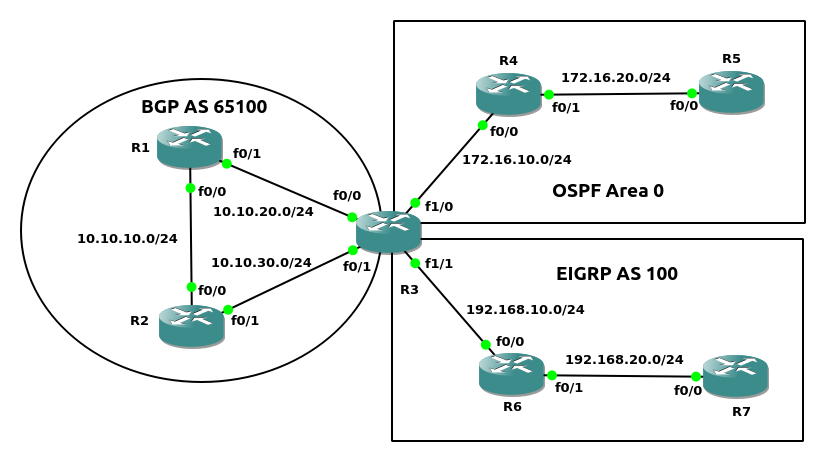
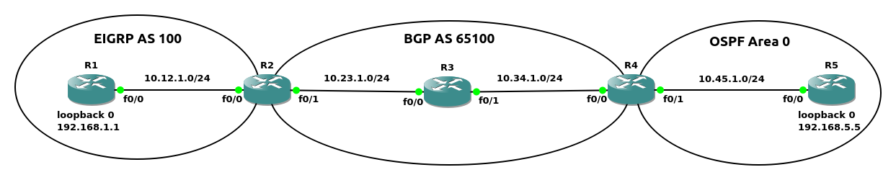

#### Redistribute
将一个路由协议的路由, 注入到另一个路由协议
<br>
<br>

配置方法:<br>
```
1.进入目标路由协议配置模式
(config)# router <destination_protocol> <destination_protocol_num>

2.将源路由协议的内容进入注入
(config-router)# redistribute  {connected | static | eigrp <as_number> | ospf <process_id> [match {internal | external [1|2]}] | bgp <as_number>} [<destination_protocol_options>] [route-map <route_map_name>]
```
<br>
<br>

图1<br>
<br>

```
示例1(如图1)
R1# show ip route | begin Gateway
Gateway of last resort is not set

      10.0.0.0/8 is variably subnetted, 3 subnets, 2 masks
C        10.12.1.0/24 is directly connected, GigabitEthernet0/0
L        10.12.1.1/32 is directly connected, GigabitEthernet0/0
D        10.23.1.0/24 [90/3072] via 10.12.1.2, 00:06:35, GigabitEthernet0/0
      192.168.1.0/32 is subnetted, 1 subnets
C        192.168.1.1 is directly connected, Loopback0

R5# show ip route | begin Gateway
Gateway of last resort is not set

      10.0.0.0/8 is variably subnetted, 3 subnets, 2 masks
O        10.34.1.0/24 [110/2] via 10.45.1.4, 00:06:33, GigabitEthernet0/0
C        10.45.1.0/24 is directly connected, GigabitEthernet0/0
L        10.45.1.5/32 is directly connected, GigabitEthernet0/0
      192.168.5.0/32 is subnetted, 1 subnets
C        192.168.5.5 is directly connected, Loopback0


R3(config)# router eigrp 100
R3(config-router)# redistribute ospf 1 metric 1000000 1  255 1 1500
R3(config-router)# router ospf 1
R3(config-router)# redistribute eigrp 100

R1# show ip route | begin Gateway
Gateway of last resort is not set

      10.0.0.0/8 is variably subnetted, 5 subnets, 2 masks
C        10.12.1.0/24 is directly connected, GigabitEthernet0/0
L        10.12.1.1/32 is directly connected, GigabitEthernet0/0
D        10.23.1.0/24 [90/3072] via 10.12.1.2, 00:11:49, GigabitEthernet0/0
D EX     10.34.1.0/24 [170/3328] via 10.12.1.2, 00:06:28, GigabitEthernet0/0
D EX     10.45.1.0/24 [170/3328] via 10.12.1.2, 00:06:28, GigabitEthernet0/0
      192.168.1.0/32 is subnetted, 1 subnets
C        192.168.1.1 is directly connected, Loopback0
      192.168.5.0/32 is subnetted, 1 subnets
D EX     192.168.5.5 [170/3328] via 10.12.1.2, 00:01:45, GigabitEthernet0/0

R5# show ip route | begin Gateway
Gateway of last resort is not set

      10.0.0.0/8 is variably subnetted, 5 subnets, 2 masks
O E2     10.12.1.0/24 [110/20] via 10.45.1.4, 00:06:20, GigabitEthernet0/0
O E2     10.23.1.0/24 [110/20] via 10.45.1.4, 00:06:20, GigabitEthernet0/0
O        10.34.1.0/24 [110/2] via 10.45.1.4, 00:10:51, GigabitEthernet0/0
C        10.45.1.0/24 is directly connected, GigabitEthernet0/0
L        10.45.1.5/32 is directly connected, GigabitEthernet0/0
      192.168.1.0/32 is subnetted, 1 subnets
O E2     192.168.1.1 [110/20] via 10.45.1.4, 00:06:20, GigabitEthernet0/0
      192.168.5.0/32 is subnetted, 1 subnets
C        192.168.5.5 is directly connected, Loopback0
```
<br>
<br>

图2<br>
<br>

##### redistribute源类型
1.connected(如图1, 并根据示例1修改配置)
```
R3(config)# router ospf 1
R3(config-router)# no redistribute eigrp 100
R3(config-router)# redistribute connected


R5# show ip route | begin Gateway
Gateway of last resort is not set

      10.0.0.0/8 is variably subnetted, 4 subnets, 2 masks
O E2     10.23.1.0/24 [110/20] via 10.45.1.4, 00:00:13, GigabitEthernet0/0
O        10.34.1.0/24 [110/2] via 10.45.1.4, 00:21:23, GigabitEthernet0/0
C        10.45.1.0/24 is directly connected, GigabitEthernet0/0
L        10.45.1.5/32 is directly connected, GigabitEthernet0/0
      192.168.5.0/32 is subnetted, 1 subnets
C        192.168.5.5 is directly connected, Loopback0


总结:
redistribute connected会将当前路由器, 不属于目标路由协议的接口, 进行重分发
```
<br>

2.static(如图1, 并根据示例1修改配置)
```
R3(config)# ip route 10.12.1.0 255.255.255.0 10.23.1.2
R3(config)# router ospf 1
R3(config-router)# no redistribute eigrp 100
R3(config-router)# redistribute static


R5# show ip route | begin Gateway
Gateway of last resort is not set

      10.0.0.0/8 is variably subnetted, 4 subnets, 2 masks
O E2     10.12.1.0/24 [110/20] via 10.45.1.4, 00:00:05, GigabitEthernet0/0
O        10.34.1.0/24 [110/2] via 10.45.1.4, 00:25:36, GigabitEthernet0/0
C        10.45.1.0/24 is directly connected, GigabitEthernet0/0
L        10.45.1.5/32 is directly connected, GigabitEthernet0/0
      192.168.5.0/32 is subnetted, 1 subnets
C        192.168.5.5 is directly connected, Loopback0


总结:
redistribute static将当前路由器的静态配置路由, 重分发到目标路由协议
```
<br>

3.EIGRP(如图1, 并根据示例1修改配置)
```
R5# show ip route ospf | begin Gateway
Gateway of last resort is not set

      10.0.0.0/8 is variably subnetted, 5 subnets, 2 masks
O E2     10.12.1.0/24 [110/20] via 10.45.1.4, 00:00:47, GigabitEthernet0/0
O E2     10.23.1.0/24 [110/20] via 10.45.1.4, 00:00:49, GigabitEthernet0/0
O        10.34.1.0/24 [110/2] via 10.45.1.4, 00:33:38, GigabitEthernet0/0
      192.168.1.0/32 is subnetted, 1 subnets
O E2     192.168.1.1 [110/20] via 10.45.1.4, 00:00:49, GigabitEthernet0/0
```
<br>

4.OSPF(如图1, 并根据示例1修改配置)
```
R1# show ip route eigrp | begin Gateway
Gateway of last resort is not set

      10.0.0.0/8 is variably subnetted, 5 subnets, 2 masks
D        10.23.1.0/24 [90/3072] via 10.12.1.2, 00:38:28, GigabitEthernet0/0
D EX     10.34.1.0/24 [170/3328] via 10.12.1.2, 00:33:07, GigabitEthernet0/0
D EX     10.45.1.0/24 [170/3328] via 10.12.1.2, 00:33:07, GigabitEthernet0/0
      192.168.5.0/32 is subnetted, 1 subnets
D EX     192.168.5.5 [170/3328] via 10.12.1.2, 00:28:24, GigabitEthernet0/0
```
<br>

5.BGP(如图2)<br>
示例2:
```
EIGRP配置
R1(config)# router eigrp 100
R1(config-router)# router-id 1.1.1.1
R1(config-router)# network 10.10.0.0 0.0.255.255

R2(config)# router eigrp 100
R2(config-router)# router-id 2.2.2.2
R2(config-router)# network 10.10.0.0 0.0.255.255

R3(config)# router eigrp 100
R3(config-router)# router-id 3.3.3.3
R3(config-router)# network 10.10.0.0 0.0.255.255

R4(config-if)# router eigrp 100
R4(config-router)# router-id 4.4.4.4
R4(config-router)# network 10.20.0.0 0.0.255.255

R5(config)# router eigrp 100
R5(config-router)# router-id 5.5.5.5
R5(config-router)# network 10.20.0.0 0.0.255.255

R6(config)# router eigrp 100
R6(config-router)# router-id 6.6.6.6
R6(config-router)# network 10.20.0.0 0.0.255.255

R7(config)# router eigrp 100
R7(config-router)# router-id 7.7.7.7
R7(config-router)# network 10.30.0.0 0.0.255.255

R8(config)# router eigrp 100
R8(config-router)# router-id 8.8.8.8
R8(config-router)# network 10.30.0.0 0.0.255.255

R9(config)# router eigrp 100
R9(config-router)# router-id 9.9.9.9
R9(config-router)# network 10.30.0.0 0.0.255.255


OSPF配置
R6(config)# router ospf 1
R6(config-router)# router-id 6.6.6.6
R6(config-router)# network 192.168.10.0 0.0.0.255 area 0

R10(config)# router ospf 1
R10(config-router)# router-id 10.10.10.10
R10(config-router)# network 192.168.0.0 0.0.255.255 area 0

R11(config)# router ospf 1
R11(config-router)# router-id 11.11.11.11
R11(config-router)# network 192.168.20.0 0.0.0.255 area 0


BGP配置
R3(config)# router bgp 65100
R3(config-router)# bgp router-id 3.3.3.3
R3(config-router)# neighbor 172.16.10.4 remote-as 65200
R3(config-router)# redistribute eigrp 100
R3(config-router)# redistribute connected

R4(config)# router bgp 65200
R4(config-router)# bgp router-id 4.4.4.4
R4(config-router)# neighbor 172.16.10.3 remote-as 65100 
R4(config-router)# neighbor 10.20.20.6 remote-as 65200
R4(config-router)# redistribute eigrp 100
R4(config-router)# redistribute connected


R6(config)# router bgp 65200
R6(config-router)# bgp router-id 6.6.6.6
R6(config-router)# neighbor 172.20.10.7 remote-as 65300
R6(config-router)# neighbor 10.20.20.4 remote-as 65200
R6(config-router)# redistribute eigrp 100 
R6(config-router)# redistribute connected

R7(config)# router bgp 65300
R7(config-router)# bgp router-id 7.7.7.7
R7(config-router)# neighbor 172.20.10.6 remote-as 65200
R7(config-router)# redistribute eigrp 100
R7(config-router)# redistribute connected


1.将OSPF route注入BGP
R6(config)# router bgp 65200
R6(config-router)# redistribute ospf 1

将BGP route注入OSPF
R6(config-router)# router ospf 1
R6(config-router)# redistribute bgp 65200

查看结果
R3# show ip route | begin Gateway
Gateway of last resort is not set

      10.0.0.0/8 is variably subnetted, 11 subnets, 2 masks
D        10.10.10.0/24 [90/30720] via 10.10.30.2, 01:05:33, FastEthernet0/1
                       [90/30720] via 10.10.20.1, 01:05:33, FastEthernet0/0
C        10.10.20.0/24 is directly connected, FastEthernet0/0
L        10.10.20.3/32 is directly connected, FastEthernet0/0
C        10.10.30.0/24 is directly connected, FastEthernet0/1
L        10.10.30.3/32 is directly connected, FastEthernet0/1
B        10.20.10.0/24 [20/0] via 172.16.10.4, 00:51:14
B        10.20.20.0/24 [20/0] via 172.16.10.4, 00:51:14
B        10.20.30.0/24 [20/30720] via 172.16.10.4, 00:51:14
B        10.30.10.0/24 [20/0] via 172.16.10.4, 00:48:46
B        10.30.20.0/24 [20/0] via 172.16.10.4, 00:48:46
B        10.30.30.0/24 [20/0] via 172.16.10.4, 00:48:46
      172.16.0.0/16 is variably subnetted, 2 subnets, 2 masks
C        172.16.10.0/24 is directly connected, FastEthernet1/0
L        172.16.10.3/32 is directly connected, FastEthernet1/0
      172.20.0.0/24 is subnetted, 1 subnets
B        172.20.10.0 [20/0] via 172.16.10.4, 00:49:53
B     192.168.10.0/24 [20/0] via 172.16.10.4, 00:49:53
B     192.168.20.0/24 [20/0] via 172.16.10.4, 00:45:39

R11# show ip route | begin Gateway
Gateway of last resort is not set

      10.0.0.0/24 is subnetted, 3 subnets
O E2     10.30.10.0 [110/1] via 192.168.20.10, 00:43:30, FastEthernet0/0
O E2     10.30.20.0 [110/1] via 192.168.20.10, 00:43:30, FastEthernet0/0
O E2     10.30.30.0 [110/1] via 192.168.20.10, 00:43:30, FastEthernet0/0
O     192.168.10.0/24 [110/2] via 192.168.20.10, 00:53:16, FastEthernet0/0
      192.168.20.0/24 is variably subnetted, 2 subnets, 2 masks
C        192.168.20.0/24 is directly connected, FastEthernet0/0
L        192.168.20.11/32 is directly connected, FastEthernet0/0


2.bgp默认只将从eBGP peer学习的route进行注入IGP
redistribute从iBGP学习的route, 需要在bgp下添加如下配置
R6(config)# router bgp 65200
R6(config-router)# bgp redistribute-internal 

查看结果
R11# show ip route | begin Gateway
Gateway of last resort is not set

      10.0.0.0/24 is subnetted, 6 subnets
O E2     10.10.10.0 [110/1] via 192.168.20.10, 00:00:22, FastEthernet0/0
O E2     10.10.20.0 [110/1] via 192.168.20.10, 00:00:22, FastEthernet0/0
O E2     10.10.30.0 [110/1] via 192.168.20.10, 00:00:22, FastEthernet0/0
O E2     10.30.10.0 [110/1] via 192.168.20.10, 00:48:42, FastEthernet0/0
O E2     10.30.20.0 [110/1] via 192.168.20.10, 00:48:42, FastEthernet0/0
O E2     10.30.30.0 [110/1] via 192.168.20.10, 00:48:42, FastEthernet0/0
      172.16.0.0/24 is subnetted, 1 subnets
O E2     172.16.10.0 [110/1] via 192.168.20.10, 00:00:22, FastEthernet0/0
O     192.168.10.0/24 [110/2] via 192.168.20.10, 00:58:28, FastEthernet0/0
      192.168.20.0/24 is variably subnetted, 2 subnets, 2 masks
C        192.168.20.0/24 is directly connected, FastEthernet0/0
L        192.168.20.11/32 is directly connected, FastEthernet0/0


3.当一个路由器同时位于三个路由协议区域中, redistribute必须要每两个路由协议之间进行, 不进行传递(参考示例3)
R6(config)# router ospf 1
R6(config-router)# redistribute eigrp 100

查看结果
R11# show ip route | begin Gateway
Gateway of last resort is not set

      10.0.0.0/24 is subnetted, 9 subnets
O E2     10.10.10.0 [110/1] via 192.168.20.10, 00:04:51, FastEthernet0/0
O E2     10.10.20.0 [110/1] via 192.168.20.10, 00:04:51, FastEthernet0/0
O E2     10.10.30.0 [110/1] via 192.168.20.10, 00:04:51, FastEthernet0/0
O E2     10.20.10.0 [110/20] via 192.168.20.10, 00:02:03, FastEthernet0/0
O E2     10.20.20.0 [110/20] via 192.168.20.10, 00:02:03, FastEthernet0/0
O E2     10.20.30.0 [110/20] via 192.168.20.10, 00:02:03, FastEthernet0/0
O E2     10.30.10.0 [110/1] via 192.168.20.10, 00:53:11, FastEthernet0/0
O E2     10.30.20.0 [110/1] via 192.168.20.10, 00:53:11, FastEthernet0/0
O E2     10.30.30.0 [110/1] via 192.168.20.10, 00:53:11, FastEthernet0/0
      172.16.0.0/24 is subnetted, 1 subnets
O E2     172.16.10.0 [110/1] via 192.168.20.10, 00:04:51, FastEthernet0/0
O     192.168.10.0/24 [110/2] via 192.168.20.10, 01:02:57, FastEthernet0/0
      192.168.20.0/24 is variably subnetted, 2 subnets, 2 masks
C        192.168.20.0/24 is directly connected, FastEthernet0/0
L        192.168.20.11/32 is directly connected, FastEthernet0/0
```
<br>
<br>
<br>

图3<br>
<br>

图4<br>
<br>

##### redistribute的特性
1.同一个路由器上, 三个或以上路由协议进行redistribute时, 不进行传递<br>
示例3(如图3)
```
配置BGP
R1(config)# router bgp 65100
R1(config-router)# bgp router-id 1.1.1.1
R1(config-router)# neighbor 10.10.10.2 remote-as 65100
R1(config-router)# neighbor 10.10.20.3 remote-as 65100
R1(config-router)# redistribute connected

R2(config)# router bgp 65100
R2(config-router)# bgp router-id 2.2.2.2
R2(config-router)# neighbor 10.10.10.1 remote-as 65100
R2(config-router)# neighbor 10.10.30.3 remote-as 65100
R2(config-router)# redistribute connected

R3(config)# router bgp 65100
R3(config-router)# bgp router-id 3.3.3.3
R3(config-router)# neighbor 10.10.20.1 remote-as 65100
R3(config-router)# neighbor 10.10.30.2 remote-as 65100
R3(config-router)# redistribute connected


配置OSPF
R3(config)# router ospf 1
R3(config-router)# router-id 3.3.3.3
R3(config-router)# network 172.16.10.0 0.0.0.255 area 0

R4(config)# router ospf 1
R4(config-router)# router-id 4.4.4.4 
R4(config-router)# network 172.16.0.0 0.0.255.255 area 0

R5(config)# router ospf 1
R5(config-router)# router-id 5.5.5.5
R5(config-router)# network 172.16.20.0 0.0.0.255 area 0


配置EIGRP
R3(config)# router eigrp 100
R3(config-router)# router-id 3.3.3.3
R3(config-router)# network 192.168.10.0 0.0.0.255

R6(config)# router eigrp 100
R6(config-router)# router-id 6.6.6.6
R6(config-router)# network 192.168.0.0 0.0.255.255

R7(config)# router eigrp 100
R7(config-router)# router-id 7.7.7.7
R7(config-router)# network 192.168.20.0 0.0.0.255


R1# show ip route | begin Gateway
Gateway of last resort is not set

      10.0.0.0/8 is variably subnetted, 5 subnets, 2 masks
C        10.10.10.0/24 is directly connected, FastEthernet0/0
L        10.10.10.1/32 is directly connected, FastEthernet0/0
C        10.10.20.0/24 is directly connected, FastEthernet0/1
L        10.10.20.1/32 is directly connected, FastEthernet0/1
B        10.10.30.0/24 [200/0] via 10.10.10.2, 00:11:41
      172.16.0.0/24 is subnetted, 1 subnets
B        172.16.10.0 [200/0] via 10.10.20.3, 00:09:40
B     192.168.10.0/24 [200/0] via 10.10.20.3, 00:09:29

R5# show ip route | begin Gateway
Gateway of last resort is not set

      172.16.0.0/16 is variably subnetted, 3 subnets, 2 masks
O        172.16.10.0/24 [110/2] via 172.16.20.4, 00:07:05, FastEthernet0/0
C        172.16.20.0/24 is directly connected, FastEthernet0/0
L        172.16.20.5/32 is directly connected, FastEthernet0/0

R7# show ip route | begin Gateway
Gateway of last resort is not set

D     192.168.10.0/24 [90/30720] via 192.168.20.6, 00:03:26, FastEthernet0/0
      192.168.20.0/24 is variably subnetted, 2 subnets, 2 masks
C        192.168.20.0/24 is directly connected, FastEthernet0/0
L        192.168.20.7/32 is directly connected, FastEthernet0/0


1.eigrp --> bgp, ospf --> bgp, bgp --> eigrp, bgp --> ospf
R3(config)# router bgp 65100
R3(config-router)# bgp redistribute-internal
R3(config-router)# redistribute eigrp 100
R3(config-router)# redistribute ospf 1
R3(config-router)# router eigrp 100
R3(config-router)# redistribute bgp 65100 metric 100000 10 255 1 1500
R3(config-router)# router ospf 1
R3(config-router)# redistribute bgp 65100

R1# show ip route | begin Gateway
Gateway of last resort is not set

      10.0.0.0/8 is variably subnetted, 5 subnets, 2 masks
C        10.10.10.0/24 is directly connected, FastEthernet0/0
L        10.10.10.1/32 is directly connected, FastEthernet0/0
C        10.10.20.0/24 is directly connected, FastEthernet0/1
L        10.10.20.1/32 is directly connected, FastEthernet0/1
B        10.10.30.0/24 [200/0] via 10.10.10.2, 00:15:42
      172.16.0.0/24 is subnetted, 2 subnets
B        172.16.10.0 [200/0] via 10.10.20.3, 00:13:41
B        172.16.20.0 [200/2] via 172.16.10.4, 00:02:48
B     192.168.10.0/24 [200/0] via 10.10.20.3, 00:13:30
B     192.168.20.0/24 [200/30720] via 192.168.10.6, 00:02:52

R5# show ip route | begin Gateway
Gateway of last resort is not set

      10.0.0.0/24 is subnetted, 1 subnets
O E2     10.10.10.0 [110/1] via 172.16.20.4, 00:00:10, FastEthernet0/0
      172.16.0.0/16 is variably subnetted, 3 subnets, 2 masks
O        172.16.10.0/24 [110/2] via 172.16.20.4, 00:12:03, FastEthernet0/0
C        172.16.20.0/24 is directly connected, FastEthernet0/0
L        172.16.20.5/32 is directly connected, FastEthernet0/0

R7# show ip route | begin Gateway
Gateway of last resort is not set

      10.0.0.0/24 is subnetted, 1 subnets
D EX     10.10.10.0 [170/33280] via 192.168.20.6, 00:00:12, FastEthernet0/0
D     192.168.10.0/24 [90/30720] via 192.168.20.6, 00:08:11, FastEthernet0/0
      192.168.20.0/24 is variably subnetted, 2 subnets, 2 masks
C        192.168.20.0/24 is directly connected, FastEthernet0/0
L        192.168.20.7/32 is directly connected, FastEthernet0/0

EIGRP AS 100和OSPF Area 0都没有对方的路由


2.EIGRP与OSPF互相redistribute
R3(config)# router eigrp 100
R3(config-router)# redistribute ospf 1 metric 100000 10 255 1 1500
R3(config-router)# router ospf 1
R3(config-router)# redistribute eigrp 100

R5# show ip route | begin Gateway
Gateway of last resort is not set

      10.0.0.0/24 is subnetted, 1 subnets
O E2     10.10.10.0 [110/1] via 172.16.20.4, 00:04:45, FastEthernet0/0
      172.16.0.0/16 is variably subnetted, 3 subnets, 2 masks
O        172.16.10.0/24 [110/2] via 172.16.20.4, 00:16:38, FastEthernet0/0
C        172.16.20.0/24 is directly connected, FastEthernet0/0
L        172.16.20.5/32 is directly connected, FastEthernet0/0
O E2  192.168.10.0/24 [110/20] via 172.16.20.4, 00:00:12, FastEthernet0/0
O E2  192.168.20.0/24 [110/20] via 172.16.20.4, 00:00:12, FastEthernet0/0

R7# show ip route | begin Gateway
Gateway of last resort is not set

      10.0.0.0/24 is subnetted, 1 subnets
D EX     10.10.10.0 [170/33280] via 192.168.20.6, 00:05:27, FastEthernet0/0
      172.16.0.0/24 is subnetted, 2 subnets
D EX     172.16.10.0 [170/33280] via 192.168.20.6, 00:01:03, FastEthernet0/0
D EX     172.16.20.0 [170/33280] via 192.168.20.6, 00:01:03, FastEthernet0/0
D     192.168.10.0/24 [90/30720] via 192.168.20.6, 00:13:26, FastEthernet0/0
      192.168.20.0/24 is variably subnetted, 2 subnets, 2 masks
C        192.168.20.0/24 is directly connected, FastEthernet0/0
L        192.168.20.7/32 is directly connected, FastEthernet0/0
```
<br>

2.序列化redistribute<br>
示例4(如图4)
```
配置EIGRP AS 100
R1(config)# router eigrp 100
R1(config-router)# router-id 1.1.1.1
R1(config-router)# network 192.168.1.1 0.0.0.0
R1(config-router)# network 10.12.1.0 0.0.0.255

R2(config)# router eigrp 100
R2(config-router)# router-id 2.2.2.2
R2(config-router)# network 10.12.1.0 0.0.0.255


配置EIGRP AS 200
R2(config)# router eigrp 200
R2(config-router)# router-id 2.2.2.2
R2(config-router)# network 10.23.1.0 0.0.0.255

R3(config-if)# router eigrp 200
R3(config-router)# router-id 3.3.3.3
R3(config-router)# network 10.23.1.0 0.0.0.255
R3(config-router)# network 10.34.1.0 0.0.0.255

R4(config)# router eigrp 200
R4(config-router)# router-id 4.4.4.4
R4(config-router)# network 10.34.1.0 0.0.0.255


配置OSPF
R4(config)# router ospf 1
R4(config-router)# router-id 4.4.4.4
R4(config-router)# network 10.45.1.0 0.0.0.255 area 0

R5(config)# router ospf 1
R5(config-router)# router-id 5.5.5.5
R5(config-router)# network 10.45.1.0 0.0.0.255 area 0
R5(config-router)# network 192.168.5.5 0.0.0.0 area 0


配置BGP
R2(config)# router bgp 65100
R2(config-router)# bgp router-id 2.2.2.2
R2(config-router)# neighbor 10.34.1.4 remote-as 65100
R2(config-router)# redistribute eigrp 200
R2(config-router)# redistribute connected

R4(config)# router bgp 65100
R4(config-router)# bgp router-id 4.4.4.4
R4(config-router)# neighbor 10.23.1.2 remote-as 65100
R4(config-router)# redistribute eigrp 200
R4(config-router)# redistribute connected


redistribute操作
R2(config)# router bgp 65100
R2(config-router)# bgp redistribute-internal 
R2(config-router)# redistribute eigrp 100
R2(config-router)# router eigrp 100
R2(config-router)# redistribute bgp 65100 metric 100000 10 255 1 1500
R2(config-router)# redistribute eigrp 200

R4(config)# router bgp 65100
R4(config-router)# bgp redistribute-internal
R4(config-router)# redistribute ospf 1
R4(config-router)# router ospf 1
R4(config-router)# redistribute bgp 65100
R4(config-router)# redistribute eigrpo 200

查看结果
R1# show ip route | begin Gateway
Gateway of last resort is not set

      10.0.0.0/8 is variably subnetted, 5 subnets, 2 masks
C        10.12.1.0/24 is directly connected, FastEthernet0/0
L        10.12.1.1/32 is directly connected, FastEthernet0/0
D EX     10.23.1.0/24 [170/30720] via 10.12.1.2, 00:02:02, FastEthernet0/0
D EX     10.34.1.0/24 [170/33280] via 10.12.1.2, 00:02:02, FastEthernet0/0
D EX     10.45.1.0/24 [170/30720] via 10.12.1.2, 00:06:09, FastEthernet0/0
      192.168.1.0/32 is subnetted, 1 subnets
C        192.168.1.1 is directly connected, Loopback0
      192.168.5.0/32 is subnetted, 1 subnets
D EX     192.168.5.5 [170/30720] via 10.12.1.2, 00:02:39, FastEthernet0/0

R5# show ip route | begin Gateway
Gateway of last resort is not set

      10.0.0.0/8 is variably subnetted, 5 subnets, 2 masks
O E2     10.12.1.0/24 [110/1] via 10.45.1.4, 00:04:37, FastEthernet0/0
O E2     10.23.1.0/24 [110/20] via 10.45.1.4, 00:00:25, FastEthernet0/0
O E2     10.34.1.0/24 [110/20] via 10.45.1.4, 00:00:25, FastEthernet0/0
C        10.45.1.0/24 is directly connected, FastEthernet0/0
L        10.45.1.5/32 is directly connected, FastEthernet0/0
      192.168.1.0/32 is subnetted, 1 subnets
O E2     192.168.1.1 [110/1] via 10.45.1.4, 00:04:37, FastEthernet0/0
      192.168.5.0/32 is subnetted, 1 subnets
C        192.168.5.5 is directly connected, Loopback0
```
<br>

3.redistribute前提:<br>
1)源路由协议的route必须在路由表(RIB)中<br>

2)目标路由协议需要一个reachable metric
<br>
<br>
<br>

##### Seed Metric
|Protocol|Default Seed Metric|
|---|---|
|EIGRP|1.通过其他EIGRP AS redistribute, 保留EIGRP属性;<br> 2.从其他路由协议redistribute, 值为Infinity(所以需要指定attrs值)|
|OSPF|统一默认为external Type 2类型, metric根据源路由协议的不同, 分为以下情况:<br> 1.通过其他OSPF process redistribute, 保留源OSPF metric(参考示例5);<br> 2.通过BGP redistribute而来, metric为1;<br> 3.通过其他路由协议redistribute, metric为20|
|BGP|Origin属性为incomplete;<br> multi-exit discriminator(MED)设置为源IGP的metric;<br> weight为32768|

<br>

图5<br>
<br>

示例5(如图5)
```
R1(config)# router ospf 1
R1(config-router)# router-id 1.1.1.1
R1(config-router)# network 10.10.0.0 0.0.255.255 area 0

R2(config)# router ospf 1
R2(config-router)# router-id 2.2.2.2
R2(config-router)# network 10.10.0.0 0.0.255.255 area 0

R3(config)# router ospf 1 
R3(config-router)# router-id 3.3.3.3
R3(config-router)# network 10.10.0.0 0.0.255.255 area 0
R3(config-router)# router ospf 2
R3(config-router)# router-id 3.0.3.0
R3(config-router)# network 172.16.0.0 0.0.255.255 area 1

R4(config)# router ospf 2 
R4(config-router)# router-id 4.4.4.4
R4(config-router)# network 172.16.0.0 0.0.255.255 area 1

R5(config)# router ospf 2
R5(config-router)# router-id 5.5.5.5
R5(config-router)# network 172.16.0.0 0.0.255.255 area 1

R3(config)# router ospf 1
R3(config-router)# redistribute ospf 2
R3(config-router)# router ospf 2 
R3(config-router)# redistribute ospf 1

R1# show ip route | begin Gateway
Gateway of last resort is not set

      10.0.0.0/8 is variably subnetted, 5 subnets, 2 masks
C        10.10.10.0/24 is directly connected, FastEthernet0/0
L        10.10.10.1/32 is directly connected, FastEthernet0/0
C        10.10.20.0/24 is directly connected, FastEthernet0/1
L        10.10.20.1/32 is directly connected, FastEthernet0/1
O        10.10.30.0/24 [110/2] via 10.10.20.3, 00:06:20, FastEthernet0/1
                       [110/2] via 10.10.10.2, 00:08:00, FastEthernet0/0
      172.16.0.0/24 is subnetted, 3 subnets
O E2     172.16.10.0 [110/1] via 10.10.20.3, 00:01:43, FastEthernet0/1
O E2     172.16.20.0 [110/1] via 10.10.20.3, 00:01:43, FastEthernet0/1
O E2     172.16.30.0 [110/2] via 10.10.20.3, 00:01:43, FastEthernet0/1

R5# show ip route | begin Gateway
Gateway of last resort is not set

      10.0.0.0/24 is subnetted, 3 subnets
O E2     10.10.10.0 [110/2] via 172.16.20.3, 00:01:46, FastEthernet0/0
O E2     10.10.20.0 [110/1] via 172.16.20.3, 00:01:46, FastEthernet0/0
O E2     10.10.30.0 [110/1] via 172.16.20.3, 00:01:46, FastEthernet0/0
      172.16.0.0/16 is variably subnetted, 5 subnets, 2 masks
O        172.16.10.0/24 [110/2] via 172.16.30.4, 00:03:06, FastEthernet0/1
                        [110/2] via 172.16.20.3, 00:02:56, FastEthernet0/0
C        172.16.20.0/24 is directly connected, FastEthernet0/0
L        172.16.20.5/32 is directly connected, FastEthernet0/0
C        172.16.30.0/24 is directly connected, FastEthernet0/1
L        172.16.30.5/32 is directly connected, FastEthernet0/1
```
<br>
<br>
