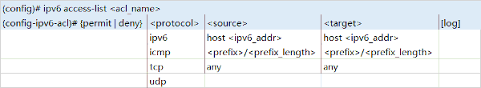
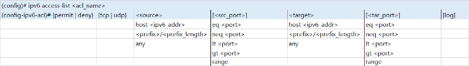
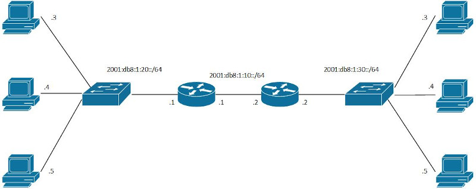

ACL(Access Control List)<br>
过滤筛选接口的出向/入向流量
<br>
<br>
<br>

Wildcard Mask<br>
1.wildcard mask为0的bit, 代表对应IP bit固定, 不进行通配<br>

2.wildcard mask为1的bit, 代表对应IP bit进行通配, 可以为0或1的任意值<br>

3.当wildcar mask的bit值为1时, 但对应IP bit不为0, 先将对应IP bit转化为0<br>

** 例: 192.168.1.0 0.0.0.255<br>
** wildcard mask类似于subnet mask的bits取反
<br>
<br>
<br>

### IPv4 ACL
#### numbered ACL<br>
##### 1.standard numbered ACL<br>
使用Source IP作为筛选标准, 编号范围: 1-99, 1300-1999
<br>

IP ACL逻辑<br>
1)ACL为一系列permit/deny组合. 如:<br>
```
(config)# access-list 1 permit 10.1.1.1
(config)# access-list 1 deny 10.1.1.0 0.0.0.255
(config)# access-list 1 permit 10.0.0.0 0.255.255.255
(config)# access-list 1 deny any
```
** any代表所有IP<br>
** permit代表允许, deny代表拒绝<br>
** access-list <num> deny any是默认隐式配置, 可以使用access-list <num> permit deny覆盖
<br>
<br>

2)使用first-match原则, 从上到下进行匹配, 当匹配到符合的规则时, 使用该条规则, 并停止继续匹配. 如: IP 10.1.1.2匹配第二条规则, 拒绝source ip为该ip的流量
<br>
<br>

3)将ACL配置到接口, 并指定方向<br>
`(config-if)# ip access-group <acl_num> {in | out}`<br>
** standard ACL需要配置在离目标足够近的位置
<br>
<br>
<br>

配置standard numbered ACL(global command版本)<br>
```
(config)# access-list {1-99 | 1300-1999} {permit | deny} {<address> | any | <subnet_id> <wildcard_mask>} [log]
(config)# access-list {1-99 | 1300-1999} remark <description>
```
<br>

配置standard numbered ACL(ACL subcommand版本)<br>
```
(config)# ip access-list standard {1-99 | 1300-1999}
(config-std-nacl)# {permit | deny} {<address> | any | <subnet_id> <wildcard_mask>} [log]
(config-std-nacl)# remark <description>
```
<br>

示例<br>
不允许192.168.10.0/24通向192.168.30.0/24的流量<br>
<br>
```
R1(config-if)# router ospf 1
R1(config-router)# router-id 1.1.1.1
R1(config)# int f0/1
R1(config-if)# ip address 192.168.1.2 255.255.255.0
R1(config-if)# ip ospf 1 area 0
R1(config-if)# no shutdown
R1(config-if)# int f0/2
R1(config-if)# ip address 192.168.10.1 255.255.255.0
R1(config-if)# ip ospf 1 area 0
R1(config-if)# no shutdown

R2(config-if)# router ospf 1
R2(config-router)# router-id 2.2.2.2
R2(config)# int f0/1
R2(config-if)# ip address 192.168.1.1 255.255.255.0
R2(config-if)# ip ospf 1 area 0
R2(config-if)# no shutdown
R2(config-if)# int f0/2
R2(config-if)# ip address 192.168.2.1 255.255.255.0
R2(config-if)# ip ospf 1 area 0
R2(config-if)# no shutdown
R2(config-if)# int f0/3
R2(config-if)# ip address 192.168.20.1 255.255.255.0
R2(config-if)# ip ospf 1 area 0
R2(config-if)# no shutdown

R3(config-if)# router ospf 1
R3(config-router)# router-id 3.3.3.3
R3(config)# int f0/1
R3(config-if)# ip address 192.168.2.2 255.255.255.0
R3(config-if)# ip ospf 1 area 0
R3(config-if)# no shutdown
R3(config-if)# int f0/2
R3(config-if)# ip address 192.168.30.1 255.255.255.0
R3(config-if)# ip ospf 1 area 0
R3(config-if)# no shutdown

R3(config)# ip access-list standard 1
R3(config-std-nacl)# deny 192.168.10.0 0.0.0.255
R3(config-std-nacl)# permit any
R3(config)# int f0/2
R3(config-if)# ip access-group 1 out
```
<br>
<br>

##### 2.extend numbered ACL<br>
配置extend numbered ACL(global command版本)<br>

<br>
<br>

<br>
** extend ACL必须配置在离流量源足够近的位置
<br>
<br>

配置extend numbered ACL说明文字(global command版本)<br>
`(config)# access-list {100-199 | 2000-2699} remark <description>
<br>
<br>

配置extend numbered ACL(ACL subcommand版本)<br>
```
(config)# ip access-list extended {100-199 | 2000-2699}
(config-ext-nacl)# {permit | deny} <protocol> <source> <target> [log]
(config-ext-nacl)# {permit | deny} {tcp | udp} <source> [<src_port>] <target> [<tar_port>] [log]
(config-ext-nacl)# remark <description>
```
<br>
<br>
<br>

#### named ACL<br>
##### 1.standard named ACL<br>
配置standard named ACL<br>
```
(config)# ip access-list standard <acl_name>
(config-std-nacl)# {permit | deny} {<address> | <subnet_id> <wildcard_mask> | any} [log]
(config-std-nacl)# remark <description>
```
<br>
<br>

##### 2.extend named ACL<br>
配置extend named ACL<br>
```
(config)# ip access-list extended <acl_name>
(config-ext-nacl)# {permit | deny} <protocol> <source> <target> [log]
(config-ext-nacl)# {permit | deny} {tcp | udp} <source> [<src_port>] <target> [<tar_port>] [log]
(config-ext-nacl)# remark <description>
```
<br>
<br>
<br>

#### 将ACL应用于Telnet/SSH
示例 - 只允许10.0.0.0/24子网的用户登录
```
(config)# access-list 1 permit 10.0.0.0 0.0.0.255
(config)# line vty 0 15
(config-line)# access-class 1 in
```
<br>
<br>
<br>

#### ACL的编号
1.从ACL items列表中删除item
```
(config)# ip access-list {standard | extended} {<acl_num> | <acl_name>}
(config-xxx-nacl)# no <num>
```
<br>
<br>

2.从ACL items列表中的指定位置插入item(默认的编号为10的倍数)
```
(config)# ip access-list {standard | extended} {<acl_num> | <acl_name>}
(config-xxx-nacl)# <num> {permit | deny} ...
```
<br>
<br>

显示ACL内容<br>
`# show ip access-list`
<br>
<br>

显示接口是否配置ACL<br>
`# show ip interface <interface>`
<br>
<br>

总结<br>
1.standard ACL需配置在离目标足够近的位置
<br>

2.extend ACL需配置在离流量源足够近的位置
<br>

3.ACL items列表由详细到粗略
<br>

4.修改ACL之前, 先使用no ip access-group/access-class取消配置的ACL
<br>
<br>
<br>

### IPv6 ACL
IPv6 ACL只支持named extended ACL
<br>


<br>



<br>

将IPv6 ACL配置到接口<br>
`(config-if)# ipv6 traffic-filter <acl_name> {in | out}`
<br>
<br>

<br>
配置环境
```
R1(config)# ipv6 unicast-routing
R1(config)# router ospfv3 1
R1(config-router)# router-id 1.1.1.1
R1(config)# int f0/0
R1(config-if)# ipv6 add 2001:db8:1:20::1/64
R1(config-if)# no shutdown
R1(config-if)# ospfv3 1 ipv6 area 0
R1(config)# int f0/1
R1(config-if)# ipv6 add 2001:db8:1:10::1/64
R1(config-if)# no shutdown
R1(config-if)# ospfv3 1 ipv6 area 0

R2(config)# ipv6 unicast-routing
R2(config)# router ospfv3 1
R2(config-router)# router-id 2.2.2.2
R2(config)# int f0/0
R2(config-if)# ipv6 add 2001:db8:1:10::2/64
R2(config-if)# no shutdown
R2(config-if)# ospfv3 1 ipv6 area 0
R2(config)# int f0/1
R2(config-if)# ipv6 add 2001:db8:1:30::2/64
R2(config-if)# no shutdown
R2(config-if)# ospfv3 1 ipv6 area 0

PC1> ip 2001:db8:1:20::3/64 auto

PC2> ip 2001:db8:1:20::4/64 auto

PC3> ip 2001:db8:1:20::5/64 auto

PC4> ip 2001:db8:1:30::3/64 auto

PC5> ip 2001:db8:1:30::4/64 auto

PC6> ip 2001:db8:1:30::5/64 auto


测试连通性
PC1> ping 2001:db8:1:30::4/64
PC1> ping 2001:db8:1:30::5/64

PC2> ping 2001:db8:1:30::4/64
PC2> ping 2001:db8:1:30::5/64


给R1添加ACL
R1(config)# ipv6 access-list FILTER
R1(config-ipv6-acl)# permit icmp 2001:db8:1:20::/126 any
R1(config)# int f0/0
R1(config-if)# ipv6 traffic-filter FILTER in


测试连通性
PC1> ping 2001:db8:1:30::4/64
PC1> ping 2001:db8:1:30::5/64

PC2> ping 2001:db8:1:30::4/64
*2001:db8:1:20::1 icmp6_seq=1 ttl=64 time=10.259 ms (ICMP type:1, code:1, Communication with destination administratively prohibited)
PC2> ping 2001:db8:1:30::5/64
*2001:db8:1:20::1 icmp6_seq=1 ttl=64 time=10.259 ms (ICMP type:1, code:1, Communication with destination administratively prohibited)
```
<br>
<br>

引用:<br>
[1] IPv6 ACL: https://www.cisco.com/c/en/us/td/docs/switches/lan/catalyst2960x/software/15-2_5_e/configuration_guide/b_1525e_consolidated_2960x_cg/b_1525e_consolidated_2960x_cg_chapter_0110100.pdf
