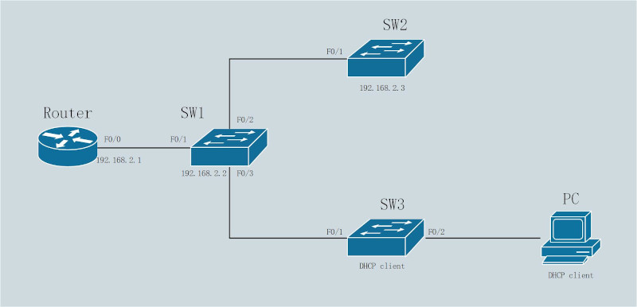

#### DHCP服务器搭建<br>
DHCP获取IP过程<br>

<br>
<br>

1)DHCP服务器与客户端在同一子网<br>
配置示意图<br>

<br>

在Router配置DHCP服务器, 并配置F0/0接口IP
```
Router(config)# ip dhcp excluded-address 192.168.2.1 192.168.2.20
Router(config)# ip dhcp pool inform_tech
Router(dhcp-config)# network 192.168.2.0 255.255.255.0
Router(dhcp-config)# default-router 192.168.2.1
Router(dhcp-config)# dns-server 223.5.5.5
Router(dhcp-config)# lease 0 1 30
Router(dhcp-config)# interface f0/0
ROuter(dhcp-config)# ip address 192.168.2.1 255.255.255.0
ROuter(dhcp-config)# no shutdown
```
<br>

SW1手动配置IP地址<br>
!交换机使用SVI(switch virtual interface)进行IP流量管理<br>
```
SW1(config)# interface vlan 1
SW1(config-if)# ip address 192.168.2.2 255.255.255.0
SW1(config-if)# no shutdown
SW1(config-if)# exit
SW1(config)# ip default-gateway 192.168.2.1
```
<br>

SW2手动配置IP地址<br>
```
SW2(config)# interface vlan 1
SW2(config-if)# ip address 192.168.2.3 255.255.255.0
SW2(config-if)# no shutdown
SW2(config-if)# exit
SW1(config)# ip default-gateway 192.168.2.1
```
<br>

SW3通过DHCP自动获取IP
```
SW3(config)# interface vlan 1
SW3(config-if)# ip address dhcp
SW3(config-if)# no shutdown
```
<br>
<br>

2)DHCP服务器与客户端不在一个子网<br>
配置示意图<br>

<br>

在主机上使用dhcpd配置DHCP服务器<br>
```
steven@example.cn:~$ sudo yum install dhcp

steven@example.cn:~$ sudo vi /etc/dhcp/dhcpd.conf
subnet 192.168.1.0 netmask 255.255.255.0 {
    range 192.168.1.40 192.168.1.150;
    option routers 192.168.1.2;
    option domain-name-servers 192.168.1.1;
}

subnet 192.168.2.0 netmask 255.255.255.0 {
    range 192.168.2.20 192.168.2.100;
    option routers 192.168.2.1;
    option domain-name-servers 192.168.1.1;
}


steven@example.cn:~$ sudo vi /etc/sysconfig/network-scripts/ifcfg-enp3s0
BOOTPROTO=static
ONBOOT=yes
IPADDR=192.168.1.1
NETMASK=255.255.255.0
GATEWAY=192.168.1.2

steven@example.cn:~$ sudo systemctl restart network

steven@example.cn:~$ sudo systemctl start dhcpd
```

Router手动配置IP地址, 并转发DHCP请求(helper-address)
```
Router(config)# interface f0/1
Router(config-if)# ip address 192.168.1.2 255.255.255.0
Router(config-if)# no shutdown
Router(config-if)# interface f0/0
Router(config-if)# ip address 192.168.2.1 255.255.255.0
Router(config-if)# no shutdown
Router(config-if)# ip helper-address 192.168.1.1
```
<br>

SW1手动配置IP地址<br>
```
SW1(config)# interface vlan 1
SW1(config-if)# ip address 192.168.2.2 255.255.255.0
SW1(config-if)# no shutdown
SW1(config-if)# exit
SW1(config)# ip default-gateway 192.168.2.1
```
<br>

SW2手动配置IP地址<br>
```
SW2(config)# interface vlan 1
SW2(config-if)# ip address 192.168.2.3 255.255.255.0
SW2(config-if)# no shutdown
SW2(config-if)# exit
SW1(config)# ip default-gateway 192.168.2.1
```
<br>

SW3通过DHCP自动获取IP
```
SW3(config)# interface vlan 1
SW3(config-if)# ip address dhcp
SW3(config-if)# no shutdown
```
<br>
<br>
<br>

#### DHCP snooping
DHCP message的格式如下:<br>


<br>

在交换机中, DHCP snooping将接口区分为trusted和untrusted port, 用以筛选DHCP消息. 筛选原则如下:<br>
1.从untrusted port收到DHCP Server消息(DHCPOffer/DHCPAck), 直接丢弃<br>

2.从untrusted port收到DHCP Client消息, 分为以下情况:<br>
&emsp;&emsp;1)收到DHCPDiscover或DHCPRequest消息, 比较frame的source mac address与DHCP消息的chaddr字段是否一致<br>

&emsp;&emsp;2)收到DHCPRelease或DHCPDecline消息, 从DHCP snoop binding table中查找接口与IP地址是否符合<br>

3.从trusted port接收到任何DHCP消息, 直接进行转发
<br>
<br>

配置DHCP snooping<br>
1.开启DHCP snooping<br>
`(config)# ip dhcp snooping`
<br>

2.在指定VLAN上开启DHCP snooping<br>
`(config)# ip dhcp snooping vlan <num>`
<br>

3.DHCP消息是否额外插入DHCP Relay Agent Information Option字段(DHCP Relay Agent才需要插入, 默认插入该字段)<br>
`(config)# no ip dhcp snooping information option`
<br>

4.设置trusted port(所有接口默认为untrusted port)<br>
`(config-if)# ip dhcp snooping trust`
<br>

** 配置接口速率限制(单位: <num>/s)<br>
** 超过速率会导致接口转化为err-disabled状态, 使用shutdown/no shutdown恢复<br>
`(config-if)# ip dhcp snooping limit rate <num>`
<br>
<br>

显示dhcp snooping内容<br>
`# show ip dhcp snooping`
<br>
<br>

显示dhcp snooping binding table内容<br>
`# show ip dhcp snooping binding`
<br>
<br>

DHCP攻击方式:<br>
1.冒充DHCP server, 发送正确IP地址, 但使用攻击者的IP作为default gateway, DHCP client使用第一个收到的DHCPOffer<br>
解决方案: untrusted port丢弃所有DHCP server信息<br>

2.冒充多个DHCP client, 发送DHCPDiscover/DHCPRequest消息, 耗尽DHCP server的地址, 在每条消息中, 都是用攻击者的mac address作为帧的源, 但在DHCP包的header, chaddr字段使用不同的mac address<br>
解决方案: untrusted port检查source ip与DHCP header的chaddr字段是否相符<br>

3.冒充IP使用者, 发送DHCPRelease/DHCPDecline消息, 使DHCP server回收该地址, 并趁此机会获得该IP
解决方案: untrusted port通过DHCP snooping的binding table核实接口与IP是否符合<br>

4.发送大量DHCP请求, 导致DHCP snooping过载, 无法对流量进行筛选, 从而使攻击流量得以进入
解决方案: 监测发送DHCP消息的速率, 对过高的频率采取相应措施
<br>
<br>
<br>

#### Dynamic ARP Inspection
DAI方案:<br>
1.通过DHCP获得IP地址, DAI通过从DHCP snooping binding table中比对source mac地址和source ip地址是否匹配<br>

2.通过手动配置获得IP地址, DAI通过ARP ACL配置成对的source mac和source ip地址
<br>
<br>

DAI配置步骤:<br>
1.配置使用DAI的VLAN<br>
`(config)# ip arp inspection vlan <num>`
<br>

2.配置trusted接口(默认所有接口为untrusted)<br>
`(config-if)# ip arp inspection trust`
<br>

3.接口适用过滤方案<br>
** 没有该配置, 则所有untrusted port内容全部丢弃<br>
** ARP ACL的优先级高于DHCP snooping binding table<br>
** 当匹配到ARP ACL拒绝ARP包时, 即使DHCP snooping binding table包含该项, 也进行丢弃<br>
1)DHCP获得IP地址<br>
配置DHCP snooping, 参考DHCP snooping配置
<br>

2)手动配置IP地址<br>
配置ARP ACL<br>
** 2960无法配置arp acl, 3750可以配置
```
(config)# arp access-list <acl_name>
(config-arp-nacl)# permit ip host <ip_addr> mac host <mac_addr> [log]
(config)# ip arp inspection filter <acl_name> vlan <vlan>

# show arp access-list
```
<br>

** 配置接口速率限制(burst参数代表seconds秒限制num次)<br>
** 当配置在etherchannel上时, 每个物理接口都能达到该速率, 但如果某一个物理接口超过该速率, 整个etherchannel进入err-disabled状态<br>
```
(config-if)# ip arp inspection limit rate <num>
或
(config-if)# ip arp inspection limit rate <num> burst interval <seconds>
```
<br>
<br>

显示DAI信息<br>
`# show ip arp inspection`
<br>
<br>

引用:<br>
[1] DHCP: https://www.rfc-editor.org/rfc/rfc2131.html<br>

[2] DHCP Relay Agent Information Option: https://www.rfc-editor.org/rfc/rfc3046.html<br>

[3] Dynamic ARP Inspection: https://www.cisco.com/en/US/docs/switches/lan/catalyst3850/software/release/3se/consolidated_guide/b_consolidated_3850_3se_cg_chapter_0111101.html
