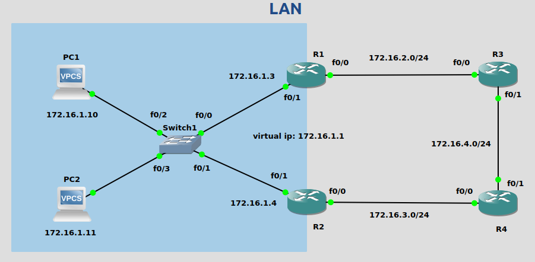

FHRP(First Hop Redundancy Protocol)<br>
给网关路由器提供冗余，使用虚拟IP, 子网内其他设备使用虚拟IP作为默认网关

FHRP类型:<br>
1.HSRP(Hot Standby Redundancy Protocol)<br>
Cisco私有协议, 使用active/standby模式
<br>

2.VRRP(Virtual Router Redundancy Protocol)<br>

3.GLBP(Gateway Load Balancing Protocol)<br>


#### HSRP
##### active路由器选举
1.优先级高的(默认为100)
<br>

2.物理IP地址更大<br>
** 后加入的路由器默不参与抢占, 除非接口配置抢占功能
<br>
<br>

##### HSRP负载均衡
通过在不同VLAN实现不同的HSRP active/standby搭配, 实现负载均衡
<br>
<br>

##### HSRP版本差异
|                  |HSRPv1           |HSRPv2    |
|------------------|-----------------|----------|
|Timers            |不支持ms         |支持ms    |
|Group range       |0-255            |0-4095    |
|Multicast address |224.0.0.2        |224.0.0.102|
|MAC address range |0000.0C07.ACxx, xx为HSRP group number  |0000.0C9F.F000 - 0000.0C9F.FFFF|

<br>
<br>               

##### 配置HSRP步骤
```
1.配置虚拟ip
(config-if)# standby <group_num> ip <ip_addr>

2.配置抢占(可选)
(config-if)# standby <group_num> preempt

3.配置group名称(可选)
(config-if)# standby <group_num> name <group_name>

4.配置优先级(可选, 优先级值范围: 0 - 255)
(config-if)# standby <group_num> priority <priority>

5.配置mac地址(可选)
(config-if)# standby <group_num> mac-address <mac_addr>

6.配置timer(可选, seconds范围: 1 - 254, milliseconds范围: 15 - 999)
(config-if)# standby <group_num> timers {<seconds> | msec <milliseconds>}
```
<br>

查看HSRP简略信息<br>
`# show standby brief`
<br>

查看HSRP信息<br>
`# show standby`
<br>
<br>
                   
如图<br>

<br>

##### 配置HSRP实例(与NAT搭配时, NAT类型为Stateful NAT)
```
路由器R1
interface:
R1(config)# int f0/0
R1(config-if)# ip address 172.16.2.1 255.255.255.0
R1(config-if)# no shutdown
R1(config-if)# int f0/1
R1(config-if)# ip address 172.16.1.3 255.255.255.0
R1(config-if)# no shutdown

ospf:
R1(config)# router ospf 1
R1(config-router)# router-id 1.1.1.1
R1(config)# int f0/0
R1(config-if)# ip ospf 1 area 0

hsrp:
R1(config)# int f0/1
R1(config-if)# standby 2 ip 172.16.1.1
R1(config-if)# standby 2 name hsrp

snat(stateful nat):
R1(config)# int f0/0
R1(config-if)# ip nat outside
R1(config-if)# int f0/1
R1(config-if)# ip nat inside
R1(config)# access-list 1 permit 172.16.1.0 0.0.0.255
R1(config)# ip nat pool snat_pool 172.16.2.1 172.16.2.1 netmask 255.255.255.0 
R1(config)# ip nat stateful id 1
R1(config-ipnat-snat)# redundancy hsrp
R1(config-ipnat-snat-red)# mapping-id 1
R1(config)# ip nat inside source list 1 pool snat_pool mapping-id 1 overload


路由器R2
interface:
R2(config)# int f0/0
R2(config-if)# ip address 172.16.3.1 255.255.255.0
R2(config-if)# no shutdown
R2(config-if)# int f0/1
R2(config-if)# ip address 172.16.1.4 255.255.255.0
R2(config-if)# no shutdown

ospf:
R2(config)# router ospf 1
R2(config-router)# router-id 2.2.2.2
R2(config)# int f0/0
R2(config-if)# ip ospf 1 area 0

hsrp:
R2(config)# int f0/1
R2(config-if)# standby 2 ip 172.16.1.1
R2(config-if)# standby 2 name hsrp

snat(stateful nat):
R2(config)# int f0/0
R2(config-if)# ip nat outside
R2(config)# int f0/1
R2(config-if)# ip nat inside
R2(config)# access-list 1 permit 172.16.1.0 0.0.0.255
R2(config)# ip nat pool snat_pool 172.16.3.1 172.16.3.1 netmask 255.255.255.0 
R2(config)# ip nat stateful id 1
R2(config-ipnat-snat)# redundancy hsrp
R2(config-ipnat-snat-red)# mapping-id 1
R2(config)# ip nat inside source list 1 pool snat_pool mapping-id 1 overload


路由器R3
interface:
R3(config)# int f0/0
R3(config-if)# ip address 172.16.2.2 255.255.255.0
R3(config-if)# no shutdown
R3(config-if)# int f0/1
R3(config-if)# ip address 172.16.4.1 255.255.255.0
R3(config-if)# no shutdown

ospf:
R3(config)# router ospf 1
R3(config-router)# router-id 3.3.3.3
R3(config)# int f0/0
R3(config-if)# ip ospf 1 area 0
R3(config-if)# int f0/1
R3(config-if)# ip ospf 1 area 0


路由器R4
interface:
R4(config)# int f0/0
R4(config-if)# ip address 172.16.3.2 255.255.255.0
R4(config-if)# no shutdown
R4(config-if)# int f0/1
R4(config-if)# ip address 172.16.4.2 255.255.255.0
R4(config-if)# no shutdown

ospf:
R4(config)# router ospf 1
R4(config-router)# router-id 4.4.4.4
R4(config)# int f0/0
R4(config-if)# ip ospf 1 area 0
R4(config-if)# int f0/1
R4(config-if)# ip ospf 1 area 0


交换机
switch(config)# no ip igmp snooping
** GNS3 IOU交换机配置, 不然两个网关路由器无法联通
** 参考: https://community.cisco.com/t5/other-network-architecture-subjects/standby-router-is-unknown-in-hsrp/td-p/3913200


计算机PC1
PC1> ip 172.16.1.10 172.16.1.1


计算机PC2
PC2> ip 172.16.1.11 172.16.1.1
```
