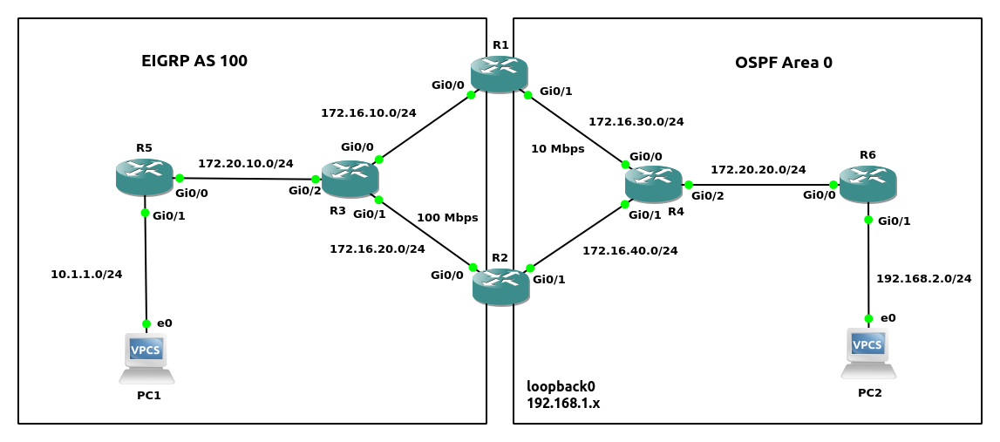

#### Redistribute
将一个路由协议的路由, 注入到另一个路由协议
<br>
<br>

配置方法:<br>
```
1.进入目标路由协议配置模式
(config)# router <destination_protocol> <destination_protocol_num>

2.将源路由协议的内容进入注入
(config-router)# redistribute  {connected | static | eigrp <as_number> | ospf <process_id> [match {internal | external [1 | 2] | nssa-external [1 | 2]}] [vrf <vrf_instance_name>] | bgp <as_number>} [<destination_protocol_options>] [route-map <route_map_name>]


** destination_protocol_options相对于不同路由协议的可选参数:
1)EIGRP
metric <bandwidth> <delay> <reliability> <load> <mtu>
EIGRP的metric属性
当EIGRP作为目标路由协议时, 分为如下情况:
1] 源为connected时, 按connected接口的实际bandwidth/delay/load/reliability/MTU
2] 源为static时, 按next-hop地址所在链路的bandwidth/delay/load/reliability/MTU
3] 源为eigrp时, 保留原来的bandwidth/delay/load/reliability/MTU
4] 源为ospf/bgp时, metric默认为infinite, 所以必须手动配置metric


2)OSPF
subnets
是否支持CIDR(Classless Inter-Domain Routing). 提供该参数代表支持CIDR
默认自动携带的参数
参考示例2如下结果:
R6# show run | section router ospf
router ospf 1
 router-id 6.6.6.6
 redistribute eigrp 100 subnets
 redistribute bgp 65200 subnets
 network 192.168.10.0 0.0.0.255 area 0

metric <metric>
指定metric值
当OSPF作为目标路由协议时, 分为以下情况:
1] 源为connected/static/eigrp时, 为LSA Type 5的metric-type 2, metric默认为20
2] 源为ospf时, 为LSA Type 5的metric-type 2, metric使用源ospf的metric
3] 源为bgp时, 为LSA Type 5的metric-type 2, metric默认为1

metric-type {1 | 2}
支持LSA Type 5的类型为1/2类
1类redistribute会将当前路由协议域内的metric进行叠加
2类redistribute后不会再当前路由协议域内增加metric的数值

tag <num>
用于标记redistribute route, 用于后续引用
num值范围[0, 4294967295]


3)BGP
metric <metric>
指定metric值
当BGP作为目标路由协议时, 默认metric使用源路由协议的metric值
当BGP作为源路由协议时, 默认不会传播从iBGP peer接收的NLRI

** 当OSPF向BGP注入路由时, 默认不会注入LSA Type 5路由, 需要提供match external [1 | 2]参数. 参考示例5
```
<br>
<br>

图1<br>
<br>

示例1 - redistribute(如图1)
```
R1(config)# router eigrp 100
R1(config-router)# network 192.168.1.1 0.0.0.0
R1(config-router)# network 10.10.12.0 0.0.0.255

R2(config)# router eigrp 100
R2(config-router)# network 192.168.1.2 0.0.0.0 
R2(config-router)# network 10.10.0.0 0.0.255.255

R3(config)# router eigrp 100
R3(config-router)# network 192.168.1.3 0.0.0.0
R3(config-router)# network 10.10.23.0 0.0.0.255
R3(config)# router ospf 1
R3(config-router)# network 192.168.1.3 0.0.0.0 area 0
R3(config-router)# network 10.10.34.0 0.0.0.255 area 0

R4(config)# router ospf 1
R4(config-router)# network 192.168.1.4 0.0.0.0 area 0
R4(config-router)# network 10.10.0.0 0.0.255.255 area 0

R5(config)# router ospf 1
R5(config-router)# network 192.168.1.5 0.0.0.0 area 0
R5(config-router)# network 10.10.45.0 0.0.0.255 area 0


R1# show ip route | begin Gateway
Gateway of last resort is not set

      10.0.0.0/8 is variably subnetted, 3 subnets, 2 masks
C        10.10.12.0/24 is directly connected, FastEthernet0/0
L        10.10.12.1/32 is directly connected, FastEthernet0/0
D        10.10.23.0/24 [90/30720] via 10.10.12.2, 00:04:46, FastEthernet0/0
      192.168.1.0/32 is subnetted, 3 subnets
C        192.168.1.1 is directly connected, Loopback0
D        192.168.1.2 [90/156160] via 10.10.12.2, 00:04:54, FastEthernet0/0
D        192.168.1.3 [90/158720] via 10.10.12.2, 00:03:29, FastEthernet0/0


R5# show ip route | begin Gateway
Gateway of last resort is not set

      10.0.0.0/8 is variably subnetted, 3 subnets, 2 masks
O        10.10.34.0/24 [110/2] via 10.10.45.4, 00:01:24, FastEthernet0/0
C        10.10.45.0/24 is directly connected, FastEthernet0/0
L        10.10.45.5/32 is directly connected, FastEthernet0/0
      192.168.1.0/32 is subnetted, 3 subnets
O        192.168.1.3 [110/3] via 10.10.45.4, 00:01:24, FastEthernet0/0
O        192.168.1.4 [110/2] via 10.10.45.4, 00:01:24, FastEthernet0/0
C        192.168.1.5 is directly connected, Loopback0


R3(config)# router eigrp 100
R3(config-router)# redistribute ospf 1 metric 100000 10 255 1 1500
R3(config-router)# router ospf 1
R3(config-router)# redistribute eigrp 100


R1# show ip route | begin Gateway
Gateway of last resort is not set

      10.0.0.0/8 is variably subnetted, 5 subnets, 2 masks
C        10.10.12.0/24 is directly connected, FastEthernet0/0
L        10.10.12.1/32 is directly connected, FastEthernet0/0
D        10.10.23.0/24 [90/30720] via 10.10.12.2, 00:07:04, FastEthernet0/0
D EX     10.10.34.0/24 [170/33280] via 10.10.12.2, 00:00:41, FastEthernet0/0
D EX     10.10.45.0/24 [170/33280] via 10.10.12.2, 00:00:41, FastEthernet0/0
      192.168.1.0/32 is subnetted, 5 subnets
C        192.168.1.1 is directly connected, Loopback0
D        192.168.1.2 [90/156160] via 10.10.12.2, 00:07:12, FastEthernet0/0
D        192.168.1.3 [90/158720] via 10.10.12.2, 00:05:47, FastEthernet0/0
D EX     192.168.1.4 [170/33280] via 10.10.12.2, 00:00:41, FastEthernet0/0
D EX     192.168.1.5 [170/33280] via 10.10.12.2, 00:00:41, FastEthernet0/0


R5# show ip route | begin Gateway
Gateway of last resort is not set

      10.0.0.0/8 is variably subnetted, 5 subnets, 2 masks
O E2     10.10.12.0/24 [110/20] via 10.10.45.4, 00:00:47, FastEthernet0/0
O E2     10.10.23.0/24 [110/20] via 10.10.45.4, 00:00:47, FastEthernet0/0
O        10.10.34.0/24 [110/2] via 10.10.45.4, 00:03:10, FastEthernet0/0
C        10.10.45.0/24 is directly connected, FastEthernet0/0
L        10.10.45.5/32 is directly connected, FastEthernet0/0
      192.168.1.0/32 is subnetted, 5 subnets
O E2     192.168.1.1 [110/20] via 10.10.45.4, 00:00:47, FastEthernet0/0
O E2     192.168.1.2 [110/20] via 10.10.45.4, 00:00:47, FastEthernet0/0
O        192.168.1.3 [110/3] via 10.10.45.4, 00:03:10, FastEthernet0/0
O        192.168.1.4 [110/2] via 10.10.45.4, 00:03:10, FastEthernet0/0
C        192.168.1.5 is directly connected, Loopback0
```
<br>
<br>

图2<br>
<br>

示例2 - redistribute源类型(如图2)
```
步骤1/2/3/4/5都是基于基础配置
配置BGP
R1(config)# router bgp 65000
R1(config-router)# neighbor 192.168.1.3 remote-as 65000
R1(config-router)# neighbor 192.168.1.3 update-source loopback1
R1(config-router)# neighbor 192.168.1.3 next-hop-self
R1(config-router)# neighbor 10.10.30.8 remote-as 65100
R1(config-router)# network 192.168.2.1 mask 255.255.255.255

R3(config)# router bgp 65000
R3(config-router)# neighbor 192.168.2.1 remote-as 65000           
R3(config-router)# neighbor 192.168.2.1 update-source loopback0
R3(config-router)# neighbor 192.168.2.1 next-hop-self
R3(config-router)# neighbor 10.10.60.11 remote-as 65200
R3(config-router)# network 192.168.1.3 mask 255.255.255.255

R8(config)# router bgp 65100
R8(config-router)# neighbor 192.168.1.10 remote-as 65100
R8(config-router)# neighbor 192.168.1.10 update-source loopback0
R8(config-router)# neighbor 192.168.1.10 next-hop-self
R8(config-router)# neighbor 10.10.30.1 remote-as 65000
R8(config-router)# network 192.168.1.8 mask 255.255.255.255

R10(config)# router bgp 65100
R10(config-router)# neighbor 192.168.1.8 remote-as 65100
R10(config-router)# neighbor 192.168.1.8 update-source loopback0
R10(config-router)# network 192.168.1.10 mask 255.255.255.255

R11(config)# router bgp 65200
R11(config-router)# neighbor 10.10.60.3 remote-as 65000
R11(config-router)# network 192.168.1.11 mask 255.255.255.255


配置BGP AS 65000/65100区域的OSPF
R1(config)# router ospf 2
R1(config-router)# router-id 192.168.2.1
R1(config-router)# network 192.168.2.1 0.0.0.0 area 2
R1(config-router)# network 10.10.10.0 0.0.0.255 area 2

R2(config)# router ospf 2
R2(config-router)# network 192.168.1.2 0.0.0.0 area 2
R2(config-router)# network 10.10.0.0 0.0.255.255 area 2

R3(config)# router ospf 2
R3(config-router)# network 192.168.1.3 0.0.0.0 area 2
R3(config-router)# network 10.10.20.0 0.0.0.255 area 2

R8(config)# router ospf 1
R8(config-router)# network 192.168.1.8 0.0.0.0 area 0
R8(config-router)# network 10.10.40.0 0.0.0.255 area 0

R9(config)# router ospf 1
R9(config-router)# network 192.168.1.9 0.0.0.0 area 0
R9(config-router)# network 10.10.0.0 0.0.255.255 area 0

R10(config)# router ospf 1
R10(config-router)# network 192.168.1.10 0.0.0.0 area 0 
R10(config-router)# network 10.10.50.0 0.0.0.255 area 0


配置OSPF
R1(config)# router ospf 1
R1(config-router)# router-id 192.168.1.1
R1(config-router)# network 192.168.1.1 0.0.0.0 area 0
R1(config-router)# network 172.16.10.0 0.0.0.255 area 0

R4(config)# router ospf 1
R4(config-router)# network 192.168.1.4 0.0.0.0 area 0
R4(config-router)# network 172.16.0.0 0.0.255.255 area 0

R5(config)# router ospf 1
R5(config-router)# network 192.168.1.5 0.0.0.0 area 0
R5(config-router)# network 172.16.20.0 0.0.0.255 area 0


配置EIGRP
R1(config)# router eigrp 100
R1(config-router)# network 192.168.1.1 0.0.0.0
R1(config-router)# network 192.168.10.0 0.0.0.255

R6(config)# router eigrp 100
R6(config-router)# network 192.168.1.6 0.0.0.0 
R6(config-router)# network 192.168.0.0 0.0.255.255

R7(config)# router eigrp 100
R7(config-router)# network 192.168.1.7 0.0.0.0 
R7(config-router)# network 192.168.20.0 0.0.0.255


R3# show ip route | begin Gateway
Gateway of last resort is not set

      10.0.0.0/8 is variably subnetted, 5 subnets, 2 masks
O        10.10.10.0/24 [110/2] via 10.10.20.2, 00:13:00, FastEthernet0/0
C        10.10.20.0/24 is directly connected, FastEthernet0/0
L        10.10.20.3/32 is directly connected, FastEthernet0/0
C        10.10.60.0/24 is directly connected, FastEthernet0/1
L        10.10.60.3/32 is directly connected, FastEthernet0/1
      192.168.1.0/32 is subnetted, 5 subnets
O        192.168.1.2 [110/2] via 10.10.20.2, 00:13:00, FastEthernet0/0
C        192.168.1.3 is directly connected, Loopback0
B        192.168.1.8 [200/0] via 192.168.2.1, 00:01:08
B        192.168.1.10 [200/0] via 192.168.2.1, 00:01:08
B        192.168.1.11 [20/0] via 10.10.60.11, 00:12:29
      192.168.2.0/32 is subnetted, 1 subnets
O        192.168.2.1 [110/3] via 10.10.20.2, 00:12:50, FastEthernet0/0


R5# show ip route | begin Gateway
Gateway of last resort is not set

      172.16.0.0/16 is variably subnetted, 3 subnets, 2 masks
O        172.16.10.0/24 [110/2] via 172.16.20.4, 00:01:14, FastEthernet0/0
C        172.16.20.0/24 is directly connected, FastEthernet0/0
L        172.16.20.5/32 is directly connected, FastEthernet0/0
      192.168.1.0/32 is subnetted, 3 subnets
O        192.168.1.1 [110/3] via 172.16.20.4, 00:01:14, FastEthernet0/0
O        192.168.1.4 [110/2] via 172.16.20.4, 00:01:14, FastEthernet0/0
C        192.168.1.5 is directly connected, Loopback0


R7# show ip route | begin Gateway
Gateway of last resort is not set

      192.168.1.0/32 is subnetted, 3 subnets
D        192.168.1.1 [90/158720] via 192.168.20.6, 00:02:47, FastEthernet0/0
D        192.168.1.6 [90/156160] via 192.168.20.6, 00:02:47, FastEthernet0/0
C        192.168.1.7 is directly connected, Loopback0
D     192.168.10.0/24 [90/30720] via 192.168.20.6, 00:02:47, FastEthernet0/0
      192.168.20.0/24 is variably subnetted, 2 subnets, 2 masks
C        192.168.20.0/24 is directly connected, FastEthernet0/0
L        192.168.20.7/32 is directly connected, FastEthernet0/0


1.connected
R1(config)# router bgp 65000
R1(config-router)# redistribute connected
R1(config-router)# router ospf 1
R1(config-router)# redistribute connected
R1(config-router)# router eigrp 100
R1(config-router)# redistribute connected


R3# show ip route | begin Gateway
Gateway of last resort is not set

      10.0.0.0/8 is variably subnetted, 6 subnets, 2 masks
O        10.10.10.0/24 [110/2] via 10.10.20.2, 00:16:27, FastEthernet0/0
C        10.10.20.0/24 is directly connected, FastEthernet0/0
L        10.10.20.3/32 is directly connected, FastEthernet0/0
B        10.10.30.0/24 [200/0] via 192.168.2.1, 00:00:45
C        10.10.60.0/24 is directly connected, FastEthernet0/1
L        10.10.60.3/32 is directly connected, FastEthernet0/1
      172.16.0.0/24 is subnetted, 1 subnets
B        172.16.10.0 [200/0] via 192.168.2.1, 00:00:45
      192.168.1.0/32 is subnetted, 6 subnets
B        192.168.1.1 [200/0] via 192.168.2.1, 00:00:45
O        192.168.1.2 [110/2] via 10.10.20.2, 00:16:27, FastEthernet0/0
C        192.168.1.3 is directly connected, Loopback0
B        192.168.1.8 [200/0] via 192.168.2.1, 00:04:35
B        192.168.1.10 [200/0] via 192.168.2.1, 00:04:35
B        192.168.1.11 [20/0] via 10.10.60.11, 00:15:56
      192.168.2.0/32 is subnetted, 1 subnets
O        192.168.2.1 [110/3] via 10.10.20.2, 00:16:17, FastEthernet0/0
B     192.168.10.0/24 [200/0] via 192.168.2.1, 00:00:45


R5# show ip route | begin Gateway
Gateway of last resort is not set

      10.0.0.0/24 is subnetted, 2 subnets
O E2     10.10.10.0 [110/20] via 172.16.20.4, 00:01:12, FastEthernet0/0
O E2     10.10.30.0 [110/20] via 172.16.20.4, 00:01:12, FastEthernet0/0
      172.16.0.0/16 is variably subnetted, 3 subnets, 2 masks
O        172.16.10.0/24 [110/2] via 172.16.20.4, 00:12:46, FastEthernet0/0
C        172.16.20.0/24 is directly connected, FastEthernet0/0
L        172.16.20.5/32 is directly connected, FastEthernet0/0
      192.168.1.0/32 is subnetted, 3 subnets
O        192.168.1.1 [110/3] via 172.16.20.4, 00:12:36, FastEthernet0/0
O        192.168.1.4 [110/2] via 172.16.20.4, 00:12:46, FastEthernet0/0
C        192.168.1.5 is directly connected, Loopback0
      192.168.2.0/32 is subnetted, 1 subnets
O E2     192.168.2.1 [110/20] via 172.16.20.4, 00:01:12, FastEthernet0/0
O E2  192.168.10.0/24 [110/20] via 172.16.20.4, 00:01:12, FastEthernet0/0


R7# show ip route | begin Gateway
Gateway of last resort is not set

      10.0.0.0/24 is subnetted, 2 subnets
D EX     10.10.10.0 [170/33280] via 192.168.20.6, 00:01:37, FastEthernet0/0
D EX     10.10.30.0 [170/33280] via 192.168.20.6, 00:01:37, FastEthernet0/0
      172.16.0.0/24 is subnetted, 1 subnets
D EX     172.16.10.0 [170/33280] via 192.168.20.6, 00:01:37, FastEthernet0/0
      192.168.1.0/32 is subnetted, 3 subnets
D        192.168.1.1 [90/158720] via 192.168.20.6, 00:13:42, FastEthernet0/0
D        192.168.1.6 [90/156160] via 192.168.20.6, 00:13:42, FastEthernet0/0
C        192.168.1.7 is directly connected, Loopback0
      192.168.2.0/32 is subnetted, 1 subnets
D EX     192.168.2.1 [170/158720] via 192.168.20.6, 00:01:37, FastEthernet0/0
D     192.168.10.0/24 [90/30720] via 192.168.20.6, 00:13:42, FastEthernet0/0
      192.168.20.0/24 is variably subnetted, 2 subnets, 2 masks
C        192.168.20.0/24 is directly connected, FastEthernet0/0
L        192.168.20.7/32 is directly connected, FastEthernet0/0


2.static
R1(config)# ip route 192.168.1.3 255.255.255.255 10.10.10.2
R1(config)# ip route 192.168.1.5 255.255.255.255 172.16.10.4
R1(config)# ip route 192.168.1.7 255.255.255.255 192.168.10.6
R1(config)# router bgp 65000
R1(config-router)# redistribute static
R1(config-router)# router ospf 1
R1(config-router)# redistribute static
R1(config-router)# router eigrp 100
R1(config-router)# redistribute static


R3# show ip route | begin Gateway
Gateway of last resort is not set

      10.0.0.0/8 is variably subnetted, 5 subnets, 2 masks
O        10.10.10.0/24 [110/2] via 10.10.20.2, 00:19:37, FastEthernet0/0
C        10.10.20.0/24 is directly connected, FastEthernet0/0
L        10.10.20.3/32 is directly connected, FastEthernet0/0
C        10.10.60.0/24 is directly connected, FastEthernet0/1
L        10.10.60.3/32 is directly connected, FastEthernet0/1
      192.168.1.0/32 is subnetted, 7 subnets
O        192.168.1.2 [110/2] via 10.10.20.2, 00:19:38, FastEthernet0/0
C        192.168.1.3 is directly connected, Loopback0
B        192.168.1.5 [200/0] via 192.168.2.1, 00:00:30
B        192.168.1.7 [200/0] via 192.168.2.1, 00:00:30
B        192.168.1.8 [200/0] via 192.168.2.1, 00:07:46
B        192.168.1.10 [200/0] via 192.168.2.1, 00:07:46
B        192.168.1.11 [20/0] via 10.10.60.11, 00:19:07
      192.168.2.0/32 is subnetted, 1 subnets
O        192.168.2.1 [110/3] via 10.10.20.2, 00:19:28, FastEthernet0/0


R5# show ip route | begin Gateway
Gateway of last resort is not set

      172.16.0.0/16 is variably subnetted, 3 subnets, 2 masks
O        172.16.10.0/24 [110/2] via 172.16.20.4, 00:16:27, FastEthernet0/0
C        172.16.20.0/24 is directly connected, FastEthernet0/0
L        172.16.20.5/32 is directly connected, FastEthernet0/0
      192.168.1.0/32 is subnetted, 5 subnets
O        192.168.1.1 [110/3] via 172.16.20.4, 00:16:17, FastEthernet0/0
O E2     192.168.1.3 [110/20] via 172.16.20.4, 00:01:27, FastEthernet0/0
O        192.168.1.4 [110/2] via 172.16.20.4, 00:16:27, FastEthernet0/0
C        192.168.1.5 is directly connected, Loopback0
O E2     192.168.1.7 [110/20] via 172.16.20.4, 00:01:27, FastEthernet0/0


R7# show ip route | begin Gateway
Gateway of last resort is not set

      192.168.1.0/32 is subnetted, 5 subnets
D        192.168.1.1 [90/158720] via 192.168.20.6, 00:17:08, FastEthernet0/0
D EX     192.168.1.3 [170/33280] via 192.168.20.6, 00:01:37, FastEthernet0/0
D EX     192.168.1.5 [170/33280] via 192.168.20.6, 00:01:37, FastEthernet0/0
D        192.168.1.6 [90/156160] via 192.168.20.6, 00:17:08, FastEthernet0/0
C        192.168.1.7 is directly connected, Loopback0
D     192.168.10.0/24 [90/30720] via 192.168.20.6, 00:17:08, FastEthernet0/0
      192.168.20.0/24 is variably subnetted, 2 subnets, 2 masks
C        192.168.20.0/24 is directly connected, FastEthernet0/0
L        192.168.20.7/32 is directly connected, FastEthernet0/0


3.EIGRP
R1(config)# router bgp 65000
R1(config-router)# redistribute eigrp 100
R1(config-router)# router ospf 1
R1(config-router)# redistribute eigrp 100


R3# show ip route | begin Gateway
Gateway of last resort is not set

      10.0.0.0/8 is variably subnetted, 5 subnets, 2 masks
O        10.10.10.0/24 [110/2] via 10.10.20.2, 00:24:20, FastEthernet0/0
C        10.10.20.0/24 is directly connected, FastEthernet0/0
L        10.10.20.3/32 is directly connected, FastEthernet0/0
C        10.10.60.0/24 is directly connected, FastEthernet0/1
L        10.10.60.3/32 is directly connected, FastEthernet0/1
      192.168.1.0/32 is subnetted, 8 subnets
B        192.168.1.1 [200/0] via 192.168.2.1, 00:00:37
O        192.168.1.2 [110/2] via 10.10.20.2, 00:24:20, FastEthernet0/0
C        192.168.1.3 is directly connected, Loopback0
B        192.168.1.6 [200/156160] via 192.168.2.1, 00:00:37
B        192.168.1.7 [200/158720] via 192.168.2.1, 00:00:37
B        192.168.1.8 [200/0] via 192.168.2.1, 00:12:28
B        192.168.1.10 [200/0] via 192.168.2.1, 00:12:28
B        192.168.1.11 [20/0] via 10.10.60.11, 00:23:49
      192.168.2.0/32 is subnetted, 1 subnets
O        192.168.2.1 [110/3] via 10.10.20.2, 00:24:10, FastEthernet0/0
B     192.168.10.0/24 [200/0] via 192.168.2.1, 00:00:37
B     192.168.20.0/24 [200/30720] via 192.168.2.1, 00:00:37


R5# show ip route | begin Gateway
Gateway of last resort is not set

      172.16.0.0/16 is variably subnetted, 3 subnets, 2 masks
O        172.16.10.0/24 [110/2] via 172.16.20.4, 00:20:16, FastEthernet0/0
C        172.16.20.0/24 is directly connected, FastEthernet0/0
L        172.16.20.5/32 is directly connected, FastEthernet0/0
      192.168.1.0/32 is subnetted, 5 subnets
O        192.168.1.1 [110/3] via 172.16.20.4, 00:20:06, FastEthernet0/0
O        192.168.1.4 [110/2] via 172.16.20.4, 00:20:16, FastEthernet0/0
C        192.168.1.5 is directly connected, Loopback0
O E2     192.168.1.6 [110/20] via 172.16.20.4, 00:00:41, FastEthernet0/0
O E2     192.168.1.7 [110/20] via 172.16.20.4, 00:00:41, FastEthernet0/0
O E2  192.168.10.0/24 [110/20] via 172.16.20.4, 00:00:41, FastEthernet0/0
O E2  192.168.20.0/24 [110/20] via 172.16.20.4, 00:00:41, FastEthernet0/0


4.OSPF
R1(config)# router bgp 65000
R1(config-router)# redistribute ospf 1
R1(config-router)# router eigrp 100
R1(config-router)# redistribute ospf 1 metric 100000 10 255 1 1500


R3# show ip route | begin Gateway
Gateway of last resort is not set

      10.0.0.0/8 is variably subnetted, 5 subnets, 2 masks
O        10.10.10.0/24 [110/2] via 10.10.20.2, 00:26:02, FastEthernet0/0
C        10.10.20.0/24 is directly connected, FastEthernet0/0
L        10.10.20.3/32 is directly connected, FastEthernet0/0
C        10.10.60.0/24 is directly connected, FastEthernet0/1
L        10.10.60.3/32 is directly connected, FastEthernet0/1
      172.16.0.0/24 is subnetted, 2 subnets
B        172.16.10.0 [200/0] via 192.168.2.1, 00:00:43
B        172.16.20.0 [200/2] via 192.168.2.1, 00:00:43
      192.168.1.0/32 is subnetted, 8 subnets
B        192.168.1.1 [200/0] via 192.168.2.1, 00:00:43
O        192.168.1.2 [110/2] via 10.10.20.2, 00:26:02, FastEthernet0/0
C        192.168.1.3 is directly connected, Loopback0
B        192.168.1.4 [200/2] via 192.168.2.1, 00:00:43
B        192.168.1.5 [200/3] via 192.168.2.1, 00:00:43
B        192.168.1.8 [200/0] via 192.168.2.1, 00:14:10
B        192.168.1.10 [200/0] via 192.168.2.1, 00:14:10
B        192.168.1.11 [20/0] via 10.10.60.11, 00:25:31
      192.168.2.0/32 is subnetted, 1 subnets
O        192.168.2.1 [110/3] via 10.10.20.2, 00:25:52, FastEthernet0/0


R3# show ip route | begin Gateway
Gateway of last resort is not set

      10.0.0.0/8 is variably subnetted, 5 subnets, 2 masks
O        10.10.10.0/24 [110/2] via 10.10.20.2, 00:26:02, FastEthernet0/0
C        10.10.20.0/24 is directly connected, FastEthernet0/0
L        10.10.20.3/32 is directly connected, FastEthernet0/0
C        10.10.60.0/24 is directly connected, FastEthernet0/1
L        10.10.60.3/32 is directly connected, FastEthernet0/1
      172.16.0.0/24 is subnetted, 2 subnets
B        172.16.10.0 [200/0] via 192.168.2.1, 00:00:43
B        172.16.20.0 [200/2] via 192.168.2.1, 00:00:43
      192.168.1.0/32 is subnetted, 8 subnets
B        192.168.1.1 [200/0] via 192.168.2.1, 00:00:43
O        192.168.1.2 [110/2] via 10.10.20.2, 00:26:02, FastEthernet0/0
C        192.168.1.3 is directly connected, Loopback0
B        192.168.1.4 [200/2] via 192.168.2.1, 00:00:43
B        192.168.1.5 [200/3] via 192.168.2.1, 00:00:43
B        192.168.1.8 [200/0] via 192.168.2.1, 00:14:10
B        192.168.1.10 [200/0] via 192.168.2.1, 00:14:10
B        192.168.1.11 [20/0] via 10.10.60.11, 00:25:31
      192.168.2.0/32 is subnetted, 1 subnets
O        192.168.2.1 [110/3] via 10.10.20.2, 00:25:52, FastEthernet0/0


5.BGP
R3(config)# int loopback1      
R3(config-if)# ip add 192.168.2.3 255.255.255.255
R3(config-if)# router bgp 65000
R3(config-router)# network 192.168.2.3 mask 255.255.255.255

R1(config)# router ospf 1
R1(config-router)# redistribute bgp 65000
R1(config-router)# router eigrp 100
R1(config-router)# redistribute bgp 65000 metric 100000 10 255 1 1500


R5# show ip route | begin Gateway
Gateway of last resort is not set

      172.16.0.0/16 is variably subnetted, 3 subnets, 2 masks
O        172.16.10.0/24 [110/2] via 172.16.20.4, 00:25:48, FastEthernet0/0
C        172.16.20.0/24 is directly connected, FastEthernet0/0
L        172.16.20.5/32 is directly connected, FastEthernet0/0
      192.168.1.0/32 is subnetted, 5 subnets
O        192.168.1.1 [110/3] via 172.16.20.4, 00:25:38, FastEthernet0/0
O        192.168.1.4 [110/2] via 172.16.20.4, 00:25:48, FastEthernet0/0
C        192.168.1.5 is directly connected, Loopback0
O E2     192.168.1.8 [110/1] via 172.16.20.4, 00:00:40, FastEthernet0/0
O E2     192.168.1.10 [110/1] via 172.16.20.4, 00:00:40, FastEthernet0/0
      192.168.2.0/32 is subnetted, 1 subnets
O E2     192.168.2.1 [110/1] via 172.16.20.4, 00:00:40, FastEthernet0/0


R7# show ip route | begin Gateway
Gateway of last resort is not set

      192.168.1.0/32 is subnetted, 5 subnets
D        192.168.1.1 [90/158720] via 192.168.20.6, 00:26:34, FastEthernet0/0
D        192.168.1.6 [90/156160] via 192.168.20.6, 00:26:34, FastEthernet0/0
C        192.168.1.7 is directly connected, Loopback0
D EX     192.168.1.8 [170/33280] via 192.168.20.6, 00:00:41, FastEthernet0/0
D EX     192.168.1.10 [170/33280] via 192.168.20.6, 00:00:41, FastEthernet0/0
      192.168.2.0/32 is subnetted, 1 subnets
D EX     192.168.2.1 [170/33280] via 192.168.20.6, 00:00:41, FastEthernet0/0
D     192.168.10.0/24 [90/30720] via 192.168.20.6, 00:26:34, FastEthernet0/0
      192.168.20.0/24 is variably subnetted, 2 subnets, 2 masks
C        192.168.20.0/24 is directly connected, FastEthernet0/0
L        192.168.20.7/32 is directly connected, FastEthernet0/0


由R5/R7结果显示, 192.168.2.3/32与192.168.1.11/32没有在路由表中, 是因为BGP作为redistribute源路由协议时, 默认不传播从iBGP peer接收的NLRI
如果需要redistribute从iBGP peer接收的NLRI, 使用如下指令:
(config)# router bgp <as_number>
(config-router)# bgp redistribute-internal


R1(config)# router bgp 65000
R1(config-router)# bgp redistribute-internal


R5# show ip route | begin Gateway
Gateway of last resort is not set

      172.16.0.0/16 is variably subnetted, 3 subnets, 2 masks
O        172.16.10.0/24 [110/2] via 172.16.20.4, 00:29:22, FastEthernet0/0
C        172.16.20.0/24 is directly connected, FastEthernet0/0
L        172.16.20.5/32 is directly connected, FastEthernet0/0
      192.168.1.0/32 is subnetted, 6 subnets
O        192.168.1.1 [110/3] via 172.16.20.4, 00:29:12, FastEthernet0/0
O        192.168.1.4 [110/2] via 172.16.20.4, 00:29:22, FastEthernet0/0
C        192.168.1.5 is directly connected, Loopback0
O E2     192.168.1.8 [110/1] via 172.16.20.4, 00:04:14, FastEthernet0/0
O E2     192.168.1.10 [110/1] via 172.16.20.4, 00:04:14, FastEthernet0/0
O E2     192.168.1.11 [110/1] via 172.16.20.4, 00:00:10, FastEthernet0/0
      192.168.2.0/32 is subnetted, 2 subnets
O E2     192.168.2.1 [110/1] via 172.16.20.4, 00:04:14, FastEthernet0/0
O E2     192.168.2.3 [110/1] via 172.16.20.4, 00:00:10, FastEthernet0/0


R7# show ip route | begin Gateway
Gateway of last resort is not set

      192.168.1.0/32 is subnetted, 6 subnets
D        192.168.1.1 [90/158720] via 192.168.20.6, 00:30:11, FastEthernet0/0
D        192.168.1.6 [90/156160] via 192.168.20.6, 00:30:11, FastEthernet0/0
C        192.168.1.7 is directly connected, Loopback0
D EX     192.168.1.8 [170/33280] via 192.168.20.6, 00:04:18, FastEthernet0/0
D EX     192.168.1.10 [170/33280] via 192.168.20.6, 00:04:18, FastEthernet0/0
D EX     192.168.1.11 [170/33280] via 192.168.20.6, 00:00:30, FastEthernet0/0
      192.168.2.0/32 is subnetted, 2 subnets
D EX     192.168.2.1 [170/33280] via 192.168.20.6, 00:04:18, FastEthernet0/0
D EX     192.168.2.3 [170/33280] via 192.168.20.6, 00:00:30, FastEthernet0/0
D     192.168.10.0/24 [90/30720] via 192.168.20.6, 00:30:11, FastEthernet0/0
      192.168.20.0/24 is variably subnetted, 2 subnets, 2 masks
C        192.168.20.0/24 is directly connected, FastEthernet0/0
L        192.168.20.7/32 is directly connected, FastEthernet0/0
```
<br>
<br>

图3<br>
<br>

##### redistribute的特性
1.同一个路由器上, route protocol A/B/C, A redistribute to B, B redistribute to C, 则A的route不会经由B传递到C <br>
示例3(如图3)
```
配置BGP
R1(config)# router bgp 65100
R1(config-router)# bgp router-id 1.1.1.1
R1(config-router)# neighbor 10.10.10.2 remote-as 65100
R1(config-router)# neighbor 10.10.20.3 remote-as 65100
R1(config-router)# redistribute connected

R2(config)# router bgp 65100
R2(config-router)# bgp router-id 2.2.2.2
R2(config-router)# neighbor 10.10.10.1 remote-as 65100
R2(config-router)# neighbor 10.10.30.3 remote-as 65100
R2(config-router)# redistribute connected

R3(config)# router bgp 65100
R3(config-router)# bgp router-id 3.3.3.3
R3(config-router)# neighbor 10.10.20.1 remote-as 65100
R3(config-router)# neighbor 10.10.30.2 remote-as 65100
R3(config-router)# network 10.10.20.0 mask 255.255.255.0
R3(config-router)# network 10.10.30.0 mask 255.255.255.0


配置OSPF
R3(config)# router ospf 1
R3(config-router)# router-id 3.3.3.3
R3(config-router)# network 172.16.10.0 0.0.0.255 area 0

R4(config)# router ospf 1
R4(config-router)# router-id 4.4.4.4 
R4(config-router)# network 172.16.0.0 0.0.255.255 area 0

R5(config)# router ospf 1
R5(config-router)# router-id 5.5.5.5
R5(config-router)# network 172.16.20.0 0.0.0.255 area 0


配置EIGRP
R3(config)# router eigrp 100
R3(config-router)# router-id 3.3.3.3
R3(config-router)# network 192.168.10.0 0.0.0.255

R6(config)# router eigrp 100
R6(config-router)# router-id 6.6.6.6
R6(config-router)# network 192.168.0.0 0.0.255.255

R7(config)# router eigrp 100
R7(config-router)# router-id 7.7.7.7
R7(config-router)# network 192.168.20.0 0.0.0.255


R1# show ip route | begin Gateway
Gateway of last resort is not set

      10.0.0.0/8 is variably subnetted, 5 subnets, 2 masks
C        10.10.10.0/24 is directly connected, FastEthernet0/0
L        10.10.10.1/32 is directly connected, FastEthernet0/0
C        10.10.20.0/24 is directly connected, FastEthernet0/1
L        10.10.20.1/32 is directly connected, FastEthernet0/1
B        10.10.30.0/24 [200/0] via 10.10.20.3, 00:00:13


R5# show ip route | begin Gateway
Gateway of last resort is not set

      172.16.0.0/16 is variably subnetted, 3 subnets, 2 masks
O        172.16.10.0/24 [110/2] via 172.16.20.4, 00:13:30, FastEthernet0/0
C        172.16.20.0/24 is directly connected, FastEthernet0/0
L        172.16.20.5/32 is directly connected, FastEthernet0/0


R7# show ip route | begin Gateway
Gateway of last resort is not set

D     192.168.10.0/24 [90/30720] via 192.168.20.6, 00:14:26, FastEthernet0/0
      192.168.20.0/24 is variably subnetted, 2 subnets, 2 masks
C        192.168.20.0/24 is directly connected, FastEthernet0/0
L        192.168.20.7/32 is directly connected, FastEthernet0/0


情形1 - EIGRP redistribute to OSPF, OSPF redistribute to BGP
R3(config)# router ospf 1
R3(config-router)# redistribute eigrp 100
R3(config-router)# router bgp 65100
R3(config-router)# redistribute ospf 1


R7# show ip route | begin Gateway
Gateway of last resort is not set

D     192.168.10.0/24 [90/30720] via 192.168.20.6, 00:17:05, FastEthernet0/0
      192.168.20.0/24 is variably subnetted, 2 subnets, 2 masks
C        192.168.20.0/24 is directly connected, FastEthernet0/0
L        192.168.20.7/32 is directly connected, FastEthernet0/0


R5# show ip route | begin Gateway
Gateway of last resort is not set

      172.16.0.0/16 is variably subnetted, 3 subnets, 2 masks
O        172.16.10.0/24 [110/2] via 172.16.20.4, 00:16:43, FastEthernet0/0
C        172.16.20.0/24 is directly connected, FastEthernet0/0
L        172.16.20.5/32 is directly connected, FastEthernet0/0
O E2  192.168.10.0/24 [110/20] via 172.16.20.4, 00:01:11, FastEthernet0/0
O E2  192.168.20.0/24 [110/20] via 172.16.20.4, 00:01:11, FastEthernet0/0


R1# show ip route | begin Gateway
Gateway of last resort is not set

      10.0.0.0/8 is variably subnetted, 5 subnets, 2 masks
C        10.10.10.0/24 is directly connected, FastEthernet0/0
L        10.10.10.1/32 is directly connected, FastEthernet0/0
C        10.10.20.0/24 is directly connected, FastEthernet0/1
L        10.10.20.1/32 is directly connected, FastEthernet0/1
B        10.10.30.0/24 [200/0] via 10.10.20.3, 00:04:23
      172.16.0.0/24 is subnetted, 2 subnets
B        172.16.10.0 [200/0] via 10.10.20.3, 00:01:23
B        172.16.20.0 [200/2] via 172.16.10.4, 00:01:18


结论:
根据观察, BGP并没有获得EIGRP区域的路由, 所以OSPF没有将路由进行传递


情形2 - 为实现各个区域的相互扩散, 对路由区域进行互相redistribute
R3(config)# router bgp 65100
R3(config-router)# redistribute ospf 1
R3(config-router)# redistribute eigrp 100
R3(config-router)# bgp redistribute-internal
R3(config-router)# router ospf 1
R3(config-router)# redistribute eigrp 100
R3(config-router)# redistribute bgp 65100
R3(config-router)# router eigrp 100
R3(config-router)# redistribute ospf 1 metric 100000 10 255 1 1500
R3(config-router)# redistribute bgp 65100 metric 100000 10 255 1 1500


R1# show ip route | begin Gateway
Gateway of last resort is not set

      10.0.0.0/8 is variably subnetted, 5 subnets, 2 masks
C        10.10.10.0/24 is directly connected, FastEthernet0/0
L        10.10.10.1/32 is directly connected, FastEthernet0/0
C        10.10.20.0/24 is directly connected, FastEthernet0/1
L        10.10.20.1/32 is directly connected, FastEthernet0/1
B        10.10.30.0/24 [200/0] via 10.10.20.3, 00:07:46
      172.16.0.0/24 is subnetted, 2 subnets
B        172.16.10.0 [200/0] via 10.10.20.3, 00:04:46
B        172.16.20.0 [200/2] via 172.16.10.4, 00:04:41
B     192.168.10.0/24 [200/0] via 10.10.20.3, 00:00:13
B     192.168.20.0/24 [200/30720] via 192.168.10.6, 00:00:08


R5# show ip route | begin Gateway
Gateway of last resort is not set

      10.0.0.0/24 is subnetted, 3 subnets
O E2     10.10.10.0 [110/1] via 172.16.20.4, 00:00:15, FastEthernet0/0
O E2     10.10.20.0 [110/1] via 172.16.20.4, 00:02:48, FastEthernet0/0
O E2     10.10.30.0 [110/1] via 172.16.20.4, 00:02:48, FastEthernet0/0
      172.16.0.0/16 is variably subnetted, 3 subnets, 2 masks
O        172.16.10.0/24 [110/2] via 172.16.20.4, 00:22:18, FastEthernet0/0
C        172.16.20.0/24 is directly connected, FastEthernet0/0
L        172.16.20.5/32 is directly connected, FastEthernet0/0
O E2  192.168.10.0/24 [110/20] via 172.16.20.4, 00:06:46, FastEthernet0/0
O E2  192.168.20.0/24 [110/20] via 172.16.20.4, 00:06:46, FastEthernet0/0


R7# show ip route | begin Gateway
Gateway of last resort is not set

      10.0.0.0/24 is subnetted, 3 subnets
D EX     10.10.10.0 [170/33280] via 192.168.20.6, 00:00:52, FastEthernet0/0
D EX     10.10.20.0 [170/33280] via 192.168.20.6, 00:02:58, FastEthernet0/0
D EX     10.10.30.0 [170/33280] via 192.168.20.6, 00:02:58, FastEthernet0/0
      172.16.0.0/24 is subnetted, 2 subnets
D EX     172.16.10.0 [170/33280] via 192.168.20.6, 00:03:11, FastEthernet0/0
D EX     172.16.20.0 [170/33280] via 192.168.20.6, 00:03:11, FastEthernet0/0
D     192.168.10.0/24 [90/30720] via 192.168.20.6, 00:23:35, FastEthernet0/0
      192.168.20.0/24 is variably subnetted, 2 subnets, 2 masks
C        192.168.20.0/24 is directly connected, FastEthernet0/0
L        192.168.20.7/32 is directly connected, FastEthernet0/0
```
<br>
<br>

图4<br>
<br>

2.序列化redistribute<br>
示例4(如图4)
```
配置EIGRP AS 100
R1(config)# router eigrp 100
R1(config-router)# router-id 1.1.1.1
R1(config-router)# network 192.168.1.1 0.0.0.0
R1(config-router)# network 10.12.1.0 0.0.0.255

R2(config)# router eigrp 100
R2(config-router)# router-id 2.2.2.2
R2(config-router)# network 10.12.1.0 0.0.0.255


配置EIGRP AS 200
R2(config)# router eigrp 200
R2(config-router)# router-id 2.2.2.2
R2(config-router)# network 10.23.1.0 0.0.0.255

R3(config-if)# router eigrp 200
R3(config-router)# router-id 3.3.3.3
R3(config-router)# network 10.23.1.0 0.0.0.255
R3(config-router)# network 10.34.1.0 0.0.0.255

R4(config)# router eigrp 200
R4(config-router)# router-id 4.4.4.4
R4(config-router)# network 10.34.1.0 0.0.0.255


配置OSPF
R4(config)# router ospf 1
R4(config-router)# router-id 4.4.4.4
R4(config-router)# network 10.45.1.0 0.0.0.255 area 0

R5(config)# router ospf 1
R5(config-router)# router-id 5.5.5.5
R5(config-router)# network 192.168.5.5 0.0.0.0 area 0
R5(config-router)# network 10.45.1.0 0.0.0.255 area 0


配置BGP
R2(config)# router bgp 65100
R2(config-router)# bgp router-id 2.2.2.2
R2(config-router)# neighbor 10.34.1.4 remote-as 65100
R2(config-router)# redistribute eigrp 200

R4(config)# router bgp 65100
R4(config-router)# bgp router-id 4.4.4.4
R4(config-router)# neighbor 10.23.1.2 remote-as 65100
R4(config-router)# redistribute eigrp 200


redistribute操作
R2(config)# router bgp 65100
R2(config-router)# bgp redistribute-internal 
R2(config-router)# redistribute eigrp 100
R2(config-router)# router eigrp 100
R2(config-router)# redistribute bgp 65100 metric 100000 10 255 1 1500

R4(config)# router bgp 65100
R4(config-router)# bgp redistribute-internal
R4(config-router)# redistribute ospf 1
R4(config-router)# router ospf 1
R4(config-router)# redistribute bgp 65100


R1# show ip route | begin Gateway
Gateway of last resort is not set

      10.0.0.0/8 is variably subnetted, 3 subnets, 2 masks
C        10.12.1.0/24 is directly connected, FastEthernet0/0
L        10.12.1.1/32 is directly connected, FastEthernet0/0
D EX     10.45.1.0/24 [170/30720] via 10.12.1.2, 00:02:53, FastEthernet0/0
      192.168.1.0/32 is subnetted, 1 subnets
C        192.168.1.1 is directly connected, Loopback0
      192.168.5.0/32 is subnetted, 1 subnets
D EX     192.168.5.5 [170/30720] via 10.12.1.2, 00:02:49, FastEthernet0/0


R5# show ip route | begin Gateway
Gateway of last resort is not set

      10.0.0.0/8 is variably subnetted, 3 subnets, 2 masks
O E2     10.12.1.0/24 [110/1] via 10.45.1.4, 00:03:29, FastEthernet0/0
C        10.45.1.0/24 is directly connected, FastEthernet0/0
L        10.45.1.5/32 is directly connected, FastEthernet0/0
      192.168.1.0/32 is subnetted, 1 subnets
O E2     192.168.1.1 [110/1] via 10.45.1.4, 00:03:29, FastEthernet0/0
      192.168.5.0/32 is subnetted, 1 subnets
C        192.168.5.5 is directly connected, Loopback0
```
<br>
<br>

3.redistribute前提:<br>
1)源路由协议的route必须在路由表(RIB)中<br>

2)目标路由协议需要一个reachable metric
<br>
<br>
<br>

图5<br>
<br>

示例5(如图5)
```
配置EIGRP
R1(config)# router eigrp 100
R1(config-router)# router-id 1.1.1.1
R1(config-router)# network 172.16.0.0 0.0.255.255

R2(config)# router eigrp 100
R2(config-router)# router-id 2.2.2.2
R2(config-router)# network 172.16.0.0 0.0.255.255

R3(config)# router eigrp 100
R3(config-router)# router-id 3.3.3.3
R3(config-router)# network 172.16.0.0 0.0.255.255


配置OSPF
R3(config)# router ospf 1
R3(config-router)# router-id 3.3.3.3
R3(config-router)# network 10.10.0.0 0.0.255.255 area 0

R4(config)# router ospf 1
R4(config-router)# router-id 4.4.4.4
R4(config-router)# network 10.10.0.0 0.0.255.255 area 0

R5(config)# router ospf 1
R5(config-router)# router-id 5.5.5.5
R5(config-router)# network 10.10.0.0 0.0.255.255 area 0

R6(config)# router ospf 1
R6(config-router)# router-id 6.6.6.6
R6(config-router)# network 10.10.0.0 0.0.255.255 area 0


配置BGP
R6(config)# router bgp 65100
R6(config-router)# bgp router-id 6.6.6.6
R6(config-router)# neighbor 192.168.10.7 remote-as 65100
R6(config-router)# neighbor 192.168.20.8 remote-as 65100
R6(config-router)# network 192.168.10.0 mask 255.255.255.0
R6(config-router)# network 192.168.20.0 mask 255.255.255.0

R7(config)# router bgp 65100
R7(config-router)# bgp router-id 7.7.7.7
R7(config-router)# neighbor 192.168.10.6 remote-as 65100 
R7(config-router)# neighbor 192.168.30.8 remote-as 65100
R7(config-router)# redistribute connected

R8(config)# router bgp 65100
R8(config-router)# bgp router-id 8.8.8.8
R8(config-router)# neighbor 192.168.20.6 remote-as 65100
R8(config-router)# neighbor 192.168.30.7 remote-as 65100
R8(config-router)# redistribute connected


配置R3中EIGRP/OSPF互相redistribute, R6中OSPF/BGP互相redistribute
R3(config)# router eigrp 100
R3(config-router)# redistribute ospf 1 metric 100000 10 255 1 1500
R3(config-router)# router ospf 1
R3(config-router)# redistribute eigrp 100

R6(config)# router bgp 65100
R6(config-router)# bgp redistribute-internal
R6(config-router)# redistribute ospf 1
R6(config-router)# router ospf 1
R6(config-router)# redistribute bgp 65100


R1# show ip route | begin Gateway
Gateway of last resort is not set

      10.0.0.0/24 is subnetted, 4 subnets
D EX     10.10.10.0 [170/30720] via 172.16.20.3, 00:04:06, FastEthernet0/1
D EX     10.10.20.0 [170/30720] via 172.16.20.3, 00:04:06, FastEthernet0/1
D EX     10.10.30.0 [170/30720] via 172.16.20.3, 00:04:06, FastEthernet0/1
D EX     10.10.40.0 [170/30720] via 172.16.20.3, 00:04:06, FastEthernet0/1
      172.16.0.0/16 is variably subnetted, 5 subnets, 2 masks
C        172.16.10.0/24 is directly connected, FastEthernet0/0
L        172.16.10.1/32 is directly connected, FastEthernet0/0
C        172.16.20.0/24 is directly connected, FastEthernet0/1
L        172.16.20.1/32 is directly connected, FastEthernet0/1
D        172.16.30.0/24 [90/30720] via 172.16.20.3, 00:13:45, FastEthernet0/1
                        [90/30720] via 172.16.10.2, 00:13:45, FastEthernet0/0
D EX  192.168.10.0/24 [170/30720] via 172.16.20.3, 00:03:21, FastEthernet0/1
D EX  192.168.20.0/24 [170/30720] via 172.16.20.3, 00:03:21, FastEthernet0/1
D EX  192.168.30.0/24 [170/30720] via 172.16.20.3, 00:03:21, FastEthernet0/1


R4# show ip route | begin Gateway
Gateway of last resort is not set

      10.0.0.0/8 is variably subnetted, 6 subnets, 2 masks
C        10.10.10.0/24 is directly connected, FastEthernet0/0
L        10.10.10.4/32 is directly connected, FastEthernet0/0
O        10.10.20.0/24 [110/2] via 10.10.10.3, 00:07:51, FastEthernet0/0
C        10.10.30.0/24 is directly connected, FastEthernet0/1
L        10.10.30.4/32 is directly connected, FastEthernet0/1
O        10.10.40.0/24 [110/2] via 10.10.30.6, 00:07:56, FastEthernet0/1
      172.16.0.0/24 is subnetted, 3 subnets
O E2     172.16.10.0 [110/20] via 10.10.10.3, 00:01:10, FastEthernet0/0
O E2     172.16.20.0 [110/20] via 10.10.10.3, 00:01:10, FastEthernet0/0
O E2     172.16.30.0 [110/20] via 10.10.10.3, 00:01:10, FastEthernet0/0
O E2  192.168.10.0/24 [110/1] via 10.10.30.6, 00:00:40, FastEthernet0/1
O E2  192.168.20.0/24 [110/1] via 10.10.30.6, 00:00:40, FastEthernet0/1
O E2  192.168.30.0/24 [110/1] via 10.10.30.6, 00:00:40, FastEthernet0/1


R8# show ip route | begin Gateway
Gateway of last resort is not set

      10.0.0.0/24 is subnetted, 4 subnets
B        10.10.10.0 [200/2] via 10.10.30.4, 00:01:04
B        10.10.20.0 [200/2] via 10.10.40.5, 00:01:04
B        10.10.30.0 [200/0] via 192.168.20.6, 00:01:09
B        10.10.40.0 [200/0] via 192.168.20.6, 00:01:09
B     192.168.10.0/24 [200/0] via 192.168.20.6, 00:04:42
      192.168.20.0/24 is variably subnetted, 2 subnets, 2 masks
C        192.168.20.0/24 is directly connected, FastEthernet0/0
L        192.168.20.8/32 is directly connected, FastEthernet0/0
      192.168.30.0/24 is variably subnetted, 2 subnets, 2 masks
C        192.168.30.0/24 is directly connected, FastEthernet0/1
L        192.168.30.8/32 is directly connected, FastEthernet0/1

结果分析:
由路由器R8的显示得知, EIGRP区域的路由内容没有被OSPF redistribute到BGP中
由于OSPF向BGP注入路由时, 默认不注入LSA Type 5类型路由


重新配置OSPF向BGP注入路由, 并配置match参数
R6(config)# router bgp 65100
R6(config-router)# redistribute ospf 1 match internal external 2


R8# show ip route | begin Gateway
Gateway of last resort is not set

      10.0.0.0/24 is subnetted, 4 subnets
B        10.10.10.0 [200/2] via 10.10.30.4, 00:05:38
B        10.10.20.0 [200/2] via 10.10.40.5, 00:05:38
B        10.10.30.0 [200/0] via 192.168.20.6, 00:05:43
B        10.10.40.0 [200/0] via 192.168.20.6, 00:05:43
      172.16.0.0/24 is subnetted, 3 subnets
B        172.16.10.0 [200/20] via 10.10.30.4, 00:00:28
B        172.16.20.0 [200/20] via 10.10.30.4, 00:00:28
B        172.16.30.0 [200/20] via 10.10.30.4, 00:00:28
B     192.168.10.0/24 [200/0] via 192.168.20.6, 00:09:16
      192.168.20.0/24 is variably subnetted, 2 subnets, 2 masks
C        192.168.20.0/24 is directly connected, FastEthernet0/0
L        192.168.20.8/32 is directly connected, FastEthernet0/0
      192.168.30.0/24 is variably subnetted, 2 subnets, 2 masks
C        192.168.30.0/24 is directly connected, FastEthernet0/1
L        192.168.30.8/32 is directly connected, FastEthernet0/1
```
<br>
<br>

##### 修改metric值
```
1) default-metric command
EIGRP:
(config)# router eigrp <as_number>
(config-router)# default-metric <bandwidth> <delay> <realiability> <load> <mtu>

OSPF:
(config)# router ospf <process_id>
(config-router)# default-metric <metric>

BGP:
(config)# router bgp <as_number>
(config-router)# default-metric <metric>


2)metric parameter with redistribute command
EIGRP:
(config)# router eigrp <as_number>
(config-router)# redistribute <src_route_protocol> metric <bandwidth> <delay> <realiability> <load> <mtu>

OSPF:
(config)# router ospf <process_id>
(config-router)# redistribute <src_route_protocol> metric <metric>

BGP:
(config)# router bgp <as_number>
(config-router)# redistribute <src_route_protocol> metric <metric>


3)route-map parameter with redistribute command
EIGRP:
(config)# router eigrp <as_number>
(config-router)# redistribute <src_route_protocol> route-map <route_map_name>

OSPF:
(config)# router ospf <process_id>
(config-router)# redistribute <src_route_protocol> route-map <route_map_name>

BGP:
(config)# router bgp <as_number>
(config-router)# redistribute <src_route_protocol> route-map <route_map_name>


** 当路由符合1/2/3时, 优先级顺序:
3 > 2 > 1
```
<br>

示例6(如图5)
```
以下1/2/3内容都基于示例5的基本配置
1)default-metric
R3(config)# router eigrp 100
R3(config-router)# default-metric 100000 10 255 1 1500
R3(config-router)# redistribute ospf 1


R1# show ip route | begin Gateway
Gateway of last resort is not set

      10.0.0.0/24 is subnetted, 4 subnets
D EX     10.10.10.0 [170/30720] via 172.16.20.3, 00:00:34, FastEthernet0/1
D EX     10.10.20.0 [170/30720] via 172.16.20.3, 00:00:34, FastEthernet0/1
D EX     10.10.30.0 [170/30720] via 172.16.20.3, 00:00:34, FastEthernet0/1
D EX     10.10.40.0 [170/30720] via 172.16.20.3, 00:00:34, FastEthernet0/1
      172.16.0.0/16 is variably subnetted, 5 subnets, 2 masks
C        172.16.10.0/24 is directly connected, FastEthernet0/0
L        172.16.10.1/32 is directly connected, FastEthernet0/0
C        172.16.20.0/24 is directly connected, FastEthernet0/1
L        172.16.20.1/32 is directly connected, FastEthernet0/1
D        172.16.30.0/24 [90/30720] via 172.16.20.3, 00:23:26, FastEthernet0/1
                        [90/30720] via 172.16.10.2, 00:23:26, FastEthernet0/0


2)redistribute的metric参数(参考示例2的OSPF部分)

3)route-map
R3(config)# route-map METRIC_SET permit 10 
R3(config-route-map)# set metric 10
R3(config-route-map)# router ospf 1
R3(config-router)# redistribute eigrp 100 route-map METRIC_SET


R4# show ip route | begin Gateway
Gateway of last resort is not set

      10.0.0.0/8 is variably subnetted, 6 subnets, 2 masks
C        10.10.10.0/24 is directly connected, FastEthernet0/0
L        10.10.10.4/32 is directly connected, FastEthernet0/0
O        10.10.20.0/24 [110/2] via 10.10.10.3, 00:26:36, FastEthernet0/0
C        10.10.30.0/24 is directly connected, FastEthernet0/1
L        10.10.30.4/32 is directly connected, FastEthernet0/1
O        10.10.40.0/24 [110/2] via 10.10.30.6, 00:26:41, FastEthernet0/1
      172.16.0.0/24 is subnetted, 3 subnets
O E2     172.16.10.0 [110/10] via 10.10.10.3, 00:00:04, FastEthernet0/0
O E2     172.16.20.0 [110/10] via 10.10.10.3, 00:00:04, FastEthernet0/0
O E2     172.16.30.0 [110/10] via 10.10.10.3, 00:00:04, FastEthernet0/0
```
<br>
<br>

##### multipoint redistribute故障
当不同路由协议区域包含两个或以上连接点时, 不会出现单点故障, 但容易出现以下问题:<br>
1.Suboptimal routing<br>

2.Routing loops
<br>
<br>

多点故障实例:<br>
1.Suboptimal routing<br>

图6<br>
<br>

示例7(如图6)
```
配置speed
R1(config)# int g0/1
R1(config-if)# speed 10

R4(config)# int g0/0
R4(config-if)# speed 10

R2(config)# int g0/0
R2(config-if)# speed 100

R3(config)# int g0/1
R3(config-if)# speed 100


配置EIGRP
R1(config)# router eigrp 100
R1(config-router)# network 172.16.10.0 0.0.0.255

R2(config)# router eigrp 100
R2(config-router)# network 172.16.20.0 0.0.0.255

R3(config)# router eigrp 100
R3(config-router)# network 172.16.0.0 0.0.255.255  
R3(config-router)# network 172.20.10.0 0.0.0.255

R5(config)# router eigrp 100
R5(config-router)# network 172.20.10.0 0.0.0.255
R5(config-router)# network 10.1.1.0 0.0.0.255


配置OSPF
R1(config)# router ospf 1
R1(config-router)# network 172.16.30.0 0.0.0.255 area 0

R2(config)# router ospf 1
R2(config-router)# network 172.16.40.0 0.0.0.255 area 0

R4(config)# router ospf 1
R4(config-router)# network 172.16.0.0 0.0.255.255 area 0
R4(config-router)# network 172.20.20.0 0.0.0.255 area 0

R6(config)# router ospf 1
R6(config-router)# network 172.20.20.0 0.0.0.255 area 0
R6(config-router)# network 192.168.2.0 0.0.0.255 area 0


redistribute
R1(config)# router ospf 1
R1(config-router)# redistribute eigrp 100
R1(config-router)# router eigrp 100
R1(config-router)# redistribute ospf 1 metric 1000000 1 255 1 1500

R2(config)# router ospf 1
R2(conifg-router)# redistribute eigrp 100
R2(config-router)# router eigrp 100
R2(config-router)# redistribute ospf 1 metric 1000000 1 255 1 1500


在R3 --> R4方向, 由于忽略了R1与R4之间的链路速度为10 Mbps, 会选择R3 --> R1 --> R4

验证:
PC1> trace 192.168.2.10
trace to 192.168.2.10, 8 hops max, press Ctrl+C to stop
 1   10.1.1.5   0.811 ms  1.014 ms  0.529 ms
 2   172.20.10.3   1.156 ms  0.919 ms  0.714 ms
 3   172.16.10.1   1.241 ms  1.108 ms  1.430 ms
 4   172.16.30.4   2.010 ms  1.488 ms  1.425 ms
 5   172.20.20.6   2.060 ms  1.727 ms  2.011 ms
 6   *192.168.2.10   4.052 ms (ICMP type:3, code:3, Destination port unreachable)

  
重新配置R1的redistribute
R1(config)# router eigrp 100
R1(config-router)# no redistribute ospf 1 metric 1000000 1 255 1 1500
R1(config-router)# redistribute ospf 1 metric 10000 100 255 1 1500

PC1> trace 192.168.2.10
trace to 192.168.2.10, 8 hops max, press Ctrl+C to stop
 1   10.1.1.5   1.031 ms  1.357 ms  0.834 ms
 2   172.20.10.3   1.362 ms  1.199 ms  0.869 ms
 3   172.16.20.2   1.493 ms  1.263 ms  1.321 ms
 4   172.16.40.4   2.593 ms  1.993 ms  1.759 ms
 5   172.20.20.6   2.182 ms  2.530 ms  2.154 ms
 6   *192.168.2.10   4.580 ms (ICMP type:3, code:3, Destination port unreachable)


在R4 --> R3方向, 虽然EIGRP注入OSPF都为metric 20, 并且为external Type 2, 但是OSPF同时会考虑forward metric, R1 -- R4的10 Mbps显然forward metric更高, 所以选择通过R2的路径

验证:
PC2> trace 10.1.1.10 
trace to 10.1.1.10, 8 hops max, press Ctrl+C to stop
 1   192.168.2.6   0.950 ms  0.763 ms  0.708 ms
 2   172.20.20.4   1.302 ms  0.866 ms  0.732 ms
 3   172.16.40.2   1.139 ms  0.958 ms  1.021 ms
 4   172.16.20.3   1.419 ms  1.466 ms  1.600 ms
 5   172.20.10.5   2.190 ms  2.064 ms  1.768 ms
 6   *10.1.1.10   3.016 ms (ICMP type:3, code:3, Destination port unreachable)

R4# show ip route | begin Gateway   
Gateway of last resort is not set

      10.0.0.0/24 is subnetted, 1 subnets
O E2     10.1.1.0 [110/20] via 172.16.40.2, 00:15:03, GigabitEthernet0/1
      172.16.0.0/16 is variably subnetted, 6 subnets, 2 masks
O E2     172.16.10.0/24 [110/20] via 172.16.40.2, 00:15:03, GigabitEthernet0/1
O E2     172.16.20.0/24 [110/20] via 172.16.40.2, 00:15:03, GigabitEthernet0/1
C        172.16.30.0/24 is directly connected, GigabitEthernet0/0
L        172.16.30.4/32 is directly connected, GigabitEthernet0/0
C        172.16.40.0/24 is directly connected, GigabitEthernet0/1
L        172.16.40.4/32 is directly connected, GigabitEthernet0/1
      172.20.0.0/16 is variably subnetted, 3 subnets, 2 masks
O E2     172.20.10.0/24 [110/20] via 172.16.40.2, 00:15:03, GigabitEthernet0/1
C        172.20.20.0/24 is directly connected, GigabitEthernet0/2
L        172.20.20.4/32 is directly connected, GigabitEthernet0/2
      192.168.1.0/32 is subnetted, 1 subnets
C        192.168.1.4 is directly connected, Loopback0
O     192.168.2.0/24 [110/2] via 172.20.20.6, 00:14:53, GigabitEthernet0/2
```
<br>
<br>


2.Routing loops<br>

图7<br>
<br>

示例8(如图7)
```
配置EIGRP
R1(config)# router eigrp 100
R1(config-router)# router-id 1.1.1.1
R1(config-router)# network 172.16.10.0 0.0.0.255

R2(config)# router eigrp 100
R2(config-router)# router-id 2.2.2.2
R2(config-router)# network 172.16.20.0 0.0.0.255

R3(config)# router eigrp 100
R3(config-router)# router-id 3.3.3.3
R3(config-router)# network 172.16.0.0 0.0.255.255
R3(config-router)# network 172.20.10.0 0.0.0.255

R5(config)# router eigrp 100
R5(config-router)# router-id 5.5.5.5
R5(config-router)# network 172.20.10.0 0.0.0.255


配置OSPF
R1(config)# router ospf 1
R1(config-router)# router-id 1.1.1.1
R1(config-router)# network 172.16.30.0 0.0.0.255 area 0

R2(config)# router ospf 1
R2(config-router)# router-id 2.2.2.2
R2(config-router)# network 172.16.40.0 0.0.0.255 area 0

R4(config)# router ospf 1
R4(config-router)# router-id 4.4.4.4
R4(config-router)# network 172.16.0.0 0.0.255.255 area 0
R4(config-router)# network 172.20.30.0 0.0.0.255 area 0

R7(config)# router ospf 1
R7(config-router)# router-id 7.7.7.7
R7(config-router)# network 172.20.30.0 0.0.0.255 area 0
R7(config-router)# network 192.168.2.0 0.0.0.255 area 0


配置RIP
R5(config)# router rip
R5(config-router)# version 2
R5(config-router)# no auto-summary
R5(config-router)# network 172.20.20.0

R6(config)# router rip
R6(config-router)# version 2
R6(config-router)# no auto-summary
R6(config-router)# network 172.20.20.0
R6(config-router)# network 10.1.1.0


redistribute
R5(config)# router eigrp 100
R5(config-router)# redistribute rip metric 100000 10 255 1 1500
R5(config-router)# router rip
R5(config-router)# redistribute eigrp 100 metric 2

R1(config)# router eigrp 100
R1(config-router)# redistribute ospf 1 metric 100000 10 255 1 1500
R1(config-router)# router ospf 1
R1(config-router)# redistribute eigrp 100

R2(config)# router eigrp 100
R2(config-router)# redistribute ospf 1 metric 100000 10 255 1 1500
R2(config-router)# router ospf 1
R2(config-router)# redistribute eigrp 100


操作步骤:
1.关闭R3

2.配置NTP和debug
R1(config)# ntp master 1
R2(config)# ntp server 172.16.30.1

R1# debug ip ospf rib redistribution detail
R1# debug ip ospf spf external
R1# debug ip routing

R2# debug ip ospf rib redistribution detail
R2# debug ip ospf spf external
R2# debug ip routing

3.启动R3


输出结果:
1)R1
第一次循环
Mar  1 08:28:44.710: RT: add 10.1.1.0/24 via 172.16.10.3, eigrp metric [170/33280]

Mar  1 08:28:44.710: OSPF-1 REDIS: Notification to redistribute 10.1.1.0/24
Mar  1 08:28:44.710: OSPF-1 REDIS:   Redistribute from process 'EIGRP-IPv4', metric 33280, tag 0x0, attributes 0x1000000, will be advertised

Mar  1 08:28:44.758: OSPF-1 SPF  : Schedule partial SPF type 5, LSID 10.1.1.0, adv_rtr 2.2.2.2 area dummy area
Mar  1 08:28:44.766: RT: add 10.1.1.0/24 via 172.16.30.4, ospf metric [110/20]

Mar  1 08:28:49.778: RT: del 10.1.1.0 via 172.16.30.4, ospf metric [110/20]


第二次循环
Mar  1 08:28:49.850: RT: add 10.1.1.0/24 via 172.16.10.3, eigrp metric [170/33280]

Mar  1 08:28:49.854: OSPF-1 REDIS: Notification to redistribute 10.1.1.0/24
Mar  1 08:28:49.854: OSPF-1 REDIS:   Redistribute from process 'EIGRP-IPv4', metric 33280, tag 0x0, attributes 0x1000000, will be advertised

Mar  1 08:28:54.734: OSPF-1 SPF  : Schedule partial SPF type 5, LSID 10.1.1.0, adv_rtr 2.2.2.2 area dummy area
Mar  1 08:28:54.758: RT: add 10.1.1.0/24 via 172.16.30.4, ospf metric [110/20]

Mar  1 08:28:59.766: RT: del 10.1.1.0 via 172.16.30.4, ospf metric [110/20]
...
...


2)R2
第一次循环
Mar  1 08:28:44.708: RT: add 10.1.1.0/24 via 172.16.20.3, eigrp metric [170/33280]

Mar  1 08:28:44.712: OSPF-1 REDIS: Notification to redistribute 10.1.1.0/24
Mar  1 08:28:44.712: OSPF-1 REDIS:   Redistribute from process 'EIGRP-IPv4', metric 33280, tag 0x0, attributes 0x1000000, will be advertised

Mar  1 08:28:44.784: OSPF-1 SPF  : Schedule partial SPF type 5, LSID 10.1.1.0, adv_rtr 1.1.1.1 area dummy area
Mar  1 08:28:44.788: RT: add 10.1.1.0/24 via 172.16.40.4, ospf metric [110/20]

Mar  1 08:28:49.776: RT: del 10.1.1.0 via 172.16.40.4, ospf metric [110/20]


第二次循环
Mar  1 08:28:49.820: RT: add 10.1.1.0/24 via 172.16.20.3, eigrp metric [170/33280]

Mar  1 08:28:49.820: OSPF-1 REDIS: Notification to redistribute 10.1.1.0/24
Mar  1 08:28:49.820: OSPF-1 REDIS:   Redistribute from process 'EIGRP-IPv4', metric 33280, tag 0x0, attributes 0x1000000, will be advertised

Mar  1 08:28:54.828: OSPF-1 SPF  : Schedule partial SPF type 5, LSID 10.1.1.0, adv_rtr 1.1.1.1 area dummy area
Mar  1 08:28:54.836: RT: add 10.1.1.0/24 via 172.16.40.4, ospf metric [110/20]

Mar  1 08:28:59.824: RT: del 10.1.1.0 via 172.16.40.4, ospf metric [110/20]
...
...


结果分析(参考图9):
从R1的10.1.1.0/24路由情况分析:
1.R1从R3获得10.1.1.0/24路由, 并安装到EIGRP RIB
# show ip routing

2.R1将10.1.1.0/24 redistribute到OSPF Area 0, 并且传播到R2(R2 --> R1亦如此)
# debug ip ospf rib redistribution detail

3.R1接收到R2的10.1.1.0/24路由, 并且110(OSPF的AD值) < 170(external EIGRP的AD值), 因此R1将10.1.1.0/24安装到OSPF RIB
# debug ip ospf spf external

4.由于EIGRP路由表没有包含该路由, 所以OSPF路由失去redistribute源, OSPF redistribute到EIGRP的28160 metric路由同样没有源, 所以路由表失去10.1.1.0/24;
此时, R1从EIGRP topology表读取由R3获得的路由, 安装到EIGRP(返回到步骤1)
# debug ip routing


解决方案:
1.OSPF LSA Type 5的AD设置为大于170
R1(config)# router ospf 1
R1(config-router)# distance ospf external 180
R1# clear ip ospf process

R2(config)# router ospf 1
R2(config-router)# distance ospf external 180
R2# clear ip ospf process


2.R1/R2使用distribute list, 不允许ospf安装10.1.1.0/24和172.20.20.0/24到RIB
R1(config)# ip prefix-list PREFER_EIGRP seq 10 deny 10.1.1.0/24
R1(config)# ip prefix-list PREFER_EIGRP seq 20 deny 172.20.20.0/24
R1(config)# ip prefix-list PREFER_EIGRP seq 30 permit 0.0.0.0/0 le 32
R1(config)# router ospf 1
R1(config-rtr)# distribute-list prefix PREFER_EIGRP in

R2(config)# ip prefix-list PREFER_EIGRP seq 10 deny 10.1.1.0/24
R2(config)# ip prefix-list PREFER_EIGRP seq 20 deny 172.20.20.0/24
R2(config)# ip prefix-list PREFER_EIGRP seq 30 permit 0.0.0.0/0 le 32
R2(config)# router ospf 1
R2(config-rtr)# distribute-list prefix PREFER_EIGRP in
```
<br>
<br>

##### 配置默认AD值
1.配置当前配置器, 指定路由协议的各种类型路由的默认AD值
示例9(如图2)
```
以下内容基于示例2基本配置
R1(config)# int l2       
R1(config-if)# ip add 192.168.3.1 255.255.255.255
R1(config-if)# router bgp 65000
R1(config-router)# network 192.168.3.1 mask 255.255.255.255

R3(config)# int l1
R3(config-if)# ip add 192.168.2.3 255.255.255.255
R3(config-if)# router bgp 65000
R3(config-router)# network 192.168.2.3 mask 255.255.255.255

R1(config)# router bgp 65000
R1(config-router)# redistribute ospf 1
R1(config-router)# redistribute eigrp 100
R1(config-router)# bgp redistribute-internal
R1(config-router)# router ospf 1
R1(config-router)# redistribute bgp 65000
R1(config-router)# redistribute eigrp 100
R1(config-router)# router eigrp 100
R1(config-router)# default-metric 100000 10 255 1 1500
R1(config-router)# redistribute ospf 1
R1(config-router)# redistribute bgp 65000


1.OSPF
(config)# router ospf <process_id>
(config-router)# distance ospf {intra-area | inter-area | external} <ad_value>


配置OSPF distance
R5(config)# router ospf 1
R5(config-router)# distance ospf intra-area 130 external 140


R5# show ip route | begin Gateway
Gateway of last resort is not set

      172.16.0.0/16 is variably subnetted, 3 subnets, 2 masks
O        172.16.10.0/24 [130/2] via 172.16.20.4, 00:00:08, FastEthernet0/0
C        172.16.20.0/24 is directly connected, FastEthernet0/0
L        172.16.20.5/32 is directly connected, FastEthernet0/0
      192.168.1.0/32 is subnetted, 8 subnets
O        192.168.1.1 [130/3] via 172.16.20.4, 00:00:09, FastEthernet0/0
O        192.168.1.4 [130/2] via 172.16.20.4, 00:00:09, FastEthernet0/0
C        192.168.1.5 is directly connected, Loopback0
O E2     192.168.1.6 [140/20] via 172.16.20.4, 00:00:08, FastEthernet0/0
O E2     192.168.1.7 [140/20] via 172.16.20.4, 00:00:08, FastEthernet0/0
O E2     192.168.1.8 [140/1] via 172.16.20.4, 00:00:08, FastEthernet0/0
O E2     192.168.1.10 [140/1] via 172.16.20.4, 00:00:08, FastEthernet0/0
O E2     192.168.1.11 [140/1] via 172.16.20.4, 00:00:08, FastEthernet0/0
      192.168.2.0/32 is subnetted, 2 subnets
O E2     192.168.2.1 [140/1] via 172.16.20.4, 00:00:08, FastEthernet0/0
O E2     192.168.2.3 [140/1] via 172.16.20.4, 00:00:08, FastEthernet0/0
      192.168.3.0/32 is subnetted, 1 subnets
O E2     192.168.3.1 [140/1] via 172.16.20.4, 00:00:08, FastEthernet0/0
O E2  192.168.10.0/24 [140/20] via 172.16.20.4, 00:00:08, FastEthernet0/0
O E2  192.168.20.0/24 [140/20] via 172.16.20.4, 00:00:08, FastEthernet0/0


2.EIGRP
(config)# router eigrp <as_number>
(config-router)# distance eigrp <ad_internal> <ad_external>


配置EIGRP distance
R7(config)# router eigrp 100
R7(config-router)# distance eigrp 100 120


R7# show ip route | begin Gateway
Gateway of last resort is not set

      172.16.0.0/24 is subnetted, 2 subnets
D EX     172.16.10.0 [120/33280] via 192.168.20.6, 00:00:05, FastEthernet0/0
D EX     172.16.20.0 [120/33280] via 192.168.20.6, 00:00:05, FastEthernet0/0
      192.168.1.0/32 is subnetted, 8 subnets
D        192.168.1.1 [100/158720] via 192.168.20.6, 00:00:05, FastEthernet0/0
D EX     192.168.1.4 [120/33280] via 192.168.20.6, 00:00:05, FastEthernet0/0
D EX     192.168.1.5 [120/33280] via 192.168.20.6, 00:00:05, FastEthernet0/0
D        192.168.1.6 [100/156160] via 192.168.20.6, 00:00:05, FastEthernet0/0
C        192.168.1.7 is directly connected, Loopback0
D EX     192.168.1.8 [120/33280] via 192.168.20.6, 00:00:05, FastEthernet0/0
D EX     192.168.1.10 [120/33280] via 192.168.20.6, 00:00:05, FastEthernet0/0
D EX     192.168.1.11 [120/33280] via 192.168.20.6, 00:00:05, FastEthernet0/0
      192.168.2.0/32 is subnetted, 2 subnets
D EX     192.168.2.1 [120/33280] via 192.168.20.6, 00:00:05, FastEthernet0/0
D EX     192.168.2.3 [120/33280] via 192.168.20.6, 00:00:05, FastEthernet0/0
      192.168.3.0/32 is subnetted, 1 subnets
D EX     192.168.3.1 [120/33280] via 192.168.20.6, 00:00:05, FastEthernet0/0
D     192.168.10.0/24 [100/30720] via 192.168.20.6, 00:00:05, FastEthernet0/0
      192.168.20.0/24 is variably subnetted, 2 subnets, 2 masks
C        192.168.20.0/24 is directly connected, FastEthernet0/0
L        192.168.20.7/32 is directly connected, FastEthernet0/0


3.BGP
(config)# router bgp <as_number>
(config-router)# distance bgp <external_ad> <internal_ad> <local_routes>


配置BGP distance
R3(config)# router bgp 65000
R3(config-router)# distance bgp 30 60 90
R3# clear bgp ipv4 unicast *


R3# show ip route | begin Gateway
Gateway of last resort is not set

      10.0.0.0/8 is variably subnetted, 5 subnets, 2 masks
O        10.10.10.0/24 [110/2] via 10.10.20.2, 00:15:04, FastEthernet0/0
C        10.10.20.0/24 is directly connected, FastEthernet0/0
L        10.10.20.3/32 is directly connected, FastEthernet0/0
C        10.10.60.0/24 is directly connected, FastEthernet0/1
L        10.10.60.3/32 is directly connected, FastEthernet0/1
      172.16.0.0/24 is subnetted, 2 subnets
B        172.16.10.0 [60/0] via 192.168.2.1, 00:00:23
B        172.16.20.0 [60/2] via 192.168.2.1, 00:00:23
      192.168.1.0/32 is subnetted, 10 subnets
B        192.168.1.1 [60/0] via 192.168.2.1, 00:00:23
O        192.168.1.2 [110/2] via 10.10.20.2, 00:15:04, FastEthernet0/0
C        192.168.1.3 is directly connected, Loopback0
B        192.168.1.4 [60/2] via 192.168.2.1, 00:00:23
B        192.168.1.5 [60/3] via 192.168.2.1, 00:00:23
B        192.168.1.6 [60/156160] via 192.168.2.1, 00:00:23
B        192.168.1.7 [60/158720] via 192.168.2.1, 00:00:23
B        192.168.1.8 [60/0] via 192.168.2.1, 00:00:23
B        192.168.1.10 [60/0] via 192.168.2.1, 00:00:23
B        192.168.1.11 [30/0] via 10.10.60.11, 00:00:23
      192.168.2.0/32 is subnetted, 2 subnets
B        192.168.2.1 [60/0] via 192.168.2.1, 00:00:23
C        192.168.2.3 is directly connected, Loopback1
      192.168.3.0/32 is subnetted, 1 subnets
B        192.168.3.1 [60/0] via 192.168.2.1, 00:00:23
B     192.168.10.0/24 [60/0] via 192.168.2.1, 00:00:23
B     192.168.20.0/24 [60/30720] via 192.168.2.1, 00:00:23
```
<br>
<br>

2.根据条件配置当前路由器的AD值
示例10(如图2)
```

以下内容基于示例2基本配置
R1(config)# int l2       
R1(config-if)# ip add 192.168.3.1 255.255.255.255
R1(config-if)# router bgp 65000
R1(config-router)# network 192.168.3.1 mask 255.255.255.255

R3(config)# int l1
R3(config-if)# ip add 192.168.2.3 255.255.255.255
R3(config-if)# router bgp 65000
R3(config-router)# network 192.168.2.3 mask 255.255.255.255

R1(config)# router bgp 65000
R1(config-router)# redistribute ospf 1
R1(config-router)# redistribute eigrp 100
R1(config-router)# bgp redistribute-internal
R1(config-router)# router ospf 1
R1(config-router)# redistribute bgp 65000
R1(config-router)# redistribute eigrp 100
R1(config-router)# router eigrp 100
R1(config-router)# default-metric 100000 10 255 1 1500
R1(config-router)# redistribute ospf 1
R1(config-router)# redistribute bgp 65000


1.OSPF
(config)# router ospf <process_id>
(config-router)# distance <ad_value> [<source_ip> <source_ip_wildcard> [<acl_number> | <acl_name>]] 

source_ip/source_ip_wildcard
用于指定生成该路由的路由器的RID(Router ID)

acl_number/acl_name
用于筛选指定路由项的ACL (ACL参考文件12.condition_match.md的将ACL应用于路由协议部分)


配置OSPF distance
R5(config)# ip access-list standard 1
R5(config-std-nacl)# 10 permit 192.168.1.6 0.0.0.0
R5(config-std-nacl)# 20 permit 192.168.1.7 0.0.0.0
R5(config-std-nacl)# router ospf 1
R5(config-router)# distance 30 192.168.1.1 0.0.0.0 1


R5# show ip route | begin Gateway
Gateway of last resort is not set

      172.16.0.0/16 is variably subnetted, 3 subnets, 2 masks
O        172.16.10.0/24 [110/2] via 172.16.20.4, 00:01:40, FastEthernet0/0
C        172.16.20.0/24 is directly connected, FastEthernet0/0
L        172.16.20.5/32 is directly connected, FastEthernet0/0
      192.168.1.0/32 is subnetted, 8 subnets
O        192.168.1.1 [110/3] via 172.16.20.4, 00:01:40, FastEthernet0/0
O        192.168.1.4 [110/2] via 172.16.20.4, 00:01:40, FastEthernet0/0
C        192.168.1.5 is directly connected, Loopback0
O E2     192.168.1.6 [30/20] via 172.16.20.4, 00:01:40, FastEthernet0/0
O E2     192.168.1.7 [30/20] via 172.16.20.4, 00:01:40, FastEthernet0/0
O E2     192.168.1.8 [110/1] via 172.16.20.4, 00:01:40, FastEthernet0/0
O E2     192.168.1.10 [110/1] via 172.16.20.4, 00:01:40, FastEthernet0/0
O E2     192.168.1.11 [110/1] via 172.16.20.4, 00:01:40, FastEthernet0/0
      192.168.2.0/32 is subnetted, 1 subnets
O E2     192.168.2.1 [110/1] via 172.16.20.4, 00:01:40, FastEthernet0/0
      192.168.3.0/32 is subnetted, 1 subnets
O E2     192.168.3.1 [110/1] via 172.16.20.4, 00:01:40, FastEthernet0/0
O E2  192.168.10.0/24 [110/20] via 172.16.20.4, 00:01:40, FastEthernet0/0
O E2  192.168.20.0/24 [110/20] via 172.16.20.4, 00:01:40, FastEthernet0/0


2.EIGRP(只作用于internal EIGRP路由)
(config)# router eigrp <as_number>
(config-router)# distance <ad_value> [<source_ip> <source_ip_wildcard> [<acl_number> | <acl_name>]]

source_ip/source_ip_wildcard
用于指定由当前路由器的邻接接口地址传递过来的路由

acl_number/acl_name
用于筛选指定路由项的ACL (ACL参考文件12.condition_match.md的将ACL应用于路由协议部分)


配置EIGRP distance
R7(config-std-nacl)# 10 permit 192.168.10.0 0.0.0.255  
R7(config-std-nacl)# 20 permit 172.16.10.0 0.0.0.255
R7(config-std-nacl)# 30 permit 192.168.1.5 0.0.0.0
R7(config-std-nacl)# 40 permit 192.168.1.6 0.0.0.0
R7(config-std-nacl)# router eigrp 100
R7(config-router)# distance 20 192.168.20.6 0.0.0.0 1


R7# show ip route | begin Gateway
Gateway of last resort is not set

      172.16.0.0/24 is subnetted, 2 subnets
D EX     172.16.10.0 [170/33280] via 192.168.20.6, 00:00:30, FastEthernet0/0
D EX     172.16.20.0 [170/33280] via 192.168.20.6, 00:00:30, FastEthernet0/0
      192.168.1.0/32 is subnetted, 8 subnets
D        192.168.1.1 [90/158720] via 192.168.20.6, 00:00:30, FastEthernet0/0
D EX     192.168.1.4 [170/33280] via 192.168.20.6, 00:00:30, FastEthernet0/0
D EX     192.168.1.5 [170/33280] via 192.168.20.6, 00:00:30, FastEthernet0/0
D        192.168.1.6 [20/156160] via 192.168.20.6, 00:00:30, FastEthernet0/0
C        192.168.1.7 is directly connected, Loopback0
D EX     192.168.1.8 [170/33280] via 192.168.20.6, 00:00:30, FastEthernet0/0
D EX     192.168.1.10 [170/33280] via 192.168.20.6, 00:00:30, FastEthernet0/0
D EX     192.168.1.11 [170/33280] via 192.168.20.6, 00:00:30, FastEthernet0/0
      192.168.2.0/32 is subnetted, 2 subnets
D EX     192.168.2.1 [170/33280] via 192.168.20.6, 00:00:30, FastEthernet0/0
D EX     192.168.2.3 [170/33280] via 192.168.20.6, 00:00:30, FastEthernet0/0
      192.168.3.0/32 is subnetted, 1 subnets
D EX     192.168.3.1 [170/33280] via 192.168.20.6, 00:00:30, FastEthernet0/0
D     192.168.10.0/24 [20/30720] via 192.168.20.6, 00:00:30, FastEthernet0/0
      192.168.20.0/24 is variably subnetted, 2 subnets, 2 masks
C        192.168.20.0/24 is directly connected, FastEthernet0/0
L        192.168.20.7/32 is directly connected, FastEthernet0/0


3.BGP
(config)# router bgp <as_number>
(config-router)# distance <ad_value> [<source_ip> <source_ip_wildcard> [<acl_number> | <acl_name>]]

source_ip/source_ip_wildcard
用于指定由当前路由器的neighbor地址传递过来的路由

acl_number/acl_name
用于筛选指定路由项的ACL (ACL参考文件12.condition_match.md的将ACL应用于路由协议部分)


配置BGP distance
R3(config)# ip access-list standard 1
R3(config-std-nacl)# 10 permit 192.168.10.0 0.0.0.255
R3(config-std-nacl)# 20 permit 172.16.20.0 0.0.0.255
R3(config-std-nacl)# router bgp 65000
R3(config-router)# distance 15 192.168.2.1 0.0.0.0 1
R3# clear bgp ipv4 unicast *


R3# show ip route | begin Gateway
Gateway of last resort is not set

      10.0.0.0/8 is variably subnetted, 5 subnets, 2 masks
O        10.10.10.0/24 [110/2] via 10.10.20.2, 00:18:11, FastEthernet0/0
C        10.10.20.0/24 is directly connected, FastEthernet0/0
L        10.10.20.3/32 is directly connected, FastEthernet0/0
C        10.10.60.0/24 is directly connected, FastEthernet0/1
L        10.10.60.3/32 is directly connected, FastEthernet0/1
      172.16.0.0/24 is subnetted, 2 subnets
B        172.16.10.0 [200/0] via 192.168.2.1, 00:00:36
B        172.16.20.0 [15/2] via 192.168.2.1, 00:00:36
      192.168.1.0/32 is subnetted, 10 subnets
B        192.168.1.1 [200/0] via 192.168.2.1, 00:00:36
O        192.168.1.2 [110/2] via 10.10.20.2, 00:21:19, FastEthernet0/0
C        192.168.1.3 is directly connected, Loopback0
B        192.168.1.4 [200/2] via 192.168.2.1, 00:00:36
B        192.168.1.5 [200/3] via 192.168.2.1, 00:00:36
B        192.168.1.6 [200/156160] via 192.168.2.1, 00:00:36
B        192.168.1.7 [200/158720] via 192.168.2.1, 00:00:36
B        192.168.1.8 [200/0] via 192.168.2.1, 00:00:36
B        192.168.1.10 [200/0] via 192.168.2.1, 00:00:36
B        192.168.1.11 [20/0] via 10.10.60.11, 00:00:36
      192.168.2.0/32 is subnetted, 1 subnets
O        192.168.2.1 [110/3] via 10.10.20.2, 00:18:11, FastEthernet0/0
      192.168.3.0/32 is subnetted, 1 subnets
B        192.168.3.1 [200/0] via 192.168.2.1, 00:00:36
B     192.168.10.0/24 [15/0] via 192.168.2.1, 00:00:36
B     192.168.20.0/24 [200/30720] via 192.168.2.1, 00:00:36
```
<br>
<br>

##### IPv4/IPv6 redistribute的区别
1.IPv4默认将当前路由器加入源路由协议的路由进行redistribute<br>

2.IPv6默认不将当前路由器加入源路由协议的路由进行redistribute, 额外需要redistribute的include-connected完成
<br>
<br>

