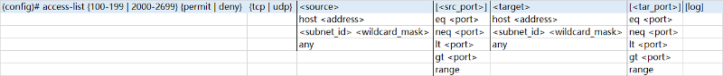

### ACL(Access Control List)<br>
1.ACL由一系列permit和deny语句组成<br>

2.ACL对流量进行匹配, 根据不同应用场景做出不同的应对策略
<br>
<br>
<br>

Wildcard Mask<br>
1.wildcard mask为0的bit, 代表对应IP bit固定, 不进行通配<br>

2.wildcard mask为1的bit, 代表对应IP bit进行通配, 可以为0或1的任意值<br>

3.当wildcar mask的bit值为1时, 但对应IP bit不为0, 先将对应IP bit转化为0<br>

** 例: 192.168.1.0 0.0.0.255<br>
<pre>
subnet                                subnet_mask
<b>11000000 10101000 00000001</b> 00000000&emsp;&emsp; <b>11111111 11111111 11111111</b> 00000000
subnet                                wildcard_mask
<b>11000000 10101000 00000001</b> 00000000&emsp;&emsp; <b>00000000 00000000 00000000</b> 11111111
</pre>
<br>
<br>
<br>

ACL分类:<br>
1.Standard ACL<br>
使用Source IP作为筛选标准<br>
配置在traffic target足够近的位置<br>

2.Extended ACL<br>
指定Source/Destination/Protocol/Port作为筛选标准<br>
配置在traffic source足够近的位置
<br>
<br>
<br>

#### IPv4 ACL
##### standard ACL
###### 1.standard numbered ACL
配置standard numbered ACL<br>
```
global command版本(legacy mode):
(config)# access-list {1-99 | 1300-1999} {permit | deny} {[host] <address> | <subnet_id> {<wildcard_mask> | /<prefix>} | any} [log]
(config)# access-list {1-99 | 1300-1999} remark <description>
** 该版本默认ACE以10为起始编号, 并且ACE以10为步进进行编号递增

ACL subcommand版本:
(config)# ip access-list standard {1-99 | 1300-1999}
(config-std-nacl)# [<seq_num>] {permit | deny} {[host] <address> | <subnet_id> {<wildcard_mask> | /<prefix>} | any} [log]
(config-std-nacl)# remark <description>


1.permit代表允许, deny代表拒绝

2.any代表所有IP
```
<br>
<br>

ACL逻辑<br>
```
(config)# ip access-list standard 10
(config-std-nacl)# 10 permit host 192.168.10.1
(config-std-nacl)# 20 permit 172.16.10.0 0.0.0.255
(config-std-nacl)# 30 deny any

(config)# interface g0/0
(config-if)# ip access-group 10 in


1.ACL由编号为10/20/30的Access List Entry(ACE)组成

2.从编号由小到大一次进行匹配, 当匹配到符合的网络范围时, 使用该ACE规则, 并停止继续匹配

3.当ACL最后没有包含permit/deny any时, 隐式包含deny any
```
<br>
<br>

###### 2.standard named ACL
配置standard named ACL<br>
```
(config)# ip access-list standard <acl_name>
(config-std-nacl)# [<seq_num>] {permit | deny} {[host] <address> | <subnet_id> {<wildcard_mask> | /<prefix>} | any} [log]
(config-std-nacl)# remark <description>
```
<br>
<br>

示例<br>
不允许192.168.10.0/24通向192.168.30.0/24的流量<br>
<br>
```
配置OSPF
R1(config)# router ospf 1
R1(config-router)# router-id 1.1.1.1 
R1(config-router)# network 192.168.0.0 0.0.255.255 area 0

R2(config)# router ospf 1
R2(config-router)# router-id 2.2.2.2
R2(config-router)# network 192.168.0.0 0.0.255.255 area 0

R3(config)# router ospf 1
R3(config-router)# router-id 3.3.3.3
R3(config-router)# network 192.168.0.0 0.0.255.255 area 0

PC1> ping 192.168.30.4
84 bytes from 192.168.30.4 icmp_seq=1 ttl=61 time=49.860 ms
84 bytes from 192.168.30.4 icmp_seq=2 ttl=61 time=43.868 ms
84 bytes from 192.168.30.4 icmp_seq=3 ttl=61 time=37.396 ms
84 bytes from 192.168.30.4 icmp_seq=4 ttl=61 time=36.447 ms
84 bytes from 192.168.30.4 icmp_seq=5 ttl=61 time=32.335 ms


R3(config)# ip access-list standard 1
R3(config-std-nacl)# deny 192.168.10.0 0.0.0.255
R3(config-std-nacl)# permit any
R3(config)# int f0/1
R3(config-if)# ip access-group 1 out

PC1> ping 192.168.30.4
*192.168.2.3 icmp_seq=1 ttl=253 time=37.635 ms (ICMP type:3, code:13, Communication administratively prohibited)
*192.168.2.3 icmp_seq=2 ttl=253 time=28.676 ms (ICMP type:3, code:13, Communication administratively prohibited)
*192.168.2.3 icmp_seq=3 ttl=253 time=30.530 ms (ICMP type:3, code:13, Communication administratively prohibited)
*192.168.2.3 icmp_seq=4 ttl=253 time=22.589 ms (ICMP type:3, code:13, Communication administratively prohibited)
*192.168.2.3 icmp_seq=5 ttl=253 time=29.546 ms (ICMP type:3, code:13, Communication administratively prohibited)
```
<br>
<br>
<br>

##### Extended ACL
###### 1.extend numbered ACL
配置extend numbered ACL<br>
global command版本(legacy mode):<br>

<br>

<br>
<br>

配置extend numbered ACL说明文字(global command版本)<br>
`(config)# access-list {100-199 | 2000-2699} remark <description>`
<br>
<br>

ACL subcommand版本:<br>
```
(config)# ip access-list extended {100-199 | 2000-2699}
(config-ext-nacl)# [<seq_num>] {permit | deny} <protocol> <source> <target> [log]
(config-ext-nacl)# [<seq_num>] {permit | deny} {tcp | udp} <source> [<src_port>] <target> [<tar_port>] [log]
(config-ext-nacl)# remark <description>
```
<br>
<br>

###### 2.extend named ACL
配置extend named ACL<br>
```
(config)# ip access-list extended <acl_name>
(config-ext-nacl)# [<seq_num>] {permit | deny} <protocol> <source> <target> [log]
(config-ext-nacl)# [<seq_num>] {permit | deny} {tcp | udp} <source> [<src_port>] <target> [<tar_port>] [log]
(config-ext-nacl)# remark <description>
```
<br>
<br>
<br>

#### ACL的应用
##### 将ACL应用于接口
```
(config)# interface <interface>
(config-if)# ip access-group {<acl_num> | <acl_name>} {in | out}

R1# show ip int f0/0 | include access list
  Outgoing access list is not set
  Inbound  access list is 1
```
<br>
<br>

##### 将ACL应用于Telnet/SSH
示例 - 只允许10.0.0.0/24子网的用户登录
```
(config)# access-list 1 permit 10.0.0.0 0.0.0.255
(config)# line vty 0 15
(config-line)# access-class 1 in
```
<br>
<br>

图1<br>
<br>

图2<br>
<br>

##### 将ACL应用于路由协议
1)IGP network selection<br>
standard ACL<br>
以下情况匹配<br>
&emsp;&emsp;[1]network不匹配时, 路由项属于ACL的子网<br>
&emsp;&emsp;[2]network匹配, 无论如何都匹配
<br>
<br>

示例(参考图1)
```
R4# show ip route | begin Gateway
Gateway of last resort is not set

      10.0.0.0/8 is variably subnetted, 14 subnets, 2 masks
C        10.1.1.0/24 is directly connected, FastEthernet1/0
L        10.1.1.4/32 is directly connected, FastEthernet1/0
C        10.1.2.0/24 is directly connected, FastEthernet0/1
L        10.1.2.4/32 is directly connected, FastEthernet0/1
O        10.1.3.0/24 [110/2] via 10.1.2.5, 00:00:04, FastEthernet0/1
                     [110/2] via 10.1.1.6, 00:00:04, FastEthernet1/0
O        10.2.1.0/24 [110/2] via 10.2.4.2, 00:00:04, FastEthernet0/0
O        10.2.2.0/24 [110/3] via 10.2.4.2, 00:00:04, FastEthernet0/0
C        10.2.3.0/24 is directly connected, Serial4/0
L        10.2.3.4/32 is directly connected, Serial4/0
C        10.2.4.0/24 is directly connected, FastEthernet0/0
L        10.2.4.4/32 is directly connected, FastEthernet0/0
O IA     10.3.1.0/24 [110/2] via 10.1.1.6, 00:00:04, FastEthernet1/0
O IA     10.3.2.0/24 [110/2] via 10.1.1.6, 00:00:04, FastEthernet1/0
O IA     10.3.3.0/24 [110/3] via 10.1.1.6, 00:00:04, FastEthernet1/0


R4(config)# ip access-list standard 1
R4(config-std-nacl)# 10 deny 10.3.0.0 0.0.255.255
R4(config-std-nacl)# 20 permit any
R4(config-std-nacl)# router ospf 1
R4(config-router)# distribute-list 1 in 

R4# show ip access-list 
Standard IP access list 1
    10 deny   10.3.0.0, wildcard bits 0.0.255.255 (3 matches)
    20 permit any (4 matches)

R4# show ip route | begin Gateway
Gateway of last resort is not set

      10.0.0.0/8 is variably subnetted, 11 subnets, 2 masks
C        10.1.1.0/24 is directly connected, FastEthernet1/0
L        10.1.1.4/32 is directly connected, FastEthernet1/0
C        10.1.2.0/24 is directly connected, FastEthernet0/1
L        10.1.2.4/32 is directly connected, FastEthernet0/1
O        10.1.3.0/24 [110/2] via 10.1.2.5, 00:00:48, FastEthernet0/1
                     [110/2] via 10.1.1.6, 00:00:48, FastEthernet1/0
O        10.2.1.0/24 [110/2] via 10.2.4.2, 00:00:48, FastEthernet0/0
O        10.2.2.0/24 [110/3] via 10.2.4.2, 00:00:48, FastEthernet0/0
C        10.2.3.0/24 is directly connected, Serial4/0
L        10.2.3.4/32 is directly connected, Serial4/0
C        10.2.4.0/24 is directly connected, FastEthernet0/0
L        10.2.4.4/32 is directly connected, FastEthernet0/0
```
<br>
<br>

2)BGP network selection<br>
*standard ACL*<br>
以下情况匹配<br>
&emsp;&emsp;[1]network不匹配时, 路由项属于ACL的子网<br>
&emsp;&emsp;[2]network匹配, 无论如何都匹配<br>
<br>

示例(参考图2)<br>
```
R7# show ip route | begin Gateway
Gateway of last resort is not set

      10.0.0.0/8 is variably subnetted, 7 subnets, 2 masks
B        10.1.10.0/24 [200/2] via 10.10.10.4, 00:20:17
B        10.1.20.0/24 [200/2] via 10.10.10.4, 00:20:17
B        10.1.30.0/24 [200/0] via 10.10.10.4, 00:20:17
B        10.1.40.0/24 [200/0] via 10.10.10.4, 00:20:17
B        10.10.10.0/24 [200/0] via 172.16.20.5, 00:20:22
C        10.10.20.0/24 is directly connected, GigabitEthernet0/2
L        10.10.20.7/32 is directly connected, GigabitEthernet0/2
      172.16.0.0/16 is variably subnetted, 5 subnets, 2 masks
O        172.16.10.0/24 [110/2] via 172.16.30.6, 00:20:48, GigabitEthernet0/1
                        [110/2] via 172.16.20.5, 00:20:58, GigabitEthernet0/0
C        172.16.20.0/24 is directly connected, GigabitEthernet0/0
L        172.16.20.7/32 is directly connected, GigabitEthernet0/0
C        172.16.30.0/24 is directly connected, GigabitEthernet0/1
L        172.16.30.7/32 is directly connected, GigabitEthernet0/1
B     192.168.10.0/24 [20/0] via 10.10.20.8, 00:17:57
      192.168.20.0/32 is subnetted, 1 subnets
B        192.168.20.9 [20/2] via 10.10.20.8, 00:17:15


R4(config)# ip access-list standard 1
R4(config-std-nacl)# 10 deny 10.1.0.0 0.0.255.255
R4(config-std-nacl)# 20 permit any
R4(config-std-nacl)# router bgp 65100
R4(config-router)# neighbor 10.10.10.5 distribute-list 1 out

R7# show ip route | begin Gateway
Gateway of last resort is not set

      10.0.0.0/8 is variably subnetted, 3 subnets, 2 masks
B        10.10.10.0/24 [200/0] via 172.16.20.5, 00:21:21
C        10.10.20.0/24 is directly connected, GigabitEthernet0/2
L        10.10.20.7/32 is directly connected, GigabitEthernet0/2
      172.16.0.0/16 is variably subnetted, 5 subnets, 2 masks
O        172.16.10.0/24 [110/2] via 172.16.30.6, 00:21:47, GigabitEthernet0/1
                        [110/2] via 172.16.20.5, 00:21:57, GigabitEthernet0/0
C        172.16.20.0/24 is directly connected, GigabitEthernet0/0
L        172.16.20.7/32 is directly connected, GigabitEthernet0/0
C        172.16.30.0/24 is directly connected, GigabitEthernet0/1
L        172.16.30.7/32 is directly connected, GigabitEthernet0/1
B     192.168.10.0/24 [20/0] via 10.10.20.8, 00:18:56
      192.168.20.0/32 is subnetted, 1 subnets
B        192.168.20.9 [20/2] via 10.10.20.8, 00:18:14
```
<br>
<br>

*extended ACL*<br>
source字段代表network_id部分; destination字段代表mask部分<br>

示例(参考图2)<br>
```
1)ip host <src_add> host <des_add>
host 10.1.30.0 host 255.255.255.0
10.1.30.0/24

R7# show ip route | begin Gateway
Gateway of last resort is not set

      10.0.0.0/8 is variably subnetted, 7 subnets, 2 masks
B        10.1.10.0/24 [200/2] via 10.10.10.4, 00:20:17
B        10.1.20.0/24 [200/2] via 10.10.10.4, 00:20:17
B        10.1.30.0/24 [200/0] via 10.10.10.4, 00:20:17
B        10.1.40.0/24 [200/0] via 10.10.10.4, 00:20:17
B        10.10.10.0/24 [200/0] via 172.16.20.5, 00:20:22
C        10.10.20.0/24 is directly connected, GigabitEthernet0/2
L        10.10.20.7/32 is directly connected, GigabitEthernet0/2
      172.16.0.0/16 is variably subnetted, 5 subnets, 2 masks
O        172.16.10.0/24 [110/2] via 172.16.30.6, 00:20:48, GigabitEthernet0/1
                        [110/2] via 172.16.20.5, 00:20:58, GigabitEthernet0/0
C        172.16.20.0/24 is directly connected, GigabitEthernet0/0
L        172.16.20.7/32 is directly connected, GigabitEthernet0/0
C        172.16.30.0/24 is directly connected, GigabitEthernet0/1
L        172.16.30.7/32 is directly connected, GigabitEthernet0/1
B     192.168.10.0/24 [20/0] via 10.10.20.8, 00:17:57
      192.168.20.0/32 is subnetted, 1 subnets
B        192.168.20.9 [20/2] via 10.10.20.8, 00:17:15


R4(config)# ip access-list extended 100
R4(config-ext-nacl)# 10 deny ip host 10.1.30.0 host 255.255.255.0
R4(config-ext-nacl)# 20 permit ip any any
R4(config-ext-nacl)# router bgp 65100
R4(config-router)# neighbor 10.10.10.5 distribute-list 100 out

R7# show ip route | begin Gateway
Gateway of last resort is not set

      10.0.0.0/8 is variably subnetted, 6 subnets, 2 masks
B        10.1.10.0/24 [200/2] via 10.10.10.4, 00:14:54
B        10.1.20.0/24 [200/2] via 10.10.10.4, 00:14:54
B        10.1.40.0/24 [200/0] via 10.10.10.4, 00:14:54
B        10.10.10.0/24 [200/0] via 172.16.20.5, 00:38:01
C        10.10.20.0/24 is directly connected, GigabitEthernet0/2
L        10.10.20.7/32 is directly connected, GigabitEthernet0/2
      172.16.0.0/16 is variably subnetted, 5 subnets, 2 masks
O        172.16.10.0/24 [110/2] via 172.16.30.6, 00:38:27, GigabitEthernet0/1
                        [110/2] via 172.16.20.5, 00:38:37, GigabitEthernet0/0
C        172.16.20.0/24 is directly connected, GigabitEthernet0/0
L        172.16.20.7/32 is directly connected, GigabitEthernet0/0
C        172.16.30.0/24 is directly connected, GigabitEthernet0/1
L        172.16.30.7/32 is directly connected, GigabitEthernet0/1
B     192.168.10.0/24 [20/0] via 10.10.20.8, 00:35:36
      192.168.20.0/32 is subnetted, 1 subnets
B        192.168.20.9 [20/2] via 10.10.20.8, 00:34:54


2)ip <src_net> <src_wildcard> host <des_add>
10.1.0.0 0.0.255.0 host 255.255.255.0
10.1.x.0/24, x可以为任何值

R7# show ip route | begin Gateway
Gateway of last resort is not set

      10.0.0.0/8 is variably subnetted, 7 subnets, 2 masks
B        10.1.10.0/24 [200/2] via 10.10.10.4, 00:20:17
B        10.1.20.0/24 [200/2] via 10.10.10.4, 00:20:17
B        10.1.30.0/24 [200/0] via 10.10.10.4, 00:20:17
B        10.1.40.0/24 [200/0] via 10.10.10.4, 00:20:17
B        10.10.10.0/24 [200/0] via 172.16.20.5, 00:20:22
C        10.10.20.0/24 is directly connected, GigabitEthernet0/2
L        10.10.20.7/32 is directly connected, GigabitEthernet0/2
      172.16.0.0/16 is variably subnetted, 5 subnets, 2 masks
O        172.16.10.0/24 [110/2] via 172.16.30.6, 00:20:48, GigabitEthernet0/1
                        [110/2] via 172.16.20.5, 00:20:58, GigabitEthernet0/0
C        172.16.20.0/24 is directly connected, GigabitEthernet0/0
L        172.16.20.7/32 is directly connected, GigabitEthernet0/0
C        172.16.30.0/24 is directly connected, GigabitEthernet0/1
L        172.16.30.7/32 is directly connected, GigabitEthernet0/1
B     192.168.10.0/24 [20/0] via 10.10.20.8, 00:17:57
      192.168.20.0/32 is subnetted, 1 subnets
B        192.168.20.9 [20/2] via 10.10.20.8, 00:17:15


R4(config)# ip access-list extended 100
R4(config-ext-nacl)# 10 deny ip 10.1.0.0 0.0.255.0 host 255.255.255.0
R4(config-ext-nacl)# 20 permit ip any any
R4(config-ext-nacl)# router bgp 65100
R4(config-router)# neighbor 10.10.10.5 distribute-list 100 out

R7# show ip route | begin Gateway
Gateway of last resort is not set

      10.0.0.0/8 is variably subnetted, 3 subnets, 2 masks
B        10.10.10.0/24 [200/0] via 172.16.20.5, 00:41:46
C        10.10.20.0/24 is directly connected, GigabitEthernet0/2
L        10.10.20.7/32 is directly connected, GigabitEthernet0/2
      172.16.0.0/16 is variably subnetted, 5 subnets, 2 masks
O        172.16.10.0/24 [110/2] via 172.16.30.6, 00:42:12, GigabitEthernet0/1
                        [110/2] via 172.16.20.5, 00:42:22, GigabitEthernet0/0
C        172.16.20.0/24 is directly connected, GigabitEthernet0/0
L        172.16.20.7/32 is directly connected, GigabitEthernet0/0
C        172.16.30.0/24 is directly connected, GigabitEthernet0/1
L        172.16.30.7/32 is directly connected, GigabitEthernet0/1
B     192.168.10.0/24 [20/0] via 10.10.20.8, 00:39:21
      192.168.20.0/32 is subnetted, 1 subnets
B        192.168.20.9 [20/2] via 10.10.20.8, 00:38:39


3)ip <src_net> <src_wildcard> <des_net> <des_wildcard>
10.1.0.0 0.0.255.0 255.255.0.0 0.0.255.128
10.1.x.0/{16 - 25}, x可以为任何值

R7# show ip route | begin Gateway
Gateway of last resort is not set

      10.0.0.0/8 is variably subnetted, 7 subnets, 2 masks
B        10.1.10.0/24 [200/2] via 10.10.10.4, 00:20:17
B        10.1.20.0/24 [200/2] via 10.10.10.4, 00:20:17
B        10.1.30.0/24 [200/0] via 10.10.10.4, 00:20:17
B        10.1.40.0/24 [200/0] via 10.10.10.4, 00:20:17
B        10.10.10.0/24 [200/0] via 172.16.20.5, 00:20:22
C        10.10.20.0/24 is directly connected, GigabitEthernet0/2
L        10.10.20.7/32 is directly connected, GigabitEthernet0/2
      172.16.0.0/16 is variably subnetted, 5 subnets, 2 masks
O        172.16.10.0/24 [110/2] via 172.16.30.6, 00:20:48, GigabitEthernet0/1
                        [110/2] via 172.16.20.5, 00:20:58, GigabitEthernet0/0
C        172.16.20.0/24 is directly connected, GigabitEthernet0/0
L        172.16.20.7/32 is directly connected, GigabitEthernet0/0
C        172.16.30.0/24 is directly connected, GigabitEthernet0/1
L        172.16.30.7/32 is directly connected, GigabitEthernet0/1
B     192.168.10.0/24 [20/0] via 10.10.20.8, 00:17:57
      192.168.20.0/32 is subnetted, 1 subnets
B        192.168.20.9 [20/2] via 10.10.20.8, 00:17:15


R4(config)# ip access-list extended 100
R4(config-ext-nacl)# 10 deny ip 10.1.0.0 0.0.255.0 255.255.0.0 0.0.255.128
R4(config-ext-nacl)# 20 permit ip any any
R4(config-ext-nacl)# router bgp 65100
R4(config-router)# neighbor 10.10.10.5 distribute-list 100 out

R7# show ip route | begin Gateway
Gateway of last resort is not set

      10.0.0.0/8 is variably subnetted, 3 subnets, 2 masks
B        10.10.10.0/24 [200/0] via 172.16.20.5, 00:54:02
C        10.10.20.0/24 is directly connected, GigabitEthernet0/2
L        10.10.20.7/32 is directly connected, GigabitEthernet0/2
      172.16.0.0/16 is variably subnetted, 5 subnets, 2 masks
O        172.16.10.0/24 [110/2] via 172.16.30.6, 00:54:28, GigabitEthernet0/1
                        [110/2] via 172.16.20.5, 00:54:38, GigabitEthernet0/0
C        172.16.20.0/24 is directly connected, GigabitEthernet0/0
L        172.16.20.7/32 is directly connected, GigabitEthernet0/0
C        172.16.30.0/24 is directly connected, GigabitEthernet0/1
L        172.16.30.7/32 is directly connected, GigabitEthernet0/1
B     192.168.10.0/24 [20/0] via 10.10.20.8, 00:51:37
      192.168.20.0/32 is subnetted, 1 subnets
B        192.168.20.9 [20/2] via 10.10.20.8, 00:50:55
```
<br>
<br>

显示ACL内容<br>
`# show ip access-list`
<br>
<br>
<br>

#### IPv6 ACL
IPv6 ACL只支持named extended ACL
<br>


<br>


<br>

将IPv6 ACL配置到接口<br>
`(config-if)# ipv6 traffic-filter <acl_name> {in | out}`
<br>
<br>

<br>
配置环境
```
R1(config)# ipv6 unicast-routing
R1(config)# router ospfv3 1
R1(config-router)# router-id 1.1.1.1
R1(config)# int f0/0
R1(config-if)# ipv6 add 2001:db8:1:20::1/64
R1(config-if)# no shutdown
R1(config-if)# ospfv3 1 ipv6 area 0
R1(config)# int f0/1
R1(config-if)# ipv6 add 2001:db8:1:10::1/64
R1(config-if)# no shutdown
R1(config-if)# ospfv3 1 ipv6 area 0

R2(config)# ipv6 unicast-routing
R2(config)# router ospfv3 1
R2(config-router)# router-id 2.2.2.2
R2(config)# int f0/0
R2(config-if)# ipv6 add 2001:db8:1:10::2/64
R2(config-if)# no shutdown
R2(config-if)# ospfv3 1 ipv6 area 0
R2(config)# int f0/1
R2(config-if)# ipv6 add 2001:db8:1:30::2/64
R2(config-if)# no shutdown
R2(config-if)# ospfv3 1 ipv6 area 0

PC1> ip 2001:db8:1:20::3/64 auto

PC2> ip 2001:db8:1:20::4/64 auto

PC3> ip 2001:db8:1:20::5/64 auto

PC4> ip 2001:db8:1:30::3/64 auto

PC5> ip 2001:db8:1:30::4/64 auto

PC6> ip 2001:db8:1:30::5/64 auto


测试连通性
PC1> ping 2001:db8:1:30::4/64
PC1> ping 2001:db8:1:30::5/64

PC2> ping 2001:db8:1:30::4/64
PC2> ping 2001:db8:1:30::5/64


给R1添加ACL
R1(config)# ipv6 access-list FILTER
R1(config-ipv6-acl)# permit icmp 2001:db8:1:20::/126 any
R1(config)# int f0/0
R1(config-if)# ipv6 traffic-filter FILTER in


测试连通性
PC1> ping 2001:db8:1:30::4/64
PC1> ping 2001:db8:1:30::5/64

PC2> ping 2001:db8:1:30::4/64
*2001:db8:1:20::1 icmp6_seq=1 ttl=64 time=10.259 ms (ICMP type:1, code:1, Communication with destination administratively prohibited)
PC2> ping 2001:db8:1:30::5/64
*2001:db8:1:20::1 icmp6_seq=1 ttl=64 time=10.259 ms (ICMP type:1, code:1, Communication with destination administratively prohibited)
```
<br>
<br>
<br>

### 2.Prefix List
配置语法<br>
```
ip prefix-list <prefix_list_name> [seq <sequence_number>] {permit | deny} <high_order_bit_pattern>/<high_order_bit_count> [ge <ge_value>] [le <le_value>]

参数列表
1)high-order bit pattern
network

2)high-order bit count
network部分固定的bits
当ge和le都没有指定时, 精确匹配mask长度

3)ge
mask长度great/equal than指定长度
如果此时没有同时指定le, 默认le_value为32

4)le
mask长度less/equal than指定长度
如果此时没有同时指定ge, 默认ge_vlaue为high_order_bit_count

** 手动配置值的大小限定:
high_order_bit_count < ge_value <= le_value
```
<br>
<br>

prefix逻辑
```
ip prefix-list FILTER seq 5 permit 172.16.0.0/16 ge 24
ip prefix-list FILTER seq 10 deny 10.0.0.0/8 ge 16
ip prefix-list FILTER seq 15 permit 0.0.0.0/0 le 32

1.prefix list由seq 5/10/15的entry构成

2.prefix由最小的seq依次进行匹配, 匹配到符合网络, 则使用permit/deny规则, 并停止继续匹配

3.如果seq没有提供, 按步进5依次递增

4.如果最后的seq没有指定permit/deny 0.0.0.0/0 le 32, 则默认为deny 0.0.0.0/0 le 32
```
<br>
<br>


匹配解析:<br>
1)无ge/le参数<br>
`ip prefix-list FILTER seq 5 deny 192.168.0.0/16`<br>
精确匹配192.168.0.0/16网络, 即network部分为192.168.0.0, mask部分为16
<br>
<br>

2)包含ge/le参数<br>
`ip prefix-list FILTER seq 5 deny 10.1.0.0/16 ge 24`<br>
|type|full address|binary network|prefix length|result|
|---|---|---|---|---|
|prefix list|10.1.0.0/16 ge 24|**0000 1010 0000 0001** \| 0000 0000 0000 0000|[24,32]||
|route item 01|10.1.1.0/24|**0000 1010 0000 0001** \| 0000 0001 0000 0000|24|match|
|route item 02|10.1.1.64/26|**0000 1010 0000 0001** \| 0000 0001 0100 0000|26|match|
|route item 03|10.1.0.0/16|**0000 1010 0000 0001** \| 0000 0000 0000 0000|16|no match|
|route item 04|10.5.1.0/24|**0000 1010 0000 0101** \| 0000 0001 0000 0000|24|no match|

<br>
<br>

示例 - prefix-list在IGP OSPF的应用实例(参考图1)
```
配置OSPF
R1(config)# router ospf 1
R1(config-router)# router-id 1.1.1.1
R1(config-router)# network 10.2.0.0 0.0.255.255 area 2

R2(config)# router ospf 1
R2(config-router)# router-id 2.2.2.2
R2(config-router)# network 10.2.0.0 0.0.255.255 area 2

R3(config)# router ospf 1
R3(config-router)# router-id 3.3.3.3
R3(config-router)# network 10.2.0.0 0.0.255.255 area 2

R4(config)# router ospf 1
R4(config-router)# router-id 4.4.4.4
R4(config-router)# network 10.2.0.0 0.0.255.255 area 2
R4(config-router)# network 10.1.0.0 0.0.255.255 area 0

R5(config)# router ospf 1
R5(config-router)# router-id 5.5.5.5
R5(config-router)# network 10.1.0.0 0.0.255.255 area 0

R6(config)# router ospf 1
R6(config-router)# router-id 6.6.6.6
R6(config-router)# network 10.1.0.0 0.0.255.255 area 0
R6(config-router)# network 10.3.0.0 0.0.255.255 area 3 

R7(config)# router ospf 1
R7(config-router)# router-id 7.7.7.7
R7(config-router)# network 10.3.0.0 0.0.255.255 area 3

R8(config)# router ospf 1
R8(config-router)# router-id 8.8.8.8
R8(config-router)# network 10.3.0.0 0.0.255.255 area 3


1)prefix不携带ge/le参数
R2# show ip ospf database summary | include Link State ID
  Link State ID: 10.1.1.0 (summary Network Number)
  Link State ID: 10.1.2.0 (summary Network Number)
  Link State ID: 10.1.3.0 (summary Network Number)
  Link State ID: 10.3.1.0 (summary Network Number)
  Link State ID: 10.3.2.0 (summary Network Number)
  Link State ID: 10.3.3.0 (summary Network Number)
  

R4(config)# ip prefix-list OUT_FILTER seq 5 deny 10.3.1.0/24
R4(config)# ip prefix-list OUT_FILTER seq 10 permit 0.0.0.0/0 le 32
R4(config)# router ospf 1
R4(config-router)# area 0 filter-list prefix OUT_FILTER out

R2# show ip ospf database summary | include Link State ID
  Link State ID: 10.1.1.0 (summary Network Number)
  Link State ID: 10.1.2.0 (summary Network Number)
  Link State ID: 10.1.3.0 (summary Network Number)
  Link State ID: 10.3.2.0 (summary Network Number)
  Link State ID: 10.3.3.0 (summary Network Number)


2)prefix只携带ge或le
R2# show ip ospf database summary | include Link State ID
  Link State ID: 10.1.1.0 (summary Network Number)
  Link State ID: 10.1.2.0 (summary Network Number)
  Link State ID: 10.1.3.0 (summary Network Number)
  Link State ID: 10.3.1.0 (summary Network Number)
  Link State ID: 10.3.2.0 (summary Network Number)
  Link State ID: 10.3.3.0 (summary Network Number)

  
R4(config)# ip prefix-list OUT_FILTER seq 5 deny 10.3.0.0/16 ge 24
R4(config)# ip prefix-list OUT_FILTER seq 10 permit 0.0.0.0/0 le 32
R4(config)# router ospf 1
R4(config-router)# area 0 filter-list prefix OUT_FILTER out

R2# show ip ospf database summary | include Link State ID
  Link State ID: 10.1.1.0 (summary Network Number)
  Link State ID: 10.1.2.0 (summary Network Number)
  Link State ID: 10.1.3.0 (summary Network Number)
  
  
  
3)prefix同时携带ge和le
R2# show ip ospf database summary | include Link State ID
  Link State ID: 10.1.1.0 (summary Network Number)
  Link State ID: 10.1.2.0 (summary Network Number)
  Link State ID: 10.1.3.0 (summary Network Number)
  Link State ID: 10.3.1.0 (summary Network Number)
  Link State ID: 10.3.2.0 (summary Network Number)
  Link State ID: 10.3.3.0 (summary Network Number)

  
R4(config)# ip prefix-list OUT_FILTER seq 5 deny 10.3.0.0/16 ge 24 le 26
R4(config)# ip prefix-list OUT_FILTER seq 10 permit 0.0.0.0/0 le 32

R4(config)# router ospf 1
R4(config-router)# area 0 filter-list prefix OUT_FILTER out

R2# show ip ospf database summary | include Link State ID
  Link State ID: 10.1.1.0 (summary Network Number)
  Link State ID: 10.1.2.0 (summary Network Number)
  Link State ID: 10.1.3.0 (summary Network Number)
```
<br>
<br>


示例 - prefix-list在BGP的应用实例(参考图2)
```
配置OSPF
R1(config)# router ospf 1
R1(config-router)# router-id 1.1.1.1
R1(config-router)# network 10.1.0.0 0.0.255.255 area 0

R2(config)# router ospf 1
R2(config-router)# router-id 2.2.2.2
R2(config-router)# network 10.1.0.0 0.0.255.255 area 0

R3(config)# router ospf 1
R3(config-router)# router-id 3.3.3.3
R3(config-router)# network 10.1.0.0 0.0.255.255 area 0

R4(config)# router ospf 1
R4(config-router)# router-id 4.4.4.4
R4(config-router)# network 10.1.0.0 0.0.255.255 area 0

R5(config)# router ospf 1
R5(config-router)# router-id 5.5.5.5
R5(config-router)# network 172.16.0.0 0.0.255.255 area 0

R6(config)# router ospf 1
R6(config-router)# router-id 6.6.6.6
R6(config-router)# network 172.16.0.0 0.0.255.255 area 0

R7(config)# router ospf 1
R7(config-router)# router-id 7.7.7.7
R7(config-router)# network 172.16.0.0 0.0.255.255 area 0

R8(config)# router ospf 1
R8(config-router)# router-id 8.8.8.8
R8(config-router)# network 192.168.10.0 0.0.0.255 area 0

R9(config)# router ospf 1
R9(config-router)# router-id 9.9.9.9
R9(config-router)# network 192.168.0.0 0.0.255.255 area 0


配置BGP
R4(config)# router bgp 65100
R4(config-router)# bgp router-id 4.4.4.4
R4(config-router)# neighbor 10.10.10.5 remote-as 65200
R4(config-router)# redistribute connected
R4(config-router)# redistribute ospf 1

R5(config)# router bgp 65200
R5(config-router)# bgp router-id 5.5.5.5
R5(config-router)# neighbor 10.10.10.4 remote-as 65100
R5(config-router)# neighbor 172.16.20.7 remote-as 65200
R5(config-router)# redistribute connected
R5(config-router)# redistribute ospf 1

R7(config)# router bgp 65200
R7(config-router)# bgp router-id 7.7.7.7
R7(config-router)# neighbor 10.10.20.8 remote-as 65300
R7(config-router)# neighbor 172.16.20.5 remote-as 65200
R7(config-router)# redistribute connected
R7(config-router)# redistribute ospf 1

R8(config)# router bgp 65300
R8(config-router)# bgp router-id 8.8.8.8
R8(config-router)# neighbor 10.10.20.7 remote-as 65200
R8(config-router)# redistribute connected
R8(config-router)# redistribute ospf 1


1)prefix不携带ge/le参数
R5# show bgp ipv4 unicast | begin Network
     Network          Next Hop            Metric LocPrf Weight Path
 *>   10.1.10.0/24     10.10.10.4               2             0 65100 ?
 *>   10.1.20.0/24     10.10.10.4               2             0 65100 ?
 *>   10.1.30.0/24     10.10.10.4               0             0 65100 ?
 *>   10.1.40.0/24     10.10.10.4               0             0 65100 ?
 *>   10.10.10.0/24    0.0.0.0                  0         32768 ?
 *                     10.10.10.4               0             0 65100 ?
 *>i  10.10.20.0/24    172.16.20.7              0    100      0 ?
 * i  172.16.10.0/24   172.16.30.6              2    100      0 ?
 *>                    0.0.0.0                  0         32768 ?
 * i  172.16.20.0/24   172.16.20.7              0    100      0 ?
 *>                    0.0.0.0                  0         32768 ?
 * i  172.16.30.0/24   172.16.20.7              0    100      0 ?
 *>                    172.16.20.7              2         32768 ?
 *>i  192.168.10.0     10.10.20.8               0    100      0 65300 ?
 *>i  192.168.20.9/32  10.10.20.8               2    100      0 65300 ?
  
R4(config)# ip prefix-list OUT_FILTER seq 5 deny 10.1.30.0/24
R4(config)# ip prefix-list OUT_FILTER seq 10 permit 0.0.0.0/0 le 32
R4(config)# router bgp 65100
R4(config-router)# neighbor 10.10.10.5 prefix-list OUT_FILTER out

R5# show bgp ipv4 unicast | begin Network
     Network          Next Hop            Metric LocPrf Weight Path
 *>   10.1.10.0/24     10.10.10.4               2             0 65100 ?
 *>   10.1.20.0/24     10.10.10.4               2             0 65100 ?
 *>   10.1.40.0/24     10.10.10.4               0             0 65100 ?
 *>   10.10.10.0/24    0.0.0.0                  0         32768 ?
 *                     10.10.10.4               0             0 65100 ?
 *>i  10.10.20.0/24    172.16.20.7              0    100      0 ?
 * i  172.16.10.0/24   172.16.30.6              2    100      0 ?
 *>                    0.0.0.0                  0         32768 ?
 * i  172.16.20.0/24   172.16.20.7              0    100      0 ?
 *>                    0.0.0.0                  0         32768 ?
 * i  172.16.30.0/24   172.16.20.7              0    100      0 ?
 *>                    172.16.20.7              2         32768 ?
 *>i  192.168.10.0     10.10.20.8               0    100      0 65300 ?
 *>i  192.168.20.9/32  10.10.20.8               2    100      0 65300 ?


2)prefix只携带ge或le
R5# show bgp ipv4 unicast | begin Network
     Network          Next Hop            Metric LocPrf Weight Path
 *>   10.1.10.0/24     10.10.10.4               2             0 65100 ?
 *>   10.1.20.0/24     10.10.10.4               2             0 65100 ?
 *>   10.1.30.0/24     10.10.10.4               0             0 65100 ?
 *>   10.1.40.0/24     10.10.10.4               0             0 65100 ?
 *>   10.10.10.0/24    0.0.0.0                  0         32768 ?
 *                     10.10.10.4               0             0 65100 ?
 *>i  10.10.20.0/24    172.16.20.7              0    100      0 ?
 * i  172.16.10.0/24   172.16.30.6              2    100      0 ?
 *>                    0.0.0.0                  0         32768 ?
 * i  172.16.20.0/24   172.16.20.7              0    100      0 ?
 *>                    0.0.0.0                  0         32768 ?
 * i  172.16.30.0/24   172.16.20.7              0    100      0 ?
 *>                    172.16.20.7              2         32768 ?
 *>i  192.168.10.0     10.10.20.8               0    100      0 65300 ?
 *>i  192.168.20.9/32  10.10.20.8               2    100      0 65300 ?

  
R4(config)# ip prefix-list OUT_FILTER seq 5 deny 10.1.0.0/16 ge 24
R4(config)# ip prefix-list OUT_FILTER seq 10 permit 0.0.0.0/0 le 32
R4(config)# router bgp 65100
R4(config-router)# neighbor 10.10.10.5 prefix-list OUT_FILTER out

R5# show bgp ipv4 unicast | begin Network
     Network          Next Hop            Metric LocPrf Weight Path
 *>   10.10.10.0/24    0.0.0.0                  0         32768 ?
 *                     10.10.10.4               0             0 65100 ?
 *>i  10.10.20.0/24    172.16.20.7              0    100      0 ?
 * i  172.16.10.0/24   172.16.30.6              2    100      0 ?
 *>                    0.0.0.0                  0         32768 ?
 * i  172.16.20.0/24   172.16.20.7              0    100      0 ?
 *>                    0.0.0.0                  0         32768 ?
 * i  172.16.30.0/24   172.16.20.7              0    100      0 ?
 *>                    172.16.20.7              2         32768 ?
 *>i  192.168.10.0     10.10.20.8               0    100      0 65300 ?
 *>i  192.168.20.9/32  10.10.20.8               2    100      0 65300 ?
  
  
  
3)prefix同时携带ge和le
R5# show bgp ipv4 unicast | begin Network
     Network          Next Hop            Metric LocPrf Weight Path
 *>   10.1.10.0/24     10.10.10.4               2             0 65100 ?
 *>   10.1.20.0/24     10.10.10.4               2             0 65100 ?
 *>   10.1.30.0/24     10.10.10.4               0             0 65100 ?
 *>   10.1.40.0/24     10.10.10.4               0             0 65100 ?
 *>   10.10.10.0/24    0.0.0.0                  0         32768 ?
 *                     10.10.10.4               0             0 65100 ?
 *>i  10.10.20.0/24    172.16.20.7              0    100      0 ?
 * i  172.16.10.0/24   172.16.30.6              2    100      0 ?
 *>                    0.0.0.0                  0         32768 ?
 * i  172.16.20.0/24   172.16.20.7              0    100      0 ?
 *>                    0.0.0.0                  0         32768 ?
 * i  172.16.30.0/24   172.16.20.7              0    100      0 ?
 *>                    172.16.20.7              2         32768 ?
 *>i  192.168.10.0     10.10.20.8               0    100      0 65300 ?
 *>i  192.168.20.9/32  10.10.20.8               2    100      0 65300 ?

  
R4(config)# ip prefix-list OUT_FILTER seq 5 deny 10.1.0.0/16 ge 22 le 26
R4(config)# ip prefix-list OUT_FILTER seq 10 permit 0.0.0.0/0 le 32
R4(config)# router bgp 65100
R4(config-router)# neighbor 10.10.10.5 prefix-list OUT_FILTER out

R5# show bgp ipv4 unicast | begin Network
     Network          Next Hop            Metric LocPrf Weight Path
 *>   10.10.10.0/24    0.0.0.0                  0         32768 ?
 *                     10.10.10.4               0             0 65100 ?
 *>i  10.10.20.0/24    172.16.20.7              0    100      0 ?
 * i  172.16.10.0/24   172.16.30.6              2    100      0 ?
 *>                    0.0.0.0                  0         32768 ?
 * i  172.16.20.0/24   172.16.20.7              0    100      0 ?
 *>                    0.0.0.0                  0         32768 ?
 * i  172.16.30.0/24   172.16.20.7              0    100      0 ?
 *>                    172.16.20.7              2         32768 ?
 *>i  192.168.10.0     10.10.20.8               0    100      0 65300 ?
 *>i  192.168.20.9/32  10.10.20.8               2    100      0 65300 ?
```
<br>
<br>

### 3.PBR(Policy-Based Routing)
根据policy修改ip next-hop, 但是不对RIB进行修改<br>
包的转发默认根据Destination address, PBR可根据包的长度、源/目标地址、其他协议(ICMP/TCP等)等进行转发<br>

PBR配置步骤<br>
1.配置route-map<br>
`(config)# route-map <route_map_name> {permit | deny} [<seq_number>]`<br>

2.配置match<br>
```
(config-)# match length <minimum_length> <maximum_length>
or
(config-)# match ip address {<acl_number> | <acl_name>}
```
<br>

3.配置next-hop<br>
```
(config-)# set ip [default] next-hop <ip_address1> [<ip_address2>]...

** default参数代表只有目标地址不在RIB中时, 才使用该next-hop
```
<br>

4.将route-map应用到接口(traffic ingress)<br>
`(config-if)# ip policy route-map <route_map_name>`
<br>
<br>

图3<br>
<br>

示例(参考图3)
```
配置OSPF
R1(config)# router ospf 1
R1(config-router)# route-id 1.1.1.1
R1(config-router)# network 10.1.1.0 0.0.0.255 area 0
R1(config-router)# network 10.12.1.0 0.0.0.255 area 0

R2(config)# router ospf 1
R2(config-router)# route-id 2.2.2.2
R2(config-router)# network 10.12.1.0 0.0.0.255 area 0
R2(config-router)# network 10.23.1.0 0.0.0.255 area 0
R2(config-router)# network 10.24.1.0 0.0.0.255 area 0

R3(config)# router ospf 1
R3(config-router)# route-id 3.3.3.3
R3(config-router)# network 10.23.1.0 0.0.0.255 area 0
R3(config-router)# network 10.34.1.0 0.0.0.255 area 0

R4(config)# router ospf 1
R4(config-router)# route-id 4.4.4.4
R4(config-router)# network 10.24.1.0 0.0.0.255 area 0
R4(config-router)# network 10.34.1.0 0.0.0.255 area 0
R4(config-router)# network 10.45.1.0 0.0.0.255 area 0

R5(config)# router ospf 1
R5(config-router)# route-id 5.5.5.5
R5(config-router)# network 10.45.1.0 0.0.0.255 area 0
R5(config-router)# network 10.5.5.0 0.0.0.255 area 0


R1# traceroute 10.5.5.5 source 10.1.1.1
Type escape sequence to abort.
Tracing the route to 10.5.5.5
VRF info: (vrf in name/id, vrf out name/id)
  1 10.12.1.2 2 msec 2 msec 1 msec
  2 10.24.1.4 2 msec 1 msec 2 msec
  3 10.45.1.5 2 msec 1 msec 2 msec


R2(config)# ip access-list extended 100
R2(config-ext-nacl)# permit ip 10.1.1.0 0.0.0.255 10.5.5.0 0.0.0.255
R2(config-ext-nacl)# route-map PBR permit 10
R2(config-route-map)# match ip address 100
R2(config-route-map)# set ip next-hop 10.23.1.3
R2(config-route-map)# int g0/0
R2(config-if)# ip policy route-map PBR

R1# traceroute 10.5.5.5 source 10.1.1.1
Type escape sequence to abort.
Tracing the route to 10.5.5.5
VRF info: (vrf in name/id, vrf out name/id)
  1 10.12.1.2 2 msec 1 msec 0 msec
  2 10.23.1.3 1 msec 1 msec 1 msec
  3 10.34.1.4 2 msec 1 msec 1 msec
  4 10.45.1.5 1 msec 1 msec 2 msec
```
<br>
<br>

##### Local PBR
当traffic由当前路由器生成时, 使用Local PBR<br>
配置语法<br>
`(config)# ip local policy route-map <route_map_name>`
<br>

图4<br>
<br>

示例(参考图4)
```
OSPF配置
R1(config)# router ospf 1
R1(config-router)# router-id 1.1.1.1
R1(config-router)# network 10.12.1.0 0.0.0.255 area 0

R2(config)# router ospf 1
R2(config-router)# router-id 2.2.2.2
R2(config-router)# network 10.12.1.0 0.0.0.255 area 0
R2(config-router)# network 10.23.1.0 0.0.0.255 area 0

R3(config)# router ospf 1
R3(config-router)# router-id 3.3.3.3
R3(config-router)# network 10.23.1.0 0.0.0.255 area 0
R3(config-router)# network 10.16.36.0 0.0.0.255 area 0
R3(config-router)# network 10.33.33.0 0.0.0.255 area 0

R4(config)# router ospf 1
R4(config-router)# router-id 4.4.4.4
R4(config-router)# network 10.16.14.0 0.0.0.255 area 0
R4(config-router)# network 10.16.45.0 0.0.0.255 area 0

R5(config)# router ospf 1
R5(config-router)# router-id 5.5.5.5
R5(config-router)# network 10.16.45.0 0.0.0.255 area 0
R5(config-router)# network 10.16.56.0 0.0.0.255 area 0

R6(config)# router ospf 1
R6(config-router)# router-id 6.6.6.6
R6(config-router)# network 10.16.56.0 0.0.0.255 area 0
R6(config-router)# network 10.16.36.0 0.0.0.255 area 0


R1# ping 10.23.1.3 source 10.16.14.1
Type escape sequence to abort.
Sending 5, 100-byte ICMP Echos to 10.23.1.3, timeout is 2 seconds:
Packet sent with a source address of 10.16.14.1 
!!!!!
Success rate is 100 percent (5/5), round-trip min/avg/max = 1/1/3 ms


R2(config)# ip access-list extended 100
R2(config-ext-nacl)# permit ospf any any
R2(config-ext-nacl)# deny ip 10.16.14.0 0.0.0.255 any
R2(config-ext-nacl)# permit ip any any
R2(config-ext-nacl)# int g0/0
R2(config-if)# ip access-group 100 in

R1# ping 10.23.1.3 source 10.16.14.1
Type escape sequence to abort.
Sending 5, 100-byte ICMP Echos to 10.23.1.3, timeout is 2 seconds:
Packet sent with a source address of 10.16.14.1 
UUUUU
Success rate is 0 percent (0/5)


R1(config)# ip access-list extended 100
R1(config-ext-nacl)# permit ip 10.16.14.0 0.0.0.255 any
R1(config-ext-nacl)# route-map LOCAL-PBR permit 10
R1(config-route-map)# match ip address 100
R1(config-route-map)# set ip next-hop 10.16.14.4
R1(config-route-map)# exit
R1(config)# ip local policy route-map LOCAL-PBR

R1# ping 10.23.1.3 source 10.16.14.1
Type escape sequence to abort.
Sending 5, 100-byte ICMP Echos to 10.23.1.3, timeout is 2 seconds:
Packet sent with a source address of 10.16.14.1 
!!!!!
Success rate is 100 percent (5/5), round-trip min/avg/max = 2/2/4 ms

R1# traceroute 10.23.1.3 source 10.16.14.1 
Type escape sequence to abort.
Tracing the route to 10.23.1.3
VRF info: (vrf in name/id, vrf out name/id)
  1 10.16.14.4 2 msec 1 msec 1 msec
  2 10.16.45.5 2 msec 1 msec 1 msec
  3 10.16.56.6 2 msec 2 msec 1 msec
  4 10.16.36.3 2 msec 1 msec 1 msec
```
<br>
<br>

查看PBR:<br>
`show ip policy`
<br>
<br>
<br>

引用:<br>
[1] IPv6 ACL: https://www.cisco.com/c/en/us/td/docs/switches/lan/catalyst2960x/software/15-2_5_e/configuration_guide/b_1525e_consolidated_2960x_cg/b_1525e_consolidated_2960x_cg_chapter_0110100.pdf
