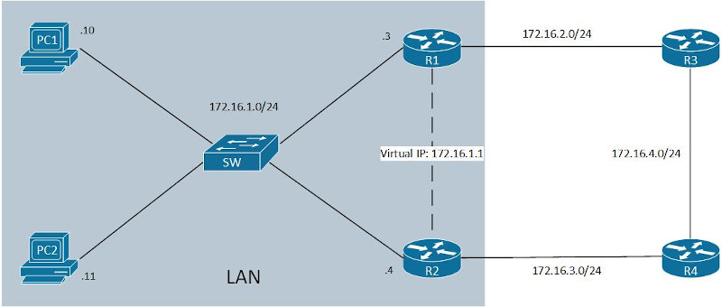
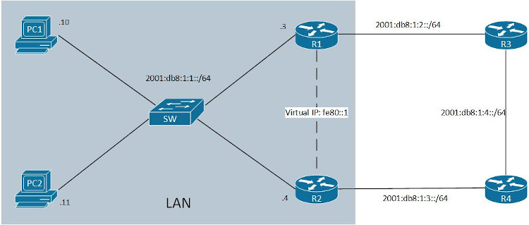

FHRP(First Hop Redundancy Protocol)<br>
给网关路由器提供冗余，使用虚拟IP, 子网内其他设备使用虚拟IP作为默认网关

FHRP类型:<br>
1.HSRP(Hot Standby Redundancy Protocol)<br>
Cisco私有协议, 使用active/standby模式
<br>

2.VRRP(Virtual Router Redundancy Protocol)<br>
标准协议, 使用master/backup模式

3.GLBP(Gateway Load Balancing Protocol)<br>


#### HSRP
##### active路由器选举
1.优先级高的(默认为100)
<br>

2.物理IP地址更大<br>
<br>
<br>

##### HSRP负载均衡
通过在不同VLAN实现不同的HSRP active/standby搭配, 实现负载均衡
<br>
<br>

##### HSRP版本差异
|                  |HSRPv1           |HSRPv2    |
|------------------|-----------------|----------|
|Timers            |不支持ms         |支持ms    |
|Group range       |0-255            |0-4095    |
|Multicast address |224.0.0.2        |224.0.0.102|
|MAC address range |0000.0C07.ACxx, xx为HSRP group number  |0000.0C9F.F000 - 0000.0C9F.FFFF|

<br>
<br>               

##### 配置HSRP步骤
```
1.配置虚拟ip
(config-if)# standby <group_num> ip <ip_addr>

2.配置抢占(可选, 默认不开启)
(config-if)# standby <group_num> preempt

3.配置group名称(可选)
(config-if)# standby <group_num> name <group_name>

4.配置优先级(可选, 优先级值范围: 0 - 255)
(config-if)# standby <group_num> priority <priority>

5.配置mac地址(可选)
(config-if)# standby <group_num> mac-address <mac_addr>

6.配置timer(可选, seconds范围: 1 - 254, milliseconds范围: 15 - 999)
(config-if)# standby <group_num> timers {<seconds> | msec <milliseconds>}
```
<br>

查看HSRP简略信息<br>
`# show standby brief`
<br>

查看HSRP信息<br>
`# show standby`
<br>
<br>
                   
图1<br>

<br>

##### 配置HSRP实例(如图1, 只支持Static NAT和Dynamic NAT, 不支持PAT, 额外支持类型为Stateful NAT)
```
路由器R1
interface:
R1(config)# int f0/0
R1(config-if)# ip address 172.16.1.3 255.255.255.0
R1(config-if)# no shutdown
R1(config-if)# int f0/1
R1(config-if)# ip address 172.16.2.1 255.255.255.0
R1(config-if)# no shutdown

ospf:
R1(config)# router ospf 1
R1(config-router)# router-id 1.1.1.1
R1(config)# int f0/1
R1(config-if)# ip ospf 1 area 0

hsrp:
R1(config)# int f0/0
R1(config-if)# standby 2 ip 172.16.1.1
R1(config-if)# standby 2 name hsrp
R1(config-if)# standby 2 priority 110
R1(config-if)# standby 2 preempt

snat(stateful nat):
R1(config)# int f0/0
R1(config-if)# ip nat inside
R1(config-if)# int f0/1
R1(config-if)# ip nat outside
R1(config)# access-list 1 permit 172.16.1.0 0.0.0.255
R1(config)# ip nat pool snat_pool 172.16.2.1 172.16.2.1 netmask 255.255.255.0 
R1(config)# ip nat stateful id 1
R1(config-ipnat-snat)# redundancy hsrp
R1(config-ipnat-snat-red)# mapping-id 1
R1(config)# ip nat inside source list 1 pool snat_pool mapping-id 1 overload


路由器R2
interface:
R2(config)# int f0/0
R2(config-if)# ip address 172.16.1.4 255.255.255.0
R2(config-if)# no shutdown
R2(config-if)# int f0/1
R2(config-if)# ip address 172.16.3.1 255.255.255.0
R2(config-if)# no shutdown

ospf:
R2(config)# router ospf 1
R2(config-router)# router-id 2.2.2.2
R2(config)# int f0/1
R2(config-if)# ip ospf 1 area 0

hsrp:
R2(config)# int f0/0
R2(config-if)# standby 2 ip 172.16.1.1
R2(config-if)# standby 2 name hsrp
R2(config-if)# standby 2 preempt

snat(stateful nat):
R2(config)# int f0/0
R2(config-if)# ip nat inside
R2(config)# int f0/1
R2(config-if)# ip nat outside
R2(config)# access-list 1 permit 172.16.1.0 0.0.0.255
R2(config)# ip nat pool snat_pool 172.16.3.1 172.16.3.1 netmask 255.255.255.0 
R2(config)# ip nat stateful id 1
R2(config-ipnat-snat)# redundancy hsrp
R2(config-ipnat-snat-red)# mapping-id 1
R2(config)# ip nat inside source list 1 pool snat_pool mapping-id 1 overload


路由器R3
interface:
R3(config)# int f0/0
R3(config-if)# ip address 172.16.2.2 255.255.255.0
R3(config-if)# no shutdown
R3(config-if)# int f0/1
R3(config-if)# ip address 172.16.4.1 255.255.255.0
R3(config-if)# no shutdown

ospf:
R3(config)# router ospf 1
R3(config-router)# router-id 3.3.3.3
R3(config)# int f0/0
R3(config-if)# ip ospf 1 area 0
R3(config-if)# int f0/1
R3(config-if)# ip ospf 1 area 0


路由器R4
interface:
R4(config)# int f0/0
R4(config-if)# ip address 172.16.3.2 255.255.255.0
R4(config-if)# no shutdown
R4(config-if)# int f0/1
R4(config-if)# ip address 172.16.4.2 255.255.255.0
R4(config-if)# no shutdown

ospf:
R4(config)# router ospf 1
R4(config-router)# router-id 4.4.4.4
R4(config)# int f0/0
R4(config-if)# ip ospf 1 area 0
R4(config-if)# int f0/1
R4(config-if)# ip ospf 1 area 0


交换机
switch(config)# no ip igmp snooping
** GNS3 IOU交换机配置, 不然两个网关路由器无法联通
** 参考: https://community.cisco.com/t5/other-network-architecture-subjects/standby-router-is-unknown-in-hsrp/td-p/3913200


计算机PC1
PC1> ip 172.16.1.10 172.16.1.1


计算机PC2
PC2> ip 172.16.1.11 172.16.1.1
```

监测链路172.16.2.0/24, 故障时降低R1的f0/0的HSRP优先级, 使得R2的f0/0过渡为active
```
R1(config)# track 1 interface f0/1 line-protocol
R1(config)# int f0/0
R1(config-if)# standby 2 track 1 decrement 20
```
<br>
<br>

#### VRRP
##### VRRP特征:
1.默认开启抢占
<br>

2.虚拟mac地址格式: 0000.5e00.01xx, xx为group num
<br>

3.IPv4多播地址为224.0.0.18, IPv6多播地址为FF02::12
<br>
<br>

##### 支持的版本:
VRRPv2: 支持IPv4
<br>

VRRPv3: 支持IPv4和IPv6
<br>
<br>

##### 配置VRRPv2步骤
```
1.配置虚拟ip
(config-if)# vrrp <group_num> ip <ip_addr>

2.配置抢占(可选, 默认开启)
(config-if)# vrrp <group_num> preempt

3.配置优先级(可选, 优先级值范围: 0 - 255)
(config-if)# standby <group_num> priority <priority>

4.配置timer(可选, seconds范围: 1 - 254, milliseconds范围: 15 - 999)
(config-if)# standby <group_num> timers {advertise | learn} {<seconds> | msec <milliseconds>}
```
<br>

查看VRRP简略信息<br>
`# show vrrp brief`
<br>

查看VRRP信息<br>
`# show vrrp`
<br>
<br>
                   
##### 配置VRRPv2实例(如图1, 只支持Static NAT与Dynamic NAT, 不支持PAT, 并且不支持Stateful NAT)
```
路由器R1
interface:
R1(config)# int f0/0
R1(config-if)# ip address 172.16.1.3 255.255.255.0
R1(config-if)# no shutdown
R1(config-if)# int f0/1
R1(config-if)# ip address 172.16.2.1 255.255.255.0
R1(config-if)# no shutdown

ospf:
R1(config)# router ospf 1
R1(config-router)# router-id 1.1.1.1
R1(config)# int f0/1
R1(config-if)# ip ospf 1 area 0

vrrp:
R1(config)# track 1 interface f0/1 line-protocol
R1(config)# int f0/0
R1(config-if)# vrrp 2 ip 172.16.1.1
R1(config-if)# vrrp 2 priority 110
R1(config-if)# vrrp 2 track 1 decrement 20

dynamic nat:
R1(config)# int f0/0
R1(config-if)# ip nat inside
R1(config-if)# int f0/1
R1(config-if)# ip nat outside
R1(config)# access-list 1 permit 172.16.1.0 0.0.0.255
R1(config)# ip nat pool snat_pool 172.16.2.10 172.16.2.60 netmask 255.255.255.0 
R1(config)# ip nat inside source list 1 pool snat_pool


路由器R2
interface:
R2(config)# int f0/0
R2(config-if)# ip address 172.16.1.4 255.255.255.0
R2(config-if)# no shutdown
R2(config-if)# int f0/1
R2(config-if)# ip address 172.16.3.1 255.255.255.0
R2(config-if)# no shutdown

ospf:
R2(config)# router ospf 1
R2(config-router)# router-id 2.2.2.2
R2(config)# int f0/1
R2(config-if)# ip ospf 1 area 0

vrrp:
R2(config)# int f0/0
R2(config-if)# vrrp 2 ip 172.16.1.1

dynamic nat:
R2(config)# int f0/0
R2(config-if)# ip nat inside
R2(config)# int f0/1
R2(config-if)# ip nat outside
R2(config)# access-list 1 permit 172.16.1.0 0.0.0.255
R2(config)# ip nat pool snat_pool 172.16.3.10 172.16.3.60 netmask 255.255.255.0 
R2(config)# ip nat inside source list 1 pool snat_pool


路由器R3
interface:
R3(config)# int f0/0
R3(config-if)# ip address 172.16.2.2 255.255.255.0
R3(config-if)# no shutdown
R3(config-if)# int f0/1
R3(config-if)# ip address 172.16.4.1 255.255.255.0
R3(config-if)# no shutdown

ospf:
R3(config)# router ospf 1
R3(config-router)# router-id 3.3.3.3
R3(config)# int f0/0
R3(config-if)# ip ospf 1 area 0
R3(config-if)# int f0/1
R3(config-if)# ip ospf 1 area 0


路由器R4
interface:
R4(config)# int f0/0
R4(config-if)# ip address 172.16.3.2 255.255.255.0
R4(config-if)# no shutdown
R4(config-if)# int f0/1
R4(config-if)# ip address 172.16.4.2 255.255.255.0
R4(config-if)# no shutdown

ospf:
R4(config)# router ospf 1
R4(config-router)# router-id 4.4.4.4
R4(config)# int f0/0
R4(config-if)# ip ospf 1 area 0
R4(config-if)# int f0/1
R4(config-if)# ip ospf 1 area 0


交换机
switch(config)# no ip igmp snooping


计算机PC1
PC1> ip 172.16.1.10 172.16.1.1


计算机PC2
PC2> ip 172.16.1.11 172.16.1.1
```
<br>
<br>


图2<br>

<br>

配置VRRPv3步骤
```
VRRPv3
1.开启VRRPv3
(config)# fhrp version vrrp v3

2.配置地址类型(ipv4或ipv6)
(config-if)# vrrp <group_id> address-family {ipv4 | ipv6}

3.配置虚拟地址
(config-if-vrrp)# address <prefix>/<prefix_length>

4.配置抢占和delay间隔(可选, preempt默认开启)
(config-if-vrrp)# preempt
(config-if-vrrp)# preempt delay minimum <seconds>

5.配置优先级(可选)
(config-if-vrrp)# priority <priority>

6.配置接口监测(可选)
(config-if-vrrp)# track <object_id> decrement <decrement_vlaue>
```
<br>
<br>

配置VRRPv3实例(如图2)
```
路由器R1
interface:
R1(config)# int e0/0
R1(config-if)# ipv6 address 2001:db8:1:1::3/64
R1(config-if)# no shutdown
R1(config-if)# int e0/1
R1(config-if)# ipv6 address 2001:db8:1:2::1/64
R1(config-if)# no shutdown

ospfv3:
R1(config)# ipv6 unicast-routing
R1(config)# router ospfv3 1
R1(config-router)# router-id 1.1.1.1
R1(config)# int e0/0
R1(config-if)# ospfv3 1 ipv6 area 0
R1(config)# int e0/1
R1(config-if)# ospfv3 1 ipv6 area 0

vrrp:
R1(config)# fhrp version vrrp v3
R1(config)# track 1 interface e0/1 line-protocol
R1(config)# int e0/0
R1(config-if)# vrrp 2 address-family ipv6
R1(config-if-vrrp)# address fe80::1 primary
R1(config-if-vrrp)# priority 110
R1(config-if-vrrp)# track 1 decrement 20


路由器R2
interface:
R2(config)# int e0/0
R2(config-if)# ipv6 address 2001:db8:1:1::4/64
R2(config-if)# no shutdown
R2(config-if)# int e0/1
R2(config-if)# ipv6 address 2001:db8:1:3::1/64
R2(config-if)# no shutdown

ospfv3:
R2(config)# ipv6 unicast-routing
R2(config)# router ospfv3 1
R2(config-router)# router-id 2.2.2.2
R2(config)# int e0/0
R2(config-if)# ospfv3 1 ipv6 area 0
R2(config)# int e0/1
R2(config-if)# ospfv3 1 ipv6 area 0

vrrp:
R2(config)# fhrp version vrrp v3
R2(config)# int e0/0
R2(config-if)# vrrp 2 address-family ipv6
R2(config-if-vrrp)# address fe80::1 primary


路由器R3
interface:
R3(config)# int e0/0
R3(config-if)# ipv6 address 2001:db8:1:2::2/64
R3(config-if)# no shutdown
R3(config-if)# int e0/1
R3(config-if)# ipv6 address 2001:db8:1:4::1/64
R3(config-if)# no shutdown

ospfv3:
R3(config)# ipv6 unicast-routing
R3(config)# router ospfv3 1
R3(config-router)# router-id 3.3.3.3
R3(config)# int e0/0
R3(config-if)# ospfv3 1 ipv6 area 0
R3(config-if)# int e0/1
R3(config-if)# ospfv3 1 ipv6 area 0


路由器R4
interface:
R4(config)# int e0/0
R4(config-if)# ipv6 address 2001:db8:1:3::2/64
R4(config-if)# no shutdown
R4(config-if)# int e0/1
R4(config-if)# ipv6 address 2001:db8:1:4::2/64
R4(config-if)# no shutdown

ospfv3:
R4(config)# ipv6 unicast-routing
R4(config)# router ospfv3 1
R4(config-router)# router-id 4.4.4.4
R4(config)# int e0/0
R4(config-if)# ospfv3 1 ipv6 area 0
R4(config-if)# int e0/1
R4(config-if)# ospfv3 1 ipv6 area 0


PC1> ip 2001:db8:1:1::10/64 auto

PC2> ip 2001:db8:1:1::11/64 auto
```
<br>
<br>

#### GLBP
##### 配置HSRP步骤
```
1.配置虚拟IP
(config-if)# glbp <instance_id> ip <vir_addr>

2.开启抢占(可选)
(config-if)# glbp <instance_id> preempt

3.设置优先级(可选)
(config-if)# glbp <instance_id> priority <priority>

4.设置计时器(可选)
(config-if)# glbp <instance_id> timers {<seconds> | msec <milli_seconds>}
```
<br>

glbp的负载均衡方式<br>
1.Round robin<br>

2.Weighted<br>

3.Host dependent
<br>
<br>

配置glbp的负载均衡方式<br>
`(config)# glbp <instance_id> load-balanceing {round-robin | weighted | host-denpendent}`
<br>

配置weight<br>
`(config)# glbp <instance_id> weighting <weight>`
<br>
<br>
```

