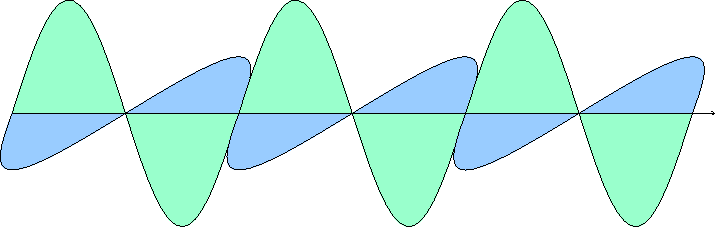
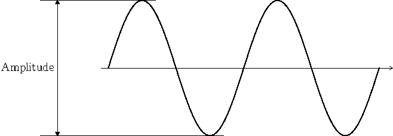
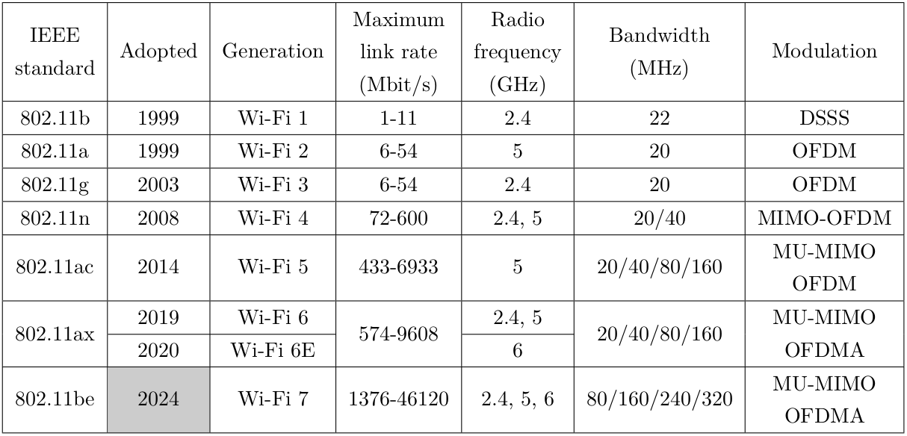
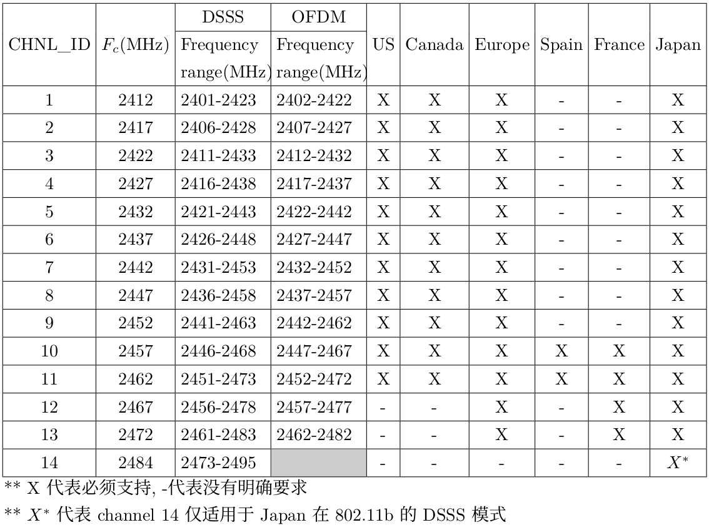
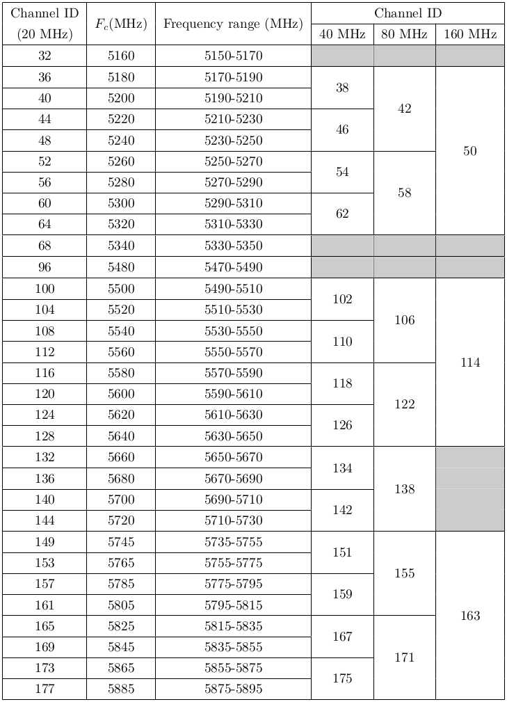
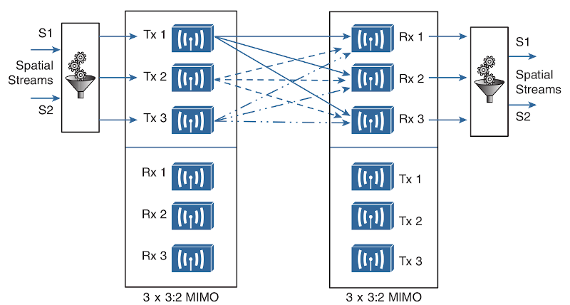

#### Wireless LAN(无线局域网)
__WLAN__ 
由电磁波进行信号传输的网络
 
 

图1 
 
如图1, 是电磁波在一个点方向上的电磁波传导(电和磁在互相垂直的平面上), 而电磁波在三维空间上, 犹如球体中心向所有方向发射电磁波
 
 
 

##### 名词解释:
__frequency__ 
1秒内经过的完整波形数量, 单位为hertz(Hz). 如图1, 为三个完整波形
 
 

__radio frequency__ 
3kHz到300GHz范围内的频率
 
 

__channel/bandwidth__ 
某个区间范围内的频率, 如: 2.401GHz-2.423GHz, 中心2.412GHz为channel, 2.423-2.401=22MHz为bandwidth
 
 

图2 
 
__wavelength__ 
波形的长度, frequency越高, wavelength越小. 如图2, $\lambda$就是波形长度
 
 

图3 
 
__Amplitude__ 
波形的振幅, 使用watts(W)为测量单位, WLAN的振幅范围为[1mW, 100mW], 振幅如图3
 
 

__decibel(dB)__ 
使用logarithm比较两个波形振幅的相对关系, 表达式如下:
$$dB=10(\log_{10}P2-\log_{10}P1)$$
可化简为以下形式:
$$dB=10\log_{10}(\frac{P2}{P1})$$
 

常见$y=\log_{10}x$参考表
|x    |y     |
|---  |---   |
|1    |0     |
|2    |0.3|
|3    |0.48|
|5|0.7|
|7|0.85|
|10|1|

 
 

__dBm(dB milliwatt)__ 
发送端或接收端振幅相对于1mW的相对值. 表达式如下:
$$dBm=10\log_{10}(\frac{P2}{1mW})$$
 
 

__dBi(dB isotropic)__ 
天线的增益dB. 其中dBd(dB dipole)为包含特定增益的天线, 为2.14dBi
 
 

__EIRP(effective isotropic radiated power)__ 
天线辐射出的有效振幅. 计算规则示例: 10dBm(transmitter) - 5dB(cable) + 8dBi(antenna) = 13dBm
 
 

__FSPL(Free Space Path Loss)__ 
电磁波在空间中传播时的损失. 公式如下:
$$FSPL(dB)=20\log_{10}(d)+20\log_{10}(f)+32.44$$
其中, d为发送端到接收端的空间距离, 单位为km; f为电磁波的频率, 单位为MHz
 
 

__RSSI(Received signal strength indicator)__(br)
接收者的信号强度, 802.11使用1 byte进行标记, 范围为[0,255]
 
 

__sensitivity level__(br)
接收者的敏感值, 单位为dBm, 为一个特定值, 当值高于该敏感值时, 接收者可接受该信号
 
 

__noise floor__ 
与期望信号同频率的其他信号视为噪音(noise), 噪音强度的均值为noise floor
 
 

__SNR(signal-to-noise ratio)__ 
期望信号与噪音的比率, 单位为dB
 
 

图4 
 
__IEEE standard amendment__ 
IEEE标准修正, 列表如图4
 
 

图5 
 
__2.4 GHz__ 
频率在2.4 GHz频率附近(略高于2.4 GHz)的几个频率段. 如图5
 
 

图6 
 
__5 GHz__ 
频率在5 GHz频率附近(略高于5 GHz)的几个频率段. 如图6
 
 

__SISO(single in, single out)__ 
在802.11 b/a/g标准修订中, 使用一个radio chain, 即只有一个transmitter和一个receiver进行无线电收发
 
 

__MIMO(multiple in, multiple out)__ 
在802.11 n/ac/ax标准修订中, 使用多个radio chain, 即包含多个transmitter和多个receiver进行无线电收发 
使用TxR表示, T为transmitter数量, R为receiver数量
 
 

__spatial multiplexing__ 
当transmitter发送信息到同一个receiver时, 为了提升传输速度, 将该信息分发到多个radio chain(所有radio chain使用同一个channel, 但包含空间差异)
 
 

图7 
 
__spatial stream__ 
设备用于用于进行消息处理的队列. 与MIMO合并表示方法: TxR:<spatial_stream>. 如图7 
当transmitter与receiver的spatial stream数量不一致时, 会进行协议, 使用spatial stream数量最少一方的量(transmitter可额外多使用一个spatial stream)
 
 

__transmit beamforming__ 
在802.11 n/ac/ax标准修订中, 通过使MIMO之间的某个transmitter的多个信号到达同一个receiver的phase一致, 提升transmitter到特定receiver的SNR(信噪比)
 
 

__DRS(dynamic rate shifting)__ 
根据receiver到transmitter的距离, 自动调整信号调制类型的复杂度. 当距离越近时, 使用更复杂的信号调制类型, 拥有更高的信噪比, 获得更多有效数据(即更高数据传输速度) 
DRS没有定义在802.11标准中, 所有不同厂商包含不同实现方式和名称. 其他名称: link adaptation/adaptive modulation and coding(AMC)/rate adaptation
 
 

#### IEEE文档下载
1.从以下地址查找IEEE文档, 找出DOI编号 
https://ieeexplore.ieee.org/Xplore/home.jsp
 

2.使用DOI编号, 在sci hub查找文档下载 
https://sci-hub.se/
 
 
 

引用: 
[1] wikipedia: https://en.wikipedia.org/wiki/List_of_WLAN_channels
 

[2] wikipedia: https://en.wikipedia.org/wiki/IEEE_802.11
