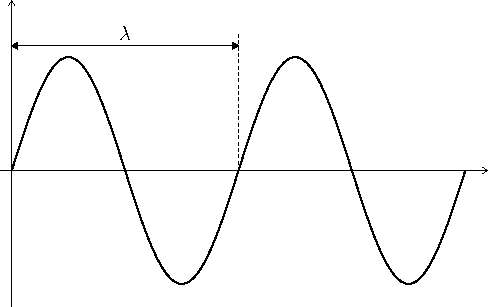

#### Wireless LAN(无线局域网)
__WLAN__ 
由电磁波进行信号传输的网络
 
 

图1 
 
如图1, 是电磁波在一个点方向上的电磁波传导(电和磁在互相垂直的平面上), 而电磁波在三维空间上, 犹如球体中心向所有方向发射电磁波
 
 
 

##### 名词解释:
__frequency__ 
1秒内经过的完整波形数量, 单位为hertz(Hz). 如图1, 为三个完整波形
 
 

__radio frequency__ 
3kHz到300GHz范围内的频率
 
 

__channel/bandwidth__ 
某个区间范围内的频率, 如: 2.401GHz-2.423GHz, 中心2.412GHz为channel, 2.423-2.401=22MHz为bandwidth
 
 

图2 
 
__wavelength__ 
波形的长度, frequency越高, wavelength越小. 如图2, $\lambda$就是波形长度
 
 

图3 
 
__Amplitude__ 
波形的振幅, 使用watts(W)为测量单位, WLAN的振幅范围为[1mW, 100mW], 振幅如图3
 
 

__decibel(dB)__ 
使用logarithm比较两个波形振幅的相对关系, 表达式如下:
$$dB=10(\log_{10}P2-\log_{10}P1)$$
可化简为以下形式:
$$dB=10\log_{10}(\frac{P2}{P1})$$
 

常见$y=\log_{10}x$参考表
|x    |y     |
|---  |---   |
|1    |0     |
|2    |0.3|
|3    |0.48|
|5|0.7|
|7|0.85|
|10|1|

 
 

__dBm(dB milliwatt)__ 
发送端或接收端振幅相对于1mW的相对值. 表达式如下:
$$dBm=10\log_{10}(\frac{P2}{1mW})$$
 
 

__dBi(dB isotropic)__ 
天线的增益dB. 其中dBd(dB dipole)为包含特定增益的天线, 为2.14dBi
 
 

__EIRP(effective isotropic radiated power)__ 
天线辐射出的有效振幅. 计算规则示例: 10dBm(transmitter) - 5dB(cable) + 8dBi(antenna) = 13dBm
 
 

__FSPL(Free Space Path Loss)__ 
电磁波在空间中传播时的损失. 公式如下:
$$FSPL(dB)=20\log_{10}(d)+20\log_{10}(f)+32.44$$
其中, d为发送端到接收端的空间距离, 单位为km; f为电磁波的频率, 单位为MHz
 
 

图4 
 
 
 

图5 
 
 
 

图6 
 
 
 
