MPLS(Multi-Protocol Label Switching)<br>
使用Label交换技术的路由器, 依赖于动态路由协议或静态配置路由<br>
每个路由器针对特定的路由, 有唯一的一个label值<br>
每个路由器需要开启Cisco Express Forwarding (CEF)
<br>
<br>

##### 名词解析
LSR(Label Switch Router)<br>
使用MPLS进行label交换的路由器. 具体细分为以下类别:<br>
&emsp;&emsp;normal LSR - 位于MPLS非边缘, 在入口删除incoming label, 在出口添加outgoing label<br>
&emsp;&emsp;edge-LSR - 位于MPLS边缘的路由器, ingress LSR在MPLS domain入口处添加label; egress LSR在MPLS domain出口处删除label
<br>
    
LSP(Label Switched Path)<br>
到达目标, 所通过的LSR路径
<br>

LDP(Label Distribution Protocol)<br>
绑定label和子网地址的动态协议. 对应于IP route的Dynamic Routing Protocol
<br>

LIB(Label Information Base)<br>
保存label与发送该label的neighbor值对. 对应于IP route的RIB(Route Information Base)
<br>

LFIB(Label Forwarding Information Base)<br>
实际转发时的参照表. 对应于IP route的FIB(Forwarding Information Base)
<br>

图1 - MPLS node结构图<br>
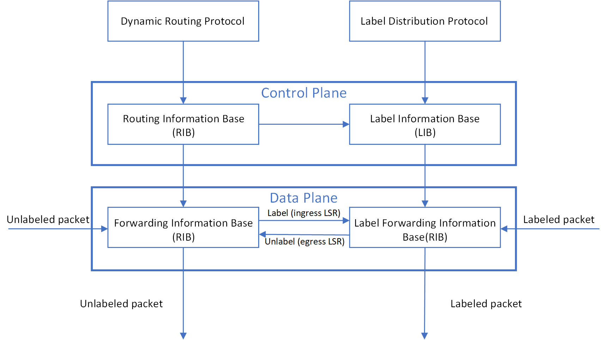
<br>
<br>

图2 - MPLS Label在package中的位置<br>

<br>
<br>

图3 - MPLS Label的结构<br>
<br>
**MPLS Label字段解析:**<br>
Label number - 20 bits, 用于对指定network进行label<br>
QoS - 3 bits, quality of service<br>
Bottom-of-Stack - 1 bit, 当前Label是否位于Label stack的最底层(即紧邻Layer 3)<br>
TTL - 8 bits, 与IP packet的TTL字段一致, 用于阻止loop
<br>
<br>

MPLS(unicast)在不同类型帧的Type字段值<br>
Ethernet - 0x8847<br>
HDLC - 0x8847<br>
PPP - 0x0281
<br>
<br>

LDP使用224.0.0.2 multicast地址发送Hello packet, 并且src/dst port都为UDP 646端口<br>
LDP neighbor session使用TCP 646端口为目标端口<br>
<br>

配置MPLS(此时启动LDP, 并且需先启动CEF):<br>
1)在接口直接配置MPLS<br>
`(config)# ip cef`<br>
`(config-if)# mpls ip`
<br>

2)在router subcommand中配置MPLS(加入该路由协议的接口都自动配置MPLS, loopback接口不参与自动配置)<br>
`(config)# ip cef`<br>
`(config-router)# mpls ldp autoconfig`
<br>
<br>

示例1
```
R2# debug mpls ldp transport events

R2(config)# int f0/1

R2(config-if)# mpls ip
*Apr  7 01:27:37.767: ldp: enabling ldp on FastEthernet0/1


R2# show ip ospf int brief
Interface    PID   Area            IP Address/Mask    Cost  State Nbrs F/C
Lo0          1     0               2.2.2.2/32         1     LOOP  0/0
Fa0/1        1     0               172.16.20.2/24     1     BDR   1/1
Fa0/0        1     0               172.16.10.2/24     1     DR    1/1

R2# debug mpls ldp transport events

R2(config)# router ospf 1

R2(config-router)# mpls ldp autoconfig 
*Apr  7 01:35:32.027: ldp: enabling ldp on FastEthernet0/1
```
<br>
<br>

指定Label分配的范围值:<br>
`(config)# mpls label range <minimum_value> <maximum_value>`
<br>
<br>

LDP identifier:<br>
1)手动配置:<br>
`(config)# mpls ldp router-id <interface> [force]`
<br>

2)最大的loopback接口IP值<br>

3)最大的物理接口IP值
<br>
<br>

配置针对peer隐藏label:<br>
`(config)# mpls ldp advertise-labels for <network_acl> to <peer_acl>`<br>
** 对peer_acl中deny指定的下游peer, 隐藏network_acl中permit指定的网络, 隐藏其label(如示例2)<br>
** ACL只能使用standard ACL, 并且number范围为[1,99]
<br>
<br>

显示mpls特征/参数<br>
`# show mpls ldp parameters`
<br>
<br>

显示加入mpls的接口<br>
`# show mpls interfaces [<interface>] [details]`
<br>
<br>

显示mpls邻居<br>
`# show mpls ldp neighbor`<br>
** State: Oper代表established session
<br>
<br>

显示mpls discovery<br>
`# show mpls ldp discovery`
<br>
<br>

显示LIB(Label Information Base)信息<br>
`# show mpls ldp bindings [<subnet_id> {<netmask> | <mask_length>}]`
<br>
<br>

显示LFIB信息<br>
`# show mpls forwarding-table`
<br>
<br>

图4 - Frame-base MPLS<br>
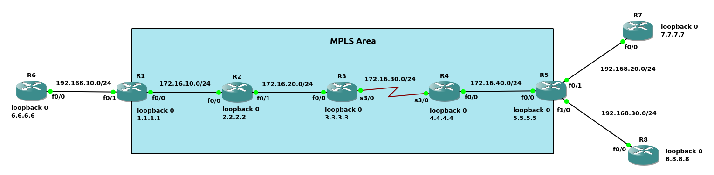
<br>
<br>

图5 - Label转发<br>
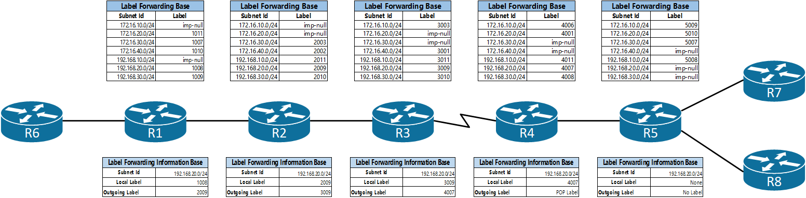
<br>
<br>

示例2(如图4)
```
配置OSPF
R1(config)# router ospf 1
R1(config-router)# network 172.16.10.0 0.0.0.255 area 0
R1(config-router)# network 192.168.10.0 0.0.0.255 area 0
R1(config-router)# network 1.1.1.1 0.0.0.0 area 0

R2(config)# router ospf 1
R2(config-router)# network 172.16.0.0 0.0.255.255 area 0
R2(config-router)# network 2.2.2.2 0.0.0.0 area 0

R3(config)# router ospf 1
R3(config-router)# network 172.16.0.0 0.0.255.255 area 0
R3(config-router)# network 3.3.3.3 0.0.0.0 area 0

R4(config)# router ospf 1
R4(config-router)# network 172.16.0.0 0.0.255.255 area 0
R4(config-router)# network 4.4.4.4 0.0.0.0 area 0

R5(config)# router ospf 1
R5(config-router)# network 172.16.40.0 0.0.0.255 area 0
R5(config-router)# network 192.168.0.0 0.0.255.255 area 0
R5(config-router)# network 5.5.5.5 0.0.0.0 area 0

R6(config)# router ospf 1
R6(config-router)# network 192.168.10.0 0.0.0.255 area 0
R6(config-router)# network 6.6.6.6 0.0.0.0 area 0

R7(config)# router ospf 1
R7(config-router)# network 192.168.20.0 0.0.0.255 area 0
R7(config-router)# network 7.7.7.7 0.0.0.0 area 0

R8(config)# router ospf 1
R8(config-router)# network 192.168.30.0 0.0.0.255 area 0
R8(config-router)# network 8.8.8.8 0.0.0.0 area 0


配置MPLS(接口必须启用CEF, 默认开启)
R1(config)# int f0/0
R1(config-if)# mpls ip

R2(config)# int f0/0
R2(config-if)# mpls ip
R2(config-if)# int f0/1
R2(config-if)# mpls ip

R3(config)# int f0/0
R3(config-if)# mpls ip
R3(config-if)# int s3/0
R3(config-if)# mpls ip

R4(config)# int s3/0
R4(config-if)# mpls ip
R4(config-if)# int f0/0
R4(config-if)# mpls ip

R5(config)# int f0/0
R5(config-if)# mpls ip


查看接口是否开启CEF
R3# show cef interface f0/0 | include IP CEF
  IP CEF switching enabled
  IP CEF switching turbo vector
  IP CEF turbo switching turbo vector


查看开启MPLS的接口
R3# show mpls interfaces 
Interface              IP            Tunnel   BGP Static Operational
FastEthernet0/0        Yes (ldp)     No       No  No     Yes        
Serial3/0              Yes (ldp)     No       No  No     Yes   


查看MPLS neighbor信息
R3# show mpls ldp neighbor 
    Peer LDP Ident: 2.2.2.2:0; Local LDP Ident 3.3.3.3:0
	TCP connection: 2.2.2.2.646 - 3.3.3.3.47092
	State: Oper; Msgs sent/rcvd: 22/22; Downstream
	Up time: 00:03:52
	LDP discovery sources:
	  FastEthernet0/0, Src IP addr: 172.16.20.2
        Addresses bound to peer LDP Ident:
          172.16.10.2     172.16.20.2     2.2.2.2         
    Peer LDP Ident: 4.4.4.4:0; Local LDP Ident 3.3.3.3:0
	TCP connection: 4.4.4.4.46458 - 3.3.3.3.646
	State: Oper; Msgs sent/rcvd: 21/21; Downstream
	Up time: 00:03:30
	LDP discovery sources:
	  Serial3/0, Src IP addr: 172.16.30.4
        Addresses bound to peer LDP Ident:
          172.16.40.4     172.16.30.4     4.4.4.4 


查看LIB
R3# show mpls ldp bindings 192.168.20.0 24
  lib entry: 192.168.20.0/24, rev 28
	local binding:  label: 26
	remote binding: lsr: 2.2.2.2:0, label: 26
	remote binding: lsr: 4.4.4.4:0, label: 26


查看LFIB
R3# show mpls forwarding-table
Local      Outgoing   Prefix           Bytes Label   Outgoing   Next Hop    
Label      Label      or Tunnel Id     Switched      interface              
16         16         1.1.1.1/32       0             Fa0/0      172.16.10.2 
17         Pop Label  2.2.2.2evolve/32       0             Fa0/0      172.16.10.2 
18         Pop Label  4.4.4.4/32       0             Fa0/1      192.168.10.4
19         19         5.5.5.5/32       0             Fa0/1      192.168.10.4
20         20         6.6.6.6/32       0             Fa0/1      192.168.10.4
21         Pop Label  10.10.20.0/24    1710          Fa0/0      172.16.10.2 
22         Pop Label  10.10.30.0/24    570           Fa0/1      192.168.10.4
23         Pop Label  10.10.40.0/24    1140          Fa0/1      192.168.10.4


调整LSR的Label范围
R1(config)# mpls label range 1000 2000
R1# copy run start

R2(config)# mpls label range 2000 3000
R1# copy run start

R3(config)# mpls label range 3000 4000
R1# copy run start

R4(config)# mpls label range 4000 5000
R1# copy run start

R5(config)# mpls label range 5000 6000
R1# copy run start

重启路由器R1/R2/R3/R4/R5


查看LIB
R1# show mpls ldp bindings | begin 24
  lib entry: 172.16.10.0/24, rev 4
	local binding:  label: imp-null
	remote binding: lsr: 2.2.2.2:0, label: imp-null
  lib entry: 172.16.20.0/24, rev 30
	local binding:  label: 1011
	remote binding: lsr: 2.2.2.2:0, label: imp-null
  lib entry: 172.16.30.0/24, rev 22
	local binding:  label: 1007
	remote binding: lsr: 2.2.2.2:0, label: 2003
  lib entry: 172.16.40.0/24, rev 28
	local binding:  label: 1010
	remote binding: lsr: 2.2.2.2:0, label: 2002
  lib entry: 192.168.10.0/24, rev 6
	local binding:  label: imp-null
	remote binding: lsr: 2.2.2.2:0, label: 2011
  lib entry: 192.168.20.0/24, rev 24
	local binding:  label: 1008
	remote binding: lsr: 2.2.2.2:0, label: 2009
  lib entry: 192.168.30.0/24, rev 26
	local binding:  label: 1009
	remote binding: lsr: 2.2.2.2:0, label: 2010


R4# show mpls ldp bindings | begin 24  
  lib entry: 172.16.10.0/24, rev 20
	local binding:  label: 4006
	remote binding: lsr: 3.3.3.3:0, label: 3003
	remote binding: lsr: 5.5.5.5:0, label: 5009
  lib entry: 172.16.20.0/24, rev 10
	local binding:  label: 4001
	remote binding: lsr: 3.3.3.3:0, label: imp-null
	remote binding: lsr: 5.5.5.5:0, label: 5010
  lib entry: 172.16.30.0/24, rev 6
	local binding:  label: imp-null
	remote binding: lsr: 3.3.3.3:0, label: imp-null
	remote binding: lsr: 5.5.5.5:0, label: 5007
  lib entry: 172.16.40.0/24, rev 4
	local binding:  label: imp-null
	remote binding: lsr: 3.3.3.3:0, label: 3001
	remote binding: lsr: 5.5.5.5:0, label: imp-null
  lib entry: 192.168.10.0/24, rev 30
	local binding:  label: 4011
	remote binding: lsr: 5.5.5.5:0, label: 5008
	remote binding: lsr: 3.3.3.3:0, label: 3011
  lib entry: 192.168.20.0/24, rev 22
	local binding:  label: 4007
	remote binding: lsr: 5.5.5.5:0, label: imp-null
        remote binding: lsr: 3.3.3.3:0, label: 3009
  lib entry: 192.168.30.0/24, rev 24
        local binding:  label: 4008
        remote binding: lsr: 5.5.5.5:0, label: imp-null
        remote binding: lsr: 3.3.3.3:0, label: 3010


查看LFIB
R1# show mpls forwarding-table 192.168.20.0 24
Local      Outgoing   Prefix           Bytes Label   Outgoing   Next Hop    
Label      Label      or Tunnel Id     Switched      interface              
1008       2009       192.168.20.0/24  0             Fa0/0      172.16.10.2

R2# show mpls forwarding-table 192.168.20.0 24
Local      Outgoing   Prefix           Bytes Label   Outgoing   Next Hop    
Label      Label      or Tunnel Id     Switched      interface              
2009       3009       192.168.20.0/24  0             Fa0/1      172.16.20.3

R3# show mpls forwarding-table 192.168.20.0 24
Local      Outgoing   Prefix           Bytes Label   Outgoing   Next Hop    
Label      Label      or Tunnel Id     Switched      interface              
3009       4007       192.168.20.0/24  0             Se3/0      point2point

R4# show mpls forwarding-table 192.168.20.0 24
Local      Outgoing   Prefix           Bytes Label   Outgoing   Next Hop    
Label      Label      or Tunnel Id     Switched      interface              
4007       Pop Label  192.168.20.0/24  0             Fa0/0      172.16.40.5 

R5# show mpls forwarding-table 192.168.20.0 24
Local      Outgoing   Prefix           Bytes Label   Outgoing   Next Hop    
Label      Label      or Tunnel Id     Switched      interface              
None       No Label   192.168.20.0/24  0             punt    


解析(参考图5):
1.针对特定network prefix, 当前LSR出口处的Label为下一跳LSR的Label

2.LSR对connected network不进行Label操作, 并且传递imp-null(LDP默认使用Label 3, Label 0-15为保留Label)给其他LSR(Penultimate Hop Popping特性, Cisco默认使用该特性)

3.Penultimate Hop Popping
如果不使用该特性, egress LSR执行pop label(Label lookup, LFIB操作)后, 再进行IP网络的下一跳匹配(Layer 3 lookup, FIB操作)
使用该特性, 在egress LSR的Upstream LSR进行pop label, 因此在egress LSR只进行Layer 3 lookup
```
<br>
<br>

图6<br>
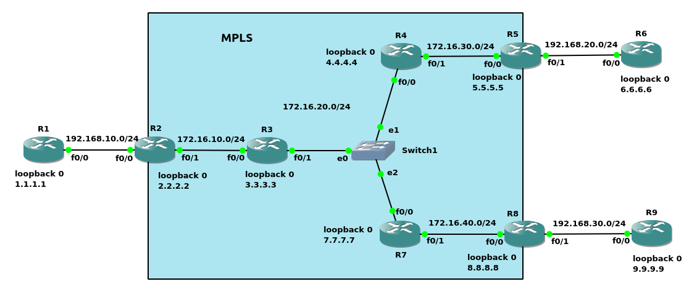<br>

示例3(如图6)
```
配置OSPF
R1(config)# router ospf 1
R1(config-router)# network 192.168.10.0 0.0.0.255 area 0
R1(config-router)# network 1.1.1.1 0.0.0.0 area 0

R2(config)# router ospf 1
R2(config-router)# network 192.168.10.0 0.0.0.255 area 0
R2(config-router)# network 172.16.10.0 0.0.0.255 area 0
R2(config-router)# network 2.2.2.2 0.0.0.0 area 0

R3(config)# router ospf 1
R3(config-router)# network 172.16.0.0 0.0.255.255 area 0
R3(config-router)# network 3.3.3.3 0.0.0.0 area 0

R4(config)# router ospf 1
R4(config-router)# network 172.16.0.0 0.0.255.255 area 0
R4(config-router)# network 4.4.4.4 0.0.0.0 area 0

R5(config)# router ospf 1
R5(config-router)# network 172.16.30.0 0.0.0.255 area 0
R5(config-router)# network 192.168.20.0 0.0.0.255 area 0
R5(config-router)# network 5.5.5.5 0.0.0.0 area 0

R6(config)# router ospf 1
R6(config-router)# network 192.168.20.0 0.0.0.255 area 0
R6(config-router)# network 6.6.6.6 0.0.0.0 area 0

R7(config)# router ospf 1
R7(config-router)# network 172.16.0.0 0.0.255.255 area 0
R7(config-router)# network 7.7.7.7 0.0.0.0 area 0

R8(config)# router ospf 1
R8(config-router)# network 172.16.40.0 0.0.0.255 area 0
R8(config-router)# network 192.168.30.0 0.0.0.255 area 0
R8(config-router)# network 8.8.8.8 0.0.0.0 area 0

R9(config)# router ospf 1
R9(config-router)# network 192.168.30.0 0.0.0.255 area 0
R9(config-router)# network 9.9.9.9 0.0.0.0 area 0


配置MPLS
R2(config)# int f0/1
R2(config-if)# mpls ip

R3(config)# int f0/0
R3(config-if)# mpls ip
R3(config-if)# int f0/1
R3(config-if)# mpls ip

R4(config)# int f0/0
R4(config-if)# mpls ip
R4(config-if)# int f0/1
R4(config-if)# mpls ip

R5(config)# int f0/0
R5(config-if)# mpls ip

R7(config)# int f0/0
R7(config-if)# mpls ip
R7(config-if)# int f0/1
R7(config-if)# mpls ip

R8(config)# int f0/0
R8(config-if)# mpls ip


R3# show mpls ldp bindings           
  lib entry: 1.1.1.1/32, rev 2
	local binding:  label: 16
	remote binding: lsr: 2.2.2.2:0, label: 16
	remote binding: lsr: 4.4.4.4:0, label: 16
	remote binding: lsr: 7.7.7.7:0, label: 16
  lib entry: 2.2.2.2/32, rev 4
	local binding:  label: 17
	remote binding: lsr: 2.2.2.2:0, label: imp-null
	remote binding: lsr: 4.4.4.4:0, label: 17
	remote binding: lsr: 7.7.7.7:0, label: 17
  lib entry: 3.3.3.3/32, rev 6
	local binding:  label: imp-null
	remote binding: lsr: 2.2.2.2:0, label: 17
	remote binding: lsr: 4.4.4.4:0, label: 18
	remote binding: lsr: 7.7.7.7:0, label: 18
  lib entry: 4.4.4.4/32, rev 8
	local binding:  label: 18
	remote binding: lsr: 2.2.2.2:0, label: 18
	remote binding: lsr: 4.4.4.4:0, label: imp-null
	remote binding: lsr: 7.7.7.7:0, label: 19
  lib entry: 5.5.5.5/32, rev 10
	local binding:  label: 19
	remote binding: lsr: 2.2.2.2:0, label: 19
        remote binding: lsr: 4.4.4.4:0, label: 19
        remote binding: lsr: 7.7.7.7:0, label: 20
  lib entry: 6.6.6.6/32, rev 12
        local binding:  label: 20
        remote binding: lsr: 2.2.2.2:0, label: 20
        remote binding: lsr: 4.4.4.4:0, label: 20
        remote binding: lsr: 7.7.7.7:0, label: 21
  lib entry: 7.7.7.7/32, rev 14
        local binding:  label: 21
        remote binding: lsr: 2.2.2.2:0, label: 21
        remote binding: lsr: 4.4.4.4:0, label: 21
        remote binding: lsr: 7.7.7.7:0, label: imp-null
  lib entry: 8.8.8.8/32, rev 16
        local binding:  label: 22
        remote binding: lsr: 2.2.2.2:0, label: 22
        remote binding: lsr: 4.4.4.4:0, label: 22
        remote binding: lsr: 7.7.7.7:0, label: 22
  lib entry: 9.9.9.9/32, rev 18
        local binding:  label: 23
        remote binding: lsr: 2.2.2.2:0, label: 23
        remote binding: lsr: 4.4.4.4:0, label: 23
        remote binding: lsr: 7.7.7.7:0, label: 23
  lib entry: 172.16.10.0/24, rev 20
        local binding:  label: imp-null
        remote binding: lsr: 2.2.2.2:0, label: imp-null
        remote binding: lsr: 4.4.4.4:0, label: 24
        remote binding: lsr: 7.7.7.7:0, label: 24
  lib entry: 172.16.20.0/24, rev 22
        local binding:  label: imp-null
        remote binding: lsr: 2.2.2.2:0, label: 24
        remote binding: lsr: 4.4.4.4:0, label: imp-null
        remote binding: lsr: 7.7.7.7:0, label: imp-null
  lib entry: 172.16.30.0/24, rev 24
        local binding:  label: 24
        remote binding: lsr: 2.2.2.2:0, label: 25
        remote binding: lsr: 7.7.7.7:0, label: 25
        remote binding: lsr: 4.4.4.4:0, label: imp-null
  lib entry: 172.16.40.0/24, rev 26
        local binding:  label: 25
        remote binding: lsr: 2.2.2.2:0, label: 26
        remote binding: lsr: 4.4.4.4:0, label: 25
        remote binding: lsr: 7.7.7.7:0, label: imp-null
  lib entry: 192.168.10.0/24, rev 28
        local binding:  label: 26
        remote binding: lsr: 2.2.2.2:0, label: imp-null
        remote binding: lsr: 4.4.4.4:0, label: 26
        remote binding: lsr: 7.7.7.7:0, label: 26
  lib entry: 192.168.20.0/24, rev 30
        local binding:  label: 27
        remote binding: lsr: 2.2.2.2:0, label: 27
        remote binding: lsr: 4.4.4.4:0, label: 27
        remote binding: lsr: 7.7.7.7:0, label: 27
  lib entry: 192.168.30.0/24, rev 32
        local binding:  label: 28
        remote binding: lsr: 2.2.2.2:0, label: 28
        remote binding: lsr: 4.4.4.4:0, label: 28
        remote binding: lsr: 7.7.7.7:0, label: 28


R7# show mpls ldp bindings           
  lib entry: 1.1.1.1/32, rev 2
	local binding:  label: 16
	remote binding: lsr: 8.8.8.8:0, label: 16
	remote binding: lsr: 3.3.3.3:0, label: 16
	remote binding: lsr: 4.4.4.4:0, label: 16
  lib entry: 2.2.2.2/32, rev 4
	local binding:  label: 17
	remote binding: lsr: 8.8.8.8:0, label: 17
	remote binding: lsr: 3.3.3.3:0, label: 17
	remote binding: lsr: 4.4.4.4:0, label: 17
  lib entry: 3.3.3.3/32, rev 6
	local binding:  label: 18
	remote binding: lsr: 8.8.8.8:0, label: 18
	remote binding: lsr: 3.3.3.3:0, label: imp-null
	remote binding: lsr: 4.4.4.4:0, label: 18
  lib entry: 4.4.4.4/32, rev 8
	local binding:  label: 19
	remote binding: lsr: 8.8.8.8:0, label: 19
	remote binding: lsr: 3.3.3.3:0, label: 18
	remote binding: lsr: 4.4.4.4:0, label: imp-null
  lib entry: 5.5.5.5/32, rev 10
	local binding:  label: 20
	remote binding: lsr: 8.8.8.8:0, label: 20
        remote binding: lsr: 3.3.3.3:0, label: 19
        remote binding: lsr: 4.4.4.4:0, label: 19
  lib entry: 6.6.6.6/32, rev 12
        local binding:  label: 21
        remote binding: lsr: 8.8.8.8:0, label: 21
        remote binding: lsr: 3.3.3.3:0, label: 20
        remote binding: lsr: 4.4.4.4:0, label: 20
  lib entry: 7.7.7.7/32, rev 14
        local binding:  label: imp-null
        remote binding: lsr: 8.8.8.8:0, label: 22
        remote binding: lsr: 3.3.3.3:0, label: 21
        remote binding: lsr: 4.4.4.4:0, label: 21
  lib entry: 8.8.8.8/32, rev 16
        local binding:  label: 22
        remote binding: lsr: 8.8.8.8:0, label: imp-null
        remote binding: lsr: 3.3.3.3:0, label: 22
        remote binding: lsr: 4.4.4.4:0, label: 22
  lib entry: 9.9.9.9/32, rev 18
        local binding:  label: 23
        remote binding: lsr: 8.8.8.8:0, label: 23
        remote binding: lsr: 3.3.3.3:0, label: 23
        remote binding: lsr: 4.4.4.4:0, label: 23
  lib entry: 172.16.10.0/24, rev 20
        local binding:  label: 24
        remote binding: lsr: 8.8.8.8:0, label: 24
        remote binding: lsr: 3.3.3.3:0, label: imp-null
        remote binding: lsr: 4.4.4.4:0, label: 24
  lib entry: 172.16.20.0/24, rev 22
        local binding:  label: imp-null
        remote binding: lsr: 8.8.8.8:0, label: 25
        remote binding: lsr: 3.3.3.3:0, label: imp-null
        remote binding: lsr: 4.4.4.4:0, label: imp-null
  lib entry: 172.16.30.0/24, rev 24
        local binding:  label: 25
        remote binding: lsr: 8.8.8.8:0, label: 26
        remote binding: lsr: 3.3.3.3:0, label: 24
        remote binding: lsr: 4.4.4.4:0, label: imp-null
  lib entry: 172.16.40.0/24, rev 26
        local binding:  label: imp-null
        remote binding: lsr: 8.8.8.8:0, label: imp-null
        remote binding: lsr: 3.3.3.3:0, label: 25
        remote binding: lsr: 4.4.4.4:0, label: 25
  lib entry: 192.168.10.0/24, rev 28
        local binding:  label: 26
        remote binding: lsr: 8.8.8.8:0, label: 27
        remote binding: lsr: 3.3.3.3:0, label: 26
        remote binding: lsr: 4.4.4.4:0, label: 26
  lib entry: 192.168.20.0/24, rev 30
        local binding:  label: 27
        remote binding: lsr: 8.8.8.8:0, label: 28
        remote binding: lsr: 3.3.3.3:0, label: 27
        remote binding: lsr: 4.4.4.4:0, label: 27
  lib entry: 192.168.30.0/24, rev 32
        local binding:  label: 28
        remote binding: lsr: 8.8.8.8:0, label: imp-null
        remote binding: lsr: 3.3.3.3:0, label: 28
        remote binding: lsr: 4.4.4.4:0, label: 28


R4(config)# ip access-list standard 1 
R4(config-std-nacl)# 10 permit 172.16.30.0 0.0.0.255
R4(config-std-nacl)# 20 permit 6.6.6.6 0.0.0.0
R4(config-std-nacl)# 30 deny any
R4(config-std-nacl)# ip access-list standard 2
R4(config-std-nacl)# 10 deny 7.7.7.7 0.0.0.0
R4(config-std-nacl)# 20 permit any
R4(config)# mpls ldp advertise-labels for 1 to 2


R3# show mpls ldp bindings
  lib entry: 1.1.1.1/32, rev 2
	local binding:  label: 16
	remote binding: lsr: 2.2.2.2:0, label: 16
	remote binding: lsr: 4.4.4.4:0, label: 16
	remote binding: lsr: 7.7.7.7:0, label: 16
  lib entry: 2.2.2.2/32, rev 4
	local binding:  label: 17
	remote binding: lsr: 2.2.2.2:0, label: imp-null
	remote binding: lsr: 4.4.4.4:0, label: 17
	remote binding: lsr: 7.7.7.7:0, label: 17
  lib entry: 3.3.3.3/32, rev 6
	local binding:  label: imp-null
	remote binding: lsr: 2.2.2.2:0, label: 17
	remote binding: lsr: 4.4.4.4:0, label: 18
	remote binding: lsr: 7.7.7.7:0, label: 18
  lib entry: 4.4.4.4/32, rev 8
	local binding:  label: 18
	remote binding: lsr: 2.2.2.2:0, label: 18
	remote binding: lsr: 4.4.4.4:0, label: imp-null
	remote binding: lsr: 7.7.7.7:0, label: 19
  lib entry: 5.5.5.5/32, rev 10
	local binding:  label: 19
	remote binding: lsr: 2.2.2.2:0, label: 19
        remote binding: lsr: 4.4.4.4:0, label: 19
        remote binding: lsr: 7.7.7.7:0, label: 20
  lib entry: 6.6.6.6/32, rev 12
        local binding:  label: 20
        remote binding: lsr: 2.2.2.2:0, label: 20
        remote binding: lsr: 4.4.4.4:0, label: 20
        remote binding: lsr: 7.7.7.7:0, label: 21
  lib entry: 7.7.7.7/32, rev 14
        local binding:  label: 21
        remote binding: lsr: 2.2.2.2:0, label: 21
        remote binding: lsr: 4.4.4.4:0, label: 21
        remote binding: lsr: 7.7.7.7:0, label: imp-null
  lib entry: 8.8.8.8/32, rev 16
        local binding:  label: 22
        remote binding: lsr: 2.2.2.2:0, label: 22
        remote binding: lsr: 4.4.4.4:0, label: 22
        remote binding: lsr: 7.7.7.7:0, label: 22
  lib entry: 9.9.9.9/32, rev 18
        local binding:  label: 23
        remote binding: lsr: 2.2.2.2:0, label: 23
        remote binding: lsr: 4.4.4.4:0, label: 23
        remote binding: lsr: 7.7.7.7:0, label: 23
  lib entry: 172.16.10.0/24, rev 20
        local binding:  label: imp-null
        remote binding: lsr: 2.2.2.2:0, label: imp-null
        remote binding: lsr: 4.4.4.4:0, label: 24
        remote binding: lsr: 7.7.7.7:0, label: 24
  lib entry: 172.16.20.0/24, rev 22
        local binding:  label: imp-null
        remote binding: lsr: 2.2.2.2:0, label: 24
        remote binding: lsr: 4.4.4.4:0, label: imp-null
        remote binding: lsr: 7.7.7.7:0, label: imp-null
  lib entry: 172.16.30.0/24, rev 24
        local binding:  label: 24
        remote binding: lsr: 2.2.2.2:0, label: 25
        remote binding: lsr: 7.7.7.7:0, label: 25
        remote binding: lsr: 4.4.4.4:0, label: imp-null
  lib entry: 172.16.40.0/24, rev 26
        local binding:  label: 25
        remote binding: lsr: 2.2.2.2:0, label: 26
        remote binding: lsr: 4.4.4.4:0, label: 25
        remote binding: lsr: 7.7.7.7:0, label: imp-null
  lib entry: 192.168.10.0/24, rev 28
        local binding:  label: 26
        remote binding: lsr: 2.2.2.2:0, label: imp-null
        remote binding: lsr: 4.4.4.4:0, label: 26
        remote binding: lsr: 7.7.7.7:0, label: 26
  lib entry: 192.168.20.0/24, rev 30
        local binding:  label: 27
        remote binding: lsr: 2.2.2.2:0, label: 27
        remote binding: lsr: 4.4.4.4:0, label: 27
        remote binding: lsr: 7.7.7.7:0, label: 27
  lib entry: 192.168.30.0/24, rev 32
        local binding:  label: 28
        remote binding: lsr: 2.2.2.2:0, label: 28
        remote binding: lsr: 4.4.4.4:0, label: 28
        remote binding: lsr: 7.7.7.7:0, label: 28


R7# show mpls ldp bindings
  lib entry: 1.1.1.1/32, rev 2
	local binding:  label: 16
	remote binding: lsr: 8.8.8.8:0, label: 16
	remote binding: lsr: 3.3.3.3:0, label: 16
	remote binding: lsr: 4.4.4.4:0, label: 16
  lib entry: 2.2.2.2/32, rev 4
	local binding:  label: 17
	remote binding: lsr: 8.8.8.8:0, label: 17
	remote binding: lsr: 3.3.3.3:0, label: 17
	remote binding: lsr: 4.4.4.4:0, label: 17
  lib entry: 3.3.3.3/32, rev 6
	local binding:  label: 18
	remote binding: lsr: 8.8.8.8:0, label: 18
	remote binding: lsr: 3.3.3.3:0, label: imp-null
	remote binding: lsr: 4.4.4.4:0, label: 18
  lib entry: 4.4.4.4/32, rev 8
	local binding:  label: 19
	remote binding: lsr: 8.8.8.8:0, label: 19
	remote binding: lsr: 3.3.3.3:0, label: 18
	remote binding: lsr: 4.4.4.4:0, label: imp-null
  lib entry: 5.5.5.5/32, rev 10
	local binding:  label: 20
	remote binding: lsr: 8.8.8.8:0, label: 20
        remote binding: lsr: 3.3.3.3:0, label: 19
        remote binding: lsr: 4.4.4.4:0, label: 19
  lib entry: 6.6.6.6/32, rev 12
        local binding:  label: 21
        remote binding: lsr: 8.8.8.8:0, label: 21
        remote binding: lsr: 3.3.3.3:0, label: 20
  lib entry: 7.7.7.7/32, rev 14
        local binding:  label: imp-null
        remote binding: lsr: 8.8.8.8:0, label: 22
        remote binding: lsr: 3.3.3.3:0, label: 21
        remote binding: lsr: 4.4.4.4:0, label: 21
  lib entry: 8.8.8.8/32, rev 16
        local binding:  label: 22
        remote binding: lsr: 8.8.8.8:0, label: imp-null
        remote binding: lsr: 3.3.3.3:0, label: 22
        remote binding: lsr: 4.4.4.4:0, label: 22
  lib entry: 9.9.9.9/32, rev 18
        local binding:  label: 23
        remote binding: lsr: 8.8.8.8:0, label: 23
        remote binding: lsr: 3.3.3.3:0, label: 23
        remote binding: lsr: 4.4.4.4:0, label: 23
  lib entry: 172.16.10.0/24, rev 20
        local binding:  label: 24
        remote binding: lsr: 8.8.8.8:0, label: 24
        remote binding: lsr: 3.3.3.3:0, label: imp-null
        remote binding: lsr: 4.4.4.4:0, label: 24
  lib entry: 172.16.20.0/24, rev 22
        local binding:  label: imp-null
        remote binding: lsr: 8.8.8.8:0, label: 25
        remote binding: lsr: 3.3.3.3:0, label: imp-null
        remote binding: lsr: 4.4.4.4:0, label: imp-null
  lib entry: 172.16.30.0/24, rev 24
        local binding:  label: 25
        remote binding: lsr: 8.8.8.8:0, label: 26
        remote binding: lsr: 3.3.3.3:0, label: 24
  lib entry: 172.16.40.0/24, rev 26
        local binding:  label: imp-null
        remote binding: lsr: 8.8.8.8:0, label: imp-null
        remote binding: lsr: 3.3.3.3:0, label: 25
        remote binding: lsr: 4.4.4.4:0, label: 25
  lib entry: 192.168.10.0/24, rev 28
        local binding:  label: 26
        remote binding: lsr: 8.8.8.8:0, label: 27
        remote binding: lsr: 3.3.3.3:0, label: 26
        remote binding: lsr: 4.4.4.4:0, label: 26
  lib entry: 192.168.20.0/24, rev 30
        local binding:  label: 27
        remote binding: lsr: 8.8.8.8:0, label: 28
        remote binding: lsr: 3.3.3.3:0, label: 27
        remote binding: lsr: 4.4.4.4:0, label: 27
  lib entry: 192.168.30.0/24, rev 32
        local binding:  label: 28
        remote binding: lsr: 8.8.8.8:0, label: imp-null
        remote binding: lsr: 3.3.3.3:0, label: 28
        remote binding: lsr: 4.4.4.4:0, label: 28
```
<br>
<br>

图7<br>
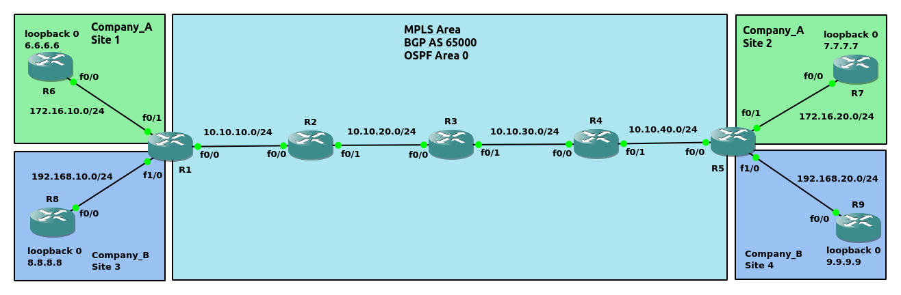<br>

** PE-to-CE可以使用的路由协议:<br>
1.static<br>

2.RIPv2<br>

3.EIGRP<br>

4.OSPF<br>

5.BGP
<br>
<br>

示例4 - 配置MPLS/VPN(PE-to-CE使用Static配置, 如图7)
```
配置OSPF
R1(config)# router ospf 1
R1(config-router)# network 10.10.10.0 0.0.0.255 area 0
R1(config-router)# network 1.1.1.1 0.0.0.0 area 0

R2(config)# router ospf 1
R2(config-router)# network 10.10.0.0 0.0.255.255 area 0
R2(config-router)# network 2.2.2.2 0.0.0.0 area 0

R3(config)# router ospf 1
R3(config-router)# network 10.10.0.0 0.0.255.255 area 0
R3(config-router)# network 3.3.3.3 0.0.0.0 area 0

R4(config)# router ospf 1 
R4(config-router)# network 10.10.0.0 0.0.255.255 area 0
R4(config-router)# network 4.4.4.4 0.0.0.0 area 0

R5(config)# router ospf 1
R5(config-router)# network 10.10.40.0 0.0.0.255 area 0
R5(config-router)# network 5.5.5.5 0.0.0.0 area 0


配置mpls
R1(config)# int f0/0
R1(config-if)# mpls ip

R2(config)# int f0/0
R2(config-if)# mpls ip
R2(config-if)# int f0/1
R2(config-if)# mpls ip

R3(config)# int f0/0
R3(config-if)# mpls ip
R3(config-if)# int f0/1
R3(config-if)# mpls ip

R4(config)# int f0/0
R4(config-if)# mpls ip
R4(config-if)# int f0/1
R4(config-if)# mpls ip

R5(config)# int f0/0
R5(config-if)# mpls ip

查看MPLS接口
# show mpls interfaces


配置BGP
R1(config)# router bgp 65000
R1(config-router)# neighbor 5.5.5.5 remote-as 65000
R1(config-router)# neighbor 5.5.5.5 update-source loopback0
R1(config-router)# redistribute ospf 1
R1(config-router)# address-family vpnv4           
R1(config-router-af)# neighbor 5.5.5.5 activate
R1(config-router-af)# neighbor 5.5.5.5 send-community both

R5(config)# router bgp 65000
R5(config-router)# neighbor 1.1.1.1 remote-as 65000
R5(config-router)# neighbor 1.1.1.1 update-source loopback0
R5(config-router)# redistribute ospf 1
R5(config-router)# address-family vpnv4
R5(config-router-af)# neighbor 1.1.1.1 activate
R5(config-router-af)# neighbor 1.1.1.1 send-community both

查看VPN neighbor
# show bgp vpnv4 unicast all summary


在PE配置VRF
R1(config)# ip vrf Company_A
R1(config-vrf)# rd 1:100
R1(config-vrf)# route-target both 1:100
R1(config-vrf)# int f0/1
R1(config-if)# ip vrf forwarding Company_A
R1(config-if)# ip add 172.16.10.1 255.255.255.0
R1(config)# ip vrf Company_B
R1(config-vrf)# rd 1:110
R1(config-vrf)# route-target both 1:110
R1(config-vrf)# int f1/0
R1(config-if)# ip vrf forwarding Company_B
R1(config-if)# ip add 192.168.10.1 255.255.255.0

R5(config)# ip vrf Company_A
R5(config-vrf)# rd 1:100
R5(config-vrf)# route-target both 1:100
R5(config)# int f0/1
R5(config-if)# ip vrf forwarding Company_A
R5(config-if)# ip add 172.16.20.5 255.255.255.0
R5(config)# ip vrf Company_B
R5(config-vrf)# rd 1:110
R5(config-vrf)# route-target both 1:110
R5(config)# int f1/0
R5(config-if)# ip vrf forwarding Company_B
R5(config-if)# ip add 192.168.20.5 255.255.255.0

** 接口配置vrf会将接口IP移除, 重新再配置IP即可
** rd <AS_number>:<nn>, nn在VRF之间具有唯一性

查看VRF信息
# show ip vrf brief


配置PE-to-CE(Static)
R1(config)# ip route vrf Company_A 6.6.6.6 255.255.255.255 172.16.10.6
R1(config)# ip route vrf Company_B 8.8.8.8 255.255.255.255 192.168.10.8

R6(config)# ip route 0.0.0.0 0.0.0.0 172.16.10.1

R8(config)# ip route 0.0.0.0 0.0.0.0 192.168.10.1

R5(config)# ip route vrf Company_A 7.7.7.7 255.255.255.255 172.16.20.7
R5(config)# ip route vrf Company_B 9.9.9.9 255.255.255.255 192.168.20.9

R7(config)# ip route 0.0.0.0 0.0.0.0 172.16.20.5

R9(config)# ip route 0.0.0.0 0.0.0.0 192.168.20.5

查看指定VRF的neighbor
# show bgp vpnv4 unicast vrf <vrf_name> summary


redistribute
R1(config-router)# router bgp 65000
R1(config-router)# address-family ipv4 vrf Company_A
R1(config-router-af)# redistribute static
R1(config-router-af)# redistribute connected
R1(config-router-af)# address-family ipv4 vrf Company_B
R1(config-router-af)# redistribute static
R1(config-router-af)# redistribute connected

R5(config-router)# router bgp 65000
R5(config-router)# address-family ipv4 vrf Company_A
R5(config-router-af)# redistribute static
R5(config-router-af)# redistribute connected
R5(config-router-af)# address-family ipv4 vrf Company_B
R5(config-router-af)# redistribute static
R5(config-router-af)# redistribute connected
```
<br>
<br>

示例5 - 配置MPLS/VPN(PE-to-CE使用RIPv2配置, 如图7)
```
配置OSPF
R1(config)# router ospf 1
R1(config-router)# network 10.10.10.0 0.0.0.255 area 0
R1(config-router)# network 1.1.1.1 0.0.0.0 area 0

R2(config)# router ospf 1
R2(config-router)# network 10.10.0.0 0.0.255.255 area 0
R2(config-router)# network 2.2.2.2 0.0.0.0 area 0

R3(config)# router ospf 1
R3(config-router)# network 10.10.0.0 0.0.255.255 area 0
R3(config-router)# network 3.3.3.3 0.0.0.0 area 0

R4(config)# router ospf 1 
R4(config-router)# network 10.10.0.0 0.0.255.255 area 0
R4(config-router)# network 4.4.4.4 0.0.0.0 area 0

R5(config)# router ospf 1
R5(config-router)# network 10.10.40.0 0.0.0.255 area 0
R5(config-router)# network 5.5.5.5 0.0.0.0 area 0


配置mpls
R1(config)# int f0/0
R1(config-if)# mpls ip

R2(config)# int f0/0
R2(config-if)# mpls ip
R2(config-if)# int f0/1
R2(config-if)# mpls ip

R3(config)# int f0/0
R3(config-if)# mpls ip
R3(config-if)# int f0/1
R3(config-if)# mpls ip

R4(config)# int f0/0
R4(config-if)# mpls ip
R4(config-if)# int f0/1
R4(config-if)# mpls ip

R5(config)# int f0/0
R5(config-if)# mpls ip


配置BGP
R1(config)# router bgp 65000
R1(config-router)# neighbor 5.5.5.5 remote-as 65000
R1(config-router)# neighbor 5.5.5.5 update-source loopback0
R1(config-router)# redistribute ospf 1
R1(config-router)# address-family vpnv4           
R1(config-router-af)# neighbor 5.5.5.5 activate
R1(config-router-af)# neighbor 5.5.5.5 send-community both

R5(config)# router bgp 65000
R5(config-router)# neighbor 1.1.1.1 remote-as 65000
R5(config-router)# neighbor 1.1.1.1 update-source loopback0
R5(config-router)# redistribute ospf 1
R5(config-router)# address-family vpnv4
R5(config-router-af)# neighbor 1.1.1.1 activate
R5(config-router-af)# neighbor 1.1.1.1 send-community both


在PE配置VRF
R1(config)# ip vrf Company_A
R1(config-vrf)# rd 1:100
R1(config-vrf)# route-target both 1:100
R1(config-vrf)# int f0/1
R1(config-if)# ip vrf forwarding Company_A
R1(config-if)# ip add 172.16.10.1 255.255.255.0
R1(config)# ip vrf Company_B
R1(config-vrf)# rd 1:110
R1(config-vrf)# route-target both 1:110
R1(config-vrf)# int f1/0
R1(config-if)# ip vrf forwarding Company_B
R1(config-if)# ip add 192.168.10.1 255.255.255.0

R5(config)# ip vrf Company_A
R5(config-vrf)# rd 1:100
R5(config-vrf)# route-target both 1:100
R5(config)# int f0/1
R5(config-if)# ip vrf forwarding Company_A
R5(config-if)# ip add 172.16.20.5 255.255.255.0
R5(config)# ip vrf Company_B
R5(config-vrf)# rd 1:110
R5(config-vrf)# route-target both 1:110
R5(config)# int f1/0
R5(config-if)# ip vrf forwarding Company_B
R5(config-if)# ip add 192.168.20.5 255.255.255.0


配置PE-to-CE(RIPv2)
R1(config)# router rip
R1(config-router)# version 2
R1(config-router)# address-family ipv4 vrf Company_A
R1(config-router-af)# version 2
R1(config-router-af)# network 172.16.10.0 
R1(config-router-af)# no auto-summary
R1(config-router-af)# address-family ipv4 vrf Company_B
R1(config-router-af)# version 2
R1(config-router-af)# network 192.168.10.0
R1(config-router-af)# no auto-summary

R6(config)# router rip 
R6(config-router)# version 2
R6(config-router)# network 172.16.10.0
R6(config-router)# network 6.6.6.6
R6(config-router)# no auto-summary

R8(config)# router rip 
R8(config-router)# version 2
R8(config-router)# network 192.168.10.0
R8(config-router)# network 8.8.8.8
R8(config-router)# no auto-summary

R5(config)# router rip 
R5(config-router)# version 2
R5(config-router)# address-family ipv4 vrf Company_A
R5(config-router-af)# version 2
R5(config-router-af)# network 172.16.20.0
R5(config-router-af)# no auto-summary
R5(config-router-af)# address-family ipv4 vrf Company_B
R5(config-router-af)# version 2
R5(config-router-af)# network 192.168.20.0
R5(config-router-af)# no auto-summary

R7(config)# router rip 
R7(config-router)# version 2
R7(config-router)# network 172.16.20.0
R7(config-router)# network 7.7.7.7
R7(config-router)# no auto-summary

R9(config)# router rip 
R9(config-router)# version 2
R9(config-router)# network 192.168.20.0
R9(config-router)# network 9.9.9.9
R9(config-router)# no auto-summary


redistribute
R1(config)# router rip 
R1(config-router)# address-family ipv4 vrf Company_A
R1(config-router-af)# redistribute bgp 65000 metric 1
R1(config-router-af)# address-family ipv4 vrf Company_B
R1(config-router-af)# redistribute bgp 65000 metric 1
R1(config-router-af)# router bgp 65000
R1(config-router)# address-family ipv4 vrf Company_A
R1(config-router-af)# redistribute rip
R1(config-router-af)# address-family ipv4 vrf Company_B
R1(config-router-af)# redistribute rip

R5(config)# router rip
R5(config-router)# address-family ipv4 vrf Company_A
R5(config-router-af)# redistribute bgp 65000 metric 1
R5(config-router-af)# address-family ipv4 vrf Company_B
R5(config-router-af)# redistribute bgp 65000 metric 1
R5(config-router-af)# router bgp 65000
R5(config-router)# address-family ipv4 vrf Company_A
R5(config-router-af)# redistribute rip
R5(config-router-af)# address-family ipv4 vrf Company_B
R5(config-router-af)# redistribute rip

** iBGP peer获得的路由默认不被redistribute的特性, 在MPLS/VPN中不存在该限制
```
<br>
<br>

图8<br>
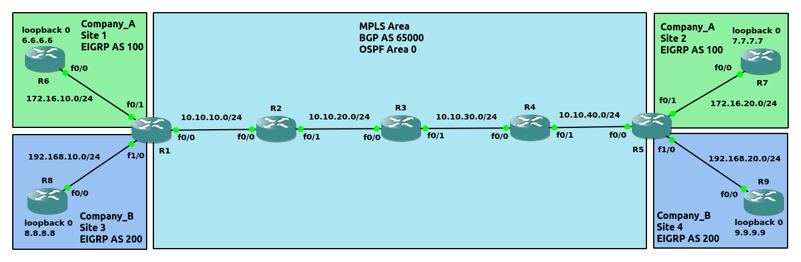<br>

示例6 - 配置MPLS/VPN(PE-to-CE使用EIGRP配置, 如图8)
```
配置OSPF
R1(config)# router ospf 1
R1(config-router)# network 10.10.10.0 0.0.0.255 area 0
R1(config-router)# network 1.1.1.1 0.0.0.0 area 0

R2(config)# router ospf 1
R2(config-router)# network 10.10.0.0 0.0.255.255 area 0
R2(config-router)# network 2.2.2.2 0.0.0.0 area 0

R3(config)# router ospf 1
R3(config-router)# network 10.10.0.0 0.0.255.255 area 0
R3(config-router)# network 3.3.3.3 0.0.0.0 area 0

R4(config)# router ospf 1 
R4(config-router)# network 10.10.0.0 0.0.255.255 area 0
R4(config-router)# network 4.4.4.4 0.0.0.0 area 0

R5(config)# router ospf 1
R5(config-router)# network 10.10.40.0 0.0.0.255 area 0
R5(config-router)# network 5.5.5.5 0.0.0.0 area 0


配置mpls
R1(config)# int f0/0
R1(config-if)# mpls ip

R2(config)# int f0/0
R2(config-if)# mpls ip
R2(config-if)# int f0/1
R2(config-if)# mpls ip

R3(config)# int f0/0
R3(config-if)# mpls ip
R3(config-if)# int f0/1
R3(config-if)# mpls ip

R4(config)# int f0/0
R4(config-if)# mpls ip
R4(config-if)# int f0/1
R4(config-if)# mpls ip

R5(config)# int f0/0
R5(config-if)# mpls ip


配置BGP
R1(config)# router bgp 65000
R1(config-router)# neighbor 5.5.5.5 remote-as 65000
R1(config-router)# neighbor 5.5.5.5 update-source loopback0
R1(config-router)# redistribute ospf 1
R1(config-router)# address-family vpnv4           
R1(config-router-af)# neighbor 5.5.5.5 activate
R1(config-router-af)# neighbor 5.5.5.5 send-community both

R5(config)# router bgp 65000
R5(config-router)# neighbor 1.1.1.1 remote-as 65000
R5(config-router)# neighbor 1.1.1.1 update-source loopback0
R5(config-router)# redistribute ospf 1
R5(config-router)# address-family vpnv4
R5(config-router-af)# neighbor 1.1.1.1 activate
R5(config-router-af)# neighbor 1.1.1.1 send-community both


在PE配置VRF
R1(config)# ip vrf Company_A
R1(config-vrf)# rd 1:100
R1(config-vrf)# route-target both 1:100
R1(config-vrf)# int f0/1
R1(config-if)# ip vrf forwarding Company_A
R1(config-if)# ip add 172.16.10.1 255.255.255.0
R1(config)# ip vrf Company_B
R1(config-vrf)# rd 1:110
R1(config-vrf)# route-target both 1:110
R1(config-vrf)# int f1/0
R1(config-if)# ip vrf forwarding Company_B
R1(config-if)# ip add 192.168.10.1 255.255.255.0

R5(config)# ip vrf Company_A
R5(config-vrf)# rd 1:100
R5(config-vrf)# route-target both 1:100
R5(config)# int f0/1
R5(config-if)# ip vrf forwarding Company_A
R5(config-if)# ip add 172.16.20.5 255.255.255.0
R5(config)# ip vrf Company_B
R5(config-vrf)# rd 1:110
R5(config-vrf)# route-target both 1:110
R5(config)# int f1/0
R5(config-if)# ip vrf forwarding Company_B
R5(config-if)# ip add 192.168.20.5 255.255.255.0


配置PE-to-CE(EIGRP)
R1(config)# router eigrp PE_TO_CE
R1(config-router)# address-family ipv4 unicast vrf Company_A autonomous-system 100
R1(config-router-af)# eigrp router-id 1.1.1.1
R1(config-router-af)# network 172.16.10.0 0.0.0.255
R1(config-router-af)# address-family ipv4 unicast vrf Company_B autonomous-system 200
R1(config-router-af)# eigrp router-id 1.1.1.1
R1(config-router-af)# network 192.168.10.0 0.0.0.255

R6(config)# router eigrp CE_TO_PE
R6(config-router)# address-family ipv4 unicast autonomous-system 100
R6(config-router-af)# eigrp router-id 6.6.6.6
R6(config-router-af)# network 172.16.10.0 0.0.0.255
R6(config-router-af)# network 6.6.6.6 0.0.0.0

R8(config)# router eigrp CE_TO_PE
R8(config-router)# address-family ipv4 unicast autonomous-system 200
R8(config-router-af)# eigrp router-id 8.8.8.8
R8(config-router-af)# network 192.168.10.0 0.0.0.255
R8(config-router-af)# network 8.8.8.8 0.0.0.0

R5(config)# router eigrp PE_TO_CE
R5(config-router)# address-family ipv4 unicast vrf Company_A autonomous-system 100
R5(config-router-af)# eigrp router-id 5.5.5.5
R5(config-router-af)# network 172.16.20.0 0.0.0.255
R5(config-router-af)# address-family ipv4 unicast vrf Company_B autonomous-system 200  
R5(config-router-af)# eigrp router-id 5.5.5.5
R5(config-router-af)# network 192.168.20.0 0.0.0.255

R7(config)# router eigrp CE_TO_PE
R7(config-router)# address-family ipv4 unicast autonomous-system 100    
R7(config-router-af)# eigrp router-id 7.7.7.7
R7(config-router-af)# network 172.16.20.0 0.0.0.255
R7(config-router-af)# network 7.7.7.7 0.0.0.0

R9(config)# router eigrp CE_TO_PE
R9(config-router)# address-family ipv4 unicast autonomous-system 200
R9(config-router-af)# eigrp router-id 9.9.9.9
R9(config-router-af)# network 192.168.20.0 0.0.0.255
R9(config-router-af)# network 9.9.9.9 0.0.0.0


redistribute
R1(config)# router eigrp PE_TO_CE
R1(config-router)# address-family ipv4 unicast vrf Company_A autonomous-system 100
R1(config-router-af)# topology base
R1(config-router-af-topology)# redistribute bgp 65000 metric 100000 10 255 1 1500
R1(config-router-af-topology)# address-family ipv4 unicast vrf Company_B autonomous-system 200
R1(config-router-af)# topology base
R1(config-router-af-topology)# redistribute bgp 65000 metric 100000 10 255 1 1500
R1(config-router-af-topology)# router bgp 65000
R1(config-router)# address-family ipv4 vrf Company_A
R1(config-router-af)# redistribute eigrp 100
R1(config-router-af)# address-family ipv4 vrf Company_B
R1(config-router-af)# redistribute eigrp 200

R5(config)# router eigrp PE_TO_CE
R5(config-router)# address-family ipv4 unicast vrf Company_A autonomous-system 100
R5(config-router-af)# topology base
R5(config-router-af-topology)# redistribute bgp 65000 metric 100000 10 255 1 1500
R5(config-router-af-topology)# address-family ipv4 unicast vrf Company_B autonomous-system 200
R5(config-router-af)# topology base
R5(config-router-af-topology)# redistribute bgp 65000 metric 100000 10 255 1 1500
R5(config-router-af-topology)# router bgp 65000
R5(config-router)# address-family ipv4 vrf Company_A
R5(config-router-af)# redistribute eigrp 100
R5(config-router-af)# address-family ipv4 vrf Company_B
R5(config-router-af)# redistribute eigrp 200
```
<br>
<br>

图9<br>
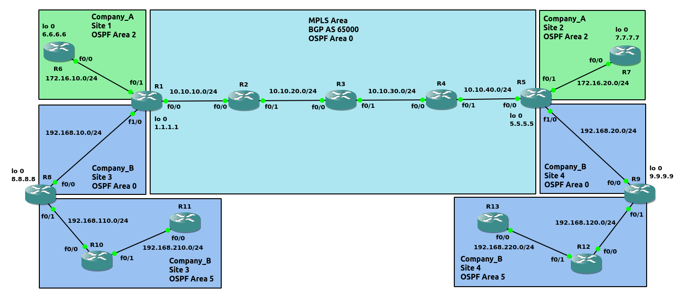<br>

图10<br>
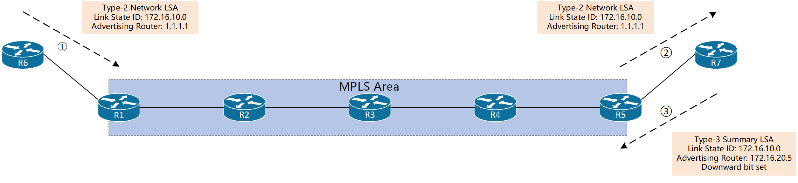<br>

图11<br>
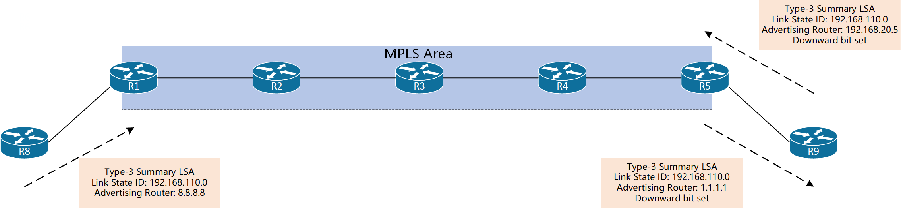<br>

示例7 - 配置MPLS/VPN(PE-to-CE使用OSPF配置, 如图9)
```
配置OSPF
R1(config)# router ospf 1
R1(config-router)# network 10.10.10.0 0.0.0.255 area 0
R1(config-router)# network 1.1.1.1 0.0.0.0 area 0

R2(config)# router ospf 1
R2(config-router)# network 10.10.0.0 0.0.255.255 area 0
R2(config-router)# network 2.2.2.2 0.0.0.0 area 0

R3(config)# router ospf 1
R3(config-router)# network 10.10.0.0 0.0.255.255 area 0
R3(config-router)# network 3.3.3.3 0.0.0.0 area 0

R4(config)# router ospf 1 
R4(config-router)# network 10.10.0.0 0.0.255.255 area 0
R4(config-router)# network 4.4.4.4 0.0.0.0 area 0

R5(config)# router ospf 1
R5(config-router)# network 10.10.40.0 0.0.0.255 area 0
R5(config-router)# network 5.5.5.5 0.0.0.0 area 0


配置mpls
R1(config)# int f0/0
R1(config-if)# mpls ip

R2(config)# int f0/0
R2(config-if)# mpls ip
R2(config-if)# int f0/1
R2(config-if)# mpls ip

R3(config)# int f0/0
R3(config-if)# mpls ip
R3(config-if)# int f0/1
R3(config-if)# mpls ip

R4(config)# int f0/0
R4(config-if)# mpls ip
R4(config-if)# int f0/1
R4(config-if)# mpls ip

R5(config)# int f0/0
R5(config-if)# mpls ip


配置BGP
R1(config)# router bgp 65000
R1(config-router)# neighbor 5.5.5.5 remote-as 65000
R1(config-router)# neighbor 5.5.5.5 update-source loopback0
R1(config-router)# redistribute ospf 1
R1(config-router)# address-family vpnv4           
R1(config-router-af)# neighbor 5.5.5.5 activate
R1(config-router-af)# neighbor 5.5.5.5 send-community both

R5(config)# router bgp 65000
R5(config-router)# neighbor 1.1.1.1 remote-as 65000
R5(config-router)# neighbor 1.1.1.1 update-source loopback0
R5(config-router)# redistribute ospf 1
R5(config-router)# address-family vpnv4
R5(config-router-af)# neighbor 1.1.1.1 activate
R5(config-router-af)# neighbor 1.1.1.1 send-community both


在PE配置VRF
R1(config)# ip vrf Company_A
R1(config-vrf)# rd 1:100
R1(config-vrf)# route-target both 1:100
R1(config-vrf)# int f0/1
R1(config-if)# ip vrf forwarding Company_A
R1(config-if)# ip add 172.16.10.1 255.255.255.0
R1(config)# ip vrf Company_B
R1(config-vrf)# rd 1:110
R1(config-vrf)# route-target both 1:110
R1(config-vrf)# int f1/0
R1(config-if)# ip vrf forwarding Company_B
R1(config-if)# ip add 192.168.10.1 255.255.255.0

R5(config)# ip vrf Company_A
R5(config-vrf)# rd 1:100
R5(config-vrf)# route-target both 1:100
R5(config)# int f0/1
R5(config-if)# ip vrf forwarding Company_A
R5(config-if)# ip add 172.16.20.5 255.255.255.0
R5(config)# ip vrf Company_B
R5(config-vrf)# rd 1:110
R5(config-vrf)# route-target both 1:110
R5(config)# int f1/0
R5(config-if)# ip vrf forwarding Company_B
R5(config-if)# ip add 192.168.20.5 255.255.255.0


配置PE-to-CE(OSPF)
R1(config)# router ospf 2 vrf Company_A
R1(config-router)# network 172.16.10.0 0.0.0.255 area 1
R1(config-router)# router ospf 3 vrf Company_B 
R1(config-router)# network 192.168.10.0 0.0.0.255 area 0

R6(config)# router ospf 2
R6(config-router)# network 172.16.10.0 0.0.0.255 area 1
R6(config-router)# network 6.6.6.6 0.0.0.0 area 1

R8(config)# router ospf 3
R8(config-router)# network 192.168.10.0 0.0.0.255 area 0
R8(config-router)# network 8.8.8.8 0.0.0.0 area 0
R8(config-router)# network 192.168.110.0 0.0.0.255 area 5

R10(config)# router ospf 3
R10(config-router)# network 192.168.0.0 0.0.255.255 area 5

R11(config)# router ospf 3
R11(config-router)# network 192.168.210.0 0.0.0.255 area 5

R5(config)# router ospf 2 vrf Company_A
R5(config-router)# network 172.16.20.0 0.0.0.255 area 2
R5(config-router)# router ospf 3 vrf Company_B
R5(config-router)# network 192.168.20.0 0.0.0.255 area 0

R7(config)# router ospf 2
R7(config-router)# network 172.16.20.0 0.0.0.255 area 2
R7(config-router)# network 7.7.7.7 0.0.0.0 area 2

R9(config)# router ospf 3
R9(config-router)# network 192.168.20.0 0.0.0.255 area 0
R9(config-router)# network 9.9.9.9 0.0.0.0 area 0
R9(config-router)# network 192.168.120.0 0.0.0.255 area 5

R12(config)# router ospf 3
R12(config-router)# network 192.168.0.0 0.0.255.255 area 5

R13(config)# router ospf 3
R13(config-router)# network 192.168.220.0 0.0.0.255 area 5


redistribute
R1(config)# router ospf 2 vrf Company_A                
R1(config-router)# redistribute bgp 65000
R1(config-router)# router ospf 3 vrf Company_B
R1(config-router)# redistribute bgp 65000
R1(config-router)# router bgp 65000
R1(config-router)# address-family ipv4 vrf Company_A
R1(config-router-af)# redistribute ospf 2
R1(config-router-af)# address-family ipv4 vrf Company_B
R1(config-router-af)# redistribute ospf 3

R5(config)# router ospf 2 vrf Company_A
R5(config-router)# redistribute bgp 65000
R5(config-router)# router ospf 3 vrf Company_B
R5(config-router)# redistribute bgp 65000
R5(config-router)# router bgp 65000
R5(config-router)# address-family ipv4 vrf Company_A
R5(config-router-af)# redistribute ospf 2
R5(config-router-af)# address-family ipv4 vrf Company_B
R5(config-router-af)# redistribute ospf 3


BGP使用Extended Community 0x8000传递OSPF的信息
field格式如下:
<area_num>:<ospf_route_type>:<external_metric_type>
area_num - 4 bytes, 代表与PE连接的area number
ospf_route_type - 1 byte, OSPF的route type, 类型范围[1,7]
external_metric_type - 1 byte, metric类型, 适用于type 5/7, 分为metric type 1和type 2


R1# show bgp vpnv4 unicast vrf Company_A 172.16.10.0
BGP routing table entry for 1:100:172.16.10.0/24, version 22
Paths: (1 available, best #1, table Company_A)
  Advertised to update-groups:
     1         
  Refresh Epoch 1
  Local
    0.0.0.0 from 0.0.0.0 (1.1.1.1)
      Origin incomplete, metric 0, localpref 100, weight 32768, valid, sourced, best
      Extended Community: RT:1:100 OSPF DOMAIN ID:0x0005:0x000000020200 
        OSPF RT:0.0.0.1:2:0 OSPF ROUTER ID:172.16.10.1:0
      mpls labels in/out 16/nolabel(Company_A)
      rx pathid: 0, tx pathid: 0x0


R5# show bgp vpnv4 unicast vrf Company_A 172.16.10.0 
BGP routing table entry for 1:100:172.16.10.0/24, version 23
Paths: (1 available, best #1, table Company_A)
  Not advertised to any peer
  Refresh Epoch 1
  Local
    1.1.1.1 (metric 5) from 1.1.1.1 (1.1.1.1)
      Origin incomplete, metric 0, localpref 100, valid, internal, best
      Extended Community: RT:1:100 OSPF DOMAIN ID:0x0005:0x000000020200 
        OSPF RT:0.0.0.1:2:0 OSPF ROUTER ID:172.16.10.1:0
      mpls labels in/out nolabel/16
      rx pathid: 0, tx pathid: 0x0


R5# show ip ospf data summary 172.16.10.0

            OSPF Router with ID (172.16.20.5) (Process ID 2)

		Summary Net Link States (Area 2)

  LS age: 204
  Options: (No TOS-capability, DC, Downward)
  LS Type: Summary Links(Network)
  Link State ID: 172.16.10.0 (summary Network Number)
  Advertising Router: 172.16.20.5
  LS Seq Number: 80000005
  Checksum: 0xD248
  Length: 28
  Network Mask: /24
	MTID: 0 	Metric: 1 


结论(如图10):
172.16.10.0/24通过R1后, 仍然为Type 2; 当通过R5后, 转化为Typy 3; 如果NLRI试图从site通过R5返回backbone, 由于OSPF特性(不允许非Area 0的summary通过ABR), 该行为失败


R1# show bgp vpnv4 unicast vrf Company_B 192.168.110.0 
BGP routing table entry for 1:110:192.168.110.0/24, version 6
Paths: (1 available, best #1, table Company_B)
  Advertised to update-groups:
     1         
  Refresh Epoch 1
  Local
    192.168.10.8 from 0.0.0.0 (1.1.1.1)
      Origin incomplete, metric 2, localpref 100, weight 32768, valid, sourced, best
      Extended Community: RT:1:110 OSPF DOMAIN ID:0x0005:0x000000030200 
        OSPF RT:0.0.0.0:3:0 OSPF ROUTER ID:192.168.10.1:0
      mpls labels in/out 28/nolabel
      rx pathid: 0, tx pathid: 0x0


R1# show ip ospf data summary 192.168.110.0

            OSPF Router with ID (192.168.10.1) (Process ID 3)

		Summary Net Link States (Area 0)

  Routing Bit Set on this LSA in topology Base with MTID 0
  LS age: 1530
  Options: (No TOS-capability, DC, Upward)
  LS Type: Summary Links(Network)
  Link State ID: 192.168.110.0 (summary Network Number)
  Advertising Router: 8.8.8.8
  LS Seq Number: 80000005
  Checksum: 0x2A16
  Length: 28
  Network Mask: /24
	MTID: 0 	Metric: 1 


R5#  show bgp vpnv4 unicast vrf Company_B 192.168.110.0
BGP routing table entry for 1:110:192.168.110.0/24, version 18
Paths: (1 available, best #1, table Company_B)
  Not advertised to any peer
  Refresh Epoch 1
  Local
    1.1.1.1 (metric 5) from 1.1.1.1 (1.1.1.1)
      Origin incomplete, metric 2, localpref 100, valid, internal, best
      Extended Community: RT:1:110 OSPF DOMAIN ID:0x0005:0x000000030200 
        OSPF RT:0.0.0.0:3:0 OSPF ROUTER ID:192.168.10.1:0
      mpls labels in/out nolabel/28
      rx pathid: 0, tx pathid: 0x0


R5# show ip ospf data summary 192.168.110.0

            OSPF Router with ID (192.168.20.5) (Process ID 3)

		Summary Net Link States (Area 0)

  LS age: 692
  Options: (No TOS-capability, DC, Downward)
  LS Type: Summary Links(Network)
  Link State ID: 192.168.110.0 (summary Network Number)
  Advertising Router: 192.168.20.5
  LS Seq Number: 80000005
  Checksum: 0xE675
  Length: 28
  Network Mask: /24
	MTID: 0 	Metric: 2


结论(如图11):
192.168.110.0/24通过R6后, 转化为Type 3; 通过R1时, 虽然为Type 3, 但是此时Downward bit没有设置, 允许通过; 当NLRI试图从site通过R5返回backbone时, 由于Type 3和Downward bit set同时满足, 不允许通过


综合结论:
Downward bit作用于OSPF Type 3路由, 用于阻止PE接口(与CE连接)的Type 3路由, 防止造成loop
```
<br>
<br>

图12<br>
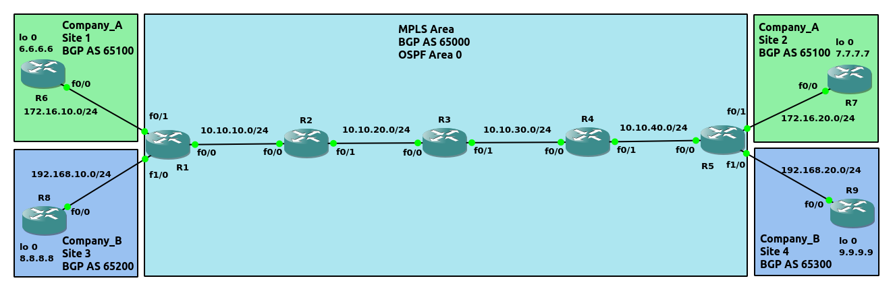<br>

示例8 - 配置MPLS/VPN(PE-to-CE使用BGP配置, 如图12)
```
配置OSPF
R1(config)# router ospf 1
R1(config-router)# network 10.10.10.0 0.0.0.255 area 0
R1(config-router)# network 1.1.1.1 0.0.0.0 area 0

R2(config)# router ospf 1
R2(config-router)# network 10.10.0.0 0.0.255.255 area 0
R2(config-router)# network 2.2.2.2 0.0.0.0 area 0

R3(config)# router ospf 1
R3(config-router)# network 10.10.0.0 0.0.255.255 area 0
R3(config-router)# network 3.3.3.3 0.0.0.0 area 0

R4(config)# router ospf 1 
R4(config-router)# network 10.10.0.0 0.0.255.255 area 0
R4(config-router)# network 4.4.4.4 0.0.0.0 area 0

R5(config)# router ospf 1
R5(config-router)# network 10.10.40.0 0.0.0.255 area 0
R5(config-router)# network 5.5.5.5 0.0.0.0 area 0


配置mpls
R1(config)# int f0/0
R1(config-if)# mpls ip

R2(config)# int f0/0
R2(config-if)# mpls ip
R2(config-if)# int f0/1
R2(config-if)# mpls ip

R3(config)# int f0/0
R3(config-if)# mpls ip
R3(config-if)# int f0/1
R3(config-if)# mpls ip

R4(config)# int f0/0
R4(config-if)# mpls ip
R4(config-if)# int f0/1
R4(config-if)# mpls ip

R5(config)# int f0/0
R5(config-if)# mpls ip


配置BGP
R1(config)# router bgp 65000
R1(config-router)# neighbor 5.5.5.5 remote-as 65000
R1(config-router)# neighbor 5.5.5.5 update-source loopback0
R1(config-router)# redistribute ospf 1
R1(config-router)# address-family vpnv4           
R1(config-router-af)# neighbor 5.5.5.5 activate
R1(config-router-af)# neighbor 5.5.5.5 send-community both

R5(config)# router bgp 65000
R5(config-router)# neighbor 1.1.1.1 remote-as 65000
R5(config-router)# neighbor 1.1.1.1 update-source loopback0
R5(config-router)# redistribute ospf 1
R5(config-router)# address-family vpnv4
R5(config-router-af)# neighbor 1.1.1.1 activate
R5(config-router-af)# neighbor 1.1.1.1 send-community both


在PE配置VRF
R1(config)# ip vrf Company_A
R1(config-vrf)# rd 1:100
R1(config-vrf)# route-target both 1:100
R1(config-vrf)# int f0/1
R1(config-if)# ip vrf forwarding Company_A
R1(config-if)# ip add 172.16.10.1 255.255.255.0
R1(config)# ip vrf Company_B
R1(config-vrf)# rd 1:110
R1(config-vrf)# route-target both 1:110
R1(config-vrf)# int f1/0
R1(config-if)# ip vrf forwarding Company_B
R1(config-if)# ip add 192.168.10.1 255.255.255.0

R5(config)# ip vrf Company_A
R5(config-vrf)# rd 1:100
R5(config-vrf)# route-target both 1:100
R5(config)# int f0/1
R5(config-if)# ip vrf forwarding Company_A
R5(config-if)# ip add 172.16.20.5 255.255.255.0
R5(config)# ip vrf Company_B
R5(config-vrf)# rd 1:110
R5(config-vrf)# route-target both 1:110
R5(config)# int f1/0
R5(config-if)# ip vrf forwarding Company_B
R5(config-if)# ip add 192.168.20.5 255.255.255.0


配置PE-to-CE(BGP)
R1(config)# router bgp 65000
R1(config-router)# address-family ipv4 vrf Company_A
R1(config-router-af)# neighbor 172.16.10.6 remote-as 65100
R1(config-router-af)# neighbor 172.16.10.6 activate
R1(config-router-af)# neighbor 172.16.10.6 as-override
R1(config-router-af)# address-family ipv4 vrf Company_B
R1(config-router-af)# neighbor 192.168.10.8 remote-as 65200
R1(config-router-af)# neighbor 192.168.10.8 activate

R6(config)# router bgp 65100
R6(config-router)# bgp router-id 6.6.6.6
R6(config-router)# neighbor 172.16.10.1 remote-as 65000
R6(config-router)# redistribute connected

R8(config)# router bgp 65200
R8(config-router)# bgp router-id 8.8.8.8
R8(config-router)# neighbor 192.168.10.1 remote-as 65000
R8(config-router)# redistribute connected

R5(config)# router bgp 65000
R5(config-router)# address-family ipv4 vrf Company_A
R5(config-router-af)# neighbor 172.16.20.7 remote-as 65100
R5(config-router-af)# neighbor 172.16.20.7 activate
R5(config-router-af)# neighbor 172.16.20.7 as-override
R5(config-router-af)# address-family ipv4 vrf Company_B
R5(config-router-af)# neighbor 192.168.20.9 remote-as 65300
R5(config-router-af)# neighbor 192.168.20.9 activate

R7(config)# router bgp 65100
R7(config-router)# bgp router-id 7.7.7.7
R7(config-router)# neighbor 172.16.20.5 remote-as 65000
R7(config-router)# redistribute connected

R9(config)# router bgp 65300
R9(config-router)# bgp router-id 9.9.9.9
R9(config-router)# neighbor 192.168.20.5 remote-as 65000
R9(config-router)# redistribute connected

** 在BPG中, PE与CE必须直连, BGP multihop在这种情况下暂时不支持
** 当相同VRF的多个site使用同一个AS number时, 由于BGP的loop策略(AS path包含自己的AS number, 丢弃NLRI), route会被丢弃. 使用BGP的as override特性:
(config-router-af)# neighbor <neighbor_peer> as-override
AS override原理:
1.当AS_PATH的起始AS number与neighbor的AS number一致时, 替换该起始AS number为PE所在AS number

2.当起始AS number在之前出现多次, 将全部符合的AS number都进行替换

3.替换后, PE会prepend当前所在AS的AS number到AS path


AS override结果展示
R5# show bgp vrf Company_A vpnv4 unicast | include 6.6.6.6
 *>i 6.6.6.6/32       1.1.1.1                  0    100      0 65100 ?
 
R7# show bgp ipv4 unicast | include 6.6.6.6
 *>  6.6.6.6/32       172.16.20.5                            0 65000 65000 ?


R1(config)# ip prefix-list NET_PREFIX seq 5 permit 6.6.6.6/32
R1(config)# route-map AS_PREPEND permit 10
R1(config-route-map)# match ip address prefix-list NET_PREFIX
R1(config-route-map)# set as-path prepend 65900 65100 65800  
R1(config-route-map)# route-map AS_PREPEND permit 20
R1(config)# router bgp 65000
R1(config-router)# address-family ipv4 vrf Company_A
R1(config-router-af)# neighbor 172.16.10.6 route-map AS_PREPEND in
R1# clear bgp vpnv4 unicast *

R1# show bgp vrf Company_A vpnv4 unicast | begin Network
     Network          Next Hop            Metric LocPrf Weight Path
Route Distinguisher: 1:100 (default for vrf Company_A)
 *>  6.6.6.6/32       172.16.10.6              0             0 65900 65100 65800 65100 ?
 *>i 7.7.7.7/32       5.5.5.5                  0    100      0 65100 ?
 r>  172.16.10.0/24   172.16.10.6              0             0 65100 ?
 *>i 172.16.20.0/24   5.5.5.5                  0    100      0 65100 ?

R5# show bgp vpnv4 unicast vrf Company_A | begin Network
     Network          Next Hop            Metric LocPrf Weight Path
Route Distinguisher: 1:100 (default for vrf Company_A)
 *>i 6.6.6.6/32       1.1.1.1                  0    100      0 65900 65100 65800 65100 ?
 *>  7.7.7.7/32       172.16.20.7              0             0 65100 ?
 *>i 172.16.10.0/24   1.1.1.1                  0    100      0 65100 ?
 r>  172.16.20.0/24   172.16.20.7              0             0 65100 ?

R7# show bgp ipv4 unicast | begin Network
     Network          Next Hop            Metric LocPrf Weight Path
 *>  6.6.6.6/32       172.16.20.5                            0 65000 65900 65000 65800 65000 ?
 *>  7.7.7.7/32       0.0.0.0                  0         32768 ?
 *>  172.16.10.0/24   172.16.20.5                            0 65000 65000 ?
 *>  172.16.20.0/24   0.0.0.0                  0         32768 ?
```
<br>
<br>

示例9 - route-target import/export方向探讨(参考图7)
```
根据示例7配置, 修改R5的Company_A VRF配置
R5(config)# int f0/1
R5(config-if)# no ip vrf forwarding Company_A
R5(config)# ip vrf Company_A
R5(config-vrf)# route-target import 1:110
R5(config)# int f0/1
R5(config-if)# ip vrf forwarding Company_A
R5(config-if)# ip add 172.16.20.5 255.255.255.0

修改后R5的完整VRF配置如下
R5(config)# ip vrf Company_A
R5(config-vrf)# rd 1:100
R5(config-vrf)# route-target both 1:100
R5(config-vrf)# route-target import 1:110
R5(config)# int f0/1
R5(config-if)# ip vrf forwarding Company_A
R5(config-if)# ip add 172.16.20.5 255.255.255.0
R5(config)# ip vrf Company_B
R5(config-vrf)# rd 1:110
R5(config-vrf)# route-target both 1:110
R5(config)# int f1/0
R5(config-if)# ip vrf forwarding Company_B
R5(config-if)# ip add 192.168.20.5 255.255.255.0


查看R7的路由表
R7# show ip route | begin Gateway
Gateway of last resort is not set

      6.0.0.0/32 is subnetted, 1 subnets
O IA     6.6.6.6 [110/3] via 172.16.20.5, 00:01:54, FastEthernet0/0
      7.0.0.0/32 is subnetted, 1 subnets
C        7.7.7.7 is directly connected, Loopback0
      8.0.0.0/32 is subnetted, 1 subnets
O E2     8.8.8.8 [110/2] via 172.16.20.5, 00:01:54, FastEthernet0/0
      9.0.0.0/32 is subnetted, 1 subnets
O E2     9.9.9.9 [110/2] via 172.16.20.5, 00:01:54, FastEthernet0/0
      172.16.0.0/16 is variably subnetted, 3 subnets, 2 masks
O IA     172.16.10.0/24 [110/2] via 172.16.20.5, 00:01:54, FastEthernet0/0
C        172.16.20.0/24 is directly connected, FastEthernet0/0
L        172.16.20.7/32 is directly connected, FastEthernet0/0
O E2  192.168.10.0/24 [110/1] via 172.16.20.5, 00:01:54, FastEthernet0/0
O E2  192.168.20.0/24 [110/1] via 172.16.20.5, 00:01:54, FastEthernet0/0


结论:
route-target import代表将route从BGP community中导入到VRF
route-target export代表将route从VRF中导出到BGP community
import/export关键词的针对对象为VRF
```
<br>
<br>

示例10 - 额外添加site与site的通道1(site的router distinguisher在相同的VRF内一致, 参考图7)
```
R1的VRF配置修改结果如下(根据示例7的配置修改)
R1(config)# ip vrf Company_A
R1(config-vrf)# rd 1:100
R1(config-vrf)# route-target both 1:100
R1(config-vrf)# route-target import 1:110
R1(config-vrf)# int f0/1
R1(config-if)# ip vrf forwarding Company_A
R1(config-if)# ip add 172.16.10.1 255.255.255.0
R1(config)# ip vrf Company_B
R1(config-vrf)# rd 1:110
R1(config-vrf)# route-target both 1:110
R1(config-vrf)# route-target import 1:100
R1(config-vrf)# int f1/0
R1(config-if)# ip vrf forwarding Company_B
R1(config-if)# ip add 192.168.10.1 255.255.255.0


R6# show ip route | begin Gateway
Gateway of last resort is not set

      6.0.0.0/32 is subnetted, 1 subnets
C        6.6.6.6 is directly connected, Loopback0
      7.0.0.0/32 is subnetted, 1 subnets
O IA     7.7.7.7 [110/3] via 172.16.10.1, 00:00:43, FastEthernet0/0
      8.0.0.0/32 is subnetted, 1 subnets
O E2     8.8.8.8 [110/2] via 172.16.10.1, 00:00:16, FastEthernet0/0
      9.0.0.0/32 is subnetted, 1 subnets
O E2     9.9.9.9 [110/2] via 172.16.10.1, 00:00:43, FastEthernet0/0
      172.16.0.0/16 is variably subnetted, 3 subnets, 2 masks
C        172.16.10.0/24 is directly connected, FastEthernet0/0
L        172.16.10.6/32 is directly connected, FastEthernet0/0
O IA     172.16.20.0/24 [110/2] via 172.16.10.1, 00:00:43, FastEthernet0/0
O E2  192.168.10.0/24 [110/1] via 172.16.10.1, 00:00:31, FastEthernet0/0
O E2  192.168.20.0/24 [110/1] via 172.16.10.1, 00:00:43, FastEthernet0/0

R8# show ip route | begin Gateway
Gateway of last resort is not set

      6.0.0.0/32 is subnetted, 1 subnets
O E2     6.6.6.6 [110/2] via 192.168.10.1, 00:00:31, FastEthernet0/0
      7.0.0.0/32 is subnetted, 1 subnets
O E2     7.7.7.7 [110/2] via 192.168.10.1, 00:00:31, FastEthernet0/0
      8.0.0.0/32 is subnetted, 1 subnets
C        8.8.8.8 is directly connected, Loopback0
      9.0.0.0/32 is subnetted, 1 subnets
O IA     9.9.9.9 [110/3] via 192.168.10.1, 00:00:31, FastEthernet0/0
      172.16.0.0/24 is subnetted, 2 subnets
O E2     172.16.10.0 [110/1] via 192.168.10.1, 00:00:31, FastEthernet0/0
O E2     172.16.20.0 [110/1] via 192.168.10.1, 00:00:31, FastEthernet0/0
      192.168.10.0/24 is variably subnetted, 2 subnets, 2 masks
C        192.168.10.0/24 is directly connected, FastEthernet0/0
L        192.168.10.8/32 is directly connected, FastEthernet0/0
O IA  192.168.20.0/24 [110/2] via 192.168.10.1, 00:00:31, FastEthernet0/0


R6# ping 8.8.8.8 source 6.6.6.6
!!!!!

R6# ping 9.9.9.9 source 6.6.6.6
.....


R8# ping 6.6.6.6 source 8.8.8.8
!!!!!

R8# ping 7.7.7.7 source 8.8.8.8
.....
```
<br>
<br>

图13 - route-target方向<br>
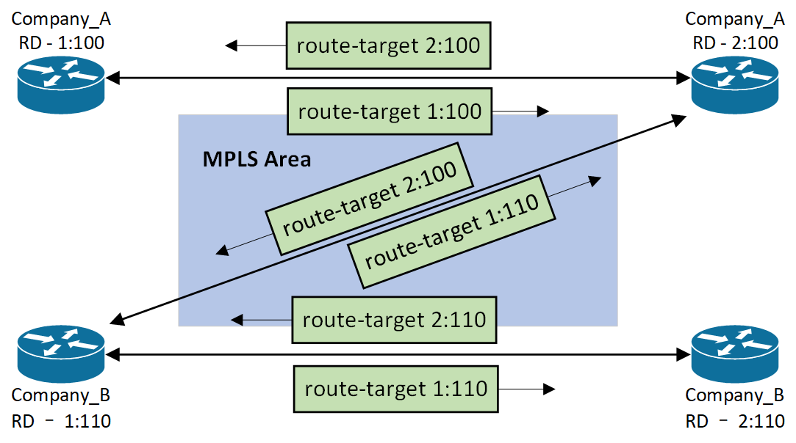<br>

示例11 - 额外添加site与site的通道2(site的router distinguisher具有唯一性, 参考图7/13)
```
R1与R5的VRF配置修改结果如下(根据示例7的配置修改)
R1(config)# ip vrf Company_A
R1(config-vrf)# rd 1:100
R1(config-vrf)# route-target import 2:100
R1(config-vrf)# route-target export 1:100
R1(config-vrf)# int f0/1
R1(config-if)# ip vrf forwarding Company_A
R1(config-if)# ip add 172.16.10.1 255.255.255.0
R1(config)# ip vrf Company_B
R1(config-vrf)# rd 1:110
R1(config-vrf)# route-target import 2:110
R1(config-vrf)# route-target export 1:110
R1(config-vrf)# route-target import 2:100
R1(config-vrf)# int f1/0
R1(config-if)# ip vrf forwarding Company_B
R1(config-if)# ip add 192.168.10.1 255.255.255.0


R5(config)# ip vrf Company_A
R5(config-vrf)# rd 2:100
R5(config-vrf)# route-target import 1:100
R5(config-vrf)# route-target export 2:100
R5(config-vrf)# route-target import 1:110
R5(config)# int f0/1
R5(config-if)# ip vrf forwarding Company_A
R5(config-if)# ip add 172.16.20.5 255.255.255.0
R5(config)# ip vrf Company_B
R5(config-vrf)# rd 2:110
R5(config-vrf)# route-target import 1:110
R5(config-vrf)# route-target export 2:110
R5(config)# int f1/0
R5(config-if)# ip vrf forwarding Company_B
R5(config-if)# ip add 192.168.20.5 255.255.255.0

** 如果是删除vrf后重新配置, 必须重新配置router ospf 2/3和redistribute


R6# show ip route | begin Gateway
Gateway of last resort is not set

      6.0.0.0/32 is subnetted, 1 subnets
C        6.6.6.6 is directly connected, Loopback0
      7.0.0.0/32 is subnetted, 1 subnets
O IA     7.7.7.7 [110/3] via 172.16.10.1, 00:12:36, FastEthernet0/0
      172.16.0.0/16 is variably subnetted, 3 subnets, 2 masks
C        172.16.10.0/24 is directly connected, FastEthernet0/0
L        172.16.10.6/32 is directly connected, FastEthernet0/0
O IA     172.16.20.0/24 [110/2] via 172.16.10.1, 00:12:36, FastEthernet0/0

R7# show ip route | begin Gateway
Gateway of last resort is not set

      6.0.0.0/32 is subnetted, 1 subnets
O IA     6.6.6.6 [110/3] via 172.16.20.5, 00:13:11, FastEthernet0/0
      7.0.0.0/32 is subnetted, 1 subnets
C        7.7.7.7 is directly connected, Loopback0
      8.0.0.0/32 is subnetted, 1 subnets
O E2     8.8.8.8 [110/2] via 172.16.20.5, 00:13:11, FastEthernet0/0
      172.16.0.0/16 is variably subnetted, 3 subnets, 2 masks
O IA     172.16.10.0/24 [110/2] via 172.16.20.5, 00:13:11, FastEthernet0/0
C        172.16.20.0/24 is directly connected, FastEthernet0/0
L        172.16.20.7/32 is directly connected, FastEthernet0/0
O E2  192.168.10.0/24 [110/1] via 172.16.20.5, 00:13:11, FastEthernet0/0

R8# show ip route | begin Gateway
Gateway of last resort is not set

      7.0.0.0/32 is subnetted, 1 subnets
O E2     7.7.7.7 [110/2] via 192.168.10.1, 00:12:45, FastEthernet0/0
      8.0.0.0/32 is subnetted, 1 subnets
C        8.8.8.8 is directly connected, Loopback0
      9.0.0.0/32 is subnetted, 1 subnets
O IA     9.9.9.9 [110/3] via 192.168.10.1, 00:00:47, FastEthernet0/0
      172.16.0.0/24 is subnetted, 1 subnets
O E2     172.16.20.0 [110/1] via 192.168.10.1, 00:12:45, FastEthernet0/0
      192.168.10.0/24 is variably subnetted, 2 subnets, 2 masks
C        192.168.10.0/24 is directly connected, FastEthernet0/0
L        192.168.10.8/32 is directly connected, FastEthernet0/0
O IA  192.168.20.0/24 [110/2] via 192.168.10.1, 00:00:57, FastEthernet0/0

R9# show ip route | begin Gateway
Gateway of last resort is not set

      8.0.0.0/32 is subnetted, 1 subnets
O IA     8.8.8.8 [110/3] via 192.168.20.5, 00:01:00, FastEthernet0/0
      9.0.0.0/32 is subnetted, 1 subnets
C        9.9.9.9 is directly connected, Loopback0
O IA  192.168.10.0/24 [110/2] via 192.168.20.5, 00:01:00, FastEthernet0/0
      192.168.20.0/24 is variably subnetted, 2 subnets, 2 masks
C        192.168.20.0/24 is directly connected, FastEthernet0/0
L        192.168.20.9/32 is directly connected, FastEthernet0/0


R6# ping 7.7.7.7 source 6.6.6.6
!!!!!

R6# ping 8.8.8.8 source 6.6.6.6
.....

R6# ping 9.9.9.9 source 6.6.6.6
.....


R7# ping 6.6.6.6 source 7.7.7.7
!!!!!

R7# ping 8.8.8.8 source 7.7.7.7
!!!!!

R7# ping 9.9.9.9 source 7.7.7.7
.....


R8# ping 6.6.6.6 source 8.8.8.8
.....

R8# ping 7.7.7.7 source 8.8.8.8
!!!!!

R8# ping 9.9.9.9 source 8.8.8.8
!!!!!


R9# ping 6.6.6.6 source 9.9.9.9
.....

R9# ping 7.7.7.7 source 9.9.9.9
.....

R9# ping 8.8.8.8 source 9.9.9.9
!!!!!


当site适用于site之间具有地址唯一性时, 不同site使用不同route distinguisher
当site与VRF作为一体, 与其他VRF进行交互, 每个VRF使用一致的route distinguisher(常用配置选项)

** 补充: 图7的6.6.6.6和7.7.7.7组成一个VRF, 6.6.6.6为site
```
<br>
<br>

图14<br>
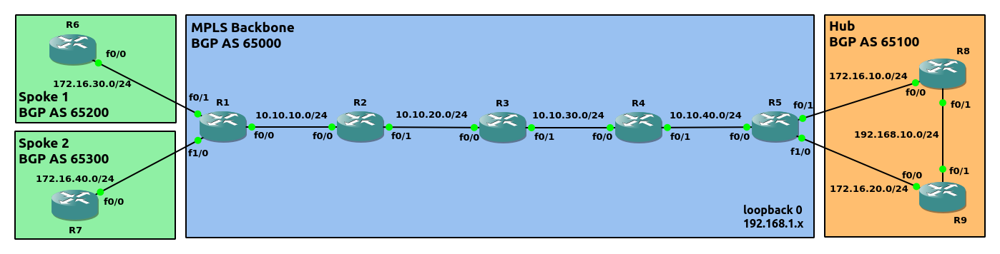<br>

图15<br>
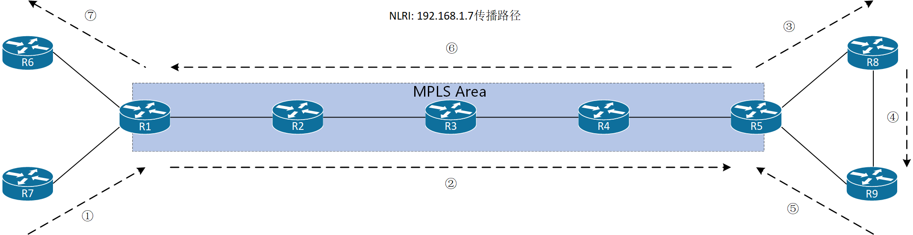<br>

示例12 - Hub and Spoke topology(如图14)
```
配置OSPF
R1(config)# router ospf 1
R1(config-router)# network 192.168.1.1 0.0.0.0 area 0
R1(config-router)# network 10.10.10.0 0.0.0.255 area 0

R2(config)# router ospf 1
R2(config-router)# network 192.168.1.2 0.0.0.0 area 0
R2(config-router)# network 10.10.0.0 0.0.255.255 area 0

R3(config)# router ospf 1
R3(config-router)# network 192.168.1.3 0.0.0.0 area 0
R3(config-router)# network 10.10.0.0 0.0.255.255 area 0

R4(config)# router ospf 1
R4(config-router)# network 192.168.1.4 0.0.0.0 area 0
R4(config-router)# network 10.10.0.0 0.0.255.255 area 0

R5(config)# router ospf 1
R5(config-router)# network 192.168.1.5 0.0.0.0 area 0
R5(config-router)# network 10.10.40.0 0.0.0.255 area 0


配置MPLS
R1(config)# router ospf 1
R1(config-router)# mpls ldp autoconfig 

R2(config)# router ospf 1
R2(config-router)# mpls ldp autoconfig

R3(config)# router ospf 1
R3(config-router)# mpls ldp autoconfig

R4(config)# router ospf 1
R4(config-router)# mpls ldp autoconfig

R5(config)# router ospf 1
R5(config-router)# mpls ldp autoconfig


配置BGP
R1(config)# router bgp 65000
R1(config-router)# neighbor 192.168.1.5 remote-as 65000
R1(config-router)# neighbor 192.168.1.5 update-source loopback0
R1(config-router)# redistribute ospf 1
R1(config-router)# address-family vpnv4           
R1(config-router-af)# neighbor 192.168.1.5 activate
R1(config-router-af)# neighbor 192.168.1.5 send-community both

R5(config)# router bgp 65000
R5(config-router)# neighbor 192.168.1.1 remote-as 65000
R5(config-router)# neighbor 192.168.1.1 update-source loopback0
R5(config-router)# redistribute ospf 1
R5(config-router)# address-family vpnv4
R5(config-router-af)# neighbor 192.168.1.1 activate
R5(config-router-af)# neighbor 192.168.1.1 send-community both


配置VRF
R1(config)# ip vrf Spoke_1
R1(config-vrf)# rd 1:110
R1(config-vrf)# route-target export 100:110
R1(config-vrf)# route-target import 100:100
R1(config-vrf)# ip vrf Spoke_2
R1(config-vrf)# rd 1:120
R1(config-vrf)# route-target export 100:110
R1(config-vrf)# route-target import 100:100
R1(config-vrf)# int f0/1
R1(config-if)# ip vrf forwarding Spoke_1
R1(config-if)# ip address 172.16.30.1 255.255.255.0
R1(config-if)# int f1/0
R1(config-if)# ip vrf forwarding Spoke_2
R1(config-if)# ip address 172.16.40.1 255.255.255.0

R5(config)# ip vrf Hub
R5(config-vrf)# rd 1:100
R5(config-vrf)# route-target import 100:110
R5(config-vrf)# ip vrf Spoke_3
R5(config-vrf)# rd 1:130
R5(config-vrf)# route-target export 100:100
R5(config-vrf)# int f0/1
R5(config-if)# ip vrf forwarding Hub
R5(config-if)# ip add 172.16.10.5 255.255.255.0
R5(config-if)# int f1/0
R5(config-if)# ip vrf forwarding Spoke_3
R5(config-if)# ip add 172.16.20.5 255.255.255.0


配置Hub
R8(config)# router ospf 1
R8(config-router)# network 192.168.1.8 0.0.0.0 area 0
R8(config-router)# network 192.168.10.0 0.0.0.255 area 0
R8(config-router)# router bgp 65100
R8(config-router)# neighbor 192.168.1.9 remote-as 65100
R8(config-router)# neighbor 192.168.1.9 update-source loopback0
R8(config-router)# redistribute ospf 1

R9(config)# router ospf 1
R9(config-router)# network 192.168.1.9 0.0.0.0 area 0
R9(config-router)# network 192.168.10.0 0.0.0.255 area 0
R9(config-router)# router bgp 65100
R9(config-router)# neighbor 192.168.1.8 remote-as 65100
R9(config-router)# neighbor 192.168.1.8 update-source loopback0
R9(config-router)# redistribute ospf 1


PE-to-CE配置
R1(config)# router bgp 65000
R1(config-router)# address-family ipv4 vrf Spoke_1
R1(config-router-af)# neighbor 172.16.30.6 remote-as 65200
R1(config-router-af)# neighbor 172.16.30.6 activate       
R1(config-router-af)# address-family ipv4 vrf Spoke_2
R1(config-router-af)# neighbor 172.16.40.7 remote-as 65300
R1(config-router-af)# neighbor 172.16.40.7 remote-as 65300

R6(config)# router bgp 65200
R6(config-router)# neighbor 172.16.30.1 remote-as 65000
R6(config-router)# redistribute connected

R7(config)# router bgp 65300
R7(config-router)# neighbor 172.16.40.1 remote-as 65000
R7(config-router)# redistribute connected

R5(config)# router bgp 65000
R5(config-router)# address-family ipv4 vrf Hub
R5(config-router-af)# neighbor 172.16.10.8 remote-as 65100
R5(config-router-af)# neighbor 172.16.10.8 activate
R5(config-router-af)# neighbor 172.16.20.9 remote-as 65100
R5(config-router-af)# neighbor 172.16.20.9 activate

R8(config)# router bgp 65100
R8(config-router)# neighbor 172.16.10.5 remote-as 65000
R8(config-router)# redistribute connected

R9(config)# router bgp 65100
R9(config-router)# neighbor 172.16.20.5 remote-as 65000
R9(config-router)# redistribute connected


R9# show bgp ipv4 unicast neighbor 172.16.20.5 advertised-route | begin Network        
     Network          Next Hop            Metric LocPrf Weight Path
 *>i 172.16.10.0/24   192.168.1.8              0    100      0 ?
 *>  172.16.20.0/24   0.0.0.0                  0         32768 ?
 *>i 172.16.30.0/24   172.16.10.5              0    100      0 65000 65200 ?
 *>i 172.16.40.0/24   172.16.10.5              0    100      0 65000 65300 ?
 *>i 192.168.1.6/32   172.16.10.5              0    100      0 65000 65200 ?
 *>i 192.168.1.7/32   172.16.10.5              0    100      0 65000 65300 ?
 *>  192.168.1.8/32   192.168.10.8             2         32768 ?
 *>  192.168.1.9/32   0.0.0.0                  0         32768 ?
 *>  192.168.10.0     0.0.0.0                  0         32768 ?

Total number of prefixes 9 


R5# show bgp vrf Spoke_3 vpnv4 unicast neighbor 172.16.20.9 route | begin Network      
     Network          Next Hop            Metric LocPrf Weight Path
Route Distinguisher: 1:130 (default for vrf Spoke_3)
 *>  172.16.10.0/24   172.16.20.9                            0 65100 ?
 r>  172.16.20.0/24   172.16.20.9              0             0 65100 ?
 *>  192.168.1.8/32   172.16.20.9              2             0 65100 ?
 *>  192.168.1.9/32   172.16.20.9              0             0 65100 ?
 *>  192.168.10.0     172.16.20.9              0             0 65100 ?

Total number of prefixes 5


配置allowas-in, 当AS_PATH中包含当前AS number, 仍然接收NLRI
R5(config)# router bgp 65000
R5(config-router)# address-family ipv4 vrf Spoke_3
R5(config-router-af)# neighbor 172.16.20.9 allowas-in

R5# show bgp vrf Spoke_3 vpnv4 unicast neighbor 172.16.20.9 route | begin Netw$
     Network          Next Hop            Metric LocPrf Weight Path
Route Distinguisher: 1:130 (default for vrf Spoke_3)
 *>  172.16.10.0/24   172.16.20.9                            0 65100 ?
 r>  172.16.20.0/24   172.16.20.9              0             0 65100 ?
 *>  172.16.30.0/24   172.16.20.9                            0 65100 65000 65200 ?
 *>  172.16.40.0/24   172.16.20.9                            0 65100 65000 65300 ?
 *>  192.168.1.6/32   172.16.20.9                            0 65100 65000 65200 ?
 *>  192.168.1.7/32   172.16.20.9                            0 65100 65000 65300 ?
 *>  192.168.1.8/32   172.16.20.9              2             0 65100 ?
 *>  192.168.1.9/32   172.16.20.9              0             0 65100 ?
 *>  192.168.10.0     172.16.20.9              0             0 65100 ?

Total number of prefixes 9


以上traceroute可参考图15(NLRI路径与package路径正好相反)
R6# traceroute 192.168.1.7 
Type escape sequence to abort.
Tracing the route to 192.168.1.7
VRF info: (vrf in name/id, vrf out name/id)
  1 172.16.30.1 8 msec 8 msec 12 msec
  2 10.10.10.2 [MPLS: Labels 24/36 Exp 0] 72 msec 84 msec 44 msec
  3 10.10.20.3 [MPLS: Labels 24/36 Exp 0] 96 msec 72 msec 68 msec
  4 10.10.30.4 [MPLS: Labels 24/36 Exp 0] 52 msec 64 msec 64 msec
  5 172.16.20.5 [AS 65100] [MPLS: Label 36 Exp 0] 100 msec 44 msec 104 msec
  6 172.16.20.9 [AS 65100] 80 msec 76 msec 88 msec
  7 192.168.10.8 [AS 65100] 96 msec 100 msec 96 msec
  8 172.16.10.5 [AS 65100] 88 msec 92 msec 80 msec
  9 10.10.40.4 [MPLS: Labels 20/16 Exp 0] 168 msec 132 msec 156 msec
 10 10.10.30.3 [MPLS: Labels 20/16 Exp 0] 160 msec 136 msec 192 msec
 11 10.10.20.2 [MPLS: Labels 16/16 Exp 0] 168 msec 172 msec 176 msec
 12 172.16.40.1 [AS 65300] [MPLS: Label 16 Exp 0] 148 msec 148 msec 108 msec
 13 172.16.40.7 [AS 65300] 160 msec 128 msec 128 msec


总结:
在当前Hub to Spokes结构中, Spokes之间的通信必须经过Hub, 并且Spoke_3作为Hub site的公开接口
```
<br>
<br>

#### MPLS特性
##### 1.MPLS解决frame过大的方案(参考draft-ietf-mpls-label-encaps-05的section 3.2)
在ingress LSR的output interface上配置指令<br>
`(config-if)# mpls mtu <mtu>`<br>
** 当经过该接口的fragment size(label load)大于指定值时, 如果DF bit没有设置为1, 则进行fragment操作
<br>
<br>

示例13(如图4)
```
使用wireshark监测R1与R2之间的流量

R1(config)# int f0/0
R1(config-if)# mpls mtu 1200


设置IP Datagram size为1196 bytes, 此时frame load为1196 + 4(mpls label) = 1200 bytes
R6# ping
Protocol [ip]: 
Target IP address: 4.4.4.4
Repeat count [5]: 
Datagram size [100]: 1196
Timeout in seconds [2]: 
Extended commands [n]: 
Sweep range of sizes [n]: 
Type escape sequence to abort.
Sending 5, 1196-byte ICMP Echos to 4.4.4.4, timeout is 2 seconds:
!!!!!
Success rate is 100 percent (5/5), round-trip min/avg/max = 40/47/76 ms

此时可以从wireshark观察得到, frame没有进行fragment(DF默认没有设置)


设置IP Datagram size为1197 bytes, 此时frame load为1197 + 4(mpls label) = 1201 bytes
R6# ping  
Protocol [ip]: 
Target IP address: 4.4.4.4
Repeat count [5]: 
Datagram size [100]: 1197
Timeout in seconds [2]: 
Extended commands [n]: 
Sweep range of sizes [n]: 
Type escape sequence to abort.
Sending 5, 1197-byte ICMP Echos to 4.4.4.4, timeout is 2 seconds:
!!!!!
Success rate is 100 percent (5/5), round-trip min/avg/max = 40/45/68 ms

此时可以从wireshark观察得到, frame已经进行fragement(DF默认没有设置)
```
<br>
<br>

##### 2.Frame-mode MPLS阻止loop
1)Data Plane Loop Detection<br>
使用TTL<br>

2)Control Plane Loop Prevention<br>
利用IP routing protocol
<br>
<br>

##### 3.traceroute在MPLS的传播
1)MPLS区域与非MPLS区域的TTL互通<br>
ingress LSR后, MPLS区域延续使用非MPLS区域的TTL; egress LSR后, 非MPLS区域延续MPLS区域的TTL. traceroute会出现每一跳的位置(包括MPLS内). 使用以下指令配置在ingress LSR上:<br>
`(config)# mpls ip propagate-ttl`<br>

图16 - ICMP在MPLS的应用1<br>
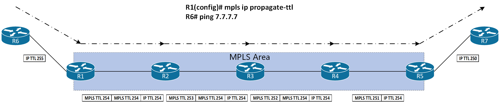<br>

traceroute实例
```
R6# traceroute 7.7.7.7
Type escape sequence to abort.
Tracing the route to 7.7.7.7
VRF info: (vrf in name/id, vrf out name/id)
  1 172.16.10.1 16 msec 28 msec 8 msec
  2 10.10.10.2 [MPLS: Labels 17/23 Exp 0] 68 msec 68 msec 36 msec
  3 10.10.20.3 [MPLS: Labels 16/23 Exp 0] 60 msec 56 msec 92 msec
  4 10.10.30.4 [MPLS: Labels 16/23 Exp 0] 80 msec 72 msec 68 msec
  5 172.16.20.5 [MPLS: Label 23 Exp 0] 36 msec 56 msec 68 msec
  6 172.16.20.7 64 msec 88 msec 68 msec
```
<br>

2)MPLS区域与非MPLS区域的TTL不互通<br>
ingress LSR后, MPLS区域重新生成TTL; egress LST后, 非MPLS区域延续MPLS区域的TTL. traceroute只会出现MPLS区域外的位置. 使用以下指令配置在ingress LSR上:<br>
`(config)# no mpls ip propagate-ttl`<br>

图17 - ICMP在MPLS的应用2<br>
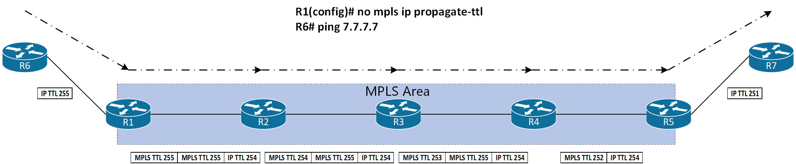<br>

traceroute实例
```
R6# traceroute 7.7.7.7
Type escape sequence to abort.
Tracing the route to 7.7.7.7
VRF info: (vrf in name/id, vrf out name/id)
  1 172.16.10.1 12 msec 4 msec 8 msec
  2 172.16.20.5 [MPLS: Label 23 Exp 0] 40 msec 60 msec 52 msec
  3 172.16.20.7 48 msec 60 msec 52 msec
```
<br>
<br>

##### 4.as-override
配置语法<br>
`(config-router)# neighbor <neighbor_peer> as-override`<br>

参考示例8
<br>
<br>

##### 5.allowas-in
BGP在接收NLRI时, 允许当前所在AS number在AS path中出现, 并且指定容许出现的次数<br>
该特性只能在real eBGP peer中有效, 即使相同AS内的condeferation eBGP peer中也不可行<br>

配置语法<br>
`(config-router)# neighbor <neighbor_peer> allowas-in [<appear_count>]` 
<br>

参考示例12
<br>
<br>

##### 6.Route Otigin
当满足以下三个条件:<br>
1.PE to CE为eBGP peer<br>

2.site与backbone有两个或以上的连接点<br>

3.PE使用as-override(通常为VPN的多个site使用相同的AS number情况下)<br>

为阻止loop的发生, 使用route origin(BGP Extended Community, Cisco称为Site of Origin)
<br>
<br>

图16<br>
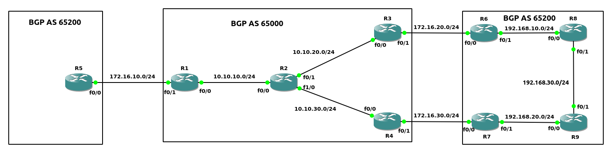<br>

示例15(如图16)
```
配置MPLS区域的OSPF
R1(config)# router ospf 1
R1(config-router)# network 192.168.1.1 0.0.0.0 area 0
R1(config-router)# network 10.10.10.0 0.0.0.255 area 0

R2(config)# router ospf 1
R2(config-router)# network 192.168.1.2 0.0.0.0 area 0
R2(config-router)# network 10.10.0.0 0.0.255.255 area 0

R3(config)# router ospf 1
R3(config-router)# network 192.168.1.3 0.0.0.0 area 0
R3(config-router)# network 10.10.20.0 0.0.0.255 area 0

R4(config)# router ospf 1
R4(config-router)# network 192.168.1.4 0.0.0.0 area 0
R4(config-router)# network 10.10.30.0 0.0.0.255 area 0


配置MPLS接口
R1(config)# router ospf 1
R1(config-router)# mpls ldp autoconfig

R2(config)# router ospf 1
R2(config-router)# mpls ldp autoconfig

R3(config)# router ospf 1
R3(config-router)# mpls ldp autoconfig

R4(config)# router ospf 1
R4(config-router)# mpls ldp autoconfig


配置MPLS区域的iBGP
R1(config)# router bgp 65000
R1(config-router)# neighbor 192.168.1.3 remote-as 65000
R1(config-router)# neighbor 192.168.1.3 update-source loopback0
R1(config-router)# neighbor 192.168.1.4 remote-as 65000
R1(config-router)# neighbor 192.168.1.4 update-source loopback0
R1(config-router)# redistribute ospf 1
R1(config-router)# address-family vpnv4
R1(config-router-af)# neighbor 192.168.1.3 activate
R1(config-router-af)# neighbor 192.168.1.3 send-community both
R1(config-router-af)# neighbor 192.168.1.4 activate
R1(config-router-af)# neighbor 192.168.1.4 send-community both

R3(config)# router bgp 65000
R3(config-router)# neighbor 192.168.1.1 remote-as 65000
R3(config-router)# neighbor 192.168.1.1 update-source loopback0
R3(config-router)# neighbor 192.168.1.4 remote-as 65000
R3(config-router)# neighbor 192.168.1.4 update-source loopback0
R3(config-router)# redistribute ospf 1
R3(config-router)# address-family vpnv4
R3(config-router-af)# neighbor 192.168.1.1 activate 
R3(config-router-af)# neighbor 192.168.1.1 send-community both
R3(config-router-af)# neighbor 192.168.1.4 activate
R3(config-router-af)# neighbor 192.168.1.4 send-community both

R4(config)# router bgp 65000
R4(config-router)# neighbor 192.168.1.1 remote-as 65000
R4(config-router)# neighbor 192.168.1.1 update-source loopback0
R4(config-router)# neighbor 192.168.1.3 remote-as 65000
R4(config-router)# neighbor 192.168.1.3 update-source loopback0
R4(config-router)# redistribute ospf 1
R4(config-router)# address-family vpnv4
R4(config-router-af)# neighbor 192.168.1.1 activate
R4(config-router-af)# neighbor 192.168.1.1 send-community both
R4(config-router-af)# neighbor 192.168.1.3 activate
R4(config-router-af)# neighbor 192.168.1.3 send-community both


在PE配置VRF
R1(config)# ip vrf Company_A
R1(config-vrf)# rd 1:100
R1(config-vrf)# route-target both 100:100
R1(config-vrf)# int f0/1
R1(config-if)# ip vrf forwarding Company_A
R1(config-if)# ip add 172.16.10.1 255.255.255.0

R3(config)# ip vrf Company_A
R3(config-vrf)# rd 1:100
R3(config-vrf)# route-target both 100:100
R3(config-vrf)# int f0/1
R3(config-if)# ip vrf forwarding Company_A
R3(config-if)# ip add 172.16.20.3 255.255.255.0

R4(config)# ip vrf Company_A
R4(config-vrf)# rd 1:100
R4(config-vrf)# route-target both 100:100
R4(config-vrf)# int f0/1
R4(config-if)# ip vrf forwarding Company_A
R4(config-if)# ip add 172.16.30.4 255.255.255.0


配置AS 65200的OSPF
R6(config)# router ospf 1
R6(config-router)# network 192.168.1.6 0.0.0.0 area 0
R6(config-router)# network 192.168.10.0 0.0.0.255 area 0

R7(config)# router ospf 1
R7(config-router)# network 192.168.1.7 0.0.0.0 area 0
R7(config-router)# network 192.168.20.0 0.0.0.255 area 0

R8(config)# router ospf 1
R8(config-router)# network 192.168.1.8 0.0.0.0 area 0
R8(config-router)# network 192.168.0.0 0.0.255.255 area 0

R9(config)# router ospf 1
R9(config-router)# network 192.168.1.9 0.0.0.0 area 0
R9(config-router)# network 192.168.0.0 0.0.255.255 area 0


配置PE-to-CE(eBGP)
R1(config)# router bgp 65000
R1(config-router)# address-family ipv4 vrf Company_A
R1(config-router-af)# neighbor 172.16.10.5 remote-as 65200
R1(config-router-af)# neighbor 172.16.10.5 activate
R1(config-router-af)# neighbor 172.16.10.5 as-override

R5(config)# router bgp 65200
R5(config-router)# neighbor 172.16.10.1 remote-as 65000
R5(config-router)# redistribute connected

R3(config-router)# address-family ipv4 vrf Company_A
R3(config-router-af)# neighbor 172.16.20.6 remote-as 65200
R3(config-router-af)# neighbor 172.16.20.6 activate
R3(config-router-af)# neighbor 172.16.20.6 as-override

R6(config)# router bgp 65200
R6(config-router)# neighbor 172.16.20.3 remote-as 65000
R6(config-router)# redistribute ospf 1
R6(config-router)# redistribute connected

R4(config)# router bgp 65000
R4(config-router)# address-family ipv4 vrf Company_A
R4(config-router-af)# neighbor 172.16.30.7 remote-as 65200
R4(config-router-af)# neighbor 172.16.30.7 activate
R4(config-router-af)# neighbor 172.16.30.7 as-override

R7(config)# router bgp 65200
R7(config-router)# neighbor 172.16.30.4 remote-as 65000
R7(config-router)# redistribute ospf 1
R7(config-router)# redistribute connected


R3 --> R4 --> R7方向传播AS 65200的NLRI
R3# show bgp vpnv4 unicast all neighbor 192.168.1.4 advertised-routes | include 192.168.10.0
 *>  192.168.10.0     172.16.20.6              0             0 65200 ?

R4# show bgp vrf Company_A vpnv4 unicast neighbor 172.16.30.7 advertised-route | include 192.168.10.0
 *>i 192.168.10.0     192.168.1.3              0    100      0 65200 ?

R7# show bgp ipv4 unicast neighbor 172.16.30.4 route | include 192.168.10.0
 *   192.168.10.0     172.16.30.4                            0 65000 65000 ?


R4 --> R3 --> R6方向传播AS 65200的NLRI
R4# show bgp vpnv4 unicast all neighbor 192.168.1.3 advertised-route | include 192.168.20.0
 *>  192.168.20.0     172.16.30.7              0             0 65200 ?

R3# show bgp vrf Company_A vpnv4 unicast neighbor 172.16.20.6 advertised-route | include 192.168.20.0
 *>i 192.168.20.0     192.168.1.4              0    100      0 65200 ?

R6# show bgp ipv4 unicast neighbor 172.16.20.3 route | include 192.168.20.0
 *   192.168.20.0     172.16.20.3                            0 65000 65000 ?


配置SOO
R3(config)# router bgp 65000
R3(config-router)# address-family ipv4 vrf Company_A
R3(config-router-af)# neighbor 172.16.20.6 soo 65200:100
R3(config-router-af)# neighbor 172.16.20.6 send-community both
R3# clear bgp vrf Company_A ipv4 unicast 172.16.20.6

R4(config)# router bgp 65000
R4(config-router)# address-family ipv4 vrf Company_A
R4(config-router-af)# neighbor 172.16.30.7 soo 65200:100
R4(config-router-af)# neighbor 172.16.30.7 send-community both
R4# clear bgp vrf Company_A ipv4 unicast 172.16.30.7


验证结果
R4# show bgp vrf Company_A vpnv4 unicast neighbor 172.16.30.7 advertised-route | include 192.168.10.0
 *>i 192.168.10.0     192.168.1.3              0    100      0 65200 ?

R3# show bgp vrf Company_A vpnv4 unicast neighbor 172.16.20.6 advertised-route | include 192.168.20.0
 *>i 192.168.20.0     192.168.1.4              0    100      0 65200 ?
```
<br>
<br>


引用:<br>
[1] MPLS Architecture: https://datatracker.ietf.org/doc/html/rfc3031

[2] MPLS Label Stack Encoding: https://datatracker.ietf.org/doc/html/rfc3032

[3] LDP Specification: https://datatracker.ietf.org/doc/html/rfc5036

[4] ICMP Extensions for Multiprotocol Label Switching: https://datatracker.ietf.org/doc/html/rfc4950

[5] BGP/MPLS VPNs: https://datatracker.ietf.org/doc/html/rfc4364

[6] BGP Extended Communities Attribute: https://datatracker.ietf.org/doc/html/rfc4360

[7] Carrying Label Information in BGP-4: https://datatracker.ietf.org/doc/html/rfc3107

[8] eBGP between PE and CE(with one AS number in VRF): https://community.cisco.com/t5/service-providers-knowledge-base/bgp-pe-ce-routing-protocol-overview-in-mpls-vpns-part-ii/ta-p/3143007
