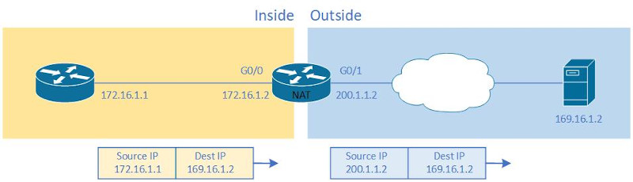
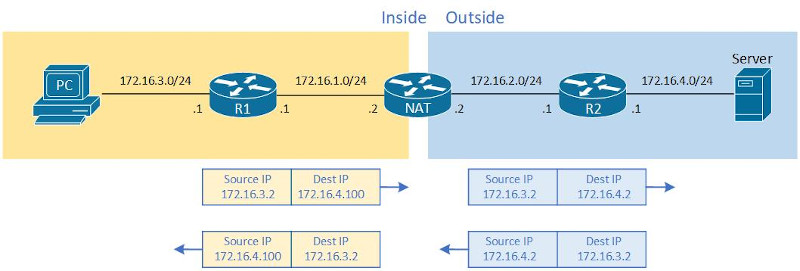

缓解IPv4耗尽的方案<br>
1.NAT(Network Address Translator)
<br>

2.private IPv4
<br>

3.CIDR(Classless Interdomain Routing)<br>
&emsp;&emsp;1)网络汇总 - 对网络进行汇总, 减少路由表的大小<br>
&emsp;&emsp;2)子网划分 - 赋予A/B/C类网络的子集给用户, 较少地址浪费
<br>
<br>


#### NAT
1.static NAT<br>
&emsp;&emsp;一个私有IP, 对应一个公有IP进行转化
<br>

2.dynamic NAT<br>
&emsp;&emsp;一个私有IP, 从公有IP池中动态选取一个公有IP进行转化
<br>

3.PAT<br>
&emsp;&emsp;私有IP与端口, 转化为公有IP与端口
<br>
<br>
<br>

1.static nat<br>
a) inside static nat<br>
图1<br>
<br>
图2<br>
<br>
配置步骤
```
1)配置inside接口
(config-if)# ip nat inside

2)配置outside接口
(config-if)# ip nat outside

3)配置nat
(config)# ip nat inside source static <inside_local_add> <inside_global_add>
```

实例(如图1)
```
(config)# int g0/0
(config-if)# ip nat inside
(config)# int g0/1
(config-if)# ip nat outside
(config)# ip nat inside source static 172.16.1.1 200.1.1.2

# show ip nat translations
Pro Inside global      Inside local       Outside local      Outside global
--- 200.1.1.2          172.16.1.1         ---                ---

# show ip nat statistics
Total active translations: 2 (1 static, 1 dynamic; 1 extended)
Outside interfaces:
  GigabitEthernet0/1
Inside interfaces: 
  GigabitEthernet0/0
Hits: 7  Misses: 0
CEF Translated packets: 6, CEF Punted packets: 0
Expired translations: 0
Dynamic mappings:
Appl doors: 0
Normal doors: 0
Queued Packets: 0
```
<br>

b) outside static nat<br>
图3<br>
<br>
图4<br>
<br>
配置步骤
```
1)配置outside接口
(config-if)# ip nat outside

2)配置inside接口
(config-if)# ip nat inside

3)配置nat
(config)# ip nat outside source static <outside_global_add> <outside_local_add>
```

实例(如图3)
```
R1(config)#router ospf 1
R1(config-router)#router-id 1.1.1.1
R1(config-router)#int f0/0
R1(config-if)#ip add 172.16.1.1 255.255.255.0
R1(config-if)#no shutdown
R1(config-if)#ip ospf 1 area 0
R1(config-if)#int f0/1
R1(config-if)#ip add 172.16.3.1 255.255.255.0  
R1(config-if)#no shutdown
R1(config-if)#ip ospf 1 area 0

NAT(config)#router ospf 1
NAT(config-router)#router-id 3.3.3.3
NAT(config-router)#int f0/0
NAT(config-if)#ip add 172.16.1.2 255.255.255.0
NAT(config-if)#no shutdown
NAT(config-if)#ip ospf 1 area 0
NAT(config-if)#int f0/1
NAT(config-if)#ip add 172.16.2.2 255.255.255.0  
NAT(config-if)#no shutdown
NAT(config-if)#ip ospf 1 area 0

R2(config)#router ospf 1
R2(config-router)#router-id 2.2.2.2
R2(config-router)#int f0/0
R2(config-if)#ip add 172.16.2.1 255.255.255.0
R2(config-if)#no shutdown
R2(config-if)#ip ospf 1 area 0
R2(config-if)#int f0/1
R2(config-if)#ip add 172.16.4.1 255.255.255.0  
R2(config-if)#no shutdown
R2(config-if)#ip ospf 1 area 0

NAT(config)# int f0/1
NAT(config-if)# ip nat outside
NAT(config)# int f0/0
NAT(config-if)# ip nat inside
NAT(config)# ip nat outside source static 172.16.4.2 172.16.4.100

测试结果
PC> ping 172.16.4.100
84 bytes from 172.16.4.100 icmp_seq=1 ttl=61 time=56.823 ms

NAT# show ip nat translations
Pro Inside global      Inside local       Outside local      Outside global
--- ---                ---                172.16.4.100       172.16.4.2
icmp 172.16.3.2:23369  172.16.3.2:23369   172.16.4.100:23369 172.16.4.2:23369
```
<br>
<br>

2.配置dynamic nat<br>
步骤
```
1)配置inside local接口
(config-if)# ip nat inside

2)配置inside global接口
(config-if)# ip nat outside

3)配置ACL(允许nat转化的inside local地址)
(config)# access-list <acl_num> permit {<subnet_id> <wildcard_mask> | <ip_add> | any}

4)配置inside global地址池
(config)# ip nat pool <pool_name> <first_add> <last_add> netmask <subnet_mask>

5)配置nat
(config)# ip nat inside source list <acl_num> pool <pool_name>
```

实例(如图1)
```
(config)# int g0/0
(config-if)# ip nat inside
(config)# int g0/1
(config-if)# ip nat outside
(config)# access-list 1 permit 172.16.1.0 0.0.0.255
(config)# ip nat pool add_pool 200.1.1.2 200.1.1.3 netmask 255.255.255.0
(config)# ip nat inside source list 1 pool add_pool

# show ip nat translation
Pro Inside global      Inside local       Outside local      Outside global
--- 200.1.1.2          172.16.1.1         ---                ---

# show ip nat statistics
Total active translations: 2 (0 static, 2 dynamic; 1 extended)
Outside interfaces:
  GigabitEthernet0/1
Inside interfaces: 
  GigabitEthernet0/0
Hits: 16  Misses: 0
CEF Translated packets: 15, CEF Punted packets: 0
Expired translations: 1
Dynamic mappings:
-- Inside Source
[Id: 1] access-list 1 pool add_pool refcount 2
 pool add_pool: netmask 255.255.255.0
	start 200.1.1.2 end 200.1.1.3
	type generic, total addresses 2, allocated 1 (50%), misses 0
Appl doors: 0
Normal doors: 0
Queued Packets: 0
```
<br>
<br>

3.配置PAT(NAT overload)<br>
步骤(单inside global地址版本)
```
1)配置inside local接口
(config-if)# ip nat inside

2)配置inside global接口
(config-if)# ip nat outside

3)配置ACL(允许nat转化的inside local地址)
(config)# access-list <acl_num> permit {<subnet_id> <wildcard_mask> | <ip_add> | any}

4)配置nat
(config)# ip nat inside source list <acl_num> interface <inside_global_interface> overload
```
<br>

步骤(多inside global地址版本)
```
1)配置inside local接口
(config-if)# ip nat inside

2)配置inside global接口
(config-if)# ip nat outside

3)配置ACL(允许nat转化的inside local地址)
(config)# access-list <acl_num> permit {<subnet_id> <wildcard_mask> | <ip_add> | any}

4)配置inside global地址池
(config)# ip nat pool <pool_name> <first_add> <last_add> netmask <subnet_mask>

5)配置nat
(config)# ip nat inside source list <acl_num> pool <pool_name> overload
```
<br>

实例(单inside global地址版本)
```
(config)# int g0/0
(config-if)# ip nat inside
(config)# int g0/1
(config-if)# ip nat outside
(config)# access-list 1 permit 172.16.1.0 0.0.0.255
(config)# ip nat inside source list 1 interface g0/1 overload

# show ip nat translation
Pro Inside global      Inside local       Outside local      Outside global
icmp 200.1.1.2:3       172.16.1.1:3       200.1.1.1:3        200.1.1.1:3

# show ip nat statistics
Total active translations: 1 (0 static, 1 dynamic; 1 extended)
Outside interfaces:
  GigabitEthernet0/1
Inside interfaces: 
  GigabitEthernet0/0
Hits: 25  Misses: 0
CEF Translated packets: 24, CEF Punted packets: 0
Expired translations: 2
Dynamic mappings:
-- Inside Source
[Id: 2] access-list 1 interface GigabitEthernet0/1 refcount 1
Appl doors: 0
Normal doors: 0
Queued Packets: 0
```
<br>
<br>

引用:<br>
[1] NAT: https://www.rfc-editor.org/rfc/rfc3022<br>

[2] private IPv4: https://www.rfc-editor.org/rfc/rfc1918.html<br>

[3] CIDR: https://www.rfc-editor.org/rfc/rfc4632.html
