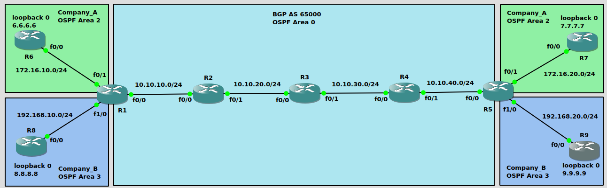

图1<br>
<br>

示例1(如图1)
```
配置OSPF
R1(config)# router ospf 1
R1(config-router)# network 10.10.10.0 0.0.0.255 area 0
R1(config-router)# network 1.1.1.1 0.0.0.0 area 0

R2(config)# router ospf 1
R2(config-router)# network 10.10.0.0 0.0.255.255 area 0
R2(config-router)# network 2.2.2.2 0.0.0.0 area 0

R3(config)# router ospf 1
R3(config-router)# network 10.10.0.0 0.0.255.255 area 0
R3(config-router)# network 3.3.3.3 0.0.0.0 area 0

R4(config)# router ospf 1 
R4(config-router)# network 10.10.0.0 0.0.255.255 area 0
R4(config-router)# network 4.4.4.4 0.0.0.0 area 0

R5(config)# router ospf 1
R5(config-router)# network 10.10.40.0 0.0.0.255 area 0
R5(config-router)# network 5.5.5.5 0.0.0.0 area 0


配置mpls
R1(config)# int f0/0
R1(config-if)# mpls ip

R2(config)# int f0/0
R2(config-if)# mpls ip
R2(config-if)# int f0/1
R2(config-if)# mpls ip

R3(config)# int f0/0
R3(config-if)# mpls ip
R3(config-if)# int f0/1
R3(config-if)# mpls ip

R4(config)# int f0/0
R4(config-if)# mpls ip
R4(config-if)# int f0/1
R4(config-if)# mpls ip

R5(config)# int f0/0
R5(config-if)# mpls ip


配置BGP
R1(config)# router bgp 65000
R1(config-router)# neighbor 5.5.5.5 remote-as 65000
R1(config-router)# neighbor 5.5.5.5 update-source loopback0
R1(config-router)# redistribute ospf 1
R1(config-router)# address-family vpnv4           
R1(config-router-af)# neighbor 5.5.5.5 activate
R1(config-router-af)# neighbor 5.5.5.5 send-community extended

R5(config)# router bgp 65000
R5(config-router)# neighbor 1.1.1.1 remote-as 65000
R5(config-router)# neighbor 1.1.1.1 update-source loopback0
R5(config-router)# redistribute ospf 1
R5(config-router)# address-family vpnv4
R5(config-router-af)# neighbor 1.1.1.1 activate
R5(config-router-af)# neighbor 1.1.1.1 send-community both


R1# show bgp vpnv4 unicast all summary
R1# show bgp vpnv4 unicast all summary | begin Neighbor
Neighbor        V           AS MsgRcvd MsgSent   TblVer  InQ OutQ Up/Down  State/PfxRcd
5.5.5.5         4        65000      17      24       25    0    0 00:02:48        4


配置PE-to-CE(OSPF)
R1(config)# router ospf 2 vrf Company_A
R1(config-router)# network 172.16.10.0 0.0.0.255 area 2
R1(config-router)# router ospf 3 vrf Company_B 
R1(config-router)# network 192.168.10.0 0.0.0.255 area 3

R6(config)# router ospf 2
R6(config-router)# router-id 6.6.6.6
R6(config-router)# network 172.16.10.0 0.0.0.255 area 2
R6(config-router)# network 6.6.6.6 0.0.0.0 area 2

R8(config)# router ospf 3
R8(config-router)# router-id 8.8.8.8
R8(config-router)# network 192.168.10.0 0.0.0.255 area 3
R8(config-router)# network 8.8.8.8 0.0.0.0 area 3

R5(config)# router ospf 2 vrf Company_A
R5(config-router)# network 172.16.20.0 0.0.0.255 area 2
R5(config-router)# router ospf 3 vrf Company_B
R5(config-router)# network 192.168.20.0 0.0.0.255 area 3

R7(config)# router ospf 2
R7(config-router)# router-id 7.7.7.7
R7(config-router)# network 172.16.20.0 0.0.0.255 area 2
R7(config-router)# network 7.7.7.7 0.0.0.0 area 2

R9(config)# router ospf 3
R9(config-router)# router-id 9.9.9.9
R9(config-router)# network 192.168.20.0 0.0.0.255 area 3
R9(config-router)# network 9.9.9.9 0.0.0.0 area 3


在PE配置VRF
R1(config)# ip vrf Company_A
R1(config-vrf)# rd 1:100
R1(config-vrf)# route-target both 1:100
R1(config-vrf)# int f0/1
R1(config-if)# ip vrf forwarding Company_A
R1(config-if)# ip add 172.16.10.1 255.255.255.0
R1(config)# ip vrf Company_B
R1(config-vrf)# rd 1:110
R1(config-vrf)# route-target both 1:110
R1(config-vrf)# int f1/0
R1(config-if)# ip vrf forwarding Company_B
R1(config-if)# ip add 192.168.10.1 255.255.255.0


R5(config)# ip vrf Company_A
R5(config-vrf)# rd 1:100
R5(config-vrf)# route-target both 1:100
R5(config)# int f0/1
R5(config-if)# ip vrf forwarding Company_A
R5(config-if)# ip add 172.16.20.5 255.255.255.0
R5(config)# ip vrf Company_B
R5(config-vrf)# rd 1:110
R5(config-vrf)# route-target both 1:110
R5(config)# int f1/0
R5(config-if)# ip vrf forwarding Company_B
R5(config-if)# ip add 192.168.20.5 255.255.255.0
** 接口配置vrf会将接口IP移除, 重新再配置IP即可


R1# show ip route vrf Company_A | begin Gateway
Gateway of last resort is not set

      6.0.0.0/32 is subnetted, 1 subnets
D        6.6.6.6 [90/2662400] via 172.16.10.6, 01:58:27, FastEthernet0/1
      172.16.0.0/16 is variably subnetted, 2 subnets, 2 masks
C        172.16.10.0/24 is directly connected, FastEthernet0/1
L        172.16.10.1/32 is directly connected, FastEthernet0/1


redistribute
R1(config)# router ospf 2 vrf Company_A                
R1(config-router)# redistribute bgp 65000
R1(config-router)# router ospf 3 vrf Company_B
R1(config-router)# redistribute bgp 65000
R1(config-router)# router bgp 65000
R1(config-router)# address-family ipv4 vrf Company_A
R1(config-router-af)# redistribute ospf 2
R1(config-router-af)# address-family ipv4 unicast vrf Company_B
R1(config-router-af)# redistribute ospf 3

R5(config)# router ospf 2 vrf Company_A
R5(config-router)# redistribute bgp 65000
R5(config-router)# router ospf 3 vrf Company_B
R5(config-router)# redistribute bgp 65000
R5(config-router)# router bgp 65000
R5(config-router)# address-family ipv4 vrf Company_A
R5(config-router-af)# redistribute ospf 2
R5(config-router-af)# address-family ipv4 unicast vrf Company_B
R5(config-router-af)# redistribute ospf 3


** PE-to-CE允许使用路由方式:
1.static

2.RIPv2

3.OSPF

4.BGP
```
