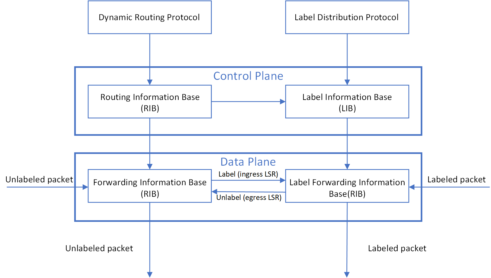
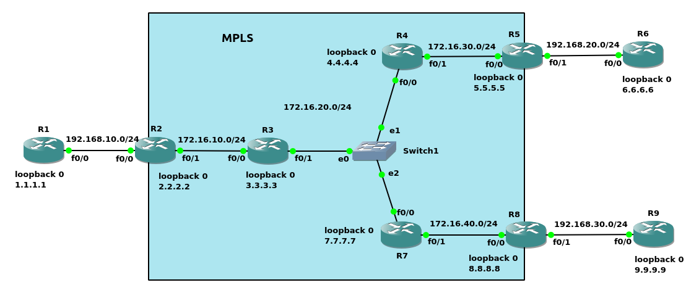
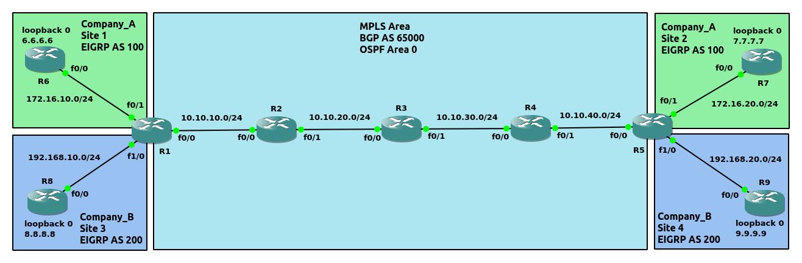
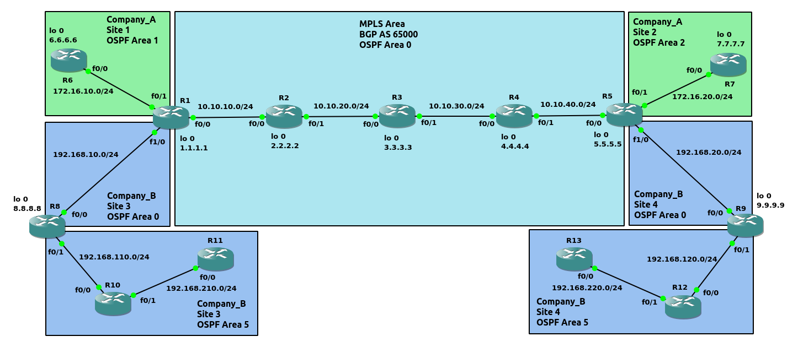
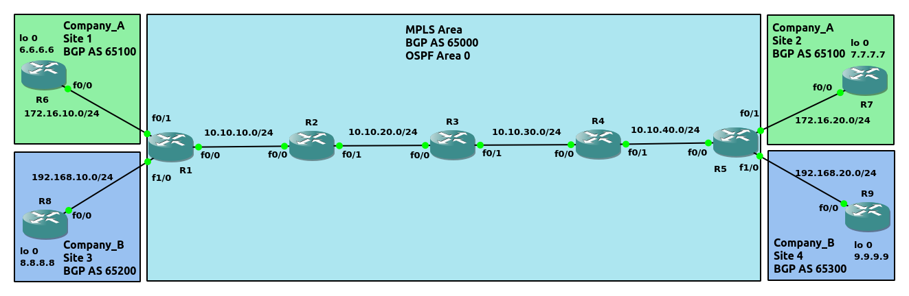
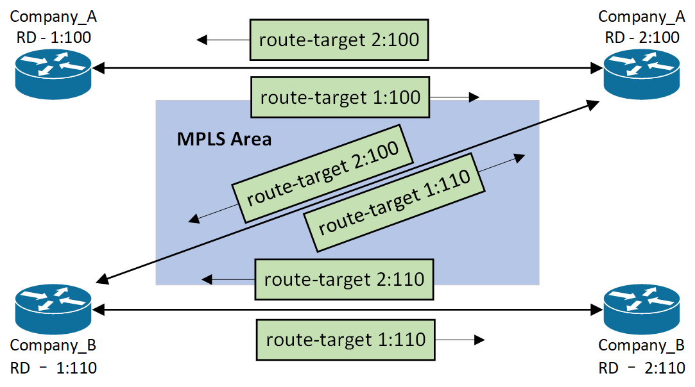

MPLS(Multi-Protocol Label Switching)<br>
使用Label交换技术的路由器, 依赖于动态路由协议或静态配置路由<br>
每个路由器针对特定的路由, 有唯一的一个label值<br>
每个路由器需要开启Cisco Express Forwarding (CEF)
<br>
<br>

##### 名词解析
LSR(Label Switch Router)<br>
使用MPLS进行label交换的路由器. 具体细分为以下类别:<br>
&emsp;&emsp;normal LSR - 位于MPLS非边缘, 在入口删除incoming label, 在出口添加outgoing label<br>
&emsp;&emsp;edge-LSR - 位于MPLS边缘的路由器, ingress LSR在MPLS domain入口处添加label; egress LSR在MPLS domain出口处删除label
<br>
    
LSP(Label Switched Path)<br>
到达目标, 所通过的LSR路径
<br>

LDP(Label Distribution Protocol)<br>
绑定label和子网地址的动态协议. 对应于IP route的Dynamic Routing Protocol
<br>

LIB(Label Information Base)<br>
保存label与发送该label的neighbor值对. 对应于IP route的RIB(Route Information Base)
<br>

LFIB(Label Forwarding Information Base)<br>
实际转发时的参照表. 对应于IP route的FIB(Forwarding Information Base)
<br>

图1 - MPLS node结构图<br>

<br>
<br>

图2 - MPLS Label在package中的位置<br>

<br>
<br>

图3 - MPLS Label的结构<br>
<br>
**MPLS Label字段解析:**<br>
Label number - 20 bits, 用于对指定network进行label<br>
QoS - quality of service<br>
Bottom-of-Stack - 当前Label是否位于Label stack的最底层(即紧邻Layer 3)<br>
TTL - 与IP packet的TTL字段一致, 用于阻止loop
<br>
<br>

MPLS(unicast)在不同类型帧的Type字段值<br>
Ethernet - 0x8847<br>
HDLC - 0x8847<br>
PPP - 0x0281
<br>
<br>

LDP neighbor session使用TCP 646 port<br>
<br>

在指定接口配置mpls:<br>
`(config-if)# mpls ip`
<br>
<br>

指定Label分配的范围值:<br>
`(config)# mpls label range <minimum_value> <maximum_value>`
<br>
<br>

LDP identifier:<br>
1)手动配置:<br>
`(config)# mpls ldp router-id <interface> [force]`
<br>

2)最大的loopback接口IP值<br>

3)最大的物理接口IP值
<br>
<br>

配置针对peer隐藏label:<br>
`(config)# mpls ldp advertise-labels for <network_acl> to <peer_acl>`<br>
** 对peer_acl中deny指定的下游peer, 隐藏network_acl中permit指定的网络, 隐藏其label(如示例2)<br>
** ACL只能使用standard ACL, 并且number范围为[1,99]
<br>
<br>

显示mpls特征/参数<br>
`# show mpls ldp parameters`
<br>
<br>

显示加入mpls的接口<br>
`# show mpls interfaces [<interface>] [details]`
<br>
<br>

显示mpls邻居<br>
`# show mpls ldp neighbor`<br>
** State: Oper代表established session
<br>
<br>

显示mpls discovery<br>
`# show mpls ldp discovery`
<br>
<br>

显示LIB(Label Information Base)信息<br>
`# show mpls ldp bindings [<subnet_id> {<netmask> | <mask_length>}]`
<br>
<br>

显示LFIB信息<br>
`# show mpls forwarding-table`
<br>
<br>

图4 - Frame-base MPLS<br>

<br>
<br>

图5 - Label转发<br>

<br>
<br>

示例1(如图4)
```
配置OSPF
R1(config)# router ospf 1
R1(config-router)# network 172.16.10.0 0.0.0.255 area 0
R1(config-router)# network 192.168.10.0 0.0.0.255 area 0
R1(config-router)# network 1.1.1.1 0.0.0.0 area 0

R2(config)# router ospf 1
R2(config-router)# network 172.16.0.0 0.0.255.255 area 0
R2(config-router)# network 2.2.2.2 0.0.0.0 area 0

R3(config)# router ospf 1
R3(config-router)# network 172.16.0.0 0.0.255.255 area 0
R3(config-router)# network 3.3.3.3 0.0.0.0 area 0

R4(config)# router ospf 1
R4(config-router)# network 172.16.0.0 0.0.255.255 area 0
R4(config-router)# network 4.4.4.4 0.0.0.0 area 0

R5(config)# router ospf 1
R5(config-router)# network 172.16.40.0 0.0.0.255 area 0
R5(config-router)# network 192.168.0.0 0.0.255.255 area 0
R5(config-router)# network 5.5.5.5 0.0.0.0 area 0

R6(config)# router ospf 1
R6(config-router)# network 192.168.10.0 0.0.0.255 area 0
R6(config-router)# network 6.6.6.6 0.0.0.0 area 0

R7(config)# router ospf 1
R7(config-router)# network 192.168.20.0 0.0.0.255 area 0
R7(config-router)# network 7.7.7.7 0.0.0.0 area 0

R8(config)# router ospf 1
R8(config-router)# network 192.168.30.0 0.0.0.255 area 0
R8(config-router)# network 8.8.8.8 0.0.0.0 area 0


配置MPLS(接口必须启用CEF, 默认开启)
R1(config)# int f0/0
R1(config-if)# mpls ip

R2(config)# int f0/0
R2(config-if)# mpls ip
R2(config-if)# int f0/1
R2(config-if)# mpls ip

R3(config)# int f0/0
R3(config-if)# mpls ip
R3(config-if)# int s3/0
R3(config-if)# mpls ip

R4(config)# int s3/0
R4(config-if)# mpls ip
R4(config-if)# int f0/0
R4(config-if)# mpls ip

R5(config)# int f0/0
R5(config-if)# mpls ip


查看接口是否开启CEF
R3# show cef interface f0/0 | include IP CEF
  IP CEF switching enabled
  IP CEF switching turbo vector
  IP CEF turbo switching turbo vector


查看开启MPLS的接口
R3# show mpls interfaces 
Interface              IP            Tunnel   BGP Static Operational
FastEthernet0/0        Yes (ldp)     No       No  No     Yes        
Serial3/0              Yes (ldp)     No       No  No     Yes   


查看MPLS neighbor信息
R3# show mpls ldp neighbor 
    Peer LDP Ident: 2.2.2.2:0; Local LDP Ident 3.3.3.3:0
	TCP connection: 2.2.2.2.646 - 3.3.3.3.47092
	State: Oper; Msgs sent/rcvd: 22/22; Downstream
	Up time: 00:03:52
	LDP discovery sources:
	  FastEthernet0/0, Src IP addr: 172.16.20.2
        Addresses bound to peer LDP Ident:
          172.16.10.2     172.16.20.2     2.2.2.2         
    Peer LDP Ident: 4.4.4.4:0; Local LDP Ident 3.3.3.3:0
	TCP connection: 4.4.4.4.46458 - 3.3.3.3.646
	State: Oper; Msgs sent/rcvd: 21/21; Downstream
	Up time: 00:03:30
	LDP discovery sources:
	  Serial3/0, Src IP addr: 172.16.30.4
        Addresses bound to peer LDP Ident:
          172.16.40.4     172.16.30.4     4.4.4.4 


查看LIB
R3# show mpls ldp bindings 192.168.20.0 24
  lib entry: 192.168.20.0/24, rev 28
	local binding:  label: 26
	remote binding: lsr: 2.2.2.2:0, label: 26
	remote binding: lsr: 4.4.4.4:0, label: 26


查看LFIB
R3# show mpls forwarding-table
Local      Outgoing   Prefix           Bytes Label   Outgoing   Next Hop    
Label      Label      or Tunnel Id     Switched      interface              
16         16         1.1.1.1/32       0             Fa0/0      172.16.10.2 
17         Pop Label  2.2.2.2evolve/32       0             Fa0/0      172.16.10.2 
18         Pop Label  4.4.4.4/32       0             Fa0/1      192.168.10.4
19         19         5.5.5.5/32       0             Fa0/1      192.168.10.4
20         20         6.6.6.6/32       0             Fa0/1      192.168.10.4
21         Pop Label  10.10.20.0/24    1710          Fa0/0      172.16.10.2 
22         Pop Label  10.10.30.0/24    570           Fa0/1      192.168.10.4
23         Pop Label  10.10.40.0/24    1140          Fa0/1      192.168.10.4


调整LSR的Label范围
R1(config)# mpls label range 1000 2000
R1# copy run start

R2(config)# mpls label range 2000 3000
R1# copy run start

R3(config)# mpls label range 3000 4000
R1# copy run start

R4(config)# mpls label range 4000 5000
R1# copy run start

R5(config)# mpls label range 5000 6000
R1# copy run start

重启路由器R1/R2/R3/R4/R5


查看LIB
R1# show mpls ldp bindings | begin 24
  lib entry: 172.16.10.0/24, rev 4
	local binding:  label: imp-null
	remote binding: lsr: 2.2.2.2:0, label: imp-null
  lib entry: 172.16.20.0/24, rev 30
	local binding:  label: 1011
	remote binding: lsr: 2.2.2.2:0, label: imp-null
  lib entry: 172.16.30.0/24, rev 22
	local binding:  label: 1007
	remote binding: lsr: 2.2.2.2:0, label: 2003
  lib entry: 172.16.40.0/24, rev 28
	local binding:  label: 1010
	remote binding: lsr: 2.2.2.2:0, label: 2002
  lib entry: 192.168.10.0/24, rev 6
	local binding:  label: imp-null
	remote binding: lsr: 2.2.2.2:0, label: 2011
  lib entry: 192.168.20.0/24, rev 24
	local binding:  label: 1008
	remote binding: lsr: 2.2.2.2:0, label: 2009
  lib entry: 192.168.30.0/24, rev 26
	local binding:  label: 1009
	remote binding: lsr: 2.2.2.2:0, label: 2010


R4# show mpls ldp bindings | begin 24  
  lib entry: 172.16.10.0/24, rev 20
	local binding:  label: 4006
	remote binding: lsr: 3.3.3.3:0, label: 3003
	remote binding: lsr: 5.5.5.5:0, label: 5009
  lib entry: 172.16.20.0/24, rev 10
	local binding:  label: 4001
	remote binding: lsr: 3.3.3.3:0, label: imp-null
	remote binding: lsr: 5.5.5.5:0, label: 5010
  lib entry: 172.16.30.0/24, rev 6
	local binding:  label: imp-null
	remote binding: lsr: 3.3.3.3:0, label: imp-null
	remote binding: lsr: 5.5.5.5:0, label: 5007
  lib entry: 172.16.40.0/24, rev 4
	local binding:  label: imp-null
	remote binding: lsr: 3.3.3.3:0, label: 3001
	remote binding: lsr: 5.5.5.5:0, label: imp-null
  lib entry: 192.168.10.0/24, rev 30
	local binding:  label: 4011
	remote binding: lsr: 5.5.5.5:0, label: 5008
	remote binding: lsr: 3.3.3.3:0, label: 3011
  lib entry: 192.168.20.0/24, rev 22
	local binding:  label: 4007
	remote binding: lsr: 5.5.5.5:0, label: imp-null
        remote binding: lsr: 3.3.3.3:0, label: 3009
  lib entry: 192.168.30.0/24, rev 24
        local binding:  label: 4008
        remote binding: lsr: 5.5.5.5:0, label: imp-null
        remote binding: lsr: 3.3.3.3:0, label: 3010


查看LFIB
R1# show mpls forwarding-table 192.168.20.0 24
Local      Outgoing   Prefix           Bytes Label   Outgoing   Next Hop    
Label      Label      or Tunnel Id     Switched      interface              
1008       2009       192.168.20.0/24  0             Fa0/0      172.16.10.2

R2# show mpls forwarding-table 192.168.20.0 24
Local      Outgoing   Prefix           Bytes Label   Outgoing   Next Hop    
Label      Label      or Tunnel Id     Switched      interface              
2009       3009       192.168.20.0/24  0             Fa0/1      172.16.20.3

R3# show mpls forwarding-table 192.168.20.0 24
Local      Outgoing   Prefix           Bytes Label   Outgoing   Next Hop    
Label      Label      or Tunnel Id     Switched      interface              
3009       4007       192.168.20.0/24  0             Se3/0      point2point

R4# show mpls forwarding-table 192.168.20.0 24
Local      Outgoing   Prefix           Bytes Label   Outgoing   Next Hop    
Label      Label      or Tunnel Id     Switched      interface              
4007       Pop Label  192.168.20.0/24  0             Fa0/0      172.16.40.5 

R5# show mpls forwarding-table 192.168.20.0 24
Local      Outgoing   Prefix           Bytes Label   Outgoing   Next Hop    
Label      Label      or Tunnel Id     Switched      interface              
None       No Label   192.168.20.0/24  0             punt    


解析(参考图5):
1.针对特定network prefix, 当前LSR出口处的Label为下一跳LSR的Label

2.LSR对connected network不进行Label操作, 并且传递imp-null(LDP默认使用Label 3, Label 0-15为保留Label)给其他LSR(Penultimate Hop Popping特性, Cisco默认使用该特性)

3.Penultimate Hop Popping
如果不使用该特性, egress LSR执行pop label(Label lookup, LFIB操作)后, 再进行IP网络的下一跳匹配(Layer 3 lookup, FIB操作)
使用该特性, 在egress LSR的Upstream LSR进行pop label, 因此在egress LSR只进行Layer 3 lookup
```
<br>
<br>

图6<br>
<br>

示例2(如图6)
```
配置OSPF
R1(config)# router ospf 1
R1(config-router)# network 192.168.10.0 0.0.0.255 area 0
R1(config-router)# network 1.1.1.1 0.0.0.0 area 0

R2(config)# router ospf 1
R2(config-router)# network 192.168.10.0 0.0.0.255 area 0
R2(config-router)# network 172.16.10.0 0.0.0.255 area 0
R2(config-router)# network 2.2.2.2 0.0.0.0 area 0

R3(config)# router ospf 1
R3(config-router)# network 172.16.0.0 0.0.255.255 area 0
R3(config-router)# network 3.3.3.3 0.0.0.0 area 0

R4(config)# router ospf 1
R4(config-router)# network 172.16.0.0 0.0.255.255 area 0
R4(config-router)# network 4.4.4.4 0.0.0.0 area 0

R5(config)# router ospf 1
R5(config-router)# network 172.16.30.0 0.0.0.255 area 0
R5(config-router)# network 192.168.20.0 0.0.0.255 area 0
R5(config-router)# network 5.5.5.5 0.0.0.0 area 0

R6(config)# router ospf 1
R6(config-router)# network 192.168.20.0 0.0.0.255 area 0
R6(config-router)# network 6.6.6.6 0.0.0.0 area 0

R7(config)# router ospf 1
R7(config-router)# network 172.16.0.0 0.0.255.255 area 0
R7(config-router)# network 7.7.7.7 0.0.0.0 area 0

R8(config)# router ospf 1
R8(config-router)# network 172.16.40.0 0.0.0.255 area 0
R8(config-router)# network 192.168.30.0 0.0.0.255 area 0
R8(config-router)# network 8.8.8.8 0.0.0.0 area 0

R9(config)# router ospf 1
R9(config-router)# network 192.168.30.0 0.0.0.255 area 0
R9(config-router)# network 9.9.9.9 0.0.0.0 area 0


配置MPLS
R2(config)# int f0/1
R2(config-if)# mpls ip

R3(config)# int f0/0
R3(config-if)# mpls ip
R3(config-if)# int f0/1
R3(config-if)# mpls ip

R4(config)# int f0/0
R4(config-if)# mpls ip
R4(config-if)# int f0/1
R4(config-if)# mpls ip

R5(config)# int f0/0
R5(config-if)# mpls ip

R7(config)# int f0/0
R7(config-if)# mpls ip
R7(config-if)# int f0/1
R7(config-if)# mpls ip

R8(config)# int f0/0
R8(config-if)# mpls ip


R3# show mpls ldp bindings           
  lib entry: 1.1.1.1/32, rev 2
	local binding:  label: 16
	remote binding: lsr: 2.2.2.2:0, label: 16
	remote binding: lsr: 4.4.4.4:0, label: 16
	remote binding: lsr: 7.7.7.7:0, label: 16
  lib entry: 2.2.2.2/32, rev 4
	local binding:  label: 17
	remote binding: lsr: 2.2.2.2:0, label: imp-null
	remote binding: lsr: 4.4.4.4:0, label: 17
	remote binding: lsr: 7.7.7.7:0, label: 17
  lib entry: 3.3.3.3/32, rev 6
	local binding:  label: imp-null
	remote binding: lsr: 2.2.2.2:0, label: 17
	remote binding: lsr: 4.4.4.4:0, label: 18
	remote binding: lsr: 7.7.7.7:0, label: 18
  lib entry: 4.4.4.4/32, rev 8
	local binding:  label: 18
	remote binding: lsr: 2.2.2.2:0, label: 18
	remote binding: lsr: 4.4.4.4:0, label: imp-null
	remote binding: lsr: 7.7.7.7:0, label: 19
  lib entry: 5.5.5.5/32, rev 10
	local binding:  label: 19
	remote binding: lsr: 2.2.2.2:0, label: 19
        remote binding: lsr: 4.4.4.4:0, label: 19
        remote binding: lsr: 7.7.7.7:0, label: 20
  lib entry: 6.6.6.6/32, rev 12
        local binding:  label: 20
        remote binding: lsr: 2.2.2.2:0, label: 20
        remote binding: lsr: 4.4.4.4:0, label: 20
        remote binding: lsr: 7.7.7.7:0, label: 21
  lib entry: 7.7.7.7/32, rev 14
        local binding:  label: 21
        remote binding: lsr: 2.2.2.2:0, label: 21
        remote binding: lsr: 4.4.4.4:0, label: 21
        remote binding: lsr: 7.7.7.7:0, label: imp-null
  lib entry: 8.8.8.8/32, rev 16
        local binding:  label: 22
        remote binding: lsr: 2.2.2.2:0, label: 22
        remote binding: lsr: 4.4.4.4:0, label: 22
        remote binding: lsr: 7.7.7.7:0, label: 22
  lib entry: 9.9.9.9/32, rev 18
        local binding:  label: 23
        remote binding: lsr: 2.2.2.2:0, label: 23
        remote binding: lsr: 4.4.4.4:0, label: 23
        remote binding: lsr: 7.7.7.7:0, label: 23
  lib entry: 172.16.10.0/24, rev 20
        local binding:  label: imp-null
        remote binding: lsr: 2.2.2.2:0, label: imp-null
        remote binding: lsr: 4.4.4.4:0, label: 24
        remote binding: lsr: 7.7.7.7:0, label: 24
  lib entry: 172.16.20.0/24, rev 22
        local binding:  label: imp-null
        remote binding: lsr: 2.2.2.2:0, label: 24
        remote binding: lsr: 4.4.4.4:0, label: imp-null
        remote binding: lsr: 7.7.7.7:0, label: imp-null
  lib entry: 172.16.30.0/24, rev 24
        local binding:  label: 24
        remote binding: lsr: 2.2.2.2:0, label: 25
        remote binding: lsr: 7.7.7.7:0, label: 25
        remote binding: lsr: 4.4.4.4:0, label: imp-null
  lib entry: 172.16.40.0/24, rev 26
        local binding:  label: 25
        remote binding: lsr: 2.2.2.2:0, label: 26
        remote binding: lsr: 4.4.4.4:0, label: 25
        remote binding: lsr: 7.7.7.7:0, label: imp-null
  lib entry: 192.168.10.0/24, rev 28
        local binding:  label: 26
        remote binding: lsr: 2.2.2.2:0, label: imp-null
        remote binding: lsr: 4.4.4.4:0, label: 26
        remote binding: lsr: 7.7.7.7:0, label: 26
  lib entry: 192.168.20.0/24, rev 30
        local binding:  label: 27
        remote binding: lsr: 2.2.2.2:0, label: 27
        remote binding: lsr: 4.4.4.4:0, label: 27
        remote binding: lsr: 7.7.7.7:0, label: 27
  lib entry: 192.168.30.0/24, rev 32
        local binding:  label: 28
        remote binding: lsr: 2.2.2.2:0, label: 28
        remote binding: lsr: 4.4.4.4:0, label: 28
        remote binding: lsr: 7.7.7.7:0, label: 28


R7# show mpls ldp bindings           
  lib entry: 1.1.1.1/32, rev 2
	local binding:  label: 16
	remote binding: lsr: 8.8.8.8:0, label: 16
	remote binding: lsr: 3.3.3.3:0, label: 16
	remote binding: lsr: 4.4.4.4:0, label: 16
  lib entry: 2.2.2.2/32, rev 4
	local binding:  label: 17
	remote binding: lsr: 8.8.8.8:0, label: 17
	remote binding: lsr: 3.3.3.3:0, label: 17
	remote binding: lsr: 4.4.4.4:0, label: 17
  lib entry: 3.3.3.3/32, rev 6
	local binding:  label: 18
	remote binding: lsr: 8.8.8.8:0, label: 18
	remote binding: lsr: 3.3.3.3:0, label: imp-null
	remote binding: lsr: 4.4.4.4:0, label: 18
  lib entry: 4.4.4.4/32, rev 8
	local binding:  label: 19
	remote binding: lsr: 8.8.8.8:0, label: 19
	remote binding: lsr: 3.3.3.3:0, label: 18
	remote binding: lsr: 4.4.4.4:0, label: imp-null
  lib entry: 5.5.5.5/32, rev 10
	local binding:  label: 20
	remote binding: lsr: 8.8.8.8:0, label: 20
        remote binding: lsr: 3.3.3.3:0, label: 19
        remote binding: lsr: 4.4.4.4:0, label: 19
  lib entry: 6.6.6.6/32, rev 12
        local binding:  label: 21
        remote binding: lsr: 8.8.8.8:0, label: 21
        remote binding: lsr: 3.3.3.3:0, label: 20
        remote binding: lsr: 4.4.4.4:0, label: 20
  lib entry: 7.7.7.7/32, rev 14
        local binding:  label: imp-null
        remote binding: lsr: 8.8.8.8:0, label: 22
        remote binding: lsr: 3.3.3.3:0, label: 21
        remote binding: lsr: 4.4.4.4:0, label: 21
  lib entry: 8.8.8.8/32, rev 16
        local binding:  label: 22
        remote binding: lsr: 8.8.8.8:0, label: imp-null
        remote binding: lsr: 3.3.3.3:0, label: 22
        remote binding: lsr: 4.4.4.4:0, label: 22
  lib entry: 9.9.9.9/32, rev 18
        local binding:  label: 23
        remote binding: lsr: 8.8.8.8:0, label: 23
        remote binding: lsr: 3.3.3.3:0, label: 23
        remote binding: lsr: 4.4.4.4:0, label: 23
  lib entry: 172.16.10.0/24, rev 20
        local binding:  label: 24
        remote binding: lsr: 8.8.8.8:0, label: 24
        remote binding: lsr: 3.3.3.3:0, label: imp-null
        remote binding: lsr: 4.4.4.4:0, label: 24
  lib entry: 172.16.20.0/24, rev 22
        local binding:  label: imp-null
        remote binding: lsr: 8.8.8.8:0, label: 25
        remote binding: lsr: 3.3.3.3:0, label: imp-null
        remote binding: lsr: 4.4.4.4:0, label: imp-null
  lib entry: 172.16.30.0/24, rev 24
        local binding:  label: 25
        remote binding: lsr: 8.8.8.8:0, label: 26
        remote binding: lsr: 3.3.3.3:0, label: 24
        remote binding: lsr: 4.4.4.4:0, label: imp-null
  lib entry: 172.16.40.0/24, rev 26
        local binding:  label: imp-null
        remote binding: lsr: 8.8.8.8:0, label: imp-null
        remote binding: lsr: 3.3.3.3:0, label: 25
        remote binding: lsr: 4.4.4.4:0, label: 25
  lib entry: 192.168.10.0/24, rev 28
        local binding:  label: 26
        remote binding: lsr: 8.8.8.8:0, label: 27
        remote binding: lsr: 3.3.3.3:0, label: 26
        remote binding: lsr: 4.4.4.4:0, label: 26
  lib entry: 192.168.20.0/24, rev 30
        local binding:  label: 27
        remote binding: lsr: 8.8.8.8:0, label: 28
        remote binding: lsr: 3.3.3.3:0, label: 27
        remote binding: lsr: 4.4.4.4:0, label: 27
  lib entry: 192.168.30.0/24, rev 32
        local binding:  label: 28
        remote binding: lsr: 8.8.8.8:0, label: imp-null
        remote binding: lsr: 3.3.3.3:0, label: 28
        remote binding: lsr: 4.4.4.4:0, label: 28


R4(config)# ip access-list standard 1 
R4(config-std-nacl)# 10 permit 172.16.30.0 0.0.0.255
R4(config-std-nacl)# 20 permit 6.6.6.6 0.0.0.0
R4(config-std-nacl)# 30 deny any
R4(config-std-nacl)# ip access-list standard 2
R4(config-std-nacl)# 10 deny 7.7.7.7 0.0.0.0
R4(config-std-nacl)# 20 permit any
R4(config)# mpls ldp advertise-labels for 1 to 2


R3# show mpls ldp bindings
  lib entry: 1.1.1.1/32, rev 2
	local binding:  label: 16
	remote binding: lsr: 2.2.2.2:0, label: 16
	remote binding: lsr: 4.4.4.4:0, label: 16
	remote binding: lsr: 7.7.7.7:0, label: 16
  lib entry: 2.2.2.2/32, rev 4
	local binding:  label: 17
	remote binding: lsr: 2.2.2.2:0, label: imp-null
	remote binding: lsr: 4.4.4.4:0, label: 17
	remote binding: lsr: 7.7.7.7:0, label: 17
  lib entry: 3.3.3.3/32, rev 6
	local binding:  label: imp-null
	remote binding: lsr: 2.2.2.2:0, label: 17
	remote binding: lsr: 4.4.4.4:0, label: 18
	remote binding: lsr: 7.7.7.7:0, label: 18
  lib entry: 4.4.4.4/32, rev 8
	local binding:  label: 18
	remote binding: lsr: 2.2.2.2:0, label: 18
	remote binding: lsr: 4.4.4.4:0, label: imp-null
	remote binding: lsr: 7.7.7.7:0, label: 19
  lib entry: 5.5.5.5/32, rev 10
	local binding:  label: 19
	remote binding: lsr: 2.2.2.2:0, label: 19
        remote binding: lsr: 4.4.4.4:0, label: 19
        remote binding: lsr: 7.7.7.7:0, label: 20
  lib entry: 6.6.6.6/32, rev 12
        local binding:  label: 20
        remote binding: lsr: 2.2.2.2:0, label: 20
        remote binding: lsr: 4.4.4.4:0, label: 20
        remote binding: lsr: 7.7.7.7:0, label: 21
  lib entry: 7.7.7.7/32, rev 14
        local binding:  label: 21
        remote binding: lsr: 2.2.2.2:0, label: 21
        remote binding: lsr: 4.4.4.4:0, label: 21
        remote binding: lsr: 7.7.7.7:0, label: imp-null
  lib entry: 8.8.8.8/32, rev 16
        local binding:  label: 22
        remote binding: lsr: 2.2.2.2:0, label: 22
        remote binding: lsr: 4.4.4.4:0, label: 22
        remote binding: lsr: 7.7.7.7:0, label: 22
  lib entry: 9.9.9.9/32, rev 18
        local binding:  label: 23
        remote binding: lsr: 2.2.2.2:0, label: 23
        remote binding: lsr: 4.4.4.4:0, label: 23
        remote binding: lsr: 7.7.7.7:0, label: 23
  lib entry: 172.16.10.0/24, rev 20
        local binding:  label: imp-null
        remote binding: lsr: 2.2.2.2:0, label: imp-null
        remote binding: lsr: 4.4.4.4:0, label: 24
        remote binding: lsr: 7.7.7.7:0, label: 24
  lib entry: 172.16.20.0/24, rev 22
        local binding:  label: imp-null
        remote binding: lsr: 2.2.2.2:0, label: 24
        remote binding: lsr: 4.4.4.4:0, label: imp-null
        remote binding: lsr: 7.7.7.7:0, label: imp-null
  lib entry: 172.16.30.0/24, rev 24
        local binding:  label: 24
        remote binding: lsr: 2.2.2.2:0, label: 25
        remote binding: lsr: 7.7.7.7:0, label: 25
        remote binding: lsr: 4.4.4.4:0, label: imp-null
  lib entry: 172.16.40.0/24, rev 26
        local binding:  label: 25
        remote binding: lsr: 2.2.2.2:0, label: 26
        remote binding: lsr: 4.4.4.4:0, label: 25
        remote binding: lsr: 7.7.7.7:0, label: imp-null
  lib entry: 192.168.10.0/24, rev 28
        local binding:  label: 26
        remote binding: lsr: 2.2.2.2:0, label: imp-null
        remote binding: lsr: 4.4.4.4:0, label: 26
        remote binding: lsr: 7.7.7.7:0, label: 26
  lib entry: 192.168.20.0/24, rev 30
        local binding:  label: 27
        remote binding: lsr: 2.2.2.2:0, label: 27
        remote binding: lsr: 4.4.4.4:0, label: 27
        remote binding: lsr: 7.7.7.7:0, label: 27
  lib entry: 192.168.30.0/24, rev 32
        local binding:  label: 28
        remote binding: lsr: 2.2.2.2:0, label: 28
        remote binding: lsr: 4.4.4.4:0, label: 28
        remote binding: lsr: 7.7.7.7:0, label: 28


R7# show mpls ldp bindings
  lib entry: 1.1.1.1/32, rev 2
	local binding:  label: 16
	remote binding: lsr: 8.8.8.8:0, label: 16
	remote binding: lsr: 3.3.3.3:0, label: 16
	remote binding: lsr: 4.4.4.4:0, label: 16
  lib entry: 2.2.2.2/32, rev 4
	local binding:  label: 17
	remote binding: lsr: 8.8.8.8:0, label: 17
	remote binding: lsr: 3.3.3.3:0, label: 17
	remote binding: lsr: 4.4.4.4:0, label: 17
  lib entry: 3.3.3.3/32, rev 6
	local binding:  label: 18
	remote binding: lsr: 8.8.8.8:0, label: 18
	remote binding: lsr: 3.3.3.3:0, label: imp-null
	remote binding: lsr: 4.4.4.4:0, label: 18
  lib entry: 4.4.4.4/32, rev 8
	local binding:  label: 19
	remote binding: lsr: 8.8.8.8:0, label: 19
	remote binding: lsr: 3.3.3.3:0, label: 18
	remote binding: lsr: 4.4.4.4:0, label: imp-null
  lib entry: 5.5.5.5/32, rev 10
	local binding:  label: 20
	remote binding: lsr: 8.8.8.8:0, label: 20
        remote binding: lsr: 3.3.3.3:0, label: 19
        remote binding: lsr: 4.4.4.4:0, label: 19
  lib entry: 6.6.6.6/32, rev 12
        local binding:  label: 21
        remote binding: lsr: 8.8.8.8:0, label: 21
        remote binding: lsr: 3.3.3.3:0, label: 20
  lib entry: 7.7.7.7/32, rev 14
        local binding:  label: imp-null
        remote binding: lsr: 8.8.8.8:0, label: 22
        remote binding: lsr: 3.3.3.3:0, label: 21
        remote binding: lsr: 4.4.4.4:0, label: 21
  lib entry: 8.8.8.8/32, rev 16
        local binding:  label: 22
        remote binding: lsr: 8.8.8.8:0, label: imp-null
        remote binding: lsr: 3.3.3.3:0, label: 22
        remote binding: lsr: 4.4.4.4:0, label: 22
  lib entry: 9.9.9.9/32, rev 18
        local binding:  label: 23
        remote binding: lsr: 8.8.8.8:0, label: 23
        remote binding: lsr: 3.3.3.3:0, label: 23
        remote binding: lsr: 4.4.4.4:0, label: 23
  lib entry: 172.16.10.0/24, rev 20
        local binding:  label: 24
        remote binding: lsr: 8.8.8.8:0, label: 24
        remote binding: lsr: 3.3.3.3:0, label: imp-null
        remote binding: lsr: 4.4.4.4:0, label: 24
  lib entry: 172.16.20.0/24, rev 22
        local binding:  label: imp-null
        remote binding: lsr: 8.8.8.8:0, label: 25
        remote binding: lsr: 3.3.3.3:0, label: imp-null
        remote binding: lsr: 4.4.4.4:0, label: imp-null
  lib entry: 172.16.30.0/24, rev 24
        local binding:  label: 25
        remote binding: lsr: 8.8.8.8:0, label: 26
        remote binding: lsr: 3.3.3.3:0, label: 24
  lib entry: 172.16.40.0/24, rev 26
        local binding:  label: imp-null
        remote binding: lsr: 8.8.8.8:0, label: imp-null
        remote binding: lsr: 3.3.3.3:0, label: 25
        remote binding: lsr: 4.4.4.4:0, label: 25
  lib entry: 192.168.10.0/24, rev 28
        local binding:  label: 26
        remote binding: lsr: 8.8.8.8:0, label: 27
        remote binding: lsr: 3.3.3.3:0, label: 26
        remote binding: lsr: 4.4.4.4:0, label: 26
  lib entry: 192.168.20.0/24, rev 30
        local binding:  label: 27
        remote binding: lsr: 8.8.8.8:0, label: 28
        remote binding: lsr: 3.3.3.3:0, label: 27
        remote binding: lsr: 4.4.4.4:0, label: 27
  lib entry: 192.168.30.0/24, rev 32
        local binding:  label: 28
        remote binding: lsr: 8.8.8.8:0, label: imp-null
        remote binding: lsr: 3.3.3.3:0, label: 28
        remote binding: lsr: 4.4.4.4:0, label: 28
```
<br>
<br>

图7<br>
<br>

** PE-to-CE可以使用的路由协议:<br>
1.static<br>

2.RIPv2<br>

3.EIGRP<br>

4.OSPF<br>

5.BGP
<br>
<br>

示例3 - 配置MPLS/VPN(PE-to-CE使用Static配置, 如图7)
```
配置OSPF
R1(config)# router ospf 1
R1(config-router)# network 10.10.10.0 0.0.0.255 area 0
R1(config-router)# network 1.1.1.1 0.0.0.0 area 0

R2(config)# router ospf 1
R2(config-router)# network 10.10.0.0 0.0.255.255 area 0
R2(config-router)# network 2.2.2.2 0.0.0.0 area 0

R3(config)# router ospf 1
R3(config-router)# network 10.10.0.0 0.0.255.255 area 0
R3(config-router)# network 3.3.3.3 0.0.0.0 area 0

R4(config)# router ospf 1 
R4(config-router)# network 10.10.0.0 0.0.255.255 area 0
R4(config-router)# network 4.4.4.4 0.0.0.0 area 0

R5(config)# router ospf 1
R5(config-router)# network 10.10.40.0 0.0.0.255 area 0
R5(config-router)# network 5.5.5.5 0.0.0.0 area 0


配置mpls
R1(config)# int f0/0
R1(config-if)# mpls ip

R2(config)# int f0/0
R2(config-if)# mpls ip
R2(config-if)# int f0/1
R2(config-if)# mpls ip

R3(config)# int f0/0
R3(config-if)# mpls ip
R3(config-if)# int f0/1
R3(config-if)# mpls ip

R4(config)# int f0/0
R4(config-if)# mpls ip
R4(config-if)# int f0/1
R4(config-if)# mpls ip

R5(config)# int f0/0
R5(config-if)# mpls ip


配置BGP
R1(config)# router bgp 65000
R1(config-router)# neighbor 5.5.5.5 remote-as 65000
R1(config-router)# neighbor 5.5.5.5 update-source loopback0
R1(config-router)# redistribute ospf 1
R1(config-router)# address-family vpnv4           
R1(config-router-af)# neighbor 5.5.5.5 activate
R1(config-router-af)# neighbor 5.5.5.5 send-community both

R5(config)# router bgp 65000
R5(config-router)# neighbor 1.1.1.1 remote-as 65000
R5(config-router)# neighbor 1.1.1.1 update-source loopback0
R5(config-router)# redistribute ospf 1
R5(config-router)# address-family vpnv4
R5(config-router-af)# neighbor 1.1.1.1 activate
R5(config-router-af)# neighbor 1.1.1.1 send-community both


配置PE-to-CE(Static)
R1(config)# ip route vrf Company_A 6.6.6.6 255.255.255.255 172.16.10.6
R1(config)# ip route vrf Company_B 8.8.8.8 255.255.255.255 192.168.10.8

R6(config)# ip route 0.0.0.0 0.0.0.0 172.16.10.1

R8(config)# ip route 0.0.0.0 0.0.0.0 192.168.10.1

R5(config)# ip route vrf Company_A 7.7.7.7 255.255.255.255 172.16.20.7
R5(config)# ip route vrf Company_B 9.9.9.9 255.255.255.255 192.168.20.9

R7(config)# ip route 0.0.0.0 0.0.0.0 172.16.20.5

R9(config)# ip route 0.0.0.0 0.0.0.0 192.168.20.5


在PE配置VRF
R1(config)# ip vrf Company_A
R1(config-vrf)# rd 1:100
R1(config-vrf)# route-target both 1:100
R1(config-vrf)# int f0/1
R1(config-if)# ip vrf forwarding Company_A
R1(config-if)# ip add 172.16.10.1 255.255.255.0
R1(config)# ip vrf Company_B
R1(config-vrf)# rd 1:110
R1(config-vrf)# route-target both 1:110
R1(config-vrf)# int f1/0
R1(config-if)# ip vrf forwarding Company_B
R1(config-if)# ip add 192.168.10.1 255.255.255.0

R5(config)# ip vrf Company_A
R5(config-vrf)# rd 1:100
R5(config-vrf)# route-target both 1:100
R5(config)# int f0/1
R5(config-if)# ip vrf forwarding Company_A
R5(config-if)# ip add 172.16.20.5 255.255.255.0
R5(config)# ip vrf Company_B
R5(config-vrf)# rd 1:110
R5(config-vrf)# route-target both 1:110
R5(config)# int f1/0
R5(config-if)# ip vrf forwarding Company_B
R5(config-if)# ip add 192.168.20.5 255.255.255.0

** 接口配置vrf会将接口IP移除, 重新再配置IP即可
** rd <AS_number>:<nn>, nn在VRF之间具有唯一性


redistribute
R1(config-router)# router bgp 65000
R1(config-router)# address-family ipv4 vrf Company_A
R1(config-router-af)# redistribute static
R1(config-router-af)# redistribute connected
R1(config-router-af)# address-family ipv4 vrf Company_B
R1(config-router-af)# redistribute static
R1(config-router-af)# redistribute connected

R5(config-router)# router bgp 65000
R5(config-router)# address-family ipv4 vrf Company_A
R5(config-router-af)# redistribute static
R5(config-router-af)# redistribute connected
R5(config-router-af)# address-family ipv4 vrf Company_B
R5(config-router-af)# redistribute static
R5(config-router-af)# redistribute connected
```
<br>
<br>

示例4 - 配置MPLS/VPN(PE-to-CE使用RIPv2配置, 如图7)
```
配置OSPF
R1(config)# router ospf 1
R1(config-router)# network 10.10.10.0 0.0.0.255 area 0
R1(config-router)# network 1.1.1.1 0.0.0.0 area 0

R2(config)# router ospf 1
R2(config-router)# network 10.10.0.0 0.0.255.255 area 0
R2(config-router)# network 2.2.2.2 0.0.0.0 area 0

R3(config)# router ospf 1
R3(config-router)# network 10.10.0.0 0.0.255.255 area 0
R3(config-router)# network 3.3.3.3 0.0.0.0 area 0

R4(config)# router ospf 1 
R4(config-router)# network 10.10.0.0 0.0.255.255 area 0
R4(config-router)# network 4.4.4.4 0.0.0.0 area 0

R5(config)# router ospf 1
R5(config-router)# network 10.10.40.0 0.0.0.255 area 0
R5(config-router)# network 5.5.5.5 0.0.0.0 area 0


配置mpls
R1(config)# int f0/0
R1(config-if)# mpls ip

R2(config)# int f0/0
R2(config-if)# mpls ip
R2(config-if)# int f0/1
R2(config-if)# mpls ip

R3(config)# int f0/0
R3(config-if)# mpls ip
R3(config-if)# int f0/1
R3(config-if)# mpls ip

R4(config)# int f0/0
R4(config-if)# mpls ip
R4(config-if)# int f0/1
R4(config-if)# mpls ip

R5(config)# int f0/0
R5(config-if)# mpls ip


配置BGP
R1(config)# router bgp 65000
R1(config-router)# neighbor 5.5.5.5 remote-as 65000
R1(config-router)# neighbor 5.5.5.5 update-source loopback0
R1(config-router)# redistribute ospf 1
R1(config-router)# address-family vpnv4           
R1(config-router-af)# neighbor 5.5.5.5 activate
R1(config-router-af)# neighbor 5.5.5.5 send-community both

R5(config)# router bgp 65000
R5(config-router)# neighbor 1.1.1.1 remote-as 65000
R5(config-router)# neighbor 1.1.1.1 update-source loopback0
R5(config-router)# redistribute ospf 1
R5(config-router)# address-family vpnv4
R5(config-router-af)# neighbor 1.1.1.1 activate
R5(config-router-af)# neighbor 1.1.1.1 send-community both


配置PE-to-CE(RIPv2)
R1(config)# router rip
R1(config-router)# version 2
R1(config-router)# address-family ipv4 vrf Company_A
R1(config-router-af)# version 2
R1(config-router-af)# network 172.16.10.0 
R1(config-router-af)# no auto-summary
R1(config-router-af)# address-family ipv4 vrf Company_B
R1(config-router-af)# version 2
R1(config-router-af)# network 192.168.10.0
R1(config-router-af)# no auto-summary

R6(config)# router rip 
R6(config-router)# version 2
R6(config-router)# network 172.16.10.0
R6(config-router)# network 6.6.6.6
R6(config-router)# no auto-summary

R8(config)# router rip 
R8(config-router)# version 2
R8(config-router)# network 192.168.10.0
R8(config-router)# network 8.8.8.8
R8(config-router)# no auto-summary

R5(config)# router rip 
R5(config-router)# version 2
R5(config-router)# address-family ipv4 vrf Company_A
R5(config-router-af)# version 2
R5(config-router-af)# network 172.16.20.0
R5(config-router-af)# no auto-summary
R5(config-router-af)# address-family ipv4 vrf Company_B
R5(config-router-af)# version 2
R5(config-router-af)# network 192.168.20.0
R5(config-router-af)# no auto-summary

R7(config)# router rip 
R7(config-router)# version 2
R7(config-router)# network 172.16.20.0
R7(config-router)# network 7.7.7.7
R7(config-router)# no auto-summary

R9(config)# router rip 
R9(config-router)# version 2
R9(config-router)# network 192.168.20.0
R9(config-router)# network 9.9.9.9
R9(config-router)# no auto-summary


在PE配置VRF
R1(config)# ip vrf Company_A
R1(config-vrf)# rd 1:100
R1(config-vrf)# route-target both 1:100
R1(config-vrf)# int f0/1
R1(config-if)# ip vrf forwarding Company_A
R1(config-if)# ip add 172.16.10.1 255.255.255.0
R1(config)# ip vrf Company_B
R1(config-vrf)# rd 1:110
R1(config-vrf)# route-target both 1:110
R1(config-vrf)# int f1/0
R1(config-if)# ip vrf forwarding Company_B
R1(config-if)# ip add 192.168.10.1 255.255.255.0

R5(config)# ip vrf Company_A
R5(config-vrf)# rd 1:100
R5(config-vrf)# route-target both 1:100
R5(config)# int f0/1
R5(config-if)# ip vrf forwarding Company_A
R5(config-if)# ip add 172.16.20.5 255.255.255.0
R5(config)# ip vrf Company_B
R5(config-vrf)# rd 1:110
R5(config-vrf)# route-target both 1:110
R5(config)# int f1/0
R5(config-if)# ip vrf forwarding Company_B
R5(config-if)# ip add 192.168.20.5 255.255.255.0


redistribute
R1(config)# router rip 
R1(config-router)# address-family ipv4 vrf Company_A
R1(config-router-af)# redistribute bgp 65000 metric 1
R1(config-router-af)# address-family ipv4 vrf Company_B
R1(config-router-af)# redistribute bgp 65000 metric 1
R1(config-router-af)# router bgp 65000
R1(config-router)# address-family ipv4 vrf Company_A
R1(config-router-af)# redistribute rip
R1(config-router-af)# address-family ipv4 vrf Company_B
R1(config-router-af)# redistribute rip

R5(config)# router rip
R5(config-router)# address-family ipv4 vrf Company_A
R5(config-router-af)# redistribute bgp 65000 metric 1
R5(config-router-af)# address-family ipv4 vrf Company_B
R5(config-router-af)# redistribute bgp 65000 metric 1
R5(config-router-af)# router bgp 65000
R5(config-router)# address-family ipv4 vrf Company_A
R5(config-router-af)# redistribute rip
R5(config-router-af)# address-family ipv4 vrf Company_B
R5(config-router-af)# redistribute rip

** iBGP peer获得的路由默认不被redistribute的特性, 在MPLS/VPN中不存在该限制
```
<br>
<br>

图8<br>
<br>

示例5 - 配置MPLS/VPN(PE-to-CE使用EIGRP配置, 如图8)
```
配置OSPF
R1(config)# router ospf 1
R1(config-router)# network 10.10.10.0 0.0.0.255 area 0
R1(config-router)# network 1.1.1.1 0.0.0.0 area 0

R2(config)# router ospf 1
R2(config-router)# network 10.10.0.0 0.0.255.255 area 0
R2(config-router)# network 2.2.2.2 0.0.0.0 area 0

R3(config)# router ospf 1
R3(config-router)# network 10.10.0.0 0.0.255.255 area 0
R3(config-router)# network 3.3.3.3 0.0.0.0 area 0

R4(config)# router ospf 1 
R4(config-router)# network 10.10.0.0 0.0.255.255 area 0
R4(config-router)# network 4.4.4.4 0.0.0.0 area 0

R5(config)# router ospf 1
R5(config-router)# network 10.10.40.0 0.0.0.255 area 0
R5(config-router)# network 5.5.5.5 0.0.0.0 area 0


配置mpls
R1(config)# int f0/0
R1(config-if)# mpls ip

R2(config)# int f0/0
R2(config-if)# mpls ip
R2(config-if)# int f0/1
R2(config-if)# mpls ip

R3(config)# int f0/0
R3(config-if)# mpls ip
R3(config-if)# int f0/1
R3(config-if)# mpls ip

R4(config)# int f0/0
R4(config-if)# mpls ip
R4(config-if)# int f0/1
R4(config-if)# mpls ip

R5(config)# int f0/0
R5(config-if)# mpls ip


配置BGP
R1(config)# router bgp 65000
R1(config-router)# neighbor 5.5.5.5 remote-as 65000
R1(config-router)# neighbor 5.5.5.5 update-source loopback0
R1(config-router)# redistribute ospf 1
R1(config-router)# address-family vpnv4           
R1(config-router-af)# neighbor 5.5.5.5 activate
R1(config-router-af)# neighbor 5.5.5.5 send-community both

R5(config)# router bgp 65000
R5(config-router)# neighbor 1.1.1.1 remote-as 65000
R5(config-router)# neighbor 1.1.1.1 update-source loopback0
R5(config-router)# redistribute ospf 1
R5(config-router)# address-family vpnv4
R5(config-router-af)# neighbor 1.1.1.1 activate
R5(config-router-af)# neighbor 1.1.1.1 send-community both


配置PE-to-CE(EIGRP)
R1(config)# router eigrp PE_TO_CE
R1(config-router)# address-family ipv4 unicast vrf Company_A autonomous-system 100
R1(config-router-af)# eigrp router-id 1.1.1.1
R1(config-router-af)# network 172.16.10.0 0.0.0.255
R1(config-router-af)# address-family ipv4 unicast vrf Company_B autonomous-system 200
R1(config-router-af)# eigrp router-id 1.1.1.1
R1(config-router-af)# network 192.168.10.0 0.0.0.255

R6(config)# router eigrp CE_TO_PE
R6(config-router)# address-family ipv4 unicast autonomous-system 100
R6(config-router-af)# eigrp router-id 6.6.6.6
R6(config-router-af)# network 172.16.10.0 0.0.0.255
R6(config-router-af)# network 6.6.6.6 0.0.0.0

R8(config)# router eigrp CE_TO_PE
R8(config-router)# address-family ipv4 unicast autonomous-system 200
R8(config-router-af)# eigrp router-id 8.8.8.8
R8(config-router-af)# network 192.168.10.0 0.0.0.255
R8(config-router-af)# network 8.8.8.8 0.0.0.0

R5(config)# router eigrp PE_TO_CE
R5(config-router)# address-family ipv4 unicast vrf Company_A autonomous-system 100
R5(config-router-af)# eigrp router-id 5.5.5.5
R5(config-router-af)# network 172.16.20.0 0.0.0.255
R5(config-router-af)# address-family ipv4 unicast vrf Company_B autonomous-system 200  
R5(config-router-af)# eigrp router-id 5.5.5.5
R5(config-router-af)# network 192.168.20.0 0.0.0.255

R7(config)# router eigrp CE_TO_PE
R7(config-router)# address-family ipv4 unicast autonomous-system 100    
R7(config-router-af)# eigrp router-id 7.7.7.7
R7(config-router-af)# network 172.16.20.0 0.0.0.255
R7(config-router-af)# network 7.7.7.7 0.0.0.0

R9(config)# router eigrp CE_TO_PE
R9(config-router)# address-family ipv4 unicast autonomous-system 200
R9(config-router-af)# eigrp router-id 9.9.9.9
R9(config-router-af)# network 192.168.20.0 0.0.0.255
R9(config-router-af)# network 9.9.9.9 0.0.0.0


在PE配置VRF
R1(config)# ip vrf Company_A
R1(config-vrf)# rd 1:100
R1(config-vrf)# route-target both 1:100
R1(config-vrf)# int f0/1
R1(config-if)# ip vrf forwarding Company_A
R1(config-if)# ip add 172.16.10.1 255.255.255.0
R1(config)# ip vrf Company_B
R1(config-vrf)# rd 1:110
R1(config-vrf)# route-target both 1:110
R1(config-vrf)# int f1/0
R1(config-if)# ip vrf forwarding Company_B
R1(config-if)# ip add 192.168.10.1 255.255.255.0

R5(config)# ip vrf Company_A
R5(config-vrf)# rd 1:100
R5(config-vrf)# route-target both 1:100
R5(config)# int f0/1
R5(config-if)# ip vrf forwarding Company_A
R5(config-if)# ip add 172.16.20.5 255.255.255.0
R5(config)# ip vrf Company_B
R5(config-vrf)# rd 1:110
R5(config-vrf)# route-target both 1:110
R5(config)# int f1/0
R5(config-if)# ip vrf forwarding Company_B
R5(config-if)# ip add 192.168.20.5 255.255.255.0


redistribute
R1(config)# router eigrp PE_TO_CE
R1(config-router)# address-family ipv4 unicast vrf Company_A autonomous-system 100
R1(config-router-af)# topology base
R1(config-router-af-topology)# redistribute bgp 65000 metric 100000 10 255 1 1500
R1(config-router-af-topology)# address-family ipv4 unicast vrf Company_B autonomous-system 200
R1(config-router-af)# topology base
R1(config-router-af-topology)# redistribute bgp 65000 metric 100000 10 255 1 1500
R1(config-router-af-topology)# router bgp 65000
R1(config-router)# address-family ipv4 vrf Company_A
R1(config-router-af)# redistribute eigrp 100
R1(config-router-af)# address-family ipv4 vrf Company_B
R1(config-router-af)# redistribute eigrp 200

R5(config)# router eigrp PE_TO_CE
R5(config-router)# address-family ipv4 unicast vrf Company_A autonomous-system 100
R5(config-router-af)# topology base
R5(config-router-af-topology)# redistribute bgp 65000 metric 100000 10 255 1 1500
R5(config-router-af-topology)# address-family ipv4 unicast vrf Company_B autonomous-system 200
R5(config-router-af)# topology base
R5(config-router-af-topology)# redistribute bgp 65000 metric 100000 10 255 1 1500
R5(config-router-af-topology)# router bgp 65000
R5(config-router)# address-family ipv4 vrf Company_A
R5(config-router-af)# redistribute eigrp 100
R5(config-router-af)# address-family ipv4 vrf Company_B
R5(config-router-af)# redistribute eigrp 200
```
<br>
<br>

图9<br>
<br>

示例6 - 配置MPLS/VPN(PE-to-CE使用OSPF配置, 如图9)
```
配置OSPF
R1(config)# router ospf 1
R1(config-router)# network 10.10.10.0 0.0.0.255 area 0
R1(config-router)# network 1.1.1.1 0.0.0.0 area 0

R2(config)# router ospf 1
R2(config-router)# network 10.10.0.0 0.0.255.255 area 0
R2(config-router)# network 2.2.2.2 0.0.0.0 area 0

R3(config)# router ospf 1
R3(config-router)# network 10.10.0.0 0.0.255.255 area 0
R3(config-router)# network 3.3.3.3 0.0.0.0 area 0

R4(config)# router ospf 1 
R4(config-router)# network 10.10.0.0 0.0.255.255 area 0
R4(config-router)# network 4.4.4.4 0.0.0.0 area 0

R5(config)# router ospf 1
R5(config-router)# network 10.10.40.0 0.0.0.255 area 0
R5(config-router)# network 5.5.5.5 0.0.0.0 area 0


配置mpls
R1(config)# int f0/0
R1(config-if)# mpls ip

R2(config)# int f0/0
R2(config-if)# mpls ip
R2(config-if)# int f0/1
R2(config-if)# mpls ip

R3(config)# int f0/0
R3(config-if)# mpls ip
R3(config-if)# int f0/1
R3(config-if)# mpls ip

R4(config)# int f0/0
R4(config-if)# mpls ip
R4(config-if)# int f0/1
R4(config-if)# mpls ip

R5(config)# int f0/0
R5(config-if)# mpls ip


配置BGP
R1(config)# router bgp 65000
R1(config-router)# neighbor 5.5.5.5 remote-as 65000
R1(config-router)# neighbor 5.5.5.5 update-source loopback0
R1(config-router)# redistribute ospf 1
R1(config-router)# address-family vpnv4           
R1(config-router-af)# neighbor 5.5.5.5 activate
R1(config-router-af)# neighbor 5.5.5.5 send-community both

R5(config)# router bgp 65000
R5(config-router)# neighbor 1.1.1.1 remote-as 65000
R5(config-router)# neighbor 1.1.1.1 update-source loopback0
R5(config-router)# redistribute ospf 1
R5(config-router)# address-family vpnv4
R5(config-router-af)# neighbor 1.1.1.1 activate
R5(config-router-af)# neighbor 1.1.1.1 send-community both


R1# show bgp vpnv4 unicast all summary
R1# show bgp vpnv4 unicast all summary | begin Neighbor
Neighbor        V           AS MsgRcvd MsgSent   TblVer  InQ OutQ Up/Down  State/PfxRcd
5.5.5.5         4        65000      17      24       25    0    0 00:02:48        4


配置PE-to-CE(OSPF)
R1(config)# router ospf 2 vrf Company_A
R1(config-router)# network 172.16.10.0 0.0.0.255 area 2
R1(config-router)# router ospf 3 vrf Company_B 
R1(config-router)# network 192.168.10.0 0.0.0.255 area 3

R6(config)# router ospf 2
R6(config-router)# network 172.16.10.0 0.0.0.255 area 2
R6(config-router)# network 6.6.6.6 0.0.0.0 area 2

R8(config)# router ospf 3
R8(config-router)# network 192.168.10.0 0.0.0.255 area 3
R8(config-router)# network 8.8.8.8 0.0.0.0 area 3

R5(config)# router ospf 2 vrf Company_A
R5(config-router)# network 172.16.20.0 0.0.0.255 area 2
R5(config-router)# router ospf 3 vrf Company_B
R5(config-router)# network 192.168.20.0 0.0.0.255 area 3

R7(config)# router ospf 2
R7(config-router)# network 172.16.20.0 0.0.0.255 area 2
R7(config-router)# network 7.7.7.7 0.0.0.0 area 2

R9(config)# router ospf 3
R9(config-router)# network 192.168.20.0 0.0.0.255 area 3
R9(config-router)# network 9.9.9.9 0.0.0.0 area 3


在PE配置VRF
R1(config)# ip vrf Company_A
R1(config-vrf)# rd 1:100
R1(config-vrf)# route-target both 1:100
R1(config-vrf)# int f0/1
R1(config-if)# ip vrf forwarding Company_A
R1(config-if)# ip add 172.16.10.1 255.255.255.0
R1(config)# ip vrf Company_B
R1(config-vrf)# rd 1:110
R1(config-vrf)# route-target both 1:110
R1(config-vrf)# int f1/0
R1(config-if)# ip vrf forwarding Company_B
R1(config-if)# ip add 192.168.10.1 255.255.255.0


R5(config)# ip vrf Company_A
R5(config-vrf)# rd 1:100
R5(config-vrf)# route-target both 1:100
R5(config)# int f0/1
R5(config-if)# ip vrf forwarding Company_A
R5(config-if)# ip add 172.16.20.5 255.255.255.0
R5(config)# ip vrf Company_B
R5(config-vrf)# rd 1:110
R5(config-vrf)# route-target both 1:110
R5(config)# int f1/0
R5(config-if)# ip vrf forwarding Company_B
R5(config-if)# ip add 192.168.20.5 255.255.255.0


R1# show ip route vrf Company_A | begin Gateway
Gateway of last resort is not set

      6.0.0.0/32 is subnetted, 1 subnets
D        6.6.6.6 [90/2662400] via 172.16.10.6, 01:58:27, FastEthernet0/1
      172.16.0.0/16 is variably subnetted, 2 subnets, 2 masks
C        172.16.10.0/24 is directly connected, FastEthernet0/1
L        172.16.10.1/32 is directly connected, FastEthernet0/1


redistribute
R1(config)# router ospf 2 vrf Company_A                
R1(config-router)# redistribute bgp 65000
R1(config-router)# router ospf 3 vrf Company_B
R1(config-router)# redistribute bgp 65000
R1(config-router)# router bgp 65000
R1(config-router)# address-family ipv4 vrf Company_A
R1(config-router-af)# redistribute ospf 2
R1(config-router-af)# address-family ipv4 vrf Company_B
R1(config-router-af)# redistribute ospf 3

R5(config)# router ospf 2 vrf Company_A
R5(config-router)# redistribute bgp 65000
R5(config-router)# router ospf 3 vrf Company_B
R5(config-router)# redistribute bgp 65000
R5(config-router)# router bgp 65000
R5(config-router)# address-family ipv4 vrf Company_A
R5(config-router-af)# redistribute ospf 2
R5(config-router-af)# address-family ipv4 vrf Company_B
R5(config-router-af)# redistribute ospf 3


R1# show bgp vpnv4 unicast all | begin Network
     Network          Next Hop            Metric LocPrf Weight Path
Route Distinguisher: 1:100 (default for vrf Company_A)
 *>  6.6.6.6/32       172.16.10.6              2         32768 ?
 *>i 7.7.7.7/32       5.5.5.5                  2    100      0 ?
 *>  172.16.10.0/24   0.0.0.0                  0         32768 ?
 *>i 172.16.20.0/24   5.5.5.5                  0    100      0 ?
Route Distinguisher: 1:110 (default for vrf Company_B)
 *>  8.8.8.8/32       192.168.10.8             2         32768 ?
 *>i 9.9.9.9/32       5.5.5.5                  2    100      0 ?
 *>  192.168.10.0     0.0.0.0                  0         32768 ?
 *>i 192.168.20.0     5.5.5.5                  0    100      0 ?
```
<br>
<br>

图10<br>
<br>

示例7 - 配置MPLS/VPN(PE-to-CE使用BGP配置, 如图10)
```
配置OSPF
R1(config)# router ospf 1
R1(config-router)# network 10.10.10.0 0.0.0.255 area 0
R1(config-router)# network 1.1.1.1 0.0.0.0 area 0

R2(config)# router ospf 1
R2(config-router)# network 10.10.0.0 0.0.255.255 area 0
R2(config-router)# network 2.2.2.2 0.0.0.0 area 0

R3(config)# router ospf 1
R3(config-router)# network 10.10.0.0 0.0.255.255 area 0
R3(config-router)# network 3.3.3.3 0.0.0.0 area 0

R4(config)# router ospf 1 
R4(config-router)# network 10.10.0.0 0.0.255.255 area 0
R4(config-router)# network 4.4.4.4 0.0.0.0 area 0

R5(config)# router ospf 1
R5(config-router)# network 10.10.40.0 0.0.0.255 area 0
R5(config-router)# network 5.5.5.5 0.0.0.0 area 0


配置mpls
R1(config)# int f0/0
R1(config-if)# mpls ip

R2(config)# int f0/0
R2(config-if)# mpls ip
R2(config-if)# int f0/1
R2(config-if)# mpls ip

R3(config)# int f0/0
R3(config-if)# mpls ip
R3(config-if)# int f0/1
R3(config-if)# mpls ip

R4(config)# int f0/0
R4(config-if)# mpls ip
R4(config-if)# int f0/1
R4(config-if)# mpls ip

R5(config)# int f0/0
R5(config-if)# mpls ip


配置BGP
R1(config)# router bgp 65000
R1(config-router)# neighbor 5.5.5.5 remote-as 65000
R1(config-router)# neighbor 5.5.5.5 update-source loopback0
R1(config-router)# redistribute ospf 1
R1(config-router)# address-family vpnv4           
R1(config-router-af)# neighbor 5.5.5.5 activate
R1(config-router-af)# neighbor 5.5.5.5 send-community both

R5(config)# router bgp 65000
R5(config-router)# neighbor 1.1.1.1 remote-as 65000
R5(config-router)# neighbor 1.1.1.1 update-source loopback0
R5(config-router)# redistribute ospf 1
R5(config-router)# address-family vpnv4
R5(config-router-af)# neighbor 1.1.1.1 activate
R5(config-router-af)# neighbor 1.1.1.1 send-community both


配置PE-to-CE(BGP)
R1(config)# router bgp 65000
R1(config-router)# address-family ipv4 vrf Company_A
R1(config-router-af)# neighbor 172.16.10.6 remote-as 65100
R1(config-router-af)# neighbor 172.16.10.6 activate
R1(config-router-af)# neighbor 172.16.10.6 as-override
R1(config-router-af)# address-family ipv4 vrf Company_B
R1(config-router-af)# neighbor 192.168.10.8 remote-as 65200
R1(config-router-af)# neighbor 192.168.10.8 activate

R6(config)# router bgp 65100
R6(config-router)# bgp router-id 6.6.6.6
R6(config-router)# neighbor 172.16.10.1 remote-as 65000
R6(config-router)# redistribute connected

R8(config)# router bgp 65200
R8(config-router)# bgp router-id 8.8.8.8
R8(config-router)# neighbor 192.168.10.1 remote-as 65000
R8(config-router)# redistribute connected

R5(config)# router bgp 65000
R5(config-router)# address-family ipv4 vrf Company_A
R5(config-router-af)# neighbor 172.16.20.7 remote-as 65100
R5(config-router-af)# neighbor 172.16.20.7 activate
R5(config-router-af)# neighbor 172.16.20.7 as-override
R5(config-router-af)# address-family ipv4 vrf Company_B
R5(config-router-af)# neighbor 192.168.20.9 remote-as 65300
R5(config-router-af)# neighbor 192.168.20.9 activate

R7(config)# router bgp 65100
R7(config-router)# bgp router-id 7.7.7.7
R7(config-router)# neighbor 172.16.20.5 remote-as 65000
R7(config-router)# redistribute connected

R9(config)# router bgp 65300
R9(config-router)# bgp router-id 9.9.9.9
R9(config-router)# neighbor 192.168.20.5 remote-as 65000
R9(config-router)# redistribute connected

** 在BPG中, PE与CE必须直连, BGP multihop在这种情况下暂时不支持
** 当相同VRF的多个site使用同一个AS number时, 由于BGP的loop阻止策略(AS path包含自己的AS number, 丢弃NLRI), route会被丢弃. 使用PE所在的AS number作为起点AS number的方法:
(config-router-af)# neighbor <neighbor_peer> as-override


在PE配置VRF
R1(config)# ip vrf Company_A
R1(config-vrf)# rd 1:100
R1(config-vrf)# route-target both 1:100
R1(config-vrf)# int f0/1
R1(config-if)# ip vrf forwarding Company_A
R1(config-if)# ip add 172.16.10.1 255.255.255.0
R1(config)# ip vrf Company_B
R1(config-vrf)# rd 1:110
R1(config-vrf)# route-target both 1:110
R1(config-vrf)# int f1/0
R1(config-if)# ip vrf forwarding Company_B
R1(config-if)# ip add 192.168.10.1 255.255.255.0

R5(config)# ip vrf Company_A
R5(config-vrf)# rd 1:100
R5(config-vrf)# route-target both 1:100
R5(config)# int f0/1
R5(config-if)# ip vrf forwarding Company_A
R5(config-if)# ip add 172.16.20.5 255.255.255.0
R5(config)# ip vrf Company_B
R5(config-vrf)# rd 1:110
R5(config-vrf)# route-target both 1:110
R5(config)# int f1/0
R5(config-if)# ip vrf forwarding Company_B
R5(config-if)# ip add 192.168.20.5 255.255.255.0
```
<br>
<br>

示例8 - route-target import/export方向探讨(参考图7)
```
根据示例6配置, 修改R5的Company_A VRF配置
R5(config)# int f0/1
R5(config-if)# no ip vrf forwarding Company_A
R5(config)# ip vrf Company_A
R5(config-vrf)# route-target import 1:110
R5(config)# int f0/1
R5(config-if)# ip vrf forwarding Company_A
R5(config-if)# ip add 172.16.20.5 255.255.255.0

修改后R5的完整VRF配置如下
R5(config)# ip vrf Company_A
R5(config-vrf)# rd 1:100
R5(config-vrf)# route-target both 1:100
R5(config-vrf)# route-target import 1:110
R5(config)# int f0/1
R5(config-if)# ip vrf forwarding Company_A
R5(config-if)# ip add 172.16.20.5 255.255.255.0
R5(config)# ip vrf Company_B
R5(config-vrf)# rd 1:110
R5(config-vrf)# route-target both 1:110
R5(config)# int f1/0
R5(config-if)# ip vrf forwarding Company_B
R5(config-if)# ip add 192.168.20.5 255.255.255.0


查看R7的路由表
R7# show ip route | begin Gateway
Gateway of last resort is not set

      6.0.0.0/32 is subnetted, 1 subnets
O IA     6.6.6.6 [110/3] via 172.16.20.5, 00:01:54, FastEthernet0/0
      7.0.0.0/32 is subnetted, 1 subnets
C        7.7.7.7 is directly connected, Loopback0
      8.0.0.0/32 is subnetted, 1 subnets
O E2     8.8.8.8 [110/2] via 172.16.20.5, 00:01:54, FastEthernet0/0
      9.0.0.0/32 is subnetted, 1 subnets
O E2     9.9.9.9 [110/2] via 172.16.20.5, 00:01:54, FastEthernet0/0
      172.16.0.0/16 is variably subnetted, 3 subnets, 2 masks
O IA     172.16.10.0/24 [110/2] via 172.16.20.5, 00:01:54, FastEthernet0/0
C        172.16.20.0/24 is directly connected, FastEthernet0/0
L        172.16.20.7/32 is directly connected, FastEthernet0/0
O E2  192.168.10.0/24 [110/1] via 172.16.20.5, 00:01:54, FastEthernet0/0
O E2  192.168.20.0/24 [110/1] via 172.16.20.5, 00:01:54, FastEthernet0/0


结论:
route-target import代表将route从BGP community中导入到VRF
route-target export代表将route从VRF中导出到BGP community
import/export关键词的针对对象为VRF
```
<br>
<br>

示例9 - 额外添加site与site的通道1(site的router distinguisher在相同的VRF内一致, 参考图7)
```
R1的VRF配置修改结果如下(根据示例6的配置修改)
R1(config)# ip vrf Company_A
R1(config-vrf)# rd 1:100
R1(config-vrf)# route-target both 1:100
R1(config-vrf)# route-target import 1:110
R1(config-vrf)# int f0/1
R1(config-if)# ip vrf forwarding Company_A
R1(config-if)# ip add 172.16.10.1 255.255.255.0
R1(config)# ip vrf Company_B
R1(config-vrf)# rd 1:110
R1(config-vrf)# route-target both 1:110
R1(config-vrf)# route-target import 1:100
R1(config-vrf)# int f1/0
R1(config-if)# ip vrf forwarding Company_B
R1(config-if)# ip add 192.168.10.1 255.255.255.0


R6# show ip route | begin Gateway
Gateway of last resort is not set

      6.0.0.0/32 is subnetted, 1 subnets
C        6.6.6.6 is directly connected, Loopback0
      7.0.0.0/32 is subnetted, 1 subnets
O IA     7.7.7.7 [110/3] via 172.16.10.1, 00:00:43, FastEthernet0/0
      8.0.0.0/32 is subnetted, 1 subnets
O E2     8.8.8.8 [110/2] via 172.16.10.1, 00:00:16, FastEthernet0/0
      9.0.0.0/32 is subnetted, 1 subnets
O E2     9.9.9.9 [110/2] via 172.16.10.1, 00:00:43, FastEthernet0/0
      172.16.0.0/16 is variably subnetted, 3 subnets, 2 masks
C        172.16.10.0/24 is directly connected, FastEthernet0/0
L        172.16.10.6/32 is directly connected, FastEthernet0/0
O IA     172.16.20.0/24 [110/2] via 172.16.10.1, 00:00:43, FastEthernet0/0
O E2  192.168.10.0/24 [110/1] via 172.16.10.1, 00:00:31, FastEthernet0/0
O E2  192.168.20.0/24 [110/1] via 172.16.10.1, 00:00:43, FastEthernet0/0

R8# show ip route | begin Gateway
Gateway of last resort is not set

      6.0.0.0/32 is subnetted, 1 subnets
O E2     6.6.6.6 [110/2] via 192.168.10.1, 00:00:31, FastEthernet0/0
      7.0.0.0/32 is subnetted, 1 subnets
O E2     7.7.7.7 [110/2] via 192.168.10.1, 00:00:31, FastEthernet0/0
      8.0.0.0/32 is subnetted, 1 subnets
C        8.8.8.8 is directly connected, Loopback0
      9.0.0.0/32 is subnetted, 1 subnets
O IA     9.9.9.9 [110/3] via 192.168.10.1, 00:00:31, FastEthernet0/0
      172.16.0.0/24 is subnetted, 2 subnets
O E2     172.16.10.0 [110/1] via 192.168.10.1, 00:00:31, FastEthernet0/0
O E2     172.16.20.0 [110/1] via 192.168.10.1, 00:00:31, FastEthernet0/0
      192.168.10.0/24 is variably subnetted, 2 subnets, 2 masks
C        192.168.10.0/24 is directly connected, FastEthernet0/0
L        192.168.10.8/32 is directly connected, FastEthernet0/0
O IA  192.168.20.0/24 [110/2] via 192.168.10.1, 00:00:31, FastEthernet0/0


R6# ping 8.8.8.8 source 6.6.6.6
!!!!!

R6# ping 9.9.9.9 source 6.6.6.6
.....


R8# ping 6.6.6.6 source 8.8.8.8
!!!!!

R8# ping 7.7.7.7 source 8.8.8.8
.....
```
<br>
<br>

图11 - route-target方向<br>
<br>

示例10 - 额外添加site与site的通道2(site的router distinguisher具有唯一性, 参考图7、图11)
```
R1与R5的VRF配置修改结果如下(根据示例6的配置修改)
R1(config)# ip vrf Company_A
R1(config-vrf)# rd 1:100
R1(config-vrf)# route-target import 2:100
R1(config-vrf)# route-target export 1:100
R1(config-vrf)# int f0/1
R1(config-if)# ip vrf forwarding Company_A
R1(config-if)# ip add 172.16.10.1 255.255.255.0
R1(config)# ip vrf Company_B
R1(config-vrf)# rd 1:110
R1(config-vrf)# route-target import 2:110
R1(config-vrf)# route-target export 1:110
R1(config-vrf)# route-target import 2:100
R1(config-vrf)# int f1/0
R1(config-if)# ip vrf forwarding Company_B
R1(config-if)# ip add 192.168.10.1 255.255.255.0


R5(config)# ip vrf Company_A
R5(config-vrf)# rd 2:100
R5(config-vrf)# route-target import 1:100
R5(config-vrf)# route-target export 2:100
R5(config-vrf)# route-target import 1:110
R5(config)# int f0/1
R5(config-if)# ip vrf forwarding Company_A
R5(config-if)# ip add 172.16.20.5 255.255.255.0
R5(config)# ip vrf Company_B
R5(config-vrf)# rd 2:110
R5(config-vrf)# route-target import 1:110
R5(config-vrf)# route-target export 2:110
R5(config)# int f1/0
R5(config-if)# ip vrf forwarding Company_B
R5(config-if)# ip add 192.168.20.5 255.255.255.0

** 如果是删除vrf后重新配置, 必须重新配置router ospf 2/3和redistribute


R6# show ip route | begin Gateway
Gateway of last resort is not set

      6.0.0.0/32 is subnetted, 1 subnets
C        6.6.6.6 is directly connected, Loopback0
      7.0.0.0/32 is subnetted, 1 subnets
O IA     7.7.7.7 [110/3] via 172.16.10.1, 00:12:36, FastEthernet0/0
      172.16.0.0/16 is variably subnetted, 3 subnets, 2 masks
C        172.16.10.0/24 is directly connected, FastEthernet0/0
L        172.16.10.6/32 is directly connected, FastEthernet0/0
O IA     172.16.20.0/24 [110/2] via 172.16.10.1, 00:12:36, FastEthernet0/0

R7# show ip route | begin Gateway
Gateway of last resort is not set

      6.0.0.0/32 is subnetted, 1 subnets
O IA     6.6.6.6 [110/3] via 172.16.20.5, 00:13:11, FastEthernet0/0
      7.0.0.0/32 is subnetted, 1 subnets
C        7.7.7.7 is directly connected, Loopback0
      8.0.0.0/32 is subnetted, 1 subnets
O E2     8.8.8.8 [110/2] via 172.16.20.5, 00:13:11, FastEthernet0/0
      172.16.0.0/16 is variably subnetted, 3 subnets, 2 masks
O IA     172.16.10.0/24 [110/2] via 172.16.20.5, 00:13:11, FastEthernet0/0
C        172.16.20.0/24 is directly connected, FastEthernet0/0
L        172.16.20.7/32 is directly connected, FastEthernet0/0
O E2  192.168.10.0/24 [110/1] via 172.16.20.5, 00:13:11, FastEthernet0/0

R8# show ip route | begin Gateway
Gateway of last resort is not set

      7.0.0.0/32 is subnetted, 1 subnets
O E2     7.7.7.7 [110/2] via 192.168.10.1, 00:12:45, FastEthernet0/0
      8.0.0.0/32 is subnetted, 1 subnets
C        8.8.8.8 is directly connected, Loopback0
      9.0.0.0/32 is subnetted, 1 subnets
O IA     9.9.9.9 [110/3] via 192.168.10.1, 00:00:47, FastEthernet0/0
      172.16.0.0/24 is subnetted, 1 subnets
O E2     172.16.20.0 [110/1] via 192.168.10.1, 00:12:45, FastEthernet0/0
      192.168.10.0/24 is variably subnetted, 2 subnets, 2 masks
C        192.168.10.0/24 is directly connected, FastEthernet0/0
L        192.168.10.8/32 is directly connected, FastEthernet0/0
O IA  192.168.20.0/24 [110/2] via 192.168.10.1, 00:00:57, FastEthernet0/0

R9# show ip route | begin Gateway
Gateway of last resort is not set

      8.0.0.0/32 is subnetted, 1 subnets
O IA     8.8.8.8 [110/3] via 192.168.20.5, 00:01:00, FastEthernet0/0
      9.0.0.0/32 is subnetted, 1 subnets
C        9.9.9.9 is directly connected, Loopback0
O IA  192.168.10.0/24 [110/2] via 192.168.20.5, 00:01:00, FastEthernet0/0
      192.168.20.0/24 is variably subnetted, 2 subnets, 2 masks
C        192.168.20.0/24 is directly connected, FastEthernet0/0
L        192.168.20.9/32 is directly connected, FastEthernet0/0


R6# ping 7.7.7.7 source 6.6.6.6
!!!!!

R6# ping 8.8.8.8 source 6.6.6.6
.....

R6# ping 9.9.9.9 source 6.6.6.6
.....


R7# ping 6.6.6.6 source 7.7.7.7
!!!!!

R7# ping 8.8.8.8 source 7.7.7.7
!!!!!

R7# ping 9.9.9.9 source 7.7.7.7
.....


R8# ping 6.6.6.6 source 8.8.8.8
.....

R8# ping 7.7.7.7 source 8.8.8.8
!!!!!

R8# ping 9.9.9.9 source 8.8.8.8
!!!!!


R9# ping 6.6.6.6 source 9.9.9.9
.....

R9# ping 7.7.7.7 source 9.9.9.9
.....

R9# ping 8.8.8.8 source 9.9.9.9
!!!!!


当site适用于site之间具有地址唯一性时, 不同site使用不同route distinguisher
当site与VRF作为一体, 与其他VRF进行交互, 每个VRF使用一致的route distinguisher(常用配置选项)

** 补充: 图7的6.6.6.6和7.7.7.7组成一个VRF, 6.6.6.6为site
```
<br>
<br>

##### MPLS特性
###### 1.MPLS解决frame过大的方案(参考draft-ietf-mpls-label-encaps-05的section 3.2)
在ingress LSR的output interface上配置指令<br>
`(config-if)# mpls mtu <mtu>`<br>
当label操作之前的IP packet的fragment size大于指定值时, 如果DF bit没有设置为1, 则进行fragment操作
<br>
<br>

###### 2.Frame-mode MPLS阻止loop
1)data plane<br>
使用TTL<br>

2)control plane<br>
利用IP routing protocol
<br>
<br>

3.traceroute在MPLS的问题<br>
1)达到destination路径的每一跳都需要到source address的路由, 以发送回ICMP message(MPLS/VPN或BGP)<br>
逆向使用source到destination的label路径, 以获取destination到source的label路径
<br>

2)MPLS区域与非MPLS区域的TTL需要互通<br>
MPLS区域延续使用非MPLS区域的TTL, 并且IP header的TTL在MPLS区域内不会变化. 使用以下指令配置在ingress LSR上:<br>
`(config)# mpls ip propagate-ttl`<br>

图12 - ICMP在MPLS的应用<br>
<br>

<br>
<br>

引用:<br>
[1] MPLS Architecture: https://datatracker.ietf.org/doc/html/rfc3031

[2] MPLS Label Stack Encoding: https://datatracker.ietf.org/doc/html/rfc3032

[3] LDP Specification: https://datatracker.ietf.org/doc/html/rfc5036

[4] ICMP Extensions for Multiprotocol Label Switching: https://datatracker.ietf.org/doc/html/rfc4950

[5] BGP/MPLS VPNs: https://datatracker.ietf.org/doc/html/rfc2547

[6] BGP Extended Communities Attribute: https://datatracker.ietf.org/doc/html/rfc4360

[7] Carrying Label Information in BGP-4: https://datatracker.ietf.org/doc/html/rfc3107

[8] eBGP between PE and CE(with one AS number in VRF): https://community.cisco.com/t5/service-providers-knowledge-base/bgp-pe-ce-routing-protocol-overview-in-mpls-vpns-part-ii/ta-p/3143007
