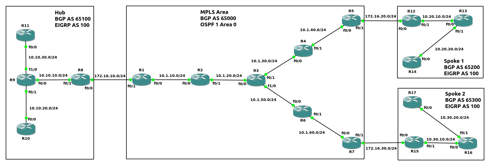
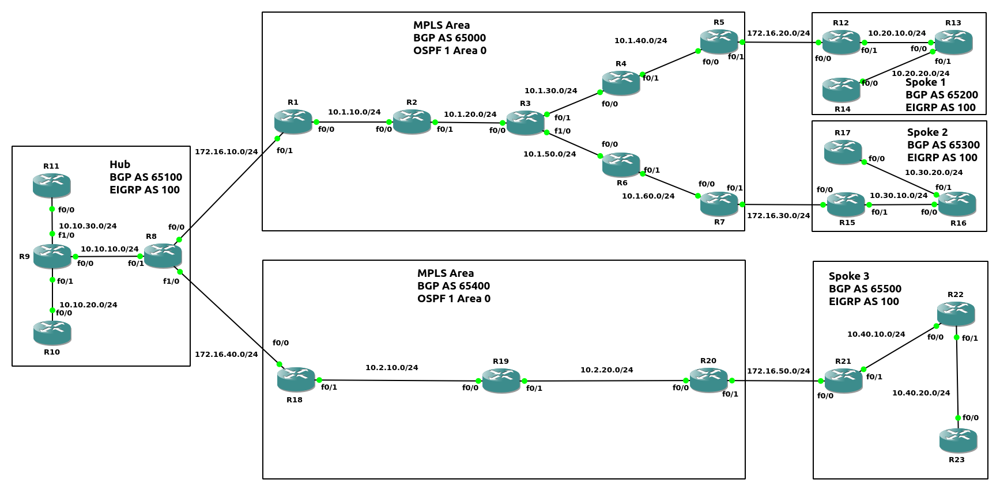
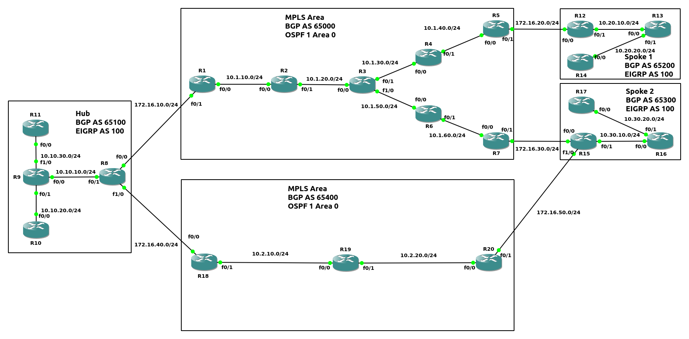

##### Generic Routing Encapsulation(GRE)
GRE配置步骤
```
1.创建tunnel接口
(config)# interface tunnel <tunnel_number>

2.配置tunnel local使用的物理接口(或物理IP地址, 可使用loopback接口)
(config-if)# tunnel source {<interface> | <ip_address>}

3.配置tunnel destination物理IP地址
(config-if)# tunnel destination <ip_address>

4.tunnel接口配置IP地址
(config-if)# ip address <ip_address> <subnet_mask>

*5.配置tunnel接口的bandwidth
(config-if)# bandwidth <bandwidth>
```
<br>
<br>

图1<br>
<br>

图2<br>
<br>

实例1(如图1)
```
R1(config)# router ospf 1
R1(config-router)# network 10.10.10.0 0.0.0.255 area 0
R1(config-router)# network 1.1.1.1 0.0.0.0 area 0

R2(config)# router ospf 1
R2(config-router)# network 10.10.10.0 0.0.0.255 area 0
R2(config-router)# network 172.16.10.0 0.0.0.255 area 0
R2(config-router)# network 2.2.2.2 0.0.0.0 area 0

R3(config)# router ospf 1
R3(config-router)# network 172.16.0.0 0.0.255.255 area 0
R3(config-router)# network 3.3.3.3 0.0.0.0 area 0

R4(config)# router ospf 1
R4(config-router)# network 172.16.20.0 0.0.0.255 area 0
R4(config-router)# network 10.10.20.0 0.0.0.255 area 0
R4(config-router)# network 4.4.4.4 0.0.0.0 area 0

R5(config)# router ospf 1
R5(config-router)# network 10.10.20.0 0.0.0.255 area 0
R5(config-router)# network 5.5.5.5 0.0.0.0 area 0


R2(config)# interface tunnel 0 
R2(config-if)# tunnel source f0/1
R2(config-if)# tunnel destination 172.16.20.4
R2(config-if)# ip address 192.168.10.2 255.255.255.0

R4(config)# interface tunnel 0
R4(config-if)# tunnel source f0/0
R4(config-if)# tunnel destination 172.16.10.2
R4(config-if)# ip address 192.168.10.4 255.255.255.0


R2# traceroute 192.168.10.4
Type escape sequence to abort.
Tracing the route to 192.168.10.4
VRF info: (vrf in name/id, vrf out name/id)
  1 192.168.10.4 16 msec 40 msec 24 msec

R2# traceroute 4.4.4.4
Type escape sequence to abort.
Tracing the route to 4.4.4.4
VRF info: (vrf in name/id, vrf out name/id)
  1 172.16.10.3 12 msec 8 msec 8 msec
  2 172.16.20.4 12 msec 28 msec 20 msec


示例的GRE packet结构如图2
```
<br>
<br>

##### Dynamic Multipoint VPN
DMVPN分为三个Phase版本:<br>
1.Phase 1(Spoke-to-Hub)<br>
添加新Spoke site时, 只需在新site设置, Hub会在Spoke之间(或Hub与Spoke)创建连接, 但所有流量必须流经Hub<br>

2.Phase 2(Spoke-to-Spoke)<br>
当两个Spoke在同一个DMVPN network时, Hub帮助Spoke间建立连接后, Spoke之间的流量不需要通过Hub<br>

3.Phase 3(Hierarchical Tree Spoke-to-Spoke)<br>
即使两个Spoke不在同一个DMVPN network, Hub帮助Spoke间建立连接后, Spoke之间的流量也不需要通过Hub
<br>
<br>

配置DMVPN步骤(Phase 1)
```
Hub
1.配置tunnel接口
(config)# interface tunnel <number>

2.NBMA地址(物理地址)的源地址
(config-if)# tunnel source {<ip_add> | <int_id>}

3.配置为mGRE
(config-if)# tunnel mode gre multipoint

4.指定tunnel(protocol/virtual)地址
(config-if)# ip address <ip_add> <subnet_mask>

5.开启NHRP并指定Uniquely ID
(config-if)# ip nhrp network-id <id>
** UID在本地有效, 但建议加入同一个DMVPN的路由器使用同一个UID

*6.指定tunnel key(当多个tunnel接口使用同一个物理源地址时)
(config-if)# tunnel key <key>

*7.NHRP支持multicast
(config-if)# ip nhrp map multicast dynamic

*8.配置bandwidth
(config-if)# bandwidth <bw>

*9.配置MTU
(config-if)# ip mtu <mtu>

*10.配置TCP Maximum Segment Size(MSS)
(config-if)# ip tcp adjust-mss <mss>


Spoke
1.配置tunnel接口
(config)# interface tunnel <number>

2.NBMA地址(物理地址)的源地址
(config-if)# tunnel source {<ip_add> | <int_id>}

3.NBMA地址(物理地址)的目标地址(Hub)
(config-if)# tunnel destination <ip_add>

4.指定tunnel(protocol/virtual)地址
(config-if)# ip address {<ip_add> <subnet_mask> | dhcp}

5.开启NHRP并指定Uniquely ID
(config-if)# ip nhrp network-id <id>

6.指定Hub的NBMA和protocol地址
(config-if)# ip nhrp nhs <protocol_address> nbma <nbma_address> [multicast]
** 可拆解为以下三个指令, 意义相同
(config-if)# ip nhrp nhs <protocol_address>
(config-if)# ip nhrp map <protocol_address> <nbma_address>
(config-if)# ip nhrp map multicast [<nbma_address> | dynamic]

*7.指定tunnel key(当多个tunnel接口使用同一个物理源地址时)
(config-if)# tunnel key <key>
** 当Hub定义tunnel key, 所有spoke必须定义tunnel key

*8.配置bandwidth
(config-if)# bandwidth <bw>

*9.配置MTU
(config-if)# ip mtu <mtu>

*10.配置TCP Maximum Segment Size(MSS)
(config-if)# ip tcp adjust-mss <mss>
```
<br>

配置DMVPN步骤(Phase 3)
```
Hub
1.配置tunnel接口
(config)# interface tunnel <number>

2.NBMA地址(物理地址)的源地址
(config-if)# tunnel source {<ip_add> | <int_id>}

3.配置为mGRE
(config-if)# tunnel mode gre multipoint

4.指定tunnel(protocol/virtual)地址
(config-if)# ip address <ip_add> <subnet_mask>

5.开启NHRP并指定Uniquely ID
(config-if)# ip nhrp network-id <id>
** UID在本地有效, 但建议加入同一个DMVPN的路由器使用同一个UID

6.给Spoke之间的通信进行redirect, 使流量不通过Hub(Phase 3相对于Phase 1新增加)
(config-if)# ip nhrp redirect

*7.指定tunnel key(当多个tunnel接口使用同一个物理源地址时)
(config-if)# tunnel key <key>

*8.NHRP支持multicast
(config-if)# ip nhrp map multicast dynamic

*9.配置bandwidth
(config-if)# bandwidth <bw>

*10.配置MTU
(config-if)# ip mtu <mtu>

*11.配置TCP Maximum Segment Size(MSS)
(config-if)# ip tcp adjust-mss <mss>


Spoke
1.配置tunnel接口
(config)# interface tunnel <number>

2.NBMA地址(物理地址)的源地址
(config-if)# tunnel source {<ip_add> | <int_id>}

3.配置为mGRE模式(相对于Phase 1的指定destination)
(config-if)# tunnel mode gre multipoint

4.指定tunnel(protocol/virtual)地址
(config-if)# ip address {<ip_add> <subnet_mask> | dhcp}

5.开启NHRP并指定Uniquely ID
(config-if)# ip nhrp network-id <id>

6.指定Hub的NBMA和protocol地址
(config-if)# ip nhrp nhs <protocol_address> nbma <nbma_address> [multicast]
** 可拆解为以下三个指令, 意义相同
(config-if)# ip nhrp nhs <protocol_address>
(config-if)# ip nhrp map <protocol_address> <nbma_address>
(config-if)# ip nhrp map multicast [<nbma_address> | dynamic]

7.开启shortcut(Phase 3相对于Phase 1新增加)
(config-if)# ip nhrp shortcut

*7.指定tunnel key(当多个tunnel接口使用同一个物理源地址时)
(config-if)# tunnel key <key>
** 当Hub定义tunnel key, 所有spoke必须定义tunnel key

*8.配置bandwidth
(config-if)# bandwidth <bw>

*9.配置MTU
(config-if)# ip mtu <mtu>

*10.配置TCP Maximum Segment Size(MSS)
(config-if)# ip tcp adjust-mss <mss>
```
<br>

图3<br>
<br>

图4<br>
<br>

实例2(配置Phase 1, 如图3)
```
MPLS区域配置OSPF
R1(config)# router ospf 1
R1(config-router)# network 192.168.1.1 0.0.0.0 area 0
R1(config-router)# network 10.1.10.0 0.0.0.255 area 0

R2(config)# router ospf 1
R2(config-router)# network 192.168.1.2 0.0.0.0 area 0
R2(config-router)# network 10.1.0.0 0.0.255.255 area 0

R3(config)# router ospf 1
R3(config-router)# network 192.168.1.3 0.0.0.0 area 0
R3(config-router)# network 10.1.0.0 0.0.255.255 area 0

R4(config)# router ospf 1
R4(config-router)# network 192.168.1.4 0.0.0.0 area 0
R4(config-router)# network 10.1.0.0 0.0.255.255 area 0

R5(config)# router ospf 1
R5(config-router)# network 192.168.1.5 0.0.0.0 area 0
R5(config-router)# network 10.1.40.0 0.0.0.255 area 0

R6(config)# router ospf 1
R6(config-router)# network 192.168.1.6 0.0.0.0 area 0
R6(config-router)# network 10.1.0.0 0.0.255.255 area 0

R7(config)# router ospf 1
R7(config-router)# network 192.168.1.7 0.0.0.0 area 0
R7(config-router)# network 10.1.60.0 0.0.0.255 area 0


配置MPLS
R1(config)# router ospf 1
R1(config-router)# mpls ldp autoconfig

R2(config)# router ospf 1
R2(config-router)# mpls ldp autoconfig

R3(config)# router ospf 1
R3(config-router)# mpls ldp autoconfig

R4(config)# router ospf 1
R4(config-router)# mpls ldp autoconfig

R5(config)# router ospf 1
R5(config-router)# mpls ldp autoconfig

R6(config)# router ospf 1
R6(config-router)# mpls ldp autoconfig

R7(config)# router ospf 1
R7(config-router)# mpls ldp autoconfi


配置iBGP
R1(config)# router bgp 65000
R1(config-router)# neighbor 192.168.1.5 remote-as 65000
R1(config-router)# neighbor 192.168.1.5 update-source loopback0
R1(config-router)# neighbor 192.168.1.7 remote-as 65000
R1(config-router)# neighbor 192.168.1.7 update-source loopback0
R1(config-router)# redistribute ospf 1 
R1(config-router)# address-family vpnv4
R1(config-router-af)# neighbor 192.168.1.5 activate
R1(config-router-af)# neighbor 192.168.1.5 send-community both
R1(config-router-af)# neighbor 192.168.1.7 activate
R1(config-router-af)# neighbor 192.168.1.7 send-community both

R5(config)# router bgp 65000
R5(config-router)# neighbor 192.168.1.1 remote-as 65000
R5(config-router)# neighbor 192.168.1.1 update-source loopback0
R5(config-router)# neighbor 192.168.1.7 remote-as 65000
R5(config-router)# neighbor 192.168.1.7 update-source loopback0
R5(config-router)# redistribute ospf 1
R5(config-router)# address-family vpnv4
R5(config-router-af)# neighbor 192.168.1.1 activate
R5(config-router-af)# neighbor 192.168.1.1 send-community both
R5(config-router-af)# neighbor 192.168.1.7 activate
R5(config-router-af)# neighbor 192.168.1.7 send-community both

R7(config)# router bgp 65000
R7(config-router)# neighbor 192.168.1.1 remote-as 65000
R7(config-router)# neighbor 192.168.1.1 update-source loopback0
R7(config-router)# neighbor 192.168.1.5 remote-as 65000
R7(config-router)# neighbor 192.168.1.5 update-source loopback0
R7(config-router)# redistribute ospf 1
R7(config-router)# address-family vpnv4
R7(config-router-af)# neighbor 192.168.1.1 activate
R7(config-router-af)# neighbor 192.168.1.1 send-community both
R7(config-router-af)# neighbor 192.168.1.5 activate
R7(config-router-af)# neighbor 192.168.1.5 send-community both


在PE配置VRF
R1(config)# ip vrf Hub
R1(config-vrf)# rd 1:100
R1(config-vrf)# route-target export 100:100
R1(config-vrf)# route-target import 100:110
R1(config-vrf)# route-target import 100:120
R1(config-vrf)# int f0/1
R1(config-if)# ip vrf forwarding Hub
R1(config-if)# ip add 172.16.10.1 255.255.255.0

R5(config)# ip vrf Spoke_01
R5(config-vrf)# rd 1:110
R5(config-vrf)# route-target export 100:110
R5(config-vrf)# route-target import 100:100
R5(config-vrf)# route-target import 100:120
R5(config-vrf)# int f0/1
R5(config-if)# ip vrf forwarding Spoke_01
R5(config-if)# ip add 172.16.20.5 255.255.255.0

R7(config)# ip vrf Spoke_02
R7(config-vrf)# rd 1:120
R7(config-vrf)# route-target export 100:120 
R7(config-vrf)# route-target import 100:100
R7(config-vrf)# route-target import 100:110
R7(config-vrf)# int f0/1
R7(config-if)# ip vrf forwarding Spoke_02
R7(config-if)# ip add 172.16.30.7 255.255.255.0


配置Sites
R8(config)# router ospf 1
R8(config-router)# network 192.168.1.8 0.0.0.0 area 0
R8(config-router)# network 10.10.10.0 0.0.0.255 area 0
R8(config-router)# default-information originate always

R9(config)# router ospf 1
R9(config-router)# network 192.168.1.9 0.0.0.0 area 0
R9(config-router)# network 10.10.0.0 0.0.255.255 area 0

R10(config)# router ospf 1
R10(config-router)# network 192.168.1.10 0.0.0.0 area 0
R10(config-router)# network 10.10.20.0 0.0.0.255 area 0

R11(config)# router ospf 1
R11(config-router)# network 192.168.1.11 0.0.0.0 area 0
R11(config-router)# network 10.10.30.0 0.0.0.255 area 0

R12(config)# router ospf 1
R12(config-router)# network 192.168.1.12 0.0.0.0 area 0
R12(config-router)# network 10.20.10.0 0.0.0.255 area 0
R12(config-router)# default-information originate always

R13(config)# router ospf 1
R13(config-router)# network 192.168.1.13 0.0.0.0 area 0
R13(config-router)# network 10.20.0.0 0.0.255.255 area 0

R14(config)# router ospf 1
R14(config-router)# network 192.168.1.14 0.0.0.0 area 0
R14(config-router)# network 10.20.20.0 0.0.0.255 area 0

R15(config)# router ospf 1
R15(config-router)# network 192.168.1.15 0.0.0.0 area 0
R15(config-router)# network 10.30.10.0 0.0.0.255 area 0
R15(config-router)# default-information originate always

R16(config)# router ospf 1
R16(config-router)# network 192.168.1.16 0.0.0.0 area 0
R16(config-router)# network 10.30.0.0 0.0.255.255 area 0

R17(config)# router ospf 1
R17(config-router)# network 192.168.1.17 0.0.0.0 area 0
R17(config-router)# network 10.30.20.0 0.0.0.255 area 0


配置PE-to-CE
R1(config)# router bgp 65000
R1(config-router)# address-family ipv4 vrf Hub
R1(config-router-af)# neighbor 172.16.10.8 remote-as 65100
R1(config-router-af)# neighbor 172.16.10.8 activate

R8(config)# router bgp 65100
R8(config-router)# neighbor 172.16.10.1 remote-as 65000
R8(config-router)# redistribute ospf 1
R8(config-router)# redistribute connected

R5(config)# router bgp 65000
R5(config-router)# address-family ipv4 vrf Spoke_01
R5(config-router-af)# neighbor 172.16.20.12 remote-as 65200
R5(config-router-af)# neighbor 172.16.20.12 activate

R12(config)# router bgp 65200
R12(config-router)# neighbor 172.16.20.5 remote-as 65000
R12(config-router)# redistribute ospf 1
R12(config-router)# redistribute connected

R7(config)# router bgp 65000
R7(config-router)# address-family ipv4 vrf Spoke_02
R7(config-router-af)# neighbor 172.16.30.15 remote-as 65300
R7(config-router-af)# neighbor 172.16.30.15 activate

R15(config)# router bgp 65300
R15(config-router)# neighbor 172.16.30.7 remote-as 65000
R15(config-router)# redistribute ospf 1
R15(config-router)# redistribute connected


配置DMVPN(Phase 1)
R8(config)# interface tunnel 0
R8(config-if)# tunnel source f0/0
R8(config-if)# tunnel mode gre multipoint
R8(config-if)# ip address 192.168.100.1 255.255.255.0
R8(config-if)# ip nhrp network-id 100

R12(config)# interface tunnel 0
R12(config-if)# tunnel source f0/0
R12(config-if)# tunnel destination 172.16.10.8
R12(config-if)# ip address 192.168.100.2 255.255.255.0
R12(config-if)# ip nhrp network-id 100
R12(config-if)# ip nhrp nhs 192.168.100.1 nbma 172.16.10.8 multicast

R15(config)# interface tunnel 0
R15(config-if)# tunnel source f0/0
R15(config-if)# tunnel destination 172.16.10.8 
R15(config-if)# ip address 192.168.100.3 255.255.255.0
R15(config-if)# ip nhrp network-id 100
R15(config-if)# ip nhrp nhs 192.168.100.1 nbma 172.16.10.8 multicast


配置EIGRP
R8(config)# router eigrp 100
R8(config-router)# network 192.168.100.0 0.0.0.255

R12(config)# router eigrp 100
R12(config-router)# network 192.168.100.0 0.0.0.255

R15(config)# router eigrp 100
R15(config-router)# network 192.168.100.0 0.0.0.255


redistribute
R8(config)# router eigrp 100
R8(config-router)# redistribute ospf 1 metric 100000 10 255 1 1500
R8(config-router)# router ospf 1
R8(config-router)# redistribute eigrp 100 subnets
R8(config-router)# router bgp 65100
R8(config-router)# redistribute ospf 1 match internal external 2

R12(config)# router eigrp 100
R12(config-router)# redistribute ospf 1 metric 100000 10 255 1 1500
R12(config-router)# router ospf 1
R12(config-router)# redistribute eigrp 100 subnets
R12(config-router)# router bgp 65200
R12(config-router)# redistribute ospf 1 match internal external 2

R15(config)# router eigrp 100
R15(config-router)# redistribute ospf 1 metric 100000 10 255 1 1500
R15(config-router)# router ospf 1
R15(config-router)# redistribute eigrp 100 subnets
R15(config-router)# router bgp 65300
R15(config-router)# redistribute ospf 1 match internal external 2


以下内容参考图4
R8# show ip nhrp brief
   Target             Via            NBMA           Mode   Intfc   Claimed 
  
R8# debug nhrp cache
R8# debug nhrp packet
*Mar 19 04:16:17.883: NHRP: Receive Registration Request via Tunnel0 vrf 0, packet size: 92
*Mar 19 04:16:17.923: NHRP: NHRP successfully mapped '192.168.100.2' to NBMA 172.16.20.12
*Mar 19 04:16:17.927: NHRP: Send Registration Reply via Tunnel0 vrf 0, packet size: 112
*Mar 19 04:16:18.847: NHRP: Receive Registration Request via Tunnel0 vrf 0, packet size: 92
*Mar 19 04:16:18.895: NHRP: NHRP successfully mapped '192.168.100.3' to NBMA 172.16.30.15
*Mar 19 04:16:18.895: NHRP: Send Registration Reply via Tunnel0 vrf 0, packet size: 112

R8# show ip nhrp brief
   Target             Via            NBMA           Mode   Intfc   Claimed 
192.168.100.2/32     192.168.100.2   172.16.20.12    dynamic  Tu0     <   >
192.168.100.3/32     192.168.100.3   172.16.30.15    dynamic  Tu0     <   >

R12# show ip nhrp brief
   Target             Via            NBMA           Mode   Intfc   Claimed 
192.168.100.1/32     192.168.100.1   172.16.10.8     static   Tu0     <   >

R15# show ip nhrp brief
   Target             Via            NBMA           Mode   Intfc   Claimed 
192.168.100.1/32     192.168.100.1   172.16.10.8     static   Tu0     <   >

R12# traceroute 192.168.100.3
Type escape sequence to abort.
Tracing the route to 192.168.100.3
VRF info: (vrf in name/id, vrf out name/id)
  1 192.168.100.1 68 msec 64 msec 60 msec
  2 192.168.100.3 124 msec 116 msec 116 msec

R8# show ip nhrp
192.168.100.2/32 via 192.168.100.2
   Tunnel0 created 00:33:27, expire 01:34:57
   Type: dynamic, Flags: unique registered used nhop 
   NBMA address: 172.16.20.12 
192.168.100.3/32 via 192.168.100.3
   Tunnel0 created 00:33:27, expire 01:34:55
   Type: dynamic, Flags: unique registered used nhop 
   NBMA address: 172.16.30.15

Hub Flag列表如下:
unique - 当前NHRP映射具有唯一性, 当接收protocol地址与新的NBMA地址映射时, Hub进行拒绝(参考实例4)
used - 当前NHRP映射在60s时间内, 用于数据包转发
nhop - 远程next-hop(protocol地址)已经与NBMA地址绑定
```
<br>
<br>

图5<br>
<br>

实例3(配置Phase 3, 如图3)
```
根据实例2的配置修改(只修改DMVPN部分), 修改后结果如下:

R8(config)# interface tunnel 0
R8(config-if)# tunnel source f0/0
R8(config-if)# tunnel mode gre multipoint
R8(config-if)# ip address 192.168.100.1 255.255.255.0
R8(config-if)# ip nhrp network-id 100
R8(config-if)# ip nhrp redirect

R12(config)# interface tunnel 0
R12(config-if)# tunnel source f0/0
R12(config-if)# tunnel mode gre multipoint
R12(config-if)# ip address 192.168.100.2 255.255.255.0
R12(config-if)# ip nhrp network-id 100
R12(config-if)# ip nhrp nhs 192.168.100.1 nbma 172.16.10.8 multicast
R12(config-if)# ip nhrp shortcut

R15(config)# interface tunnel 0
R15(config-if)# tunnel source f0/0
R15(config-if)# tunnel mode gre multipoint
R15(config-if)# ip address 192.168.100.3 255.255.255.0
R15(config-if)# ip nhrp network-id 100
R15(config-if)# ip nhrp nhs 192.168.100.1 nbma 172.16.10.8 multicast
R15(config-if)# ip nhrp shortcut


以下内容参考图5
R8# debug nhrp cache
R8# debug nhrp packet
*Mar 20 02:13:49.151: NHRP: Tunnel0: Cache add for target 192.168.100.3/32 next-hop 192.168.100.3

*Mar 20 02:15:29.343: NHRP: Receive Registration Request via Tunnel0 vrf 0, packet size: 92

*Mar 20 02:15:29.367: NHRP: Send Registration Reply via Tunnel0 vrf 0, packet size: 112  src: 192.168.100.1, dst: 192.168.100.3


R8# show ip nhrp brief
   Target             Via            NBMA           Mode   Intfc   Claimed 
192.168.100.2/32     192.168.100.2   172.16.20.12    dynamic  Tu0     <   >
192.168.100.3/32     192.168.100.3   172.16.30.15    dynamic  Tu0     <   >


R12# show ip nhrp brief
   Target             Via            NBMA           Mode   Intfc   Claimed 
192.168.100.1/32     192.168.100.1   172.16.10.8     static   Tu0     <   >


R15# show ip nhrp brief
   Target             Via            NBMA           Mode   Intfc   Claimed 
192.168.100.1/32     192.168.100.1   172.16.10.8     static   Tu0     <   >


R12# traceroute 192.168.100.3
Type escape sequence to abort.
Tracing the route to 192.168.100.3
VRF info: (vrf in name/id, vrf out name/id)
  1 192.168.100.1 80 msec 92 msec 60 msec
  2 192.168.100.3 84 msec 100 msec 72 msec


R8# 
Mar 20 07:37:23.959: NHRP: Receive Resolution Request via Tunnel0 vrf 0, packet size: 72  src protocol: 192.168.100.2, dst protocol: 192.168.100.3
Mar 20 07:37:23.979: NHRP: Forwarding Resolution Request via Tunnel0 vrf 0, packet size: 92  src protocol: 192.168.100.2, dst protocol: 192.168.100.3

Mar 20 07:37:24.015: NHRP: Receive Resolution Request via Tunnel0 vrf 0, packet size: 72  src protocol: 192.168.100.3, dst protocol: 192.168.100.2
Mar 20 07:37:24.019: NHRP: Forwarding Resolution Request via Tunnel0 vrf 0, packet size: 92  src protocol: 192.168.100.3, dst protocol: 192.168.100.2


R12#
Mar 20 07:37:23.896: NHRP: Send Resolution Request via Tunnel0 vrf 0, packet size: 72  src protocol: 192.168.100.2, dst protocol: 192.168.100.3

Mar 20 07:37:24.028: NHRP: Receive Resolution Request via Tunnel0 vrf 0, packet size: 92  src protocol: 192.168.100.3, dst protocol: 192.168.100.2

Mar 20 07:37:24.048: NHRP: Send Resolution Reply via Tunnel0 vrf 0, packet size: 120  src: 192.168.100.2, dst: 192.168.100.3

Mar 20 07:37:24.056: NHRP: Receive Resolution Reply via Tunnel0 vrf 0, packet size: 120  src: 192.168.100.3, dst: 192.168.100.2


R15#
Mar 20 07:37:23.965: NHRP: Send Resolution Request via Tunnel0 vrf 0, packet size: 72  src protocol: 192.168.100.3, dst protocol: 192.168.100.2

Mar 20 07:37:23.985: NHRP: Receive Resolution Request via Tunnel0 vrf 0, packet size: 92  src protocol: 192.168.100.2, dst protocol: 192.168.100.3

Mar 20 07:37:24.013: NHRP: Send Resolution Reply via Tunnel0 vrf 0, packet size: 120  src: 192.168.100.3, dst: 192.168.100.2

Mar 20 07:37:24.073: NHRP: Receive Resolution Reply via Tunnel0 vrf 0, packet size: 120  src: 192.168.100.2, dst: 192.168.100.3


R8# show ip nhrp brief
   Target             Via            NBMA           Mode   Intfc   Claimed 
192.168.100.2/32     192.168.100.2   172.16.20.12    dynamic  Tu0     <   >
192.168.100.3/32     192.168.100.3   172.16.30.15    dynamic  Tu0     <   >


R12# show ip nhrp brief
   Target             Via            NBMA           Mode   Intfc   Claimed 
192.168.100.1/32     192.168.100.1   172.16.10.8     static   Tu0     <   >
192.168.100.3/32     192.168.100.3   172.16.30.15    dynamic  Tu0     <   >


R15# show ip nhrp brief
   Target             Via            NBMA           Mode   Intfc   Claimed 
192.168.100.1/32     192.168.100.1   172.16.10.8     static   Tu0     <   >
192.168.100.2/32     192.168.100.2   172.16.20.12    dynamic  Tu0     <   >
192.168.100.3/32     192.168.100.3   172.16.30.15    dynamic  Tu0     <   >


R12# traceroute 192.168.100.3
Type escape sequence to abort.
Tracing the route to 192.168.100.3
VRF info: (vrf in name/id, vrf out name/id)
  1 192.168.100.3 84 msec 80 msec 80 msec
```
<br>
<br>

实例4
```
R12(config)# interface tunnel 0
R12(config-if)# shutdown
R12(config-if)# int f0/0
R12(config-if)# ip add 172.16.20.30 255.255.255.0

R5(config)# router bgp 65000
R5(config-router)# address-family ipv4 vrf Spoke_01
R5(config-router-af)# no neighbor 172.16.20.12 remote-as 65200
R5(config-router-af)# neighbor 172.16.20.30 remote-as 65200 
R5(config-router-af)# neighbor 172.16.20.30 activate

R12(config)# interface tunnel 0
R12(config-if)# no shutdown
*Mar 20 06:10:06.911: %NHRP-3-PAKREPLY: Receive Registration Reply packet with error - unique address registered already(14)


在NHC修改NBMA底之前使用registration no-unique配置
R12(config)# interface tunnel 0
R12(config-if)# shutdown
R12(config-if)# int f0/0
R12(config-if)# ip add 172.16.20.12 255.255.255.0

R5(config)# router bgp 65000
R5(config-router)# address-family ipv4 vrf Spoke_01
R5(config-router-af)# no neighbor 172.16.20.30 remote-as 65200
R5(config-router-af)# neighbor 172.16.20.12 remote-as 65200
R5(config-router-af)# neighbor 172.16.20.12 activate

R12(config)# interface tunnel 0
R12(config)# no shutdown

R8# show ip nhrp 
192.168.100.2/32 via 192.168.100.2
   Tunnel0 created 02:26:47, expire 01:59:37
   Type: dynamic, Flags: registered used nhop 
   NBMA address: 172.16.20.12 
192.168.100.3/32 via 192.168.100.3
   Tunnel0 created 02:26:44, expire 01:56:00
   Type: dynamic, Flags: unique registered used nhop 
   NBMA address: 172.16.30.15 

R12(config)# interface tunnel 0
R12(config-if)# ip nhrp registration no-unique
R12(config-if)# shutdown
R12(config-if)# int f0/0
R12(config-if)# ip add 172.16.20.30 255.255.255.0

R5(config)# router bgp 65000
R5(config-router)# address-family ipv4 vrf Spoke_01
R5(config-router-af)# no neighbor 172.16.20.12 remote-as 65200
R5(config-router-af)# neighbor 172.16.20.30 remote-as 65200 
R5(config-router-af)# neighbor 172.16.20.30 activate

R12(config)# interface tunnel 0
R12(config-if)# no shutdown
R12# ping 192.168.100.3
.....

R15# show ip nhrp
192.168.100.1/32 via 192.168.100.1
   Tunnel0 created 00:59:34, never expire 
   Type: static, Flags: used 
   NBMA address: 172.16.10.8 
192.168.100.2/32 via 192.168.100.2
   Tunnel0 created 00:15:53, expire 01:44:06
   Type: dynamic, Flags: router used nhop 
   NBMA address: 172.16.20.12 
192.168.100.3/32 via 192.168.100.3
   Tunnel0 created 00:03:59, expire 01:59:41
   Type: dynamic, Flags: router unique local 
   NBMA address: 172.16.30.15 
    (no-socket) 


移除R15的NHRP缓存
R15# clear ip nhrp

R12# ping 192.168.100.3
!!!!!
```
<br>
<br>

图6<br>
<br>

实例5 - 多ISP
```
根据实例3的配置, 后续添加的配置
配置MPLS区域OSPF
R18(config)# router ospf 1
R18(config-router)# network 192.168.1.18 0.0.0.0 area 0
R18(config-router)# network 10.2.10.0 0.0.0.255 area 0

R19(config)# router ospf 1
R19(config-router)# network 192.168.1.19 0.0.0.0 area 0
R19(config-router)# network 10.2.0.0 0.0.255.255 area 0

R20(config)# router ospf 1
R20(config-router)# network 192.168.1.20 0.0.0.0 area 0
R20(config-router)# network 10.2.20.0 0.0.0.255 area 0


配置MPLS
R18(config)# router ospf 1
R18(config-router)# mpls ldp autoconfig

R19(config)# router ospf 1
R19(config-router)# mpls ldp autoconfig

R20(config)# router ospf 1
R20(config-router)# mpls ldp autoconfig


配置iBGP
R18(config)# router bgp 65400
R18(config-router)# neighbor 192.168.1.20 remote-as 65400
R18(config-router)# neighbor 192.168.1.20 update-source loopback0
R18(config-router)# redistribute ospf 1
R18(config-router)# address-family vpnv4
R18(config-router-af)# neighbor 192.168.1.20 activate
R18(config-router-af)# neighbor 192.168.1.20 send-community both

R20(config)# router bgp 65400
R20(config-router)# neighbor 192.168.1.18 remote-as 65400 
R20(config-router)# neighbor 192.168.1.18 update-source loopback0
R20(config-router)# redistribute ospf 1
R20(config-router)# address-family vpnv4
R20(config-router-af)# neighbor 192.168.1.18 activate 
R20(config-router-af)# neighbor 192.168.1.18 send-community both


在PE配置VRF
R18(config)# ip vrf Hub
R18(config-vrf)# rd 1:100
R18(config-vrf)# route-target export 100:100
R18(config-vrf)# route-target import 100:130
R18(config-vrf)# int f0/0
R18(config-if)# ip vrf forwarding Hub
R18(config-if)# ip add 172.16.40.18 255.255.255.0

R20(config)# ip vrf Spoke_03
R20(config-vrf)# rd 1:130
R20(config-vrf)# route-target export 100:130
R20(config-vrf)# route-target import 100:100
R20(config-vrf)# int f0/1
R20(config-if)# ip vrf forwarding Spoke_03
R20(config-if)# ip add 172.16.50.20 255.255.255.0


配置Sites
R21(config)# router eigrp 100
R21(config-router)# network 192.168.1.21 0.0.0.0
R21(config-router)# network 10.40.10.0 0.0.0.255

R22(config)# router eigrp 100
R22(config-router)# network 192.168.1.22 0.0.0.0
R22(config-router)# network 10.40.0.0 0.0.255.255

R23(config)# router eigrp 100
R23(config-router)# network 192.168.1.23 0.0.0.0
R23(config-router)# network 10.40.20.0 0.0.0.255


配置PE-to-CE
R18(config)# router bgp 65400
R18(config-router)# address-family ipv4 vrf Hub
R18(config-router-af)# neighbor 172.16.40.8 remote-as 65100
R18(config-router-af)# neighbor 172.16.40.8 activate

R8(config)# router bgp 65100
R8(config-router)# neighbor 172.16.40.18 remote-as 65400
R8(config-router)# network 172.16.40.0 mask 255.255.255.0

R20(config)# router bgp 65400
R20(config-router)# address-family ipv4 vrf Spoke_03
R20(config-router-af)# neighbor 172.16.50.21 remote-as 65500
R20(config-router-af)# neighbor 172.16.50.21 activate 

R21(config)# router bgp 65500
R21(config-router)# neighbor 172.16.50.20 remote-as 65400
R21(config-router)# network 172.16.50.0 mask 255.255.255.0


配置DMVPN(Phase 3)
R8(config)# interface tunnel 100
R8(config-if)# tunnel source f1/0
R8(config-if)# tunnel mode gre multipoint
R8(config-if)# ip address 192.168.200.1 255.255.255.0
R8(config-if)# ip nhrp network-id 200
R8(config-if)# ip nhrp map multicast dynamic
R8(config-if)# ip nhrp redirect 
R8(config-if)# router eigrp 100 
R8(config-router)# network 192.168.200.0 0.0.0.255

R21(config)# interface tunnel 100
R21(config-if)# tunnel source f0/0
R21(config-if)# tunnel mode gre multipoint
R21(config-if)# ip address 192.168.200.2 255.255.255.0
R21(config-if)# ip nhrp network-id 200
R21(config-if)# ip nhrp nhs 192.168.200.1 nbma 172.16.40.8 multicast
R21(config-if)# ip nhrp shortcut
R21(config-if)# router eigrp 100
R21(config-router)# network 192.168.200.0 0.0.0.255


R8# show ip nhrp brief
   Target             Via            NBMA           Mode   Intfc   Claimed 
192.168.100.2/32     192.168.100.2   172.16.20.12    dynamic  Tu0     <   >
192.168.100.3/32     192.168.100.3   172.16.30.15    dynamic  Tu0     <   >
192.168.200.2/32     192.168.200.2   172.16.50.21    dynamic  Tu100   <   >


R12# show ip route | begin Gateway
Gateway of last resort is not set

      10.0.0.0/8 is variably subnetted, 10 subnets, 2 masks
D        10.10.10.0/24 [90/26882560] via 192.168.100.1, 01:17:54, Tunnel0
D        10.10.20.0/24 [90/26885120] via 192.168.100.1, 01:17:54, Tunnel0
D        10.10.30.0/24 [90/26885120] via 192.168.100.1, 01:17:54, Tunnel0
C        10.20.10.0/24 is directly connected, FastEthernet0/1
L        10.20.10.12/32 is directly connected, FastEthernet0/1
D        10.20.20.0/24 [90/30720] via 10.20.10.13, 01:17:53, FastEthernet0/1
D        10.30.10.0/24 [90/28162560] via 192.168.100.1, 01:17:53, Tunnel0
D        10.30.20.0/24 [90/28165120] via 192.168.100.1, 01:17:53, Tunnel0
D        10.40.10.0/24 [90/28162560] via 192.168.100.1, 00:29:30, Tunnel0
D        10.40.20.0/24 [90/28165120] via 192.168.100.1, 00:29:30, Tunnel0
      172.16.0.0/16 is variably subnetted, 6 subnets, 2 masks
B        172.16.10.0/24 [20/0] via 172.16.20.5, 01:17:57
C        172.16.20.0/24 is directly connected, FastEthernet0/0
L        172.16.20.12/32 is directly connected, FastEthernet0/0
B        172.16.30.0/24 [20/0] via 172.16.20.5, 01:17:57
B        172.16.40.0/24 [20/0] via 172.16.20.5, 00:31:29
B        172.16.50.0/24 [20/0] via 172.16.20.5, 00:29:51
      192.168.1.0/32 is subnetted, 13 subnets
D        192.168.1.8 [90/27008000] via 192.168.100.1, 01:17:54, Tunnel0
D        192.168.1.9 [90/27010560] via 192.168.100.1, 01:17:54, Tunnel0
D        192.168.1.10 [90/27013120] via 192.168.100.1, 01:17:54, Tunnel0
D        192.168.1.11 [90/27013120] via 192.168.100.1, 01:17:54, Tunnel0
C        192.168.1.12 is directly connected, Loopback0
D        192.168.1.13 [90/156160] via 10.20.10.13, 01:17:53, FastEthernet0/1
D        192.168.1.14 [90/158720] via 10.20.10.13, 01:17:53, FastEthernet0/1
D        192.168.1.15 [90/28288000] via 192.168.100.1, 01:17:53, Tunnel0
D        192.168.1.16 [90/28290560] via 192.168.100.1, 01:17:53, Tunnel0
D        192.168.1.17 [90/28293120] via 192.168.100.1, 01:17:53, Tunnel0
D        192.168.1.21 [90/28288000] via 192.168.100.1, 00:29:30, Tunnel0
D        192.168.1.22 [90/28290560] via 192.168.100.1, 00:29:30, Tunnel0
D        192.168.1.23 [90/28293120] via 192.168.100.1, 00:29:30, Tunnel0
      192.168.100.0/24 is variably subnetted, 2 subnets, 2 masks
C        192.168.100.0/24 is directly connected, Tunnel0
L        192.168.100.2/32 is directly connected, Tunnel0
D     192.168.200.0/24 [90/28160000] via 192.168.100.1, 00:56:19, Tunnel0
```
<br>
<br>

图7<br>
<br>

实例6 - 多ISP冗余
```
根据实例3的配置, 后续添加的配置
配置MPLS区域OSPF
R18(config)# router ospf 1
R18(config-router)# network 192.168.1.18 0.0.0.0 area 0
R18(config-router)# network 10.2.10.0 0.0.0.255 area 0

R19(config)# router ospf 1
R19(config-router)# network 192.168.1.19 0.0.0.0 area 0
R19(config-router)# network 10.2.0.0 0.0.255.255 area 0

R20(config)# router ospf 1
R20(config-router)# network 192.168.1.20 0.0.0.0 area 0
R20(config-router)# network 10.2.20.0 0.0.0.255 area 0


配置MPLS
R18(config)# router ospf 1
R18(config-router)# mpls ldp autoconfig

R19(config)# router ospf 1
R19(config-router)# mpls ldp autoconfig

R20(config)# router ospf 1
R20(config-router)# mpls ldp autoconfig


配置iBGP
R18(config)# router bgp 65400
R18(config-router)# neighbor 192.168.1.20 remote-as 65400
R18(config-router)# neighbor 192.168.1.20 update-source loopback0
R18(config-router)# redistribute ospf 1
R18(config-router)# address-family vpnv4
R18(config-router-af)# neighbor 192.168.1.20 activate
R18(config-router-af)# neighbor 192.168.1.20 send-community both

R20(config)# router bgp 65400
R20(config-router)# neighbor 192.168.1.18 remote-as 65400 
R20(config-router)# neighbor 192.168.1.18 update-source loopback0
R20(config-router)# redistribute ospf 1
R20(config-router)# address-family vpnv4
R20(config-router-af)# neighbor 192.168.1.18 activate 
R20(config-router-af)# neighbor 192.168.1.18 send-community both


在PE配置VRF
R18(config)# ip vrf Hub
R18(config-vrf)# rd 1:100
R18(config-vrf)# route-target export 100:100
R18(config-vrf)# route-target import 100:120
R18(config-vrf)# int f0/0
R18(config-if)# ip vrf forwarding Hub
R18(config-if)# ip add 172.16.40.18 255.255.255.0

R20(config)# ip vrf Spoke_02
R20(config-vrf)# rd 1:120
R20(config-vrf)# route-target export 100:120
R20(config-vrf)# route-target import 100:100
R20(config-vrf)# int f0/1
R20(config-if)# ip vrf forwarding Spoke_02
R20(config-if)# ip add 172.16.50.20 255.255.255.0


配置PE-to-CE
R18(config)# router bgp 65400
R18(config-router)# address-family ipv4 vrf Hub
R18(config-router-af)# neighbor 172.16.40.8 remote-as 65100
R18(config-router-af)# neighbor 172.16.40.8 activate

R8(config)# router bgp 65100
R8(config-router)# neighbor 172.16.40.18 remote-as 65400
R8(config-router)# network 172.16.40.0 mask 255.255.255.0

R20(config)# router bgp 65400
R20(config-router)# address-family ipv4 vrf Spoke_02
R20(config-router-af)# neighbor 172.16.50.15 remote-as 65300
R20(config-router-af)# neighbor 172.16.50.15 activate 

R15(config)# router bgp 65300
R15(config-router)# neighbor 172.16.50.20 remote-as 65400
R15(config-router)# network 172.16.50.0 mask 255.255.255.0


配置DMVPN(Phase 3)
R8(config)# interface tunnel 100
R8(config-if)# tunnel source f1/0
R8(config-if)# tunnel mode gre multipoint
R8(config-if)# ip address 192.168.200.1 255.255.255.0
R8(config-if)# ip nhrp network-id 200
R8(config-if)# ip nhrp map multicast dynamic
R8(config-if)# ip nhrp redirect 
R8(config-if)# router eigrp 100 
R8(config-router)# network 192.168.200.0 0.0.0.255

R15(config)# interface tunnel 100
R15(config-if)# tunnel source f1/0
R15(config-if)# tunnel mode gre multipoint
R15(config-if)# ip address 192.168.200.2 255.255.255.0
R15(config-if)# ip nhrp network-id 200
R15(config-if)# ip nhrp nhs 192.168.200.1 nbma 172.16.40.8 multicast
R15(config-if)# ip nhrp shortcut
R15(config-if)# router eigrp 100
R15(config-router)# network 192.168.200.0 0.0.0.255


CE配置VRF
R15(config)# vrf definition NET_01
R15(config-vrf)# address-family ipv4
R15(config-vrf-af)# rd 1:120
R15(config-vrf-af)# interface f0/0
R15(config-if)# vrf forwarding NET_01
R15(config-if)# ip address 172.16.30.15 255.255.255.0
R15(config-if)# interface tunnel 0
R15(config-if)# tunnel vrf NET_01
R15(config-if)# vrf definition NET_02
R15(config-vrf)# address-family ipv4
R15(config-vrf-af)# rd 2:120
R15(config-vrf-af)# interface f1/0
R15(config-if)# vrf forwarding NET_02
R15(config-if)# ip address 172.16.50.15 255.255.255.0
R15(config-if)# interface tunnel 100
R15(config-if)# tunnel vrf NET_02
R15(config)# router bgp 65300
R15(config-router)# no neighbor 172.16.30.7 remote-as 65000
R15(config-router)# no network 172.16.30.0 mask 255.255.255.0
R15(config-router)# no neighbor 172.16.50.20 remote-as 65400
R15(config-router)# no network 172.16.50.0 mask 255.255.255.0
R15(config-router)# address-family ipv4 vrf NET_01
R15(config-router-af)# neighbor 172.16.30.7 remote-as 65000
R15(config-router-af)# neighbor 172.16.30.7 activate
R15(config-router-af)# network 172.16.30.0 mask 255.255.255.0
R15(config-router-af)# address-family ipv4 vrf NET_02
R15(config-router-af)# neighbor 172.16.50.20 remote-as 65400
R15(config-router-af)# neighbor 172.16.50.20 activate
R15(config-router-af)# network 172.16.50.0 mask 255.255.255.0

R8(config)# vrf definition NET_01
R8(config-vrf)# address  
R8(config-vrf)# address-family ipv4
R8(config-vrf-af)# rd 1:100
R8(config-vrf)# interface f0/0
R8(config-if)# vrf forwarding NET_01
R8(config-if)# ip add 172.16.10.8 255.255.255.0
R8(config-if)# int tunnel 0
R8(config-if)# tunnel vrf NET_01
R8(config-if)# vrf definition NET_02
R8(config-vrf)# address-family ipv4
R8(config-vrf-af)# rd 2:100
R8(config-vrf)# interface f1/0
R8(config-if)# vrf forwarding NET_02
R8(config-if)# ip add 172.16.40.8 255.255.255.0
R8(config-if)# int tunnel 100
R8(config-if)# tunnel vrf NET_02
R8(config-if)# router bgp 65100
R8(config-router)# no neighbor 172.16.10.1 remote-as 65000
R8(config-router)# no neighbor 172.16.40.18 remote-as 65400
R8(config-router)# no network 172.16.10.0 mask 255.255.255.0
R8(config-router)# no network 172.16.40.0 mask 255.255.255.0
R8(config-router)# address-family ipv4 vrf NET_01
R8(config-router-af)# neighbor 172.16.10.1 remote-as 65000          
R8(config-router-af)# neighbor 172.16.10.1 activate
R8(config-router-af)# network 172.16.10.0 mask 255.255.255.0
R8(config-router-af)# address-family ipv4 vrf NET_02
R8(config-router-af)# neighbor 172.16.40.18 remote-as 65400
R8(config-router-af)# neighbor 172.16.40.18 activate       
R8(config-router-af)# network 172.16.40.0 mask 255.255.255.0
```
<br>
<br>

NHRP cache的holdtimer设置(默认为7200s, 建议值为600s)<br>
`(config-if)# ip nhrp holdtime <1-65535>`
<br>
<br>

NHRP的up state的timeout timer设置(默认为holdtimer的1/3, 即2400s)<br>
`(config-if)# ip nhrp registration timeout <1-65535>`<br>

** 在timeout时间内, NHC发送registration request, 如果1s内没有接收到reply, 再次发送request;<br>
如果2s内还是没有接收到reply, 再次发送request;<br>
如果4s内还是没有接收到replp, state修改为down
<br>

** 在state为down后, NHC分别在间隔1/2/4/8/16/32/64s之后发送registration request, 如果在期间收到reply, 则state修改为up
<br>
<br>

引用:<br>
[1] Generic Routing Encapsulation (GRE): https://www.rfc-editor.org/rfc/rfc2784.html

[2] NBMA Next Hop Resolution Protocol (NHRP): https://datatracker.ietf.org/doc/html/rfc2332

[3] NHRP Protocol Applicability Statement: https://datatracker.ietf.org/doc/html/rfc2333

[4] Security Architecture for the Internet Protocol(IPsec): https://datatracker.ietf.org/doc/html/rfc4301

[5] Internet Key Exchange (IKEv2) Protocol: https://datatracker.ietf.org/doc/html/rfc4306
