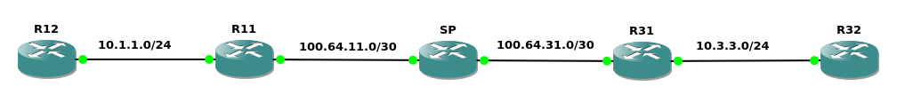

##### Generic Routing Encapsulation(GRE)
GRE配置步骤
```
1.创建tunnel接口
(config)# interface tunnel <tunnel_number>

2.配置tunnel local使用的物理接口(或物理IP地址, 可使用loopback接口)
(config-if)# tunnel source {<interface> | <ip_address>}

3.配置tunnel destination物理IP地址
(config-if)# tunnel destination <ip_address>

4.tunnel接口配置IP地址
(config-if)# ip address <ip_address> <subnet_mask>

*5.配置tunnel接口的bandwidth
(config-if)# bandwidth <bandwidth>
```
<br>
<br>

图1<br>
<br>

图2<br>
<br>

示例1(如图1)
```
R1(config)# router ospf 1
R1(config-router)# network 10.10.10.0 0.0.0.255 area 0
R1(config-router)# network 1.1.1.1 0.0.0.0 area 0

R2(config)# router ospf 1
R2(config-router)# network 10.10.10.0 0.0.0.255 area 0
R2(config-router)# network 172.16.10.0 0.0.0.255 area 0
R2(config-router)# network 2.2.2.2 0.0.0.0 area 0

R3(config)# router ospf 1
R3(config-router)# network 172.16.0.0 0.0.255.255 area 0
R3(config-router)# network 3.3.3.3 0.0.0.0 area 0

R4(config)# router ospf 1
R4(config-router)# network 172.16.20.0 0.0.0.255 area 0
R4(config-router)# network 10.10.20.0 0.0.0.255 area 0
R4(config-router)# network 4.4.4.4 0.0.0.0 area 0

R5(config)# router ospf 1
R5(config-router)# network 10.10.20.0 0.0.0.255 area 0
R5(config-router)# network 5.5.5.5 0.0.0.0 area 0


R2(config)# interface tunnel 0 
R2(config-if)# tunnel source f0/1
R2(config-if)# tunnel destination 172.16.20.4
R2(config-if)# ip address 192.168.10.2 255.255.255.0

R4(config)# interface tunnel 0
R4(config-if)# tunnel source f0/0
R4(config-if)# tunnel destination 172.16.10.2
R4(config-if)# ip address 192.168.10.4 255.255.255.0


R2# traceroute 192.168.10.4
Type escape sequence to abort.
Tracing the route to 192.168.10.4
VRF info: (vrf in name/id, vrf out name/id)
  1 192.168.10.4 16 msec 40 msec 24 msec

R2# traceroute 4.4.4.4
Type escape sequence to abort.
Tracing the route to 4.4.4.4
VRF info: (vrf in name/id, vrf out name/id)
  1 172.16.10.3 12 msec 8 msec 8 msec
  2 172.16.20.4 12 msec 28 msec 20 msec


示例的GRE packet结构如图2
```
<br>
<br>


引用:<br>
[1] Generic Routing Encapsulation (GRE): https://www.rfc-editor.org/rfc/rfc2784.html

[2] NBMA Next Hop Resolution Protocol (NHRP): https://datatracker.ietf.org/doc/html/rfc2332

[3] NHRP Protocol Applicability Statement: https://datatracker.ietf.org/doc/html/rfc2333
