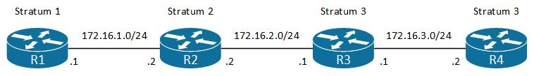

#### 一、TFTP服务器
1.tftp服务器配置
1)安装tftp-hpa<br>
`sudo apt install tftpd-hpa`
<br>
<br>

2)配置文件<br>
```
sudo vi /etc/default/tftpd-hpa
# /etc/default/tftpd-hpa

TFTP_USERNAME="tftp"
TFTP_DIRECTORY="/usr/local/tftp"
TFTP_ADDRESS=":69"
TFTP_OPTIONS="--secure --create"
```
<br>

3)修改文件目录owner/group<br>
```
sudo mkdir -p /usr/local/tftp
sudo chown tftp:tftp /usr/local/tftp
```
<br>

4)启动<br>
`sudo systemctl start tftpd-hpa`
<br>

2.从tftp服务器下载<br>
`# copy tftp flash`
<br>
<br>
<br>

#### 二、NTP服务器
NTP(Network Time Protocol)<br>
网络时间协议, 用于设备之间同步时间, 采用server/client模式, 服务器使用UDP 123端口
<br>

NTP的层级<br>
atomic clock --> stratum 1 --> stratum 2 --> ... --> stratum 15
<br>

NTP角色<br>
1.NTP server<br>
配置<br>
`(config)# ntp master <stratum_num>`
<br>

2.NTP client<br>
配置<br>
`(config)# ntp server <server_add>`
<br>

3.NTP peer<br>
互相充当server/client. 配置<br>
`(config)# ntp peer <peer_add>`
<br>

查看时间与日期<br>
`# show clock [detail]`
<br>

<br>
配置实例
```
R1(config)# router ospf 1
R1(config-router)# router-id 1.1.1.1
R1(config)# int f0/0
R1(config-if)# ip add 172.16.1.1 255.255.255.0
R1(config-if)# no shutdown
R1(config-if)# ip ospf 1 area 0
R1(config)# ntp master 1

R2(config)# router ospf 1
R2(config-router)# router-id 2.2.2.2
R2(config)# int f0/0
R2(config-if)# ip add 172.16.1.2 255.255.255.0
R2(config-if)# no shutdown
R2(config-if)# ip ospf 1 area 0
R2(config)# int f0/1
R2(config-if)# ip add 172.16.2.2 255.255.255.0
R2(config-if)# no shutdown
R2(config-if)# ip ospf 1 area 0
R2(config)# ntp server 172.16.1.1

R3(config)# router ospf 1
R3(config-router)# router-id 3.3.3.3
R3(config)# int f0/0
R3(config-if)# ip add 172.16.2.1 255.255.255.0
R3(config-if)# no shutdown
R3(config-if)# ip ospf 1 area 0
R3(config)# int f0/1
R3(config-if)# ip add 172.16.3.1 255.255.255.0
R3(config-if)# no shutdown
R3(config-if)# ip ospf 1 area 0
R3(config)# ntp server 172.16.2.2
R3(config)# ntp peer 172.16.3.2

R4(config)# router ospf 1
R4(config-router)# router-id 4.4.4.4
R4(config)# int f0/0
R4(config-if)# ip add 172.16.3.2 255.255.255.0
R4(config-if)# no shutdown
R4(config-if)# ip ospf 1 area 0
R4(config)# ntp server 172.16.2.2
R4(config)# ntp peer 172.16.3.1


R1#show ntp status
Clock is synchronized, stratum 1, reference is .LOCL.
nominal freq is 250.0000 Hz, actual freq is 250.0000 Hz, precision is 2**19
ntp uptime is 127100 (1/100 of seconds), resolution is 4000
reference time is E9103C6C.6D8E8A50 (10:16:12.427 UTC Tue Nov 28 2023)
clock offset is 0.0000 msec, root delay is 0.00 msec
root dispersion is 0.32 msec, peer dispersion is 0.23 msec
loopfilter state is 'CTRL' (Normal Controlled Loop), drift is 0.000000000 s/s
system poll interval is 16, last update was 7 sec ago.
R1#show ntp association

  address         ref clock       st   when   poll reach  delay  offset   disp
*~127.127.1.1     .LOCL.           0     10     16   377  0.000   0.000  0.233
 * sys.peer, # selected, + candidate, - outlyer, x falseticker, ~ configured

R2#show ntp status
Clock is synchronized, stratum 2, reference is 172.16.1.1     
nominal freq is 250.0000 Hz, actual freq is 250.0000 Hz, precision is 2**19
ntp uptime is 126000 (1/100 of seconds), resolution is 4000
reference time is E9103BBA.6EA8E07A (10:13:14.432 UTC Tue Nov 28 2023)
clock offset is -6.2488 msec, root delay is 11.92 msec
root dispersion is 16.75 msec, peer dispersion is 3.13 msec
loopfilter state is 'CTRL' (Normal Controlled Loop), drift is -0.000000195 s/s
system poll interval is 64, last update was 190 sec ago.
R2#show ntp association

  address         ref clock       st   when   poll reach  delay  offset   disp
*~172.16.1.1      .LOCL.           1      8     64   377 11.920  -6.248  3.754
 * sys.peer, # selected, + candidate, - outlyer, x falseticker, ~ configured

R3#show ntp status
Clock is synchronized, stratum 3, reference is 172.16.2.2     
nominal freq is 250.0000 Hz, actual freq is 249.9999 Hz, precision is 2**16
ntp uptime is 97900 (1/100 of seconds), resolution is 4016
reference time is E9103C5F.7E481404 (10:15:59.493 UTC Tue Nov 28 2023)
clock offset is 5.8873 msec, root delay is 31.76 msec
root dispersion is 31.26 msec, peer dispersion is 2.43 msec
loopfilter state is 'CTRL' (Normal Controlled Loop), drift is 0.000000186 s/s
system poll interval is 128, last update was 29 sec ago.
R3#show ntp association

  address         ref clock       st   when   poll reach  delay  offset   disp
*~172.16.2.2      172.16.1.1       2     52    128   377 19.845   5.887  2.430
 ~172.16.3.2      172.16.2.2       3     18    128   336  9.486 -44.087  3.422
 * sys.peer, # selected, + candidate, - outlyer, x falseticker, ~ configured

R4#show ntp status
Clock is synchronized, stratum 3, reference is 172.16.2.2     
nominal freq is 250.0000 Hz, actual freq is 249.9993 Hz, precision is 2**19
ntp uptime is 95400 (1/100 of seconds), resolution is 4016
reference time is E9103C67.B7AFFC3E (10:16:07.717 UTC Tue Nov 28 2023)
clock offset is 33.7940 msec, root delay is 43.87 msec
root dispersion is 70.65 msec, peer dispersion is 2.34 msec
loopfilter state is 'CTRL' (Normal Controlled Loop), drift is 0.000002620 s/s
system poll interval is 128, last update was 25 sec ago.
R4#show ntp association

  address         ref clock       st   when   poll reach  delay  offset   disp
*~172.16.2.2      172.16.1.1       2     50    128   377 31.961  33.794  2.346
 ~172.16.3.1      172.16.2.2       3     26    128     3 11.950  31.492 63.212
 * sys.peer, # selected, + candidate, - outlyer, x falseticker, ~ configured
```
