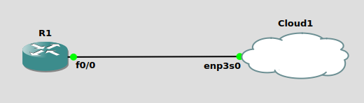

组件:<br>
1.client<br>
GNS3 all-in-one, 其中的client提供GUI给使用者<br>

2.server<br>
1)本地GNS3服务器(Linux系统推荐)<br>
使用与all-in-one相同的本地计算机, 并且使用当前系统, 其中的server提供环境, 对路由器/交换机等进行环境模拟<br>

2)本地GNS3 Virtual Machine(Windows/Mac系统推荐)<br>
使用与all-in-one相同的本地计算机, 并且安装虚拟机操作系统镜像(利用VMware Workstation/Virtualbox/Hyper-V), 对路由器/交换机等环境进行模拟<br>

3)远程GNS3 Virtual Machine<br>
使用远程计算机, 并且安装虚拟机操作系统镜像(利用VMware ESXi或cloud), 对路由器/交换机等环境进行模拟<br>

** 建议使用VM方式, 可以获得更完整的路由器/交换机特征模拟<br>
<br>
<br>


Cisco拓扑类型:<br>
1.物理设备<br>
最完美真实环境, 但费用高昂<br>

2.官方模拟环境<br>
VIRL(Virtual Internet Routing Lab), Cisco官方提供方式, 获得完整支持, 但需要交年费使用<br>

3.Cisco Packet Tracer<br>
提供简单环境模拟, 但支持不完善<br>

4.GNS3<br>
提供如下镜像方式:<br>
1)Dynamips<br>
使用真实IOS镜像文件, 模拟1700/2600/3600/3700/7200路由器, 1700/2600不建议<br>
镜像可以从本地IOS设备复制或网上下载, 文件后缀为image<br>

2)IOU(IOS on Unix)<br>

3)virtualbox/vmware vm<br>
使用虚拟机的操作系统与Router/Switch/ASA连接<br>
** Windows手动配置IP<br>
控制面板 -- 网络和Internet -- 网络和共享中心 -- 更改适配器设置 -- 右键单击以太网卡 -- 选择'属性' -- 选择'Internet协议版本4(TCP/IPv4)' -- 属性 -- 手动配置IP地址/子网掩码/网关<br>
** GNU/Linux手动配置IP<br>
sudo ifconfig eth0 192.168.1.10 netmask 255.255.255.0 up<br>
sudo route add default gw 192.168.1.1<br>
<br>


Ubuntu 20.04下安装GNS3<br>
1.添加PPA源<br>
sudo add-apt-repository ppa:gns3/ppa<br>
sudo apt update<br>

2.安装gns3<br>
sudo apt install gns3-gui gns3-server<br>

3.IOU安装<br>
1)下载CiscoIOUKengen.py<br>
curl --socks5 127.0.0.1:1080 -O https://raw.githubusercontent.com/obscur95/gns3-server/master/IOU/CiscoIOUKeygen.py<br>

2)生成license<br>
python3 CiscoIOUKengen.py<br>

3)将生成内容记录在iourc.txt<br>
[license]<br>
<host_name> = xxxxxxxx;<br>

4)上传iourc.txt和L2/L3 IOU<br>
上传iourc.txt:<br>
GNS3  -->  Edit  -->  Preferences  -->  IOS on UNIX  -->  Browse<br>
上传L2/L3 IOU<br>
GNS3  -->  Edit  -->  Preferences  -->  IOU Devices  -->  New<br>
<br>


Windows 10下安装GNS3<br>
1.下载GNS3<br>
下载地址: https://www.gns3.com/software/download<br>

2.安装GNS3<br>

3.下载VirtualBox系统镜像<br>
下载地址: https://www.gns3.com/software/download-vm<br>

4.下载VirtualBox并安装<br>
下载地址: https://download.virtualbox.org/virtualbox/7.0.12/VirtualBox-7.0.12-159484-Win.exe<br>

5.将VirtualBox系统镜像导入VirtualBox<br>
file  -->  import appliance  -->  选择VirtualBox系统镜像<br>

6.GNS3上编辑使用系统镜像<br>
Edit  -->  Preferences  -->  GNS3 VM  -->  Enable the gns3 vm, 配置其他选项, 点击'apply', 然后点击'OK'<br>
** 显示eth0未配置时, 需重启计算机<br>

7.IOU安装<br>
1)下载CiscoIOUKengen.py<br>
下载地址: https://raw.githubusercontent.com/obscur95/gns3-server/master/IOU/CiscoIOUKeygen.py<br>

2)将CiscoIOUKengen.py上传到vm<br>
scp CiscoIOUKeygen.py gns3@<gns3_vm_ip>:~<br>
passwd: gns3<br>

3)在虚拟机生成license<br>
python3 CiscoIOUKengen.py<br>

4)将生成内容记录在本地iourc.txt<br>
[license]<br>
gns3vm = xxxxxxxx;<br>

5)上传iourc.txt和L2/L3 IOU<br>
上传iourc.txt:<br>
GNS3  -->  Edit  -->  Preferences  -->  IOS on UNIX  -->  Browse<br>
上传L2/L3 IOU<br>
GNS3  -->  Edit  -->  Preferences  -->  IOU Devices  -->  New<br>
<br>


Ubuntu下, IOU问题集锦:<br>
1.not executable<br>
`sudo chmod 700 xxx.bin`<br>

2.libcrypto.so.4 cannot be found<br>
32-bit binary support is probably not installed<br>
```
sudo dpkg --add-architecture i386
sudo apt-get update
sudo apt-get install libc6:i386 libstdc++6:i386
sudo apt search libssl
sudo apt-get install libssl3:i386
sudo ln -s /lib/i386-linux-gnu/libcrypto.so.3 /lib/i386-linux-gnu/libcrypto.so.4
```
<br>
<br>

VPCS命令汇总<br>
设置IPv4/IPv6地址<br>
```
ip 192.168.1.250 255.255.255.0 192.168.1.1
ip 192.168.1.250 /24 192.168.1.1
ip 2001:db8::1 /64
```

通过DHCP获得IPv4地址<br>
`ip dhcp`<br>

通过SLAAC获取IPv6地址<br>
`ip auto`<br>

ping网络连通<br>
`ping 192.168.1.100 -c 5`<br>
<br>


GNS3连接到Internet<br>
如下图<br>
<br>
** enp3s0为实体主机的ethernet网卡(非wifi网卡)<br>
点击cloud1 -- configure -- ethernet interfaces, 确认ethernet网卡在列表中<br>
R1路由器配置:<br>
```
R1(config)# int f0/0
R1(config-if)# ip address dhcp
R1(config-if)# no shutdown
R1(config-if)# do ping 120.232.145.144
```
<br>

最后编辑于: 2024-01-07
