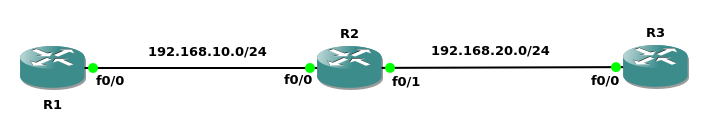
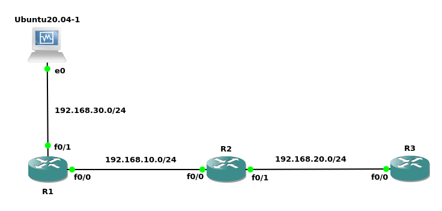
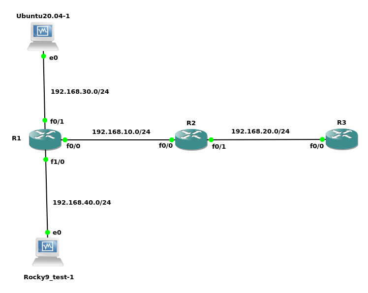
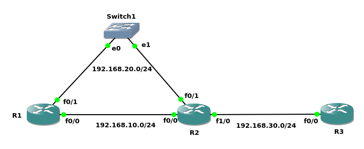

##### AAA(Authentication/Authorization/Accounting)
RADIUS(Remote Authentication Dial In User Service)<br>
It defines an architecture that authenticates and grants authorization to users and accounts for their activity<br>

official web:<br>
https://freeradius.org/<br>

模型:<br>
RADIUS server -- RADIUS client (Network Access Server, NAS) -- User/NAC(Network Access Client)
<br>
<br>

1.Ubuntu 20.04安装FREERADIUS
```
安装FREERADIUS
sudo apt-get install freeradius

打开防火墙接口
# ufw allow 1812/udp
# ufw allow 1812/udp
# ufw status | grep 181

** RADIUS端口
UDP 1812 - authentication
UDP 1813 - accounting


测试是否正确安装
# systemctl stop freeradius
# freeradius -X
...
Ready to process requests
```
<br>

2.Rocky 9安装FREERADIUS
```
安装FREERADIUS
sudo yum install freeradius

打开防火墙接口
[steven@localhost yum.repos.d]$ sudo firewall-cmd --add-port=1812/udp
[steven@localhost yum.repos.d]$ sudo firewall-cmd --add-port=1813/udp
[steven@localhost yum.repos.d]$ sudo firewall-cmd --list-ports

** RADIUS端口
UDP 1812 - authentication
UDP 1813 - accounting


测试是否正确安装
# radiusd -X
...
Ready to process requests

错误提示: <br>
Unable to check file "/etc/raddb/certs/server.pem": No such file or directory<br>

解决方案:<br>
cd  /etc/raddb/certs
./bootstrap
```
<br>
<br>

配置文件目录<br>
Ubuntu 20.04<br>
/etc/freeradius/3.0<br>

Rocky 9<br>
/etc/raddb
<br>
<br>

配置文件
```
<conf_dir>/radiusd.conf
directive
  user - 用户必须要有read权限, 但不必有write权限
  group - 群组必须要有read权限, 但不必有write权限
  max_requests - 队列允许的最大请求数量
<conf_dir>/clients.conf
<conf_dir>/dictionary
<conf_dir>/proxy.conf
<conf_dir>/sites-enabled/default
<conf_dir>/sites-enabled/inner-tunnel
<conf_dir>/users --> <conf_dir>/mods-config/files/authorize
```
<br>
<br>

Authentication配置文件
```
<conf_dir>/client.conf
client <name> {
    ipaddress = <subnet>/<prefix>
    secret = <preshared_key>
}

/etc/freeradius/3.0/users
<user_name>  <attributes>
             <attributes>
             ...
当user_name为DEFAULT时, 匹配所有用户
```
<br>
<br>

users文件匹配规则:<br>
1)从上到下进行匹配, 匹配到合适的项则停止<br>

2)如果Fall-Through=No, 无论如何不再进行向下匹配; 如果Fall-Through=Yes, 无论如何进行向下匹配
<br>
<br>
<br>

图1<br>
<br>

示例1 - Local Database(如图1)
```
配置OSPF
R1(config)# router ospf 1
R1(config-router)# network 192.168.0.0 0.0.255.255 area 0

R2(config)# router ospf 1
R2(config-router)# network 192.168.0.0 0.0.255.255 area 0

R2(config)# router ospf 1
R2(config-router)# network 192.168.0.0 0.0.255.255 area 0


AAA
R1(config)# aaa new-model
R1(config)# username david secret testing123
R1(config)# aaa authentication login VTY local
R1(config)# aaa authentication login CONSOLE local
R1(config)#line vty 0 4
R1(config-line)# transport input all
R1(config-line)# login authentication VTY
R1(config-line)# line console 0
R1(config-line)# login authentication CONSOLE
R1(config)# enable secret testing456
R1(config)# aaa authentication enable default enable


VTY登录测试
R3# telnet 192.168.1.1
Username: david
Password: testing123
R1> enable
Password: testing456
```
<br>
<br>

图2<br>
<br>

示例2 - RADIUS测试(如图2)
```
配置FREERADIUS服务器
配置NAS信息
vi /etc/freeradius/3.0/clients.conf
client Mydomain {
    ipaddr = 192.168.0.0/16
    secret = test123
}

配置User信息
vi /etc/freeradius/3.0/users
pearson    Cleartext-Password := "testing789"
           Reply-Message := "Hello, %{User-Name}"
           
# freeradius -X


配置NAS
配置OSPF
R1(config)# router ospf 1
R1(config-router)# network 192.168.0.0 0.0.255.255 area 0

R2(config)# router ospf 1
R2(config-router)# network 192.168.0.0 0.0.255.255 area 0

R2(config)# router ospf 1
R2(config-router)# network 192.168.0.0 0.0.255.255 area 0


配置RADIUS
R1(config)# aaa new-model
R1(config)# username david secret testing123
R1(config)# radius server RADSRV
R1(config-radius-server)# address ipv4 192.168.30.2 auth-port 1812 acct-port 1813
R1(config-radius-server)# key test123
R1(config)# aaa authentication login VTY group radius local
R1(config)# aaa authentication login CONSOLE group radius local
R1(config)# line vty 0 4
R1(config-line)# transport input all
R1(config-line)# login authentication VTY
R1(config-line)# line console 0
R1(config-line)# login authentication CONSOLE
R1(config)# enable secret testing456
R1(config)# aaa authentication enable default enable


VTY登录测试
R3# telnet 192.168.1.1
Username: pearson
Password: testing789
R1> enable
Password: testing456
```
<br>
<br>

图3<br>
<br>

示例3 - RADIUS GROUP(如图3)
```
Ubuntu配置FREERADIUS服务器
配置NAS信息
vi /etc/freeradius/3.0/clients.conf
client Mydomain {
    ipaddr = 192.168.0.0/16
    secret = test123
}

配置User信息
vi /etc/freeradius/3.0/users
pearson    Cleartext-Password := "testing789"
           Reply-Message := "Hello, %{User-Name}"
           
# freeradius -X


Rocky配置FREERADIUS服务器
配置NAS信息
vi /etc/raddb/clients.conf
client Mydomain {
    ipaddr = 192.168.0.0/16
    secret = test123
}

配置User信息
vi /etc/raddb/users
pearson    Cleartext-Password := "testing789"
           Reply-Message := "Hello, %{User-Name}, here is robot 2"
           
# freeradius -X


配置NAS
配置OSPF
R1(config)# router ospf 1
R1(config-router)# network 192.168.0.0 0.0.255.255 area 0

R2(config)# router ospf 1
R2(config-router)# network 192.168.0.0 0.0.255.255 area 0

R2(config)# router ospf 1
R2(config-router)# network 192.168.0.0 0.0.255.255 area 0


配置RADIUS
R1(config)# aaa new-model
R1(config)# username david secret testing123
R1(config)# radius server RADSRV_01
R1(config-radius-server)# address ipv4 192.168.30.2 auth-port 1812 acct-port 1813
R1(config-radius-server)# key test123
R1(config)# radius server RADSRV_02
R1(config-radius-server)# address ipv4 192.168.40.2 auth-port 1812 acct-port 1813
R1(config-radius-server)# key test123
R1(config)# aaa group server radius RADIUS_GROUP
R1(config-sg-radius)# server name RADSRV_01
R1(config-sg-radius)# server name RADSRV_02
R1(config-sg-radius)# ip radius source-interface loopback0
R1(config)# aaa authentication login VTY group RADIUS_GROUP local
R1(config)# aaa authentication login CONSOLE group RADIUS_GROUP local
R1(config)# line vty 0 4
R1(config-line)# transport input all
R1(config-line)# login authentication VTY
R1(config-line)# line console 0
R1(config-line)# login authentication CONSOLE
R1(config)# enable secret testing456
R1(config)# aaa authentication enable default enable
** ip radius source-interface用于NAS使用指定接口向RADIUS/TACACS server发起请求


VTY登录测试
R3# telnet 192.168.1.1
Username: pearson
Password: testing789
R1> enable
Password: testing456
```
<br>
<br>

##### Unicast Reverse Path Forwarding(uRPF)
三种模式<br>
1.Strict<br>
检查input packet的source IP, 并根据当前路由(非默认路由)到该source IP的egress interface, 如果与接收该packet的ingress interface为同一个接口, 则该packet通过; 否则丢弃该packet
<br>

2.Loose<br>
检查input packet的source IP, 并检查当前路由表是否有到该source IP的路由(非默认路由), 如果有, 则该packet通过; 否则丢弃该packet
<br>

3.VRF<br>
类似于Loose模式, 但
<br>
<br>

配置方法:
```
(config-if)# ip verify unicast source reachable-via {rx | any} [allow-default] [allow-self-ping] [<acl_num>]

参数列表:
rx代表strict模式; any代表loose模式
allow-default允许使用默认路由
allow-self-ping允许ping自己的接口IP

** 必须开启CEF(Cisco Express Forwarding)
```
<br>
<br>

图4<br>
<br>

图5<br>
<br>

示例4(如图4)
```
R1(config)# router ospf 1
R1(config-router)# network 192.168.0.0 0.0.255.255 area 0
R1(config-router)# int f0/0
R1(config-if)# ip ospf cost 2

R2(config)# router ospf 1
R2(config-router)# network 192.168.0.0 0.0.255.255 area 0
R2(config-router)# int f0/1
R2(config-if)# ip ospf cost 2

R3(config)# router ospf 1
R3(config-router)# network 192.168.0.0 0.0.255.255 area 0


strict模式
R1# ping 192.168.20.2 source 192.168.1.1
!!!!!
路径如图5

R2(config)# int f0/1
R2(config-if)# ip verify unicast source reachable-via rx

R1# ping 192.168.20.2 source 192.168.1.1
.....


loose模式
R2(config)# int f0/1
R2(config-if)# no ip verify unicast source reachable-via rx
R2(config-if)# ip verify unicast source reachable-via any

R1# ping 192.168.20.2 source 192.168.1.1
!!!!!


# show cef interface f0/1 | include RPF
  IP unicast RPF check is enabled

R2# show ip traffic
```
<br>
<br>
